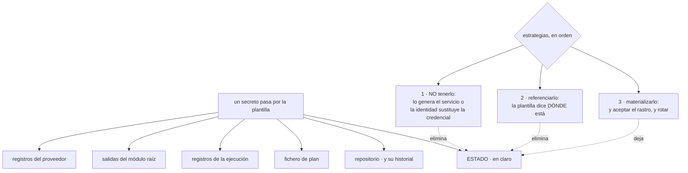

# 092 — Secretos y datos sensibles en IaC

> [← Clase anterior](../../part-07-infrastructure-as-code-configuration/091-validacion-lint-pruebas-y-policy-as-code/README.md) · [Índice de la parte](../README.md) · [Clase siguiente →](../../part-07-infrastructure-as-code-configuration/093-cloudformation-bicep-pulumi-y-terraform/README.md)

**Parte:** 07 — Infraestructura como código y configuración<br>
**Nivel:** intermedio-avanzado · **Horas estimadas:** 4<br>
**Laboratorio:** `security` · **Estado:** `EXECUTABLE_CORE`

## 🎯 Propósito

Manejar secretos en infraestructura como código, que es donde la ley 11 del programa —**lo que un sistema de solo añadir «borra» sigue siendo recuperable**— se cobra sus peores casos. Un secreto que pasa por una plantilla deja rastro en seis sitios, y solo uno de ellos es el repositorio. La clase ordena las tres estrategias posibles, empezando por la única que resuelve el problema de raíz, y cierra con la auditoría que reúne los cinco escapes que este programa ha ido encontrando desde la clase 047.

## 📚 Resultados de aprendizaje

Al finalizar podrás:

1. **Enumerar** los seis lugares donde un secreto deja rastro al pasar por una plantilla.
2. **Elegir** entre no tener el secreto, referenciarlo o materializarlo, en ese orden.
3. **Explicar** qué protege y qué no protege marcar un valor como sensible.
4. **Rotar** sin que la rotación produzca desviación permanente.
5. **Auditar** los rastros con una comprobación ejecutable en la canalización.

## 🧩 Conceptos centrales

| Concepto | Comprensión verificable |
|---|---|
| `rastro de un secreto` | Cada sitio donde queda una copia al pasar por la plantilla: repositorio, estado, fichero de plan, registros de la ejecución, salidas y registros del propio proveedor. |
| `no tener el secreto` | Estrategia en la que el valor nunca existe para la plantilla: lo genera y lo custodia el servicio, o la autenticación es por identidad y no hay credencial. |
| `referencia en vez de valor` | La plantilla declara **dónde está** el secreto y no su contenido. Quien lo consume lo resuelve al ejecutar (clases 058, 076). |
| `marca de sensible` | Oculta el valor en la salida por pantalla. **No lo cifra en el estado ni en el fichero de plan**, así que no es una protección de almacenamiento. |
| `valor efímero` | Argumento que se usa durante la operación y **no se guarda en el estado**. Es la dirección en la que evolucionan las herramientas y la única solución estructural. |
| `desviación por rotación` | Efecto de que la plantilla declare un valor que otro sistema rota. Cada plan propone devolverlo, y cada aplicación deshace la rotación. |

## 🧠 Modelo mental

IaC trata la infraestructura como producto versionado: el plan explica intención, el estado conecta intención y realidad, y la revisión reduce cambios accidentales.

Aplicado a esta clase, separa siempre cuatro planos: **intención** (qué necesita el usuario),
**configuración** (qué declaramos), **estado observado** (qué existe de verdad) y
**evidencia** (cómo sabemos que cumple). Confundirlos produce diseños que se ven correctos
en un diagrama pero fallan al operar.

## 🗺️ Flujo de razonamiento



## 📖 Desarrollo

### 1. Seis rastros, y solo uno es el repositorio

Cuando un secreto pasa por una plantilla, queda en más sitios de los que se supone. Conviene la lista completa porque las auditorías suelen revisar el primero y ninguno de los otros cinco:

```text
1. el repositorio          y su HISTORIAL: borrarlo del fichero no lo borra
2. el ESTADO              en claro, siempre (clases 059, 087)
3. el fichero de plan     contiene los valores de lo que va a crear
4. los registros de la ejecución  si algo falla, el mensaje puede incluirlo
5. las salidas            si se expone, queda en el estado (clase 089)
6. los registros del proveedor    la llamada a la API queda registrada
```

Los rastros 1 y 2 son los que este programa ya ha pagado. El 1 en las clases 061 y 066 —el token en una capa, el fichero de entorno versionado—; el 2 en las clases 059 y 087 —catorce personas leyendo siete contraseñas—.

El **3** merece atención porque es reciente y se olvida: un plan guardado que se publica como artefacto de la canalización contiene los valores de todo lo que va a crear. Si el artefacto se conserva treinta días y lo puede descargar cualquiera del equipo, el secreto ha viajado a un sistema más, con otra retención y otros permisos.

El **4** aparece en los peores momentos:

```bash
$ TF_LOG=DEBUG terraform apply     # ← imprime cuerpos de petición
```

Esa variable se activa para depurar un problema y a menudo se queda activada en la canalización. Y con ella, cada credencial que viaja en una llamada a la API queda escrita en los registros del sistema de integración continua, que retiene noventa días.

Y el **6** es el que no se puede evitar: el proveedor registra las llamadas a su API, y algunas incluyen el valor. No hay corrección posible salvo la estrategia 1 de la sección siguiente.

Y la consecuencia general, que ya es la ley 11 del programa en su quinta aparición:

> **Un secreto que ha pasado por una plantilla está comprometido en seis sitios.** La corrección no es limpiar los seis: es no ponerlo ahí.

Y el orden de actuación cuando ya ha pasado, que este programa ha aplicado cinco veces y no cambia:

```text
1. rotar el secreto     estuvo expuesto; el resto es secundario
2. corregir el mecanismo
3. purgar lo que se pueda purgar
```

Invertir el orden —corregir primero y rotar «cuando haya tiempo»— deja la credencial válida en seis sitios recuperables.

### 2. Tres estrategias, y la primera es la que resuelve

**Estrategia 1: que el secreto no exista para la plantilla.**

Es la única que elimina los seis rastros, y tiene dos formas.

La primera: **el servicio lo genera y lo custodia**. Muchos servicios gestionados admiten que su credencial la genere el propio proveedor y la deposite en su gestor de secretos:

```hcl
resource "aws_db_instance" "pedidos" {
  identifier                  = "cls-pedidos"
  manage_master_user_password = true         # el valor NUNCA pasa por aquí
  master_username             = "app"
  # …
}
```

La plantilla nunca ve la contraseña: la genera el servicio, la guarda en el gestor y la rota según su política. El estado guarda una **referencia**, no el valor.

La segunda forma es la que este programa lleva siete clases repitiendo: **que no haga falta ninguna credencial**.

```text
la aplicación se autentica con su identidad de carga
  rol de instancia · identidad administrada · cuenta de servicio
  federada con la nube (clases 026, 038, 050, 069, 080, 083)
→ no hay contraseña que crear, que guardar ni que rotar
```

Séptima aparición, y sigue siendo la mejor respuesta a cualquier pregunta sobre secretos: **el secreto que no existe no se filtra**.

**Estrategia 2: referenciar, no materializar.**

Cuando el valor tiene que existir pero la plantilla no necesita conocerlo, la plantilla declara **dónde está**:

```hcl
# se crea el contenedor del secreto, sin valor
resource "aws_secretsmanager_secret" "api_pago" {
  name = "${local.prefijo}/api-pago"
}

# el valor lo pone otro proceso, fuera de la plantilla
# y quien lo consume lo resuelve al ejecutar (clases 058, 076)
resource "aws_ecs_task_definition" "tienda" {
  container_definitions = jsonencode([{
    secrets = [{ name = "API_PAGO", valueFrom = aws_secretsmanager_secret.api_pago.arn }]
  }])
}
```

El estado guarda el identificador del secreto, que no es sensible. Y quien lo necesita lo lee en ejecución con su propia identidad, con la distinción de las clases 058 y 076 sobre cuándo se resuelve.

**Estrategia 3: materializar, y aceptar el precio.**

Hay casos en los que no queda otra: un servicio que solo acepta el valor en su creación y no admite generación por el proveedor.

```hcl
resource "random_password" "bd" {
  length  = 32
  special = true
}

resource "aws_secretsmanager_secret_version" "bd" {
  secret_id     = aws_secretsmanager_secret.bd.id
  secret_string = random_password.bd.result
}
```

Eso funciona y deja el valor en el estado. Lo que hay que hacer entonces es **declararlo como riesgo y compensarlo**:

```text
el estado en un almacén con acceso mínimo y cifrado (clase 087)
rotación posterior fuera de la plantilla
y el campo declarado como ignorado, para que la rotación no produzca desviación
```

Y la dirección en la que evolucionan las herramientas, que conviene conocer porque cambia el análisis: los **valores efímeros y los argumentos que solo se escriben**, que se usan durante la operación y **no se guardan en el estado**. Donde estén disponibles, convierten la estrategia 3 en aceptable de verdad.

### 3. Lo que la marca de sensible hace y no hace

Es el malentendido más extendido de esta clase:

```hcl
variable "contrasena" {
  type      = string
  sensitive = true
}

output "cadena" {
  value     = local.cadena_conexion
  sensitive = true
}
```

```text
SÍ hace
  oculta el valor en la salida por pantalla del plan y de la aplicación
  propaga la marca a los valores derivados de él
  impide mostrarlo con `terraform output` sin pedirlo explícitamente

NO hace
  no lo cifra en el estado
  no lo cifra en el fichero de plan
  no impide que el proveedor lo registre en su API
  no impide que aparezca en un mensaje de error del proveedor
```

La propagación merece un apunte porque tiene un efecto secundario molesto: si un valor sensible entra en una expresión, **el resultado entero se marca como sensible**, y a veces eso oculta información que hacía falta ver:

```text
(sensitive value)
```

Eso en un plan impide revisar el cambio. La salida no es quitar la marca sino **no mezclar** el valor sensible con lo que hay que poder leer: construir la cadena de conexión donde se consume, no en la plantilla.

Y hay dos protecciones adicionales que sí actúan sobre el almacenamiento:

```text
cifrado del estado en reposo        clase 087; protege del acceso al almacén
cifrado a nivel de valor            algunas herramientas y complementos lo ofrecen
                                    y la clave pasa a ser el activo
```

Y sobre los **valores cifrados en el repositorio**, que es una práctica extendida: funcionan, y hay que decir con precisión qué mueven.

```text
el secreto deja de estar en claro en el repositorio
y la CLAVE que lo descifra pasa a ser el activo que hay que
  custodiar, rotar, auditar y controlar
y el valor descifrado sigue acabando en el estado si se materializa
```

No es peor que las alternativas; es una decisión con su propio coste. Y solo tiene sentido si esa clave está de verdad mejor protegida que el secreto que protege — lo que exige que viva en el gestor de la nube y que su uso esté restringido a la identidad de la canalización.

Y la comprobación honesta que decide si sirve, y que conviene ejecutar una vez:

```bash
$ terraform state pull | grep -c 'BEGIN PRIVATE KEY\|password\|secret_string'
```

Si ese número no es cero, el cifrado del repositorio ha movido el problema y no lo ha resuelto.

### 4. Rotar sin producir desviación

Un secreto creado por la plantilla y rotado por otro sistema produce el conflicto de propiedad de la clase 085, y es especialmente molesto porque **cada aplicación deshace la rotación**.

```text
la plantilla declara el valor
el gestor lo rota a los 90 días
el siguiente plan propone devolverlo al valor de la plantilla
y si alguien aplica, la rotación se pierde y el servicio deja de autenticarse
```

Las tres salidas, en orden de preferencia:

```text
1. que la plantilla no gestione el valor
   crea el contenedor del secreto y nada más (estrategia 2)
   → no hay nada que rotar desde aquí

2. que el servicio lo gestione
   generación y rotación por el proveedor (estrategia 1)

3. declarar el campo como ignorado
   la plantilla pone el valor inicial y no vuelve a mirarlo
```

```hcl
resource "aws_secretsmanager_secret_version" "bd" {
  secret_id     = aws_secretsmanager_secret.bd.id
  secret_string = random_password.bd.result
  lifecycle {
    ignore_changes = [secret_string]     # lo rota el gestor, no la plantilla
  }
}
```

Y la tercera tiene una consecuencia que conviene anticipar: a partir de ahí, **el valor del estado es el inicial y no el actual**. Cualquiera que lea el estado obtiene una credencial que ya no vale, lo que es una mejora accidental de seguridad y una fuente de confusión al depurar.

Y el patrón de dos credenciales de las clases 046 y 058 sigue siendo la única forma de rotar sin ventana de fallo, y aquí tiene una particularidad: **la plantilla no debe participar en la rotación**. Su papel es crear las dos credenciales y las identidades; el intercambio lo hace un proceso, disparado por el evento de caducidad próxima.

Y una advertencia sobre el generador de valores aleatorios, que produce sorpresas al refactorizar:

```text
un valor aleatorio se genera UNA VEZ y se guarda en el estado
si se pierde el estado, se genera OTRO
y si el recurso que lo usa no se recrea, deja de coincidir
```

Por eso un valor aleatorio que es la contraseña de algo debería llevar activada la creación antes de destrucción y, mejor aún, no existir: es la estrategia 1 otra vez.

### 5. La auditoría de los seis rastros

Este programa ha encontrado el mismo tipo de escape en cinco sitios distintos. Reunirlos en una sola comprobación es el entregable de esta clase:

```bash
#!/usr/bin/env bash
# auditoria-secretos.sh
set -euo pipefail
fallos=0

# 1 · repositorio, incluido el historial (clases 061, 066)
echo "— historial del repositorio —"
gitleaks detect --no-banner --redact || fallos=1

# 2 · estado (clases 059, 087, 089)
echo "— estado —"
for d in infra/*/; do
  n=$(terraform -chdir="$d" state pull 2>/dev/null \
      | grep -Eco '"(password|secret_string|private_key|token)"' || true)
  [ "$n" = "0" ] || { echo "  $d: $n campos sensibles"; fallos=1; }
done

# 3 · ficheros de plan publicados como artefacto
echo "— artefactos de plan —"
find . -name '*.tfplan' -newermt '-90 days' -print | tee /tmp/planes
[ ! -s /tmp/planes ] || fallos=1

# 4 · registros de la canalización
echo "— registro detallado activado —"
grep -rn 'TF_LOG' .github/ .gitlab-ci.yml 2>/dev/null && fallos=1 || true

# 5 · salidas del módulo raíz (clase 089)
echo "— salidas —"
for d in infra/*/; do
  terraform -chdir="$d" output -json 2>/dev/null \
    | jq -r 'keys[]' | grep -Ei 'password|secret|token|key' \
    && fallos=1 || true
done

exit $fallos
```

Cinco comprobaciones, una por rastro evitable. La sexta —los registros del proveedor— no se comprueba: se evita con la estrategia 1.

Y la lista de comprobación de la clase, que recoge decisiones de seis partes anteriores:

```text
☐ ningún secreto en el repositorio, ni en el historial
☐ credenciales sustituidas por identidad donde sea posible (7.ª vez)
☐ contraseñas de servicios gestionadas por el propio proveedor
☐ la plantilla crea contenedores de secretos, no valores
☐ ningún secreto como salida del módulo raíz
☐ estado cifrado, con acceso mínimo separado de lectura y escritura
☐ ficheros de plan no publicados como artefacto descargable
☐ registro detallado desactivado en la canalización
☐ campos rotados por otro sistema, declarados como ignorados
☐ auditoría de los cinco rastros, ejecutada en la canalización
☐ procedimiento escrito: rotar primero, corregir después, purgar al final
```

Once puntos. Y el último es el que más veces se hace al revés, con la misma consecuencia: mientras se corrige el mecanismo, la credencial expuesta sigue siendo válida.

Y un cierre que conecta con la parte 08: todo lo anterior protege el secreto **en reposo y en la plantilla**. Lo que ocurre cuando la canalización necesita credenciales para aplicar —y cómo se obtienen sin que existan— es la federación de las clases 026, 038, 050 y 059, y su forma definitiva es materia de entrega continua. Aquí basta con la regla que ya se ha repetido siete veces: **la canalización no tiene claves; tiene identidad**.

## 🔬 Ejemplo trabajado

**CloudShop audita sus secretos reuniendo, por primera vez, todos los escapes que había ido encontrando por separado. La auditoría de los cinco rastros da resultados en cuatro de ellos.**

**Rastro 1 — el historial del repositorio.**

```text
hallazgos                                       6
  ya conocidos y rotados                        2   (clases 061, 066)
  nuevos                                        4
el más antiguo                              hace 3 años
```

Los cuatro nuevos: una clave de acceso en un fichero de ejemplo, dos contraseñas en ficheros de valores borrados hace dos años y un testigo en un mensaje de commit.

```text                                        antes            después
secretos en el historial                        6                6, todos rotados
escaneo del historial en la canalización    no había       en cada cambio
fichero de ejemplo con valores reales           1          plantilla sin valores
```

La cifra no baja porque **el historial no se reescribe**: se rota lo expuesto y se impide que vuelva a ocurrir. Es la ley 11 en su forma más literal.

**Rastro 2 — el estado.**

```bash
$ for d in infra/*/; do echo -n "$d: "; terraform -chdir="$d" state pull \
    | grep -Eco '"(password|secret_string|private_key)"'; done
infra/red/:        0
infra/datos/:      9
infra/plataforma/: 3
infra/tienda/:     2
```

Catorce campos sensibles. Y la clasificación por estrategia posible:

```text
contraseñas de bases de datos                     4   → estrategia 1: el servicio
                                                       las gestiona
claves de API de terceros                         5   → estrategia 2: contenedor
                                                       sin valor
certificados y claves privadas                    3   → estrategia 2
valores aleatorios generados por la plantilla     2   → estrategia 3, aceptada
```

```text                                        antes            después
campos sensibles en el estado                  14                2
contraseñas gestionadas por el proveedor        0                4
secretos con valor puesto por la plantilla      8                0
identidades con acceso a los estados           12                2
credenciales rotadas                            —               14
```

Los dos que quedan son valores aleatorios que un servicio antiguo exige en su creación, con el riesgo declarado y el campo ignorado para que su rotación no produzca desviación.

**Rastro 3 — los ficheros de plan publicados.**

```bash
$ gh run list --limit 200 --json databaseId -q '.[].databaseId' \
  | while read id; do gh run view "$id" --json artifacts \
      -q '.artifacts[]?.name' 2>/dev/null; done | sort | uniq -c
    187 tfplan
```

Ciento ochenta y siete planes guardados como artefacto, descargables por cualquiera del repositorio, con retención de noventa días. Cada uno con los valores de lo que iba a crear.

```text                                        antes            después
planes publicados como artefacto              187                0
lo que se publica en la revisión          el fichero       su representación
                                                            legible, sin valores
                                                            sensibles
retención                                   90 días        no aplica
artefactos purgados                            —              187
```

**Rastro 4 — el registro detallado.**

```bash
$ grep -rn 'TF_LOG' .github/workflows/
.github/workflows/infra.yml:34:      TF_LOG: DEBUG
```

Activado siete meses atrás para depurar un problema de proveedor, y nunca retirado. Los registros de todas las ejecuciones desde entonces contenían cuerpos de petición.

```text                                        antes            después
registro detallado en la canalización       activo         desactivado
ejecuciones con cuerpos de petición
  en los registros                            ~1.400            0
registros purgados                             —            los 7 meses
comprobación que lo impide                 no había      falla si aparece TF_LOG
```

**Rastro 5 — las salidas.**

El hallazgo de la clase 089 ya estaba corregido, y la comprobación automatizada encontró uno más en un estado que no se había revisado:

```text                                        antes            después
salidas con nombre de credencial              1                 0
```

**Y el resultado global de la auditoría.**

```text                                          antes         después
campos sensibles en los estados                 14              2
planes publicados como artefacto               187              0
registro detallado en la canalización        activo       desactivado
salidas con credenciales                         1              0
secretos del historial rotados                   2              6
identidades con acceso a los estados            12              2
credenciales rotadas en el ejercicio             —             21
comprobación de los cinco rastros            no había     en cada cambio
```

Veintiuna credenciales rotadas en una semana. Y el orden importó: **se rotaron todas antes de tocar ninguna plantilla**, porque mientras el mecanismo se corrige la credencial expuesta sigue valiendo.

**Y la conclusión que el equipo escribió.**

```text
de los seis rastros, cuatro tenían hallazgos
ninguno estaba en el repositorio actual — el sitio que sí se revisaba
y el mayor volumen estaba en el rastro que nadie había considerado:
  187 ficheros de plan descargables durante 90 días
```

**La lección que esta clase traslada al resto de la parte 07**: la auditoría de secretos que solo mira el repositorio revisa **uno de seis sitios**, y en este caso el único donde no había nada nuevo. La corrección de fondo no es limpiar los seis rastros sino la estrategia 1 —que el secreto no exista para la plantilla—, que este programa lleva recomendando desde la clase 026 y que aquí elimina catorce de dieciséis casos. **El secreto que no existe no se filtra**, y sigue siendo la respuesta a la mayoría de las preguntas sobre secretos.

## 🧪 Laboratorio guiado

Ejecuta desde la raíz:

```bash
python classes/part-07-infrastructure-as-code-configuration/092-secretos-y-datos-sensibles-en-iac/lab.py
```

El laboratorio selecciona el motor de práctica **`security`** y produce
`lab_result.json`. El escenario, sus comprobaciones y el artefacto esperado corresponden a
esta clase; no requiere credenciales y deja explícito qué debe revalidarse en un sandbox real.

1. Lee `exercise.steps` y formula una predicción antes de ejecutar.
2. Ejecuta la práctica y verifica todos los elementos de `checks`.
3. Provoca el caso de `negative_test` y explica la señal observada.
4. Materializa `modelo-secretos-iac` en `evidence/` usando la plantilla indicada.
5. Para proveedor real, sigue `sandbox.requires`, registra costo y ejecuta `destroy`.

### Evidencia esperada

El artefacto principal es un control con amenaza, mitigación y evidencia. Además, la entrega debe incluir el comando ejecutado,
la salida estructurada y una conclusión que no exceda lo observado.

## 🏆 Reto verificable

Construye **`modelo-secretos-iac`** para el caso CloudShop. Incluye una alternativa descartada,
un supuesto que pueda falsarse, una prueba de fallo y una decisión de rollback.

## ✅ Criterio de aceptación

- [ ] `lab.py` termina con código 0 y genera JSON válido.
- [ ] La entrega conecta al menos tres requisitos con mecanismos verificables.
- [ ] Existe una prueba positiva y una prueba negativa con evidencia.
- [ ] Seguridad, costo y operación aparecen como decisiones, no como anexos.
- [ ] Se declara una limitación y una condición que obligaría a revisar el diseño.
- [ ] Otra persona puede repetir el recorrido sin conocimiento tácito.

## ⚠️ Errores frecuentes

| Síntoma | Causa probable | Corrección |
|---|---|---|
| Una auditoría de secretos revisa el repositorio y no encuentra nada, y aun así hay filtraciones | El repositorio es uno de seis rastros; el estado, los planes publicados y los registros suelen tener más | Audita los cinco rastros evitables con una comprobación ejecutable y elimina el sexto con la estrategia 1. |
| Marcar un valor como sensible no impide que aparezca en el estado | La marca oculta la salida por pantalla; no cifra nada | Trátala como higiene de pantalla y protege el almacenamiento con acceso mínimo y cifrado del estado. |
| Cada plan propone devolver un secreto a su valor anterior | La plantilla declara un valor que otro sistema rota | Que la plantilla cree el contenedor y no el valor, o que el proveedor lo gestione; en último caso, declara el campo como ignorado. |
| Los registros de la canalización contienen cuerpos de petición | El registro detallado se activó para depurar y quedó activado | Desactívalo, purga los registros afectados y añade una comprobación que falle si vuelve a aparecer. |
| Un plan publicado como artefacto contiene los valores de lo que va a crear | Se publica el fichero binario en vez de su representación legible | Publica solo la salida legible sin valores sensibles y no conserves el fichero como artefacto descargable. |
| Un plan muestra `(sensitive value)` donde hacía falta revisar el cambio | Un valor sensible entró en una expresión y marcó todo el resultado | No mezcles el valor sensible con lo que hay que poder leer: construye la cadena donde se consume. |

## 🛡️ Seguridad, ética y costo

Trabaja con cuentas propias o sandboxes autorizados. No publiques secretos, identificadores
reales ni datos personales. Antes de crear recursos pagos define presupuesto, etiquetas y
comando de destrucción; después verifica que no queden recursos huérfanos. Los ejemplos
locales enseñan contratos, pero no certifican cumplimiento ni disponibilidad de producción.

## ❓ Preguntas de comprobación

1. Enumera los seis rastros que deja un secreto al pasar por una plantilla y di cuál no se puede evitar.
2. ¿Cuáles son las tres estrategias, en orden, y cuántos rastros elimina cada una?
3. ¿Qué hace y qué no hace marcar un valor como sensible?
4. ¿Por qué una plantilla que declara el valor de un secreto rotado produce desviación permanente?
5. ¿En qué orden se actúa cuando un secreto ya se ha expuesto, y por qué ese orden?

## 🔗 Referencias

- HashiCorp (2025). *Sensitive data in state* — por qué el estado guarda los valores y cómo protegerlo. <https://developer.hashicorp.com/terraform/language/state/sensitive-data>
- HashiCorp (2025). *Ephemeral values and write-only arguments* — valores que no se guardan en el estado. <https://developer.hashicorp.com/terraform/language/values/ephemeral>
- AWS (2025). *Managed master user password for RDS* — credencial generada y rotada por el servicio. <https://docs.aws.amazon.com/AmazonRDS/latest/UserGuide/rds-secrets-manager.html>
- Gitleaks (2025). *Scanning git history for secrets* — detección en el historial, no solo en el árbol actual. <https://github.com/gitleaks/gitleaks>
- Mozilla (2025). *SOPS: encrypted files in the repository* — cifrado de valores y gestión de la clave. <https://github.com/getsops/sops>
- Documentación oficial vigente del servicio implementado; registra URL y fecha de consulta.

---

> [Evaluación](assessment.md) · [Contrato de clase](lesson.yaml) · [Índice de la parte](../README.md)
