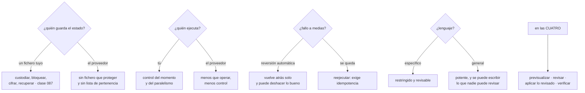

# 093 — CloudFormation, Bicep, Pulumi y Terraform

> [← 092 · Secretos y datos sensibles en IaC](../../part-07-infrastructure-as-code-configuration/092-secretos-y-datos-sensibles-en-iac/README.md) · [Índice de la parte](../README.md) · [094 · Ansible e imagen dorada para configuración →](../../part-07-infrastructure-as-code-configuration/094-ansible-e-imagen-dorada-para-configuracion/README.md)

**Parte:** 07 — Infraestructura como código y configuración<br>
**Nivel:** intermedio-avanzado · **Horas estimadas:** 4<br>
**Laboratorio:** `decision` · **Estado:** `EXECUTABLE_CORE`

## 🎯 Propósito

Comparar las cuatro familias de herramientas por lo que cambia la operación, que son cuatro ejes y ninguno es la sintaxis: **quién guarda el estado, quién ejecuta el motor, qué ocurre cuando una aplicación falla a medias y si el lenguaje es un lenguaje de programación**. Las clases 047 y 059 ya midieron el primero; aquí se completan los otros tres y se llega a la conclusión que este programa lleva sugiriendo desde la parte 03: **la disciplina es la misma en las cuatro, y es lo que decide si funciona**.

## 📚 Resultados de aprendizaje

Al finalizar podrás:

1. **Comparar** las cuatro familias por los ejes que cambian la operación, no por funciones.
2. **Anticipar** qué ocurre cuando una aplicación falla a medias en cada una.
3. **Valorar** el uso de un lenguaje de programación general con sus dos caras.
4. **Elegir** herramienta con un criterio defendible y sabiendo qué se hereda con ella.
5. **Reconocer** la parte de la práctica que no depende de la herramienta.

## 🧩 Conceptos centrales

| Concepto | Comprensión verificable |
|---|---|
| `estado externo frente a estado del proveedor` | O hay un fichero que hay que custodiar, o el propio servicio recuerda lo que gestiona. Decide la mitad de las obligaciones operativas. |
| `motor gestionado` | El proveedor ejecuta el despliegue. No hay estado que proteger ni ejecución que orquestar, y se pierde control sobre el momento y sobre el detalle. |
| `comportamiento ante fallo parcial` | Qué queda cuando la mitad se aplicó y algo falló: reversión automática, o lo aplicado se queda. Cambia por completo el procedimiento de recuperación. |
| `lenguaje general` | Escribir infraestructura en un lenguaje de programación. Da bucles, abstracciones y pruebas conocidas, y **quita la restricción que hacía revisable el resultado**. |
| `retraso del proveedor` | Tiempo entre que una nube publica una función y la herramienta la soporta. Es cero en las herramientas de la propia nube y variable en las demás. |
| `disciplina portable` | Previsualizar, revisar, aplicar lo revisado, verificar convergencia, política sobre el resultado y secretos fuera. Es idéntica en las cuatro familias. |

## 🧠 Modelo mental

IaC trata la infraestructura como producto versionado: el plan explica intención, el estado conecta intención y realidad, y la revisión reduce cambios accidentales.

Aplicado a esta clase, separa siempre cuatro planos: **intención** (qué necesita el usuario),
**configuración** (qué declaramos), **estado observado** (qué existe de verdad) y
**evidencia** (cómo sabemos que cumple). Confundirlos produce diseños que se ven correctos
en un diagrama pero fallan al operar.

## 🗺️ Flujo de razonamiento



## 📖 Desarrollo

### 1. Cuatro ejes, y la sintaxis no es ninguno

Las comparativas habituales enumeran funciones. Los cuatro ejes que de verdad cambian el trabajo diario son otros:

| | Estado | Motor | Fallo parcial | Lenguaje |
|---|---|---|---|---|
| Nativa de la nube (plantillas del proveedor) | Del proveedor | Gestionado | **Revierte solo** | Específico |
| Terraform | Fichero propio | Tuyo | **Se queda** | Específico |
| Lenguaje general con estado | Fichero propio | Tuyo | Se queda | **General** |
| Kit de desarrollo que genera plantillas | Del proveedor | Gestionado | Revierte solo | **General** |

Y las consecuencias de cada columna, que son lo que se hereda al elegir.

**El estado** ya se midió en las clases 047 y 059, y el resumen se sostiene:

```text
fichero propio     hay que custodiarlo, bloquearlo, cifrarlo y recuperarlo
                   → toda la clase 087
                   a cambio: se sabe QUÉ gestiona este código
                   y se detecta que alguien BORRÓ algo

del proveedor      no hay fichero que proteger ni secretos que se filtren por ahí
                   a cambio: no hay lista de pertenencia clara,
                   y detectar un borrado externo depende del servicio
```

**El motor** es el eje que menos se discute y más cambia la operación:

```text
motor gestionado   el proveedor despliega, con su ritmo y sus reintentos
                   no hay agentes que operar, ni bloqueos, ni concurrencia
                   y hay poco control: el paralelismo, el orden fino
                   y los tiempos de espera los decide él

motor propio       control total del momento, del paralelismo y del alcance
                   y hay que operar el agente, su identidad y su bloqueo
```

La segunda fila incluye una ventaja que se nota al depurar: con motor propio se puede aplicar una parte, planificar sin refrescar o reintentar una operación concreta (clase 090). Con motor gestionado, esas herramientas no existen.

**El retraso del proveedor** es un argumento real y suele exagerarse:

```text
herramienta de la propia nube   soporte el mismo día del anuncio
otras                           de días a meses, según el servicio
```

Y su importancia depende de un dato que cada equipo puede medir: **cuántas veces al año necesita una función publicada esta semana**. En la mayoría de las organizaciones la respuesta es pocas, y para esos casos existe la salida de declarar el recurso con la API genérica del proveedor hasta que llegue el soporte.

### 2. Qué pasa cuando falla a medias

Este es el eje que menos aparece en las comparativas y el que más cambia el procedimiento de recuperación.

**Reversión automática.** El motor deshace lo que ya había aplicado y devuelve el conjunto a su estado anterior.

```text
ventaja   nunca queda un estado intermedio que nadie ha probado
coste     la reversión también deshace lo que SÍ funcionó
          y puede fallar ella misma, dejando un estado del que hay que salir a mano
          y en un despliegue grande, tarda
```

La segunda línea produce una situación conocida: el motor intenta revertir un recurso que no se puede eliminar —tiene protección, tiene dependencias, tiene datos— y el conjunto queda en un estado que exige intervención. Y ahí el procedimiento no es evidente y conviene tenerlo escrito **antes**.

**Lo aplicado se queda.** Es el comportamiento de Terraform, y la clase 059 ya lo enunció: no hay transacción.

```text
ventaja   lo que funcionó, funcionó; se corrige y se vuelve a aplicar
coste     hay un estado intermedio real, y hay que asumir que existirá
          → EXIGE que las plantillas sean idempotentes y reejecutables
```

Y de ahí sale la propiedad que este programa lleva pidiendo desde la clase 047: **la respuesta a un fallo parcial es corregir y volver a aplicar**. Una plantilla que solo funciona sobre un entorno vacío no sirve para operar, con ninguna herramienta.

La comparación honesta entre ambos comportamientos:

```text
la reversión automática es mejor para        despliegues acotados y frecuentes
                                             de un conjunto pequeño
lo aplicado se queda es mejor para           conjuntos grandes, donde revertir
                                             todo por un fallo al final es peor
                                             que corregir y continuar
```

Y una coincidencia entre las dos familias que conviene señalar: **ninguna revierte los efectos que no son recursos**. Una migración de datos ejecutada por un gancho, un mensaje publicado, un fichero escrito — nada de eso vuelve atrás. Es el mismo límite que la clase 079 estableció para las vueltas atrás de despliegue, y sigue exigiendo lo mismo: cambios compatibles en ambos sentidos y una pregunta previa —«si esto falla a mitad, ¿qué queda roto?»—.

Y una diferencia operativa que aparece con motores gestionados y sorprende: la **detección de desviación** es una función del propio servicio en algunas plataformas, con lo que se obtiene sin montar la ejecución programada de la clase 090. Y suele tener límites: no todos los tipos de recurso, no todos los campos. Conviene comprobar la cobertura real antes de darla por buena, con la misma desconfianza que la clase 080 aplicó a las políticas de red.

### 3. El lenguaje general: dos caras

Escribir infraestructura en un lenguaje de programación completo resuelve problemas reales y quita una restricción que era útil. Merece las dos columnas.

**Lo que resuelve:**

```text
abstracciones de verdad     clases, funciones, herencia
                            un módulo con lógica compleja se expresa mejor
bucles y condicionales      sin las contorsiones de un lenguaje declarativo
pruebas con las herramientas del lenguaje
                            unitarias, sin desplegar nada
reutilización de código     bibliotecas ya existentes, tipos compartidos
                            con la aplicación
un solo lenguaje            el equipo no aprende una sintaxis más
```

La tercera fila es la más valiosa y la menos citada: se pueden escribir pruebas unitarias sobre la lógica que decide la infraestructura, sin crear nada.

**Lo que quita:**

```text
la restricción que hacía revisable el resultado
```

Un lenguaje declarativo limitado obliga a que el código se parezca al resultado. Con un lenguaje general se puede escribir esto:

```text
una función que lee una base de datos y decide cuántos recursos crear
un bucle cuyo número de iteraciones depende de la hora
una jerarquía de clases de cinco niveles para tres tipos de servicio
```

Y nada de eso es revisable leyendo el código: hay que ejecutarlo para saber qué hace.

Y aquí está la parte que reconcilia las dos columnas y que conviene tener clara antes de elegir:

> **El artefacto de revisión no es el código, es el plan.** Con un lenguaje general, el plan sigue existiendo y sigue siendo el sitio donde se revisa, se aplica la política y se aprueban los borrados.

Eso reduce mucho el riesgo, y no lo elimina: un plan de doscientos recursos generado por un bucle cuyo criterio nadie entiende es revisable en su resultado y no en su intención. Por eso la disciplina que hay que añadir es de estilo:

```text
la lógica que decide QUÉ existe: simple, plana, y probada
la complejidad, en las bibliotecas de apoyo, no en la definición
ninguna consulta a sistemas externos en tiempo de definición
  → hace que el resultado dependa de cuándo se ejecute
```

La tercera es la más importante: una definición que consulta una base de datos o una API para decidir qué crear **no es reproducible**, y rompe la propiedad que hace útil todo lo demás.

Y un matiz sobre los kits de desarrollo que generan plantillas nativas: dan el lenguaje general **y conservan el motor gestionado**, así que heredan la reversión automática y la ausencia de estado propio. Es una combinación coherente y con un coste conocido: el resultado es una plantilla generada, a veces grande y poco legible, y depurar exige leerla.

### 4. Elegir, y qué se hereda con cada elección

Un criterio defendible en cinco preguntas, en orden:

```text
1. ¿una nube o varias?
   una sola y sin previsión de cambiar  → la nativa es una opción seria
   varias, o Kubernetes, o servicios de terceros → una herramienta común

2. ¿quién va a operarlo?
   equipo pequeño sin capacidad de operar agentes → motor gestionado
   equipo de plataforma con canalizaciones → motor propio

3. ¿el equipo ya tiene un lenguaje?
   sí, y la infraestructura la escriben desarrolladores → lenguaje general
   la escribe un equipo de plataforma → específico, más restringido y más legible

4. ¿cuánta lógica hace falta de verdad?
   poca, casi siempre → un lenguaje declarativo basta y se lee mejor

5. ¿qué se hereda?
   → la tabla del primer apartado, entera
```

Y la respuesta más común en organizaciones medianas, dicha sin adornos: **una herramienta común con motor propio y lenguaje específico**, porque cubre varias nubes, Kubernetes y servicios de terceros con un solo flujo, y porque la lógica que hace falta es poca.

Y dos situaciones en las que la nativa gana con claridad:

```text
una sola nube, equipo pequeño, sin canalización de plataforma
  → el motor gestionado quita la mitad del trabajo de las clases 087 y 090

ofrecer plantillas a clientes o a otras organizaciones
  → el formato nativo lo entiende cualquiera de esa nube sin instalar nada
```

Y la situación que aparece de verdad y que ninguna comparativa contempla: **una organización con tres herramientas a la vez**, porque cada equipo eligió la suya. Consolidar cuesta y no consolidar también, y la decisión se toma con dos cifras:

```text
coste de consolidar    reescribir e importar, medible en días-persona
coste de no hacerlo    tres canalizaciones, tres políticas, tres auditorías,
                       tres formaciones y ninguna revisión cruzada posible
```

Y una salida intermedia que funciona mejor de lo que parece: **consolidar la disciplina antes que la herramienta**. Las mismas políticas, la misma secuencia de revisión, el mismo tratamiento de secretos y la misma detección de desviación, con tres herramientas distintas. Eso captura la mayor parte del beneficio y no exige reescribir nada.

Y para migrar de una herramienta a otra, cuando se decide, el procedimiento tiene una forma conocida:

```text
1. la herramienta nueva IMPORTA lo que existe (clase 087)
2. se verifica con una previsualización sin cambios
3. la herramienta antigua deja de gestionarlo, sin destruirlo (clase 090)
4. se retira la antigua cuando ya no gestione nada
```

El paso 3 es el que evita el desastre: **retirar de la gestión, no destruir**. Y el 2 es la comprobación que decide si el paso 1 se hizo bien, exactamente como en la clase 087.

### 5. Lo que no depende de la herramienta

Con cuatro familias comparadas, lo que queda es la conclusión que este programa lleva sugiriendo desde la parte 03: **la mayor parte de la práctica es idéntica**.

```text
previsualizar antes de aplicar             047 · 059 · 081 · 090
aplicar exactamente lo previsualizado      059 · 090
verificar la convergencia después          073 · 085 · 090
revisión legible: sin ruido                047 · 081 · 085 · 090
política sobre el RESULTADO, no el código  091
secretos fuera, y rotar lo expuesto        047 · 059 · 061 · 087 · 092
versiones fijadas de todo                  047 · 059 · 062 · 081 · 088
un estado o alcance por radio de impacto   047 · 059 · 087
proteger lo que no se puede perder         042 · 059 · 077 · 086
identidad federada, sin claves             026 · 038 · 050 · 059 · 092
refactorizar sin destruir                  087 · 090
detección de desviación con señal          085 · 090
```

Doce prácticas, todas presentes en las cuatro familias con nombres distintos, y todas responsables de más incidentes que cualquier decisión de herramienta.

Y los tres criterios que la clase 085 fijó para juzgar una solución de esta parte siguen siendo los mismos y siguen sin depender de la herramienta:

```text
1. ¿se puede ver el cambio antes de aplicarlo, y es legible?
2. ¿lo que se revisó es exactamente lo que se aplica?
3. ¿alguien sabría que el sistema dejó de converger?
```

Y una observación que conviene decir con claridad, porque ahorra discusiones improductivas:

> Un equipo con una herramienta mediocre y las doce prácticas tiene una infraestructura operable. Un equipo con la mejor herramienta y sin ellas tiene los mismos incidentes que tenía antes, con más ficheros.

Y la lista de comprobación de la clase, que es de decisión y no de configuración:

```text
☐ los cuatro ejes evaluados para el caso concreto, no una tabla de funciones
☐ el comportamiento ante fallo parcial, conocido y con procedimiento escrito
☐ si el lenguaje es general: reglas de estilo sobre la lógica de definición
☐ ninguna consulta a sistemas externos en tiempo de definición
☐ si hay varias herramientas: la disciplina consolidada aunque no lo esté la
   herramienta
☐ si se migra: importar, verificar sin cambios, retirar de la gestión, destruir
   nunca
☐ las doce prácticas portables, presentes con independencia de la elección
```

## 🔬 Ejemplo trabajado

**CloudShop tiene tres herramientas de infraestructura como código y una discusión anual sobre cuál usar. El ejercicio de este año se hace midiendo en vez de opinando, y la conclusión no es la que nadie esperaba.**

**El punto de partida.**

```text
equipo de plataforma      Terraform, 4 estados, 88 % de la infraestructura
equipo de datos           plantillas nativas de la nube, 9 %
equipo de aplicación      un kit de desarrollo en el lenguaje de la aplicación, 3 %
```

Y los tres argumentos de la discusión anual, siempre los mismos:

```text
"las plantillas nativas no necesitan estado"
"con el kit escribimos infraestructura en el mismo lenguaje"
"tener tres herramientas es insostenible"
```

**La medición: incidentes por causa, últimos doce meses.**

```text
causa                                          incidentes   herramienta
falta de previsualización revisada                   6      las tres
plantilla no idempotente                             4      las tres
secreto en un rastro no auditado                     3      las tres
desviación no detectada                              5      las tres
recurso destruido sin querer                         2      Terraform, kit
estado perdido o bloqueado                           2      Terraform
reversión automática que falló a medias              1      nativa
lógica de definición imposible de revisar            1      kit
```

Veinticuatro incidentes. **Dieciocho de los veinticuatro son de las doce prácticas portables** y no de la herramienta: ocurrieron con las tres, y habrían ocurrido con cualquier otra.

Los seis restantes sí son atribuibles:

```text
dos por destrucción         falta de protección contra el borrado (clases 059, 086)
dos por el estado           custodia y bloqueo (clase 087)
uno por reversión           el motor gestionado no pudo revertir y quedó a medias
uno por lógica              un bucle en el kit cuyo criterio nadie entendía
```

**La decisión, que no fue consolidar.**

```text                                   coste estimado
consolidar en una herramienta        34 días-persona
consolidar la DISCIPLINA               9 días-persona
```

Y lo que cubría cada opción:

```text
consolidar la herramienta   los 6 incidentes atribuibles, y de rebote
                            facilitaría las prácticas
consolidar la disciplina    los 18 incidentes portables, en las tres herramientas
```

Se hizo la segunda primero. Y las nueve jornadas se repartieron así:

```text
política común sobre el resultado, para las tres            3 días
detección de desviación programada, para las tres           2 días
auditoría de los cinco rastros de secretos (clase 092)      2 días
protección contra destrucción en lo que no se puede perder  1 día
procedimiento escrito de fallo parcial, uno por herramienta 1 día
```

La política común fue lo más interesante del ejercicio: las tres herramientas producen una representación estructurada de lo que van a hacer, así que **las mismas diecinueve reglas se pudieron aplicar a las tres** con adaptadores pequeños.

```text                                        antes            después
reglas de política                     19, solo en Terraform   19, en las tres
detección de desviación                 1 de 3 herramientas    3 de 3
audita rastros de secretos              1 de 3                 3 de 3
procedimiento de fallo parcial escrito  0 de 3                 3 de 3
recursos con protección de borrado      6 de 41               41 de 41
```

**Los seis meses siguientes.**

```text
incidentes de causa portable          18 → 2
incidentes atribuibles a la herramienta 6 → 3
```

Los dos portables restantes fueron plantillas no idempotentes en el kit, corregidas.

Y con esos datos, la decisión sobre consolidar la herramienta se tomó por fin con criterio:

```text
las plantillas nativas se quedan       el equipo de datos es pequeño,
                                       no opera canalizaciones, una sola nube
                                       y el motor gestionado le quita trabajo real
el kit se retira                       3 % de la infraestructura, un incidente
                                       por lógica irrevisable, y el equipo
                                       prefería no mantener dos flujos
Terraform sigue                        cubre varias nubes y Kubernetes
```

La migración del kit se hizo con el procedimiento de esta clase:

```text
recursos importados                     31
verificados con previsualización vacía  31 de 31, a la tercera iteración
retirados de la gestión del kit         31, sin destruir
recursos destruidos en el proceso        0
esfuerzo                                4 días-persona
```

**La conclusión que se escribió, y que cerró la discusión anual.**

```text
de 24 incidentes en un año, 18 no dependían de la herramienta
consolidar la disciplina costó 9 días y eliminó 16 de esos 18
consolidar la herramienta habría costado 34 días y eliminado 6
y la decisión final NO fue una sola herramienta:
  dos, cada una donde su modelo operativo encaja
```

**La lección que esta clase traslada al resto de la parte 07**: la discusión sobre herramientas consume tiempo desproporcionado respecto de lo que decide. **Tres de cada cuatro incidentes eran de las doce prácticas portables**, presentes o ausentes con independencia de la elección. Y cuando por fin se eligió, el criterio no fue cuál es mejor sino **qué modelo operativo encaja con cada equipo**: motor gestionado donde no hay capacidad de operar canalizaciones, motor propio donde hay varias nubes que cubrir.

## 🧪 Laboratorio guiado

Ejecuta desde la raíz:

```bash
python classes/part-07-infrastructure-as-code-configuration/093-cloudformation-bicep-pulumi-y-terraform/lab.py
```

El laboratorio selecciona el motor de práctica **`decision`** y produce
`lab_result.json`. El escenario, sus comprobaciones y el artefacto esperado corresponden a
esta clase; no requiere credenciales y deja explícito qué debe revalidarse en un sandbox real.

1. Lee `exercise.steps` y formula una predicción antes de ejecutar.
2. Ejecuta la práctica y verifica todos los elementos de `checks`.
3. Provoca el caso de `negative_test` y explica la señal observada.
4. Materializa `adr-herramienta-iac` en `evidence/` usando la plantilla indicada.
5. Para proveedor real, sigue `sandbox.requires`, registra costo y ejecuta `destroy`.

### Evidencia esperada

El artefacto principal es una matriz de decisión ponderada y un ADR. Además, la entrega debe incluir el comando ejecutado,
la salida estructurada y una conclusión que no exceda lo observado.

## 🏆 Reto verificable

Construye **`adr-herramienta-iac`** para el caso CloudShop. Incluye una alternativa descartada,
un supuesto que pueda falsarse, una prueba de fallo y una decisión de rollback.

## ✅ Criterio de aceptación

- [ ] `lab.py` termina con código 0 y genera JSON válido.
- [ ] La entrega conecta al menos tres requisitos con mecanismos verificables.
- [ ] Existe una prueba positiva y una prueba negativa con evidencia.
- [ ] Seguridad, costo y operación aparecen como decisiones, no como anexos.
- [ ] Se declara una limitación y una condición que obligaría a revisar el diseño.
- [ ] Otra persona puede repetir el recorrido sin conocimiento tácito.

## ⚠️ Errores frecuentes

| Síntoma | Causa probable | Corrección |
|---|---|---|
| La discusión sobre qué herramienta usar se repite cada año sin resolverse | Se compara por funciones en vez de por los ejes que cambian la operación | Mide los incidentes del último año por causa: la mayoría suele ser de prácticas portables, no de la herramienta. |
| Una aplicación falla a medias y el motor no consigue revertir | La reversión automática intenta eliminar algo protegido o con dependencias | Ten escrito el procedimiento de salida antes de necesitarlo; el comportamiento ante fallo parcial se conoce, no se descubre. |
| Un cambio en el kit genera doscientos recursos y nadie sabe por qué | La lógica de definición usa bucles o consultas cuyo criterio no se puede leer | Reglas de estilo: lógica de definición simple y plana; la complejidad, en bibliotecas de apoyo probadas. |
| El resultado de una ejecución depende de cuándo se ejecute | La definición consulta un sistema externo para decidir qué crear | Prohíbe las consultas en tiempo de definición: rompen la reproducibilidad, que es la propiedad que sostiene todo lo demás. |
| Migrar entre herramientas destruye recursos | Se retiró la antigua antes de que la nueva los gestionara, o se destruyó en vez de retirar de la gestión | Importar, verificar con previsualización vacía, retirar de la gestión sin destruir, y solo entonces retirar la antigua. |
| Se adopta la mejor herramienta y los incidentes siguen igual | Las doce prácticas portables no estaban antes y siguen sin estar | Consolida la disciplina antes que la herramienta: cubre más incidentes por menos esfuerzo. |

## 🛡️ Seguridad, ética y costo

Trabaja con cuentas propias o sandboxes autorizados. No publiques secretos, identificadores
reales ni datos personales. Antes de crear recursos pagos define presupuesto, etiquetas y
comando de destrucción; después verifica que no queden recursos huérfanos. Los ejemplos
locales enseñan contratos, pero no certifican cumplimiento ni disponibilidad de producción.

## ❓ Preguntas de comprobación

1. ¿Cuáles son los cuatro ejes que cambian la operación, y qué se hereda con cada opción?
2. ¿Qué ventaja y qué coste tiene la reversión automática frente a que lo aplicado se quede?
3. ¿Qué resuelve y qué quita usar un lenguaje de programación general, y qué reduce el riesgo?
4. ¿Qué procedimiento sigue una migración entre herramientas sin destruir nada?
5. Enumera cinco de las doce prácticas que no dependen de la herramienta.

## 🔗 Referencias

- AWS (2025). *CloudFormation stack failure options and rollback* — comportamiento ante fallo parcial. <https://docs.aws.amazon.com/AWSCloudFormation/latest/UserGuide/stack-failure-options.html>
- Microsoft (2025). *Bicep vs ARM templates and deployment behaviour* — motor gestionado y modos de despliegue. <https://learn.microsoft.com/en-us/azure/azure-resource-manager/bicep/overview>
- HashiCorp (2025). *Terraform: no partial rollback* — por qué las plantillas deben ser reejecutables. <https://developer.hashicorp.com/terraform/language/resources/behavior>
- Pulumi (2025). *Programming model and preview* — lenguajes generales con previsualización del cambio. <https://www.pulumi.com/docs/concepts/>
- AWS (2025). *CDK: synthesized templates* — generar plantillas nativas desde un lenguaje general. <https://docs.aws.amazon.com/cdk/v2/guide/home.html>
- Documentación oficial vigente del servicio implementado; registra URL y fecha de consulta.

---

> [Evaluación](assessment.md) · [Contrato de clase](lesson.yaml) · [Índice de la parte](../README.md)

| Anterior | Índice | Siguiente |
|---|---|---|
| [← 092 · Secretos y datos sensibles en IaC](../../part-07-infrastructure-as-code-configuration/092-secretos-y-datos-sensibles-en-iac/README.md) | [Parte 07](../README.md) · [Programa](../../README.md) | [094 · Ansible e imagen dorada para configuración →](../../part-07-infrastructure-as-code-configuration/094-ansible-e-imagen-dorada-para-configuracion/README.md) |
