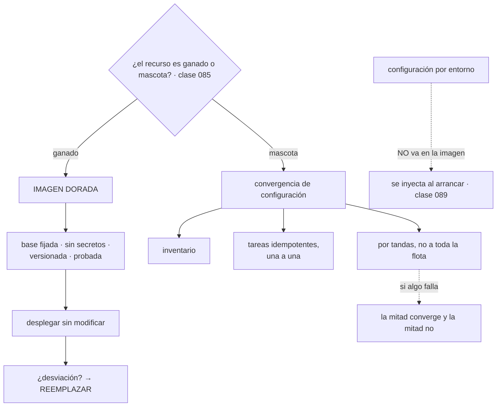

# 094 — Ansible e imagen dorada para configuración

> [← 093 · CloudFormation, Bicep, Pulumi y Terraform](../../part-07-infrastructure-as-code-configuration/093-cloudformation-bicep-pulumi-y-terraform/README.md) · [Índice de la parte](../README.md) · [095 · Plantillas, golden paths y catálogo interno →](../../part-07-infrastructure-as-code-configuration/095-plantillas-golden-paths-y-catalogo-interno/README.md)

**Parte:** 07 — Infraestructura como código y configuración<br>
**Nivel:** intermedio-avanzado · **Horas estimadas:** 4<br>
**Laboratorio:** `configuration` · **Estado:** `EXECUTABLE_CORE`

## 🎯 Propósito

Resolver lo que queda fuera de la infraestructura declarativa: **configurar lo que hay dentro de una máquina**. Hay dos filosofías —hornear la configuración en una imagen y desplegarla inmutable, o crear la máquina y converger su contenido— y la elección no es de gusto: depende de si el recurso es ganado o mascota, la distinción que fijó la clase 085. La clase defiende el orden correcto —imagen primero, gestión de configuración solo para lo que quede— y muestra por qué la idempotencia aquí **es una propiedad de cada tarea y no de la herramienta**.

## 📚 Resultados de aprendizaje

Al finalizar podrás:

1. **Elegir** entre imagen inmutable y convergencia según la naturaleza del recurso.
2. **Construir** una imagen con la misma disciplina de la clase 062: base fijada, sin secretos, versionada.
3. **Escribir** tareas idempotentes de verdad y detectar las que no lo son.
4. **Usar** la simulación de cambios sabiendo qué no puede predecir.
5. **Reducir** la gestión de configuración a los casos que de verdad la necesitan.

## 🧩 Conceptos centrales

| Concepto | Comprensión verificable |
|---|---|
| `imagen dorada` | Imagen de máquina con la configuración ya aplicada. Se despliega sin modificarla, así que **no hay desviación posible dentro**: la corrección de un problema es reemplazar. |
| `convergencia de configuración` | Aplicar tareas sobre una máquina existente hasta alcanzar el estado deseado. Necesaria para lo que no se puede reconstruir. |
| `idempotencia por tarea` | En estas herramientas la propiedad **no la garantiza el motor**: la garantiza cada módulo. Una tarea que ejecuta una orden arbitraria no es idempotente salvo que se la haga. |
| `simulación de cambios` | Ejecución que informa de lo que haría sin hacerlo. Su fidelidad depende de que cada módulo la soporte, así que no es equivalente a un plan. |
| `ejecución por tandas` | Aplicar sobre una fracción de la flota cada vez. Es el despliegue progresivo de la clase 079 en máquinas, y sin ella un error llega a todo a la vez. |
| `canalización de imagen` | Construcción versionada, probada y publicada de la imagen. Es la clase 062 aplicada a máquinas, con las mismas reglas. |

## 🧠 Modelo mental

IaC trata la infraestructura como producto versionado: el plan explica intención, el estado conecta intención y realidad, y la revisión reduce cambios accidentales.

Aplicado a esta clase, separa siempre cuatro planos: **intención** (qué necesita el usuario),
**configuración** (qué declaramos), **estado observado** (qué existe de verdad) y
**evidencia** (cómo sabemos que cumple). Confundirlos produce diseños que se ven correctos
en un diagrama pero fallan al operar.

## 🗺️ Flujo de razonamiento



## 📖 Desarrollo

### 1. Imagen o convergencia: lo decide la clase 085

La pregunta no es cuál herramienta es mejor sino qué es el recurso:

```text
GANADO      se reemplaza sin ceremonia
  → imagen dorada: la configuración va dentro y no se toca
  → la respuesta a cualquier problema es sustituir la máquina

MASCOTA     se cuida y se repara
  → convergencia: hay que llevarla al estado deseado sin destruirla
  → y hay que asumir la desviación como estado normal
```

Y las ventajas del primero, que son las que justifican mover todo lo posible a esa categoría:

```text
arranque rápido        no hay nada que instalar al arrancar
reproducible           dos máquinas de la misma imagen son idénticas
sin desviación dentro  nadie la modifica porque se reemplaza, no se repara
sin dependencias en el arranque
                       una máquina que instala paquetes al arrancar depende
                       de que el repositorio esté disponible EN ESE MOMENTO
probable de verdad     la imagen se prueba una vez y se despliega N
```

La cuarta merece detalle porque produce incidentes en el peor momento: una flota que instala software al arrancar **no puede escalar si el repositorio de paquetes está caído**, y el escalado ocurre justo cuando hay más carga. Con imagen dorada, arrancar no depende de nada externo.

Y el coste que hay que aceptar:

```text
un cambio pequeño exige construir una imagen y reemplazar la flota
  → construir tarda minutos y desplegar, lo que tarde la sustitución (clase 079)
hay que gestionar el ciclo de vida de las imágenes
  → versiones, retención y limpieza
```

Y el error que hay que evitar por encima de todo, que es el de la clase 062 con otro artefacto:

```text
la configuración POR ENTORNO no va dentro de la imagen
  → una imagen por entorno rompe "construir una vez y promover"
  → y lo que se prueba en preproducción deja de ser lo que corre en producción
```

La imagen lleva **lo común**: el sistema endurecido, los agentes, las herramientas, el tiempo de ejecución. Lo que distingue a un entorno se inyecta al arrancar, con los mecanismos de la clase 089.

Y los tres casos en los que la convergencia sigue siendo necesaria, que conviene enumerar para no fingir que no existen:

```text
1. equipos que no se pueden reconstruir
   servidores físicos, sistemas heredados con estado local,
   aparatos de red
2. la construcción de la propia imagen
   la herramienta de configuración es una buena forma de definir qué lleva
3. operaciones puntuales sobre una flota existente
   una rotación, una recogida de evidencia, un parche urgente
   antes de que la imagen nueva esté lista
```

El segundo es el uso más productivo y el menos citado: **la misma herramienta que converge máquinas sirve para definir el contenido de la imagen**, con lo que se aprovecha el conocimiento sin heredar los problemas de la convergencia en producción.

### 2. La canalización de imagen es la clase 062 otra vez

Construir una imagen de máquina tiene exactamente las mismas reglas que construir una de contenedor, y conviene enunciarlas así porque el equipo ya las conoce:

```hcl
source "amazon-ebs" "base" {
  source_ami   = "ami-0a1b2c3d4e5f6"        # fijada, no "la última" (clase 062)
  instance_type = "t3.medium"
  ssh_username  = "admin"
  ami_name      = "cls-base-${local.timestamp}"
  tags = {
    origen_ami  = "ami-0a1b2c3d4e5f6"
    revision    = var.revision                # trazabilidad (clase 061)
    construida  = local.timestamp
  }
}

build {
  sources = ["source.amazon-ebs.base"]

  provisioner "ansible" {
    playbook_file = "configuracion/base.yml"
  }

  provisioner "shell" {
    inline = ["sudo /usr/local/bin/verificar-endurecimiento.sh"]
  }
}
```

Las reglas heredadas de la clase 062, una a una:

```text
base fijada por identificador       y un proceso que proponga actualizarla
sin secretos dentro                  ni en variables, ni en ficheros, ni en
                                     el historial de construcción
lo mínimo necesario                  menos software es menos superficie
capas estables abajo                 lo que cambia poco, primero
versionada y trazable al commit      etiquetas con la revisión
construir una vez y promover         la MISMA imagen en los cuatro entornos
```

Y la que esta clase añade y no existía con contenedores: **la imagen hay que arrancarla y probarla**.

```text
una imagen de contenedor se puede inspeccionar por capas
una imagen de máquina hay que ARRANCARLA para saber si funciona
```

Por eso la canalización termina con una prueba real, que es el equivalente de la prueba negativa de la clase 067:

```bash
# arrancar una instancia de la imagen recién construida y comprobar
$ instancia=$(aws ec2 run-instances --image-id $NUEVA --instance-type t3.micro \
    --query 'Instances[0].InstanceId' --output text)
$ ./esperar-lista.sh $instancia
$ ./verificar-imagen.sh $instancia
✓ arranca y responde                        42 s
✓ el servicio arranca sin red externa       correcto
✓ ningún proceso como usuario cero salvo los del sistema
✓ puertos escuchando: solo los previstos    22, 8080
✓ agente de registro y de métricas activos
✓ sin secretos en el sistema de ficheros    0 coincidencias
✓ actualizaciones de seguridad al día       0 pendientes
7/7 correctas
$ aws ec2 terminate-instances --instance-ids $instancia
```

La segunda comprobación es la que más rinde: **arrancar sin red externa** demuestra que la imagen no depende de descargar nada, que era la ventaja principal.

Y el ciclo de vida de las imágenes, que se descuida y produce dos problemas:

```text
imágenes antiguas sin retirar     coste de almacenamiento e inventario confuso
imágenes en uso retiradas         una plantilla de arranque que apunta a una
                                  imagen borrada NO PUEDE ESCALAR
```

El segundo es el peligroso y es el mismo que la clase 067 encontró con el registro: **la retención se define por referencias, no solo por fecha**. Una imagen referenciada por alguna plantilla de arranque activa no se borra, tenga la antigüedad que tenga.

### 3. La idempotencia aquí es de cada tarea

La clase 085 definió la idempotencia. En las herramientas de configuración hay un matiz importante: **el motor no la garantiza**.

```yaml
# idempotente: el módulo comprueba el estado antes de actuar
- name: Instalar el agente
  ansible.builtin.package:
    name: agente-observabilidad
    state: present

- name: Configurar el agente
  ansible.builtin.template:
    src: agente.conf.j2
    dest: /etc/agente/agente.conf
    owner: agente
    mode: "0640"
  notify: reiniciar agente

# NO idempotente: ejecuta siempre, informa de cambio siempre
- name: Preparar el directorio
  ansible.builtin.shell: mkdir -p /opt/app && chown app /opt/app
```

La tercera tarea se ejecuta en cada pasada, informa de que ha cambiado algo aunque no haya cambiado nada, y contamina el resumen. Y en el peor caso hace algo destructivo cada vez.

Las dos formas de arreglarla:

```yaml
# A · usar el módulo que ya es idempotente
- name: Preparar el directorio
  ansible.builtin.file:
    path: /opt/app
    state: directory
    owner: app
    mode: "0755"

# B · si no hay módulo, declarar cuándo NO hay que ejecutar
- name: Inicializar el almacén
  ansible.builtin.command: /usr/local/bin/init-almacen
  args:
    creates: /var/lib/almacen/.inicializado
```

Y la comprobación que detecta las tareas no idempotentes, que es la de la clase 085 aplicada aquí:

```bash
$ ansible-playbook base.yml            # primera pasada
$ ansible-playbook base.yml | tail -3  # segunda pasada seguida

PLAY RECAP
nodo-14  : ok=42  changed=0  unreachable=0  failed=0
```

**`changed=0` en la segunda pasada** es el criterio. Cualquier otra cifra señala tareas que actúan siempre, y localizarlas es directo:

```bash
$ ansible-playbook base.yml --diff | grep -B3 'changed:'
```

Y la **simulación de cambios** es el equivalente del plan, con una limitación que hay que conocer:

```bash
$ ansible-playbook base.yml --check --diff
```

```text
su fidelidad depende de que CADA módulo la soporte
  los módulos de fichero y paquete la soportan bien
  una orden arbitraria no puede predecir nada: se salta o se ejecuta
y una tarea cuyo resultado depende de otra anterior que no se ejecutó
  puede fallar en la simulación sin que haya ningún problema real
```

Por eso no es equivalente a un plan de infraestructura y no debe tratarse como tal. Es útil y no es una garantía.

Y dos mecanismos que evitan que un error llegue a toda la flota a la vez:

```yaml
- hosts: web
  serial: "20%"                 # por tandas
  max_fail_percentage: 0        # si falla una, se detiene
  any_errors_fatal: false
```

Es el despliegue progresivo de la clase 079 en máquinas, y sin ello una tarea equivocada se aplica a doscientos servidores en dos minutos. Y con volumen alto conviene además comprobar antes en un subconjunto:

```bash
$ ansible-playbook base.yml --limit 'web[0:2]' --check --diff
```

### 4. Inventario, variables y la precedencia otra vez

El **inventario** es la lista de máquinas y sus grupos, y conviene que sea dinámico:

```text
inventario estático    un fichero con nombres; se desincroniza en cuanto
                       la flota es elástica
inventario dinámico    se consulta al proveedor por etiquetas
                       → las etiquetas de las clases 025, 049 y 089 se cobran aquí
```

Y una consecuencia práctica que justifica el trabajo de etiquetado de las clases anteriores: con inventario dinámico, **los grupos son consultas** y no listas que mantener.

```yaml
plugin: amazon.aws.aws_ec2
regions: [eu-west-1]
filters:
  tag:gestionado-por: terraform
keyed_groups:
  - key: tags.sistema
    prefix: sistema
  - key: tags.entorno
    prefix: entorno
```

Y las **variables** repiten el problema de la clase 089 con una versión aún más complicada: hay más de veinte niveles de precedencia. La consecuencia práctica es la misma y la recomendación también:

```text
usar POCOS niveles, y de forma consistente
  variables de grupo         lo común por rol o por entorno
  variables de máquina       solo lo que de verdad es de esa máquina
  variables de ejecución     lo que decide quien lanza, y queda registrado

y evitar el resto
```

Un sistema que usa doce de los veinte niveles es un sistema donde nadie puede predecir de dónde sale un valor, y la depuración pasa por una orden que conviene conocer:

```bash
$ ansible-inventory --host nodo-14 --yaml
$ ansible nodo-14 -m ansible.builtin.debug -a "var=hostvars[inventory_hostname]"
```

Y sobre los **secretos**, la regla es la de la clase 092 y no cambia:

```text
la herramienta ofrece un mecanismo de cifrado en el repositorio
  → funciona, y la clave pasa a ser el activo
mejor: leer del gestor de secretos con la identidad de la máquina
  → séptima aparición: la máquina se autentica con su identidad
```

```yaml
- name: Obtener la credencial
  ansible.builtin.set_fact:
    bd_password: "{{ lookup('amazon.aws.aws_secret', 'cls/bd', region='eu-west-1') }}"
  no_log: true
```

La última línea es obligatoria y se olvida siempre: **sin ella, el valor aparece en la salida de la ejecución**, que es el rastro 4 de la clase 092.

Y una precaución sobre los registros de estas herramientas: por defecto son verbosos y muestran el contenido de los ficheros que escriben. Una plantilla con una contraseña dentro la imprime en la salida salvo que la tarea se marque explícitamente.

### 5. Reducir la convergencia a lo imprescindible

El objetivo de la clase es que quede poco. La secuencia para conseguirlo:

```text
1. inventariar qué configura de verdad la herramienta
2. mover a la imagen todo lo que sea común y estable
3. mover a la inyección en el arranque lo que dependa del entorno
4. dejar en convergencia solo lo que no se puede reconstruir
```

Y el paso 3 merece precisión porque hay tres mecanismos y conviene elegir:

```text
datos de arranque de la instancia   lo que se sabe al crearla; queda visible
                                     en la definición de la instancia
servicio de metadatos                consulta del propio recurso
configuración leída al arrancar      del gestor de configuración o de secretos,
                                     con la identidad de la máquina
```

La tercera es la mejor y es la que hace innecesaria la convergencia para casi todo lo que queda: **la máquina arranca, se identifica y lee lo que le corresponde**.

Y el resultado esperable de este ejercicio, con las cifras que suele dar:

```text                                    antes           después
tareas de configuración                   ~200            ~25
tiempo de arranque de una máquina        varios minutos   menos de un minuto
dependencia de repositorios externos
  al arrancar                              sí              no
desviación dentro de las máquinas       inevitable        imposible: se reemplazan
```

Y la lista de comprobación de la clase:

```text
imagen
  ☐ base fijada, con proceso que proponga actualizarla
  ☐ sin secretos, ni en variables ni en el historial de construcción
  ☐ una sola imagen para todos los entornos
  ☐ versionada y trazable al commit
  ☐ probada arrancándola, incluida la prueba sin red externa
  ☐ retención por referencias, no solo por fecha

convergencia
  ☐ segunda pasada con cero cambios
  ☐ ninguna tarea de orden arbitraria sin condición de omisión
  ☐ ejecución por tandas, con detención ante fallo
  ☐ inventario dinámico por etiquetas
  ☐ pocos niveles de precedencia de variables, y consistentes
  ☐ secretos del gestor con la identidad de la máquina, y sin registrar
  ☐ una lista escrita de por qué cada tarea restante no puede ir en la imagen
```

El último punto es el que mantiene el resultado en el tiempo. Sin él, la lista de tareas vuelve a crecer: cada urgencia añade una, y en dos años se está otra vez en doscientas.

Y el cierre que conecta con la clase siguiente: todo lo anterior produce un artefacto —una imagen probada— y un mecanismo para llevarla a producción. Ofrecer eso a otros equipos, de forma que puedan usarlo sin conocer nada de esta parte, es lo que la clase 095 llama un camino asfaltado.

## 🔬 Ejemplo trabajado

**CloudShop configura su flota de máquinas con doscientas tareas que se ejecutan al arrancar. El arranque tarda seis minutos, hay desviación en un tercio de la flota y un incidente de escalado obliga a revisarlo todo.**

**El incidente que lo desencadenó.**

```text
11:40  pico de tráfico; el escalado pide 12 máquinas nuevas
11:42  las 12 arrancan y empiezan a instalar paquetes
11:43  el repositorio de paquetes de la distribución no responde
11:49  las 12 máquinas siguen sin estar listas
11:52  el escalado pide 8 más; mismo resultado
12:04  el repositorio vuelve; las máquinas terminan de arrancar
```

Veinticuatro minutos sin poder escalar durante un pico, por una dependencia externa **en el momento del arranque**. Y el diagnóstico posterior encontró más:

```text
tiempo medio de arranque              6 min 20 s
desviación: máquinas cuya configuración
  no coincide con la esperada         31 % de la flota
causa de la desviación                tareas ejecutadas en momentos distintos,
                                      con versiones distintas de los paquetes
```

La segunda cifra es la consecuencia inevitable de instalar al arrancar: **dos máquinas creadas con una semana de diferencia no son iguales**, porque los paquetes que descargan no son los mismos.

**El inventario de las doscientas tareas.**

```text                                       tareas   destino
común y estable
  sistema endurecido, agentes, herramientas    118    → imagen
  tiempo de ejecución y bibliotecas             34    → imagen
depende del entorno
  configuración de la aplicación                21    → inyección al arrancar
  destinos y credenciales                       12    → gestor, con identidad
no se puede reconstruir
  dos servidores heredados de facturación       11    → convergencia
no hacía falta
  tareas de sistemas retirados                   4    → eliminadas
```

**La canalización de imagen.**

```text
construcción                            8 min 40 s
prueba con arranque real                2 min 10 s
comprobaciones de la prueba             7, todas obligatorias
cadencia                                semanal, y ante parche de seguridad
```

Y las dos comprobaciones que fallaron la primera vez:

```text
✗ arranca sin red externa
    el agente de observabilidad descargaba su configuración al arrancar
✗ sin secretos en el sistema de ficheros
    una clave de registro de paquetes quedaba en /root/.netrc
```

La segunda es la ley 11 otra vez, ahora en una imagen de máquina: el fichero se creaba durante la construcción y se borraba al final, y **seguía en la imagen** porque la imagen se captura del disco, no de las capas. Se corrigió limpiando antes de la captura y rotando la clave.

**El resultado.**

```text                                        antes            después
tareas ejecutadas al arrancar                 200                0
tiempo de arranque                         6 min 20 s          38 s
dependencias externas al arrancar          repositorio        ninguna
desviación en la flota                       31 %          imposible
máquinas idénticas entre sí                    no               sí
tareas de convergencia restantes              200               11
```

Y la prueba del escalado, repetida a propósito con el repositorio de paquetes bloqueado:

```text
12 máquinas nuevas, con el repositorio inalcanzable
  todas listas y sirviendo en 41 s                                          ✓
```

**Las once tareas restantes, y por qué se quedan.**

```text
dos servidores de facturación heredados, con estado local que no se puede
reconstruir y un contrato de soporte que exige esa configuración exacta
  → convergencia, ejecutada por tandas de uno, con simulación previa
  → y una fecha de revisión: cuando se sustituya ese sistema, desaparecen
```

Y la lista escrita de por qué cada una no puede ir en la imagen, que es lo que impide que la cifra vuelva a crecer.

**Y dos hallazgos de la revisión de las tareas.**

```bash
$ ansible-playbook base.yml            # primera pasada
$ ansible-playbook base.yml | tail -1
nodo-14 : ok=200 changed=37 unreachable=0 failed=0
```

Treinta y siete tareas informaban de cambio en cada pasada. Al revisarlas:

```text
tareas con orden arbitraria sin condición        29
tareas que reescribían un fichero con marca de tiempo dentro   6
tareas que reiniciaban un servicio siempre        2
```

Las dos últimas eran las importantes: **reiniciaban dos servicios en cada ejecución de la herramienta**, que se ejecutaba cada hora. Sesenta reinicios diarios de dos servicios, que nadie había relacionado con los picos de latencia que aparecían «a la hora en punto».

```text                                        antes            después
cambios en la segunda pasada                   37                0
reinicios de servicio no intencionados     ~60/día              0
picos de latencia a la hora en punto          sí                no
```

**Resumen:**

```text                                          antes         después
tiempo de arranque                          6 min 20 s        38 s
dependencias externas al arrancar           repositorio     ninguna
desviación en la flota                         31 %         imposible
tareas de convergencia                          200            11
cambios en la segunda pasada                     37             0
reinicios no intencionados al día               ~60             0
secretos en la imagen                             1             0
escalado con el repositorio caído          no funciona      41 s
```

**La lección que esta clase traslada al resto de la parte 07**: el incidente que lo desencadenó no fue de configuración sino de **dependencia en el momento del arranque**, y desaparece por completo al hornear. Y el hallazgo colateral —treinta y siete tareas no idempotentes, dos de ellas reiniciando servicios sesenta veces al día— confirma lo que la clase 085 enunció: **la idempotencia aquí es de cada tarea, y se comprueba ejecutando dos veces seguidas**. Nadie lo había hecho en cuatro años.

## 🧪 Laboratorio guiado

Ejecuta desde la raíz:

```bash
python classes/part-07-infrastructure-as-code-configuration/094-ansible-e-imagen-dorada-para-configuracion/lab.py
```

El laboratorio selecciona el motor de práctica **`configuration`** y produce
`lab_result.json`. El escenario, sus comprobaciones y el artefacto esperado corresponden a
esta clase; no requiere credenciales y deja explícito qué debe revalidarse en un sandbox real.

1. Lee `exercise.steps` y formula una predicción antes de ejecutar.
2. Ejecuta la práctica y verifica todos los elementos de `checks`.
3. Provoca el caso de `negative_test` y explica la señal observada.
4. Materializa `configuracion-servidor` en `evidence/` usando la plantilla indicada.
5. Para proveedor real, sigue `sandbox.requires`, registra costo y ejecuta `destroy`.

### Evidencia esperada

El artefacto principal es configuración separada, validada y promovible. Además, la entrega debe incluir el comando ejecutado,
la salida estructurada y una conclusión que no exceda lo observado.

## 🏆 Reto verificable

Construye **`configuracion-servidor`** para el caso CloudShop. Incluye una alternativa descartada,
un supuesto que pueda falsarse, una prueba de fallo y una decisión de rollback.

## ✅ Criterio de aceptación

- [ ] `lab.py` termina con código 0 y genera JSON válido.
- [ ] La entrega conecta al menos tres requisitos con mecanismos verificables.
- [ ] Existe una prueba positiva y una prueba negativa con evidencia.
- [ ] Seguridad, costo y operación aparecen como decisiones, no como anexos.
- [ ] Se declara una limitación y una condición que obligaría a revisar el diseño.
- [ ] Otra persona puede repetir el recorrido sin conocimiento tácito.

## ⚠️ Errores frecuentes

| Síntoma | Causa probable | Corrección |
|---|---|---|
| Una flota no puede escalar cuando un repositorio externo está caído | Las máquinas instalan software al arrancar, así que dependen de él en el peor momento | Hornea el software en la imagen y comprueba en la canalización que arranca sin red externa. |
| Dos máquinas creadas con semanas de diferencia no son iguales | Cada una descargó las versiones disponibles ese día | Imagen dorada versionada: dos máquinas de la misma imagen son idénticas por construcción. |
| Cada ejecución informa de decenas de cambios sin que nada haya cambiado | Tareas con órdenes arbitrarias que se ejecutan siempre | Usa módulos idempotentes o declara la condición de omisión; exige cero cambios en la segunda pasada. |
| Aparecen picos de latencia a horas exactas | Una tarea no idempotente reinicia un servicio en cada ejecución programada | La comprobación de la segunda pasada las localiza; conviértelas en idempotentes o usa manejadores. |
| Un secreto sigue dentro de la imagen aunque la construcción lo borre | La imagen se captura del disco, no de capas: el fichero borrado al final ya estaba | Limpia antes de la captura, comprueba la imagen construida y rota lo expuesto. |
| Una plantilla de arranque no puede crear instancias | La imagen que referencia se retiró por una política de retención por fecha | Define la retención por referencias: no se borra ninguna imagen que alguna plantilla activa use. |

## 🛡️ Seguridad, ética y costo

Trabaja con cuentas propias o sandboxes autorizados. No publiques secretos, identificadores
reales ni datos personales. Antes de crear recursos pagos define presupuesto, etiquetas y
comando de destrucción; después verifica que no queden recursos huérfanos. Los ejemplos
locales enseñan contratos, pero no certifican cumplimiento ni disponibilidad de producción.

## ❓ Preguntas de comprobación

1. ¿Qué criterio decide entre imagen dorada y convergencia, y de qué clase viene?
2. ¿Por qué una flota que instala al arrancar falla justo cuando más se necesita escalar?
3. ¿Por qué la idempotencia aquí es una propiedad de cada tarea y cómo se comprueba?
4. ¿Qué limitación tiene la simulación de cambios frente a un plan de infraestructura?
5. ¿Qué tres casos justifican mantener convergencia, y qué impide que la lista vuelva a crecer?

## 🔗 Referencias

- HashiCorp (2025). *Packer: building machine images* — construcción, aprovisionadores y publicación. <https://developer.hashicorp.com/packer/docs>
- Ansible (2025). *Desired state and idempotency* — idempotencia por módulo y condiciones de omisión. <https://docs.ansible.com/ansible/latest/playbook_guide/playbooks_intro.html>
- Ansible (2025). *Check mode and diff mode* — simulación de cambios y sus límites. <https://docs.ansible.com/ansible/latest/playbook_guide/playbooks_checkmode.html>
- Ansible (2025). *Variable precedence* — los más de veinte niveles y su orden. <https://docs.ansible.com/ansible/latest/playbook_guide/playbooks_variables.html#variable-precedence-where-should-i-put-a-variable>
- Ansible (2025). *Rolling update strategies* — ejecución por tandas y detención ante fallo. <https://docs.ansible.com/ansible/latest/playbook_guide/playbooks_strategies.html>
- Documentación oficial vigente del servicio implementado; registra URL y fecha de consulta.

---

> [Evaluación](assessment.md) · [Contrato de clase](lesson.yaml) · [Índice de la parte](../README.md)

**📥 Descargar:** [Parte 07 en PDF](../../../site/downloads/partes/manual-parte-07-infrastructure-as-code-configuration.pdf) · [Manual integral](../../../site/downloads/multi-cloud-engineering-manual-v2.0.pdf)

| Anterior | Índice | Siguiente |
|---|---|---|
| [← 093 · CloudFormation, Bicep, Pulumi y Terraform](../../part-07-infrastructure-as-code-configuration/093-cloudformation-bicep-pulumi-y-terraform/README.md) | [Parte 07](../README.md) · [Programa](../../README.md) | [095 · Plantillas, golden paths y catálogo interno →](../../part-07-infrastructure-as-code-configuration/095-plantillas-golden-paths-y-catalogo-interno/README.md) |
