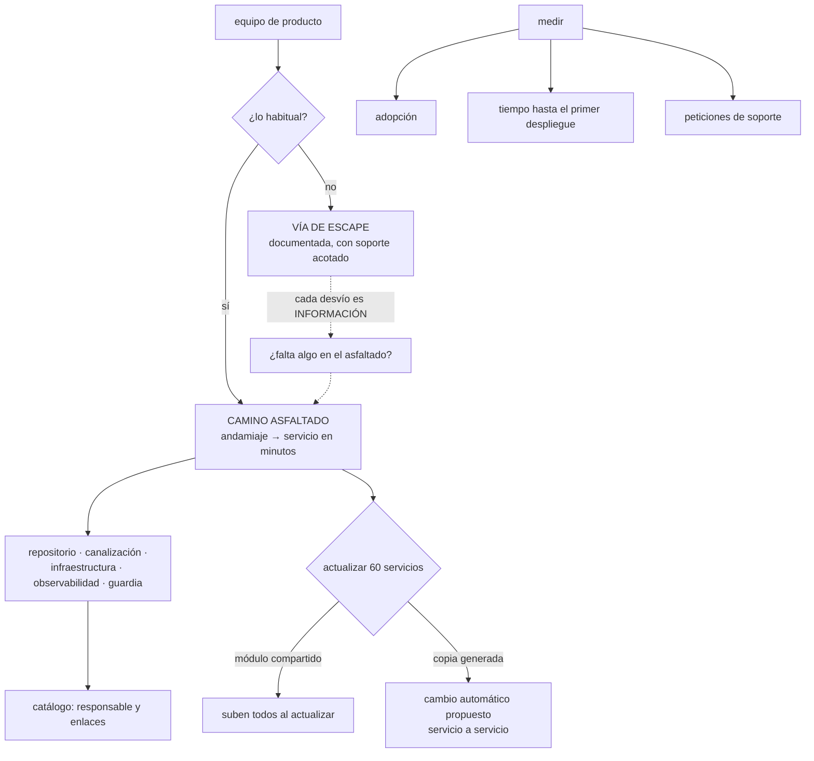

# 095 — Plantillas, golden paths y catálogo interno

> [← Clase anterior](../../part-07-infrastructure-as-code-configuration/094-ansible-e-imagen-dorada-para-configuracion/README.md) · [Índice de la parte](../README.md) · [Clase siguiente →](../../part-07-infrastructure-as-code-configuration/096-proyecto-infraestructura-multiambiente-promovible/README.md)

**Parte:** 07 — Infraestructura como código y configuración<br>
**Nivel:** intermedio-avanzado · **Horas estimadas:** 4<br>
**Laboratorio:** `platform` · **Estado:** `EXECUTABLE_CORE`

## 🎯 Propósito

Poner todo lo de esta parte a disposición de equipos que no la han estudiado, que es el problema que separa una plataforma útil de un conjunto de herramientas bien hechas. La pieza central es el **camino asfaltado**: la forma soportada de hacer lo habitual, que no gana por ser obligatoria sino **por ser más fácil que hacerlo a mano**. La clase fija ese criterio, mide la adopción en vez de suponerla, y trata los dos fracasos simétricos de todo equipo de plataforma: el camino que nadie usa y el camino que se convierte en un peaje.

## 📚 Resultados de aprendizaje

Al finalizar podrás:

1. **Definir** un camino asfaltado por el caso mayoritario, con una vía de escape documentada.
2. **Medir** la adopción y el tiempo hasta el primer despliegue, en vez de suponerlos.
3. **Actualizar** decenas de servicios creados desde una plantilla sin tocarlos uno a uno.
4. **Registrar** la propiedad de cada componente, que es la pregunta que este programa lleva ocho partes haciendo.
5. **Reconocer** los dos fracasos de un equipo de plataforma y la señal que los delata.

## 🧩 Conceptos centrales

| Concepto | Comprensión verificable |
|---|---|
| `camino asfaltado` | La forma soportada de hacer lo habitual: rápida, documentada y con las decisiones ya tomadas. **No es obligatoria**: gana porque es más cómoda. |
| `andamiaje` | Generador que produce un servicio funcionando —repositorio, canalización, infraestructura, observabilidad y guardia— en minutos. |
| `vía de escape` | Camino documentado para el caso que el asfaltado no cubre. Sin ella, el camino se convierte en un peaje; con ella, los desvíos son información. |
| `desviación de plantilla` | Distancia entre lo que generó la plantilla y lo que el servicio tiene hoy. Sin mecanismo de actualización, cada servicio envejece por su cuenta. |
| `catálogo interno` | Inventario de servicios con su responsable, su repositorio, sus dependencias y sus enlaces de operación. Es la respuesta a «¿de quién es esto?». |
| `adopción` | Proporción de servicios que usan el camino asfaltado. Es la única medida honesta de si la plataforma sirve. |

## 🧠 Modelo mental

IaC trata la infraestructura como producto versionado: el plan explica intención, el estado conecta intención y realidad, y la revisión reduce cambios accidentales.

Aplicado a esta clase, separa siempre cuatro planos: **intención** (qué necesita el usuario),
**configuración** (qué declaramos), **estado observado** (qué existe de verdad) y
**evidencia** (cómo sabemos que cumple). Confundirlos produce diseños que se ven correctos
en un diagrama pero fallan al operar.

## 🗺️ Flujo de razonamiento



## 📖 Desarrollo

### 1. Asfaltado, no obligatorio

Un equipo de plataforma que ha construido lo de las clases 085 a 094 tiene módulos versionados, políticas, canalizaciones e imágenes probadas. Y aun así, un equipo de producto puede tardar días en poner en marcha un servicio nuevo. La diferencia no es de capacidad: es de **acceso**.

El camino asfaltado es la forma soportada de hacer lo habitual, y su definición tiene dos mitades que hay que respetar a la vez:

```text
es la forma RÁPIDA        con las decisiones ya tomadas y probadas
no es la ÚNICA forma      hay una vía de escape documentada
```

La segunda mitad es la que casi siempre se incumple, y su ausencia produce el segundo fracaso de esta clase. Un camino obligatorio deja de ser un camino y pasa a ser un peaje: los equipos lo rodean, y la plataforma pierde tanto la adopción como la información sobre por qué no encajaba.

Y el criterio para decidir qué va dentro:

```text
el caso mayoritario, no todos los casos
  → si cubre el 80 %, se usa
  → si intenta cubrir el 100 %, vuelve al problema de la clase 088:
    decenas de opciones y ninguna probada
```

Lo que un camino asfaltado de servicios suele incluir, y de dónde viene cada pieza:

```text
repositorio con estructura y propietarios              esta clase
canalización: construir una vez y promover             062
imagen por huella, firmada, con inventario             061 · 067
manifiestos o plantillas desde módulos versionados     081 · 088
política sobre el resultado                            091
secretos por identidad, sin claves                     092
observabilidad: métricas, registros y trazas           057 · 082
SLO inicial y alerta de presupuesto de error           057
presupuesto de interrupción y comprobaciones           068 · 079
entrada en el catálogo, con responsable                esta clase
rotación de guardia y enlace al manual de operación    045 · 057
```

Once piezas que un equipo de producto no debería tener que montar, y que además codifican decisiones que este programa ha ido pagando incidente a incidente.

Y la prueba de si el camino está de verdad asfaltado es una sola pregunta, con respuesta medible:

```text
¿cuánto tarda una persona nueva en tener un servicio
 desplegado en preproducción, sirviendo tráfico y con guardia?
```

Si la respuesta se mide en días, no hay camino asfaltado: hay documentación.

### 2. El andamiaje y lo que produce

El generador tiene que producir algo que **funciona**, no un esqueleto que hay que completar:

```bash
$ cls nuevo-servicio
? Nombre del servicio           precios
? Equipo responsable            pedidos
? Lenguaje                      go
? Tipo                          API HTTP
? ¿Necesita base de datos?      sí, PostgreSQL pequeña
? Nivel de criticidad           2 (interno, horario laboral)

✓ repositorio creado con protecciones de rama y propietarios
✓ canalización configurada, con identidad federada
✓ infraestructura declarada, desde módulos v2.3.0
✓ manifiestos generados, con presupuesto y comprobaciones
✓ SLO inicial 99,5 % y alerta de consumo de presupuesto
✓ entrada en el catálogo, con responsable y enlaces
✓ canal de guardia y rotación asignada
✓ primer despliegue a desarrollo: correcto

URL: https://precios.dev.cloudshop.example    (2 min 40 s)
```

La última línea es la que importa: **el servicio existe y responde** al terminar el generador. Un andamiaje que produce ficheros y deja el despliegue como ejercicio no cambia el tiempo hasta el primer despliegue, que es la métrica que se busca.

Y tres decisiones de diseño que deciden si se usa:

**Preguntar poco.** Cada pregunta es una decisión que el equipo de producto no debería tener que tomar. Seis preguntas es razonable; veinte es la clase 088 otra vez.

**Elegir por criticidad, no por opciones técnicas.** La pregunta correcta no es «¿cuántas réplicas?» sino «¿qué pasa si esto se cae?». La respuesta determina réplicas, presupuesto, SLO, guardia y alertas, con valores que la organización ya decidió:

```text
nivel 1 · crítico       3 réplicas en 3 zonas, SLO 99,9 %, guardia 24×7
nivel 2 · interno       2 réplicas, SLO 99,5 %, guardia en horario
nivel 3 · auxiliar      1 réplica, sin SLO, sin guardia
```

**Generar referencias, no copias.** Es la decisión que determina si los sesenta servicios creados se pueden actualizar. La siguiente sección la trata.

Y una advertencia sobre lo que **no** debe hacer el andamiaje: crear infraestructura de producción sin revisión. Genera el código y abre el cambio; **la aplicación sigue el flujo de la clase 091**, con su plan revisado y su política. Un generador que aplica directamente en producción es un camino que salta todos los controles de esta parte.

### 3. Actualizar sesenta servicios

Este es el problema que aparece a los seis meses y que decide si la plataforma escala.

```text
sesenta servicios creados desde la plantilla v1
la plantilla va por la v4
y los sesenta siguen en v1, cada uno con sus modificaciones
```

Eso es **desviación de plantilla**, y tiene dos soluciones según cómo se generó cada pieza:

**Lo que es una referencia sube solo.** Si el servicio consume un módulo versionado (clase 088) en vez de una copia, actualizar el módulo actualiza a todos los que suban su versión:

```hcl
module "servicio" {
  source  = "interno.example/plataforma/servicio-web/aws"
  version = "~> 3.1"          # sube con las menores automáticamente
}
```

Por eso la regla de diseño del andamiaje: **generar lo mínimo y referenciar lo máximo**. Un servicio nuevo debería tener pocos ficheros propios y muchas referencias.

**Lo que es una copia hay que empujarlo.** Los ficheros que el generador copió —la canalización, la configuración del repositorio, un fichero de arranque— no se pueden actualizar solos. La solución es un robot que abra un cambio en cada repositorio:

```text
un robot detecta que la plantilla tiene una versión nueva
abre un cambio en cada servicio con la diferencia aplicada
y el equipo lo revisa y lo fusiona cuando quiere
```

Y con la métrica correspondiente, que es la que dice si la flota envejece:

```text
distribución de versiones de plantilla en los servicios
  v4  38
  v3  17
  v2   4
  v1   1     ← este lleva año y medio sin actualizarse
```

Esa distribución debería estar en un panel. Una cola larga de servicios en versiones antiguas es deuda que se paga entera el día que haya que corregir algo urgente en todos.

Y una política de soporte, como la de la clase 088:

```text
las dos últimas versiones mayores tienen soporte
lo anterior se actualiza o se documenta como excepción con fecha
```

Y un caso especial que conviene anticipar: **los cambios incompatibles de la plantilla**. Un cambio que exige modificar el código del servicio no se puede aplicar con un robot. La forma de gestionarlo es la de la clase 088 —expandir, esperar, contraer— y con un plazo real:

```text
se publica la versión nueva con ambas formas soportadas
se avisa con la fecha de retirada de la antigua
el robot propone la migración
y en la fecha, lo que no haya migrado deja de recibir soporte
```

### 4. El catálogo responde la pregunta de ocho partes

Este programa lleva ocho partes haciendo la misma pregunta desde ángulos distintos:

```text
¿de quién es este volumen?                         clase 064
¿quién responde de esta alerta?                    clase 057
¿quién es el dueño de este campo?                  clases 085 · 086
¿quién mantiene este módulo?                       clase 088
¿de quién es este proyecto que aparece facturado?  clase 049
¿quién puede autorizar este cambio?                clase 091
```

El catálogo es donde esa pregunta tiene una respuesta única y consultable:

```yaml
# catalogo/precios.yaml — generado por el andamiaje, versionado con el servicio
apiVersion: cloudshop/v1
kind: Servicio
metadata:
  nombre: precios
  descripcion: Cálculo de precios y descuentos.
spec:
  equipo: pedidos
  criticidad: 2
  repositorio: https://git.interno/pedidos/precios
  plantilla: servicio-web@v4.1.0
  depende_de: [catalogo, promociones]
  datos:
    - tipo: postgresql
      clasificacion: interna
  enlaces:
    panel: https://…
    manual: https://…
    guardia: https://…
    slo: https://…
```

Y lo que se puede hacer con eso, que es lo que justifica mantenerlo:

```text
responder "¿quién responde de esto?" en segundos, a las 3 de la madrugada
calcular el impacto de retirar un servicio: quién depende de él
saber qué servicios manejan datos de una clasificación concreta
ver la distribución de versiones de plantilla
y cruzar el catálogo con la infraestructura real, como en las clases 049 y 087
```

La última es la comprobación que este programa ha usado tres veces —proyectos facturados frente a gobernados, recursos reales frente a gestionados— y aquí tiene su tercera forma:

```bash
# servicios en producción que no están en el catálogo
$ kubectl get deploy -A -o json | jq -r '.items[].metadata.labels["app.kubernetes.io/name"]' \
  | sort -u > desplegados.txt
$ ls catalogo/*.yaml | xargs -n1 basename | sed 's/.yaml//' | sort > catalogados.txt
$ comm -23 desplegados.txt catalogados.txt
```

Cualquier resultado es un servicio en producción del que **nadie sabe quién responde**.

Y la condición que hace que el catálogo no se convierta en documentación desactualizada, que es su destino habitual:

```text
se genera con el servicio, no se rellena después
vive en el repositorio del servicio, no en un sistema aparte
la canalización falla si falta o si el responsable no existe
y se consulta de verdad: si nadie lo usa, nadie lo mantendrá
```

La tercera es la que lo mantiene vivo. Un catálogo cuya ausencia no rompe nada se queda vacío en seis meses.

### 5. Los dos fracasos, y cómo se ven

Un equipo de plataforma falla de dos formas simétricas, y las dos tienen una señal medible.

**Fracaso 1: el camino que nadie usa.**

```text
señal      adopción baja, y equipos que montan lo suyo
causas     es más lento que hacerlo a mano
           no cubre el caso real del equipo
           nadie sabe que existe
           se rompe y no hay quien lo arregle
```

Y el diagnóstico no se hace preguntando si les gusta, sino midiendo:

```text
tiempo hasta el primer despliegue, por el camino y a mano
proporción de servicios nuevos que lo usan
número de desvíos, y su motivo
```

La tercera es la más valiosa: **cada desvío es información sobre lo que falta**, y por eso la vía de escape tiene que existir y tiene que dejar rastro. Un equipo que se desvía en silencio no aporta nada; uno que se desvía declarando el motivo está haciendo el trabajo de producto de la plataforma.

**Fracaso 2: el camino que se convierte en peaje.**

```text
señal      el equipo de plataforma aparece en la ruta crítica de otros
           tiempos de espera para cosas que deberían ser automáticas
           una cola de peticiones que crece
causas     el camino es obligatorio y no cubre todo
           hay pasos manuales que solo la plataforma puede hacer
           los permisos están tan cerrados que todo pasa por ahí
```

Y su medida es directa:

```text
peticiones de soporte al mes, y su tipo
  las repetidas son automatizables: cada una es un fallo del camino
tiempo medio de espera de una petición
proporción de cambios que un equipo puede hacer sin pedir permiso
```

La última es la que define si la plataforma habilita o bloquea, y es exactamente el compromiso que la clase 051 negoció con la VPC compartida: **el equipo de red gobierna y no es un cuello de botella, siempre que el reparto de permisos esté bien hecho**.

Y las métricas que conviene tener, que son de producto y no de infraestructura:

```text
tiempo hasta el primer despliegue de un servicio nuevo
adopción del camino asfaltado
distribución de versiones de plantilla
peticiones de soporte por mes y por tipo
proporción de servicios con responsable en el catálogo
servicios en producción que no están en el catálogo
```

Seis números que caben en un panel y que responden a si la plataforma sirve. Y una advertencia sobre cómo se leen: **una adopción del 100 % es sospechosa**. O el camino cubre de verdad todos los casos —improbable— o es obligatorio, que es el fracaso 2.

Y la lista de comprobación de la clase:

```text
☐ el camino asfaltado produce un servicio DESPLEGADO, no ficheros
☐ pocas preguntas, y por criticidad, no por opciones técnicas
☐ vía de escape documentada, con soporte acotado y registro del motivo
☐ genera lo mínimo y referencia lo máximo, para poder actualizar
☐ robot que propone la actualización de lo copiado
☐ política de soporte de versiones de plantilla
☐ catálogo generado con el servicio, y su ausencia rompe la canalización
☐ comprobación de servicios desplegados que no están en el catálogo
☐ las seis métricas de producto, en un panel
☐ ninguna aplicación en producción sin pasar por el flujo de revisión
```

## 🔬 Ejemplo trabajado

**El equipo de plataforma de CloudShop lleva ocho meses construyendo lo de las clases 085 a 094. Un servicio nuevo sigue tardando dos días en llegar a preproducción, y tres equipos han montado su propia infraestructura por su cuenta. La medición explica por qué.**

**Lo que se midió antes de tocar nada.**

```text
tiempo hasta el primer despliegue de un servicio nuevo
  por el camino de la plataforma           2 días
  a mano, copiando de otro servicio        4 horas
servicios nuevos del último trimestre       11
  que usaron el camino                       3
servicios en producción sin responsable conocido   9
peticiones de soporte al mes                ~35
```

La primera cifra explica la segunda: **el camino de la plataforma era ocho veces más lento que copiar de otro servicio**. Nadie iba a usarlo por convicción.

Y el desglose de las dos jornadas:

```text
crear el repositorio y configurarlo          20 min
escribir la infraestructura desde módulos     3 h
escribir los manifiestos                      2 h
configurar la canalización                    2 h
pedir la identidad federada al equipo de plataforma   1 día de ESPERA
configurar observabilidad y alertas           2 h
registrar la guardia                          30 min
```

La espera de un día es el fracaso 2 en estado puro: **una petición manual que solo la plataforma podía atender**, en la ruta crítica de todos los servicios nuevos.

**Lo que se hizo, por orden de impacto.**

```text
1. automatizar la identidad federada          quita 1 día de espera
2. andamiaje que genera y despliega           quita 7 h de trabajo
3. módulos referenciados en vez de copiados   permite actualizar después
4. catálogo generado, con responsable         responde "¿de quién es esto?"
```

El primero fue el más barato y el que más valió: una política que crea la confianza federada al crear el repositorio, acotada al espacio y a la cuenta como exige la clase 083.

**El resultado.**

```text                                        antes            después
tiempo hasta el primer despliegue           2 días          38 minutos
preguntas del generador                        —                6
ficheros propios de un servicio nuevo         41                7
referencias a módulos versionados              2                9
servicios nuevos que usan el camino         3 de 11         14 de 15
peticiones de soporte al mes                  ~35              ~9
```

Y la última fila desglosada, que es lo que dice si el trabajo sirvió:

```text
peticiones que desaparecieron              tipo
  "necesito identidad federada"            automatizada
  "cómo configuro las alertas"             en la plantilla
  "qué módulo uso para X"                  el generador lo elige
  "por qué falla mi canalización"          la plantilla ya funciona
```

**El servicio decimoquinto, que no usó el camino.**

Un equipo necesitaba un servicio con procesamiento de vídeo, con aceleradores y almacenamiento local rápido. El camino asfaltado no lo cubría, y usó la vía de escape declarando el motivo.

```text
lo que faltaba en la plantilla
  tipo de máquina con acelerador
  almacenamiento local efímero de alto rendimiento
  comprobación de estado con arranque de 4 minutos
```

Y la decisión que se tomó con ese dato:

```text
no se añadió al camino asfaltado
  → es un caso único; añadirlo habría llevado el generador
    hacia el problema de la clase 088
se documentó como perfil aparte, con sus módulos propios
  → soporte acotado y por escrito
y la comprobación de estado con arranque largo SÍ se incorporó
  → resultaba útil para otros tres servicios
```

**Ese desvío fue la información más valiosa del trimestre**, y solo existió porque la vía de escape estaba documentada y dejaba rastro.

**Los nueve servicios sin responsable.**

```bash
$ comm -23 desplegados.txt catalogados.txt
informes-legado
sincronizador-precios
exportador-fiscal
… (9)
```

De los nueve: cuatro tenían responsable identificable preguntando, tres pertenecían a un equipo que ya no existía y dos **nadie supo de quién eran**. Los dos se estudiaron: uno estaba sin tráfico desde hacía ocho meses y se retiró; el otro procesaba un fichero diario que finanzas seguía usando.

```text                                        antes            después
servicios sin responsable                       9                0
servicios retirados por estar sin uso           —                1
servicios adoptados por un equipo               —                8
comprobación de catálogo en la canalización  no había       falla si falta
```

**Y la distribución de versiones a los seis meses.**

```text
v4  21
v3   6
v2   2
v1   0
```

Con el robot proponiendo actualizaciones, ningún servicio se quedó en la primera versión. Los dos de la v2 tienen una excepción documentada con fecha.

**Resumen:**

```text                                          antes         después
tiempo hasta el primer despliegue            2 días          38 min
adopción del camino asfaltado                3 de 11        14 de 15
peticiones de soporte al mes                   ~35             ~9
esperas manuales en la ruta crítica             1               0
servicios sin responsable                       9               0
ficheros propios por servicio                  41               7
desvíos declarados                              0               1, útil
```

**La lección que esta clase traslada al proyecto de la clase 096**: la plataforma tenía construido todo lo necesario desde hacía ocho meses y **la adopción era del 27 %**, porque su camino era ocho veces más lento que copiar de otro servicio. El cambio que más valió no fue técnico sino quitar una espera manual de la ruta crítica. Y el único desvío del trimestre fue la información más útil que recibió el equipo — lo que confirma que **la vía de escape no es una concesión: es el mecanismo por el que la plataforma se entera de lo que le falta**.

## 🧪 Laboratorio guiado

Ejecuta desde la raíz:

```bash
python classes/part-07-infrastructure-as-code-configuration/095-plantillas-golden-paths-y-catalogo-interno/lab.py
```

El laboratorio selecciona el motor de práctica **`platform`** y produce
`lab_result.json`. El escenario, sus comprobaciones y el artefacto esperado corresponden a
esta clase; no requiere credenciales y deja explícito qué debe revalidarse en un sandbox real.

1. Lee `exercise.steps` y formula una predicción antes de ejecutar.
2. Ejecuta la práctica y verifica todos los elementos de `checks`.
3. Provoca el caso de `negative_test` y explica la señal observada.
4. Materializa `plantilla-plataforma` en `evidence/` usando la plantilla indicada.
5. Para proveedor real, sigue `sandbox.requires`, registra costo y ejecuta `destroy`.

### Evidencia esperada

El artefacto principal es una capacidad autoservicio con contrato y golden path. Además, la entrega debe incluir el comando ejecutado,
la salida estructurada y una conclusión que no exceda lo observado.

## 🏆 Reto verificable

Construye **`plantilla-plataforma`** para el caso CloudShop. Incluye una alternativa descartada,
un supuesto que pueda falsarse, una prueba de fallo y una decisión de rollback.

## ✅ Criterio de aceptación

- [ ] `lab.py` termina con código 0 y genera JSON válido.
- [ ] La entrega conecta al menos tres requisitos con mecanismos verificables.
- [ ] Existe una prueba positiva y una prueba negativa con evidencia.
- [ ] Seguridad, costo y operación aparecen como decisiones, no como anexos.
- [ ] Se declara una limitación y una condición que obligaría a revisar el diseño.
- [ ] Otra persona puede repetir el recorrido sin conocimiento tácito.

## ⚠️ Errores frecuentes

| Síntoma | Causa probable | Corrección |
|---|---|---|
| La plataforma tiene todo construido y los equipos montan lo suyo | El camino asfaltado es más lento que copiar de otro servicio | Mide el tiempo hasta el primer despliegue por ambas vías; si la tuya no gana, no se usará por convicción. |
| Un equipo de plataforma aparece en la ruta crítica de todos los servicios nuevos | Hay pasos manuales que solo esa plataforma puede hacer | Automatiza cada petición repetida: cada una es un fallo del camino, no una tarea de soporte. |
| Sesenta servicios creados desde una plantilla siguen en su primera versión | El generador copió ficheros en vez de referenciar módulos, y nadie empuja actualizaciones | Genera lo mínimo y referencia lo máximo; para lo copiado, un robot que proponga el cambio, con política de soporte. |
| El camino asfaltado intenta cubrir todos los casos y nadie sabe qué combinaciones funcionan | Es el problema de la clase 088 en el generador | Cubre el caso mayoritario y documenta una vía de escape; los desvíos dicen qué falta. |
| Hay servicios en producción de los que nadie sabe quién responde | El catálogo se rellena después, o su ausencia no rompe nada | Genéralo con el servicio, versiónalo con él y haz que la canalización falle si falta o si el responsable no existe. |
| La adopción del camino es del cien por cien | O cubre todos los casos, lo que es improbable, o es obligatorio | Comprueba si existe vía de escape y si alguien la ha usado; un camino sin desvíos es un peaje. |

## 🛡️ Seguridad, ética y costo

Trabaja con cuentas propias o sandboxes autorizados. No publiques secretos, identificadores
reales ni datos personales. Antes de crear recursos pagos define presupuesto, etiquetas y
comando de destrucción; después verifica que no queden recursos huérfanos. Los ejemplos
locales enseñan contratos, pero no certifican cumplimiento ni disponibilidad de producción.

## ❓ Preguntas de comprobación

1. ¿Por qué un camino asfaltado no debe ser obligatorio, y qué se pierde si lo es?
2. ¿Qué diferencia hay entre un generador que produce ficheros y uno que produce un servicio desplegado?
3. ¿Cómo se actualizan sesenta servicios creados desde una plantilla, según cómo se generó cada pieza?
4. ¿Qué pregunta de ocho partes anteriores responde el catálogo, y qué lo mantiene vivo?
5. Enumera los dos fracasos de un equipo de plataforma y la señal medible de cada uno.

## 🔗 Referencias

- Evan Bottcher (2018). *What I talk about when I talk about platforms* — la plataforma como producto y el camino asfaltado. <https://martinfowler.com/articles/talk-about-platforms.html>
- Matthew Skelton, Manuel Pais (2019). *Team Topologies*, cap. 5 — equipos de plataforma y modos de interacción. <https://teamtopologies.com/book>
- Backstage (2025). *Software catalog and scaffolder* — catálogo de servicios, propiedad y plantillas. <https://backstage.io/docs/features/software-catalog/>
- Google (2023). *DORA: platform engineering and developer experience* — métricas de adopción y de tiempo de entrega. <https://dora.dev/research/>
- CNCF (2025). *Platforms White Paper* — capacidades esperadas de una plataforma interna y sus señales. <https://tag-app-delivery.cncf.io/whitepapers/platforms/>
- Documentación oficial vigente del servicio implementado; registra URL y fecha de consulta.

---

> [Evaluación](assessment.md) · [Contrato de clase](lesson.yaml) · [Índice de la parte](../README.md)
