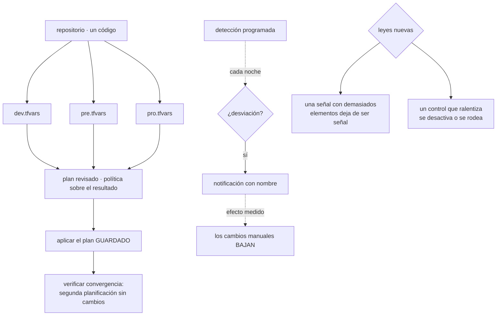

# 096 — Proyecto: infraestructura multiambiente promovible

> [← 095 · Plantillas, golden paths y catálogo interno](../../part-07-infrastructure-as-code-configuration/095-plantillas-golden-paths-y-catalogo-interno/README.md) · [Índice de la parte](../README.md) · [097 · Integración continua, trunk-based development y feedback →](../../part-08-continuous-delivery-platform-engineering/097-integracion-continua-trunk-based-development-y-feedback/README.md)

**Parte:** 07 — Infraestructura como código y configuración<br>
**Nivel:** intermedio-avanzado · **Horas estimadas:** 8<br>
**Laboratorio:** `capstone` · **Estado:** `EXECUTABLE_CORE`

## 🎯 Propósito

Integrar las once clases anteriores en una infraestructura que se promueve entre cuatro entornos con el mismo código, y **calificar la hipótesis de la clase 084**. Acertó en dos afirmaciones y su primera parte partía de un supuesto que esta parte no cumplió: predijo lo que haría un bucle continuo, y lo que se construyó fue **detección programada**. El resultado es más interesante que el acierto: la detección sola, sin corregir nada, consiguió la mayor parte del efecto — y eso reordena lo que la parte 08 tiene que aportar.

## 📚 Resultados de aprendizaje

Al finalizar podrás:

1. **Trazar** cada decisión de la infraestructura hasta la clase que la tomó.
2. **Calificar** la hipótesis de la clase 084, incluida la parte que partía de un supuesto no cumplido.
3. **Enunciar** las dos leyes que esta parte añade, con sus apariciones.
4. **Provocar** tres fallos propios de infraestructura como código y medir la recuperación.
5. **Entregar** cuatro entornos cuya diferencia cabe en un fichero legible.

## 🧩 Conceptos centrales

| Concepto | Comprensión verificable |
|---|---|
| `detección sin corrección` | Comprobación periódica que informa de la desviación y no la arregla. Consigue la mayor parte del efecto de un bucle **por su efecto sobre el comportamiento**, no sobre los recursos. |
| `frontera de propiedad` | Acuerdo sobre qué sistema manda en cada campo. Apareció tres veces en esta parte con tres mecanismos, y su ausencia produce oscilación permanente. |
| `señal con demasiados elementos` | Previsualización, informe o alerta con tantas entradas que nadie la lee. Su corrección es eliminar lo que nadie consulta, no filtrar al leer. |
| `control que ralentiza` | Comprobación o camino que hace el trabajo más lento. Se desactiva o se rodea, con independencia de lo correcto que sea. |
| `promoción` | Llevar el mismo código a entornos sucesivos cambiando solo un fichero de valores. Lo que no cabe ahí es erosión o es una decisión de arquitectura mal expresada. |
| `recuperación del estado` | Volver a gestionar la infraestructura tras perder el fichero. Cuatro minutos con versionado, días reconstruyendo: es la diferencia que justifica todo lo de la clase 087. |

## 🧠 Modelo mental

IaC trata la infraestructura como producto versionado: el plan explica intención, el estado conecta intención y realidad, y la revisión reduce cambios accidentales.

Aplicado a esta clase, separa siempre cuatro planos: **intención** (qué necesita el usuario),
**configuración** (qué declaramos), **estado observado** (qué existe de verdad) y
**evidencia** (cómo sabemos que cumple). Confundirlos produce diseños que se ven correctos
en un diagrama pero fallan al operar.

## 🗺️ Flujo de razonamiento



## 📖 Desarrollo

### 1. La infraestructura entregada y de dónde sale cada decisión

Doce decisiones con su alternativa descartada y la trampa que evita:

| Decisión | Requisito | Alternativa descartada | Trampa que evita |
|---|---|---|---|
| Clasificar la desviación por origen | Revisión legible (085) | Tratar todo como manual | 84 % de ruido que hace ilegible el plan |
| Dependencias implícitas por referencia | Orden correcto (086) | Declararlas por si acaso | Ejecuciones que fallan 2 de cada 5 veces |
| Campos de otros sistemas, ignorados | Frontera de propiedad (086) | Declararlos | Oscilación permanente en cada aplicación |
| Un estado por radio de impacto | Bloqueo y alcance (087) | Un estado para todo | 12 esperas al día y `destroy` global |
| Recuperación del estado ensayada | Continuidad (087) | Confiar en el versionado | 4 minutos frente a 4 días |
| Módulos que codifican decisiones | Reutilización real (088) | Envolturas con 47 variables | Tres equipos escribiendo lo suyo |
| Fichero de valores explícito siempre | Promoción segura (089) | Carga automática | Aplicar producción sobre preproducción |
| Comprobación de cuenta esperada | Última defensa (089) | Confiar en el fichero | Lo mismo, pero sin darse cuenta |
| Detección de desviación programada | Ver lo que cambia (090) | Descubrirlo en un incidente | 21 días con un puerto abierto |
| Política sobre el plan, no el código | Ver los valores (091) | Análisis estático | 2 años con una base de datos pública |
| Secretos que no existen para la plantilla | Sin rastros (092) | Marcar como sensible | 14 campos en claro en los estados |
| Imagen dorada para lo que es ganado | Sin dependencias al arrancar (094) | Configurar al arrancar | 24 minutos sin poder escalar |

Y tres decisiones tomadas en contra de lo que sugiere el hábito:

```text
1. No se consolidó en una sola herramienta.
   Dos, cada una donde su modelo operativo encaja, después de medir que
   18 de 24 incidentes no dependían de la herramienta (093).

2. El camino asfaltado NO es obligatorio, y su único desvío del trimestre
   fue la información más útil que recibió la plataforma (095).

3. Los dos valores aleatorios que quedan en el estado se aceptan como riesgo
   declarado, en vez de forzar una solución que complicaría el sistema (092).
```

### 2. La hipótesis de la clase 084, calificada

La clase 084 dejó escrito:

> El bucle continuo eliminará la desviación entre repositorio y realidad y hará visible la frontera de propiedad entre quienes escriben sobre el mismo objeto. Y volverá a aparecer la ley 13, porque un bucle de infraestructura detenido tampoco produce ningún error.

**Afirmación 1 — el bucle eliminará la desviación. NO SE PUEDE CALIFICAR: el supuesto no se cumplió.**

Esta parte no construyó un bucle continuo. Construyó **detección programada** (clase 090): una planificación nocturna que informa y no corrige. Y ese cambio de supuesto produce el resultado más interesante de la parte:

```text
lo que se esperaba de un bucle    corregir la desviación automáticamente
lo que hizo la detección          informar, con nombre, al día siguiente

efecto medido sobre los recursos  ninguno: no corrige nada
efecto medido sobre las personas  los cambios manuales bajaron de 9 a 2 al mes
```

La segunda línea es el hallazgo. **La mayor parte del beneficio esperado del bucle se obtuvo sin bucle**, porque el problema no era técnico: era que el cambio manual funcionaba y no dejaba rastro. En cuanto dejó rastro, dejó de ser un método cómodo.

Y eso reordena lo que la parte 08 tiene que aportar: no es «hacer visible la desviación» —eso ya está— sino **corregirla sola y sostener la corrección**, que es un problema distinto y con riesgos propios.

**Afirmación 2 — la frontera de propiedad se hará visible. CIERTA, y apareció tres veces.**

```text
réplicas entre manifiesto y escalado automático            081
campos que gestiona otro sistema, como origen 3            085
capacidad deseada que volvía a tres cada noche             086
```

Tres mecanismos distintos y el mismo conflicto: dos sistemas creyéndose dueños del mismo campo. Y la corrección fue siempre la misma —**un solo dueño por campo, declarado**— lo que la convierte en una regla de diseño y no en un ajuste.

**Afirmación 3 — reaparecerá la ley 13. CIERTA.**

```text
el analizador de seguridad, desactivado 14 meses               091
el escaneo de secretos que solo miraba el repositorio          092
y la propia detección: si deja de ejecutarse, no avisa nadie   090
```

La tercera es la más literal: una comprobación que lleva tres semanas sin ejecutarse **es indistinguible de un sistema sin desviación**. Y su antídoto es el que la ley 13 pide siempre: una señal de que la comprobación se ejecutó.

### 3. Dos leyes nuevas, con sus apariciones

**Ley 15. Una señal con demasiados elementos deja de ser una señal, y su corrección es eliminar lo que nadie consulta.**

Seis apariciones, en seis partes distintas y con seis mecanismos:

```text
214 líneas de previsualización, con el cambio real dentro        047
340 alertas al mes, 6 con impacto real                           057
812 hallazgos de seguridad, 24 accionables                       067 · 091
105 cambios propuestos, 10 de desviación real                    085 · 090
diferencial de manifiestos con ruido de campos calculados        081
62 GiB/día de registros, el 78 % nunca consultado                057 · 082
```

Y lo que las une no es el volumen sino **la corrección**, que es la misma en las seis y siempre contraintuitiva:

```text
la respuesta NO es filtrar al leer, ni acostumbrarse
la respuesta es ELIMINAR lo que nadie consulta
  → declarar los campos que el proveedor rellena
  → bloquear solo por lo corregible
  → alertar sobre la experiencia, no sobre umbrales
  → excluir antes de ingerir
```

Y la razón por la que hay que eliminarlo en vez de tolerarlo: **una señal ruidosa entrena a no mirar**, y el día que aparece algo real pasa desapercibido. En esta parte ocurrió literalmente dos veces: una base de datos pública durante dos años y un puerto abierto durante tres semanas.

**Ley 16. Un control o un camino que hace el trabajo más lento se desactiva o se rodea, con independencia de lo correcto que sea.**

Cinco apariciones:

```text
el escáner de imágenes, desactivado ocho meses                   067
el analizador de infraestructura, desactivado catorce meses      091
las alertas silenciadas: 46 de 340                               057
los módulos que nadie usaba: tres equipos escribiendo lo suyo    088
el camino asfaltado con 27 % de adopción, ocho veces más lento   095
```

Y su consecuencia de diseño, que es lo que convierte la ley en algo accionable:

```text
un control se diseña por su COSTE, no solo por su corrección
  bajo dos minutos, se ejecuta siempre
  a diez, cuando alguien se acuerda
  a treinta, se desactiva

y un camino se adopta si es MÁS FÁCIL, no si es el correcto
```

Las dos leyes están relacionadas y no son la misma: la 15 es sobre la señal que produce un control y la 16 sobre su coste. Un control puede ser rápido y ruidoso —el analizador de la clase 091— o lento y preciso. **Los dos se acaban desactivando, por motivos distintos.**

### 4. Tres fallos provocados y lo que enseñó cada uno

**Fallo 1 — perder el estado de un entorno.** Se borra el estado de preproducción.

```text
recuperación desde una versión anterior          4 min 10 s
verificación con plan sin cambios                correcta
infraestructura afectada                         ninguna
```

**Y el hallazgo:** el ensayo se hizo también sobre el estado de la plataforma, y ahí falló.

```text
el bucket del estado de plataforma tenía versionado
y la copia diaria a otra cuenta NO lo incluía: se había añadido
después de configurar la copia, y nadie revisó la lista
```

La recuperación funcionó porque el versionado estaba; si el borrado hubiera sido del bucket, ese estado no tenía segunda copia.

```text
corrección   la lista de la copia se genera del inventario, no se mantiene a mano
             y el ensayo cubre los cuatro estados, no uno
```

**Fallo 2 — aplicar con el fichero de valores equivocado.** Se intenta a propósito aplicar producción sobre preproducción.

```text
la comprobación de cuenta esperada detiene la planificación     ✓
mensaje                                                          claro
tiempo hasta el fallo                                            8 s
```

**Y el hallazgo:** funcionó en tres de los cuatro estados. En el cuarto, la comprobación existía y **la cuenta era la misma para dos entornos**, porque preproducción y desarrollo compartían cuenta.

```text
corrección   la comprobación pasa a validar cuenta Y prefijo de nombres
             y se añade una segunda: el estado en uso debe contener el entorno
```

Es el mismo patrón de la clase 080 con las políticas de red: **una comprobación que existe y no cubre lo que se cree**. Séptima aparición de la familia de fallos de la clase 060, ahora en la propia comprobación.

**Fallo 3 — detener la detección de desviación.** Se desactiva la ejecución nocturna sin avisar.

```text
tiempo hasta que alguien lo notó                 no se notó en 3 semanas
lo que se detectó durante ese tiempo             nada
desviación real acumulada en esas 3 semanas      2 cambios manuales
```

**Y el hallazgo:** exactamente lo que la ley 13 predice. La detección no avisa de su propia ausencia, y tres semanas de silencio son indistinguibles de tres semanas sin desviación.

```text
corrección   métrica de "última ejecución con éxito" por estado
             alerta si envejece más de 36 horas
             y comprobación de que esa alerta funciona, con un simulacro
```

Los tres hallazgos comparten forma con los de las clases 048, 060, 072 y 084: **el mecanismo funcionó y había algo que ninguna revisión de configuración podía mostrar** — una lista de copias mantenida a mano, dos entornos compartiendo cuenta y una comprobación que no vigilaba su propia ejecución.

### 5. La entrega y la pregunta que abre la parte 08

**La entrega, sin conocimiento tácito.**

```text
código              un repositorio, cuatro ficheros de valores
módulos             6, versionados y probados con creación real
estados             4, por radio de impacto, con recuperación ensayada
línea base          24 afirmaciones, cada una con su comprobación
verificar.sh        ejecuta las 24 y devuelve código de salida
política            19 reglas sobre el plan, en las dos herramientas
ADR                 12 decisiones con su alternativa descartada
riesgos residuales  4, con responsable y condición de revisión
camino asfaltado    servicio nuevo desplegado en 38 minutos
catálogo            todos los servicios con responsable
```

Los **cuatro riesgos residuales**:

```text
1. dos valores aleatorios permanecen en el estado, con acceso mínimo
2. dos servidores heredados siguen gestionados por convergencia (094)
3. la aplicación no es automática al fusionar: requiere aprobación humana
4. la detección informa y no corrige: la desviación vive hasta que alguien actúa
```

El cuarto es precisamente lo que la parte 08 tiene que resolver.

**La comparación con el punto de partida:**

```text                                          antes         después
cambios propuestos en ejecución limpia          140             0
recursos huérfanos                               34             0
esperas por bloqueo al día                      ~12             0
diferencias accidentales entre entornos          31             0
recursos solo en producción                      31             4
campos sensibles en los estados                  14             2
secretos en rastros no auditados             4 rastros          0
tiempo hasta el primer despliegue             2 días         38 min
cambios manuales al mes                           9             2
tiempo de arranque de una máquina           6 min 20 s        38 s
costo no atribuible                       2.180 USD/mes        0
pruebas negativas ejecutadas                  0 de 24       24 de 24
```

**Y la pregunta que abre la parte 08.**

Esta parte deja una infraestructura descrita, revisada, verificada y vigilada, y **con un hueco declarado como riesgo**: la desviación se detecta y no se corrige, y la aplicación la dispara una persona. El mecanismo que cierra ese hueco ya está descrito desde la clase 073 — un bucle que reconcilia — y la pregunta correcta no es si funciona, sino qué cuesta:

> Si un bucle reconcilia la infraestructura continuamente, **se convierte en el actor más privilegiado del sistema**: aplica sin supervisión, tiene permisos sobre todo y su compromiso equivale al de la plataforma entera. ¿Qué hay que darle, qué hay que negarle, y qué NO debe tocar nunca?

La hipótesis que se escribe ahora, para poder equivocarse de forma comprobable:

> El bucle eliminará la desviación y trasladará el problema a dos sitios nuevos: **la identidad de la canalización**, que pasa a ser el objetivo más valioso del sistema, y **la lista de lo que el bucle no debe revertir**, que nadie sabrá mantener. Y aparecerá la ley 16 con un mecanismo nuevo: si el flujo automatizado es más lento que aplicar a mano, alguien aplicará a mano.

La parte 08 la califica.

## 🔬 Ejemplo trabajado

**Entrega del capstone de la parte 07, con las cifras que se llevan a la parte 08.**

**Verificación completa.** Las 24 afirmaciones de la línea base:

```bash
$ ./verificar.sh
✓ ejecución limpia sin cambios propuestos        4 estados, 0 cambios
✓ segunda aplicación seguida sin cambios         idempotencia comprobada
✓ ningún fichero de carga automática             0 encontrados
✓ comprobación de cuenta y prefijo                4 de 4 estados
✓ estados con bloqueo, versionado y cifrado      4 de 4
✓ acceso al estado: lectura y escritura separadas 2 identidades
✓ recuperación del estado ensayada                4 min 10 s
✓ ningún recurso huérfano                         0 de 412
✓ módulos consumidos por versión                  22 de 22
✓ módulos con pruebas de creación real            6 de 6
✓ política sobre el plan                          19 reglas, 2 herramientas
✓ excepciones con motivo, responsable y fecha     6 de 6
✓ ninguna excepción caducada                      0
✓ ningún secreto en el historial del repositorio  escaneo limpio
✓ campos sensibles en los estados                 2, declarados como riesgo
✓ planes no publicados como artefacto             0
✓ registro detallado desactivado                  confirmado
✓ diferencia entre entornos en un fichero         8 valores
✓ ningún condicional por entorno                  1, con riesgo declarado
✓ recursos con protección contra destrucción      41 de 41
✓ imagen probada arrancando, sin red externa      7 comprobaciones
✓ segunda pasada de convergencia sin cambios      0 cambios
✓ servicios con responsable en el catálogo        15 de 15
✓ detección de desviación con señal de ejecución  4 estados
24/24 correctas
```

**Línea base medida:**

```text
tiempo de una planificación por estado           38 s
plan a aplicación, con revisión                  ~20 min (aprobación humana)
servicio nuevo hasta desplegado                  38 min
arranque de una máquina                          38 s
recuperación de un estado                        4 min 10 s
detección de desviación                          nocturna, < 24 h
```

**Los tres fallos, con lo aprendido en cada uno:**

```text                          detección    impacto real         lección
estado borrado                inmediata     ninguno; recuperado   la lista de
                                            en 4 min              copias se
                                                                  mantenía a mano
                                                                  y no cubría todo

valores del entorno            8 s           ninguno en 3 de 4     una comprobación
  equivocado                                 estados               puede existir y
                                                                   no cubrir lo que
                                                                   se cree

detección detenida            no se detectó  2 cambios manuales    la comprobación
                              en 3 semanas   sin ver               no vigila su
                                                                   propia ejecución
```

**El hallazgo que justificó el capstone.** Al ensayar la recuperación del estado en los cuatro entornos:

```bash
$ aws s3api list-object-versions --bucket cls-tfstate-plataforma \
    --prefix terraform.tfstate --query 'length(Versions)'
47
$ aws s3api get-bucket-replication --bucket cls-tfstate-plataforma
An error occurred (ReplicationConfigurationNotFoundError)
```

El versionado estaba y **la copia a otra cuenta no**. El bucket se había creado tres meses después de configurar la copia, y la lista de buckets a copiar se mantenía a mano.

```text
síntoma observable   ninguno: la recuperación por versionado funcionaba
consecuencia real    ese estado no tenía protección frente al borrado
                     del bucket ni frente a la pérdida de acceso a la cuenta
causa                una lista mantenida a mano que envejeció
qué lo destapó       ensayar en los CUATRO estados, no en uno
```

Corrección y comprobación posterior:

```text                                        antes            después
lista de buckets a copiar               mantenida a mano   generada del inventario
estados con copia fuera de la cuenta         3 de 4            4 de 4
ensayo de recuperación                    1 estado          los 4, trimestral
comprobación de cobertura de la copia      ninguna       en el guion de verificación
```

**Se entrega a la parte 08 con:**

```text
dieciséis leyes observadas, dos de ellas nuevas de esta parte
las doce prácticas portables entre herramientas (093)
24 afirmaciones y su guion de verificación
12 decisiones con alternativa descartada
4 riesgos residuales, uno de ellos el hueco que la parte 08 debe cerrar
cuatro entornos cuya diferencia cabe en ocho valores
```

Y la hipótesis escrita para la parte 08:

> El bucle eliminará la desviación y trasladará el problema a la identidad de la canalización —que pasa a ser el objetivo más valioso— y a la lista de lo que el bucle no debe revertir. Y reaparecerá la ley 16: si el flujo automatizado es más lento que aplicar a mano, alguien aplicará a mano.

**La lección que esta parte deja al programa**: la hipótesis de la clase 084 predijo lo que haría un bucle, y esta parte no construyó ninguno. Construyó detección, y **la detección sola consiguió la mayor parte del efecto esperado** — los cambios manuales bajaron de nueve a dos al mes sin corregir un solo recurso, porque el problema no era técnico sino que el cambio manual no dejaba rastro. Ese resultado reordena lo que falta: la parte 08 no tiene que hacer visible la desviación, sino corregirla sola y **sostener la corrección sin convertir el bucle en el punto único de compromiso del sistema**.

## 🧪 Laboratorio guiado

Ejecuta desde la raíz:

```bash
python classes/part-07-infrastructure-as-code-configuration/096-proyecto-infraestructura-multiambiente-promovible/lab.py
```

El laboratorio selecciona el motor de práctica **`capstone`** y produce
`lab_result.json`. El escenario, sus comprobaciones y el artefacto esperado corresponden a
esta clase; no requiere credenciales y deja explícito qué debe revalidarse en un sandbox real.

1. Lee `exercise.steps` y formula una predicción antes de ejecutar.
2. Ejecuta la práctica y verifica todos los elementos de `checks`.
3. Provoca el caso de `negative_test` y explica la señal observada.
4. Materializa `plataforma-iac` en `evidence/` usando la plantilla indicada.
5. Para proveedor real, sigue `sandbox.requires`, registra costo y ejecuta `destroy`.

### Evidencia esperada

El artefacto principal es un incremento integrado, demostrable y documentado. Además, la entrega debe incluir el comando ejecutado,
la salida estructurada y una conclusión que no exceda lo observado.

## 🏆 Reto verificable

Construye **`plataforma-iac`** para el caso CloudShop. Incluye una alternativa descartada,
un supuesto que pueda falsarse, una prueba de fallo y una decisión de rollback.

## ✅ Criterio de aceptación

- [ ] `lab.py` termina con código 0 y genera JSON válido.
- [ ] La entrega conecta al menos tres requisitos con mecanismos verificables.
- [ ] Existe una prueba positiva y una prueba negativa con evidencia.
- [ ] Seguridad, costo y operación aparecen como decisiones, no como anexos.
- [ ] Se declara una limitación y una condición que obligaría a revisar el diseño.
- [ ] Otra persona puede repetir el recorrido sin conocimiento tácito.

## ⚠️ Errores frecuentes

| Síntoma | Causa probable | Corrección |
|---|---|---|
| Una copia de seguridad existe y no cubre todo lo que debería | La lista de lo que se copia se mantiene a mano y envejece | Genera la lista del inventario y ensaya la recuperación en todos los elementos, no en uno de muestra. |
| Una comprobación de entorno existe y no impide el error | Dos entornos comparten cuenta, así que la condición se cumple en ambos | Valida varias señales —cuenta, prefijo y estado en uso— y comprueba la protección en los cuatro entornos. |
| La detección de desviación lleva semanas sin ejecutarse y nadie lo sabe | Es la ley 13: la comprobación no avisa de su propia ausencia | Métrica de última ejecución con éxito, alerta de envejecimiento, y un simulacro que compruebe que esa alerta funciona. |
| Una previsualización con cientos de líneas hace que nadie la lea | Es la ley 15: la señal tiene demasiados elementos | Elimina lo que nadie consulta —declarando campos, bloqueando solo por lo corregible— en vez de filtrar al leer. |
| Un control correcto acaba desactivado o rodeado | Es la ley 16: hace el trabajo más lento | Diseña el control por su coste además de por su corrección; por encima de dos minutos, la gente busca cómo evitarlo. |
| La desviación se detecta y sigue ahí durante días | La detección informa y no corrige, y la corrección depende de que alguien actúe | Es un riesgo declarado de esta parte; cerrarlo exige un bucle que reconcilie, con los cuidados de la parte 08. |

## 🛡️ Seguridad, ética y costo

Trabaja con cuentas propias o sandboxes autorizados. No publiques secretos, identificadores
reales ni datos personales. Antes de crear recursos pagos define presupuesto, etiquetas y
comando de destrucción; después verifica que no queden recursos huérfanos. Los ejemplos
locales enseñan contratos, pero no certifican cumplimiento ni disponibilidad de producción.

## ❓ Preguntas de comprobación

1. ¿Por qué la primera afirmación de la hipótesis de la clase 084 no se puede calificar, y qué resultado dio en su lugar?
2. Enuncia la ley 15 y di por qué su corrección es eliminar en vez de filtrar.
3. Enuncia la ley 16 y qué implica para el diseño de un control.
4. Al ensayar la recuperación en los cuatro estados apareció un fallo que no se veía en uno. ¿Cuál y por qué?
5. ¿Qué hueco deja esta parte declarado como riesgo, y qué pregunta abre para la parte 08?

## 🔗 Referencias

- Kief Morris (2020). *Infrastructure as Code*, 2.ª ed., cap. 20 — entornos, promoción y organización del código. <https://infrastructure-as-code.com/book/>
- HashiCorp (2025). *Recommended practices for Terraform in production* — estados, entornos y flujo de trabajo. <https://developer.hashicorp.com/terraform/cloud-docs/recommended-practices>
- Google (2023). *DORA: change failure rate and lead time* — métricas de entrega aplicadas a infraestructura. <https://dora.dev/research/>
- Nicole Forsgren et al. (2018). *Accelerate*, cap. 4 — efecto de la visibilidad sobre el comportamiento del equipo. <https://itrevolution.com/product/accelerate/>
- OWASP (2025). *Infrastructure as Code security cheat sheet* — controles y su coste de adopción. <https://cheatsheetseries.owasp.org/cheatsheets/Infrastructure_as_Code_Security_Cheat_Sheet.html>
- Documentación oficial vigente del servicio implementado; registra URL y fecha de consulta.

---

> [Evaluación](assessment.md) · [Contrato de clase](lesson.yaml) · [Índice de la parte](../README.md)

**📥 Descargar:** [Parte 07 en PDF](../../../site/downloads/partes/manual-parte-07-infrastructure-as-code-configuration.pdf) · [Manual integral](../../../site/downloads/multi-cloud-engineering-manual-v2.0.pdf)

| Anterior | Índice | Siguiente |
|---|---|---|
| [← 095 · Plantillas, golden paths y catálogo interno](../../part-07-infrastructure-as-code-configuration/095-plantillas-golden-paths-y-catalogo-interno/README.md) | [Parte 07](../README.md) · [Programa](../../README.md) | [097 · Integración continua, trunk-based development y feedback →](../../part-08-continuous-delivery-platform-engineering/097-integracion-continua-trunk-based-development-y-feedback/README.md) |
