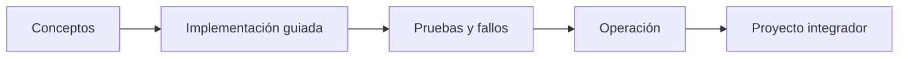

# Parte 07 — Infraestructura como código y configuración

> [← Parte 06](../part-06-kubernetes-managed-platforms/README.md) · [Índice completo](../README.md) · [Parte 08 →](../part-08-continuous-delivery-platform-engineering/README.md)

**📥 Descargar:** [Esta parte en PDF](../../site/downloads/partes/manual-parte-07-infrastructure-as-code-configuration.pdf) · [Manual integral](../../site/downloads/multi-cloud-engineering-manual-v2.0.pdf)

**Nivel:** intermedio-avanzado · **Clases:** 12 · **Duración sugerida:** 6–8 semanas

Convertir infraestructura y políticas en cambios revisables, probables y repetibles.

## Resultados de la parte

Al completar esta parte podrás explicar el dominio con lenguaje independiente del proveedor,
implementar sus mecanismos esenciales, diagnosticar fallos y defender decisiones mediante
evidencia, costo, seguridad y objetivos de confiabilidad.

## Modelo mental

IaC trata la infraestructura como producto versionado: el plan explica intención, el estado conecta intención y realidad, y la revisión reduce cambios accidentales.

## Secuencia

## Clases

| ID | Clase | Laboratorio | Horas |
|---:|---|---|---:|
| 085 | [Declarativo, imperativo, idempotencia y convergencia](085-declarativo-imperativo-idempotencia-y-convergencia/README.md) | `iac` | 4 |
| 086 | [Terraform: HCL, providers, resources y grafo](086-terraform-hcl-providers-resources-y-grafo/README.md) | `iac` | 4 |
| 087 | [Estado remoto, locking, cifrado y recuperación](087-estado-remoto-locking-cifrado-y-recuperacion/README.md) | `iac` | 4 |
| 088 | [Módulos, contratos, versiones y composición](088-modulos-contratos-versiones-y-composicion/README.md) | `iac` | 4 |
| 089 | [Variables, outputs, locals y data sources](089-variables-outputs-locals-y-data-sources/README.md) | `iac` | 4 |
| 090 | [Plan, apply, drift, import y refactor con moved](090-plan-apply-drift-import-y-refactor-con-moved/README.md) | `iac` | 4 |
| 091 | [Validación, lint, pruebas y policy as code](091-validacion-lint-pruebas-y-policy-as-code/README.md) | `testing` | 4 |
| 092 | [Secretos y datos sensibles en IaC](092-secretos-y-datos-sensibles-en-iac/README.md) | `security` | 4 |
| 093 | [CloudFormation, Bicep, Pulumi y Terraform](093-cloudformation-bicep-pulumi-y-terraform/README.md) | `decision` | 4 |
| 094 | [Ansible e imagen dorada para configuración](094-ansible-e-imagen-dorada-para-configuracion/README.md) | `configuration` | 4 |
| 095 | [Plantillas, golden paths y catálogo interno](095-plantillas-golden-paths-y-catalogo-interno/README.md) | `platform` | 4 |
| 096 | [Proyecto: infraestructura multiambiente promovible](096-proyecto-infraestructura-multiambiente-promovible/README.md) | `capstone` | 8 |

## Evaluación de la parte

- 35 % laboratorios y evidencia reproducible.
- 25 % retos verificables.
- 20 % decisiones y ADR.
- 10 % seguridad, confiabilidad y costo.
- 10 % proyecto integrador de la parte.

Se aprueba con 80 % de clases en nivel B o superior y el proyecto integrador reproducible.

## Pauta bibliográfica

- Infrastructure as Code — Kief Morris.
- Terraform: Up & Running — Yevgeniy Brikman.
- Ansible for DevOps — Jeff Geerling.
