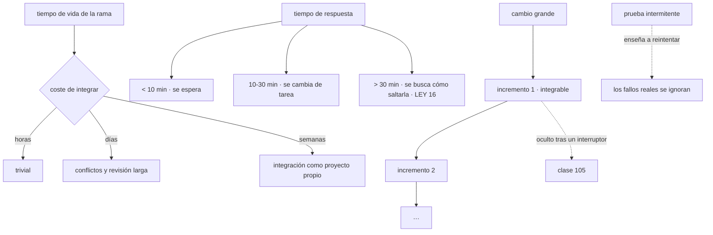

# 097 — Integración continua, trunk-based development y feedback

> [← 096 · Proyecto: infraestructura multiambiente promovible](../../part-07-infrastructure-as-code-configuration/096-proyecto-infraestructura-multiambiente-promovible/README.md) · [Índice de la parte](../README.md) · [098 · GitHub Actions: workflows, runners, permisos y caché →](../../part-08-continuous-delivery-platform-engineering/098-github-actions-workflows-runners-permisos-y-cache/README.md)

**Parte:** 08 — Entrega continua y platform engineering<br>
**Nivel:** avanzado · **Horas estimadas:** 4<br>
**Laboratorio:** `delivery` · **Estado:** `EXECUTABLE_CORE`

## 🎯 Propósito

Fijar por qué la integración continua es una práctica de organización del trabajo y no una herramienta, y cuál es la magnitud que lo decide todo: **cuánto tiempo vive el trabajo sin integrarse**. De ahí salen las ramas largas, los conflictos caros y las revisiones que nadie puede evaluar. La clase establece además el número que gobierna esta parte —el tiempo de respuesta de la canalización— y la ley 16 aparece por sexta vez con un mecanismo nuevo: **si la canalización tarda demasiado, la gente encuentra cómo saltársela**.

## 📚 Resultados de aprendizaje

Al finalizar podrás:

1. **Distinguir** integración continua de tener una canalización, con la comprobación que las separa.
2. **Medir** el tiempo de vida de las ramas y su relación con el coste de integrar.
3. **Dividir** un cambio grande en incrementos integrables sin dejar de entregar valor.
4. **Dimensionar** el tiempo de respuesta de la canalización y saber qué ocurre al superarlo.
5. **Diagnosticar** una prueba intermitente en vez de reintentarla.

## 🧩 Conceptos centrales

| Concepto | Comprensión verificable |
|---|---|
| `integración continua` | Práctica en la que todo el mundo integra su trabajo en la línea principal **al menos una vez al día**. No es tener una canalización: es una decisión sobre cómo se organiza el trabajo. |
| `tiempo de vida de una rama` | Horas entre crearla y fusionarla. El coste de integrar crece más deprisa que ese tiempo, porque crecen a la vez el tamaño y la divergencia. |
| `tiempo de respuesta` | Minutos desde que se envía un cambio hasta que se sabe si está bien. Por encima de cierto umbral, la gente deja de esperarlo y trabaja sobre supuestos. |
| `prueba intermitente` | Prueba que falla sin motivo reproducible. Su daño real no es el fallo: es que **enseña a reintentar**, y con ello a ignorar los fallos verdaderos. |
| `incremento integrable` | Trozo de trabajo que se puede fusionar sin romper nada, aunque la funcionalidad completa no esté. Es lo que hace posible integrar a diario. |
| `línea principal siempre desplegable` | Invariante del método: en cualquier momento, lo que hay en la rama principal se puede desplegar. Sin ella, la integración diaria no aporta. |

## 🧠 Modelo mental

Una plataforma interna ofrece capacidades como productos y reduce carga cognitiva mediante caminos dorados, sin quitar autonomía donde importa.

Aplicado a esta clase, separa siempre cuatro planos: **intención** (qué necesita el usuario),
**configuración** (qué declaramos), **estado observado** (qué existe de verdad) y
**evidencia** (cómo sabemos que cumple). Confundirlos produce diseños que se ven correctos
en un diagrama pero fallan al operar.

## 🗺️ Flujo de razonamiento



## 📖 Desarrollo

### 1. La práctica no es la herramienta

Casi todas las organizaciones tienen una canalización y muy pocas hacen integración continua. La diferencia es una definición que conviene tomarse en serio:

```text
tener una canalización     algo se ejecuta cuando envío código
integración continua       CADA PERSONA integra su trabajo en la línea
                           principal al menos una vez al día,
                           y la línea principal se puede desplegar siempre
```

La comprobación que las separa es una sola pregunta con respuesta medible:

```bash
$ git for-each-ref --format='%(refname:short) %(committerdate:relative)' refs/remotes/origin \
  | grep -v 'origin/main' | head -20
```

Si hay ramas de más de un día, no hay integración continua. Hay una canalización que se ejecuta sobre ramas que divergen.

Y el motivo por el que la magnitud importa es que **el coste de integrar no crece linealmente**:

```text
una rama de 4 horas      un conflicto trivial, si acaso
una rama de 3 días       varios conflictos, y hay que recordar por qué
una rama de 3 semanas    la integración es un proyecto, con su riesgo propio
                         y la revisión es imposible de evaluar de verdad
```

Crecen dos cosas a la vez —el tamaño del cambio y la divergencia respecto de la línea principal— y su producto es lo que se paga.

Y hay un efecto secundario que se nota en la calidad de la revisión y que rara vez se dice:

```text
un cambio de 50 líneas       se revisa de verdad, con comentarios concretos
un cambio de 2.000 líneas    se aprueba
```

La segunda no es una revisión: es un trámite. Y eso convierte todo el trabajo de las clases 091 y siguientes en la única barrera real, porque la humana ha dejado de funcionar.

Y la objeción habitual —«no puedo integrar hasta que la funcionalidad esté completa»— tiene una respuesta que es la mitad de esta clase: **integrar no es publicar**. Un incremento puede estar en la línea principal, desplegado en producción y **apagado**, que es la materia de la clase 105. Sin ese mecanismo, la integración diaria es imposible para cualquier cambio que dure más de un día, y con él es casi siempre posible.

Y las tres consecuencias de trabajar así, que son las que justifican el esfuerzo:

```text
los conflictos son triviales o no existen
el origen de un fallo es evidente: pocos cambios entre versiones que funcionan
y la vuelta atrás es pequeña, porque el cambio es pequeño
```

### 2. Dividir sin dejar de entregar

La habilidad que hace posible todo lo anterior es dividir un cambio grande en incrementos que se puedan integrar. Hay cuatro técnicas y conviene tenerlas nombradas:

**1. Ocultar tras un interruptor.** El código nuevo se integra y no se ejecuta hasta que alguien lo activa. Es la técnica general y la clase 105 la desarrolla.

**2. Expandir y contraer.** Ya apareció en las clases 071, 079 y 088, y aquí es el mecanismo para cambiar una interfaz sin romper a nadie:

```text
1. añadir lo nuevo, conservando lo viejo
2. migrar a los consumidores, uno a uno, integrando cada paso
3. retirar lo viejo cuando nadie lo use
```

Cuarta aparición de la misma técnica en el programa, y siempre con la misma condición: **hay que llegar al paso 3**. Un expandir sin contraer deja dos formas de hacer lo mismo para siempre.

**3. Rama por abstracción.** Para sustituir un componente grande sin una rama larga:

```text
1. introducir una abstracción delante del componente actual
2. integrar; todo sigue funcionando igual
3. escribir la implementación nueva detrás de la abstracción, integrando a diario
4. cambiar cuál se usa, con un interruptor
5. retirar la vieja y, si sobra, la abstracción
```

Es más trabajo que una rama larga y **el trabajo es visible y revisable en trozos**, en vez de invisible durante tres semanas y luego imposible de revisar.

**4. Entregar en oscuro.** El camino nuevo se ejecuta en paralelo con el viejo, sin que su resultado se use, y se comparan. Es caro y es la única forma honesta de sustituir algo cuyo comportamiento no se puede especificar por completo.

Y una advertencia sobre los interruptores que la clase 105 desarrolla y conviene anticipar: **cada uno es deuda con fecha**. Un interruptor que lleva un año activo al 100 % no es un interruptor, es una rama muerta con un condicional.

Y sobre la **revisión**, dos prácticas que reducen el tiempo de vida de las ramas más que ninguna herramienta:

```text
revisar en horas, no en días
  una revisión que tarda dos días convierte cualquier rama en una rama larga
  → un compromiso explícito de tiempo de respuesta, como el de la canalización

programación en pareja o en grupo
  la revisión ocurre mientras se escribe; la integración es inmediata
  → no es para todo el trabajo, y para lo complejo suele salir más barato
```

La primera es la que más impacto tiene y la que menos se mide. Un equipo con una canalización de cinco minutos y revisiones de dos días **no tiene un problema de herramientas**.

### 3. El tiempo de respuesta, y la ley 16

El número que gobierna esta parte es cuánto tarda alguien en saber si su cambio está bien. Y sus umbrales están medidos:

```text
< 10 minutos    se espera mirando; el trabajo continúa sobre información cierta
10-30 minutos   se cambia de tarea; volver cuesta el coste de recuperar contexto
> 30 minutos    se deja de esperar; se trabaja sobre supuestos
> 1 hora        se busca cómo saltarla
```

La última línea es la ley 16 de la clase 096 con un mecanismo nuevo, y es su sexta aparición en el programa: **un control que hace el trabajo más lento se rodea**. Aquí se rodea de formas concretas y reconocibles:

```text
fusionar sin esperar al resultado
saltarse comprobaciones con una etiqueta o una opción
acumular varios cambios en una sola ejecución
y, la peor, desactivar pruebas que "tardan mucho"
```

De ahí que reducir el tiempo de respuesta no sea una mejora de comodidad sino **la condición para que las comprobaciones sobrevivan**.

Las palancas, por orden de efecto:

```text
1. dividir en etapas por coste (clase 091)
   lo rápido primero; lo caro solo si lo rápido pasa
2. paralelizar lo independiente
   y no paralelizar lo que comparte estado, que produce intermitencia
3. caché de dependencias y de construcción (clase 062)
   la diferencia entre once minutos y noventa segundos
4. ejecutar solo lo afectado
   con un mapa de dependencias real, no por corazonada
5. mover lo caro fuera del camino crítico
   pruebas largas y análisis profundos, programados o antes de fusionar
```

Y la cuarta merece una advertencia: **seleccionar qué pruebas ejecutar es una optimización con riesgo**. Un mapa de dependencias incompleto deja pasar una rotura, y ese fallo aparece más tarde y cuesta más. Solo compensa con un mapa derivado del código, no mantenido a mano.

Y una comprobación que conviene tener, porque el tiempo de respuesta se degrada solo:

```text
mediana y percentil 95 del tiempo de la canalización, por semana
  → una tendencia al alza es deuda que se paga en integración diaria
```

Y dos cifras más que la parte 08 va a usar y conviene empezar a medir ya:

```text
tiempo de vida de las ramas: mediana y percentil 90
proporción de ejecuciones que fallan por causas no reproducibles
```

### 4. La prueba intermitente enseña a ignorar

Una prueba que falla sin motivo reproducible parece un problema menor y es uno de los peores, porque su daño no es el fallo:

```text
el daño real es que ENSEÑA A REINTENTAR
y quien reintenta por costumbre ignora también los fallos verdaderos
```

La consecuencia se mide y suele sorprender:

```text
proporción de ejecuciones fallidas que se reintentan sin investigar
  por encima del 10 %, la canalización ha dejado de ser una señal
```

Es la ley 15 de la clase 096 aplicada a la canalización: **una señal que se equivoca a menudo deja de ser una señal**.

Las causas, en orden de frecuencia, y qué hacer con cada una:

```text
dependencia de tiempo         esperas fijas en vez de esperar a una condición
                              → sustituir cada espera fija por una condición
dependencia de orden          las pruebas comparten estado y el orden varía
                              → aislar el estado; ejecutar en orden aleatorio
                                a propósito para detectarlo
recursos compartidos          un puerto, un fichero, una base de datos común
                              → recursos únicos por ejecución
dependencia externa           una API de terceros dentro de una prueba unitaria
                              → sustituirla; si hace falta de verdad,
                                es otra categoría de prueba
concurrencia real             una condición de carrera en el código
                              → es un HALLAZGO, no un problema de la prueba
```

La última merece subrayarse: una prueba intermitente por concurrencia está **encontrando un defecto real** que aparecerá en producción. Silenciarla es silenciar el hallazgo.

Y el procedimiento que evita que se acumulen, que hay que decidir antes de tener veinte:

```text
1. detectar: ejecutar la suite varias veces sobre el mismo commit
   las que fallan alguna vez son intermitentes
2. cuarentena inmediata: sacarla del camino crítico, con su fallo registrado
3. plazo: una semana para arreglarla o borrarla
4. y un tope: si hay más de N en cuarentena, se para y se arreglan
```

El paso 3 es incómodo y necesario. Una prueba en cuarentena indefinida es una prueba que no existe, con el coste de mantenerla.

Y una comprobación barata que detecta la mayoría antes de que molesten:

```bash
# ejecutar la suite cinco veces sobre el mismo commit
$ for i in 1 2 3 4 5; do npm test -- --seed=$RANDOM 2>&1 | tail -1; done
```

La aleatorización de la semilla es lo que destapa las dependencias de orden, que son la segunda causa y la más difícil de encontrar cuando ya está instalada.

### 5. Lo que la canalización debe garantizar

Con lo anterior, la canalización de integración tiene un contrato corto y verificable:

```text
en cada cambio, antes de fusionar
  ☐ construir el artefacto UNA vez (clase 062)
  ☐ comprobaciones rápidas: formato, análisis estático, pruebas unitarias
  ☐ pruebas de integración con dependencias reales acotadas
  ☐ análisis de seguridad y de dependencias (clase 101)
  ☐ y el resultado en menos de diez minutos

al fusionar
  ☐ publicar el artefacto por huella, firmado y con procedencia (clases 061, 067)
  ☐ desplegar a un entorno donde se pueda comprobar de verdad
```

Y tres propiedades que hacen que ese contrato se sostenga:

**La línea principal siempre desplegable.** Sin ella, la integración diaria no aporta: se integra en algo que no funciona. Y el mecanismo que la protege es una cola de fusión que verifica el resultado **combinado** antes de fusionar:

```text
dos cambios que pasan por separado pueden romper al combinarse
  → sin cola de fusión, eso rompe la línea principal
  → con ella, se detecta antes de fusionar
```

Es un mecanismo que solo hace falta con cierto volumen, y a partir de ahí es imprescindible.

**La construcción es reproducible.** La regla de la clase 062: se construye una vez y se promueve. Una canalización que construye de nuevo en cada entorno rompe la garantía de que lo probado es lo desplegado.

**La canalización se define en el repositorio.** Configurada en la interfaz de una herramienta, es un estado que nadie revisa y que se desvía —lo mismo que la infraestructura de la parte 07, con el mismo remedio.

Y el cierre que enlaza con la clase siguiente: todo lo anterior necesita ejecutarse en algún sitio, con alguna identidad y con acceso a algún artefacto. **Ese ejecutor es el actor más privilegiado del sistema**, y su tratamiento es la materia de la clase 098 y una de las dos predicciones de la hipótesis que abrió esta parte.

## 🔬 Ejemplo trabajado

**CloudShop tiene una canalización desde hace tres años y ninguna de las propiedades de esta clase. La medición previa da cuatro números que explican por qué los despliegues son difíciles.**

**La medición.**

```text
tiempo de vida de las ramas    mediana 6 días · percentil 90: 23 días
tamaño del cambio             mediana 340 líneas · percentil 90: 2.900
tiempo de respuesta           mediana 34 min · percentil 95: 71 min
ejecuciones reintentadas sin investigar   31 %
revisiones que tardan más de un día       58 %
```

Y las cuatro consecuencias, todas visibles en el historial:

```text
conflictos de integración al mes                    41
reversiones tras fusionar                            9
cambios fusionados sin esperar el resultado         14
pruebas desactivadas en los últimos 12 meses        23
```

La última cifra es la ley 16: con un tiempo de respuesta de 71 minutos en el percentil 95, **desactivar pruebas lentas era la forma racional de trabajar**.

**Corrección 1 — el tiempo de respuesta.**

El desglose de los 34 minutos:

```text
instalar dependencias                    9 min 20 s   sin caché
construir                                6 min 10 s   sin caché
pruebas unitarias                        4 min 40 s
pruebas de integración                  11 min 30 s   secuenciales
análisis de seguridad                    2 min 20 s
```

```text                                        antes            después
caché de dependencias y construcción        ninguna         compartida (062)
pruebas de integración                     secuenciales    4 en paralelo
análisis profundo                       en cada cambio    programado y antes
                                                          de fusionar
tiempo de respuesta (mediana)               34 min           6 min 40 s
percentil 95                                71 min          9 min 10 s
```

Y el efecto sobre el comportamiento, medido dos meses después:

```text
cambios fusionados sin esperar el resultado    14 → 0
pruebas desactivadas                            0 nuevas
```

**Corrección 2 — las pruebas intermitentes.**

Ejecutar la suite cinco veces sobre el mismo commit:

```text
pruebas que fallaron alguna vez                 19 de 1.240
causa
  esperas fijas                                  8
  dependencia de orden                           6
  puerto o fichero compartido                    3
  condición de carrera real en el código         2   ← hallazgo
```

Las dos últimas eran defectos reales: una condición de carrera en la actualización de un contador de inventario que producía, en producción, discrepancias de stock que se atribuían a errores de conteo manual.

```text                                        antes            después
pruebas intermitentes                          19                0
defectos reales encontrados por ellas           —                2
reintentos sin investigar                     31 %             3 %
cuarentena con plazo de una semana           no había         política activa
aleatorización del orden                     no había         en cada ejecución
```

**Corrección 3 — el tiempo de vida de las ramas.**

Dos cambios, y el segundo fue el que de verdad movió la cifra:

```text
1. compromiso de revisión en menos de 4 horas laborables
2. formación en las cuatro técnicas de división, con un caso real:
   la sustitución del motor de precios, planificada como rama de 6 semanas,
   se hizo con rama por abstracción en 19 incrementos integrados a diario
```

```text                                        antes            después
mediana del tiempo de vida                   6 días           7 horas
percentil 90                                23 días          1,5 días
mediana del tamaño del cambio               340 líneas       95 líneas
revisiones de más de un día                   58 %             6 %
conflictos de integración al mes               41                3
```

Y la sustitución del motor de precios merece detalle porque es el argumento contra las ramas largas:

```text                                    rama larga (estimada)   incrementos
duración                                      6 semanas          7 semanas
revisiones significativas                     1, de 4.800 líneas  19, de ~250
defectos encontrados durante el desarrollo    —                   6
defectos encontrados tras publicar            —                   1
riesgo de la integración final              alto                 ninguno
posibilidad de parar a mitad                 ninguna             en cualquier punto
```

Una semana más de calendario, y seis defectos encontrados mientras se escribía en vez de al final. La última fila fue la que convenció: **el trabajo se pudo pausar dos veces por urgencias sin dejar nada a medias**.

**Corrección 4 — la línea principal desplegable.**

```text
veces que la línea principal estuvo rota en 12 meses     34
tiempo medio de rotura                                   2 h 40 min
causa más frecuente        dos cambios que pasaban por separado y no juntos
```

```text                                        antes            después
cola de fusión                              no había          activa
roturas de la línea principal (6 meses)        17                1
la única                                        —          una dependencia
                                                           externa retirada
```

**Resumen:**

```text                                          antes         después
tiempo de respuesta (mediana)                 34 min         6 min 40 s
mediana del tiempo de vida de una rama        6 días         7 horas
mediana del tamaño de un cambio             340 líneas      95 líneas
pruebas intermitentes                            19             0
reintentos sin investigar                      31 %            3 %
conflictos de integración al mes                 41             3
roturas de la línea principal (6 meses)          17             1
pruebas desactivadas en el periodo               23             0
```

**La lección que esta clase traslada al resto de la parte 08**: las veintitrés pruebas desactivadas no eran negligencia sino **la respuesta racional a una canalización de 71 minutos**, que es la ley 16 en su sexta aparición. Y el cambio con más efecto no fue técnico: pasar de ramas de seis días a siete horas redujo los conflictos de 41 a 3 al mes y convirtió las revisiones en algo que se puede hacer de verdad. **Una revisión de 2.900 líneas no es una revisión: es una aprobación.**

## 🧪 Laboratorio guiado

Ejecuta desde la raíz:

```bash
python classes/part-08-continuous-delivery-platform-engineering/097-integracion-continua-trunk-based-development-y-feedback/lab.py
```

El laboratorio selecciona el motor de práctica **`delivery`** y produce
`lab_result.json`. El escenario, sus comprobaciones y el artefacto esperado corresponden a
esta clase; no requiere credenciales y deja explícito qué debe revalidarse en un sandbox real.

1. Lee `exercise.steps` y formula una predicción antes de ejecutar.
2. Ejecuta la práctica y verifica todos los elementos de `checks`.
3. Provoca el caso de `negative_test` y explica la señal observada.
4. Materializa `flujo-ci` en `evidence/` usando la plantilla indicada.
5. Para proveedor real, sigue `sandbox.requires`, registra costo y ejecuta `destroy`.

### Evidencia esperada

El artefacto principal es un pipeline con gates, promoción y rollback. Además, la entrega debe incluir el comando ejecutado,
la salida estructurada y una conclusión que no exceda lo observado.

## 🏆 Reto verificable

Construye **`flujo-ci`** para el caso CloudShop. Incluye una alternativa descartada,
un supuesto que pueda falsarse, una prueba de fallo y una decisión de rollback.

## ✅ Criterio de aceptación

- [ ] `lab.py` termina con código 0 y genera JSON válido.
- [ ] La entrega conecta al menos tres requisitos con mecanismos verificables.
- [ ] Existe una prueba positiva y una prueba negativa con evidencia.
- [ ] Seguridad, costo y operación aparecen como decisiones, no como anexos.
- [ ] Se declara una limitación y una condición que obligaría a revisar el diseño.
- [ ] Otra persona puede repetir el recorrido sin conocimiento tácito.

## ⚠️ Errores frecuentes

| Síntoma | Causa probable | Corrección |
|---|---|---|
| Se desactivan pruebas porque tardan demasiado | Es la ley 16: la canalización hace el trabajo más lento y se rodea | Reduce el tiempo de respuesta por debajo de diez minutos antes de exigir que nadie desactive nada. |
| Los conflictos de integración son frecuentes y caros | Las ramas viven días o semanas, así que crecen a la vez el tamaño y la divergencia | Integra a diario dividiendo el trabajo, y compromete un tiempo de revisión en horas. |
| Las revisiones se aprueban sin comentarios de fondo | Un cambio de miles de líneas no se puede evaluar | Divide en incrementos integrables; un cambio de menos de cien líneas se revisa de verdad. |
| Los fallos de la canalización se reintentan por costumbre | Hay pruebas intermitentes y han enseñado a no confiar en la señal | Detéctalas ejecutando la suite varias veces, ponlas en cuarentena con plazo y arréglalas o bórralas. |
| La línea principal se rompe con cambios que pasaban por separado | No se verifica el resultado combinado antes de fusionar | Cola de fusión que comprueba la combinación; a partir de cierto volumen es imprescindible. |
| No se puede integrar hasta que la funcionalidad esté completa | Se confunde integrar con publicar | Integra el incremento apagado tras un interruptor, o usa rama por abstracción para sustituciones grandes. |

## 🛡️ Seguridad, ética y costo

Trabaja con cuentas propias o sandboxes autorizados. No publiques secretos, identificadores
reales ni datos personales. Antes de crear recursos pagos define presupuesto, etiquetas y
comando de destrucción; después verifica que no queden recursos huérfanos. Los ejemplos
locales enseñan contratos, pero no certifican cumplimiento ni disponibilidad de producción.

## ❓ Preguntas de comprobación

1. ¿Qué comprobación distingue tener una canalización de hacer integración continua?
2. ¿Por qué el coste de integrar no crece linealmente con el tiempo de vida de una rama?
3. Enumera las cuatro técnicas de división y para qué sirve cada una.
4. ¿Qué umbrales tiene el tiempo de respuesta y qué ocurre al superar el último?
5. ¿Por qué el daño de una prueba intermitente no es el fallo, y qué procedimiento evita que se acumulen?

## 🔗 Referencias

- Jez Humble, David Farley (2010). *Continuous Delivery*, cap. 3 — integración continua y línea principal desplegable. <https://continuousdelivery.com/>
- Martin Fowler (2023). *Patterns for managing source code branches* — tiempo de vida de ramas y técnicas de división. <https://martinfowler.com/articles/branching-patterns.html>
- Paul Hammant (2020). *Branch by abstraction* — sustituir un componente sin rama larga. <https://www.branchbyabstraction.com/>
- Google (2020). *Flaky tests at scale* — causas, cuarentena y coste de la intermitencia. <https://testing.googleblog.com/2020/12/test-flakiness-one-of-main-challenges.html>
- Nicole Forsgren et al. (2018). *Accelerate*, cap. 4 — tiempo de entrega, lotes pequeños y su efecto medido. <https://itrevolution.com/product/accelerate/>
- Documentación oficial vigente del servicio implementado; registra URL y fecha de consulta.

---

> [Evaluación](assessment.md) · [Contrato de clase](lesson.yaml) · [Índice de la parte](../README.md)

**📥 Descargar:** [Parte 08 en PDF](../../../site/downloads/partes/manual-parte-08-continuous-delivery-platform-engineering.pdf) · [Manual integral](../../../site/downloads/multi-cloud-engineering-manual-v2.0.pdf)

| Anterior | Índice | Siguiente |
|---|---|---|
| [← 096 · Proyecto: infraestructura multiambiente promovible](../../part-07-infrastructure-as-code-configuration/096-proyecto-infraestructura-multiambiente-promovible/README.md) | [Parte 08](../README.md) · [Programa](../../README.md) | [098 · GitHub Actions: workflows, runners, permisos y caché →](../../part-08-continuous-delivery-platform-engineering/098-github-actions-workflows-runners-permisos-y-cache/README.md) |
