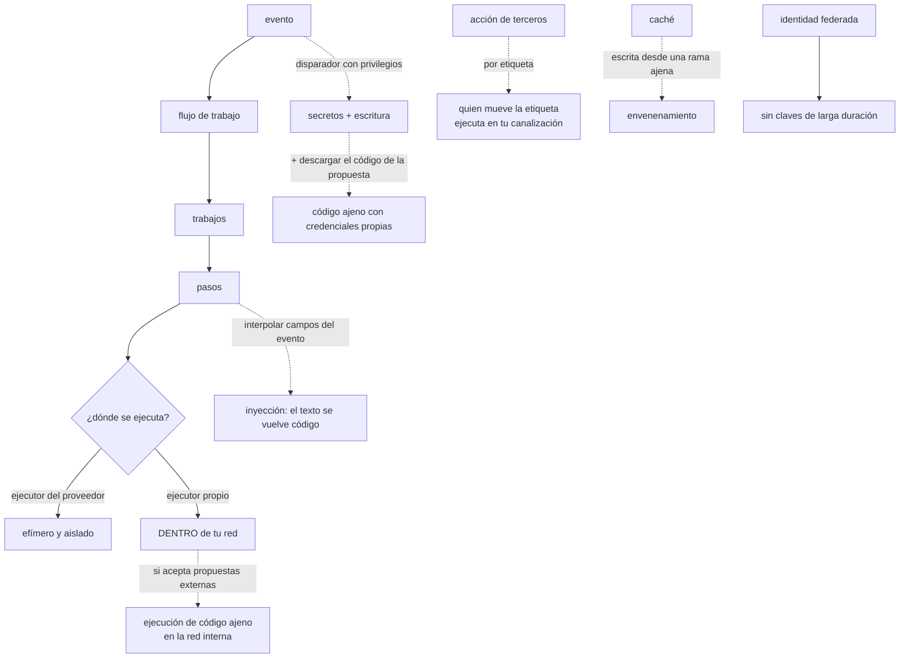

# 098 — GitHub Actions: workflows, runners, permisos y caché

> [← 097 · Integración continua, trunk-based development y feedback](../../part-08-continuous-delivery-platform-engineering/097-integracion-continua-trunk-based-development-y-feedback/README.md) · [Índice de la parte](../README.md) · [099 · Artefactos inmutables, semver y promoción →](../../part-08-continuous-delivery-platform-engineering/099-artefactos-inmutables-semver-y-promocion/README.md)

**Parte:** 08 — Entrega continua y platform engineering<br>
**Nivel:** avanzado · **Horas estimadas:** 4<br>
**Laboratorio:** `delivery` · **Estado:** `EXECUTABLE_CORE`

## 🎯 Propósito

Operar la canalización sabiendo lo que es: **el actor más privilegiado del sistema**. Despliega en producción, lee secretos, publica artefactos y ejecuta código que llega de fuera. Esa combinación la convierte en el objetivo más valioso, que es la primera predicción de la hipótesis que abrió esta parte. La clase cubre el modelo de ejecución, los cuatro caminos por los que un cambio ajeno consigue ejecutar código con privilegios, y la disciplina de versionado que las clases 061 y 088 ya exigieron —aquí con una razón nueva y más aguda.

## 📚 Resultados de aprendizaje

Al finalizar podrás:

1. **Describir** el modelo de ejecución y dónde entra código que no controla la organización.
2. **Reconocer** los cuatro caminos de escalada característicos y cerrarlos.
3. **Acotar** los permisos del testigo y el alcance de los secretos por entorno.
4. **Fijar** acciones de terceros por revisión exacta y justificar por qué no basta la etiqueta.
5. **Configurar** ejecutores propios y caché sin abrir un camino hacia la red interna.

## 🧩 Conceptos centrales

| Concepto | Comprensión verificable |
|---|---|
| `ejecutor` | Máquina que ejecuta los pasos. Si es propia y está en la red de la organización, **cualquier código que ejecute está dentro**. |
| `disparador con privilegios` | Evento que ejecuta con permisos de escritura y acceso a los secretos del repositorio base. Combinado con descargar el código de la propuesta, ejecuta código ajeno con credenciales propias. |
| `inyección por expresión` | Interpolar un campo del evento dentro de una orden. El texto lo escribe quien abre la propuesta, así que **se convierte en código**. |
| `permisos del testigo` | Alcance de la credencial automática del repositorio. Por defecto puede ser amplio; debe declararse mínimo y por trabajo. |
| `fijación por revisión` | Referenciar una acción por su identificador exacto. Una etiqueta se puede mover, y quien la mueve ejecuta código en tu canalización. |
| `envenenamiento de caché` | Escribir en una caché desde una rama no confiable y que otra ejecución la lea. Convierte una optimización en un camino de ejecución de código. |

## 🧠 Modelo mental

Una plataforma interna ofrece capacidades como productos y reduce carga cognitiva mediante caminos dorados, sin quitar autonomía donde importa.

Aplicado a esta clase, separa siempre cuatro planos: **intención** (qué necesita el usuario),
**configuración** (qué declaramos), **estado observado** (qué existe de verdad) y
**evidencia** (cómo sabemos que cumple). Confundirlos produce diseños que se ven correctos
en un diagrama pero fallan al operar.

## 🗺️ Flujo de razonamiento



## 📖 Desarrollo

### 1. El modelo, y dónde entra código ajeno

La estructura es sencilla y lo importante es dónde se cruza con código que la organización no controla:

```text
evento          alguien envía código, abre una propuesta, publica una versión,
                o llega la hora
  flujo de trabajo
    trabajo     se ejecuta en un ejecutor; los trabajos son paralelos por defecto
      paso      una orden o una acción de terceros
```

Y los cuatro sitios por donde entra algo que no ha escrito la organización:

```text
1. el código de una propuesta ajena     lo escribe quien la abre
2. los campos del evento                título, rama, descripción: texto libre
3. las acciones de terceros             código de otros, ejecutado con tus permisos
4. las dependencias que se instalan     y sus guiones de instalación
```

Los cuatro son legítimos y necesarios. El problema aparece cuando se cruzan con **credenciales**, y ahí está toda la clase.

Y el primer punto de decisión es el **ejecutor**:

```text
del proveedor    máquina efímera, fuera de tu red, destruida al terminar
                 → el código ajeno se ejecuta en una máquina que no es tuya
propio           máquina tuya, normalmente en tu red
                 → el código ajeno se ejecuta DENTRO
```

La segunda opción existe por motivos reales —acceso a redes privadas, hardware concreto, coste— y trae una consecuencia que hay que asumir antes:

```text
un ejecutor propio que atiende propuestas de un repositorio público
es ejecución de código arbitrario dentro de la red de la organización
```

Y con un agravante: por defecto, un ejecutor no efímero **conserva el sistema de ficheros entre ejecuciones**, así que un trabajo puede dejar preparado algo que el siguiente ejecute.

Las tres medidas, y hacen falta las tres:

```text
efímeros        una máquina nueva por ejecución, destruida al terminar
aislados        en su propia red, con acceso solo a lo que necesitan
                y nunca a la red de producción
nunca para propuestas de fuera de la organización
```

La tercera es la que no se puede negociar. Y para el caso legítimo —contribuciones externas a un repositorio público— la respuesta es que esas ejecuciones vayan a ejecutores del proveedor y **sin ningún secreto**.

### 2. Los cuatro caminos de escalada

**Camino 1: el disparador con privilegios más el código ajeno.**

Hay un evento que existe para poder comentar o etiquetar propuestas externas: se ejecuta con permisos de escritura y con acceso a los secretos del repositorio base. Y es seguro **mientras no ejecute el código de la propuesta**.

```yaml
# PELIGROSO
on: pull_request_target
jobs:
  build:
    steps:
      - uses: actions/checkout@v4
        with:
          ref: ${{ github.event.pull_request.head.sha }}   # ← código ajeno
      - run: npm ci && npm test                            # ← ejecutado con secretos
```

Cualquiera que abra una propuesta puede modificar los guiones del proyecto y **ejecutarlos con las credenciales de la organización**. Es el fallo más grave y más común de esta clase.

La regla es corta:

```text
con el disparador privilegiado: NO se descarga el código de la propuesta
con el disparador normal: no hay secretos ni permisos de escritura
```

Y para lo que de verdad necesita ambas cosas —publicar un entorno de vista previa, comentar resultados—, el patrón correcto separa en dos flujos:

```text
flujo 1 · disparador normal   construye y prueba, SIN secretos
                              deja el resultado como artefacto
flujo 2 · al terminar el 1    con privilegios, LEE el artefacto
                              y publica o comenta; nunca ejecuta el código
```

**Camino 2: la inyección por expresión.**

```yaml
# PELIGROSO
- run: echo "Revisando ${{ github.event.pull_request.title }}"
```

Ese título lo escribe quien abre la propuesta, y se interpola **antes** de ejecutar la orden. Un título con la sintaxis adecuada se convierte en órdenes.

La corrección es no interpolar nunca dentro de una orden:

```yaml
- env:
    TITULO: ${{ github.event.pull_request.title }}
  run: echo "Revisando $TITULO"
```

La variable de entorno se pasa como dato y no como texto que se sustituye. Y la lista de campos que hay que tratar como texto ajeno es más larga de lo que parece: título, cuerpo, nombre de rama, mensaje de commit, nombre y correo del autor, y el contenido de cualquier etiqueta.

**Camino 3: las acciones de terceros.**

Una acción es código que se ejecuta con los permisos del trabajo. Referenciarla por etiqueta significa que **quien controle esa etiqueta puede cambiar lo que se ejecuta**:

```yaml
- uses: alguien/accion@v3                              # ← la etiqueta se mueve
- uses: alguien/accion@a1b2c3d4e5f6…                   # ← revisión exacta
```

Es la disciplina de las clases 061, 062, 081 y 088 —fijar versiones— con una razón más aguda: aquí la versión no solo cambia el comportamiento, **ejecuta código con acceso a los secretos del trabajo**.

Y dos medidas complementarias:

```text
lista de acciones permitidas a nivel de organización
un robot que proponga la actualización de las revisiones fijadas
  → sin él, fijar congela también las correcciones (clase 062)
```

**Camino 4: el envenenamiento de caché.**

Una caché escrita desde la ejecución de una propuesta puede ser leída por una ejecución posterior con más privilegios, según cómo estén organizadas las claves y las ramas. Y lo que hay en una caché se usa como si fuera propio: dependencias, binarios, artefactos intermedios.

```text
regla   la caché de las ejecuciones de propuestas NO debe ser legible
        por las ejecuciones de la rama principal
        → separar por clave, y no restaurar cachés de ramas ajenas
        en trabajos con permisos
```

### 3. Permisos, secretos e identidad

**El testigo del repositorio** es una credencial que la plataforma inyecta en cada trabajo, y su alcance por defecto puede ser mucho mayor del necesario:

```yaml
# en la raíz del flujo: mínimo por defecto
permissions:
  contents: read

jobs:
  publicar:
    permissions:
      contents: read
      packages: write
      id-token: write        # solo donde haga falta federar
```

Declararlo por trabajo, y no por flujo, es lo que evita que el trabajo de pruebas tenga permiso de escritura porque el de publicación lo necesita.

**Los secretos** se acotan por entorno, con aprobación cuando corresponde:

```yaml
jobs:
  desplegar-produccion:
    environment: produccion       # con revisores obligatorios y espera
    steps:
      - run: ./desplegar.sh
```

Eso da tres cosas a la vez: los secretos de producción **solo existen en ese trabajo**, hay aprobación humana antes de ejecutarlo, y queda registrado quién aprobó.

Y la regla que este programa lleva ocho apariciones repitiendo, ahora en su forma definitiva:

```text
la canalización NO tiene claves de la nube: tiene identidad
```

```yaml
- uses: aws-actions/configure-aws-credentials@a1b2c3d4…
  with:
    role-to-assume: arn:aws:iam::418293047512:role/despliegue-tienda
    aws-region: eu-west-1
```

Y del lado de la nube, la condición de confianza acotada al repositorio **y a la rama o al entorno**, que es el campo que ha fallado en tres de las cuatro veces que este programa lo ha comprobado:

```text
sub = repo:cloudshop/tienda:environment:produccion
```

Sin acotar, cualquier rama de ese repositorio —o de otro— obtiene credenciales de producción.

Y dos separaciones más que la clase 059 estableció y aquí se concretan:

```text
identidad de LECTURA     para planificar en propuestas
identidad de ESCRITURA   solo desde la rama principal, y con entorno protegido
```

Y un mecanismo que evita dos despliegues simultáneos, que es el bloqueo de la clase 087 en su versión de canalización:

```yaml
concurrency:
  group: desplegar-${{ github.ref }}
  cancel-in-progress: false
```

`cancel-in-progress: false` importa en un despliegue: cancelar uno a mitad deja el sistema en un estado intermedio. En cambio, en una construcción de propuesta, cancelar la anterior sí ahorra tiempo y no rompe nada.

### 4. Caché, reutilización y tiempo de respuesta

La clase 097 fijó el objetivo: por debajo de diez minutos. La caché es la palanca principal y tiene tres reglas.

**Clave exacta y claves de respaldo:**

```yaml
- uses: actions/cache@a1b2c3d4…
  with:
    path: ~/.npm
    key: npm-${{ runner.os }}-${{ hashFiles('**/package-lock.json') }}
    restore-keys: |
      npm-${{ runner.os }}-
```

La clave incluye la huella del fichero de dependencias, así que cambia solo cuando cambian. Y la clave de respaldo permite reutilizar la caché anterior cuando la exacta no existe, que es lo que evita empezar de cero tras cada actualización de dependencias.

**Lo que se cachea y lo que no:**

```text
sí    dependencias descargadas, caché de compilación, capas de imagen (062)
no    artefactos de salida — esos se publican, no se cachean
no    nada que dependa de un secreto o que lo contenga
```

**El ciclo de vida:** las cachés caducan y tienen un tope de tamaño total, con expulsión de las menos usadas. Una caché que supera el tope expulsa a las demás, así que cachear un directorio enorme puede empeorar el tiempo de todos los flujos del repositorio.

Y la **reutilización de flujos** aplica aquí la disciplina de la clase 088:

```yaml
# .github/workflows/servicio.yml — en cada servicio
jobs:
  ci:
    uses: cloudshop/plataforma/.github/workflows/servicio-ci.yml@v3.2.0
    with:
      lenguaje: go
      criticidad: 2
    secrets: inherit
```

Y con las mismas reglas que un módulo: interfaz pequeña, versionado, notas de cambio y política de soporte. Un flujo reutilizable con veinte entradas es la clase 088 otra vez.

Y dos precisiones sobre la reutilización:

```text
heredar secretos es cómodo y los comparte ENTEROS
  → mejor pasar solo los que hagan falta
un flujo reutilizable de la plataforma se ejecuta con los permisos
  del repositorio que lo llama
  → declararlos mínimos dentro del propio flujo
```

Y el tiempo de respuesta se gobierna con lo de la clase 097 más dos mecanismos propios:

```text
trabajos en paralelo con dependencias declaradas
  → solo espera lo que de verdad depende
matriz para lo que se repite
  → y con la advertencia: una matriz de 30 combinaciones
    consume 30 ejecutores y puede ser más lenta por la cola
```

Y una comprobación que conviene tener, porque el tiempo se degrada solo:

```bash
$ gh run list --workflow ci.yml --limit 100 --json durationMs \
  | jq '[.[].durationMs] | sort | .[length/2|floor] / 60000 | round'
```

### 5. La auditoría de la canalización

Con lo anterior, hay una lista de comprobaciones que se pueden ejecutar sobre los flujos de una organización:

```bash
# 1 · disparadores privilegiados que descargan código ajeno
$ grep -rlZ 'pull_request_target' .github/workflows/ \
  | xargs -0 grep -l 'head.sha\|head.ref' \
  && echo "ESCALADA: revisar de inmediato"

# 2 · interpolación de campos del evento dentro de órdenes
$ grep -rnE 'run:.*\$\{\{\s*github\.event\.' .github/workflows/

# 3 · acciones de terceros sin fijar por revisión
$ grep -rhoE 'uses:\s*[^ ]+@[^ ]+' .github/workflows/ \
  | grep -vE '@[0-9a-f]{40}' | grep -v '^uses: \./' | sort -u

# 4 · permisos no declarados o amplios
$ for f in .github/workflows/*.yml; do
    grep -q '^permissions:' "$f" || echo "sin permisos declarados: $f"
    grep -q 'permissions:.*write-all' "$f" && echo "permisos amplios: $f"
  done

# 5 · ejecutores propios en flujos que atienden propuestas
$ grep -rlZ 'self-hosted' .github/workflows/ \
  | xargs -0 grep -l 'pull_request' 

# 6 · secretos de larga duración en vez de identidad federada
$ gh secret list --json name -q '.[].name' | grep -Ei 'aws_secret|azure_client_secret|gcp_sa_key'
```

Seis comprobaciones que caben en un guion y que corresponden a los cuatro caminos más los permisos y la identidad.

Y la lista de comprobación de la clase:

```text
☐ ningún disparador privilegiado que descargue el código de la propuesta
☐ ningún campo del evento interpolado dentro de una orden
☐ acciones de terceros fijadas por revisión, con robot que proponga actualizar
☐ lista de acciones permitidas a nivel de organización
☐ permisos declarados por trabajo, mínimos
☐ secretos acotados por entorno, con aprobación en producción
☐ identidad federada acotada a repositorio y entorno; cero claves de nube
☐ ejecutores propios efímeros, aislados y nunca para propuestas externas
☐ caché separada por confianza; nada sensible cacheado
☐ concurrencia declarada, sin cancelar despliegues a mitad
☐ flujos reutilizables versionados, con interfaz pequeña
☐ tiempo de respuesta vigilado, con la mediana por debajo de diez minutos
```

Doce puntos, de los cuales siete son de seguridad. Esa proporción es la tesis de la clase y responde a la hipótesis que abrió la parte: **la canalización es el actor más privilegiado del sistema, y se audita como tal**.

Y una consecuencia que conviene enunciar porque cambia la prioridad de un equipo: **comprometer la canalización equivale a comprometer todo lo que despliega**. Los controles de las partes 05, 06 y 07 —firma de imágenes, política sobre el plan, admisión— siguen valiendo, y el actor que los ejecuta puede saltárselos si es él quien está comprometido. Por eso la separación entre la identidad que planifica y la que aplica, y la aprobación humana en producción, no son formalismos: son lo único que queda cuando el ejecutor deja de ser de fiar.

## 🔬 Ejemplo trabajado

**CloudShop audita sus flujos de canalización por primera vez. Los cinco hallazgos son de los cuatro caminos de escalada, y el primero permitía a cualquier persona de internet desplegar en producción.**

**Hallazgo 1 — cualquiera podía obtener las credenciales de producción.**

```bash
$ grep -rlZ 'pull_request_target' .github/workflows/ | xargs -0 grep -l 'head.sha'
.github/workflows/vista-previa.yml
```

El flujo construía un entorno de vista previa para cada propuesta. Se ejecutaba con el disparador privilegiado —para poder comentar el enlace— y descargaba el código de la propuesta.

```yaml
on: pull_request_target
permissions: write-all
jobs:
  vista-previa:
    steps:
      - uses: actions/checkout@v4
        with: { ref: "${{ github.event.pull_request.head.sha }}" }
      - run: make vista-previa           # ← ejecuta el Makefile de la propuesta
```

El repositorio es público. Cualquiera podía abrir una propuesta que modificara el `Makefile` y **ejecutar código con los secretos de la organización**, incluida la identidad de despliegue.

```text                                        antes            después
estructura                          un flujo privilegiado   dos flujos separados
                                    que ejecuta código ajeno
flujo 1                                     —          construye sin secretos,
                                                       deja artefacto
flujo 2                                     —          con privilegios, LEE el
                                                       artefacto, no ejecuta código
permisos                             write-all         mínimos por trabajo
tiempo expuesto                    14 meses                  —
credenciales rotadas                    —                    todas
```

Se revisó el registro de auditoría de los catorce meses buscando ejecuciones anómalas. No se encontró ninguna, y las credenciales se rotaron igualmente: **la exposición se trata por lo que permitía, no por lo que ocurrió**.

**Hallazgo 2 — 61 acciones de terceros sin fijar.**

```bash
$ grep -rhoE 'uses:\s*[^ ]+@[^ ]+' .github/workflows/ \
  | grep -vE '@[0-9a-f]{40}' | sort -u | wc -l
61
```

Sesenta y una referencias por etiqueta, de diecinueve autores distintos. Cada una es código de terceros ejecutado con los permisos del trabajo, y cada etiqueta la puede mover su autor.

```text                                        antes            después
acciones fijadas por revisión                 0 de 61        61 de 61
autores distintos                                19               6
lista de permitidas en la organización       no había         activa
robot que propone actualizar                 no había         semanal
```

La reducción de diecinueve autores a seis salió de revisar para qué servía cada una: nueve hacían algo que se resolvía con tres líneas de orden.

**Hallazgo 3 — inyección por el título de la propuesta.**

```bash
$ grep -rnE 'run:.*\$\{\{\s*github\.event\.' .github/workflows/
.github/workflows/ci.yml:41:      - run: echo "PR: ${{ github.event.pull_request.title }}" >> notas.txt
.github/workflows/etiquetar.yml:18: - run: gh pr edit ${{ github.event.pull_request.number }} …
```

Dos casos. El primero permitía ejecutar órdenes con solo poner el texto adecuado en el título de una propuesta.

```text                                        antes            después
campos del evento interpolados en órdenes         2               0
mecanismo                            interpolación directa   variable de entorno
comprobación en la canalización            no había      falla si aparece el patrón
```

**Hallazgo 4 — un ejecutor propio atendiendo propuestas del repositorio público.**

```bash
$ grep -rlZ 'self-hosted' .github/workflows/ | xargs -0 grep -l 'pull_request'
.github/workflows/integracion-lenta.yml
```

El ejecutor estaba en la red de preproducción, con acceso a la base de datos de integración y visibilidad de la red interna. Y no era efímero: conservaba el sistema de ficheros entre ejecuciones.

```text                                        antes            después
ejecutores propios                         2, persistentes   3, efímeros
ubicación                              red de preproducción  red aislada propia
acceso a la red interna                      completo        solo al registro
                                                             de artefactos
atienden propuestas externas                     sí               no
coste mensual                                 ~90 USD          ~140 USD
```

Cincuenta dólares más al mes por eliminar un camino de ejecución de código arbitrario dentro de la red.

**Hallazgo 5 — tres claves de nube de larga duración.**

```bash
$ gh secret list --json name -q '.[].name' | grep -Ei 'aws_secret|gcp_sa_key'
AWS_SECRET_ACCESS_KEY
AWS_SECRET_ACCESS_KEY_PRE
GCP_SA_KEY
```

Las tres eran anteriores a la federación de las clases 050 y 059, y ninguna se había retirado al migrar.

```text                                        antes            después
claves de nube en secretos                        3               0
identidad federada                          parcial         en los 22 flujos
condición de confianza acotada a entorno    2 de 3          3 de 3
secretos totales en la organización              41              12
```

Y la prueba negativa, quinta vez en el programa:

```text
desde una rama de trabajo, pedir la identidad de producción   denegado   ✓
desde la rama principal sin el entorno protegido              denegado   ✓
desde la rama principal con el entorno y la aprobación        concedido  ✓
```

**Y el efecto sobre el tiempo de respuesta, que se midió antes y después:**

```text                                        antes            después
mediana                                    6 min 40 s       7 min 10 s
```

Treinta segundos más por las comprobaciones añadidas. Se aceptó porque sigue por debajo del umbral de la clase 097, y porque la alternativa —quitarlas— es la ley 16 en su versión más cara.

**Resumen:**

```text                                          antes         después
caminos de escalada abiertos                      4             0
acciones fijadas por revisión                  0 de 61       61 de 61
autores de acciones de terceros                  19             6
claves de nube en secretos                        3             0
secretos totales                                 41            12
ejecutores propios efímeros y aislados        0 de 2         3 de 3
permisos declarados por trabajo                0 de 22       22 de 22
mediana del tiempo de respuesta             6 min 40 s     7 min 10 s
```

**La lección que esta clase traslada al resto de la parte 08**: los cinco hallazgos existían desde hacía entre catorce meses y tres años, en un repositorio con revisión obligatoria y comprobaciones de seguridad — porque **ninguna de esas comprobaciones miraba los propios flujos de la canalización**. Y el primero permitía a cualquiera de internet ejecutar código con las credenciales de despliegue de producción, lo que confirma la primera predicción de la hipótesis de esta parte: **la canalización es el objetivo más valioso del sistema, y hasta esta auditoría era el menos vigilado**.

## 🧪 Laboratorio guiado

Ejecuta desde la raíz:

```bash
python classes/part-08-continuous-delivery-platform-engineering/098-github-actions-workflows-runners-permisos-y-cache/lab.py
```

El laboratorio selecciona el motor de práctica **`delivery`** y produce
`lab_result.json`. El escenario, sus comprobaciones y el artefacto esperado corresponden a
esta clase; no requiere credenciales y deja explícito qué debe revalidarse en un sandbox real.

1. Lee `exercise.steps` y formula una predicción antes de ejecutar.
2. Ejecuta la práctica y verifica todos los elementos de `checks`.
3. Provoca el caso de `negative_test` y explica la señal observada.
4. Materializa `pipeline-github-actions` en `evidence/` usando la plantilla indicada.
5. Para proveedor real, sigue `sandbox.requires`, registra costo y ejecuta `destroy`.

### Evidencia esperada

El artefacto principal es un pipeline con gates, promoción y rollback. Además, la entrega debe incluir el comando ejecutado,
la salida estructurada y una conclusión que no exceda lo observado.

## 🏆 Reto verificable

Construye **`pipeline-github-actions`** para el caso CloudShop. Incluye una alternativa descartada,
un supuesto que pueda falsarse, una prueba de fallo y una decisión de rollback.

## ✅ Criterio de aceptación

- [ ] `lab.py` termina con código 0 y genera JSON válido.
- [ ] La entrega conecta al menos tres requisitos con mecanismos verificables.
- [ ] Existe una prueba positiva y una prueba negativa con evidencia.
- [ ] Seguridad, costo y operación aparecen como decisiones, no como anexos.
- [ ] Se declara una limitación y una condición que obligaría a revisar el diseño.
- [ ] Otra persona puede repetir el recorrido sin conocimiento tácito.

## ⚠️ Errores frecuentes

| Síntoma | Causa probable | Corrección |
|---|---|---|
| Cualquiera que abra una propuesta puede ejecutar código con los secretos del repositorio | Un disparador privilegiado descarga y ejecuta el código de la propuesta | Separa en dos flujos: uno construye sin secretos y deja un artefacto; el otro, con privilegios, solo lee ese artefacto. |
| Un texto en el título de una propuesta ejecuta órdenes | El campo del evento se interpola dentro de la orden antes de ejecutarla | Pásalo como variable de entorno; nunca interpoles campos del evento dentro de un `run`. |
| Una acción de terceros cambia de comportamiento sin que nadie lo decida | Está referenciada por etiqueta y quien la controla puede moverla | Fija por revisión exacta, mantén una lista de acciones permitidas y un robot que proponga actualizaciones. |
| Un ejecutor propio ejecuta código de propuestas externas dentro de la red | Se usa un ejecutor de la organización en flujos abiertos a contribuciones | Ejecutores efímeros, en red aislada, y nunca para propuestas de fuera; esas van a ejecutores del proveedor sin secretos. |
| Una caché escrita desde una propuesta se usa en la rama principal | Las claves no separan por confianza | Separa las cachés por origen y no restaures cachés de ramas ajenas en trabajos con permisos. |
| Existen claves de nube de larga duración en los secretos del repositorio | Quedaron al migrar a identidad federada y nadie las retiró | Migra los flujos restantes, acota la confianza a repositorio y entorno, y retira las claves comprobando con la prueba negativa. |

## 🛡️ Seguridad, ética y costo

Trabaja con cuentas propias o sandboxes autorizados. No publiques secretos, identificadores
reales ni datos personales. Antes de crear recursos pagos define presupuesto, etiquetas y
comando de destrucción; después verifica que no queden recursos huérfanos. Los ejemplos
locales enseñan contratos, pero no certifican cumplimiento ni disponibilidad de producción.

## ❓ Preguntas de comprobación

1. ¿Cuáles son los cuatro sitios por los que entra código que la organización no controla?
2. ¿Por qué un disparador privilegiado combinado con descargar el código de la propuesta es una escalada, y cuál es el patrón correcto?
3. ¿Por qué fijar una acción por etiqueta es insuficiente, y qué razón lo hace más grave aquí que en un módulo?
4. ¿Qué tres medidas hacen aceptable un ejecutor propio, y cuál no se puede negociar?
5. ¿Por qué la separación entre identidad de lectura y de escritura no es un formalismo?

## 🔗 Referencias

- GitHub (2025). *Security hardening for GitHub Actions* — disparadores, inyección, permisos y acciones de terceros. <https://docs.github.com/en/actions/security-for-github-actions/security-guides/security-hardening-for-github-actions>
- GitHub (2025). *About OpenID Connect in GitHub Actions* — identidad federada y condiciones de confianza. <https://docs.github.com/en/actions/security-for-github-actions/security-hardening-your-deployments/about-security-hardening-with-openid-connect>
- GitHub (2025). *Self-hosted runners: security considerations* — riesgos y ejecutores efímeros. <https://docs.github.com/en/actions/hosting-your-own-runners/managing-self-hosted-runners/about-self-hosted-runners>
- GitHub (2025). *Caching dependencies* — claves, claves de respaldo, alcance y expulsión. <https://docs.github.com/en/actions/writing-workflows/choosing-what-your-workflow-does/caching-dependencies-to-speed-up-workflows>
- OpenSSF (2025). *Scorecard checks for CI/CD* — fijación por revisión, permisos y automatización de la revisión. <https://github.com/ossf/scorecard/blob/main/docs/checks.md>
- Documentación oficial vigente del servicio implementado; registra URL y fecha de consulta.

---

> [Evaluación](assessment.md) · [Contrato de clase](lesson.yaml) · [Índice de la parte](../README.md)

**📥 Descargar:** [Parte 08 en PDF](../../../site/downloads/partes/manual-parte-08-continuous-delivery-platform-engineering.pdf) · [Manual integral](../../../site/downloads/multi-cloud-engineering-manual-v2.0.pdf)

| Anterior | Índice | Siguiente |
|---|---|---|
| [← 097 · Integración continua, trunk-based development y feedback](../../part-08-continuous-delivery-platform-engineering/097-integracion-continua-trunk-based-development-y-feedback/README.md) | [Parte 08](../README.md) · [Programa](../../README.md) | [099 · Artefactos inmutables, semver y promoción →](../../part-08-continuous-delivery-platform-engineering/099-artefactos-inmutables-semver-y-promocion/README.md) |
