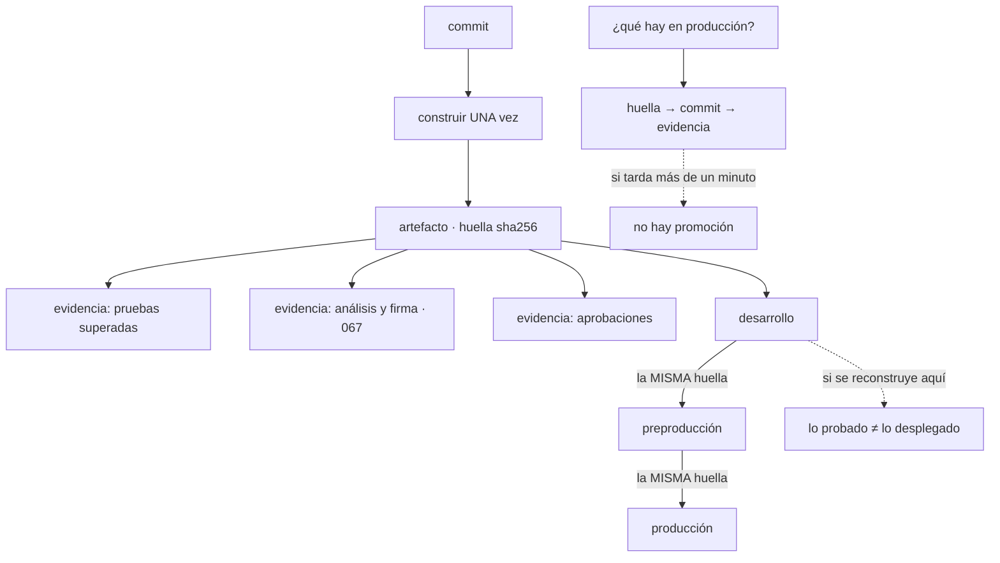

# 099 — Artefactos inmutables, semver y promoción

> [← 098 · GitHub Actions: workflows, runners, permisos y caché](../../part-08-continuous-delivery-platform-engineering/098-github-actions-workflows-runners-permisos-y-cache/README.md) · [Índice de la parte](../README.md) · [100 · Pruebas, calidad y puertas de cambio →](../../part-08-continuous-delivery-platform-engineering/100-pruebas-calidad-y-puertas-de-cambio/README.md)

**Parte:** 08 — Entrega continua y platform engineering<br>
**Nivel:** avanzado · **Horas estimadas:** 4<br>
**Laboratorio:** `supply-chain` · **Estado:** `EXECUTABLE_CORE`

## 🎯 Propósito

Convertir el artefacto en la unidad que se promueve, con una pregunta que decide si el sistema es auditable: **¿qué hay ahora mismo en producción, de qué commit salió y qué demuestra que se probó?** Si responderla lleva más de un minuto, la promoción no existe: hay reconstrucciones con el mismo nombre. La clase fija qué hace promocionable a un artefacto, qué información viaja con él, y por qué el versionado semántico resuelve un problema que muchos servicios no tienen.

## 📚 Resultados de aprendizaje

Al finalizar podrás:

1. **Distinguir** promoción real de reconstrucción por entorno, con la comprobación que las separa.
2. **Decidir** el esquema de versionado según haya o no consumidores externos.
3. **Adjuntar** al artefacto la evidencia de lo que ha superado, y consultarla.
4. **Responder** en segundos qué se ejecuta en producción y qué lo respalda.
5. **Definir** una política de retención que no borre lo que está en uso.

## 🧩 Conceptos centrales

| Concepto | Comprensión verificable |
|---|---|
| `artefacto promocionable` | Identificado por huella, inmutable, con su origen y su evidencia adjuntos. Lo que lo hace promocionable no es su formato: es que **no cambia al pasar de entorno**. |
| `promoción` | Mover la **misma huella** al siguiente entorno. Si en algún punto se reconstruye, lo probado y lo desplegado dejan de ser lo mismo. |
| `versionado semántico` | Contrato con consumidores: la versión anuncia si un cambio rompe. Resuelve un problema real en bibliotecas y aporta poco en un servicio sin consumidores externos. |
| `trazabilidad` | Cadena verificable de commit a artefacto y de artefacto a despliegue. Es lo que un servicio necesita de verdad, tenga o no versión semántica. |
| `evidencia adjunta` | Declaraciones asociadas a la huella: qué pruebas superó, qué análisis pasó, quién aprobó. Es la procedencia de la clase 067 extendida al ciclo de entrega. |
| `retención por referencia` | No se borra lo que algún entorno referencia, con independencia de su antigüedad. Es la regla de la clase 067 aplicada a todos los artefactos. |

## 🧠 Modelo mental

Una plataforma interna ofrece capacidades como productos y reduce carga cognitiva mediante caminos dorados, sin quitar autonomía donde importa.

Aplicado a esta clase, separa siempre cuatro planos: **intención** (qué necesita el usuario),
**configuración** (qué declaramos), **estado observado** (qué existe de verdad) y
**evidencia** (cómo sabemos que cumple). Confundirlos produce diseños que se ven correctos
en un diagrama pero fallan al operar.

## 🗺️ Flujo de razonamiento



## 📖 Desarrollo

### 1. Promover no es reconstruir

La clase 062 estableció el principio y aquí se convierte en una comprobación:

```bash
# la huella desplegada en cada entorno
$ for e in dev pre pro; do
    echo -n "$e: "; kubectl --context=$e get deploy tienda \
      -o jsonpath='{.spec.template.spec.containers[0].image}'; echo
  done
dev: registro/tienda@sha256:9f2c4a1b…
pre: registro/tienda@sha256:9f2c4a1b…
pro: registro/tienda@sha256:9f2c4a1b…
```

Tres huellas idénticas: hay promoción. Tres huellas distintas del mismo commit: hay tres artefactos que nadie ha comparado.

Y las cuatro formas de romperlo sin darse cuenta, que aparecen todas en organizaciones reales:

```text
1. reconstruir por entorno            clase 062: el `ARG ENTORNO` en el Dockerfile
2. desplegar por etiqueta             clase 061: la etiqueta se mueve
3. reconstruir para "actualizar la base de seguridad" antes de producción
   → sale un artefacto distinto del que se probó, con la mejor intención
4. una canalización por entorno, cada una con su paso de construcción
```

La tercera merece detalle porque su motivo es bueno y su efecto es el mismo: si la base ha cambiado y hay que reconstruir, lo que sale es **un artefacto nuevo que no ha pasado por preproducción**. La forma correcta es reconstruir y volver a promover desde el principio, no inyectar el artefacto nuevo al final.

Y lo que hace promocionable a un artefacto son cuatro propiedades, todas ya establecidas:

```text
identificado por huella           clase 061
inmutable en el registro          etiquetas inmutables, clase 061
con su origen verificable         procedencia, clase 067
con la configuración FUERA        clases 062, 076, 089
```

La cuarta es la que hace posibles las tres primeras. Un artefacto que lleva dentro la configuración de un entorno **no puede ser el mismo en todos**, así que no se puede promover.

Y una consecuencia práctica sobre el registro: la promoción **no copia el artefacto**. Es un cambio de referencia en el destino, no un movimiento de bytes. Copiar entre registros por entorno es una decisión de aislamiento legítima —producción no descarga del mismo sitio que desarrollo— y hay que hacerla **conservando la huella**:

```bash
$ crane copy registro-dev/tienda@sha256:9f2c… registro-pro/tienda@sha256:9f2c…
$ crane digest registro-pro/tienda@sha256:9f2c…
sha256:9f2c4a1b…                                                            ✓
```

Si al copiar cambia la huella, no se ha copiado: se ha reconstruido.

### 2. Versionar: para quién y para qué

El versionado semántico resuelve un problema concreto —**avisar a los consumidores de si un cambio rompe**— y se aplica con frecuencia donde ese problema no existe.

```text
MAYOR   cambia de forma incompatible: el consumidor tiene que hacer algo
MENOR   añade sin romper
PARCHE  corrige sin cambiar el contrato
```

Y la pregunta que decide si aporta:

```text
¿hay consumidores que eligen QUÉ VERSIÓN usar?
  sí  → biblioteca, módulo, acción, imagen base, interfaz publicada
        el versionado semántico es un contrato y hay que respetarlo
  no  → un servicio que se despliega entero y del que solo hay una versión viva
        el número aporta poco; lo que hace falta es TRAZABILIDAD
```

La segunda situación es la de la mayoría de los servicios de una organización, y ahí el esquema útil es otro:

```text
versión derivada del origen
  2026.08.03-a1b2c3d      fecha y revisión
  o simplemente la huella, con la revisión en una etiqueta estándar (clase 061)
```

Lo que hay que poder responder no es «qué versión es» sino **de qué commit salió y qué ha superado**, y eso lo dan las etiquetas y la evidencia, no el número.

Y para lo que **sí** tiene consumidores, la disciplina de la clase 088 se aplica entera, con una precisión que allí se estableció y conviene repetir:

```text
un cambio es INCOMPATIBLE aunque la interfaz no cambie
si su efecto destruye o recrea algo en el consumidor
```

Y tres prácticas que hacen que el versionado signifique algo:

```text
notas por versión, con las incompatibilidades señaladas
política de soporte: cuántas versiones mayores se mantienen
y un plazo de retirada anunciado, no descubierto
```

Y una advertencia sobre el versionado automático a partir de los mensajes de commit: funciona y **traslada una decisión de contrato a una convención de escritura**. Quien escribe el mensaje decide si la versión sube de mayor, y eso solo es aceptable si el equipo entiende que está declarando un contrato. Sin esa comprensión, produce versiones mayores por errores tipográficos y cambios incompatibles publicados como parche.

Y el caso de las **versiones previas**, que resuelve un problema real de la promoción:

```text
3.2.0-rc.1     candidata: se puede promover hasta preproducción
3.2.0          publicada: la misma huella, con otra etiqueta
```

Con la condición de siempre: **la huella no cambia al publicar**. Si publicar reconstruye, se ha vuelto al problema del apartado anterior.

### 3. La evidencia viaja con el artefacto

La clase 067 estableció que un artefacto puede llevar asociados objetos por su huella: inventario, firma y procedencia. La misma mecánica sirve para la evidencia del ciclo de entrega:

```text
qué pruebas superó, y con qué resultado
qué análisis de seguridad pasó, y en qué versión de las reglas
qué entornos ha recorrido, y cuándo
quién aprobó su paso a producción
```

Y el valor de adjuntarla en vez de guardarla en la canalización es que **sobrevive a la canalización**: los registros de las ejecuciones caducan, y la evidencia asociada a la huella no.

```bash
$ cosign attest --predicate pruebas.json --type https://cloudshop.example/pruebas/v1 \
    registro/tienda@sha256:9f2c…

$ cosign verify-attestation --type https://cloudshop.example/pruebas/v1 \
    registro/tienda@sha256:9f2c… … | jq -r '.payload' | base64 -d \
  | jq '{suite: .predicate.suite, superadas: .predicate.superadas, commit: .predicate.commit}'
{
  "suite": "integracion-v4",
  "superadas": 1284,
  "commit": "a1b2c3d4e5f6…"
}
```

Y la promoción pasa a tener una condición verificable en vez de un paso manual:

```text
para promover a preproducción   debe existir evidencia de la suite de integración
para promover a producción      además, evidencia de preproducción y una aprobación
```

Eso convierte la puerta de promoción en una comprobación de admisión —la misma idea de la clase 067— y tiene una propiedad importante: **no depende de que la canalización se comporte bien**. Un artefacto que llegara a producción por otra vía no tendría la evidencia, y la admisión lo rechazaría.

Y el **registro de promociones**, que es lo que responde la pregunta que abre la clase:

```bash
$ ./que-hay-en-produccion.sh
servicio   huella          commit    desde        evidencia
tienda     sha256:9f2c…    a1b2c3d   hace 3 días  pruebas ✓ análisis ✓ aprobó: ana
api        sha256:c74e…    e5f6a7b   hace 6 h     pruebas ✓ análisis ✓ aprobó: luis
informes   sha256:81ab…    ?         hace 4 meses  ninguna              ← revisar
```

La última fila es el tipo de hallazgo que este ejercicio produce siempre: un artefacto en producción sin evidencia y sin commit conocido, que en la clase 067 resultó ser una imagen construida desde un portátil.

Y una precisión sobre la aprobación: registrarla **junto al artefacto** y no solo en la canalización responde a la pregunta que aparece en cualquier auditoría —quién autorizó lo que hay ahora mismo en producción— sin depender de la retención del sistema de integración continua.

### 4. Retención: lo que no se puede borrar

Un registro de artefactos crece sin parar, y las políticas de limpieza por antigüedad producen un fallo concreto y grave:

```text
se borra por antigüedad una imagen de hace ocho meses
y producción la está usando, porque ese servicio no ha cambiado
→ cualquier nodo nuevo no puede arrancar
→ y la vuelta atrás a esa versión deja de existir
```

La regla es la de la clase 067 y aplica a todos los artefactos:

```text
nunca se borra lo que algún entorno referencia
nunca se borra lo que sea el destino de una vuelta atrás plausible
el resto, por antigüedad
```

Y su implementación es una comparación entre dos listas, la misma que las clases 049, 087 y 095 usaron para otras cosas:

```bash
# lo que está desplegado en algún entorno
$ for e in dev pre pro; do
    kubectl --context=$e get deploy -A -o jsonpath='{..image}' | tr ' ' '\n'
  done | grep -o 'sha256:[0-9a-f]*' | sort -u > en-uso.txt

# lo que hay en el registro
$ crane ls registro/tienda | while read t; do crane digest registro/tienda:$t; done \
  | sort -u > en-registro.txt

# candidatos a borrar: en el registro y no en uso
$ comm -13 en-uso.txt en-registro.txt | head
```

Y dos matices que evitan borrar de más:

```text
conservar las N últimas de cada servicio, aunque no estén en uso
  → para poder volver atrás varios pasos
conservar lo que tenga evidencia de haber estado en producción
  → para poder auditar hacia atrás
```

Y el coste de no limpiar, que también es real:

```text
un registro con decenas de miles de artefactos
  → listados lentos, búsquedas inútiles, y almacenamiento que se paga
```

Y la comprobación que dice si la política funciona:

```bash
# ningún artefacto en uso figura como candidato a borrar
$ comm -12 en-uso.txt candidatos.txt | wc -l
0                                                                           ✓
```

Y un caso especial que conviene anticipar: **las imágenes base y los módulos**. Su retención no se decide por lo que está desplegado sino por lo que puede necesitar reconstruirse. Una imagen base retirada impide reconstruir una versión antigua de cualquier servicio que la usara, lo que convierte una vuelta atrás en imposible aunque el artefacto final siga existiendo.

### 5. La pregunta que decide si el sistema es auditable

Todo lo anterior existe para responder cuatro preguntas en segundos. Conviene tenerlas escritas y comprobar cuánto se tarda:

```text
1. ¿qué hay ahora mismo en producción?
2. ¿de qué commit salió?
3. ¿qué demuestra que se probó, y quién lo aprobó?
4. ¿a qué versión anterior puedo volver, y sigue existiendo?
```

Y el orden en que se responden, que es siempre el mismo:

```text
huella desplegada → etiquetas del artefacto → commit
                  → evidencia adjunta → pruebas, análisis, aprobación
                  → historial de despliegues → versión anterior
```

Si alguna de las cuatro exige entrar en el sistema de integración continua, buscar en registros o preguntar a alguien, **la cadena está rota en ese punto**.

Y la lista de comprobación de la clase:

```text
☐ una sola construcción por commit, y la misma huella en los tres entornos
☐ despliegue por huella, nunca por etiqueta
☐ etiquetas inmutables en el registro
☐ configuración fuera del artefacto
☐ copia entre registros conservando la huella, verificada
☐ versionado semántico solo donde hay consumidores que eligen versión
☐ trazabilidad de commit a artefacto en etiquetas estándar
☐ evidencia adjunta al artefacto: pruebas, análisis y aprobaciones
☐ promoción condicionada a la evidencia, verificada en la admisión
☐ retención por referencia, con las N últimas conservadas
☐ las cuatro preguntas respondidas en menos de un minuto
```

Y el cierre que enlaza con las clases siguientes: este artefacto, con su evidencia, es lo que las clases 102 y 103 van a mover a producción. **Lo que decide si un despliegue es reversible es que el artefacto anterior siga existiendo y siga siendo desplegable**, y eso no lo garantiza la estrategia de despliegue sino la política de retención de esta clase.

## 🔬 Ejemplo trabajado

**CloudShop responde por primera vez las cuatro preguntas de esta clase. Tarda dos días y medio, y el ejercicio destapa que lo que llamaban promoción eran cuatro construcciones distintas.**

**La pregunta, y lo que costó responderla.**

```text
pregunta                                        tiempo
¿qué hay en producción?                         20 min (mirando cada despliegue)
¿de qué commit salió?                           1 día  (correlacionando por fecha)
¿qué demuestra que se probó?                    no se pudo responder
¿a qué versión puedo volver?                    1 día  (buscando en el registro)
```

La tercera no se pudo responder porque los registros de las ejecuciones de hace más de noventa días ya no existían.

**Hallazgo 1 — cuatro construcciones por commit.**

```bash
$ for e in dev pre pro; do
    echo -n "$e: "; kubectl --context=$e get deploy tienda \
      -o jsonpath='{.spec.template.spec.containers[0].image}'; echo
  done
dev: registro/tienda:2026.07.28-a1b2c3d
pre: registro/tienda:2026.07.28-a1b2c3d
pro: registro/tienda:2026.07.28-a1b2c3d
```

Misma etiqueta en los tres. Y las huellas:

```bash
$ for e in dev pre pro; do crane digest registro-$e/tienda:2026.07.28-a1b2c3d; done
sha256:9f2c4a1b…
sha256:71ae0c9d…
sha256:c74e0182…
```

**Tres huellas distintas con la misma etiqueta y el mismo commit.** Cada entorno tenía su canalización con su paso de construcción, y una cuarta reconstruía antes de producción «para actualizar la base de seguridad».

```text                                        antes            después
construcciones por commit                       4                 1
canalizaciones de construcción                  4                 1
despliegue por                              etiqueta            huella
reconstrucción previa a producción           sí, siempre    volver a promover
                                                            desde el principio
lo probado y lo desplegado                 artefactos       la misma huella
                                           distintos
```

Y la comparación de las tres imágenes explicó dos incidentes archivados sin causa:

```text
diferencias entre la de preproducción y la de producción
  versión de una biblioteca del sistema:  2
  versión de una dependencia transitiva:  1
```

Una de las dos bibliotecas era la que causaba un fallo intermitente que solo aparecía en producción y que nunca se había podido reproducir.

**Hallazgo 2 — la evidencia no sobrevivía a la canalización.**

```text
retención de los registros de ejecución        90 días
servicios en producción desplegados hace más   6 de 15
evidencia disponible para esos seis            ninguna
```

```text                                        antes            después
evidencia                            en los registros    adjunta al artefacto
                                     de la canalización   por huella
sobrevive a la retención                     no                 sí
tipos adjuntos                                —          pruebas, análisis,
                                                          entornos recorridos,
                                                          aprobaciones
promoción condicionada a la evidencia        no          verificada en la admisión
```

Y al aplicar la condición de admisión, un servicio dejó de poder desplegarse:

```text
informes: sin evidencia de pruebas ni procedencia
```

Era la imagen que la clase 067 había encontrado construida desde un portátil catorce meses atrás. Seguía en producción.

**Hallazgo 3 — la política de retención iba a romper dos servicios.**

```bash
$ comm -12 en-uso.txt candidatos-a-borrar.txt
sha256:81ab…    (informes, desplegado hace 4 meses)
sha256:3c4d…    (exportador-fiscal, desplegado hace 7 meses)
```

La política borraba por antigüedad a los 180 días. Dos artefactos en producción estaban en la lista de candidatos, y uno de ellos a doce días de cumplir el plazo.

```text                                        antes            después
política                                por antigüedad    por referencia +
                                                          las 10 últimas
artefactos en uso en la lista de borrado        2               0
comprobación antes de ejecutar la limpieza   no había      obligatoria
imágenes base con retención propia           no había     conservadas mientras
                                                          algo pueda reconstruirse
```

La última fila salió de una pregunta que nadie se había hecho: **volver atrás a una versión de hace ocho meses exige que su imagen base siga existiendo** si hubiera que reconstruirla.

**Hallazgo 4 — el versionado que no significaba nada.**

```text
servicios con versión semántica                 15 de 15
servicios con consumidores que eligen versión    2 de 15
versiones mayores publicadas en un año           31
de ellas, cambios realmente incompatibles         3
```

El versionado automático a partir de los mensajes de commit producía versiones mayores por convenciones mal escritas. Trece servicios mantenían un contrato que nadie consumía.

```text                                        antes            después
servicios con versión semántica              15 de 15         2 de 15
los otros trece                                 —        fecha y revisión,
                                                          con trazabilidad
versiones mayores al año                        31                2
notas por versión en los dos con consumidores  no había         obligatorias
```

**Y las cuatro preguntas, medidas de nuevo:**

```bash
$ time ./que-hay-en-produccion.sh
servicio   huella        commit    desde       pruebas  análisis  aprobó
tienda     sha256:9f2c…  a1b2c3d   3 días      ✓        ✓         ana
api        sha256:c74e…  e5f6a7b   6 h         ✓        ✓         luis
… (15 servicios)

real    0m4,2s
```

**Resumen:**

```text                                          antes         después
construcciones por commit                        4              1
huellas distintas del mismo commit               3              1
evidencia disponible tras 90 días            0 de 6         15 de 15
artefactos en uso en la lista de borrado         2              0
servicios con versión semántica sin consumidores 13             0
tiempo para responder las cuatro preguntas  2,5 días         4,2 s
artefactos en producción sin procedencia         1              0
```

**La lección que esta clase traslada al resto de la parte 08**: lo que el equipo llamaba promoción eran cuatro construcciones con el mismo nombre, y la comprobación que lo destapa es comparar tres huellas — quince segundos de trabajo que nadie había hecho en tres años. Y una de las diferencias entre la imagen de preproducción y la de producción explicaba un fallo intermitente archivado sin causa. **Cuando lo probado y lo desplegado son artefactos distintos, cualquier prueba habla de otra cosa.**

## 🧪 Laboratorio guiado

Ejecuta desde la raíz:

```bash
python classes/part-08-continuous-delivery-platform-engineering/099-artefactos-inmutables-semver-y-promocion/lab.py
```

El laboratorio selecciona el motor de práctica **`supply-chain`** y produce
`lab_result.json`. El escenario, sus comprobaciones y el artefacto esperado corresponden a
esta clase; no requiere credenciales y deja explícito qué debe revalidarse en un sandbox real.

1. Lee `exercise.steps` y formula una predicción antes de ejecutar.
2. Ejecuta la práctica y verifica todos los elementos de `checks`.
3. Provoca el caso de `negative_test` y explica la señal observada.
4. Materializa `registro-artefactos` en `evidence/` usando la plantilla indicada.
5. Para proveedor real, sigue `sandbox.requires`, registra costo y ejecuta `destroy`.

### Evidencia esperada

El artefacto principal es procedencia, inventario y verificación del artefacto. Además, la entrega debe incluir el comando ejecutado,
la salida estructurada y una conclusión que no exceda lo observado.

## 🏆 Reto verificable

Construye **`registro-artefactos`** para el caso CloudShop. Incluye una alternativa descartada,
un supuesto que pueda falsarse, una prueba de fallo y una decisión de rollback.

## ✅ Criterio de aceptación

- [ ] `lab.py` termina con código 0 y genera JSON válido.
- [ ] La entrega conecta al menos tres requisitos con mecanismos verificables.
- [ ] Existe una prueba positiva y una prueba negativa con evidencia.
- [ ] Seguridad, costo y operación aparecen como decisiones, no como anexos.
- [ ] Se declara una limitación y una condición que obligaría a revisar el diseño.
- [ ] Otra persona puede repetir el recorrido sin conocimiento tácito.

## ⚠️ Errores frecuentes

| Síntoma | Causa probable | Corrección |
|---|---|---|
| El mismo commit produce artefactos distintos en cada entorno | Hay una construcción por entorno, o se reconstruye antes de producción | Una sola construcción por commit; si hay que actualizar la base, se vuelve a promover desde el principio. |
| Un fallo solo aparece en producción y no se puede reproducir | El artefacto de producción no es el que se probó | Compara las huellas de los tres entornos: si difieren, la causa está ahí antes que en el código. |
| No se puede demostrar qué pruebas superó lo que está en producción | La evidencia vive en los registros de la canalización, que caducan | Adjunta la evidencia al artefacto por su huella; sobrevive a la retención del sistema de integración. |
| Una limpieza del registro deja un servicio sin poder escalar | La retención es por antigüedad y ese artefacto llevaba meses desplegado sin cambios | Retención por referencia: nunca se borra lo que un entorno usa ni lo que sea destino de una vuelta atrás. |
| Las versiones mayores se publican constantemente sin cambios incompatibles | El versionado automático traslada una decisión de contrato a una convención de escritura | Usa versionado semántico solo donde hay consumidores que eligen versión; para el resto, trazabilidad. |
| Copiar un artefacto entre registros cambia su identificador | Se ha reconstruido en vez de copiado | Copia conservando la huella y verifícala en el destino antes de dar la promoción por buena. |

## 🛡️ Seguridad, ética y costo

Trabaja con cuentas propias o sandboxes autorizados. No publiques secretos, identificadores
reales ni datos personales. Antes de crear recursos pagos define presupuesto, etiquetas y
comando de destrucción; después verifica que no queden recursos huérfanos. Los ejemplos
locales enseñan contratos, pero no certifican cumplimiento ni disponibilidad de producción.

## ❓ Preguntas de comprobación

1. ¿Qué comprobación de quince segundos distingue una promoción real de cuatro reconstrucciones?
2. Enumera las cuatro formas de romper la promoción sin darse cuenta, incluida la de mejor intención.
3. ¿Cuándo aporta el versionado semántico y qué necesita un servicio que no tiene consumidores externos?
4. ¿Por qué la evidencia se adjunta al artefacto en vez de guardarse en la canalización?
5. ¿Qué regla de retención evita que una limpieza deje un servicio sin poder escalar?

## 🔗 Referencias

- Jez Humble, David Farley (2010). *Continuous Delivery*, cap. 13 — gestión de artefactos y promoción entre entornos. <https://continuousdelivery.com/>
- Semantic Versioning (2013). *SemVer 2.0.0* — el contrato que expresa una versión. <https://semver.org/>
- Sigstore (2025). *In-toto attestations with cosign* — evidencia adjunta a un artefacto por su huella. <https://docs.sigstore.dev/cosign/verifying/attestation/>
- OCI (2025). *Referrers API* — objetos asociados a un artefacto en el registro. <https://github.com/opencontainers/distribution-spec/blob/main/spec.md#listing-referrers>
- Google (2025). *Artifact Registry cleanup policies* — retención y exclusión de lo que está en uso. <https://cloud.google.com/artifact-registry/docs/repositories/cleanup-policy>
- Documentación oficial vigente del servicio implementado; registra URL y fecha de consulta.

---

> [Evaluación](assessment.md) · [Contrato de clase](lesson.yaml) · [Índice de la parte](../README.md)

**📥 Descargar:** [Parte 08 en PDF](../../../site/downloads/partes/manual-parte-08-continuous-delivery-platform-engineering.pdf) · [Manual integral](../../../site/downloads/multi-cloud-engineering-manual-v2.0.pdf)

| Anterior | Índice | Siguiente |
|---|---|---|
| [← 098 · GitHub Actions: workflows, runners, permisos y caché](../../part-08-continuous-delivery-platform-engineering/098-github-actions-workflows-runners-permisos-y-cache/README.md) | [Parte 08](../README.md) · [Programa](../../README.md) | [100 · Pruebas, calidad y puertas de cambio →](../../part-08-continuous-delivery-platform-engineering/100-pruebas-calidad-y-puertas-de-cambio/README.md) |
