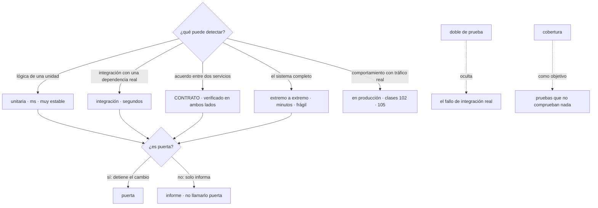

# 100 — Pruebas, calidad y puertas de cambio

> [← 099 · Artefactos inmutables, semver y promoción](../../part-08-continuous-delivery-platform-engineering/099-artefactos-inmutables-semver-y-promocion/README.md) · [Índice de la parte](../README.md) · [101 · SAST, SCA, secretos, SBOM y firma en pipeline →](../../part-08-continuous-delivery-platform-engineering/101-sast-sca-secretos-sbom-y-firma-en-pipeline/README.md)

**Parte:** 08 — Entrega continua y platform engineering<br>
**Nivel:** avanzado · **Horas estimadas:** 4<br>
**Laboratorio:** `testing` · **Estado:** `EXECUTABLE_CORE`

## 🎯 Propósito

Decidir qué se prueba, a qué nivel y qué detiene un cambio, con una distinción que ordena el resto: **una prueba es una puerta solo si su fallo detiene el cambio**; las demás son documentación con coste de mantenimiento. La clase trata la forma de la pirámide como un compromiso entre coste y confianza y no como un dogma, explica por qué la cobertura dice lo que no está probado y nada sobre lo que sí, y llega al límite honesto: **hay comportamientos que solo se pueden comprobar en producción**, y para eso están las clases 102 y 105.

## 📚 Resultados de aprendizaje

Al finalizar podrás:

1. **Elegir** el nivel de prueba por lo que puede detectar y por lo que cuesta mantener.
2. **Sustituir** pruebas frágiles entre servicios por contratos verificados en ambos lados.
3. **Interpretar** la cobertura sin convertirla en objetivo.
4. **Clasificar** cada comprobación en puerta o informe, y justificarlo.
5. **Reconocer** lo que no se puede probar antes de desplegar y qué mecanismo lo cubre.

## 🧩 Conceptos centrales

| Concepto | Comprensión verificable |
|---|---|
| `puerta` | Comprobación cuyo fallo **detiene el cambio**. Si no detiene, es un informe; llamarla puerta produce una falsa sensación de control. |
| `doble de prueba` | Sustituto de una dependencia. Hace la prueba rápida y estable, y **oculta precisamente el fallo de integración** que a veces es el que importa. |
| `prueba de contrato` | Acuerdo entre quien consume y quien provee, verificado por separado en ambos lados. Da confianza de integración sin desplegar los dos sistemas juntos. |
| `cobertura` | Proporción de código ejecutado por las pruebas. Dice **qué no está probado**; no dice nada sobre la calidad de lo que sí se ejecutó. |
| `prueba que nunca falla` | La que no ha detectado nada en años. Cuesta mantenimiento y tiempo de ejecución, y su valor hay que justificarlo como el de cualquier otra. |
| `verificación en producción` | Comprobar en el sistema real lo que ningún entorno previo puede reproducir. No sustituye a las pruebas: cubre lo que queda fuera de su alcance. |

## 🧠 Modelo mental

Una plataforma interna ofrece capacidades como productos y reduce carga cognitiva mediante caminos dorados, sin quitar autonomía donde importa.

Aplicado a esta clase, separa siempre cuatro planos: **intención** (qué necesita el usuario),
**configuración** (qué declaramos), **estado observado** (qué existe de verdad) y
**evidencia** (cómo sabemos que cumple). Confundirlos produce diseños que se ven correctos
en un diagrama pero fallan al operar.

## 🗺️ Flujo de razonamiento



## 📖 Desarrollo

### 1. La forma la decide la arquitectura, no el dogma

La pirámide de pruebas se enseña como una proporción fija y es un compromiso entre dos magnitudes:

```text
coste       tiempo de ejecución, fragilidad y mantenimiento
confianza   qué clase de fallo puede detectar
```

Y su forma correcta depende de qué hace el servicio:

```text
un servicio con lógica de negocio densa
  → muchas unitarias: ahí está el riesgo

un servicio que sobre todo INTEGRA
  llama a tres APIs, transforma y publica un mensaje
  → sus unitarias comprueban muy poco: la lógica es la integración
  → el peso se desplaza a integración y contrato

una aplicación de interfaz
  → el riesgo está en el recorrido completo, no en las funciones
```

Aplicar la misma proporción a los tres produce el resultado que se ve a menudo: **un servicio de integración con el 90 % de cobertura de unitarias y ningún fallo detectado por ellas**, porque todo lo que puede romperse ocurre en las fronteras.

Y lo que cada nivel puede y no puede detectar, que es el criterio real de elección:

```text
unitaria       lógica, casos límite, errores de cálculo
               NO detecta: contratos rotos, configuración, concurrencia real

integración    el uso real de una dependencia: consultas, esquemas, tiempos
               NO detecta: el comportamiento del otro servicio

contrato       que dos partes siguen entendiendo lo mismo
               NO detecta: que el sistema completo funcione

extremo a extremo   un recorrido real completo
               NO detecta: casi nada más, y cuesta mucho por lo que da

en producción  carga, datos reales, comportamiento de usuarios
               es lo ÚNICO que detecta esos tres
```

La última fila es la que se resiste a aceptarse y es la más honesta: **hay clases enteras de fallo que ningún entorno previo puede reproducir**, porque dependen del volumen, de la variedad de los datos reales o del comportamiento de los usuarios.

Y sobre las pruebas de extremo a extremo, una posición que conviene defender con datos: son las más caras de mantener, las más frágiles (clase 097) y las que menos fallos únicos detectan. La regla práctica:

```text
unas pocas, sobre los recorridos que de verdad no pueden fallar
y cada una justificada: qué detecta que no detecte nada más barato
```

Una suite de doscientas pruebas de extremo a extremo es casi siempre una suite de veinte pruebas y ciento ochenta duplicados frágiles de lo que ya cubren niveles inferiores.

### 2. Los dobles y el contrato

Un doble de prueba sustituye una dependencia para que la prueba sea rápida y estable. Y tiene un coste que hay que nombrar:

```text
el doble se comporta como YO CREO que se comporta la dependencia
y si mi creencia es errónea, la prueba pasa y el sistema falla
```

Ese es el fallo característico: una suite verde con una integración rota, porque el doble devolvía lo que el autor esperaba y no lo que el otro sistema devuelve de verdad.

Y la respuesta no es eliminar los dobles —sin ellos las pruebas son lentas e inestables— sino **verificar el contrato por separado**:

```text
el consumidor declara qué espera        "si pido /precios/42, recibo {id, importe}"
esa expectativa se guarda como contrato
y el proveedor verifica, en SU canalización, que lo cumple
```

```yaml
# lo que el consumidor espera, generado desde sus propias pruebas
interacciones:
  - descripcion: precio de un artículo existente
    peticion:  { metodo: GET, ruta: /precios/42 }
    respuesta:
      estado: 200
      cuerpo: { id: 42, importe: 1990, moneda: "EUR" }
```

Y las dos propiedades que lo hacen valioso:

```text
no hace falta desplegar los dos sistemas juntos
y el proveedor se entera de que ROMPE a alguien antes de publicar
```

La segunda es la que resuelve el problema real. Sin contratos, un cambio incompatible del proveedor se detecta cuando el consumidor falla en un entorno compartido, y para entonces ya está fusionado.

Y la disciplina que hace que funcione:

```text
el contrato lo genera el consumidor desde sus pruebas, no se escribe a mano
el proveedor lo verifica en cada cambio, y su fallo es una PUERTA
y un contrato que ningún consumidor usa se retira
```

La tercera evita el problema que estas herramientas tienen a los dos años: decenas de contratos de consumidores que ya no existen, bloqueando cambios legítimos.

Y una decisión práctica sobre **qué dependencias merecen una prueba de integración real** en vez de un doble:

```text
la base de datos                sí, casi siempre: el esquema y las consultas
                                son donde más se rompe
el sistema de mensajería        sí, si la lógica depende de su semántica
un servicio propio              contrato, no integración
un servicio de terceros         doble en las pruebas, y una comprobación
                                sintética contra el real, programada
```

La última fila resuelve un caso frecuente: no se puede depender de la disponibilidad de un tercero para fusionar un cambio, y tampoco se puede ignorar que cambie. Una comprobación programada contra el servicio real detecta el cambio sin bloquear a nadie.

### 3. La cobertura dice lo que no está probado

La cobertura mide qué proporción del código ejecutan las pruebas. Y lo que se puede concluir de ella es asimétrico:

```text
cobertura baja en un módulo    ese código NO está probado: es información útil
cobertura alta en un módulo    ese código se EJECUTÓ durante las pruebas
                               y no dice nada sobre si se comprobó algo
```

La asimetría importa porque una prueba puede ejecutar código sin comprobar nada:

```python
def test_calcular_precio():
    calcular_precio(articulo, cliente)      # ninguna comprobación
```

Esa prueba da cobertura y solo detecta que la función no lanza una excepción. Y cuando la cobertura es un objetivo, ese es exactamente el tipo de prueba que aparece — la ley de Goodhart en su forma más literal: **una medida que se convierte en objetivo deja de ser una buena medida**.

La forma útil de usarla:

```text
como mapa      ¿qué partes críticas no tienen ninguna prueba?
sobre el cambio  ¿este cambio añade código sin probar?
nunca como objetivo global   "llegar al 80 %" produce pruebas sin valor
```

Y la segunda es la única que funciona bien como puerta:

```bash
# la cobertura del código NUEVO, no la global
$ diff-cover cobertura.xml --compare-branch=origin/main --fail-under=80
```

Eso exige que lo que se añade esté probado sin obligar a nadie a subir la cobertura del código heredado, que es lo que hace que la regla se acepte.

Y dos medidas que dicen más que la cobertura y casi nunca se usan:

```text
pruebas de mutación   introduce cambios pequeños en el código y comprueba
                      si alguna prueba falla
                      → mide si las pruebas COMPRUEBAN, no si ejecutan
                      → es cara: para el código crítico, no para todo

fallos detectados por nivel  de los defectos que llegaron a producción,
                      ¿qué nivel de prueba debería haberlos detectado?
                      → dice dónde invertir, con datos del propio equipo
```

La segunda es la más barata y la más útil: revisar los últimos veinte defectos de producción y clasificar cuál habría sido el nivel adecuado da un plan de trabajo mejor que cualquier objetivo de cobertura.

Y el otro lado del coste, que se ignora: **una prueba tiene mantenimiento**. Una que no ha fallado nunca en tres años, que se rompe en cada refactor y que duplica lo que otra cubre es un pasivo. Retirarla es una decisión legítima y hay que poder tomarla:

```text
se conserva si    detecta algo que ninguna otra detecta
                  y ese algo importa
se retira si      es un duplicado frágil de un nivel inferior
                  o comprueba una decisión que ya no está vigente
```

### 4. Puerta o informe: decidirlo explícitamente

La distinción que ordena esta clase:

```text
PUERTA    su fallo detiene el cambio
INFORME   su fallo se anota y el cambio continúa
```

Y el error más común es tener informes llamados puertas: comprobaciones que fallan, nadie mira y todo el mundo cree que protegen algo. Es la séptima aparición de la familia de la clase 060 —un mecanismo que parece estar haciendo algo y no lo está—.

La clasificación que funciona:

```text
PUERTAS
  compilación y análisis estático
  pruebas unitarias y de integración
  contratos con consumidores existentes
  cobertura del código nuevo
  análisis de seguridad: crítico y corregible (clase 091)
  política sobre el resultado (clase 091)
  ninguna credencial en el cambio (clase 092)

INFORMES
  cobertura global
  deuda técnica y complejidad
  hallazgos de seguridad sin corrección disponible
  estimación de coste, salvo por encima de un umbral (clase 091)
  duración de la canalización
```

Y la secuencia de adopción, que es la quinta aparición en el programa:

```text
avisar → bloquear lo que empeora → bloquear siempre
```

Con la misma razón que en las clases 046, 049, 080 y 091: empezar por el bloqueo total con una base incumplidora produce que alguien desactive la puerta, que es la ley 16.

Y dos propiedades que una puerta debe tener para sobrevivir:

```text
rápida     por debajo del umbral de la clase 097; si no, se rodea
precisa    un falso positivo frecuente enseña a saltársela (ley 15)
```

Y el mecanismo de excepción, con la disciplina de las clases 046, 067 y 091:

```text
motivo, responsable y fecha de caducidad
y la caducidad rompe la canalización
```

Y una puerta que conviene tener y casi nunca está: **que el cambio no rompa a nadie más**. En un repositorio único es directo; con repositorios separados, es la prueba de contrato del apartado anterior. Sin ella, la única forma de saber que se rompió a alguien es que ese alguien falle.

### 5. Lo que solo se puede comprobar en producción

Tres clases de comportamiento no se pueden reproducir antes, y conviene reconocerlo en vez de intentar simularlo:

```text
volumen y concurrencia reales   un entorno con el 1 % del tráfico no reproduce
                                los problemas del 100 %
variedad de los datos           los datos de prueba son los que alguien imaginó;
                                los reales tienen formas que nadie imaginó
comportamiento de los usuarios  qué caminos recorren de verdad, y en qué orden
```

Y los mecanismos que los cubren, todos posteriores al despliegue:

```text
despliegue progresivo con criterio de promoción     clase 102
interruptores para separar desplegar de publicar    clase 105
comprobaciones sintéticas periódicas                aquí
observabilidad con objetivos de servicio            clases 057, 082
```

Las **comprobaciones sintéticas** merecen su lugar en esta clase porque son pruebas, aunque se ejecuten en producción:

```text
un recorrido crítico ejecutado cada minuto contra producción
  → detecta lo que ninguna alerta de infraestructura detecta:
    que el sistema funciona pero el recorrido de compra no
```

Y con dos condiciones que las hacen viables:

```text
datos de prueba identificables y limpiables
  → una cuenta sintética, marcada, que no ensucie los informes
y la comprobación no debe producir efectos irreversibles
  → nada de cobros reales; y si el recorrido los tiene, un modo declarado
```

Y una advertencia sobre las pruebas de carga: son útiles y **no reproducen producción**. Un generador de carga produce peticiones uniformes; los usuarios reales producen ráfagas, sesiones largas y combinaciones raras. Sirven para encontrar un techo y para comparar dos versiones, no para afirmar que el sistema aguantará.

Y la lista de comprobación de la clase:

```text
☐ la forma de la pirámide justificada por lo que hace el servicio
☐ cada prueba de extremo a extremo justificada por lo que detecta en exclusiva
☐ contratos verificados en ambos lados, y retirados si nadie los consume
☐ dependencias de terceros con doble y comprobación sintética programada
☐ cobertura usada sobre el cambio, nunca como objetivo global
☐ revisión periódica de los defectos de producción por nivel que los habría detectado
☐ cada comprobación clasificada explícitamente en puerta o informe
☐ puertas rápidas y precisas; excepciones con motivo, responsable y fecha
☐ pruebas retiradas cuando duplican o comprueban decisiones no vigentes
☐ recorridos críticos con comprobación sintética contra producción
```

Y el cierre que enlaza con la clase siguiente: de las siete puertas de la lista, tres son de seguridad y de cadena de suministro. Cómo se integran sin repetir el error de las clases 067 y 091 —una señal con ochocientos elementos que acaba desactivada— es la materia de la clase 101.

## 🔬 Ejemplo trabajado

**CloudShop tiene 4.100 pruebas, un 87 % de cobertura y once defectos en producción el último trimestre. El análisis de esos once explica dónde estaba invertido el esfuerzo y dónde estaba el riesgo.**

**Los once defectos, clasificados por el nivel que los habría detectado.**

```text
nivel adecuado                            defectos
contrato entre servicios                       5
integración con la base de datos               2
en producción (volumen o datos reales)         3
unitaria                                       1
```

Y la distribución del esfuerzo:

```text
nivel                    pruebas    tiempo de ejecución
unitarias                 3.640          2 min 10 s
integración                 190          4 min 40 s
extremo a extremo           270         11 min 30 s
contrato                      0                —
```

**Cinco de los once defectos eran de un nivel que no existía**, y las 270 pruebas de extremo a extremo —el 63 % del tiempo de ejecución— habían detectado uno en todo el trimestre.

**Corrección 1 — contratos donde estaba el riesgo.**

Los cinco defectos de contrato tenían la misma forma: un servicio cambió su respuesta y el consumidor no se enteró hasta que falló en un entorno compartido.

```text                                        antes            después
contratos entre servicios                       0               14
verificados en la canalización del proveedor    —          puerta obligatoria
defectos de contrato en el trimestre siguiente  5                0
cambios del proveedor detenidos por romper
  a un consumidor                               —                3
```

Los tres cambios detenidos son la medida del valor: **tres cambios incompatibles que se habrían fusionado y habrían roto a alguien**.

**Corrección 2 — las pruebas de extremo a extremo.**

Se revisaron las 270 preguntando qué detecta cada una que no detecte nada más barato:

```text
duplican una unitaria o de integración          188
comprueban una decisión ya no vigente            41
detectan algo en exclusiva                       23
intermitentes sin arreglar (clase 097)           18
```

```text                                        antes            después
pruebas de extremo a extremo                   270               23
tiempo de ejecución                        11 min 30 s        1 min 50 s
defectos únicos detectados por trimestre         1                1
intermitentes                                   18                0
```

Mismo valor detectado, con la décima parte de las pruebas y del tiempo. Y la reducción del tiempo de respuesta total permitió añadir los contratos sin superar el umbral de la clase 097.

**Corrección 3 — la cobertura que no significaba nada.**

```bash
$ mutmut run --paths-to-mutate src/precios/
1.240 mutantes · 412 sobrevivieron (33 %)
```

Un tercio de las mutaciones en el módulo de precios **no hacía fallar ninguna prueba**, con el 91 % de cobertura en ese módulo. Al revisarlas:

```text
pruebas que ejecutan sin comprobar nada          61
pruebas que comprueban solo que no hay excepción 88
```

```text                                        antes            después
cobertura global                              87 %             84 %
objetivo de cobertura global                  80 %          retirado
medida sobre el cambio                     no había      80 % del código nuevo
mutantes supervivientes en precios            33 %             8 %
pruebas sin comprobación retiradas o corregidas  —              149
```

La cobertura global bajó tres puntos y la confianza subió. Fue la conversación más difícil del ejercicio y el argumento que la cerró fue el de las mutaciones: **el 33 % de los cambios en el código no rompía ninguna prueba**.

**Corrección 4 — puertas e informes, clasificados.**

```text                                        antes            después
comprobaciones que decían ser puertas           14                7
de ellas, que de verdad detenían el cambio       7                7
las otras siete                           fallaban y nadie      informes
                                          las miraba            declarados
```

Siete comprobaciones fallaban regularmente sin detener nada y todo el mundo creía que protegían. Séptima aparición de la familia de fallos de la clase 060.

**Corrección 5 — lo que solo se ve en producción.**

Los tres defectos restantes eran de volumen y de datos reales:

```text
un tiempo de espera que solo se agota con más de 400 peticiones por segundo
un carácter en un nombre de cliente que rompía la generación del recibo
un recorrido de usuario que nadie había previsto
```

```text                                        antes            después
comprobaciones sintéticas                       0                6 recorridos
frecuencia                                      —              cada minuto
datos sintéticos identificables            no había         cuenta marcada,
                                                            excluida de informes
despliegue progresivo con criterio          no había      clase 102
tiempo medio de detección de un defecto
  de producción                              4 h 20 min       6 min
```

**Resumen:**

```text                                          antes         después
pruebas totales                               4.100          3.980
pruebas de extremo a extremo                    270             23
contratos                                         0             14
tiempo total de la suite                    18 min 20 s     8 min 40 s
mutantes supervivientes (módulo crítico)       33 %            8 %
defectos en producción por trimestre             11              3
comprobaciones que dicen ser puertas             14              7
tiempo de detección de un defecto            4 h 20 min       6 min
```

**La lección que esta clase traslada al resto de la parte 08**: el equipo tenía 4.100 pruebas y **cinco de los once defectos del trimestre eran de un nivel que no existía**. El 63 % del tiempo de ejecución se iba en 270 pruebas de extremo a extremo que detectaron un defecto único en tres meses, y el 33 % de las mutaciones en el módulo más crítico no rompía ninguna prueba pese al 91 % de cobertura. **La cobertura decía lo que se ejecutaba; los defectos decían dónde estaba el riesgo.**

## 🧪 Laboratorio guiado

Ejecuta desde la raíz:

```bash
python classes/part-08-continuous-delivery-platform-engineering/100-pruebas-calidad-y-puertas-de-cambio/lab.py
```

El laboratorio selecciona el motor de práctica **`testing`** y produce
`lab_result.json`. El escenario, sus comprobaciones y el artefacto esperado corresponden a
esta clase; no requiere credenciales y deja explícito qué debe revalidarse en un sandbox real.

1. Lee `exercise.steps` y formula una predicción antes de ejecutar.
2. Ejecuta la práctica y verifica todos los elementos de `checks`.
3. Provoca el caso de `negative_test` y explica la señal observada.
4. Materializa `quality-gates` en `evidence/` usando la plantilla indicada.
5. Para proveedor real, sigue `sandbox.requires`, registra costo y ejecuta `destroy`.

### Evidencia esperada

El artefacto principal es pruebas automatizadas con fallos diagnósticos. Además, la entrega debe incluir el comando ejecutado,
la salida estructurada y una conclusión que no exceda lo observado.

## 🏆 Reto verificable

Construye **`quality-gates`** para el caso CloudShop. Incluye una alternativa descartada,
un supuesto que pueda falsarse, una prueba de fallo y una decisión de rollback.

## ✅ Criterio de aceptación

- [ ] `lab.py` termina con código 0 y genera JSON válido.
- [ ] La entrega conecta al menos tres requisitos con mecanismos verificables.
- [ ] Existe una prueba positiva y una prueba negativa con evidencia.
- [ ] Seguridad, costo y operación aparecen como decisiones, no como anexos.
- [ ] Se declara una limitación y una condición que obligaría a revisar el diseño.
- [ ] Otra persona puede repetir el recorrido sin conocimiento tácito.

## ⚠️ Errores frecuentes

| Síntoma | Causa probable | Corrección |
|---|---|---|
| Alta cobertura y defectos frecuentes en producción | Las pruebas ejecutan el código sin comprobar nada, porque la cobertura era el objetivo | Usa la cobertura sobre el cambio, no como objetivo global, y mide con pruebas de mutación en el código crítico. |
| Un cambio de un servicio rompe a otro y se descubre en un entorno compartido | No hay contratos verificados en el lado del proveedor | Genera el contrato desde las pruebas del consumidor y verifícalo como puerta en la canalización del proveedor. |
| La suite pasa y la integración está rota | El doble se comporta como el autor cree que se comporta la dependencia | Prueba de integración real contra la base de datos y contratos frente a otros servicios; los dobles no verifican creencias. |
| Comprobaciones que fallan y nadie mira | Son informes que todo el mundo llama puertas | Clasifica cada comprobación explícitamente; una que no detiene el cambio no protege nada. |
| La suite de extremo a extremo tarda más que todo lo demás y detecta poco | Duplica niveles inferiores y acumula pruebas frágiles | Justifica cada una por lo que detecta en exclusiva; retira las duplicadas y las de decisiones no vigentes. |
| Hay defectos que ningún entorno previo podía reproducir | Dependen del volumen, de la variedad de datos reales o del comportamiento de los usuarios | Comprobaciones sintéticas contra producción y despliegue progresivo con criterio de promoción. |

## 🛡️ Seguridad, ética y costo

Trabaja con cuentas propias o sandboxes autorizados. No publiques secretos, identificadores
reales ni datos personales. Antes de crear recursos pagos define presupuesto, etiquetas y
comando de destrucción; después verifica que no queden recursos huérfanos. Los ejemplos
locales enseñan contratos, pero no certifican cumplimiento ni disponibilidad de producción.

## ❓ Preguntas de comprobación

1. ¿Qué distingue una puerta de un informe, y por qué confundirlos es peligroso?
2. ¿Por qué la forma de la pirámide depende de lo que hace el servicio? Da dos ejemplos opuestos.
3. ¿Qué oculta un doble de prueba y cómo se recupera esa confianza sin desplegar dos sistemas juntos?
4. ¿Qué se puede concluir de una cobertura alta y qué de una baja?
5. Enumera tres clases de fallo que ningún entorno previo puede reproducir y el mecanismo que cubre cada una.

## 🔗 Referencias

- Martin Fowler (2012). *Test Pyramid* — coste y confianza por nivel, y por qué la forma varía. <https://martinfowler.com/bliki/TestPyramid.html>
- Ham Vocke (2018). *The practical test pyramid* — niveles, dobles y contratos con ejemplos. <https://martinfowler.com/articles/practical-test-pyramid.html>
- Pact (2025). *Consumer-driven contract testing* — generación del contrato y verificación en el proveedor. <https://docs.pact.io/>
- Martin Fowler (2020). *Test coverage* — por qué la cobertura como objetivo produce malas pruebas. <https://martinfowler.com/bliki/TestCoverage.html>
- Google (2024). *Mutation testing at scale* — medir si las pruebas comprueban, y su coste. <https://research.google/pubs/state-of-mutation-testing-at-google/>
- Documentación oficial vigente del servicio implementado; registra URL y fecha de consulta.

---

> [Evaluación](assessment.md) · [Contrato de clase](lesson.yaml) · [Índice de la parte](../README.md)

| Anterior | Índice | Siguiente |
|---|---|---|
| [← 099 · Artefactos inmutables, semver y promoción](../../part-08-continuous-delivery-platform-engineering/099-artefactos-inmutables-semver-y-promocion/README.md) | [Parte 08](../README.md) · [Programa](../../README.md) | [101 · SAST, SCA, secretos, SBOM y firma en pipeline →](../../part-08-continuous-delivery-platform-engineering/101-sast-sca-secretos-sbom-y-firma-en-pipeline/README.md) |
