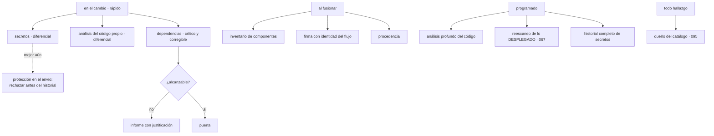

# 101 — SAST, SCA, secretos, SBOM y firma en pipeline

> [← 100 · Pruebas, calidad y puertas de cambio](../../part-08-continuous-delivery-platform-engineering/100-pruebas-calidad-y-puertas-de-cambio/README.md) · [Índice de la parte](../README.md) · [102 · Rolling, blue-green, canary y rollback →](../../part-08-continuous-delivery-platform-engineering/102-rolling-blue-green-canary-y-rollback/README.md)

**Parte:** 08 — Entrega continua y platform engineering<br>
**Nivel:** avanzado · **Horas estimadas:** 4<br>
**Laboratorio:** `security` · **Estado:** `EXECUTABLE_CORE`

## 🎯 Propósito

Integrar las cinco familias de comprobación de seguridad en la canalización **sin repetir el error que este programa ha documentado tres veces**: un escáner con ochocientos hallazgos acaba desactivado, y figura como implantado. La clase introduce la herramienta que lo evita —un presupuesto de ruido con un número concreto— y la técnica que hace posible adoptarlas sobre código heredado: **que solo bloquee lo nuevo**. La clase 067 dejó los artefactos; aquí se decide dónde se ejecuta cada comprobación, qué detiene y quién arregla.

## 📚 Resultados de aprendizaje

Al finalizar podrás:

1. **Situar** cada familia de comprobación por lo que detecta y por dónde debe ejecutarse.
2. **Fijar** un presupuesto de ruido y ajustar las comprobaciones para no superarlo.
3. **Adoptar** una comprobación sobre código heredado sin bloquear al equipo.
4. **Distinguir** una dependencia vulnerable de una vulnerabilidad alcanzable.
5. **Enrutar** cada hallazgo a quien puede arreglarlo, con plazo.

## 🧩 Conceptos centrales

| Concepto | Comprensión verificable |
|---|---|
| `presupuesto de ruido` | Número máximo de hallazgos que una comprobación puede producir por cambio antes de que la gente deje de leerlos. Es la ley 15 con una cifra. |
| `modo diferencial` | La comprobación bloquea solo por hallazgos **nuevos** respecto de una referencia. Permite adoptar sobre código heredado sin exigir arreglarlo todo primero. |
| `alcanzabilidad` | Si el código vulnerable de una dependencia se ejecuta desde la aplicación. Distingue una vulnerabilidad real de una presente pero inerte. |
| `protección en el envío` | Rechazar un secreto **antes** de que entre en el historial. Prevenir es lo único que evita la ley 11: lo que entra en el historial se queda. |
| `firma con identidad del flujo` | Firmar con la identidad de la canalización, sin claves. La verificación comprueba **qué flujo y qué rama** firmaron, no solo que hay firma. |
| `enrutado de hallazgos` | Llevar cada hallazgo a quien puede arreglarlo, usando el catálogo de la clase 095. Sin dueño, un hallazgo no se arregla: se acumula. |

## 🧠 Modelo mental

Una plataforma interna ofrece capacidades como productos y reduce carga cognitiva mediante caminos dorados, sin quitar autonomía donde importa.

Aplicado a esta clase, separa siempre cuatro planos: **intención** (qué necesita el usuario),
**configuración** (qué declaramos), **estado observado** (qué existe de verdad) y
**evidencia** (cómo sabemos que cumple). Confundirlos produce diseños que se ven correctos
en un diagrama pero fallan al operar.

## 🗺️ Flujo de razonamiento



## 📖 Desarrollo

### 1. Cinco familias, y dónde va cada una

Cada familia detecta una cosa distinta y ninguna sustituye a otra:

```text
análisis del código propio   defectos en lo que escribe el equipo
                             inyecciones, criptografía mal usada, rutas inseguras
dependencias                 vulnerabilidades conocidas en lo que se importa
secretos                     credenciales en el código y en el historial
inventario de componentes    qué contiene el artefacto (clase 067)
firma y procedencia          de dónde salió (clases 067, 098)
```

Y la decisión operativa no es cuál usar —hacen falta las cinco— sino **dónde se ejecuta cada una**, que es lo que decide si sobreviven. El criterio es el de la clase 091: por coste y por lo que puede detectar antes.

```text
EN EL CAMBIO, antes de fusionar (rápido, y bloquea)
  secretos, en modo diferencial
  análisis del código propio, solo sobre lo modificado
  dependencias: crítico y corregible (clase 067)

AL FUSIONAR (produce evidencia)
  inventario de componentes, adjunto al artefacto
  firma con la identidad del flujo
  declaración de procedencia

PROGRAMADO (caro, y no bloquea a nadie)
  análisis profundo del código, con todas las reglas
  historial completo de secretos
  reescaneo de lo que está DESPLEGADO
```

La última línea es el paso que la clase 067 numeró como décimo y que casi nadie tiene: **una imagen escaneada limpia hace tres meses puede tener hoy una vulnerabilidad crítica publicada la semana pasada**. El escaneo en la construcción es una foto; lo que hace falta es reescanear lo que está en ejecución.

```bash
# huellas realmente desplegadas, y su reescaneo
$ for e in dev pre pro; do kubectl --context=$e get pods -A -o jsonpath='{..imageID}'; done \
  | tr ' ' '\n' | grep -o 'sha256:[0-9a-f]*' | sort -u \
  | while read d; do trivy image --severity CRITICAL --ignore-unfixed -q "registro/…@$d"; done
```

Y una precisión sobre el orden dentro del cambio: **los secretos van primero**. Es la comprobación más barata y la única cuyo hallazgo exige actuar antes de seguir —rotar—, así que detener el resto de la canalización cuando aparece uno ahorra ejecuciones y evita que la credencial siga viajando.

Y una nota sobre la firma que enlaza con la clase 098: se firma **con la identidad del flujo**, sin claves, y la verificación comprueba qué flujo y qué rama firmaron. Firmar sin verificar la identidad del firmante es lo que la clase 067 midió: dos imágenes sin firma válida en producción durante dos meses.

### 2. El presupuesto de ruido

Este programa ha documentado tres veces el mismo final: un escáner con demasiados hallazgos acaba desactivado.

```text
escáner de imágenes, 812 hallazgos      desactivado 8 meses      clase 067
analizador de infraestructura, 812      desactivado 14 meses     clase 091
alertas, 340 al mes                     46 silenciadas           clase 057
```

La herramienta que lo evita es fijar un número **antes** de integrar nada:

```text
presupuesto de ruido: 5 hallazgos por cambio, como máximo
```

Y con esa cifra delante, la integración deja de ser «activar la herramienta» y pasa a ser un ejercicio de ajuste con un objetivo medible:

```text
si la primera ejecución produce 240 hallazgos por cambio
  → no se activa como puerta
  → se ajusta hasta bajar de 5, y entonces se activa
```

Y los cinco ajustes que bajan el número, en orden de eficacia:

```text
1. modo diferencial          solo lo nuevo respecto de la rama principal
2. solo lo corregible        lo que no tiene arreglo no puede ser una puerta
3. solo lo alcanzable        ver el apartado siguiente
4. reglas ajustadas al lenguaje y al marco de trabajo
                             las reglas genéricas producen falsos positivos
5. supresiones en el código, con justificación
                             para el caso concreto que el análisis no entiende
```

El primero es el que más baja y el que hace posible adoptar sobre código heredado:

```bash
$ semgrep ci --baseline-commit=$(git merge-base HEAD origin/main)
```

Con eso, un repositorio con dos mil hallazgos históricos **no bloquea a nadie**, y ningún cambio puede añadir uno nuevo. Es la fase 2 de la secuencia de adopción que este programa ha usado ya cinco veces —avisar, no empeorar, bloquear siempre— y aquí es la sexta.

Y la parte incómoda de esa fase: el inventario histórico sigue ahí. Lo que la hace honesta es tratarlo como trabajo planificado y no como algo que se arreglará solo:

```text
línea base congelada, con su cifra
un objetivo de reducción por trimestre, con dueño
y la cifra publicada: si sube, la fase 2 no está funcionando
```

Y una comprobación que conviene tener sobre las propias comprobaciones, porque es la que detecta el fracaso antes de que se convierta en un escáner desactivado:

```text
hallazgos por cambio, mediana y percentil 90
proporción de ejecuciones en las que alguien suprime o salta la puerta
tiempo añadido a la canalización por cada comprobación
```

La segunda por encima del 10 % significa que el presupuesto está mal fijado, no que el equipo sea indisciplinado.

### 3. Vulnerable no es alcanzable

Un escáner de dependencias informa de que **una versión vulnerable está presente**. No informa de que la vulnerabilidad sea explotable en este sistema, y la diferencia es grande:

```text
la biblioteca tiene una vulnerabilidad en su analizador de XML
y esta aplicación no analiza XML en ningún punto
→ presente, y no alcanzable
```

Y tratar los dos casos igual produce el problema del apartado anterior. Las tres formas de distinguirlos, de más a menos automática:

```text
análisis de alcanzabilidad     la herramienta comprueba si hay un camino de
                               llamadas desde la aplicación al código vulnerable
                               → reduce mucho, y no es infalible

declaración de explotabilidad  un documento verificable que dice, para un
                               componente y una vulnerabilidad, si afecta y por qué
                               → se adjunta al artefacto, como el inventario

lista de exclusiones           con motivo, responsable y caducidad
                               → funciona y no se puede verificar
```

La segunda es la que escala en una organización, porque **la evaluación se hace una vez y viaja con el artefacto**:

```json
{
  "vulnerability": "CVE-2026-1234",
  "product": "registro/tienda@sha256:9f2c…",
  "status": "not_affected",
  "justification": "vulnerable_code_not_in_execute_path",
  "detail": "El analizador de XML no se invoca desde ninguna ruta de la aplicación.",
  "responsable": "equipo-pedidos",
  "revisar": "2026-12-01"
}
```

Y una advertencia honesta sobre la alcanzabilidad automática: **puede equivocarse en las dos direcciones**. Marca como inalcanzable código que se invoca por reflexión o por configuración, y marca como alcanzable caminos que en la práctica no se dan. Sirve para priorizar, no para descartar sin mirar.

Y la regla que ordena todo esto:

```text
crítico + corregible + alcanzable     PUERTA
crítico + corregible + no alcanzable  informe, con declaración justificada
crítico + sin corrección              informe, y seguimiento con fecha
alto y medio                          informe, y objetivo de reducción
```

Y la palanca que más reduce sin analizar nada, que la clase 067 ya midió: **actualizar la imagen base**. La mayoría de los hallazgos de un artefacto vienen de ahí, y una cadencia de actualización resuelve en bloque lo que de otro modo se persigue uno a uno.

Y sobre las dependencias directas, dos comprobaciones que valen más que el escáner y cuestan menos:

```text
dependencias nuevas en este cambio     ¿alguien la ha pedido? ¿qué aporta?
dependencias sin actualizar en un año  suelen ser las que traen los hallazgos
```

### 4. Secretos: prevenir en vez de detectar

La ley 11 de la clase 072 es especialmente cruel aquí: **lo que entra en el historial se queda**, aunque se borre del fichero. Por eso el orden de preferencia es distinto que en las demás familias:

```text
1. PREVENIR      rechazar el envío antes de que entre en el historial
2. detectar en el cambio    antes de fusionar, sobre el diferencial
3. detectar en el historial  programado, sobre todo el árbol
```

La primera es la única que evita el trabajo de rotar:

```text
protección en el envío: el servidor rechaza el envío si detecta un secreto
  → el secreto nunca llega al historial
  → y quien lo intentó se entera al instante
```

Y conviene medir su efecto, porque es el único mecanismo de esta clase que **reduce el trabajo en vez de crearlo**:

```text
secretos rechazados en el envío       trabajo evitado: ninguna rotación
secretos detectados tras fusionar     rotar, corregir, purgar (clase 092)
```

Y el procedimiento cuando ya ha entrado, que este programa ha repetido cinco veces y no cambia:

```text
1. rotar    estuvo expuesto
2. corregir el mecanismo
3. purgar lo que se pueda purgar
```

Y una advertencia sobre la detección: los escáneres encuentran patrones conocidos —claves de proveedores, testigos con formato reconocible— y **no encuentran una contraseña que parece una palabra**. Complementarlas con reglas propias para los formatos internos de la organización es barato y suele dar resultados el primer día.

Y el rastro que la clase 092 enumeró y que aquí conviene automatizar entero, porque el repositorio es solo uno de seis:

```text
repositorio y su historial      escáner, en el cambio y programado
registros de la canalización    comprobación de que el registro detallado
                                está desactivado
artefactos publicados           que no se publiquen ficheros de plan
estado de infraestructura       recuento de campos sensibles
salidas                         nombres que coincidan con patrones
```

Y una comprobación sobre la propia canalización que la clase 098 dejó y que pertenece a esta lista:

```bash
$ gh secret list --json name -q '.[].name' | grep -Ei 'aws_secret|azure_client_secret|gcp_sa_key' \
  && echo "claves de larga duración: migrar a identidad federada"
```

### 5. Quién arregla, y en cuánto tiempo

Un hallazgo sin dueño no se arregla: se acumula. Y el catálogo de la clase 095 es lo que permite enrutarlo:

```bash
$ trivy image --format json registro/tienda@sha256:9f2c… \
  | jq -r '.Results[].Vulnerabilities[]? | select(.Severity=="CRITICAL") | .VulnerabilityID' \
  | while read cve; do
      equipo=$(yq -r '.spec.equipo' catalogo/tienda.yaml)
      echo "$cve → $equipo"
    done
```

Y los plazos, que hay que fijar antes de tener hallazgos y no después:

```text
crítico y alcanzable, con corrección       7 días
crítico sin corrección disponible          seguimiento semanal
alto y alcanzable                          30 días
resto                                      objetivo de reducción trimestral
secreto expuesto                           rotación inmediata; el resto, después
```

Y el mecanismo que hace que los plazos signifiquen algo, con la disciplina de las clases 046, 067 y 091:

```text
cada excepción con motivo, responsable y caducidad
y la caducidad rompe la canalización
```

Y una decisión organizativa que decide si esto funciona: **quién puede aceptar el riesgo**. Un hallazgo crítico sin corregir a los siete días no lo decide el equipo que lo tiene: lo escala a quien pueda decidir que se acepta, con su nombre.

Y la lista de comprobación de la clase:

```text
☐ presupuesto de ruido fijado, con una cifra, antes de integrar nada
☐ secretos primero en el orden, y con protección en el envío
☐ análisis del código propio en modo diferencial sobre el cambio
☐ dependencias: puerta solo por crítico, corregible y alcanzable
☐ declaraciones de explotabilidad adjuntas al artefacto, con revisión
☐ inventario, firma y procedencia al fusionar
☐ verificación de firma que comprueba el flujo y la rama, no solo la existencia
☐ análisis profundo y reescaneo de lo desplegado, programados
☐ hallazgos enrutados al dueño del catálogo, con plazo
☐ excepciones con motivo, responsable y caducidad que rompe la canalización
☐ línea base histórica congelada, con objetivo de reducción y cifra publicada
☐ vigilancia de hallazgos por cambio y de supresiones, para detectar el fracaso
```

Y el cierre que enlaza con la clase siguiente: todas estas comprobaciones protegen lo que se despliega. **Ninguna dice nada sobre cómo llega a producción**, y esa es la parte donde un error se convierte en un incidente visible — la materia de la clase 102.

## 🔬 Ejemplo trabajado

**CloudShop integra las cinco familias tras el fracaso documentado en las clases 067 y 091 —dos escáneres desactivados durante ocho y catorce meses—. Esta vez se fija el presupuesto de ruido antes de activar nada, y el ejercicio dura seis semanas.**

**El presupuesto, y la primera medición.**

```text
presupuesto acordado: 5 hallazgos por cambio

primera ejecución de cada familia, sin ajustar:
  análisis del código propio        240 por cambio
  dependencias                       97
  secretos                            0
  infraestructura (clase 091)         6
```

Con esas cifras, activar como puerta habría reproducido el fracaso anterior. El ajuste, familia por familia:

**Análisis del código propio: de 240 a 3.**

```text                                        hallazgos por cambio
sin ajustar                                          240
modo diferencial sobre el cambio                      11
reglas ajustadas al lenguaje y al marco                4
supresiones justificadas en 2 puntos                   3
```

La línea base histórica quedó congelada en 1.840 hallazgos, con su cifra publicada y un objetivo de reducción de 150 por trimestre. En seis meses bajó a 1.210, y la cifra es visible: **si sube, la fase de no empeorar no está funcionando**.

**Dependencias: de 97 a 2.**

```text                                        hallazgos que bloquean
sin ajustar                                           97
solo crítico                                          31
solo corregible                                       12
solo alcanzable                                        4
tras actualizar la imagen base                         2
```

La última línea confirma lo que la clase 067 midió: **la actualización de la base resuelve en bloque**. Y de los ocho descartados por alcanzabilidad, se revisaron a mano los ocho:

```text
confirmados como no alcanzables                        6
marcados mal por la herramienta                        2   ← invocación por reflexión
```

Los dos errores son el argumento para no descartar sin mirar. Se escribieron declaraciones de explotabilidad para los seis, con responsable y fecha de revisión.

**Secretos: cero hallazgos y aun así el mayor cambio.**

El escaneo del árbol actual daba cero. El del historial completo, seis (los de la clase 092). Y lo que se añadió fue la prevención:

```text                                        antes            después
protección en el envío                     no había          activa
secretos rechazados en el envío (6 meses)      —                4
secretos que llegaron al historial             —                0
rotaciones evitadas                            —                4
```

Cuatro credenciales que **nunca llegaron al historial**, y por tanto cuatro rotaciones que no hubo que hacer. Es el único mecanismo de la clase que reduce trabajo.

Y dos de los cuatro no los habría detectado el escáner genérico: eran testigos de un sistema interno con un formato propio, y se detectaron por una regla escrita el primer día.

**Firma y procedencia: la verificación que faltaba.**

La clase 067 había dejado la firma activa y la verificación a medias. Al completarla:

```text                                        antes            después
imágenes firmadas                          15 de 15         15 de 15
verificación comprueba la existencia de firma   sí               sí
verificación comprueba QUÉ flujo firmó          no               sí
verificación comprueba la rama                  no               sí
imágenes rechazadas al activar                  —                2
```

Las dos rechazadas se habían firmado desde una rama de trabajo durante una urgencia, siete meses atrás, y seguían en producción.

**El reescaneo de lo desplegado.**

```text
primera ejecución sobre las 15 huellas en producción
  vulnerabilidades críticas descubiertas                    3
  todas en imágenes que pasaron limpias en su construcción
  la más antigua, publicada hace 41 días
```

Tres vulnerabilidades críticas en producción que **ninguna comprobación de la canalización podía detectar**, porque las imágenes no habían cambiado: lo que cambió fue lo que se sabe de ellas.

**El coste en tiempo de respuesta.**

```text                                        antes            después
comprobaciones en el cambio                     2                5
tiempo añadido                                  —          1 min 20 s
mediana de la canalización                 7 min 10 s       8 min 30 s
umbral de la clase 097                        10 min           10 min
```

Dentro del umbral. Y las dos comprobaciones caras —análisis profundo y reescaneo— fuera del camino crítico.

**A los seis meses.**

```text                                          antes         después
escáneres activos                             0 de 5          5 de 5
hallazgos por cambio (mediana)                  —               3
supresiones o saltos de puerta                  —             2,1 %
vulnerabilidades críticas en producción      no se sabía        0
secretos que llegaron al historial            6 en 3 años        0
imágenes en producción sin firma verificada       2              0
línea base histórica                          1.840          1.210
mediana de la canalización                  7 min 10 s      8 min 30 s
```

**La lección que esta clase traslada al resto de la parte 08**: la diferencia con los dos intentos anteriores no fue de herramientas —son las mismas— sino de haber fijado **una cifra antes de activar nada**. Con 240 hallazgos por cambio, cualquier equipo desactiva la puerta y tiene razón; con tres, nadie lo intenta. Y el mecanismo que más valió no detecta nada: **la protección en el envío evitó cuatro rotaciones al impedir que los secretos llegaran al historial**, que es lo único que resuelve de verdad la ley 11.

## 🧪 Laboratorio guiado

Ejecuta desde la raíz:

```bash
python classes/part-08-continuous-delivery-platform-engineering/101-sast-sca-secretos-sbom-y-firma-en-pipeline/lab.py
```

El laboratorio selecciona el motor de práctica **`security`** y produce
`lab_result.json`. El escenario, sus comprobaciones y el artefacto esperado corresponden a
esta clase; no requiere credenciales y deja explícito qué debe revalidarse en un sandbox real.

1. Lee `exercise.steps` y formula una predicción antes de ejecutar.
2. Ejecuta la práctica y verifica todos los elementos de `checks`.
3. Provoca el caso de `negative_test` y explica la señal observada.
4. Materializa `pipeline-devsecops` en `evidence/` usando la plantilla indicada.
5. Para proveedor real, sigue `sandbox.requires`, registra costo y ejecuta `destroy`.

### Evidencia esperada

El artefacto principal es un control con amenaza, mitigación y evidencia. Además, la entrega debe incluir el comando ejecutado,
la salida estructurada y una conclusión que no exceda lo observado.

## 🏆 Reto verificable

Construye **`pipeline-devsecops`** para el caso CloudShop. Incluye una alternativa descartada,
un supuesto que pueda falsarse, una prueba de fallo y una decisión de rollback.

## ✅ Criterio de aceptación

- [ ] `lab.py` termina con código 0 y genera JSON válido.
- [ ] La entrega conecta al menos tres requisitos con mecanismos verificables.
- [ ] Existe una prueba positiva y una prueba negativa con evidencia.
- [ ] Seguridad, costo y operación aparecen como decisiones, no como anexos.
- [ ] Se declara una limitación y una condición que obligaría a revisar el diseño.
- [ ] Otra persona puede repetir el recorrido sin conocimiento tácito.

## ⚠️ Errores frecuentes

| Síntoma | Causa probable | Corrección |
|---|---|---|
| Un escáner acaba desactivado y figura como implantado | Produce cientos de hallazgos por cambio y bloquear con esa cifra es inviable | Fija un presupuesto de ruido antes de activar, y ajusta con modo diferencial, corregibilidad y alcanzabilidad hasta bajar de él. |
| Un repositorio con miles de hallazgos históricos no puede adoptar la comprobación | Se intenta bloquear por todo desde el principio | Modo diferencial: bloquea solo lo nuevo, congela la línea base con su cifra y fija un objetivo de reducción con dueño. |
| Se bloquean cambios por vulnerabilidades que el sistema no puede ejecutar | Se trata igual una dependencia vulnerable y una vulnerabilidad alcanzable | Analiza alcanzabilidad y adjunta declaraciones de explotabilidad justificadas; revisa a mano, porque la herramienta se equivoca en ambas direcciones. |
| Un secreto llega al historial y hay que rotarlo | Solo hay detección; la ley 11 dice que lo que entra se queda | Activa protección en el envío y añade reglas para los formatos internos de la organización, que los escáneres genéricos no reconocen. |
| Las imágenes están firmadas y hay artefactos no autorizados en producción | La verificación comprueba que hay firma, no qué flujo y qué rama firmaron | Acota la identidad del firmante en la política de admisión y verifica con una imagen firmada desde otra rama. |
| Aparecen vulnerabilidades críticas en imágenes que pasaron limpias | El escaneo de construcción es una foto; lo que cambia es lo que se sabe | Reescanea periódicamente las huellas desplegadas, no solo las que se construyen. |

## 🛡️ Seguridad, ética y costo

Trabaja con cuentas propias o sandboxes autorizados. No publiques secretos, identificadores
reales ni datos personales. Antes de crear recursos pagos define presupuesto, etiquetas y
comando de destrucción; después verifica que no queden recursos huérfanos. Los ejemplos
locales enseñan contratos, pero no certifican cumplimiento ni disponibilidad de producción.

## ❓ Preguntas de comprobación

1. ¿Qué detecta cada una de las cinco familias y dónde debe ejecutarse cada una?
2. ¿Qué es un presupuesto de ruido y por qué se fija antes de integrar nada?
3. ¿Qué cinco ajustes bajan el número de hallazgos, y cuál permite adoptar sobre código heredado?
4. ¿Por qué la protección en el envío es cualitativamente distinta de la detección de secretos?
5. ¿Por qué hay que reescanear lo desplegado si la imagen no ha cambiado?

## 🔗 Referencias

- OWASP (2025). *DevSecOps guideline: tooling and placement* — familias de comprobación y dónde ejecutarlas. <https://owasp.org/www-project-devsecops-guideline/>
- OpenSSF (2025). *Scorecard and CI/CD security checks* — comprobaciones automatizables sobre la canalización. <https://github.com/ossf/scorecard/blob/main/docs/checks.md>
- CISA (2025). *Vulnerability Exploitability eXchange* — declarar si una vulnerabilidad afecta y por qué. <https://www.cisa.gov/resources-tools/resources/minimum-requirements-vulnerability-exploitability-exchange-vex>
- GitHub (2025). *Push protection for secrets* — rechazar el envío antes de que el secreto entre en el historial. <https://docs.github.com/en/code-security/secret-scanning/push-protection-for-repositories-and-organizations>
- Semgrep (2025). *Diff-aware scanning* — bloquear solo hallazgos nuevos respecto de una referencia. <https://semgrep.dev/docs/deployment/customize-ci-jobs>
- Documentación oficial vigente del servicio implementado; registra URL y fecha de consulta.

---

> [Evaluación](assessment.md) · [Contrato de clase](lesson.yaml) · [Índice de la parte](../README.md)

**📥 Descargar:** [Parte 08 en PDF](../../../site/downloads/partes/manual-parte-08-continuous-delivery-platform-engineering.pdf) · [Manual integral](../../../site/downloads/multi-cloud-engineering-manual-v2.0.pdf)

| Anterior | Índice | Siguiente |
|---|---|---|
| [← 100 · Pruebas, calidad y puertas de cambio](../../part-08-continuous-delivery-platform-engineering/100-pruebas-calidad-y-puertas-de-cambio/README.md) | [Parte 08](../README.md) · [Programa](../../README.md) | [102 · Rolling, blue-green, canary y rollback →](../../part-08-continuous-delivery-platform-engineering/102-rolling-blue-green-canary-y-rollback/README.md) |
