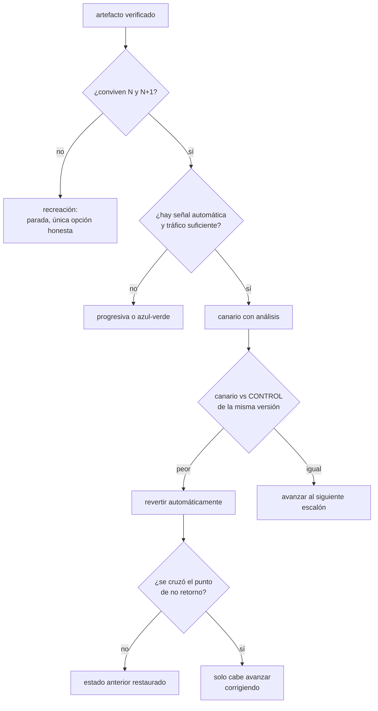

# 102 — Rolling, blue-green, canary y rollback

> [← Clase anterior](../../part-08-continuous-delivery-platform-engineering/101-sast-sca-secretos-sbom-y-firma-en-pipeline/README.md) · [Índice de la parte](../README.md) · [Clase siguiente →](../../part-08-continuous-delivery-platform-engineering/103-gitops-con-argo-cd-o-flux/README.md)

**Parte:** 08 — Entrega continua y platform engineering<br>
**Nivel:** avanzado · **Horas estimadas:** 4<br>
**Laboratorio:** `delivery` · **Estado:** `EXECUTABLE_CORE`

## 🎯 Propósito

Elegir cómo llega a producción un artefacto ya verificado, entendiendo lo que una estrategia de despliegue **sí** controla y lo que no. Ninguna reduce la probabilidad de que el cambio tenga un defecto: reducen cuánta gente lo ve y en cuánto tiempo se revierte. La clase demuestra por qué las cuatro estrategias comparten un mismo requisito —que dos versiones convivan—, por qué un canario de cinco minutos con el 5 % del tráfico no puede detectar casi nada, y por qué la reversión del código es fácil y la de los datos no.

## 📚 Resultados de aprendizaje

Al finalizar podrás:

1. **Distinguir** lo que una estrategia de despliegue controla de lo que no.
2. **Elegir** entre recreación, progresiva, azul-verde y canario con un criterio explícito.
3. **Diseñar** un cambio para que dos versiones convivan, que es el requisito común de todas.
4. **Dimensionar** un canario para que su veredicto signifique algo.
5. **Separar** lo que se puede revertir de lo que no, y planear en consecuencia.

## 🧩 Conceptos centrales

| Concepto | Comprensión verificable |
|---|---|
| `radio de exposición` | Proporción de usuarios que ve la versión nueva mientras se decide si está bien. Es lo que la estrategia controla de verdad. |
| `convivencia N y N+1` | Requisito común a las cuatro estrategias: durante el despliegue hay dos versiones en producción, y todo lo compartido debe funcionar con ambas. |
| `expandir y contraer` | Patrón para cambiar un esquema o un contrato en tres pasos —añadir, migrar, retirar— de modo que en ningún momento se rompa la convivencia. |
| `análisis automático del canario` | Comparar métricas del canario con las de un control de la misma versión y decidir sin intervención humana. Sin él, un canario es un despliegue progresivo más lento. |
| `potencia del canario` | Capacidad estadística de detectar el empeoramiento que se busca. Depende del tráfico que recibe y del tiempo que dura, no de la voluntad de detectarlo. |
| `punto de no retorno` | Momento a partir del cual revertir la versión ya no restaura el estado anterior, porque algo irreversible ha ocurrido en los datos. |

## 🧠 Modelo mental

Una plataforma interna ofrece capacidades como productos y reduce carga cognitiva mediante caminos dorados, sin quitar autonomía donde importa.

Aplicado a esta clase, separa siempre cuatro planos: **intención** (qué necesita el usuario),
**configuración** (qué declaramos), **estado observado** (qué existe de verdad) y
**evidencia** (cómo sabemos que cumple). Confundirlos produce diseños que se ven correctos
en un diagrama pero fallan al operar.

## 🗺️ Flujo de razonamiento



## 📖 Desarrollo

### 1. Lo que una estrategia controla, y lo que no

Conviene decirlo antes de comparar nada, porque es la confusión más cara de este tema:

```text
lo que NO cambia con la estrategia
  la probabilidad de que el cambio tenga un defecto
  → eso lo bajan las pruebas y las puertas de la clase 100

lo que SÍ cambia
  cuánta gente ve el defecto mientras se decide
  cuánto tarda en dejar de verlo
```

Y con eso, la magnitud que las cuatro estrategias mueven es una sola:

```text
impacto ≈ usuarios expuestos × tiempo hasta revertir
```

Las cuatro estrategias, y qué hace cada una con esos dos factores:

```text                     expuestos      revertir      coste       corte
recreación                 100 %         redesplegar   ninguno      sí
progresiva                 creciente     redesplegar   ninguno      no
azul-verde                 0 o 100 %     cambiar ruta  2× durante   no
canario                    1-5-25 %      cambiar ruta  1 extra      no
```

Y las dos columnas de la derecha explican por qué no hay una respuesta única:

```text
azul-verde     reversión en segundos, y hay que pagar dos entornos completos
               salta de 0 % a 100 % de golpe: no hay exposición gradual
canario        exposición gradual, y necesita señal para decidir
               si nadie mira la señal, es una progresiva más lenta
progresiva     barata y sin corte, y revertir exige redesplegar la anterior
recreación     hay corte, y es la única honesta cuando no cabe convivencia
```

Y una combinación frecuente que conviene nombrar porque resuelve la debilidad de dos de ellas: **azul-verde con desplazamiento gradual de tráfico** —los dos entornos completos, y la ruta moviéndose del 1 % al 100 %— da reversión instantánea *y* exposición gradual, al precio de mantener los dos entornos.

Y una pregunta que decide antes que cualquier otra, y que la clase 079 dejó planteada en Kubernetes:

```text
¿el servicio guarda estado en la instancia?
  sí  → ninguna estrategia funciona bien; el problema es el estado, no el despliegue
  no  → siguen las cuatro sobre la mesa
```

### 2. El requisito común: que N y N+1 convivan

Progresiva, azul-verde y canario tienen una cosa en común que a menudo se pasa por alto: **durante el despliegue hay dos versiones en producción a la vez**. Y todo lo que comparten tiene que funcionar con ambas.

```text
esquema de la base de datos      lo leen y escriben las dos
mensajes en la cola              los produce una y los consume la otra
caché compartida                 la escribe una y la lee la otra
ficheros en almacenamiento       los escribe una y los lee la otra
contrato de la API               lo llaman clientes de ambas edades
```

Y el fallo típico no es que el cambio esté mal, sino que **es incompatible consigo mismo**:

```text
la versión nueva renombra una columna
→ la versión vieja, que sigue sirviendo el 95 % del tráfico, falla
→ y el canario parece bien, porque el que falla es el control
```

El patrón que lo evita se llama **expandir y contraer**, y son tres despliegues, no uno:

```text
1. EXPANDIR   añadir la columna nueva; la aplicación escribe en las dos
              y sigue leyendo de la vieja
              → compatible con la versión anterior

2. MIGRAR     rellenar la columna nueva con los datos históricos
              cambiar la lectura a la nueva
              → compatible con la versión anterior

3. CONTRAER   dejar de escribir en la vieja y retirarla
              → SOLO cuando ninguna versión anterior está en producción
```

Y la regla que resume el patrón:

```text
ninguna migración de esquema puede ser destructiva
mientras exista una versión anterior en ejecución
```

Y lo que hace que el paso 3 se olvide sistemáticamente: es el único que no aporta funcionalidad. Anotarlo como trabajo con fecha, igual que las excepciones de las clases 091 y 101, es lo que evita que la base de datos acumule columnas muertas durante años.

Y el mismo patrón vale para las colas y para las API:

```text
colas   el consumidor nuevo entiende el formato viejo y el nuevo
        se despliegan primero TODOS los consumidores, y luego el productor
API     añadir campos, no renombrar; los campos nuevos, opcionales
        retirar solo cuando ningún cliente los usa, y eso se mide
```

La segunda línea de las colas es la que ordena el despliegue cuando hay dos servicios: **primero el que lee, después el que escribe**. Al revés, hay mensajes que nadie sabe interpretar.

### 3. Un canario que no puede detectar nada

Este es el apartado que cambia la práctica de la mayoría de los equipos. Un canario decide comparando métricas, y para que la comparación signifique algo hacen falta **suficientes eventos**.

La cuenta, con números realistas:

```text
tráfico total                     1.000 peticiones/s
al canario                                5 %  →  50 peticiones/s
tasa de error de referencia             0,1 %  →  0,05 errores/s
duración del canario                    5 min

errores esperados en el canario, si todo va bien:      15
errores esperados si el cambio DUPLICA la tasa:        30
```

Y con 15 frente a 30 eventos, la variación normal de un sistema real hace que esa diferencia sea perfectamente compatible con el azar. **Un canario de cinco minutos al 5 % no puede detectar que la tasa de error se ha duplicado.** Lo que hace es dar permiso para avanzar.

Las tres palancas, y cuál conviene mover:

```text
más tráfico al canario    detecta antes, y expone a más gente
más duración              detecta lo mismo, exponiendo a los mismos
umbral menos exigente     detecta solo desastres, no degradaciones
```

Y la conclusión práctica: **el escalón inicial debe durar más de lo que la intuición sugiere**, y los siguientes pueden ser rápidos porque el tráfico ya es mayor.

```text
5 %   30 min     ← el escalón que de verdad decide
25 %  10 min
50 %   5 min
100 %  —
```

Y una segunda corrección, tan importante como la anterior: **contra qué se compara**.

```text
mal   canario de hoy contra la media de ayer
      → la carga, la hora y la composición del tráfico son distintas

bien  canario contra un CONTROL de la versión anterior
      desplegado a la vez, con el mismo tamaño y el mismo tipo de tráfico
      → la única diferencia entre los dos grupos es la versión
```

Y qué se mira, en orden de utilidad:

```text
tasa de error del propio servicio         siempre
latencia, percentil 95 y 99               siempre
errores de sus dependencias               casi siempre
una métrica de negocio del recorrido      cuando exista
CPU y memoria                             como apoyo, no como veredicto
```

Y la trampa que la ley 13 vuelve a poner aquí: **si el análisis no consulta ninguna métrica, no falla — aprueba**. Un canario mal configurado no da error: da luz verde. La comprobación que lo detecta es la de siempre:

```text
desplegar a propósito una versión rota y confirmar que el canario la para
y repetirlo cada cierto tiempo, porque las métricas se renombran
```

### 4. Revertir: lo que se puede y lo que no

La reversión del código es un problema resuelto: se vuelve a la etiqueta anterior, que sigue existiendo porque la clase 099 la hizo inmutable. Lo que no está resuelto es todo lo demás.

```text
se revierte bien
  el binario y la imagen
  la configuración versionada
  la ruta del tráfico

no se revierte
  los datos que la versión nueva escribió en un formato nuevo
  los mensajes que ya consumió
  los correos que envió
  los pagos que cobró
  las llamadas que hizo a terceros
```

La frontera entre las dos listas es el **punto de no retorno**, y conviene identificarlo por adelantado para cada cambio:

```text
¿este cambio escribe datos que la versión anterior no sabe leer?
¿consume mensajes que no podrá reprocesar?
¿tiene efectos hacia fuera que no se pueden deshacer?

tres noes  → revertir es seguro; automatízalo
algún sí   → revertir no basta; hay que planear la corrección hacia delante
```

Y cuando la respuesta es «algún sí», la estrategia cambia de forma:

```text
reducir el radio todavía más (1 %, no 5 %)
poner un interruptor de funcionalidad para apagar sin desplegar (clase 105)
y tener escrito el procedimiento de corrección, no solo el de reversión
```

Y los dos umbrales que hacen que la reversión ocurra de verdad:

```text
automática   el análisis del canario revierte sin preguntar
manual       cualquiera del equipo puede revertir sin pedir permiso
```

La segunda es organizativa y suele ser el cuello de botella real: si revertir exige una aprobación, la mediana de tiempo hasta revertir se mide en horas. Y con la fórmula del primer apartado, eso multiplica el impacto por el mismo factor.

Y una precaución sobre la reversión automática, porque el exceso también hace daño: si revierte por cualquier oscilación, el equipo pierde la confianza y la desactiva —ley 16 otra vez—. El ajuste es el mismo que en la clase 101: medir cuántas reversiones fueron correctas.

```text
reversiones automáticas por trimestre         12
  correctas (el cambio era malo)               9
  innecesarias (falsa alarma)                  3   ← si sube, sube el umbral
```

Y la lista de comprobación de la clase:

```text
☐ el servicio no guarda estado en la instancia
☐ el cambio es compatible con la versión anterior en esquema, colas y API
☐ las migraciones destructivas están separadas, con fecha y dueño
☐ los consumidores se despliegan antes que los productores
☐ el canario se compara con un control de la versión anterior, no con ayer
☐ el primer escalón dura lo suficiente para que su veredicto signifique algo
☐ el análisis consulta métricas que existen, comprobado con una versión rota
☐ el punto de no retorno del cambio está identificado antes de desplegar
☐ revertir no requiere aprobación de nadie
☐ se mide cuántas reversiones automáticas fueron innecesarias
```

Y el cierre que enlaza con la clase siguiente: en todo esto, alguien o algo ejecuta el despliegue. Cuando ese algo es un proceso que compara continuamente lo declarado con lo real —la predicción escrita al cerrar la parte 06— aparecen problemas nuevos, y son la materia de la clase 103.

## 🔬 Ejemplo trabajado

**CloudShop tenía despliegue progresivo en los quince servicios y una reversión que exigía aprobación. En seis meses hubo cuatro incidentes causados por despliegues; el ejercicio consiste en clasificarlos y cambiar solo lo que los cuatro casos justifican.**

**Los cuatro incidentes.**

```text
A  fallo del 100 % de peticiones           detectado en 4 min, revertido en 51 min
   causa: excepción en el arranque con la configuración de producción

B  latencia ×3 en el percentil 99          detectado en 3 h, revertido en 4 h 10
   causa: una consulta sin índice, visible solo con datos reales

C  pedidos duplicados durante 2 h 40       no se revirtió
   causa: la versión nueva reprocesó mensajes que la vieja había marcado

D  el 5 % de peticiones fallando 6 días    detectado por un cliente
   causa: la versión nueva renombró un campo; el consumidor viejo lo ignoraba
```

**Lo primero que salta: el tiempo hasta revertir, no la detección.**

```text            detección      hasta revertir    de la que era aprobación
A                   4 min           51 min                    43 min
B                    3 h           1 h 10                      38 min
C                     —               —                          —
D                   6 días            —                          —
```

En los dos casos donde se revirtió, **la aprobación fue la mayor parte del tiempo**. Se eliminó el requisito: cualquiera del equipo revierte sin pedir permiso, y se avisa después.

```text                                     antes           después
mediana de tiempo hasta revertir         1 h 10           6 min
```

**El incidente A: un canario lo habría parado, y no había canario.**

Un fallo del 100 % de peticiones es lo más fácil de detectar: con el 5 % del tráfico durante 30 minutos, un canario lo habría parado en el primer minuto exponiendo al 5 %. Se activó canario con análisis automático en los cinco servicios de cara al cliente.

Y la primera configuración fue la que casi todo el mundo escribe:

```text
5 % durante 5 min, comparado con la media de la semana anterior
```

Se hizo la cuenta del apartado tercero con el tráfico real del servicio de pedidos:

```text
tráfico                          420 peticiones/s
al canario, 5 %                   21 peticiones/s
tasa de error de referencia          0,08 %
errores esperados en 5 min             5
errores si la tasa se duplica         10
```

Cinco frente a diez. Se cambió a **30 minutos en el primer escalón** y a comparar con un control de la versión anterior desplegado a la vez. Y se comprobó desplegando a propósito una versión con un 2 % de error inyectado:

```text                                    ¿lo para?
5 min, contra la semana anterior             no
30 min, contra la semana anterior            no consistentemente
30 min, contra control simultáneo            sí, en el minuto 11
```

La tercera línea es la que justifica el control simultáneo: sin él, la variación entre días tapaba la señal.

**El incidente B: el canario tampoco lo habría parado, y eso hay que decirlo.**

La consulta sin índice degradaba solo con el volumen de datos completo, y a bajo tráfico el percentil 99 del canario no se separaba del control. Lo que lo detectó al reproducirlo fue una métrica distinta:

```text
latencia del servicio, p99          sin diferencia significativa a 5 %
duración de consulta a la base      +310 % desde el primer minuto
```

Se añadió la latencia de las dependencias al análisis. **El canario no es una red universal**: cada incidente que se escapa señala una métrica que falta.

**El incidente C: no había estrategia posible, porque el punto de no retorno se cruzó en el minuto uno.**

Los pedidos duplicados ya estaban cobrados. Revertir la versión no los deshacía. La revisión del cambio con las tres preguntas habría dado dos síes:

```text
¿escribe datos que la versión anterior no sabe leer?    no
¿consume mensajes que no podrá reprocesar?              SÍ
¿tiene efectos hacia fuera irreversibles?               SÍ  (cobros)
```

Se añadió esa revisión de tres preguntas a la plantilla de cambio. Con dos síes, el despliegue pasa a 1 % durante una hora y con interruptor de funcionalidad.

**El incidente D: el problema no era el despliegue, era la convivencia.**

El campo renombrado rompió al consumidor viejo. El diagnóstico es el del apartado segundo, y la corrección también:

```text                                  antes            después
cambios de esquema y contrato       en un despliegue   expandir/migrar/contraer
orden de despliegue                 sin regla          consumidores primero
comprobación de compatibilidad      no había           puerta en la canalización
```

La puerta compara el contrato del cambio con el de la versión en producción y bloquea si elimina o renombra algo. En seis meses paró once cambios; **los once eran renombrados en despliegue único**, exactamente el patrón del incidente D.

Y el paso de contraer, que es el que se olvida:

```text
columnas duplicadas pendientes de retirar, al empezar        0
creadas por el patrón en 6 meses                             9
retiradas en plazo                                           7
pendientes con fecha y dueño                                 2
```

**A los seis meses.**

```text                                          antes         después
incidentes causados por despliegues        4 / 6 meses    1 / 6 meses
mediana de tiempo hasta revertir              1 h 10          6 min
usuarios expuestos en el peor caso             100 %             5 %
reversión requiere aprobación                    sí              no
reversiones automáticas del canario               —          9 correctas
                                                             3 innecesarias
cambios parados por incompatibilidad              —              11
prueba de canario con versión rota          no existía      trimestral
```

**La lección que esta clase traslada al resto de la parte 08**: de las cuatro causas, **solo una se resolvía con la estrategia de despliegue**. La segunda pedía una métrica que no se miraba, la tercera era irreversible por naturaleza y la cuarta era un problema de compatibilidad entre versiones que ninguna estrategia arregla. Y el cambio de mayor efecto medido no fue el canario: fue **quitar la aprobación para revertir**, que dividió por once el tiempo de exposición sin costar nada.

## 🧪 Laboratorio guiado

Ejecuta desde la raíz:

```bash
python classes/part-08-continuous-delivery-platform-engineering/102-rolling-blue-green-canary-y-rollback/lab.py
```

El laboratorio selecciona el motor de práctica **`delivery`** y produce
`lab_result.json`. El escenario, sus comprobaciones y el artefacto esperado corresponden a
esta clase; no requiere credenciales y deja explícito qué debe revalidarse en un sandbox real.

1. Lee `exercise.steps` y formula una predicción antes de ejecutar.
2. Ejecuta la práctica y verifica todos los elementos de `checks`.
3. Provoca el caso de `negative_test` y explica la señal observada.
4. Materializa `estrategia-despliegue` en `evidence/` usando la plantilla indicada.
5. Para proveedor real, sigue `sandbox.requires`, registra costo y ejecuta `destroy`.

### Evidencia esperada

El artefacto principal es un pipeline con gates, promoción y rollback. Además, la entrega debe incluir el comando ejecutado,
la salida estructurada y una conclusión que no exceda lo observado.

## 🏆 Reto verificable

Construye **`estrategia-despliegue`** para el caso CloudShop. Incluye una alternativa descartada,
un supuesto que pueda falsarse, una prueba de fallo y una decisión de rollback.

## ✅ Criterio de aceptación

- [ ] `lab.py` termina con código 0 y genera JSON válido.
- [ ] La entrega conecta al menos tres requisitos con mecanismos verificables.
- [ ] Existe una prueba positiva y una prueba negativa con evidencia.
- [ ] Seguridad, costo y operación aparecen como decisiones, no como anexos.
- [ ] Se declara una limitación y una condición que obligaría a revisar el diseño.
- [ ] Otra persona puede repetir el recorrido sin conocimiento tácito.

## ⚠️ Errores frecuentes

| Síntoma | Causa probable | Corrección |
|---|---|---|
| El canario aprueba cambios que luego fallan en producción | Con el tráfico y la duración configurados no hay eventos suficientes para detectar el empeoramiento | Calcula los eventos esperados en el escalón; alarga el primer escalón hasta que la diferencia buscada sea distinguible. |
| El canario da veredictos erráticos según el día y la hora | Se compara con datos históricos, y la carga y el tráfico no son comparables | Compara con un control de la versión anterior desplegado a la vez, con el mismo tamaño y el mismo tipo de tráfico. |
| La versión antigua empieza a fallar cuando se despliega la nueva | El cambio es incompatible con su propia versión anterior en esquema, cola o contrato | Aplica expandir y contraer, despliega los consumidores antes que los productores y pon una puerta que bloquee eliminaciones y renombrados. |
| Se revierte la versión y el problema persiste | Se cruzó el punto de no retorno: hay datos, mensajes o efectos externos que la reversión no deshace | Identifica el punto de no retorno antes de desplegar con las tres preguntas y planea la corrección hacia delante, no solo la reversión. |
| El tiempo hasta revertir se mide en horas aunque la detección sea de minutos | Revertir requiere una aprobación | Autoriza a cualquiera del equipo a revertir sin permiso previo, con aviso posterior. |
| Un canario mal configurado aprueba todo y nadie se entera | Ley 13: un análisis que no consulta ninguna métrica no falla, aprueba | Despliega a propósito una versión rota cada trimestre y confirma que el canario la para. |

## 🛡️ Seguridad, ética y costo

Trabaja con cuentas propias o sandboxes autorizados. No publiques secretos, identificadores
reales ni datos personales. Antes de crear recursos pagos define presupuesto, etiquetas y
comando de destrucción; después verifica que no queden recursos huérfanos. Los ejemplos
locales enseñan contratos, pero no certifican cumplimiento ni disponibilidad de producción.

## ❓ Preguntas de comprobación

1. ¿Qué controla una estrategia de despliegue y qué no controla?
2. ¿Qué requisito comparten progresiva, azul-verde y canario, y qué patrón lo satisface?
3. ¿Por qué un canario de cinco minutos con el 5 % del tráfico puede no detectar nada?
4. ¿Contra qué debe compararse el canario y por qué no contra la semana anterior?
5. ¿Qué tres preguntas identifican el punto de no retorno de un cambio?

## 🔗 Referencias

- Humble, J. y Farley, D. (2010). *Continuous Delivery*, cap. 10 — despliegues azul-verde, canario y reversión. <https://www.oreilly.com/library/view/continuous-delivery-reliable/9780321670250/>
- Google SRE (2025). *Canarying releases* — control simultáneo, potencia del análisis y automatización del veredicto. <https://sre.google/workbook/canarying-releases/>
- Kubernetes (2025). *Deployment strategies and rollbacks* — mecánica de progresiva y reversión. <https://kubernetes.io/docs/concepts/workloads/controllers/deployment/>
- Argo Rollouts (2025). *Analysis and progressive delivery* — escalones, métricas y reversión automática. <https://argo-rollouts.readthedocs.io/en/stable/features/analysis/>
- Fowler, M. (2025). *Parallel change (expand and contract)* — cambiar un contrato sin romper la convivencia. <https://martinfowler.com/bliki/ParallelChange.html>
- Documentación oficial vigente del servicio implementado; registra URL y fecha de consulta.

---

> [Evaluación](assessment.md) · [Contrato de clase](lesson.yaml) · [Índice de la parte](../README.md)
