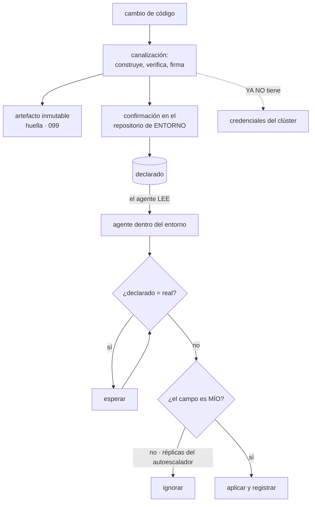

# 103 — GitOps con Argo CD o Flux

> [← Clase anterior](../../part-08-continuous-delivery-platform-engineering/102-rolling-blue-green-canary-y-rollback/README.md) · [Índice de la parte](../README.md) · [Clase siguiente →](../../part-08-continuous-delivery-platform-engineering/104-ambientes-efimeros-y-promocion-entre-entornos/README.md)

**Parte:** 08 — Entrega continua y platform engineering<br>
**Nivel:** avanzado · **Horas estimadas:** 4<br>
**Laboratorio:** `gitops` · **Estado:** `EXECUTABLE_CORE`

## 🎯 Propósito

Poner en marcha el bucle continuo que la parte 06 predijo y que la parte 07 no llegó a construir: un agente dentro del entorno que compara sin parar lo declarado con lo real y corrige la diferencia. La clase muestra lo que ese bucle resuelve —la canalización deja de tener credenciales del clúster, y la deriva deja de acumularse— y, con el mismo detalle, **lo que rompe si se activa sin decidir antes qué campos no le pertenecen**.

## 📚 Resultados de aprendizaje

Al finalizar podrás:

1. **Explicar** en qué cambia el modelo cuando el agente tira en vez de que la canalización empuje.
2. **Organizar** los repositorios de código y de entorno, y qué confirmación despliega.
3. **Delimitar** qué campos gobierna el bucle y cuáles debe ignorar.
4. **Promocionar** un cambio entre entornos con evidencia y sin reconstruir el artefacto.
5. **Reconocer** los modos de fallo propios del bucle, empezando por el silencioso.

## 🧩 Conceptos centrales

| Concepto | Comprensión verificable |
|---|---|
| `reconciliación continua` | Un agente compara periódicamente el estado declarado con el real y aplica la diferencia. No es un despliegue: es un bucle que no termina. |
| `modelo de tirar` | El agente vive dentro del entorno y lee el repositorio. La canalización deja de necesitar credenciales del clúster. |
| `repositorio de entorno` | Repositorio separado que declara qué versión corre en cada entorno. La confirmación que lo modifica es la que despliega. |
| `propiedad de campo` | Decisión explícita sobre qué partes de un recurso gobierna el bucle. Sin ella, el bucle pelea con los autoescaladores y los operadores. |
| `poda` | Borrar lo que existe en el entorno y no está declarado. Es lo que cierra el círculo de la ley 13, y también lo más peligroso del bucle. |
| `ondas de sincronización` | Orden explícito de aplicación cuando unos recursos dependen de otros. Sin ellas el bucle converge igual, pero con errores transitorios ruidosos. |

## 🧠 Modelo mental

Una plataforma interna ofrece capacidades como productos y reduce carga cognitiva mediante caminos dorados, sin quitar autonomía donde importa.

Aplicado a esta clase, separa siempre cuatro planos: **intención** (qué necesita el usuario),
**configuración** (qué declaramos), **estado observado** (qué existe de verdad) y
**evidencia** (cómo sabemos que cumple). Confundirlos produce diseños que se ven correctos
en un diagrama pero fallan al operar.

## 🗺️ Flujo de razonamiento



## 📖 Desarrollo

### 1. Qué cambia cuando el agente tira

Hasta aquí, la canalización se conectaba al entorno y aplicaba. Eso obliga a que la canalización tenga credenciales con permiso para modificar producción, y la clase 098 ya explicó lo que eso significa: **quien controla el flujo controla el entorno**.

El cambio del modelo:

```text
EMPUJAR                              TIRAR
canalización → entorno               entorno → repositorio
necesita credenciales del clúster    no las necesita
despliega cuando se ejecuta          reconcilia sin parar
la deriva se acumula                 la deriva se corrige
si el flujo no corre, no pasa nada   si el bucle no corre, tampoco (ley 13)
```

Y las tres consecuencias que importan, en orden de valor:

```text
1. la canalización pierde el permiso más peligroso que tenía
   → deja de ser el objetivo que la clase 098 describió

2. la deriva deja de acumularse
   → la clase 090 la detectaba una vez al día; aquí se corrige sola

3. el estado del entorno es legible sin entrar en él
   → lo declarado está en un repositorio, con historial y revisión
```

Y una consecuencia menos citada y muy útil en la práctica: **reconstruir un entorno entero pasa a ser apuntar un agente nuevo al mismo repositorio**. Es la recuperación que la clase 088 pedía, sin procedimiento aparte.

Y lo que **no** cambia, para no venderlo de más:

```text
no reduce los defectos del cambio        eso siguen siendo las pruebas
no sustituye la estrategia de la 102     el bucle aplica; el escalonado decide
no resuelve los secretos                 ver el apartado cuarto
no impide que alguien modifique a mano   lo detecta y lo revierte, que no es lo mismo
```

La última línea es importante: el bucle **no bloquea** el cambio manual. Lo deshace unos minutos después. Y eso es una mejora enorme frente a que se quede, y a la vez un problema nuevo, que es el del apartado tercero.

### 2. Dos repositorios, y qué confirmación despliega

La separación que hace funcionar esto es sencilla de enunciar y se equivoca a menudo:

```text
repositorio de CÓDIGO      lo que se construye
                           su confirmación produce un artefacto, no un despliegue

repositorio de ENTORNO     qué versión corre en cada entorno
                           su confirmación SÍ despliega
```

Y con esa separación, promocionar entre entornos deja de reconstruir nada —la regla de la clase 099— y pasa a ser un cambio de una línea:

```text
entornos/pre/tienda.yaml:  image: registro/tienda@sha256:9f2c…
entornos/pro/tienda.yaml:  image: registro/tienda@sha256:9f2c…   ← misma huella
```

Y el detalle que evita el fallo más común: **por huella, no por etiqueta móvil**. Una etiqueta como `v2.3` puede reapuntarse; la huella no. Si el repositorio de entorno declara una etiqueta móvil, el bucle no puede saber si hay deriva, porque lo declarado no identifica un artefacto.

La estructura que sostiene esto sin duplicar todo tres veces es la de la clase 083:

```text
base/                    lo común
entornos/dev/            lo que cambia en dev
entornos/pre/
entornos/pro/
```

Y una decisión organizativa que decide la fricción diaria: **quién aprueba cada entorno**.

```text
dev   confirmación directa, sin revisión
pre   automática al pasar las puertas de la clase 100
pro   revisión de una persona del equipo dueño (catálogo, clase 095)
```

Y el registro que esto produce sin esfuerzo adicional, que es lo que la clase 090 tenía que reconstruir a mano:

```bash
$ git log --oneline entornos/pro/tienda.yaml
a91c4e2  promociona tienda a sha256:9f2c…   (aprobó: equipo-pedidos)
7b30f18  revierte a sha256:41ab…           (incidente INC-2291)
```

Y una precaución sobre las ondas de sincronización: cuando unos recursos dependen de otros —espacio de nombres antes que lo que contiene, definición de recurso antes que su instancia—, el bucle acaba convergiendo igual a base de reintentos, pero produce errores transitorios que se confunden con fallos reales. Declarar el orden es barato y limpia el ruido.

### 3. Qué campos NO son del bucle

Este es el apartado que la clase 096 anticipó al escribir la lista de lo que el bucle no debe revertir, y es donde fallan casi todas las adopciones.

El bucle compara lo declarado con lo real. Pero en un entorno vivo **hay cosas reales que nadie declaró y que están bien**:

```text
número de réplicas          lo fija el autoescalador (clase 078)
                            declarar 3 y que el bucle lo devuelva a 3
                            cada dos minutos anula el autoescalado

etiquetas y anotaciones     las añaden operadores y mallas de servicio
inyectadas

certificados renovados      los rota un operador

campos rellenados por       direcciones asignadas, identificadores generados
el propio sistema
```

Y el síntoma cuando esto no se decide es característico: **el bucle informa de deriva permanente y nadie la mira**, que es la ley 15 otra vez —una señal que siempre está encendida deja de ser señal—.

La corrección es declarar la propiedad de cada campo:

```yaml
# el bucle gobierna todo el recurso MENOS las réplicas
ignoreDifferences:
  - group: apps
    kind: Deployment
    jsonPointers: ["/spec/replicas"]
```

Y la regla general que ordena la decisión:

```text
si otro controlador escribe ese campo por diseño → no es del bucle
si lo escribió una persona a mano                → sí es del bucle
```

Y la segunda línea es la que da valor: la corrección automática de lo que alguien tocó a mano es exactamente lo que la clase 090 no podía hacer.

**La poda**, que es lo que cierra el círculo. Sin ella, borrar algo del repositorio no lo borra del entorno, y la ley 13 vuelve: un recurso que se quitó de lo declarado sigue corriendo y nadie da error.

```text
sin poda   el entorno acumula lo que ya nadie declara
con poda   lo declarado es la verdad completa
```

Y a la vez es lo más peligroso del bucle, porque un error en el repositorio se convierte en un borrado:

```text
un fichero mal movido en una confirmación
→ el bucle interpreta que esos recursos ya no se declaran
→ y los borra
```

Las tres protecciones, y conviene tener las tres:

```text
finalizadores y anotación de no-podar en lo que no debe borrarse nunca
  → bases de datos, volúmenes persistentes, espacios de nombres
umbral de seguridad: si la diferencia supera un porcentaje, parar y avisar
poda manual en producción durante la adopción, automática después
```

Y el modo de fallo silencioso que hay que vigilar desde el primer día, porque es el de siempre:

```text
el agente deja de sincronizar —permisos caducados, repositorio inaccesible—
→ no da error: deja de haber cambios
→ y el entorno parece estable cuando en realidad está congelado
```

La comprobación que lo detecta es la de la clase 090: **alertar por antigüedad de la última reconciliación correcta**, no por fallo.

```promql
time() - max(argocd_app_reconcile_timestamp) > 1800
```

### 4. Secretos, incidentes y lo que el bucle no debe deshacer

Dos problemas prácticos que deciden si esto sobrevive al primer mes.

**Secretos.** Si lo declarado vive en un repositorio, un secreto en lo declarado es un secreto en el repositorio, y la ley 11 dice lo que pasa entonces. Las dos salidas honestas:

```text
cifrado en el repositorio      el fichero está cifrado; el agente descifra
                              con una clave del entorno
                              → simple, y rotar exige recifrar

referencia externa            el repositorio declara DÓNDE está el secreto,
                              y un operador lo trae del almacén (clases 046, 054)
                              → el secreto nunca entra en el repositorio
```

La segunda es la que encaja con todo lo anterior de este programa, porque conserva la propiedad de la clase 054: **el secreto se resuelve con la identidad de la carga, no con una clave guardada**.

```yaml
# lo que SÍ entra en el repositorio
spec:
  secretStoreRef: { name: almacen-pro }
  data:
    - secretKey: cadena-conexion
      remoteRef: { key: pedidos/base-datos }
```

**Incidentes.** Aquí está la tensión que la clase 096 previó. Durante un incidente alguien cambia algo a mano para parar la hemorragia, y el bucle lo revierte a los dos minutos.

La respuesta mala y la buena:

```text
mala   desactivar el bucle durante el incidente
       → y olvidarse de volver a activarlo (ley 13 y ley 16 a la vez)

buena  que el cambio de emergencia sea una confirmación
       → con revisión posterior en vez de previa, y aviso automático
```

Y para que la buena sea viable, el camino de emergencia tiene que ser **más rápido que tocar a mano**, no más lento; si no, nadie lo usa. Eso significa: rama directa, sin aprobación, sincronización inmediata y un aviso al canal del equipo.

Y conviene medir si funciona:

```text
cambios de emergencia por confirmación        11
cambios a mano en el entorno                   2   ← si sube, el camino es lento
bucles desactivados y no reactivados           0   ← si no es cero, hay un problema
```

Y la lista de comprobación de la clase:

```text
☐ la canalización ya no tiene credenciales de escritura en el entorno
☐ repositorio de entorno separado, y su confirmación es la que despliega
☐ se declara la huella del artefacto, no una etiqueta móvil
☐ los campos de otros controladores están excluidos del bucle
☐ la poda está activa, con protecciones sobre lo que no debe borrarse
☐ hay umbral de seguridad que para la poda si la diferencia es grande
☐ alerta por ANTIGÜEDAD de la última reconciliación, no por fallo
☐ los secretos se resuelven por referencia, no se guardan en el repositorio
☐ el camino de emergencia es una confirmación y es más rápido que tocar a mano
☐ se mide cuántos cambios manuales quedan y cuántos bucles se desactivaron
```

Y el cierre que enlaza con la clase siguiente: con lo declarado en un repositorio y un agente que lo materializa, crear un entorno completo deja de ser un proyecto y pasa a ser una confirmación. Qué se puede hacer con eso —y qué cuesta— es la materia de la clase 104.

## 🔬 Ejemplo trabajado

**CloudShop lleva los quince servicios al modelo de tirar. La parte 06 predijo que un bucle continuo resolvería la deriva; la parte 07 solo construyó detección programada. Este ejercicio es la primera vez que el bucle existe, y lo interesante son los tres problemas que aparecen y que la detección no tenía.**

**Punto de partida.**

```text
despliegue           la canalización se conecta al clúster y aplica
credenciales         un rol con permiso de escritura en los tres entornos,
                     guardado en la canalización
deriva               detectada una vez al día (clase 090); 2 cambios manuales/mes
reconstruir entorno  procedimiento de 4 páginas, probado una vez
```

**Semana 1: el bucle se activa en dev y aparece deriva permanente.**

```text
recursos declarados                       412
marcados como derivados en la primera hora 209
```

Doscientos nueve de cuatrocientos doce. Al mirarlos, ninguno era un cambio manual:

```text
réplicas fijadas por el autoescalador            61
anotaciones inyectadas por la malla de servicio  88
campos rellenados por el propio sistema          47
cambios manuales reales                          13
```

Con el 51 % de los recursos siempre en rojo, la señal no sirve —ley 15, séptima aparición—. Se declaró la propiedad de campo:

```text                                          derivados
sin excluir nada                                    209
excluyendo réplicas                                 148
excluyendo anotaciones inyectadas                    60
excluyendo campos del sistema                        13
```

Trece, y los trece eran cambios manuales reales. El bucle los corrigió, y de los trece hubo **uno que no debía corregirse**: un límite de memoria subido a mano durante un incidente tres semanas antes, que nadie había llevado al repositorio. Se llevó al repositorio antes de que el bucle lo revirtiera.

**Semana 3: la poda borra un espacio de nombres en preproducción.**

Una confirmación movió un directorio y el bucle interpretó que sesenta recursos ya no se declaraban.

```text
recursos borrados                60
tiempo hasta detectarlo           4 min
tiempo hasta restaurarlo         11 min   ← revirtiendo la confirmación
datos perdidos                    0
```

Los once minutos de restauración son, en realidad, el argumento **a favor** del modelo: se restauró revirtiendo una confirmación, sin procedimiento. Pero podía haber pasado en producción, y ahí sí había volúmenes. Se añadieron las tres protecciones:

```text
umbral de seguridad: la poda se detiene si afecta a más del 10 % de recursos
anotación de no-podar en volúmenes, bases de datos y espacios de nombres
poda manual en producción durante los tres primeros meses
```

El umbral se activó dos veces en seis meses; **las dos eran errores de confirmación**, no cambios intencionados.

**Semana 5: el bucle de un servicio lleva nueve días sin sincronizar y nadie lo sabe.**

El testigo de acceso al repositorio había caducado. El estado del servicio no era «error»: era «desconocido», y el panel lo pintaba en gris.

```text
días sin reconciliar               9
confirmaciones sin aplicar         6
qué mostraba el panel        sincronizado (con la última información conocida)
```

Es la ley 13 por séptima vez en este programa, y en su forma más pura: **el bucle que no corre no da error**. La alerta que lo detecta no mira fallos, mira antigüedad:

```promql
time() - max by (app) (argocd_app_reconcile_timestamp) > 1800
```

Desde entonces, tres detecciones más: dos permisos caducados y un repositorio renombrado.

**Semana 8: el primer incidente con el bucle activo.**

Alguien subió las réplicas a mano para absorber un pico. El bucle no las tocó —estaban excluidas— pero el cambio siguiente sí fue a mano: un límite de memoria. El bucle lo revirtió en dos minutos, en mitad del incidente.

```text
reacción inicial propuesta   desactivar el bucle durante incidentes
decisión tomada              camino de emergencia por confirmación
```

Y el camino se diseñó con el criterio del apartado cuarto —más rápido que tocar a mano—:

```text                                     tiempo hasta que surte efecto
tocar a mano en el clúster                          40 s
confirmación de emergencia (sin aprobación,
sincronización inmediata, aviso al canal)           95 s
```

Noventa y cinco segundos frente a cuarenta. Se aceptó, y se midió el uso:

```text                                    mes 1    mes 6
cambios de emergencia por confirmación       4       11
cambios a mano en el clúster                 3        0
bucles desactivados por un incidente         1        0
```

El único bucle desactivado, el del mes 1, estuvo apagado **seis días** después del incidente.

**La canalización pierde el permiso.**

```text                                          antes         después
credenciales de escritura en el clúster    en la canalización   ninguna
lo que la canalización puede hacer         desplegar en pro   confirmar en
                                                              el repositorio
quien aprueba producción                   nadie              equipo dueño (095)
```

Y el efecto sobre la clase 098: el flujo más peligroso del inventario dejó de serlo.

**A los seis meses.**

```text                                          antes         después
recursos en deriva permanente                    —        13 → 0-2
tiempo hasta corregir un cambio manual        1 día        2 min
cambios manuales en el entorno              2 / mes       0 / mes
credenciales de clúster en la canalización     sí           no
reconstruir un entorno completo           4 páginas    apuntar un agente
prueba de reconstrucción                  1 vez         cada despliegue de dev
bucles parados sin que nadie lo supiera       —      4 detectados por antigüedad
podas detenidas por el umbral                 —        2, ambas errores
```

**La lección que esta clase traslada al resto de la parte 08**: el bucle hizo lo que la parte 06 predijo —la deriva pasó de un día a dos minutos, y los cambios manuales a cero—, y a cambio trajo tres problemas que la detección programada no tenía: **deriva permanente por campos ajenos, borrados por poda y un bucle parado que no da error**. Los tres tienen la misma forma que ya conocemos: el primero es la ley 15, el tercero es la ley 13, y el segundo es la ley 14 —una decisión automática sobre lo que existe o no existe, tomada a partir de una confirmación equivocada—.

## 🧪 Laboratorio guiado

Ejecuta desde la raíz:

```bash
python classes/part-08-continuous-delivery-platform-engineering/103-gitops-con-argo-cd-o-flux/lab.py
```

El laboratorio selecciona el motor de práctica **`gitops`** y produce
`lab_result.json`. El escenario, sus comprobaciones y el artefacto esperado corresponden a
esta clase; no requiere credenciales y deja explícito qué debe revalidarse en un sandbox real.

1. Lee `exercise.steps` y formula una predicción antes de ejecutar.
2. Ejecuta la práctica y verifica todos los elementos de `checks`.
3. Provoca el caso de `negative_test` y explica la señal observada.
4. Materializa `reconciliacion-gitops` en `evidence/` usando la plantilla indicada.
5. Para proveedor real, sigue `sandbox.requires`, registra costo y ejecuta `destroy`.

### Evidencia esperada

El artefacto principal es reconciliación declarativa y evidencia de drift. Además, la entrega debe incluir el comando ejecutado,
la salida estructurada y una conclusión que no exceda lo observado.

## 🏆 Reto verificable

Construye **`reconciliacion-gitops`** para el caso CloudShop. Incluye una alternativa descartada,
un supuesto que pueda falsarse, una prueba de fallo y una decisión de rollback.

## ✅ Criterio de aceptación

- [ ] `lab.py` termina con código 0 y genera JSON válido.
- [ ] La entrega conecta al menos tres requisitos con mecanismos verificables.
- [ ] Existe una prueba positiva y una prueba negativa con evidencia.
- [ ] Seguridad, costo y operación aparecen como decisiones, no como anexos.
- [ ] Se declara una limitación y una condición que obligaría a revisar el diseño.
- [ ] Otra persona puede repetir el recorrido sin conocimiento tácito.

## ⚠️ Errores frecuentes

| Síntoma | Causa probable | Corrección |
|---|---|---|
| La mitad de los recursos aparecen en deriva permanente y nadie mira el panel | El bucle compara campos que escriben otros controladores por diseño | Declara la propiedad de campo y excluye réplicas del autoescalador, anotaciones inyectadas y campos rellenados por el sistema. |
| Una confirmación mal hecha borra recursos del entorno | La poda interpreta que lo que ya no se declara debe desaparecer | Umbral de seguridad por porcentaje, anotación de no-podar en volúmenes y bases de datos, y poda manual en producción durante la adopción. |
| Un servicio lleva días sin recibir cambios y el panel lo muestra bien | Ley 13: el agente dejó de sincronizar y eso no produce error | Alerta por antigüedad de la última reconciliación correcta, no por fallo. |
| Durante un incidente alguien desactiva el bucle y no vuelve a activarse | El camino de emergencia por confirmación es más lento que tocar a mano | Haz el camino de emergencia rápido —sin aprobación, sincronización inmediata, aviso automático— y mide cuántos bucles quedan desactivados. |
| El bucle no detecta que se ha desplegado otra versión | Lo declarado usa una etiqueta móvil, que no identifica un artefacto | Declara la huella del artefacto, como exige la inmutabilidad de la clase 099. |
| Hay secretos en el repositorio de entorno | Lo declarado incluye el valor en vez de una referencia | Declara dónde está el secreto y deja que un operador lo resuelva con la identidad de la carga. |

## 🛡️ Seguridad, ética y costo

Trabaja con cuentas propias o sandboxes autorizados. No publiques secretos, identificadores
reales ni datos personales. Antes de crear recursos pagos define presupuesto, etiquetas y
comando de destrucción; después verifica que no queden recursos huérfanos. Los ejemplos
locales enseñan contratos, pero no certifican cumplimiento ni disponibilidad de producción.

## ❓ Preguntas de comprobación

1. ¿Qué permiso pierde la canalización al pasar al modelo de tirar y por qué importa?
2. ¿Qué diferencia hay entre el repositorio de código y el de entorno, y cuál despliega?
3. ¿Qué campos no debe gobernar el bucle y qué pasa si no se excluyen?
4. ¿Por qué la poda es a la vez necesaria y peligrosa, y con qué tres protecciones se usa?
5. ¿Por qué la alerta del bucle mira la antigüedad de la reconciliación y no los fallos?

## 🔗 Referencias

- OpenGitOps (2025). *GitOps principles* — declarativo, versionado, extraído automáticamente y reconciliado de forma continua. <https://opengitops.dev/>
- Argo CD (2025). *Diffing customization and resource pruning* — propiedad de campo, exclusiones y protecciones de poda. <https://argo-cd.readthedocs.io/en/stable/user-guide/diffing/>
- Flux (2025). *Bootstrap and reconciliation* — agente dentro del clúster, intervalos y estado de sincronización. <https://fluxcd.io/flux/installation/bootstrap/>
- External Secrets Operator (2025). *SecretStore and ExternalSecret* — declarar la referencia sin guardar el valor. <https://external-secrets.io/latest/introduction/overview/>
- CNCF (2025). *GitOps working group: multi-environment promotion* — repositorio de entorno y promoción por huella. <https://github.com/cncf/tag-app-delivery>
- Documentación oficial vigente del servicio implementado; registra URL y fecha de consulta.

---

> [Evaluación](assessment.md) · [Contrato de clase](lesson.yaml) · [Índice de la parte](../README.md)
