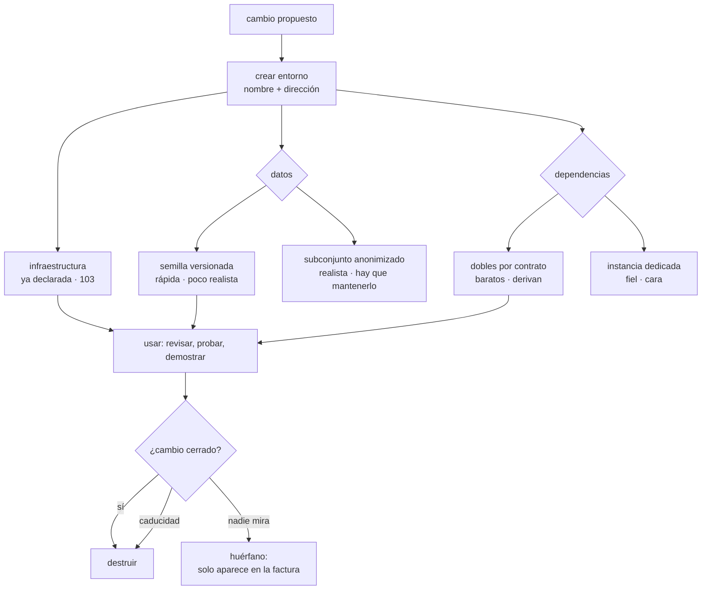

# 104 — Ambientes efímeros y promoción entre entornos

> [← Clase anterior](../../part-08-continuous-delivery-platform-engineering/103-gitops-con-argo-cd-o-flux/README.md) · [Índice de la parte](../README.md) · [Clase siguiente →](../../part-08-continuous-delivery-platform-engineering/105-feature-flags-y-separacion-deploy-release/README.md)

**Parte:** 08 — Entrega continua y platform engineering<br>
**Nivel:** avanzado · **Horas estimadas:** 4<br>
**Laboratorio:** `delivery` · **Estado:** `EXECUTABLE_CORE`

## 🎯 Propósito

Crear un entorno completo por cada cambio, usarlo mientras el cambio se revisa y destruirlo después. Con lo declarado en un repositorio y un agente que lo materializa, la infraestructura es la parte fácil: la clase se ocupa de las dos partes difíciles —**los datos y las dependencias**— y de la tercera que nadie planea, **destruirlos**. Y termina con la lista honesta de lo que un entorno efímero no puede verificar, para no confiar en él más de lo que aguanta.

## 📚 Resultados de aprendizaje

Al finalizar podrás:

1. **Crear** un entorno por cambio a partir de lo ya declarado.
2. **Elegir** una estrategia de datos y asumir su compromiso.
3. **Resolver** las dependencias sin contaminar entornos compartidos ni multiplicar el coste.
4. **Garantizar** la destrucción, que es donde se va el presupuesto.
5. **Enumerar** lo que un entorno efímero no puede verificar.

## 🧩 Conceptos centrales

| Concepto | Comprensión verificable |
|---|---|
| `entorno efímero` | Entorno completo creado para un cambio concreto, con su nombre y su dirección, y destruido cuando el cambio se cierra. |
| `semilla de datos` | Conjunto mínimo de datos versionado que hace que el entorno sea utilizable. Es parte del código, no un volcado. |
| `subconjunto anonimizado` | Extracto de producción con los datos personales sustituidos, conservando volumen y formas suficientes para que las pruebas signifiquen algo. |
| `doble de dependencia` | Sustituto de un servicio externo que responde según su contrato. Barato, y se aleja de la realidad si nadie verifica el contrato. |
| `caducidad` | Tiempo de vida máximo tras el cual el entorno se destruye aunque nadie lo pida. Es lo único que impide que el gasto crezca sin techo. |
| `huérfano` | Entorno cuyo cambio ya se cerró y que sigue existiendo. Ley 13: nadie da un error por él; solo aparece en la factura. |

## 🧠 Modelo mental

Una plataforma interna ofrece capacidades como productos y reduce carga cognitiva mediante caminos dorados, sin quitar autonomía donde importa.

Aplicado a esta clase, separa siempre cuatro planos: **intención** (qué necesita el usuario),
**configuración** (qué declaramos), **estado observado** (qué existe de verdad) y
**evidencia** (cómo sabemos que cumple). Confundirlos produce diseños que se ven correctos
en un diagrama pero fallan al operar.

## 🗺️ Flujo de razonamiento



## 📖 Desarrollo

### 1. Lo fácil y lo difícil

Con lo declarado en un repositorio y un agente que lo materializa —clase 103—, crear la infraestructura de un entorno nuevo es apuntar el agente a otra ruta con otro prefijo. Eso ya está resuelto.

Lo que decide si el entorno sirve para algo es lo otro:

```text                          dificultad     coste       fidelidad
infraestructura                   baja         bajo         alta
datos                             ALTA         medio        variable
dependencias externas             media        ALTO         variable
destrucción                       baja         —            —
```

Y conviene fijar antes de nada **qué pregunta responde** el entorno, porque de eso dependen las tres decisiones siguientes:

```text
«¿esta pantalla se ve bien?»            semilla mínima basta
«¿este flujo completo funciona?»        hacen falta datos coherentes
«¿esta consulta aguanta el volumen?»    hace falta volumen real
                                        → y eso rara vez cabe en un efímero
```

La tercera es la del incidente B de la clase 102, y es la que se responde mal más a menudo.

Y lo que un entorno efímero aporta que no aporta ningún otro mecanismo de la parte 08:

```text
una dirección que se puede abrir mientras el cambio se revisa
→ la revisión deja de ser leer un diferencial
→ y quien pidió el cambio puede verlo antes de que exista
```

Y un uso menos citado y muy rentable: **probar los módulos de infraestructura de verdad**. La clase 090 comprobaba los módulos analizando el plan; con entornos efímeros se pueden crear, comprobar y destruir, que es la única forma de detectar lo que solo falla al aplicar.

Y el nombrado, que parece un detalle y no lo es:

```text
prefijo derivado del cambio: pr-1421
  espacio de nombres      pr-1421
  dirección               pr-1421.dev.cloudshop.example
  etiquetas en la nube    cambio=1421, caduca=2026-08-05
```

Las etiquetas de la última línea son las que permiten encontrar los huérfanos, y sin ellas el apartado cuarto no tiene forma de funcionar.

### 2. Los datos, que es la parte difícil

Un entorno sin datos no permite probar casi nada, y copiarlos de producción no es una opción. Las tres estrategias, con su compromiso real:

```text
SEMILLA VERSIONADA
  un conjunto pequeño, en el repositorio, cargado al crear
  + rápido, reproducible, sin datos personales
  + los casos de prueba son explícitos y se revisan como código
  − no detecta nada que dependa del volumen ni de la variedad real

SUBCONJUNTO ANONIMIZADO
  extracto de producción con los datos personales sustituidos
  + formas y distribuciones parecidas a las reales
  − hay que mantener la anonimización cuando cambia el esquema
  − y hay que demostrar que la anonimización es correcta

COPIA DE PRODUCCIÓN
  − datos personales fuera de su entorno, con menos controles
  − tamaño que hace inviable la creación por cambio
  → no
```

Y la elección práctica en casi todos los casos es la primera **más** un mecanismo que compense su debilidad:

```text
semilla para el entorno efímero
+ un entorno persistente con subconjunto anonimizado, compartido,
  para lo que depende del volumen
```

Y una advertencia sobre la anonimización que conviene decir sin rodeos: **sustituir el nombre y el correo no es anonimizar**. Un conjunto de datos con fechas, importes y códigos postales reales puede reidentificar a personas por combinación. Si se usa un subconjunto, la evaluación de reidentificación es parte del trabajo, no un trámite.

**La semilla como código**, que es lo que la hace sostenible:

```text
datos/semilla/001-catalogo.sql        productos, categorías
datos/semilla/002-clientes.sql        12 clientes de prueba
datos/semilla/003-pedidos.sql         pedidos en cada estado posible
```

El tercer fichero es el que más valor da y el que se olvida: **un pedido en cada estado**, incluidos los estados raros. Es lo que permite probar el caso que en producción ocurre una vez al mes.

Y el mantenimiento, que es el punto donde estas cosas mueren:

```text
la migración de esquema se aplica a la semilla en la misma confirmación
→ si la semilla no carga, la canalización falla
→ y así la semilla no puede quedarse atrás sin que nadie se entere
```

### 3. Las dependencias, que es la parte cara

Un servicio rara vez está solo. Y las tres formas de resolver lo que hay alrededor tienen costes muy distintos:

```text
COMPARTIR LA INSTANCIA DE DESARROLLO
  + coste cero
  − los entornos se contaminan entre sí
  − y una prueba de un cambio rompe la de otro

DESPLEGAR EL SISTEMA ENTERO EN EL EFÍMERO
  + aislamiento completo
  − quince servicios por cada cambio abierto
  − y el tiempo de creación se dispara

DOBLES POR CONTRATO
  + baratos y rápidos
  − se alejan de la realidad si nadie verifica el contrato
```

Y la combinación que suele funcionar:

```text
el servicio que cambia                    real, desplegado en el efímero
sus dependencias directas                 reales, si son pocas
el resto                                  dobles por contrato
servicios de terceros                     dobles SIEMPRE
```

La última línea no es negociable por dos motivos: cuestan dinero por llamada y **tienen efectos reales**. Un entorno efímero que envía correos de verdad, cobra de verdad o llama a un proveedor de verdad no es un entorno de pruebas: es producción con otro nombre.

Y el peligro de los dobles es el mismo que la clase 100 nombró: **derivan**. El doble responde lo que se escribió hace ocho meses y el servicio real ya responde otra cosa. Lo que lo evita es lo que aquella clase llamó nivel de contrato:

```text
el doble se genera a partir del contrato publicado del servicio real
y una prueba periódica comprueba que el servicio real sigue cumpliéndolo
→ si el real cambia, la prueba falla y el doble se regenera
```

Y una cuenta que decide el diseño, con los números de una organización mediana:

```text
cambios abiertos a la vez, media                       9
servicios desplegados por entorno, si todo es real    15
total                                                135 despliegues vivos

con dobles para lo que no cambia                       2-3 por entorno
total                                                 ~25
```

Y el tiempo de creación, que es lo que decide si la gente lo usa —la ley 16 otra vez—:

```text
por debajo de 10 min      se usa
10 a 20 min               se usa a regañadientes
por encima de 30 min      no se usa
```

Lo que más baja ese tiempo no es optimizar el despliegue: es **no crear lo que no cambia**.

### 4. Destruir, que es donde se va el presupuesto

Este apartado es la ley 13 aplicada al dinero: **un entorno que nadie destruye no da ningún error**. Solo aparece en la factura, dos meses después.

Los tres mecanismos, y hacen falta los tres:

```text
1. al cerrar el cambio      lo destruye el mismo flujo que lo creó
                            → falla si el flujo no se ejecuta

2. por caducidad            se destruye a las N horas de inactividad
                            → sin depender de ningún evento

3. barrido de huérfanos     programado, busca por etiqueta lo que existe
                            y cuyo cambio ya está cerrado
                            → la red que recoge lo que se escapó de las otras dos
```

El segundo es el que de verdad sostiene esto, porque no depende de que ocurra nada. Y el tercero es el que descubre lo que las etiquetas mal puestas dejaron fuera:

```bash
# entornos vivos cuyo cambio ya está cerrado
$ kubectl get ns -l tipo=efimero -o json \
  | jq -r '.items[] | "\(.metadata.name) \(.metadata.labels.cambio)"' \
  | while read ns pr; do
      estado=$(gh pr view "$pr" --json state -q .state 2>/dev/null || echo DESCONOCIDO)
      [ "$estado" != "OPEN" ] && echo "huérfano: $ns (cambio $pr: $estado)"
    done
```

Y lo que hay que vigilar, con la disciplina de la clase 057:

```text
entornos vivos ahora mismo
edad del más antiguo
huérfanos encontrados por el barrido
coste del mes atribuido a efímeros
```

La segunda línea es la más informativa: **si el más antiguo tiene tres semanas, la caducidad no está funcionando**.

Y una precaución sobre lo que la destrucción deja atrás, que es donde se acumula el gasto invisible:

```text
volúmenes persistentes con política de conservar
registros de imágenes con una etiqueta por cambio
copias de seguridad automáticas de las bases de datos creadas
registros de auditoría, que sí deben conservarse
```

Las tres primeras se limpian; la cuarta no.

**Lo que un entorno efímero no puede verificar**, que es la parte que conviene decir en voz alta para que nadie confíe de más:

```text
rendimiento con el volumen de datos real     ← incidente B de la clase 102
comportamiento bajo carga real
efectos que solo aparecen tras días de ejecución: fugas, acumulaciones
interacciones con el tráfico real y su composición
cualquier cosa que dependa de la escala
```

Y la consecuencia: **un entorno efímero no sustituye al canario de la clase 102**. Responde antes y responde menos.

Y la lista de comprobación de la clase:

```text
☐ está escrito qué pregunta responde el entorno
☐ la infraestructura sale de lo ya declarado, sin plantillas aparte
☐ la semilla está versionada y las migraciones se le aplican en la misma confirmación
☐ hay un pedido en cada estado posible en la semilla
☐ los servicios de terceros son SIEMPRE dobles, nunca reales
☐ los dobles se generan del contrato y hay prueba de que el real lo cumple
☐ la creación tarda menos de diez minutos
☐ hay destrucción al cerrar, caducidad y barrido de huérfanos
☐ se vigila la edad del entorno más antiguo
☐ se limpian volúmenes, imágenes y copias que la destrucción deja atrás
☐ está escrito qué NO verifica este entorno
```

Y el cierre que enlaza con la clase siguiente: hasta aquí, cambiar el comportamiento de producción exige desplegar. Separar las dos cosas —desplegar el código y activar el comportamiento— cambia lo que significa una entrega, y es la materia de la clase 105.

## 🔬 Ejemplo trabajado

**CloudShop añade un entorno por cada cambio propuesto. La infraestructura estaba resuelta por la clase 103; el ejercicio son las otras tres partes, y termina con la cuenta de qué detectaron y qué se escapó.**

**Primer intento: todo real. Dura once días.**

```text
servicios desplegados por entorno                    15
tiempo de creación                             34 min
cambios abiertos a la vez, media                      9
despliegues vivos                                   135
coste mensual proyectado                        4.100 €
uso real: entornos abiertos por los equipos      2 de 9
```

Treinta y cuatro minutos y dos de cada nueve usados. Es la ley 16 en su forma más limpia: **la herramienta era correcta y nadie la usaba porque era lenta**.

**Segundo intento: solo lo que cambia.**

```text                                    todo real    solo lo que cambia
servicios desplegados                        15                2,4 (media)
tiempo de creación                        34 min             6 min 40 s
coste mensual                            4.100 €               520 €
entornos usados por los equipos           2 de 9              9 de 9
```

Y los dobles que sustituyeron a los otros doce servicios se generaron del contrato publicado de cada uno, con una prueba semanal que comprueba que el servicio real sigue cumpliéndolo. En seis meses, esa prueba falló cuatro veces; **las cuatro eran contratos que habían cambiado sin avisar**, que es exactamente el defecto que la clase 100 clasificó como de nivel de contrato.

**Los datos: dos intentos y una decisión honesta.**

El primer intento fue un subconjunto anonimizado de producción.

```text
tamaño del subconjunto                            2,4 GB
tiempo de carga                                    4 min
revisión de reidentificación                  no se hizo
```

Al hacer la revisión que faltaba, el resultado paró el enfoque:

```text
nombres y correos sustituidos                        sí
fechas de nacimiento, códigos postales e importes   reales
→ 71 clientes reidentificables por combinación de tres campos
```

Se cambió a semilla versionada, y el subconjunto quedó solo en un entorno persistente con los mismos controles que producción.

```text                                    subconjunto      semilla
tamaño                                        2,4 GB        18 MB
tiempo de carga                                4 min          11 s
datos personales                               reales      ninguno
casos raros cubiertos                    los que hubiera   explícitos
```

Y la última línea resultó ser una ventaja inesperada. La semilla incluye **un pedido en cada estado**, incluidos tres que en producción ocurren menos de una vez al mes:

```text
defectos detectados en 6 meses por estados raros de la semilla        7
de ellos, imposibles de reproducir con el subconjunto                 5
```

Cinco defectos que el extracto de producción no habría encontrado, porque esos estados no estaban en la ventana extraída.

**La destrucción: el mes que costó 1.900 €.**

El flujo de destrucción se ejecutaba al cerrar el cambio. Un mes después:

```text
entornos vivos                                       31
cambios abiertos                                      9
huérfanos                                            22
edad del más antiguo                             26 días
coste del mes                                     1.900 €
```

Las causas de los veintidós:

```text
cambios cerrados sin fusionar (el flujo no se dispara)        14
fallos del flujo de destrucción                                5
entornos creados a mano para depurar                           3
```

Se añadieron la caducidad y el barrido:

```text                                        mes 1     mes 6
entornos vivos                                 31          9-11
huérfanos                                      22           0-1
edad del más antiguo                       26 días        31 h
coste mensual                               1.900 €       520 €
```

Y el barrido encontró además lo que la destrucción dejaba atrás:

```text
volúmenes con política de conservar, sin dueño        41   →  liberados
etiquetas de imagen por cambio, ya cerrado           380   →  purgadas
copias de seguridad automáticas de bases efímeras     64   →  desactivadas
```

**Qué detectaron, y qué se escapó.**

```text
defectos detectados en el entorno efímero, 6 meses            34
  de interfaz y de flujo completo                             19
  de configuración específica de entorno                       8
  de contrato entre servicios                                  7

defectos que llegaron a producción igualmente                  6
  dependientes del volumen de datos                            3
  visibles solo tras días de ejecución                         2
  dependientes de la composición del tráfico real              1
```

Los seis de la segunda lista están en la lista de «lo que no verifica» del apartado cuarto, escrita **antes** de medirlos. Ninguno es una sorpresa, y los seis siguen siendo materia del canario de la clase 102.

**A los seis meses.**

```text                                          antes         después
entorno por cambio                              no             sí
tiempo de creación                               —          6 min 40 s
coste mensual de efímeros                        —            520 €
huérfanos                                        —            0-1
datos personales fuera de producción     en 2 entornos          0
defectos detectados antes de fusionar            —          34 / 6 meses
defectos de contrato detectados                  0              7
revisiones con dirección abierta               0 %           88 %
```

**La lección que esta clase traslada al resto de la parte 08**: de los tres problemas, el que más costó no fue técnico. La creación se arregló no creando lo que no cambia; la destrucción se arregló con una caducidad que no depende de ningún evento; y **los datos se arreglaron renunciando al realismo**, que era lo contrario de la intuición inicial. La semilla pequeña, con casos explícitos, encontró cinco defectos que el extracto de producción no contenía.

## 🧪 Laboratorio guiado

Ejecuta desde la raíz:

```bash
python classes/part-08-continuous-delivery-platform-engineering/104-ambientes-efimeros-y-promocion-entre-entornos/lab.py
```

El laboratorio selecciona el motor de práctica **`delivery`** y produce
`lab_result.json`. El escenario, sus comprobaciones y el artefacto esperado corresponden a
esta clase; no requiere credenciales y deja explícito qué debe revalidarse en un sandbox real.

1. Lee `exercise.steps` y formula una predicción antes de ejecutar.
2. Ejecuta la práctica y verifica todos los elementos de `checks`.
3. Provoca el caso de `negative_test` y explica la señal observada.
4. Materializa `flujo-ambientes` en `evidence/` usando la plantilla indicada.
5. Para proveedor real, sigue `sandbox.requires`, registra costo y ejecuta `destroy`.

### Evidencia esperada

El artefacto principal es un pipeline con gates, promoción y rollback. Además, la entrega debe incluir el comando ejecutado,
la salida estructurada y una conclusión que no exceda lo observado.

## 🏆 Reto verificable

Construye **`flujo-ambientes`** para el caso CloudShop. Incluye una alternativa descartada,
un supuesto que pueda falsarse, una prueba de fallo y una decisión de rollback.

## ✅ Criterio de aceptación

- [ ] `lab.py` termina con código 0 y genera JSON válido.
- [ ] La entrega conecta al menos tres requisitos con mecanismos verificables.
- [ ] Existe una prueba positiva y una prueba negativa con evidencia.
- [ ] Seguridad, costo y operación aparecen como decisiones, no como anexos.
- [ ] Se declara una limitación y una condición que obligaría a revisar el diseño.
- [ ] Otra persona puede repetir el recorrido sin conocimiento tácito.

## ⚠️ Errores frecuentes

| Síntoma | Causa probable | Corrección |
|---|---|---|
| Los entornos existen y los equipos no los usan | Tardan demasiado en crearse; ley 16 | Despliega solo el servicio que cambia y sustituye el resto por dobles generados del contrato. |
| La factura crece sin que nadie sepa por qué | Ley 13: un entorno que nadie destruye no produce ningún error | Caducidad por inactividad, destrucción al cerrar y barrido programado de huérfanos por etiqueta. |
| Hay datos personales en entornos con menos controles que producción | Se extrajo un subconjunto y se sustituyeron solo nombres y correos | Usa semilla versionada; si hace falta volumen real, evalúa la reidentificación y trata ese entorno con los controles de producción. |
| Las pruebas pasan contra los dobles y fallan contra el servicio real | Los dobles derivaron respecto del contrato real | Genera los dobles del contrato publicado y comprueba periódicamente que el servicio real lo cumple. |
| Dos cambios se rompen las pruebas entre sí | Comparten la misma instancia de las dependencias | Aísla con dobles por entorno; comparte solo lo que ningún cambio modifica. |
| Un cambio pasa el entorno efímero y falla en producción por rendimiento | El entorno no tiene ni el volumen de datos ni la carga real | Escribe qué no verifica el entorno y mantén el canario de la clase 102 para lo que depende de la escala. |

## 🛡️ Seguridad, ética y costo

Trabaja con cuentas propias o sandboxes autorizados. No publiques secretos, identificadores
reales ni datos personales. Antes de crear recursos pagos define presupuesto, etiquetas y
comando de destrucción; después verifica que no queden recursos huérfanos. Los ejemplos
locales enseñan contratos, pero no certifican cumplimiento ni disponibilidad de producción.

## ❓ Preguntas de comprobación

1. ¿Cuál es la parte fácil de un entorno efímero y cuáles son las dos difíciles?
2. ¿Qué compromiso tiene cada estrategia de datos y por qué la copia de producción no es una opción?
3. ¿Por qué los servicios de terceros deben ser siempre dobles?
4. ¿Qué tres mecanismos de destrucción hacen falta y por qué no basta con el primero?
5. ¿Qué cosas no puede verificar un entorno efímero, y qué mecanismo las cubre?

## 🔗 Referencias

- Fowler, M. (2025). *Test doubles and contract tests* — dobles por contrato y verificación contra el servicio real. <https://martinfowler.com/bliki/ContractTest.html>
- Argo CD (2025). *ApplicationSet: pull request generator* — un entorno por cambio propuesto, y su destrucción al cerrarlo. <https://argo-cd.readthedocs.io/en/stable/operator-manual/applicationset/Generators-Pull-Request/>
- ICO (2025). *Anonymisation and re-identification risk* — por qué sustituir identificadores directos no basta. <https://ico.org.uk/for-organisations/uk-gdpr-guidance-and-resources/anonymisation/>
- FinOps Foundation (2025). *Tagging and orphaned resource detection* — encontrar lo que quedó vivo sin dueño. <https://www.finops.org/framework/capabilities/resource-utilization-efficiency/>
- Testcontainers (2025). *Ephemeral dependencies for tests* — dependencias desechables con ciclo de vida acotado. <https://testcontainers.com/guides/>
- Documentación oficial vigente del servicio implementado; registra URL y fecha de consulta.

---

> [Evaluación](assessment.md) · [Contrato de clase](lesson.yaml) · [Índice de la parte](../README.md)
