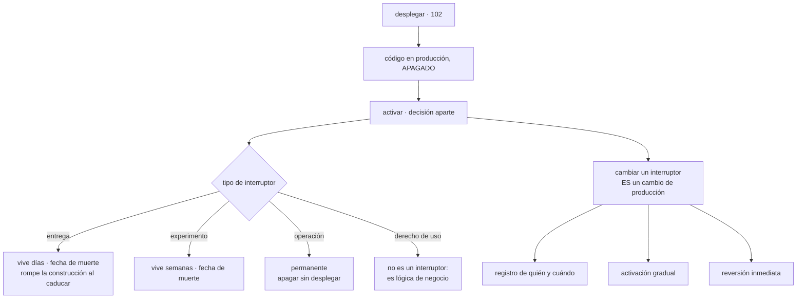

# 105 — Feature flags y separación deploy-release

> [← Clase anterior](../../part-08-continuous-delivery-platform-engineering/104-ambientes-efimeros-y-promocion-entre-entornos/README.md) · [Índice de la parte](../README.md) · [Clase siguiente →](../../part-08-continuous-delivery-platform-engineering/106-platform-engineering-e-internal-developer-platform/README.md)

**Parte:** 08 — Entrega continua y platform engineering<br>
**Nivel:** avanzado · **Horas estimadas:** 4<br>
**Laboratorio:** `delivery` · **Estado:** `EXECUTABLE_CORE`

## 🎯 Propósito

Separar el despliegue de la activación: el código llega a producción apagado y se enciende después, para quien se decida y cuando se decida. Eso resuelve tres problemas que las clases anteriores dejaron abiertos —el cambio grande que no cabe en un incremento pequeño, el defecto que no se puede revertir y la funcionalidad que hay que apagar sin desplegar—. Y trae uno nuevo que hay que mirar de frente: **cada interruptor es un cambio de producción sin canalización, sin revisión y sin registro**, salvo que se le construyan los tres.

## 📚 Resultados de aprendizaje

Al finalizar podrás:

1. **Separar** el despliegue del código de la activación del comportamiento.
2. **Clasificar** cada interruptor por su vida esperada y tratarlo en consecuencia.
3. **Acotar** el coste combinatorio antes de que sea inmanejable.
4. **Aplicar** al cambio de un interruptor los mismos controles que a un despliegue.
5. **Retirar** los interruptores temporales, que es lo que decide si esto funciona a los dos años.

## 🧩 Conceptos centrales

| Concepto | Comprensión verificable |
|---|---|
| `desplegar frente a activar` | Desplegar es poner el código en producción; activar es hacer que su comportamiento ocurra. Los interruptores separan las dos decisiones. |
| `interruptor de entrega` | Oculta un cambio incompleto mientras se construye. Vive días o semanas y **debe morir**. |
| `interruptor de operación` | Apaga una funcionalidad sin desplegar. Es permanente por diseño y es la respuesta al cambio irreversible de la clase 102. |
| `asignación estable` | Que un mismo usuario obtenga siempre la misma variante, derivándola de su identificador. Sin ella, el usuario ve el sistema parpadear. |
| `coste combinatorio` | Con N interruptores independientes hay 2^N caminos posibles y se prueban dos. Es el motivo por el que pocos interruptores simultáneos importan más que ninguna otra práctica. |
| `fecha de muerte` | Plazo tras el cual un interruptor temporal rompe la construcción. Es lo único que impide que el inventario crezca sin techo. |

## 🧠 Modelo mental

Una plataforma interna ofrece capacidades como productos y reduce carga cognitiva mediante caminos dorados, sin quitar autonomía donde importa.

Aplicado a esta clase, separa siempre cuatro planos: **intención** (qué necesita el usuario),
**configuración** (qué declaramos), **estado observado** (qué existe de verdad) y
**evidencia** (cómo sabemos que cumple). Confundirlos produce diseños que se ven correctos
en un diagrama pero fallan al operar.

## 🗺️ Flujo de razonamiento



## 📖 Desarrollo

### 1. Qué compra separar el despliegue de la activación

Hasta aquí, poner código en producción y cambiar el comportamiento de producción eran la misma acción. Separarlas resuelve tres problemas concretos que este programa dejó abiertos:

```text
el incremento que no cabe                    clase 097
  un cambio de tres semanas no se puede integrar a diario
  → se integra a diario, apagado, y se enciende al final

el cambio que no se puede revertir           clase 102
  el punto de no retorno hace inútil volver a la versión anterior
  → un interruptor apaga el comportamiento sin desplegar nada

la activación por audiencia
  → encender para el 1 %, para un país o para los equipos internos
```

Y una consecuencia que cambia la forma de trabajar más que las tres anteriores: **el despliegue deja de ser un evento**. Si el código llega apagado, desplegar es rutina y la decisión de riesgo se toma en otro momento, con otra gente y con posibilidad de deshacerse en segundos.

Y conviene ser claro sobre lo que **no** compra, porque se vende de más:

```text
no sustituye a la estrategia de despliegue de la clase 102
  el código encendido sigue teniendo que llegar de forma escalonada
no sustituye a las pruebas
  un camino apagado no está probado por estar apagado
no hace seguro un cambio incompatible
  si el esquema rompe la convivencia, el interruptor no lo arregla
```

La segunda línea merece una precisión, porque es una fuente de sorpresas: **el código detrás de un interruptor apagado se despliega igual**. Se compila, se carga, se inicializa. Un error de arranque en ese código tumba el servicio aunque la funcionalidad esté apagada.

```text
lo que el interruptor apaga:  la ejecución de una rama
lo que NO apaga:              la carga del módulo, sus dependencias,
                              lo que se inicializa al arrancar
```

Y la técnica que aprovecha esto en el mejor sentido —**lanzamiento a oscuras**— consiste en ejecutar el camino nuevo sin usar su resultado:

```text
se ejecuta la ruta nueva en paralelo con la vieja
se sirve el resultado de la vieja
y se compara: latencia, errores, diferencias de resultado
→ se mide con tráfico real sin exponer a nadie
```

Es lo más cercano a probar en producción sin riesgo, y responde justo lo que el entorno efímero de la clase 104 no puede responder: cómo se comporta con el volumen y la composición reales.

### 2. Cuatro tipos, y solo dos deben morir

Casi todo el desorden de este tema viene de tratar igual cosas que tienen vidas distintas:

```text
ENTREGA            oculta un cambio incompleto
                   vida: días o semanas       debe morir
                   quién lo cambia: el equipo que lo puso

EXPERIMENTO        compara dos variantes con usuarios reales
                   vida: la del experimento   debe morir
                   quién lo cambia: quien diseñó el experimento

OPERACIÓN          apaga una funcionalidad o degrada un servicio
                   vida: permanente           no muere
                   quién lo cambia: quien está de guardia

DERECHO DE USO     qué puede hacer cada cliente según su plan
                   vida: permanente
                   → esto NO es un interruptor: es lógica de negocio
```

La cuarta línea es la que más problemas evita. Los derechos de uso son parte del dominio, se prueban, tienen su propia persistencia y no deben vivir en el mismo sistema que los interruptores temporales: si viven ahí, nadie puede limpiar nada porque el inventario mezcla lo desechable con lo permanente.

Y los de operación son los que este programa lleva pidiendo desde la clase 102:

```text
apagar la funcionalidad que causó el incidente, sin desplegar
degradar: servir del caché, saltarse el enriquecimiento, desactivar
          las recomendaciones cuando su servicio está caído
cortar el tráfico a un proveedor externo que está fallando
```

Y los de operación tienen un requisito que los demás no tienen, y es el que decide si sirven durante un incidente:

```text
tienen que funcionar cuando el sistema está mal
→ evaluación local, con el último valor conocido en memoria
→ un interruptor que necesita consultar un servicio remoto
  para apagarse es inútil justo cuando hace falta
```

Y el valor por defecto se elige con ese criterio: **si el sistema de interruptores no responde, cada uno debe caer al valor seguro**, que para uno de entrega es apagado y para uno de operación suele ser encendido.

Y la consecuencia organizativa que hace falta escribir: **quién puede cambiar cada tipo**. Un interruptor de operación que cualquiera puede tocar es una puerta abierta a producción; uno de entrega que solo puede tocar una persona concreta es un cuello de botella.

### 3. El coste que crece solo

Con N interruptores independientes hay 2^N combinaciones de estado, y se prueban una o dos:

```text
 5 interruptores      32 combinaciones
10                 1.024
20             1.048.576
```

Y lo que hace daño no es el número total, sino **cuántos están a la vez en un estado distinto entre entornos**:

```text
en preproducción todo encendido y en producción algunos apagados
→ lo que se probó no es lo que corre
```

Esa es la forma en que un interruptor rompe la garantía de la clase 099: el artefacto es el mismo, pero el comportamiento no.

Las tres reglas que acotan el coste, en orden de eficacia:

```text
1. pocos simultáneos     un límite explícito por servicio, y se vigila
2. independientes        si dos interruptores interactúan, es un defecto
                         de diseño, no una combinación que probar
3. vida corta            la mayor parte del inventario debe ser temporal
```

Y la comprobación mínima que sí es viable, en vez de intentar probar 2^N:

```text
probar el estado de producción                 siempre
probar el estado que se va a activar            siempre
probar cada interruptor encendido y apagado    por separado
no probar combinaciones                        salvo las que interactúan,
                                               que no deberían existir
```

Y una regla de higiene que evita la mitad de los problemas de diagnóstico: **el estado de los interruptores forma parte del contexto de cada petición**. Si un registro de error no dice qué variantes estaban activas, reproducirlo es adivinar.

```json
{"nivel":"error","traza":"a91c…","ruta":"/checkout",
 "interruptores":{"pago-nuevo":true,"envio-express":false}}
```

Y **la asignación estable**, que es un fallo clásico y muy visible para el usuario: si la variante se decide al azar en cada petición, la misma persona ve el sistema cambiar entre pantallas. Se deriva del identificador:

```python
variante = "nueva" if hash_estable(id_usuario, nombre_interruptor) % 100 < porcentaje else "vieja"
```

Y el segundo argumento importa: incluir el nombre del interruptor evita que los mismos usuarios caigan siempre en el grupo de prueba de todos los experimentos.

### 4. Un cambio de interruptor es un cambio de producción

Aquí está el problema nuevo, y es serio. Toda la parte 08 ha construido controles alrededor del despliegue: revisión, puertas, artefacto firmado, canario, registro. Cambiar un interruptor **no pasa por nada de eso**.

```text
desplegar          revisión, puertas, canario, registro, reversión
cambiar un valor   un clic
```

Y el efecto en producción puede ser mayor. La consecuencia práctica es que hay que reconstruir los cuatro controles imprescindibles sobre el sistema de interruptores:

```text
1. REGISTRO      quién, cuándo, valor anterior y nuevo, y por qué
                 → es la primera pregunta de cualquier incidente
2. GRADUAL       1 % → 10 % → 50 % → 100 %, no de 0 a 100
                 → es la clase 102 aplicada a la activación
3. REVERSIÓN     volver al valor anterior en un clic, sin aprobación
4. PERMISOS      quién puede tocar qué, por tipo y por entorno
```

Y una pregunta que conviene responder pronto: **si el interruptor está en un repositorio, ¿lo revierte el bucle de la clase 103?** Las dos opciones y su compromiso:

```text
interruptores en el repositorio    revisados y con historial, y lentos
                                   → sirven para los de entrega
interruptores en un servicio       inmediatos, y fuera del bucle
                                   → imprescindible para los de operación
```

Y si conviven las dos cosas, hay que declarar cuál manda para que el bucle no revierta un apagado de emergencia.

**La retirada**, que es lo que decide si esto sigue siendo manejable a los dos años. Un interruptor de entrega que nadie quita se convierte en una rama muerta que sigue evaluándose, y en un camino que nadie prueba.

```text
al crear un interruptor temporal se fija su fecha de muerte
al pasar la fecha, la construcción falla
y quitarlo es una confirmación que borra la rama muerta, no solo el valor
```

La última línea es la que se olvida: **apagar el interruptor no es retirarlo**. Mientras el código de las dos ramas siga ahí, el coste combinatorio sigue ahí.

Y lo que se vigila:

```text
interruptores vivos, por tipo
temporales por encima de su fecha
edad del más antiguo
interruptores que llevan meses en el mismo valor       ← candidatos a retirar
interruptores que no se evalúan nunca                  ← código muerto
```

Y la lista de comprobación de la clase:

```text
☐ cada interruptor está clasificado por tipo y vida esperada
☐ los derechos de uso no viven en el sistema de interruptores
☐ los de operación se evalúan localmente y funcionan con el sistema caído
☐ cada uno tiene un valor por defecto seguro si no hay respuesta
☐ la asignación de variante es estable por usuario y por interruptor
☐ el estado de los interruptores está en el contexto de los registros
☐ hay límite explícito de interruptores simultáneos por servicio
☐ cambiar un valor deja registro de quién, cuándo y por qué
☐ la activación es gradual y la reversión no requiere aprobación
☐ los temporales tienen fecha de muerte que rompe la construcción
☐ retirar significa borrar la rama muerta, no solo apagar el valor
```

Y el cierre que enlaza con la clase siguiente: las nueve clases de esta parte han añadido canalización, puertas, firma, bucle, entornos e interruptores. Cada equipo no puede construir todo eso por su cuenta, y que cada uno lo construya distinto es peor que no tenerlo. Quién lo mantiene y cómo se ofrece es la materia de la clase 106.

## 🔬 Ejemplo trabajado

**CloudShop introduce interruptores para resolver dos problemas concretos: un rediseño del pago que lleva cinco semanas sin poder integrarse y el incidente C de la clase 102, que no se pudo revertir. A los dieciocho meses, el inventario es el que enseña la lección.**

**Los dos problemas iniciales.**

El rediseño del pago se integraba en una rama larga —justo lo que la clase 097 dijo que no—:

```text                                    rama larga    con interruptor
vida de la rama                          35 días          < 1 día
conflictos al fusionar                   211 líneas          0
integraciones a la principal            1 en 5 semanas   4 al día
```

Y el incidente C —pedidos duplicados, dos horas y cuarenta minutos, irreversible— se reprodujo en un ensayo con un interruptor de operación delante:

```text                                    sin interruptor   con interruptor
detección                                    2 h 40             4 min
parar el daño                              no se pudo        11 s
pedidos duplicados                            1.847              23
```

Once segundos frente a «no se pudo». Es la respuesta que la clase 102 no tenía para un cambio pasado el punto de no retorno.

**El inventario a los dieciocho meses.**

```text
interruptores vivos                                        147
  de entrega                                                71
  de experimento                                            18
  de operación                                              22
  derechos de uso                                           36
```

Y al mirar los 71 de entrega:

```text
por encima de su fecha prevista                             58
en el mismo valor desde hace más de 6 meses                 44
que no se evalúan nunca (el código ya no los consulta)      12
el más antiguo                                          29 meses
```

Cuarenta y cuatro interruptores encendidos al 100 % desde hace medio año: **no son interruptores, son ramas muertas que siguen evaluándose**. Y doce que ni siquiera se consultan.

**El incidente que lo puso en evidencia.**

```text
síntoma      el 3 % de los pedidos con el importe de envío mal calculado
duración     9 días hasta detectarlo
causa        dos interruptores que interactuaban:
             «envío-express» encendido y «tarifas-v2» apagado
             una combinación que no se había probado nunca
```

Y la pregunta del apartado tercero, respondida con datos:

```text
interruptores en ese servicio                    19
combinaciones posibles                      524.288
combinaciones probadas                            2
combinaciones vividas en producción              31
```

Y lo que costó reproducirlo: los registros de error **no decían qué variantes estaban activas**. Tres días de los nueve se fueron en eso. Se añadió el estado al contexto de la petición, y el siguiente caso parecido se diagnosticó en veinte minutos.

**La limpieza, y lo que reveló.**

Se fijó fecha de muerte para todo lo temporal y se rompió la construcción al pasarla. Retirar significaba **borrar la rama muerta**, no apagar el valor:

```text                                    inicio    +3 meses   +6 meses
interruptores de entrega                    71          38         9
líneas de código eliminadas                  —      4.100     7.350
defectos encontrados al retirar              —          6         9
```

Los quince defectos son el hallazgo interesante: aparecieron al borrar la rama vieja y descubrir que **la rama nueva nunca había manejado un caso que la vieja sí manejaba**. Estaba oculto porque el camino viejo seguía cubriéndolo para una parte del tráfico.

Y los treinta y seis derechos de uso se sacaron del sistema de interruptores y se llevaron al dominio, con sus pruebas:

```text                                    antes            después
dónde viven                       sistema de interruptores   modelo de datos
quién los puede cambiar           cualquiera con acceso      proceso comercial
cubiertos por pruebas                     no                     sí
inventario a limpiar                     147                     93
```

**El cambio de interruptor como cambio de producción.**

Dos meses después de empezar hubo un incidente causado no por un despliegue, sino por un valor:

```text
alguien activó «recomendaciones-v3» al 100 % directamente
latencia del percentil 99: de 240 ms a 3,1 s
tiempo hasta que alguien supo QUIÉN lo había cambiado: 35 min
```

Los treinta y cinco minutos son el argumento del apartado cuarto. Se añadieron los cuatro controles:

```text                                          antes         después
registro de quién, cuándo y por qué             no             sí
activación gradual obligatoria                  no        1-10-50-100
reversión en un clic, sin aprobación            sí             sí
permisos por tipo y entorno                     no             sí

tiempo medio hasta identificar un cambio    35 min         inmediato
incidentes causados por un valor          3 / trimestre   0-1 / trimestre
```

**A los seis meses de la limpieza.**

```text                                          antes         después
interruptores vivos                            147             31
  temporales por encima de su fecha             58              0
  que no se evalúan nunca                       12              0
edad del más antiguo                       29 meses        6 semanas
límite por servicio                         no había     5, vigilado
defectos por combinación de interruptores    1 / 9 días         0
registros con estado de interruptores           no             sí
cambios de valor con registro y gradualidad     no             sí
ramas largas de más de una semana                3              0
```

**La lección que esta clase traslada al resto de la parte 08**: los interruptores hicieron lo prometido —la rama de cinco semanas pasó a integrarse cuatro veces al día, y el incidente irreversible se paró en once segundos—, y a cambio crearon un inventario de ciento cuarenta y siete elementos que nadie gobernaba. **Cuarenta y cuatro llevaban medio año en el mismo valor**: eso no es un interruptor, es una rama muerta que se evalúa en cada petición. Y el mecanismo que lo arregló fue el mismo que este programa lleva usando desde la clase 046 para las excepciones: **una fecha que rompe la construcción**.

## 🧪 Laboratorio guiado

Ejecuta desde la raíz:

```bash
python classes/part-08-continuous-delivery-platform-engineering/105-feature-flags-y-separacion-deploy-release/lab.py
```

El laboratorio selecciona el motor de práctica **`delivery`** y produce
`lab_result.json`. El escenario, sus comprobaciones y el artefacto esperado corresponden a
esta clase; no requiere credenciales y deja explícito qué debe revalidarse en un sandbox real.

1. Lee `exercise.steps` y formula una predicción antes de ejecutar.
2. Ejecuta la práctica y verifica todos los elementos de `checks`.
3. Provoca el caso de `negative_test` y explica la señal observada.
4. Materializa `plan-feature-flags` en `evidence/` usando la plantilla indicada.
5. Para proveedor real, sigue `sandbox.requires`, registra costo y ejecuta `destroy`.

### Evidencia esperada

El artefacto principal es un pipeline con gates, promoción y rollback. Además, la entrega debe incluir el comando ejecutado,
la salida estructurada y una conclusión que no exceda lo observado.

## 🏆 Reto verificable

Construye **`plan-feature-flags`** para el caso CloudShop. Incluye una alternativa descartada,
un supuesto que pueda falsarse, una prueba de fallo y una decisión de rollback.

## ✅ Criterio de aceptación

- [ ] `lab.py` termina con código 0 y genera JSON válido.
- [ ] La entrega conecta al menos tres requisitos con mecanismos verificables.
- [ ] Existe una prueba positiva y una prueba negativa con evidencia.
- [ ] Seguridad, costo y operación aparecen como decisiones, no como anexos.
- [ ] Se declara una limitación y una condición que obligaría a revisar el diseño.
- [ ] Otra persona puede repetir el recorrido sin conocimiento tácito.

## ⚠️ Errores frecuentes

| Síntoma | Causa probable | Corrección |
|---|---|---|
| El inventario de interruptores crece y nadie sabe cuáles se pueden quitar | Los temporales no tienen fecha de muerte y conviven con los permanentes | Clasifica por tipo, saca los derechos de uso del sistema y pon fecha de muerte que rompa la construcción a los temporales. |
| Un defecto aparece solo con cierta combinación de valores | Interruptores que interactúan; con N hay 2^N caminos y se prueban dos | Limita los simultáneos por servicio y trata la interacción entre dos interruptores como defecto de diseño, no como combinación a probar. |
| Reproducir un error lleva días porque no se sabe qué variantes estaban activas | El estado de los interruptores no forma parte del contexto de la petición | Incluye los interruptores evaluados en los registros y en la traza. |
| El interruptor de emergencia no responde justo durante el incidente | Su evaluación depende de consultar un servicio remoto que también está afectado | Evaluación local con el último valor conocido y valor por defecto seguro cuando no hay respuesta. |
| Un mismo usuario ve la interfaz cambiar entre pantallas | La variante se sortea en cada petición en vez de derivarse del usuario | Asignación estable a partir del identificador de usuario y del nombre del interruptor. |
| Un cambio de valor causa un incidente y nadie sabe quién lo hizo | Cambiar un interruptor es un cambio de producción sin ninguno de los controles del despliegue | Registro de quién, cuándo y por qué; activación gradual; reversión inmediata; y permisos por tipo y entorno. |

## 🛡️ Seguridad, ética y costo

Trabaja con cuentas propias o sandboxes autorizados. No publiques secretos, identificadores
reales ni datos personales. Antes de crear recursos pagos define presupuesto, etiquetas y
comando de destrucción; después verifica que no queden recursos huérfanos. Los ejemplos
locales enseñan contratos, pero no certifican cumplimiento ni disponibilidad de producción.

## ❓ Preguntas de comprobación

1. ¿Qué tres problemas de clases anteriores resuelve separar el despliegue de la activación?
2. ¿Qué cuatro tipos de interruptor hay y cuáles deben morir?
3. ¿Por qué un interruptor de operación debe evaluarse localmente?
4. ¿Por qué apagar un interruptor no es lo mismo que retirarlo?
5. ¿Qué cuatro controles del despliegue hay que reconstruir sobre el cambio de un valor?

## 🔗 Referencias

- Hodgson, P. (2025). *Feature toggles: types and lifecycle* — clasificación por vida esperada y coste de mantenimiento. <https://martinfowler.com/articles/feature-toggles.html>
- Humble, J. y Farley, D. (2010). *Continuous Delivery*, cap. 13 — separar despliegue de activación y lanzamiento a oscuras. <https://www.oreilly.com/library/view/continuous-delivery-reliable/9780321670250/>
- OpenFeature (2025). *Specification: evaluation, context and providers* — evaluación local, contexto y valores por defecto. <https://openfeature.dev/specification/>
- Kohavi, R. y otros (2020). *Trustworthy Online Controlled Experiments* — asignación estable y validez de los experimentos. <https://experimentguide.com/>
- Google SRE (2025). *Graceful degradation* — apagar y degradar como respuesta operativa durante un incidente. <https://sre.google/workbook/managing-load/>
- Documentación oficial vigente del servicio implementado; registra URL y fecha de consulta.

---

> [Evaluación](assessment.md) · [Contrato de clase](lesson.yaml) · [Índice de la parte](../README.md)
