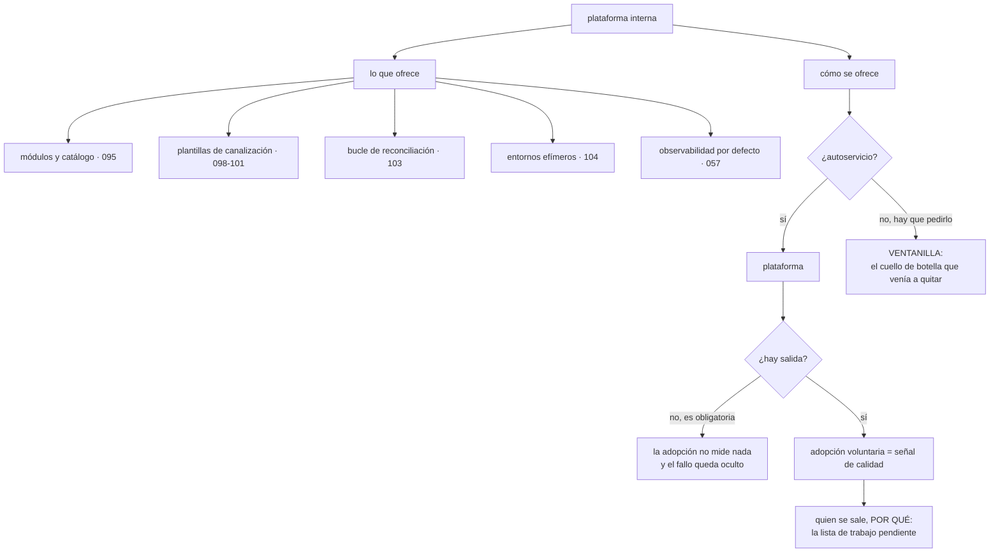

# 106 — Platform engineering e Internal Developer Platform

> [← 105 · Feature flags y separación deploy-release](../../part-08-continuous-delivery-platform-engineering/105-feature-flags-y-separacion-deploy-release/README.md) · [Índice de la parte](../README.md) · [107 · Developer experience, DORA y carga cognitiva →](../../part-08-continuous-delivery-platform-engineering/107-developer-experience-dora-y-carga-cognitiva/README.md)

**Parte:** 08 — Entrega continua y platform engineering<br>
**Nivel:** avanzado · **Horas estimadas:** 4<br>
**Laboratorio:** `platform` · **Estado:** `EXECUTABLE_CORE`

## 🎯 Propósito

Decidir quién mantiene todo lo que las clases 073 a 105 han ido acumulando —módulos, plantillas de canalización, puertas, bucle de reconciliación, entornos, interruptores— y cómo se ofrece a quince equipos sin que cada uno lo construya distinto ni tenga que pedirlo por ventanilla. La clase trata la plataforma interna como un producto con usuarios, y defiende una medida incómoda de su éxito: **la proporción que la usa sin estar obligada**.

## 📚 Resultados de aprendizaje

Al finalizar podrás:

1. **Distinguir** una plataforma de una ventanilla de peticiones y de una colección de herramientas.
2. **Inventariar** qué ofrece la plataforma y qué sigue siendo del equipo de producto.
3. **Diseñar** el camino asfaltado con su salida, para que sea camino y no jaula.
4. **Medir** la adopción voluntaria y usarla como señal de calidad del producto.
5. **Versionar** la plataforma sin romper a quien la consume.

## 🧩 Conceptos centrales

| Concepto | Comprensión verificable |
|---|---|
| `plataforma interna` | Producto cuyos usuarios son los equipos de la organización. Se mide por adopción y por tiempo ahorrado, no por número de componentes. |
| `camino asfaltado` | La forma respaldada de hacer algo: más rápida y con las decisiones difíciles ya tomadas. Su valor está en que ahorra trabajo, no en que sea obligatoria. |
| `salida` | Posibilidad explícita de dejar el camino asfaltado sin pedir permiso. Sin ella la adopción deja de significar nada. |
| `ventanilla` | Modo de fallo en el que la plataforma es un equipo al que se le piden cosas. Convierte a la plataforma en el cuello de botella que venía a eliminar. |
| `autoservicio` | El equipo obtiene lo que necesita sin intervención humana. Es la diferencia entre plataforma y ventanilla. |
| `contrato de la plataforma` | Qué versiones se soportan, cuánto duran y con cuánto aviso se retiran. Sin él, cada mejora de la plataforma es una interrupción para quince equipos. |

## 🧠 Modelo mental

Una plataforma interna ofrece capacidades como productos y reduce carga cognitiva mediante caminos dorados, sin quitar autonomía donde importa.

Aplicado a esta clase, separa siempre cuatro planos: **intención** (qué necesita el usuario),
**configuración** (qué declaramos), **estado observado** (qué existe de verdad) y
**evidencia** (cómo sabemos que cumple). Confundirlos produce diseños que se ven correctos
en un diagrama pero fallan al operar.

## 🗺️ Flujo de razonamiento



## 📖 Desarrollo

### 1. Qué es y qué no es

Al final de las partes 06, 07 y 08 hay un inventario considerable de cosas que funcionan. El problema no es técnico: es que **quince equipos no pueden mantener quince copias de todo eso**, y que cada uno lo haga distinto es peor que no tenerlo, porque impide cualquier mejora transversal.

Lo que una plataforma no es, con sus tres modos de fallo:

```text
VENTANILLA
  un equipo al que se le piden entornos, permisos y despliegues
  → es el cuello de botella que la nube vino a eliminar
  → y su síntoma es que la métrica que se enseña es «tickets cerrados»

COLECCIÓN DE HERRAMIENTAS
  catorce productos comprados y ninguna integración
  → el equipo sigue teniendo que juntarlos

PLATAFORMA VACÍA
  se construyó lo que el equipo de plataforma quiso construir
  → nadie la usa, y la respuesta es hacerla obligatoria
```

Y lo que sí es, en una frase que se puede comprobar: **el equipo consigue lo que necesita sin hablar con nadie**.

```text
crear un servicio nuevo con canalización, entorno y observabilidad
  ventanilla     ticket, 6 días
  plataforma     un comando, 20 minutos
```

Y el inventario concreto de lo que este programa ya ha construido y que la plataforma ofrece:

```text
módulos de infraestructura versionados            clases 085, 086
catálogo de servicios con dueño                   clase 095
caminos asfaltados por tipo de servicio           clase 096
plantillas de canalización con puertas            clases 097-101
firma, inventario y verificación                  clases 067, 101
bucle de reconciliación y repositorio de entorno  clase 103
entornos efímeros por cambio                      clase 104
sistema de interruptores                          clase 105
observabilidad, paneles y alertas por defecto     clases 056, 057
```

Y lo que **no** es de la plataforma, que hay que escribir para que la frontera no se discuta cada semana:

```text
el código del servicio
sus pruebas
su presupuesto de error y su guardia
sus decisiones de arquitectura
las alertas específicas de su dominio
```

La tercera línea es la que más se intenta empujar hacia la plataforma, y es la que menos debe moverse: **quien opera lo que construye es quien puede arreglarlo**.

### 2. Camino asfaltado, no jaula

El camino asfaltado de la clase 096 funcionaba por una razón concreta: era **más rápido** que hacerlo a mano. No porque estuviera prohibido lo demás.

Y esa distinción decide todo lo que sigue:

```text
CAMINO         se elige porque ahorra trabajo
               si nadie lo elige, la plataforma tiene un defecto

JAULA          se impone
               si nadie lo elegiría, no hay forma de saberlo
```

Y la consecuencia incómoda: **una plataforma obligatoria oculta su propio fracaso**. La adopción es del 100 % por definición, y las quejas se interpretan como resistencia al cambio.

Por eso hace falta la salida, y hace falta que sea explícita:

```text
un equipo puede no usar el camino asfaltado
  sin pedir permiso
  asumiendo lo que el camino le daba: puertas, observabilidad, cumplimiento
  y declarándolo en el catálogo, para que se sepa
```

Y lo que se hace con esa información es lo que convierte la salida en una herramienta de producto:

```text
quien se salió, y por qué
→ esa lista ES el trabajo pendiente de la plataforma
```

Y hay dos cosas que sí son obligatorias, y conviene separarlas claramente de lo que es camino:

```text
OBLIGATORIO      lo que protege a la organización, no lo que la acelera
  identidad federada, sin claves de larga duración (clase 098)
  cifrado y registro de auditoría (clases 046, 054)
  firma verificada en admisión (clases 067, 101)

CAMINO           todo lo demás
```

La regla que ordena la frontera: **se impone el control, no la herramienta**. Un equipo puede usar otra canalización; lo que no puede es desplegar sin firma verificada.

Y una advertencia sobre la métrica, porque es fácil engañarse: **contar equipos que usan la plataforma no dice nada si no se cuenta también el trabajo que les ahorra**.

```text
adopción voluntaria del camino, por tipo de servicio
tiempo desde «quiero un servicio nuevo» hasta «funcionando en dev»
proporción del trabajo del equipo dedicada a infraestructura
equipos que se salieron, y su motivo
```

La tercera es la que justifica la existencia de la plataforma ante quien paga.

### 3. La interfaz, y lo que hay debajo

La plataforma se ofrece de tres formas, y conviene que sean tres vistas de lo mismo:

```text
línea de comandos     lo que usa quien desarrolla a diario
portal                lo que usa quien busca, descubre o no lo usa a diario
API                   lo que usa la automatización
```

Y la regla que evita el error más caro de este tema: **lo que hay debajo tiene que ser usable directamente**.

```text
mal   el portal es la única forma de crear un servicio
      → cuando el portal falla o falta un campo, nadie puede hacer nada

bien  el portal escribe una confirmación en un repositorio
      → y esa confirmación se puede escribir a mano
```

Es la misma lógica que la clase 103 impuso al bucle: lo declarado es la verdad, y la interfaz es una comodidad encima.

Y el catálogo de la clase 095 es lo que hace que el portal sirva para algo más que crear cosas:

```text
qué servicios existen y de quién son
qué versión de qué módulo usa cada uno
qué está fuera del camino asfaltado, y por qué
qué versiones de plataforma están por retirarse
cómo se pide guardia, cómo se escala, dónde está el manual
```

**El contrato de la plataforma**, que es lo que decide si las mejoras son bienvenidas o temidas. Los equipos consumen versiones —de módulos, de plantillas, de imágenes base—, y cada cambio incompatible es una interrupción multiplicada por quince.

```text
versiones soportadas a la vez                          2
aviso antes de retirar una versión                90 días
cambio incompatible                        versión mayor, nunca en sitio
migración                                  con herramienta, no con documento
```

La última línea es la que más adopción compra: **si la plataforma pide migrar, la plataforma escribe la migración**. Un documento de doce pasos multiplicado por quince equipos es trabajo que la plataforma está externalizando a sus usuarios.

Y el tamaño, porque es la pregunta que siempre aparece. Como orden de magnitud observado, y no como regla:

```text
plataforma pequeña      3-5 personas para 10-20 equipos de producto
por debajo de eso       no puede mantener lo que ofrece, y vuelve a ventanilla
por encima sin demanda  construye lo que nadie pidió
```

Y la señal de que el tamaño está mal en la dirección peligrosa: **la proporción del tiempo del equipo de plataforma dedicada a atender peticiones**. Si pasa de un tercio, la plataforma se está convirtiendo en ventanilla.

### 4. Tratarla como producto

Lo que separa una plataforma que se usa de una que se impone es que la primera se gestiona como producto. Y eso significa cuatro cosas concretas:

```text
1. TIENE USUARIOS y se les pregunta
   entrevistas, no encuestas de satisfacción
   observar a alguien creando un servicio nuevo enseña más que veinte respuestas

2. TIENE TRABAJO PENDIENTE priorizado por valor
   y el motivo de cada salida entra en esa lista

3. TIENE DOCUMENTACIÓN que es parte del producto
   si el camino asfaltado necesita que alguien lo explique, no está asfaltado

4. TIENE MEDIDAS de uso y de ahorro
   y se publican, incluidas las malas
```

Y los tres antipatrones que aparecen cuando falta lo anterior:

```text
la plataforma como impuesto        se cobra y no se elige
la plataforma como museo           componentes que nadie usa y nadie retira
la plataforma como reescritura     cada 18 meses se tira y se empieza de nuevo
```

El segundo se corrige con la misma disciplina que la clase 105 aplicó a los interruptores: **medir qué se usa y retirar lo que no**.

Y una tensión que conviene nombrar porque no tiene solución limpia: la plataforma quiere estandarizar y los equipos quieren libertad. La forma de resolverla que este programa ha usado sistemáticamente es la de la clase 096:

```text
estandarizar lo que nadie quiere decidir
  registro, cifrado, red, identidad, empaquetado
dejar libre lo que diferencia
  lenguaje, marco de trabajo, modelo de datos, arquitectura interna
```

Y la lista de comprobación de la clase:

```text
☐ el equipo consigue lo que necesita sin abrir un ticket
☐ está escrito qué es de la plataforma y qué es del equipo de producto
☐ el camino asfaltado es más rápido que hacerlo a mano, y se mide
☐ existe salida explícita, sin pedir permiso, y se declara en el catálogo
☐ el motivo de cada salida entra en el trabajo pendiente de la plataforma
☐ lo obligatorio son controles, no herramientas
☐ lo que hay debajo de la interfaz es usable directamente
☐ hay contrato de versiones: cuántas se soportan y con cuánto aviso se retiran
☐ cuando la plataforma pide migrar, la plataforma escribe la migración
☐ se vigila qué proporción del tiempo se va en atender peticiones
☐ se retira lo que nadie usa
```

Y el cierre que enlaza con la clase siguiente: todo lo anterior se justifica con una promesa —que entregar sea más rápido y más seguro—. Comprobar si esa promesa se cumple exige medir, y las medidas que se suelen usar tienen trampas conocidas. Es la materia de la clase 107.

## 🔬 Ejemplo trabajado

**CloudShop crea un equipo de plataforma de cuatro personas para quince equipos de producto. El primer año tiene dos fases claramente separadas por una decisión, y la decisión es la que da la lección.**

**Fase 1, meses 1 a 5: ventanilla.**

El equipo se formó con quienes ya hacían la infraestructura, y siguieron haciendo lo mismo con otro nombre:

```text
peticiones atendidas al mes                        118
tiempo medio de atención                        4,5 días
proporción del tiempo del equipo en peticiones     84 %
componentes reutilizables construidos                2
tiempo desde «quiero un servicio» hasta dev      6 días
```

Ochenta y cuatro por ciento en peticiones. El indicador que el apartado tercero señala —un tercio— estaba más que duplicado, y la consecuencia era previsible: **no quedaba tiempo para construir la plataforma**.

Y el catálogo de peticiones enseñaba lo que había que automatizar:

```text
crear un servicio nuevo con lo básico              41 %
dar acceso a algo                                  23 %
crear un entorno o una base de datos               19 %
dudas sobre cómo hacer algo                        11 %
otras                                               6 %
```

El 83 % de las peticiones eran las mismas tres cosas, una y otra vez.

**La decisión: dejar de atender para poder automatizar.**

Se congelaron las peticiones de los tres tipos principales durante seis semanas y se construyó el autoservicio. Fue impopular, y se midió:

```text                                  antes de congelar   después
crear un servicio nuevo                    4,5 días         22 min
dar acceso                                 2 días           inmediato
                                                    (grupos del catálogo)
crear entorno de datos                     6 días           14 min
peticiones al mes                            118              19
proporción del tiempo en peticiones          84 %            21 %
```

**Fase 2: la plataforma como producto, y la salida.**

El camino asfaltado se ofreció sin obligar, con la salida declarada. A los tres meses:

```text
servicios en el camino asfaltado             11 de 15
servicios fuera, con salida declarada          4 de 15
```

Y los cuatro motivos, que es lo que valía la información:

```text
servicio de análisis    necesita una imagen base con bibliotecas científicas
                        que el camino no ofrecía
motor de precios        necesita despliegue en dos regiones activas y el
                        camino solo hacía una
portal antiguo          no está en contenedor y no lo va a estar
integraciones           usa una canalización distinta por requisito de un cliente
```

Los dos primeros entraron en el trabajo pendiente y se resolvieron; sus equipos volvieron al camino sin que nadie se lo pidiera. El tercero no se va a resolver nunca y está bien que sea así. El cuarto reveló algo distinto: **usaba otra canalización y aun así cumplía las tres obligaciones** —identidad federada, cifrado, firma verificada—, porque lo obligatorio eran los controles y no la herramienta.

```text                                     mes 3      mes 9
en el camino asfaltado                    11 de 15   14 de 15
salidas por carencia de la plataforma          2          0
salidas legítimas y permanentes                2          1
```

**El error que costó dos meses de confianza: una versión retirada sin aviso.**

```text
semana 22: se publica la versión 2 de la plantilla de canalización
           y se retira la 1 en la misma semana
equipos afectados                                    9
horas de trabajo no planificado                    ~60
equipos que dijeron que volverían a su canalización  3
```

Se escribió el contrato de la plataforma:

```text
dos versiones soportadas a la vez
90 días de aviso antes de retirar
y la plataforma escribe la migración
```

La migración siguiente se hizo con una herramienta que abría el cambio propuesto en cada repositorio:

```text                                   sin herramienta    con herramienta
horas de trabajo por equipo                  6,5              0,4
equipos migrados en plazo                    5 de 9           9 de 9
quejas                                          9                0
```

**Lo que costó y lo que ahorró, al año.**

```text
coste del equipo de plataforma           4 personas
tiempo ahorrado a los equipos de producto
  creación de servicios (28 al año)      28 × 4,3 días  ≈ 120 días
  accesos y entornos                                    ≈  95 días
  migraciones con herramienta                           ≈  55 días
  incidentes evitados por puertas y bucle               no cuantificado
total estimado                                         ≈ 270 días-persona
```

Y la medida que el apartado segundo señala como la que justifica la existencia:

```text                                          antes         después
proporción del trabajo de un equipo de producto
dedicada a infraestructura                    31 %            9 %
```

**Al año.**

```text                                          antes         después
peticiones al mes                              118             19
tiempo del equipo de plataforma en peticiones   84 %           21 %
crear un servicio nuevo hasta dev            6 días         22 min
adopción voluntaria del camino                  —          14 de 15
salidas por carencia                            —              0
contrato de versiones                        no había       2 y 90 días
migraciones con herramienta                  0 de 2         3 de 3
componentes retirados por falta de uso          —              5
```

**La lección que esta clase traslada al resto de la parte 08**: la fase 1 y la fase 2 tenían el mismo equipo, el mismo presupuesto y las mismas herramientas. Lo que cambió fue **dejar de atender peticiones durante seis semanas**, que es lo único que permitía construir lo que las eliminaba. Y la información más valiosa del año no la dio la adopción, sino su contrario: **los cuatro equipos que se salieron señalaron dos carencias reales, una decisión permanente correcta y un caso que demostró que lo obligatorio deben ser los controles y no las herramientas**.

## 🧪 Laboratorio guiado

Ejecuta desde la raíz:

```bash
python classes/part-08-continuous-delivery-platform-engineering/106-platform-engineering-e-internal-developer-platform/lab.py
```

El laboratorio selecciona el motor de práctica **`platform`** y produce
`lab_result.json`. El escenario, sus comprobaciones y el artefacto esperado corresponden a
esta clase; no requiere credenciales y deja explícito qué debe revalidarse en un sandbox real.

1. Lee `exercise.steps` y formula una predicción antes de ejecutar.
2. Ejecuta la práctica y verifica todos los elementos de `checks`.
3. Provoca el caso de `negative_test` y explica la señal observada.
4. Materializa `mapa-capacidades-plataforma` en `evidence/` usando la plantilla indicada.
5. Para proveedor real, sigue `sandbox.requires`, registra costo y ejecuta `destroy`.

### Evidencia esperada

El artefacto principal es una capacidad autoservicio con contrato y golden path. Además, la entrega debe incluir el comando ejecutado,
la salida estructurada y una conclusión que no exceda lo observado.

## 🏆 Reto verificable

Construye **`mapa-capacidades-plataforma`** para el caso CloudShop. Incluye una alternativa descartada,
un supuesto que pueda falsarse, una prueba de fallo y una decisión de rollback.

## ✅ Criterio de aceptación

- [ ] `lab.py` termina con código 0 y genera JSON válido.
- [ ] La entrega conecta al menos tres requisitos con mecanismos verificables.
- [ ] Existe una prueba positiva y una prueba negativa con evidencia.
- [ ] Seguridad, costo y operación aparecen como decisiones, no como anexos.
- [ ] Se declara una limitación y una condición que obligaría a revisar el diseño.
- [ ] Otra persona puede repetir el recorrido sin conocimiento tácito.

## ⚠️ Errores frecuentes

| Síntoma | Causa probable | Corrección |
|---|---|---|
| El equipo de plataforma no tiene tiempo de construir nada | Está atendiendo peticiones; es una ventanilla con otro nombre | Clasifica las peticiones, congela los tipos más repetidos y automatízalos; vigila que la atención no pase de un tercio del tiempo. |
| La adopción es del 100 % y las quejas son constantes | La plataforma es obligatoria, así que su fracaso no puede medirse | Ofrece salida explícita sin pedir permiso y trata cada motivo de salida como trabajo pendiente del producto. |
| Cada mejora de la plataforma interrumpe a quince equipos | No hay contrato de versiones ni aviso de retirada | Soporta dos versiones, avisa con antelación y escribe tú la herramienta de migración. |
| Cuando el portal falla, nadie puede hacer nada | La interfaz es la única forma de operar y lo que hay debajo no es usable | Que el portal escriba en el repositorio y que esa confirmación se pueda escribir a mano. |
| Se construyeron componentes que nadie usa | Se priorizó por criterio del equipo de plataforma, no por demanda | Observa a los usuarios trabajando, prioriza por lo que aparece en las peticiones y retira lo que no se usa. |
| Los equipos discuten cada semana qué es responsabilidad de quién | La frontera entre plataforma y producto no está escrita | Escribe el inventario de lo que ofrece la plataforma y la lista de lo que no; mantén la guardia del servicio en el equipo que lo construye. |

## 🛡️ Seguridad, ética y costo

Trabaja con cuentas propias o sandboxes autorizados. No publiques secretos, identificadores
reales ni datos personales. Antes de crear recursos pagos define presupuesto, etiquetas y
comando de destrucción; después verifica que no queden recursos huérfanos. Los ejemplos
locales enseñan contratos, pero no certifican cumplimiento ni disponibilidad de producción.

## ❓ Preguntas de comprobación

1. ¿Qué distingue una plataforma de una ventanilla de peticiones?
2. ¿Por qué una plataforma obligatoria oculta su propio fracaso?
3. ¿Qué debe ser obligatorio y qué debe ser camino?
4. ¿Por qué lo que hay debajo de la interfaz tiene que ser usable directamente?
5. ¿Qué contiene el contrato de versiones de la plataforma y por qué la migración la escribe la plataforma?

## 🔗 Referencias

- Skelton, M. y Pais, M. (2019). *Team Topologies*, cap. 5 — equipo de plataforma y su relación con los equipos de producto. <https://teamtopologies.com/book>
- CNCF (2025). *Platforms white paper* — plataforma como producto, capacidades e interfaces. <https://tag-app-delivery.cncf.io/whitepapers/platforms/>
- Thoughtworks (2025). *Platform as a product and the paved road* — camino asfaltado, salida y medición de adopción. <https://www.thoughtworks.com/insights/blog/platforms>
- Backstage (2025). *Software catalog and scaffolder* — catálogo, plantillas y autoservicio. <https://backstage.io/docs/features/software-catalog/>
- Google (2025). *Internal developer platforms and golden paths* — estandarizar lo que no diferencia. <https://cloud.google.com/architecture/devops>
- Documentación oficial vigente del servicio implementado; registra URL y fecha de consulta.

---

> [Evaluación](assessment.md) · [Contrato de clase](lesson.yaml) · [Índice de la parte](../README.md)

| Anterior | Índice | Siguiente |
|---|---|---|
| [← 105 · Feature flags y separación deploy-release](../../part-08-continuous-delivery-platform-engineering/105-feature-flags-y-separacion-deploy-release/README.md) | [Parte 08](../README.md) · [Programa](../../README.md) | [107 · Developer experience, DORA y carga cognitiva →](../../part-08-continuous-delivery-platform-engineering/107-developer-experience-dora-y-carga-cognitiva/README.md) |
