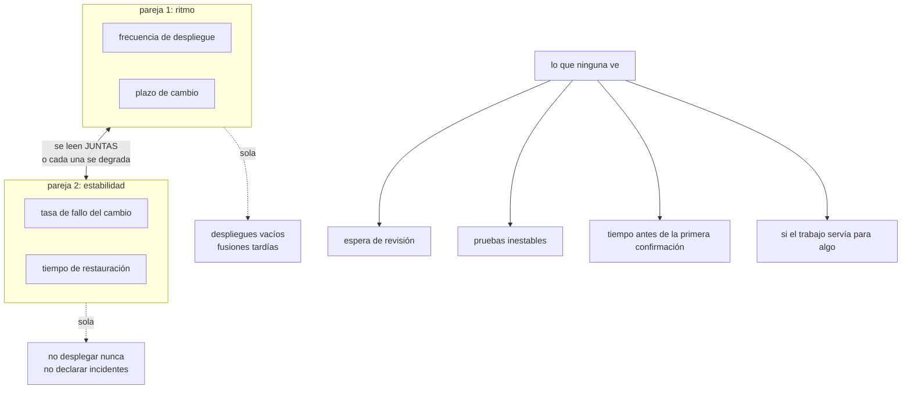

# 107 — Developer experience, DORA y carga cognitiva

> [← 106 · Platform engineering e Internal Developer Platform](../../part-08-continuous-delivery-platform-engineering/106-platform-engineering-e-internal-developer-platform/README.md) · [Índice de la parte](../README.md) · [108 · Proyecto: fábrica de software multi-cloud →](../../part-08-continuous-delivery-platform-engineering/108-proyecto-fabrica-de-software-multi-cloud/README.md)

**Parte:** 08 — Entrega continua y platform engineering<br>
**Nivel:** avanzado · **Horas estimadas:** 4<br>
**Laboratorio:** `metrics` · **Estado:** `EXECUTABLE_CORE`

## 🎯 Propósito

Comprobar si todo lo construido en las partes 07 y 08 cumple su promesa. Las cuatro medidas de entrega son la herramienta habitual, y son útiles **leídas por parejas y como diagnóstico propio de un equipo a lo largo del tiempo**. La clase enseña las cuatro con precisión, demuestra con casos concretos qué pasa cuando se convierten en objetivo, y añade lo que ninguna de las cuatro ve: dónde se va realmente el tiempo de quien desarrolla.

## 📚 Resultados de aprendizaje

Al finalizar podrás:

1. **Definir** las cuatro medidas con precisión, incluido desde dónde se miden.
2. **Leerlas** por parejas, porque cada una sin su contraria se degrada.
3. **Reconocer** cómo se falsea cada una cuando se convierte en objetivo.
4. **Medir** la fricción real, que es donde suele estar la mayor mejora.
5. **Usarlas** como diagnóstico propio y no como comparación entre equipos.

## 🧩 Conceptos centrales

| Concepto | Comprensión verificable |
|---|---|
| `frecuencia de despliegue` | Cada cuánto llega a producción un cambio. Mide la capacidad de entregar en incrementos pequeños. |
| `plazo de cambio` | Tiempo desde que el código se confirma hasta que está en producción. No incluye lo anterior a la confirmación, y por eso oculta la mitad del problema. |
| `tasa de fallo del cambio` | Proporción de despliegues que provocan una degradación que exige actuar. Es la contraparte de la frecuencia. |
| `tiempo de restauración` | Desde que la degradación empieza hasta que se restablece el servicio. Es la contraparte del plazo. |
| `ley de Goodhart` | Cuando una medida se convierte en objetivo, deja de ser una buena medida. Las cuatro son especialmente fáciles de falsear. |
| `fricción` | Tiempo que se pierde esperando, repitiendo o rehaciendo. No aparece en ninguna de las cuatro y suele ser la mayor palanca. |

## 🧠 Modelo mental

Una plataforma interna ofrece capacidades como productos y reduce carga cognitiva mediante caminos dorados, sin quitar autonomía donde importa.

Aplicado a esta clase, separa siempre cuatro planos: **intención** (qué necesita el usuario),
**configuración** (qué declaramos), **estado observado** (qué existe de verdad) y
**evidencia** (cómo sabemos que cumple). Confundirlos produce diseños que se ven correctos
en un diagrama pero fallan al operar.

## 🗺️ Flujo de razonamiento



## 📖 Desarrollo

### 1. Las cuatro, con precisión

La definición importa más que el nombre, porque casi todas las discusiones vienen de medir cosas distintas con la misma palabra.

```text
FRECUENCIA DE DESPLIEGUE
  despliegues a producción por unidad de tiempo, por servicio
  se cuenta el despliegue, no la fusión
  se cuenta por servicio, no por organización
     → sumar quince servicios da un número grande y sin significado

PLAZO DE CAMBIO
  desde la confirmación hasta que ese código sirve tráfico
  mediana y percentil 90, no media
     → la media la domina el caso raro

TASA DE FALLO DEL CAMBIO
  despliegues que provocan degradación que exige actuar
     (revertir, arreglar en caliente, apagar un interruptor)
  dividido entre despliegues totales

TIEMPO DE RESTAURACIÓN
  desde que la degradación empieza —no desde que se detecta—
  hasta que el servicio se restablece
```

Y la línea de «no desde que se detecta» es la que la hace honesta: si se mide desde la detección, mejorar la medida es **tardar más en detectar**.

Y el mayor punto ciego del plazo, que conviene decir pronto:

```text
idea → escritura → PRIMERA CONFIRMACIÓN → revisión → fusión → producción
                   └────── lo que el plazo mide ──────────────────┘
       └── lo que NO mide, y suele ser mayor ──┘
```

En organizaciones donde la canalización ya funciona, **la mayor parte del tiempo total está antes de la primera confirmación o esperando revisión**. Optimizar la canalización cuando el problema está ahí es trabajar en el sitio equivocado.

Y una nota sobre los rangos que se publican como referencia: sirven para saber en qué orden de magnitud se está, no como objetivo. Un servicio interno que se usa dos veces al día no gana nada desplegando cincuenta veces.

### 2. Por qué van por parejas

El valor de estas cuatro medidas no está en cada una: está en que **cada pareja restringe a la otra**.

```text
frecuencia y plazo         cuánto ritmo
tasa de fallo y            a qué precio
tiempo de restauración
```

Y el motivo es que cada una, sola, tiene una forma trivial de mejorarse que empeora el sistema:

```text
solo frecuencia          desplegar cambios vacíos
solo plazo               fusionar sin revisar
solo tasa de fallo       no desplegar
solo restauración        no declarar incidentes
```

Y el hallazgo que hace interesantes a las cuatro juntas —y que este programa ha ido confirmando en varias clases— es que **no están en conflicto**. Lo que mejora el ritmo suele mejorar la estabilidad, por una razón mecánica:

```text
desplegar más veces → cada despliegue lleva menos cambios
                    → cuando algo falla, hay menos donde buscar
                    → y revertir cuesta menos
```

Es lo mismo que la clase 097 dijo del tamaño del incremento y lo que la clase 102 midió al quitar la aprobación para revertir.

Y conviene una quinta medida que las cuatro no cubren y que decide si el equipo puede sostener el ritmo:

```text
trabajo no planificado como proporción del total
  → si sube, el sistema está devolviendo el ritmo en forma de incidentes
```

Y una advertencia sobre la agregación, que es un error frecuente y difícil de deshacer:

```text
mal   una cifra de la organización, comparando equipos
bien  la evolución de cada servicio contra sí mismo
```

Dos servicios con perfiles distintos —uno de cara al cliente y otro por lotes— no son comparables, y el momento en que estas medidas aparecen en una comparación entre equipos es el momento en que dejan de servir para diagnosticar.

### 3. Qué pasa cuando se convierten en objetivo

Este apartado es la parte práctica de la ley de Goodhart, y conviene tenerla escrita porque los cuatro casos aparecen de verdad.

```text
OBJETIVO: subir la frecuencia de despliegue
  se despliega el mismo artefacto varias veces
  se parte un cambio en tres despliegues sin motivo
  se cuentan los despliegues a dev
  → la cifra sube y no llega más valor a nadie

OBJETIVO: bajar el plazo de cambio
  se retrasa la primera confirmación hasta tenerlo casi listo
     → el reloj empieza más tarde y el trabajo total es el mismo
  se abre el cambio propuesto ya aprobado de antemano
  → la cifra baja y la espera se ha movido a donde no se mide

OBJETIVO: bajar la tasa de fallo
  se redefine qué cuenta como fallo
  se arregla en caliente sin declarar nada
  se despliega menos veces, con más cambios juntos
  → la cifra baja y el riesgo por despliegue sube

OBJETIVO: bajar el tiempo de restauración
  se cierra el incidente cuando se aplica la mitigación
  se empieza a contar desde la detección
  → la cifra baja y el usuario sigue afectado
```

La tercera es la más dañina de las cuatro, porque **mueve el sistema en dirección contraria a todo lo que las partes 07 y 08 han construido**.

Y las tres reglas que evitan casi todo esto:

```text
1. las cuatro se publican siempre juntas, nunca una sola
2. no se fija objetivo numérico; se fija una dirección y se revisa la causa
3. quien las mira pregunta «¿qué lo impide?», no «¿por qué no llegas?»
```

Y una cuarta, más concreta, que corta el falseo de raíz: **la definición de cada medida se escribe y se versiona**, y cambiarla exige el mismo trámite que cambiar cualquier otra cosa. Casi todos los saltos bruscos de estas cifras vienen de un cambio de definición, no de un cambio de comportamiento.

Y una comprobación honesta que conviene hacer cada cierto tiempo:

```text
¿la mejora de la cifra se corresponde con algo que la gente note?
  si el plazo bajó a la mitad y nadie del equipo lo percibe,
  probablemente se movió el punto de medida
```

### 4. Dónde se va el tiempo de verdad

Las cuatro medidas describen el sistema de entrega. No describen el día de quien desarrolla, y ahí suele estar la palanca mayor.

Lo que se mide, y con qué instrumento:

```text
espera de revisión            del momento de pedirla al primer comentario
                              → suele ser la mayor partida, y es barata de arreglar
pruebas inestables            proporción de ejecuciones que fallan y pasan al repetir
                              → destruye la confianza en las puertas (clase 100)
tiempo de bucle local         guardar → ver el efecto
                              → si pasa de un minuto, cambia cómo se trabaja
tiempo de la canalización     clase 097
cambios de contexto           interrupciones por día
búsqueda de información       cuánto cuesta averiguar cómo se hace algo
```

Y el instrumento para las dos últimas no son los registros: son las personas. Una pregunta periódica y corta, con la misma redacción cada vez, da una serie comparable:

```text
«¿cuánto de tu semana se fue en esperar o en rehacer?»
«¿qué te ha frenado más esta semana?»
```

Y la segunda pregunta, abierta, es la que produce la lista de trabajo pendiente de la plataforma de la clase 106.

Y una advertencia sobre las pruebas inestables, porque tienen un efecto que no se ve en ninguna cifra de tiempo:

```text
si el 8 % de las ejecuciones falla sin motivo
→ la gente repite sin mirar
→ y cuando el fallo es real, también lo repite
→ la puerta ha dejado de ser puerta (clase 100)
```

Y lo que ninguna medida de esta clase captura, y hay que decirlo:

```text
si lo entregado sirvió para algo
si lo que se construyó era lo que hacía falta
si el equipo puede sostener este ritmo el año que viene
```

Un equipo puede tener las cuatro medidas excelentes **entregando muy deprisa algo que nadie quiere**. Las cuatro miden la máquina, no la dirección.

Y la lista de comprobación de la clase:

```text
☐ las cuatro definiciones están escritas, versionadas y son estables
☐ el plazo se mide desde la confirmación, y se sabe qué queda fuera
☐ la restauración se cuenta desde que empieza, no desde que se detecta
☐ se miden por servicio, no agregadas por organización
☐ se publican siempre las cuatro juntas
☐ no hay objetivo numérico por equipo ni comparación entre equipos
☐ se sigue el trabajo no planificado como quinta medida
☐ se mide la espera de revisión y la inestabilidad de las pruebas
☐ hay una pregunta abierta y periódica sobre qué frena al equipo
☐ se comprueba que la mejora de la cifra la nota alguien
```

Y el cierre que enlaza con la clase siguiente: con esto termina el material de la parte 08. La clase 108 monta la fábrica completa sobre los tres proveedores y, sobre todo, **califica la hipótesis escrita al cerrar la parte 07**, incluidas las partes en las que se equivocó.

## 🔬 Ejemplo trabajado

**CloudShop mide las cuatro durante catorce meses. El ejercicio tiene tres momentos: lo que enseñó la primera medición, lo que pasó cuando alguien fijó un objetivo, y dónde estaba de verdad la mayor mejora.**

**Primera medición, mes 1.**

```text                             mediana        p90
frecuencia de despliegue      1,2 / semana        —
plazo de cambio                    3,1 días    11 días
tasa de fallo del cambio             14 %         —
tiempo de restauración             2,4 h       9,1 h
trabajo no planificado               38 %        —
```

Y al descomponer el plazo, que es lo que las cifras agregadas ocultaban:

```text
confirmación → petición de revisión                4 h
petición de revisión → primer comentario        31 h   ← 42 % del total
primer comentario → aprobación                  18 h
aprobación → fusión                              2 h
fusión → producción                             19 h
                                            ───────
                                                74 h ≈ 3,1 días
```

Treinta y una horas esperando a que alguien mirara. **La canalización, que era donde todo el mundo miraba, era el 26 % del plazo.**

**Lo que se hizo con eso, y lo que costó.**

```text
compromiso de revisión en menos de 4 h laborables
rotación diaria de quién revisa primero
aviso automático a los 2 h sin revisar
límite de tamaño: por encima de 400 líneas se pide partirlo
```

```text                                  mes 1     mes 4
espera hasta primer comentario         31 h      3,5 h
plazo de cambio (mediana)             3,1 días   1,1 días
tamaño mediano del cambio             310 lín.   140 lín.
```

Y sin tocar la canalización. La segunda mayor partida fueron las pruebas inestables:

```text                                  mes 1     mes 6
ejecuciones que fallan y pasan al repetir  8,1 %    0,9 %
reintentos por semana                       47         6
cambios fusionados con la puerta en rojo    11         0
```

La última línea es la importante: once cambios se habían fusionado saltándose una puerta roja porque «seguro que es la prueba inestable». **La inestabilidad no cuesta tiempo: cuesta la puerta.**

**Mes 7: alguien fija un objetivo, y las cuatro se mueven.**

Se anunció un objetivo trimestral: «tasa de fallo del cambio por debajo del 5 %». En dos meses:

```text                             mes 6      mes 8
tasa de fallo del cambio            9 %       4,1 %   ← objetivo cumplido
frecuencia de despliegue        4,1 / sem   2,2 / sem
cambios por despliegue              1,8       4,3
incidentes declarados             12/mes      5/mes
incidentes en el registro de
guardia sin declarar               1/mes      9/mes   ← aquí está la respuesta
tiempo de restauración            48 min      2,1 h
```

La cifra bajó a la mitad y el sistema empeoró en todo lo demás: **se declararon menos incidentes y se juntaron más cambios por despliegue**. Las dos formas de falsear que el apartado tercero anticipa, las dos a la vez, y ninguna deliberada: la gente responde al incentivo sin proponérselo.

Se retiró el objetivo numérico y se sustituyó por las tres reglas:

```text                             mes 8      mes 12
tasa de fallo del cambio           4,1 %       6,2 %   ← sube, y es más honesta
frecuencia de despliegue        2,2 / sem   5,8 / sem
incidentes sin declarar            9/mes       0/mes
tiempo de restauración             2,1 h      37 min
```

La tasa de fallo **subió** y todo lo demás mejoró. Es el argumento más claro de por qué las cuatro se publican juntas.

**Lo que las cuatro no vieron.**

La pregunta abierta semanal —«¿qué te ha frenado más esta semana?»— produjo, en seis meses:

```text
esperar revisión                            41 menciones  → resuelto arriba
no encontrar cómo se hace algo              33            → catálogo (106)
pruebas inestables                          28            → resuelto arriba
entorno local lento                         19            → efímeros (104)
esperar a otro equipo                       17            → sin resolver
no saber si lo que hago se usa               9            → sin resolver
```

Las dos últimas no se resolvieron y siguen en la lista. Y la última es la que ninguna medida de esta clase puede capturar: **el sistema de entrega no dice si lo entregado servía para algo**.

**A los catorce meses.**

```text                                     mes 1        mes 14
frecuencia de despliegue              1,2 / sem     6,4 / sem
plazo de cambio (mediana)              3,1 días       9 h
plazo de cambio (p90)                   11 días      31 h
tasa de fallo del cambio                  14 %        6,2 %
tiempo de restauración                   2,4 h       37 min
trabajo no planificado                    38 %         19 %
espera hasta primer comentario            31 h        3,5 h
pruebas inestables                       8,1 %        0,9 %
incidentes sin declarar                  1/mes        0/mes
objetivos numéricos por equipo             1            0
```

**La lección que esta clase traslada al resto de la parte 08**: la mejora mayor del plazo —de 3,1 días a 1,1— **no vino de nada construido en las partes 07 y 08**. Vino de comprometerse a revisar en cuatro horas y de partir los cambios. La canalización, que era donde estaba toda la atención, era el 26 % del problema. Y el episodio del mes 7 deja la advertencia con datos: **un objetivo numérico sobre una sola de las cuatro consiguió su cifra y empeoró el sistema**, y lo hizo sin que nadie tuviera intención de falsear nada.

## 🧪 Laboratorio guiado

Ejecuta desde la raíz:

```bash
python classes/part-08-continuous-delivery-platform-engineering/107-developer-experience-dora-y-carga-cognitiva/lab.py
```

El laboratorio selecciona el motor de práctica **`metrics`** y produce
`lab_result.json`. El escenario, sus comprobaciones y el artefacto esperado corresponden a
esta clase; no requiere credenciales y deja explícito qué debe revalidarse en un sandbox real.

1. Lee `exercise.steps` y formula una predicción antes de ejecutar.
2. Ejecuta la práctica y verifica todos los elementos de `checks`.
3. Provoca el caso de `negative_test` y explica la señal observada.
4. Materializa `tablero-dora` en `evidence/` usando la plantilla indicada.
5. Para proveedor real, sigue `sandbox.requires`, registra costo y ejecuta `destroy`.

### Evidencia esperada

El artefacto principal es métricas definidas, consultables y vinculadas a una decisión. Además, la entrega debe incluir el comando ejecutado,
la salida estructurada y una conclusión que no exceda lo observado.

## 🏆 Reto verificable

Construye **`tablero-dora`** para el caso CloudShop. Incluye una alternativa descartada,
un supuesto que pueda falsarse, una prueba de fallo y una decisión de rollback.

## ✅ Criterio de aceptación

- [ ] `lab.py` termina con código 0 y genera JSON válido.
- [ ] La entrega conecta al menos tres requisitos con mecanismos verificables.
- [ ] Existe una prueba positiva y una prueba negativa con evidencia.
- [ ] Seguridad, costo y operación aparecen como decisiones, no como anexos.
- [ ] Se declara una limitación y una condición que obligaría a revisar el diseño.
- [ ] Otra persona puede repetir el recorrido sin conocimiento tácito.

## ⚠️ Errores frecuentes

| Síntoma | Causa probable | Corrección |
|---|---|---|
| Una medida mejora mucho y nadie del equipo nota ninguna diferencia | Se movió el punto desde el que se mide, no el comportamiento | Escribe y versiona las definiciones; sospecha de todo salto brusco y comprueba si coincide con un cambio de definición. |
| La tasa de fallo baja y los incidentes reales no bajan | Se declaran menos incidentes o se despliega menos veces con más cambios juntos | Publica siempre las cuatro juntas y sigue el número de incidentes sin declarar en el registro de guardia. |
| Se optimiza la canalización durante meses y el plazo apenas mejora | La mayor parte del plazo está en la espera de revisión, no en la canalización | Descompón el plazo por tramos antes de decidir dónde trabajar. |
| Los equipos se comparan y los que peor salen dejan de reportar | Las medidas se usan como evaluación en vez de como diagnóstico | Mide cada servicio contra su propia evolución y prohíbe la comparación entre equipos y personas. |
| Se fusionan cambios con una puerta en rojo | Las pruebas inestables han destruido la confianza en la señal | Mide la proporción de ejecuciones que fallan y pasan al repetir, y trátala como defecto prioritario. |
| Las cuatro medidas son excelentes y el producto no avanza | Miden la máquina de entrega, no si lo entregado servía | Complementa con medidas de resultado y con una pregunta abierta y periódica al equipo. |

## 🛡️ Seguridad, ética y costo

Trabaja con cuentas propias o sandboxes autorizados. No publiques secretos, identificadores
reales ni datos personales. Antes de crear recursos pagos define presupuesto, etiquetas y
comando de destrucción; después verifica que no queden recursos huérfanos. Los ejemplos
locales enseñan contratos, pero no certifican cumplimiento ni disponibilidad de producción.

## ❓ Preguntas de comprobación

1. ¿Desde qué momento se mide el plazo de cambio y qué queda fuera?
2. ¿Por qué el tiempo de restauración se cuenta desde que empieza la degradación y no desde la detección?
3. ¿Qué forma trivial de mejorar tiene cada medida por separado?
4. ¿Por qué no deben fijarse objetivos numéricos por equipo sobre estas medidas?
5. ¿Qué mide la inestabilidad de las pruebas que no aparece en ninguna de las cuatro?

## 🔗 Referencias

- Forsgren, N., Humble, J. y Kim, G. (2018). *Accelerate*, caps. 2 y 4 — definición de las cuatro medidas y su relación. <https://itrevolution.com/product/accelerate/>
- DORA (2025). *State of DevOps report* — evolución de las medidas y advertencias sobre su uso. <https://dora.dev/research/>
- Forsgren, N. y otros (2021). *The SPACE of developer productivity* — por qué una sola dimensión no basta. <https://queue.acm.org/detail.cfm?id=3454124>
- Google (2025). *Engineering productivity research: flaky tests* — coste de la inestabilidad sobre la confianza en las puertas. <https://testing.googleblog.com/2016/05/flaky-tests-at-google-and-how-we.html>
- Strathern, M. (1997). *Improving ratings: audit in the British university system* — formulación de la ley de Goodhart aplicada a indicadores. <https://doi.org/10.1111/1468-0009.00035>
- Documentación oficial vigente del servicio implementado; registra URL y fecha de consulta.

---

> [Evaluación](assessment.md) · [Contrato de clase](lesson.yaml) · [Índice de la parte](../README.md)

| Anterior | Índice | Siguiente |
|---|---|---|
| [← 106 · Platform engineering e Internal Developer Platform](../../part-08-continuous-delivery-platform-engineering/106-platform-engineering-e-internal-developer-platform/README.md) | [Parte 08](../README.md) · [Programa](../../README.md) | [108 · Proyecto: fábrica de software multi-cloud →](../../part-08-continuous-delivery-platform-engineering/108-proyecto-fabrica-de-software-multi-cloud/README.md) |
