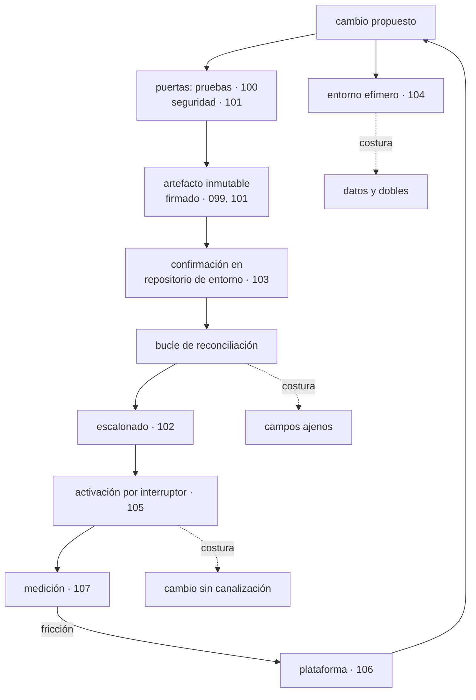

# 108 — Proyecto: fábrica de software multi-cloud

> [← Clase anterior](../../part-08-continuous-delivery-platform-engineering/107-developer-experience-dora-y-carga-cognitiva/README.md) · [Índice de la parte](../README.md) · [Clase siguiente →](../../part-09-data-messaging-serverless-integration/109-bases-relacionales-administradas-y-pooling/README.md)

**Parte:** 08 — Entrega continua y platform engineering<br>
**Nivel:** avanzado · **Horas estimadas:** 8<br>
**Laboratorio:** `capstone` · **Estado:** `EXECUTABLE_CORE`

## 🎯 Propósito

Montar la fábrica completa —del cambio propuesto a producción en los tres proveedores— con todo lo de las clases 097 a 107 funcionando a la vez, y comprobar dónde encaja mal. La clase cierra la parte 08 con las tres piezas de siempre: **calificar la hipótesis escrita al terminar la parte 07, incluidas las partes en las que se equivocó**, actualizar el recuento de leyes con la que esta parte ha hecho aparecer cuatro veces, y escribir la predicción que la parte 09 tendrá que corregir.

## 📚 Resultados de aprendizaje

Al finalizar podrás:

1. **Montar** la fábrica completa y localizar sus costuras.
2. **Adaptar** el mismo camino a AWS, Azure y Google Cloud sin duplicarlo tres veces.
3. **Calificar** con evidencia la hipótesis de la parte 07, incluido lo que falló.
4. **Incorporar** la ley 17 al cuestionario, con sus cuatro apariciones.
5. **Escribir** la predicción de la parte 09 en términos que se puedan desmentir.

## 🧩 Conceptos centrales

| Concepto | Comprensión verificable |
|---|---|
| `fábrica` | El recorrido completo del cambio: propuesta, entorno, puertas, artefacto firmado, promoción por huella, reconciliación, activación y medición. |
| `costura` | Punto donde dos mecanismos de la fábrica se tocan y ninguno es dueño. Es donde aparecen los fallos que ninguna clase suelta predice. |
| `camino común` | La parte del recorrido que no depende del proveedor. Lo que sí depende se aísla en el borde, no se replica tres veces. |
| `calificación de hipótesis` | Comparar lo que se predijo con lo que ocurrió, publicando también lo que se predijo mal. Es lo que convierte la parte en conocimiento y no en opinión. |
| `ley 17` | Toda medida que se convierte en objetivo se alcanza; el sistema que medía no tiene por qué mejorar. |
| `hipótesis de la parte 09` | Predicción escrita ahora, sobre lo que ocurrirá cuando el sujeto pase a ser el estado, para que la clase 120 la corrija con datos. |

## 🧠 Modelo mental

Una plataforma interna ofrece capacidades como productos y reduce carga cognitiva mediante caminos dorados, sin quitar autonomía donde importa.

Aplicado a esta clase, separa siempre cuatro planos: **intención** (qué necesita el usuario),
**configuración** (qué declaramos), **estado observado** (qué existe de verdad) y
**evidencia** (cómo sabemos que cumple). Confundirlos produce diseños que se ven correctos
en un diagrama pero fallan al operar.

## 🗺️ Flujo de razonamiento



## 📖 Desarrollo

### 1. La fábrica, y sus tres costuras

Las once clases anteriores construyeron piezas. Juntas forman un recorrido:

```text
cambio propuesto
  → entorno efímero con su nombre y dirección              104
  → puertas: pruebas por nivel, seguridad, contrato        100, 101
  → artefacto inmutable, firmado, con inventario           099, 101
  → confirmación en el repositorio de entorno              103
  → el bucle lo materializa                                103
  → escalonado con análisis y reversión automática         102
  → activación por interruptor, gradual                    105
  → medición del recorrido y de la fricción                107
  → y lo que la medición descubre entra en la plataforma   106
```

Y lo que no predice ninguna clase suelta son **las costuras**: los puntos donde dos piezas se tocan y ninguna es dueña.

```text
COSTURA 1   entorno efímero ←→ datos y dependencias
  el entorno se crea en minutos y los datos deciden si sirve
  → y ahí no manda ni la plataforma ni el equipo: manda el esquema

COSTURA 2   bucle ←→ otros controladores
  el bucle quiere converger y el autoescalador también
  → 196 de 209 diferencias eran de esta costura (clase 103)

COSTURA 3   interruptor ←→ todo lo demás
  cambiar un valor tiene efecto de producción y no pasa por la fábrica
  → hubo que reconstruirle cuatro controles (clase 105)
```

Y una cuarta que aparece al montarlo todo junto y que conviene anticipar: **el artefacto es el mismo en los tres entornos y el comportamiento no**, porque los interruptores están en estados distintos. La garantía de la clase 099 sigue siendo cierta y ya no basta; lo que hay que poder responder es:

```text
¿qué artefacto corre?      huella                        099
¿con qué configuración?    confirmación del entorno      103
¿con qué variantes?        estado de los interruptores   105
```

Las tres respuestas juntas son lo que identifica un sistema en ejecución. Con dos no basta, y casi todo el mundo se queda en dos.

### 2. El proyecto

Montar la fábrica para un servicio real en los tres proveedores. Lo que hay que entregar:

```text
1. CAMINO COMÚN
   una plantilla de canalización reutilizable con las puertas de las
   clases 100 y 101, y el presupuesto de ruido declarado
   → lo específico de cada proveedor, aislado en el último paso

2. IDENTIDAD SIN CLAVES en los tres
   federación desde el flujo hacia AWS, Azure y Google Cloud   098
   → inventario que demuestre que no queda ninguna clave de larga duración

3. ARTEFACTO ÚNICO
   una imagen, tres registros, la misma huella
   firmada con la identidad del flujo, con inventario y procedencia
   → y verificación en admisión que compruebe flujo y rama

4. REPOSITORIO DE ENTORNO
   tres entornos por proveedor, declarados por huella
   propiedad de campo resuelta, poda con umbral y protecciones   103

5. ESCALONADO
   canario con control simultáneo y primer escalón dimensionado   102
   prueba con una versión rota a propósito, que debe pararla

6. ENTORNO EFÍMERO
   por cambio propuesto, con semilla versionada y dobles por contrato
   caducidad y barrido de huérfanos                              104

7. INTERRUPTORES
   uno de operación por cada camino que cruce un punto de no retorno
   con registro, gradualidad, reversión y fecha de muerte        105

8. MEDICIÓN
   las cuatro medidas por servicio, con sus definiciones escritas
   y el plazo descompuesto por tramos                            107
```

Y las preguntas cuya respuesta hay que escribir, porque son las que separan un montaje de una fábrica:

```text
¿cuánto tarda un cambio de una línea desde la confirmación
 hasta servir tráfico en producción, medido?
¿qué pasa si el bucle deja de sincronizar? ¿cuánto tarda alguien en saberlo?
¿qué pasa si el registro de imágenes no responde durante un despliegue?
¿quién puede revertir, y necesita permiso de alguien?
¿qué parte del camino es distinta en cada proveedor, y por qué?
```

Y sobre la última: **lo que de verdad cambia entre proveedores es menos de lo que parece**. La construcción, las puertas, la firma, el inventario, el repositorio de entorno y el escalonado son iguales. Lo que cambia es la federación de identidad, el nombre del registro y el servicio de secretos.

```text
idéntico entre proveedores      construcción, puertas, artefacto, firma,
                                repositorio de entorno, escalonado, medición
distinto                        federación de identidad
                                registro de imágenes
                                servicio de secretos
                                admisión (verificación de firma)
```

Y el error a evitar es el de siempre: **tres canalizaciones parecidas que divergen en seis meses**. Una plantilla con un paso final parametrizado, y ninguna copia.

### 3. Calificación de la hipótesis de la parte 07

Al cerrar la parte 07, la clase 096 escribió dos predicciones. Las dos se califican aquí con lo que las clases 097 a 107 encontraron.

**Predicción 1: «cuando el bucle exista, la canalización pasará a ser el objetivo más valioso».**

```text
veredicto: acertada en la conclusión, EQUIVOCADA en el mecanismo
```

Se predijo que lo sería **porque despliega**. Y ocurrió lo contrario en esa dimensión concreta: al pasar al modelo de tirar, la canalización **perdió** las credenciales del clúster (clase 103). Dejó de poder desplegar.

Y siguió siendo el objetivo más valioso por otro camino que no se había previsto: **es quien escribe las confirmaciones que el bucle obedece sin preguntar**.

```text                                antes del bucle      después
la canalización puede desplegar          sí                 no
la canalización puede hacer que
se despliegue lo que quiera              sí                 sí
la revisión humana lo impide             no había           en producción
```

El bucle no redujo el valor del objetivo: **cambió qué hay que proteger**. Antes, unas credenciales; después, el derecho a confirmar en un repositorio, que es exactamente lo que la clase 098 llamó el permiso de escritura como puerta de entrada.

**Predicción 2: la lista de lo que el bucle no debe revertir.**

La clase 096 escribió tres elementos. Lo que la clase 103 midió al activarlo:

```text                                        predicho    medido
réplicas fijadas por el autoescalador           sí          61
anotaciones inyectadas por operadores           no          88   ← la mayor
campos rellenados por el sistema                no          47
certificados rotados                            sí           0   (no ocurrió aún)
cambios manuales legítimos de incidente         sí           1
```

```text
veredicto: la lista era correcta y estaba INCOMPLETA en su mayor partida
```

De las 209 diferencias, la categoría más grande —88, el 42 %— era la que no estaba en la lista. Y el motivo del error es instructivo: se predijo pensando en **quién cambia el número de réplicas**, y no en **qué escribe cosas en los recursos sin que nadie lo pida**. La malla de servicio y los operadores anotan constantemente, y son invisibles hasta que algo compara.

Y hay un acierto que conviene registrar porque fue el más útil: la predicción de que **haría falta un camino de emergencia que no consistiera en desactivar el bucle**. Se cumplió en la semana 8, y el único bucle que se desactivó estuvo apagado seis días.

**Y lo que la parte 08 encontró y ninguna predicción contemplaba:**

```text
la mayor mejora del plazo no vino de la fábrica
  vino de comprometerse a revisar en 4 horas: 3,1 días → 1,1 días
  la canalización era el 26 % del plazo                        clase 107

renunciar al realismo de los datos mejoró la detección
  la semilla pequeña encontró 5 defectos que el extracto no contenía
                                                               clase 104

la información más valiosa de la plataforma la dieron
  los equipos que NO la usaban                                 clase 106
```

### 4. La ley 17, y el recuento

Una regularidad ha aparecido cuatro veces en esta parte, en contextos independientes, y ya cumple el criterio para entrar en el cuestionario.

```text
LEY 17
  Toda medida que se convierte en objetivo se alcanza.
  El sistema que esa medida describía no tiene por qué mejorar.
```

Sus cuatro apariciones:

```text
clase 100   cobertura del 91 % como objetivo
            → 33 % de mutantes sobrevivían: pruebas que ejecutaban sin comprobar

clase 106   plataforma obligatoria
            → adopción del 100 % por definición, y el fracaso invisible

clase 107   objetivo de tasa de fallo por debajo del 5 %
            → se cumplió (4,1 %) y se declararon 9 incidentes menos al mes

clases 067  «escáner implantado» como medida de cumplimiento
      y 091  → implantado y desactivado durante 8 y 14 meses
```

Y lo que la ley 17 añade al cuestionario de cada tecnología nueva:

```text
¿qué medida usaremos para decir que esto funciona?
¿cuál es la forma más barata de mejorar esa medida sin mejorar nada?
¿qué medida contraria la sujeta?
```

La tercera pregunta es la única defensa que ha funcionado en las cuatro apariciones: **la cobertura sujeta con mutación, la frecuencia con la tasa de fallo, la adopción con el motivo de las salidas, el «implantado» con los hallazgos por cambio**.

**Recuento tras la parte 08.** Las cinco leyes con más apariciones acumuladas:

```text
ley 13  en un sistema declarativo, el bucle que no corre no da error      10
        parte 08: agente parado 9 días (103), entorno huérfano (104),
                  interruptor que nadie retira (105)

ley 15  una señal con demasiados elementos deja de ser señal               9
        parte 08: 812 hallazgos (101), 209 diferencias (103),
                  147 interruptores (105)

ley 16  un control que estorba acaba desactivado o rodeado                 9
        parte 08: escáner desactivado (101), entorno de 34 min sin uso (104),
                  puerta roja rodeada por pruebas inestables (107)

ley 11  lo que entra en un sistema de solo-añadir se queda                 6
        parte 08: secretos en el historial (101)

ley 14  las decisiones de creación son irreversibles                       6
        parte 08: punto de no retorno del despliegue (102),
                  poda que borra lo que ya no se declara (103)

ley 17  la medida que se vuelve objetivo se alcanza sin mejorar el sistema  4
        NUEVA en esta parte
```

Y una observación sobre las tres primeras: **aparecen juntas**. Un bucle que no corre (13) produce una señal permanente que nadie mira (15) y acaba desactivado (16). En la parte 08 esa cadena se ha visto entera tres veces.

### 5. La hipótesis de la parte 09

Todo lo construido en las partes 05 a 08 funciona por una razón que casi nunca se enuncia: **lo que se despliega no guarda estado**. El artefacto inmutable, la reversión, el entorno efímero, la poda, el canario y el interruptor son mecanismos que se apoyan en poder destruir y recrear sin perder nada.

La parte 09 cambia el sujeto: bases relacionales y no relacionales, caché, almacenamiento de objetos, colas, flujos, eventos y orquestación. **El estado pasa a ser el tema.**

La predicción, escrita para poder desmentirla:

```text
1. De los ocho mecanismos de las partes 07 y 08, TRES O MENOS se
   aplicarán sin cambios a un componente con estado.
   Los mecanismos: artefacto inmutable, reversión, entorno efímero,
   reconciliación con poda, canario, interruptor, puerta de canalización,
   camino asfaltado.
   → la clase 120 dirá cuántos sobrevivieron y cuáles necesitaron
     una versión distinta

2. La ley 14 —las decisiones de creación son irreversibles— será la
   ley dominante de la parte 09, con más apariciones que la ley 13.
   Motivo: en los servicios de datos, la clave de partición, el modo de
   consistencia, el número de particiones y el formato de almacenamiento
   se eligen al crear y no se cambian.

3. El problema más difícil de la parte 09 no será guardar los datos.
   Será la GARANTÍA EN LA FRONTERA: qué ocurre exactamente una vez,
   qué llega en orden y qué pasa cuando se reintenta.
   → y predigo que la respuesta recurrente será la misma que ya usa
     este programa para otra cosa: hacer la operación repetible sin
     efecto adicional, en vez de intentar que ocurra una sola vez

4. Y una predicción concreta sobre la poda: será PELIGROSA de una forma
   nueva. Un recurso con estado que se borra por no estar declarado no
   se recrea igual: se recrea vacío.
```

Y lo que hay que anotar ahora para poder calificar honestamente:

```text
lo que ya sabemos que se rompe   reversión, cuando se cruza el punto
                                 de no retorno (clase 102)
lo que creemos que aguanta       artefacto inmutable, puerta, camino
lo que no tenemos ni idea        canario sobre un cambio de esquema
```

La tercera línea es la que hace que valga la pena escribir esto: **si la clase 120 no corrige nada, la predicción era demasiado cómoda**.

## 🔬 Ejemplo trabajado

**Se monta la fábrica completa para el servicio de pedidos de CloudShop, en AWS, Azure y Google Cloud a la vez. Lo interesante no es que funcione: es qué parte resultó ser común, qué costó más y qué se rompió al juntarlo todo.**

**Lo que resultó común, medido en líneas.**

```text                                    líneas   común a los 3
plantilla de canalización                   410         sí
definición de puertas                       180         sí
construcción y firma                        140         sí
repositorio de entorno (base)               260         sí
definición del escalonado                    95         sí
                                          ─────
                                          1.085

federación de identidad                   3 × 40      no
registro de imágenes                      3 × 12      no
servicio de secretos                      3 × 25      no
admisión y verificación de firma           3 × 30      no
                                          ─────
                                            321
```

**El 77 % del código es común.** El primer diseño replicaba la canalización entera por proveedor; la segunda versión aisló los 321 en un paso final parametrizado.

```text                                    replicada    parametrizada
líneas totales                             3.255          1.406
cambios que hay que hacer 3 veces           todos             0
divergencia a los 6 meses (proyectada)       alta          nula
```

**Lo que se rompió al juntarlo: cinco costuras.**

```text
1. el entorno efímero creaba una base de datos por cambio
   → 9 entornos × 3 proveedores = 27 bases vivas
   → coste proyectado 2.400 €/mes
   corrección: una instancia compartida con un esquema por entorno

2. la huella de la imagen es la misma; los tres registros son distintos
   → el repositorio de entorno declaraba el registro, no solo la huella
   → y una promoción a otro proveedor no era una promoción
   corrección: la huella en la base y el registro en la capa del entorno

3. la verificación de firma funcionaba en dos proveedores y en el tercero
   la admisión no tenía el mismo mecanismo
   corrección: verificación previa en la canalización + admisión donde
              exista; documentado como diferencia real, no tapado

4. el canario comparaba con un control, y en un proveedor el reparto de
   tráfico no era estable a bajos porcentajes
   → el 5 % real oscilaba entre el 2 % y el 9 %
   corrección: primer escalón al 10 % en ese proveedor, con la misma
              cuenta de eventos del apartado de la clase 102

5. los interruptores tenían tres inventarios, uno por proveedor
   → el mismo interruptor en estados distintos, y nadie lo veía
   corrección: un único sistema de interruptores, consultado por los tres
```

La quinta es la que más se parece a la costura 3 del primer apartado, y confirma la regla: **el estado del sistema en ejecución es artefacto, configuración e interruptores; con dos de los tres no se puede razonar**.

**La prueba de que la fábrica funciona: un cambio de una línea, cronometrado.**

```text
confirmación                                          0 s
puertas rápidas (secretos, código, dependencias)   1 min 40 s
pruebas de unidad e integración                    3 min 10 s
construcción, firma, inventario                    2 min 05 s
entorno efímero listo                              6 min 40 s   (en paralelo)
revisión humana                                   media 3,5 h
confirmación en repositorio de entorno                12 s
bucle materializa en dev                              48 s
promoción a pre (automática)                         1 min
promoción a pro (una aprobación)                  media 40 min
canario 10 % · 30 min                                30 min
escalones restantes                                  15 min
                                       ────────────────────
   confirmación → producción, sin contar esperas humanas:   54 min
   con esperas humanas, mediana:                          5 h 10
```

Y la lectura que corresponde a la clase 107: **de las 5 h 10, cuatro horas son espera humana**. La fábrica es el 17 % del tiempo. Es exactamente el hallazgo del mes 1 de aquella clase, reproducido con la fábrica ya montada.

**Las pruebas negativas, que es lo que distingue montar de tener.**

```text                                              ¿pasa lo que debe?
versión rota a propósito → ¿la para el canario?          sí, minuto 11
agente parado → ¿alerta por antigüedad?                  sí, 31 min
confirmación que borra un directorio → ¿umbral de poda?  sí, se detuvo
secreto en el envío → ¿lo rechaza?                       sí
imagen firmada desde otra rama → ¿la rechaza admisión?   en 2 de 3
registro de imágenes caído → ¿qué pasa?                  el bucle no puede
                                                         materializar; los
                                                         pods existentes siguen
interruptor de operación con el sistema de interruptores
caído → ¿se puede apagar?                                sí, valor local
```

La quinta línea —dos de tres— es la única diferencia real entre proveedores que quedó sin resolver, y está documentada como tal en vez de omitida.

**Estado final del servicio de pedidos.**

```text                                    inicio parte 08    fin parte 08
frecuencia de despliegue                   1,2 / semana     6,4 / semana
plazo de cambio (mediana)                    3,1 días          9 h
tasa de fallo del cambio                       14 %           6,2 %
tiempo de restauración                        2,4 h          37 min
credenciales de larga duración                    7              0
imágenes en producción sin firma verificada       2              0
cambios manuales en el entorno               2 / mes          0 / mes
vulnerabilidades críticas en producción      no se sabía        0
interruptores vivos                              —             31
entornos efímeros huérfanos                      —            0-1
proporción del trabajo en infraestructura      31 %             9 %
```

**Y la conclusión que cierra la parte**: la fábrica hizo lo que prometía, y **el mayor factor de los tiempos que quedan no está dentro de ella**. De las 5 h 10 del recorrido, cuatro son espera de personas. Ese es el trabajo que la parte 08 deja abierto, y ninguna de las once clases anteriores lo puede resolver con más automatización.

## 🧪 Laboratorio guiado

Ejecuta desde la raíz:

```bash
python classes/part-08-continuous-delivery-platform-engineering/108-proyecto-fabrica-de-software-multi-cloud/lab.py
```

El laboratorio selecciona el motor de práctica **`capstone`** y produce
`lab_result.json`. El escenario, sus comprobaciones y el artefacto esperado corresponden a
esta clase; no requiere credenciales y deja explícito qué debe revalidarse en un sandbox real.

1. Lee `exercise.steps` y formula una predicción antes de ejecutar.
2. Ejecuta la práctica y verifica todos los elementos de `checks`.
3. Provoca el caso de `negative_test` y explica la señal observada.
4. Materializa `plataforma-entrega` en `evidence/` usando la plantilla indicada.
5. Para proveedor real, sigue `sandbox.requires`, registra costo y ejecuta `destroy`.

### Evidencia esperada

El artefacto principal es un incremento integrado, demostrable y documentado. Además, la entrega debe incluir el comando ejecutado,
la salida estructurada y una conclusión que no exceda lo observado.

## 🏆 Reto verificable

Construye **`plataforma-entrega`** para el caso CloudShop. Incluye una alternativa descartada,
un supuesto que pueda falsarse, una prueba de fallo y una decisión de rollback.

## ✅ Criterio de aceptación

- [ ] `lab.py` termina con código 0 y genera JSON válido.
- [ ] La entrega conecta al menos tres requisitos con mecanismos verificables.
- [ ] Existe una prueba positiva y una prueba negativa con evidencia.
- [ ] Seguridad, costo y operación aparecen como decisiones, no como anexos.
- [ ] Se declara una limitación y una condición que obligaría a revisar el diseño.
- [ ] Otra persona puede repetir el recorrido sin conocimiento tácito.

## ⚠️ Errores frecuentes

| Síntoma | Causa probable | Corrección |
|---|---|---|
| Tres canalizaciones parecidas que divergen a los seis meses | Se replicó el camino por proveedor en vez de parametrizar lo que cambia | Aísla federación, registro, secretos y admisión en un paso final; el 77 % restante es común. |
| Se sabe qué artefacto corre y aun así no se puede reproducir el comportamiento | Falta el estado de los interruptores, que es la tercera pieza de la identidad del sistema | Registra siempre huella, confirmación del entorno y estado de los interruptores; con dos no basta. |
| Cada entorno efímero crea su propia base de datos y el coste se dispara | Se aplicó el aislamiento completo a un recurso caro sin evaluarlo | Instancia compartida con un esquema por entorno, y aislamiento completo solo donde haga falta. |
| Una promoción entre proveedores no es una promoción | El repositorio de entorno declara el registro junto con la huella | Deja la huella en la base común y el registro en la capa específica del entorno. |
| Se declara la fábrica terminada sin haberla desafiado | Se comprobó que funciona el camino feliz y ninguna prueba negativa | Ejecuta las siete pruebas negativas —versión rota, agente parado, poda excesiva, secreto, firma ajena, registro caído, interruptor con el sistema caído— y documenta las que fallan. |
| La hipótesis de la parte anterior se da por acertada sin revisarla | Calificar solo lo que salió bien convierte el aprendizaje en opinión | Publica el veredicto de cada predicción con su evidencia, incluida la partida mayor que la lista no contemplaba. |

## 🛡️ Seguridad, ética y costo

Trabaja con cuentas propias o sandboxes autorizados. No publiques secretos, identificadores
reales ni datos personales. Antes de crear recursos pagos define presupuesto, etiquetas y
comando de destrucción; después verifica que no queden recursos huérfanos. Los ejemplos
locales enseñan contratos, pero no certifican cumplimiento ni disponibilidad de producción.

## ❓ Preguntas de comprobación

1. ¿Qué tres datos identifican un sistema en ejecución, y por qué no bastan dos?
2. ¿Qué parte de la fábrica es común a los tres proveedores y cuál no?
3. ¿En qué acertó y en qué se equivocó la predicción de que la canalización sería el objetivo más valioso?
4. ¿Qué dice la ley 17 y cuál es la única defensa que ha funcionado contra ella?
5. ¿Qué predice la hipótesis de la parte 09 sobre los ocho mecanismos y sobre la ley dominante?

## 🔗 Referencias

- Forsgren, N., Humble, J. y Kim, G. (2018). *Accelerate*, cap. 4 — capacidades de entrega y su efecto conjunto. <https://itrevolution.com/product/accelerate/>
- CNCF (2025). *Platforms white paper* — la fábrica como producto interno y sus interfaces. <https://tag-app-delivery.cncf.io/whitepapers/platforms/>
- SLSA (2025). *Levels and requirements* — qué exige cada nivel de la cadena de construcción. <https://slsa.dev/spec/v1.0/levels>
- OpenGitOps (2025). *Principles* — reconciliación continua como base del recorrido. <https://opengitops.dev/>
- Kim, G. y otros (2016). *The DevOps Handbook*, parte IV — flujo, retroalimentación y aprendizaje continuo. <https://itrevolution.com/product/the-devops-handbook-second-edition/>
- Documentación oficial vigente del servicio implementado; registra URL y fecha de consulta.

---

> [Evaluación](assessment.md) · [Contrato de clase](lesson.yaml) · [Índice de la parte](../README.md)
