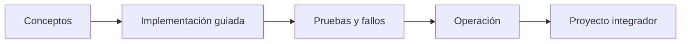

# Parte 08 — Entrega continua y platform engineering

> [← Parte 07](../part-07-infrastructure-as-code-configuration/README.md) · [Índice completo](../README.md) · [Parte 09 →](../part-09-data-messaging-serverless-integration/README.md)

**Nivel:** avanzado · **Clases:** 12 · **Duración sugerida:** 6–8 semanas

Diseñar un flujo de entrega rápido, seguro y observable para equipos de producto.

## Resultados de la parte

Al completar esta parte podrás explicar el dominio con lenguaje independiente del proveedor,
implementar sus mecanismos esenciales, diagnosticar fallos y defender decisiones mediante
evidencia, costo, seguridad y objetivos de confiabilidad.

## Modelo mental

Una plataforma interna ofrece capacidades como productos y reduce carga cognitiva mediante caminos dorados, sin quitar autonomía donde importa.

## Secuencia

## Clases

| ID | Clase | Laboratorio | Horas |
|---:|---|---|---:|
| 097 | [Integración continua, trunk-based development y feedback](097-integracion-continua-trunk-based-development-y-feedback/README.md) | `delivery` | 4 |
| 098 | [GitHub Actions: workflows, runners, permisos y caché](098-github-actions-workflows-runners-permisos-y-cache/README.md) | `delivery` | 4 |
| 099 | [Artefactos inmutables, semver y promoción](099-artefactos-inmutables-semver-y-promocion/README.md) | `supply-chain` | 4 |
| 100 | [Pruebas, calidad y puertas de cambio](100-pruebas-calidad-y-puertas-de-cambio/README.md) | `testing` | 4 |
| 101 | [SAST, SCA, secretos, SBOM y firma en pipeline](101-sast-sca-secretos-sbom-y-firma-en-pipeline/README.md) | `security` | 4 |
| 102 | [Rolling, blue-green, canary y rollback](102-rolling-blue-green-canary-y-rollback/README.md) | `delivery` | 4 |
| 103 | [GitOps con Argo CD o Flux](103-gitops-con-argo-cd-o-flux/README.md) | `gitops` | 4 |
| 104 | [Ambientes efímeros y promoción entre entornos](104-ambientes-efimeros-y-promocion-entre-entornos/README.md) | `delivery` | 4 |
| 105 | [Feature flags y separación deploy-release](105-feature-flags-y-separacion-deploy-release/README.md) | `delivery` | 4 |
| 106 | [Platform engineering e Internal Developer Platform](106-platform-engineering-e-internal-developer-platform/README.md) | `platform` | 4 |
| 107 | [Developer experience, DORA y carga cognitiva](107-developer-experience-dora-y-carga-cognitiva/README.md) | `metrics` | 4 |
| 108 | [Proyecto: fábrica de software multi-cloud](108-proyecto-fabrica-de-software-multi-cloud/README.md) | `capstone` | 8 |

## Evaluación de la parte

- 35 % laboratorios y evidencia reproducible.
- 25 % retos verificables.
- 20 % decisiones y ADR.
- 10 % seguridad, confiabilidad y costo.
- 10 % proyecto integrador de la parte.

Se aprueba con 80 % de clases en nivel B o superior y el proyecto integrador reproducible.

## Pauta bibliográfica

- Continuous Delivery — Humble y Farley.
- Accelerate — Forsgren, Humble y Kim.
- Team Topologies — Skelton y Pais.
