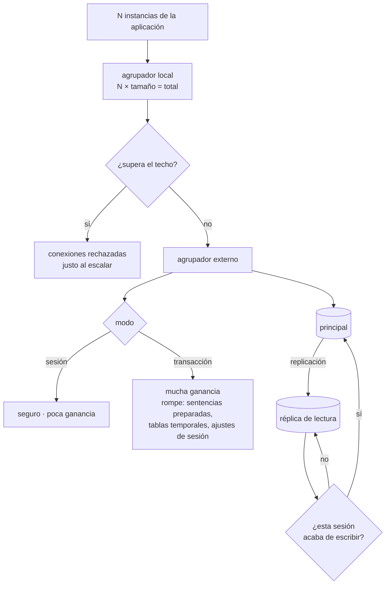

# 109 — Bases relacionales administradas y pooling

> [← 108 · Proyecto: fábrica de software multi-cloud](../../part-08-continuous-delivery-platform-engineering/108-proyecto-fabrica-de-software-multi-cloud/README.md) · [Índice de la parte](../README.md) · [110 · NoSQL: clave-valor, documento, columna y grafo →](../../part-09-data-messaging-serverless-integration/110-nosql-clave-valor-documento-columna-y-grafo/README.md)

**Parte:** 09 — Datos, mensajería, serverless e integración<br>
**Nivel:** avanzado · **Horas estimadas:** 4<br>
**Laboratorio:** `data` · **Estado:** `EXECUTABLE_CORE`

## 🎯 Propósito

Abrir la parte del estado con el servicio de datos más común y peor entendido. Un motor relacional administrado quita el trabajo de instalar, parchear y copiar, y **no quita ninguna de las decisiones que importan**. La clase se centra en las tres que rompen sistemas en producción: el número de conexiones, que tiene un techo duro y se agota justo cuando el sistema escala; el retardo de las réplicas, que rompe la suposición de leer lo que acabas de escribir; y las decisiones de creación que no se pueden cambiar después.

## 📚 Resultados de aprendizaje

Al finalizar podrás:

1. **Separar** lo que el servicio administrado resuelve de lo que sigue siendo tuyo.
2. **Calcular** cuántas conexiones abrirá tu sistema y compararlo con el techo.
3. **Elegir** el modo de agrupación de conexiones y saber qué rompe cada uno.
4. **Diseñar** la lectura en réplicas contando con el retardo.
5. **Identificar** las decisiones que solo se toman al crear la base de datos.

## 🧩 Conceptos centrales

| Concepto | Comprensión verificable |
|---|---|
| `servicio administrado` | El proveedor opera el motor: instalación, parches, copias, conmutación. El esquema, los índices, las consultas y las conexiones siguen siendo tuyos. |
| `techo de conexiones` | Número máximo de conexiones simultáneas. Es un límite duro que sale de la memoria del servidor, no un parámetro que se sube sin consecuencias. |
| `agrupación de conexiones` | Reutilizar un conjunto pequeño de conexiones para muchas peticiones. Sin ella, el número de conexiones crece con el número de instancias. |
| `modo de transacción` | El agrupador asigna la conexión solo mientras dura la transacción. Multiplica la capacidad y **rompe todo lo que dependa de la sesión**. |
| `retardo de réplica` | Tiempo que tarda un cambio del principal en verse en la réplica. Convierte «leer lo que acabo de escribir» en una suposición falsa. |
| `conmutación` | Promoción de una réplica a principal cuando el principal falla. No es instantánea y las transacciones en vuelo se pierden. |

## 🧠 Modelo mental

La base de datos correcta depende del patrón de acceso y de las garantías necesarias; distribuir datos convierte latencia, consistencia y fallos parciales en decisiones de diseño.

Aplicado a esta clase, separa siempre cuatro planos: **intención** (qué necesita el usuario),
**configuración** (qué declaramos), **estado observado** (qué existe de verdad) y
**evidencia** (cómo sabemos que cumple). Confundirlos produce diseños que se ven correctos
en un diagrama pero fallan al operar.

## 🗺️ Flujo de razonamiento



## 📖 Desarrollo

### 1. Qué resuelve el servicio administrado y qué no

Conviene trazar la línea antes de nada, porque casi todos los incidentes de bases de datos administradas caen del lado que **no** cubre el proveedor.

```text
LO QUE RESUELVE
  instalación y parches del motor
  copias de seguridad automáticas y restauración a un instante
  réplica y conmutación
  cifrado en reposo y en tránsito
  métricas básicas y registros

LO QUE SIGUE SIENDO TUYO
  el esquema y los índices
  las consultas y sus planes
  el número de conexiones
  el retardo que tolera cada lectura
  las decisiones que se toman al crear
  saber si la copia restaura, que solo se sabe restaurando
```

La última línea repite lo que la clase 088 estableció y sigue siendo cierta aquí: **una copia no probada no es una copia**. El proveedor garantiza que existe, no que tu sistema vuelva a funcionar con ella.

Y tres parámetros que el servicio expone y que casi nunca se tocan, con lo que pasa si no se tocan:

```text
límite de tiempo por sentencia
  sin él, una consulta mal escrita ocupa una conexión indefinidamente
  → y con suficientes, agota el techo

límite de tiempo de transacción inactiva
  sin él, una transacción abierta y olvidada bloquea filas
  y en algunos motores impide limpiar versiones antiguas

registro de consultas lentas
  sin él, el diagnóstico empieza cuando ya hay un incidente
```

El primero es el más rentable de los tres y el más olvidado. Un valor por defecto sensato:

```sql
ALTER ROLE app SET statement_timeout = '15s';
ALTER ROLE app SET idle_in_transaction_session_timeout = '30s';
```

Y una advertencia sobre el dimensionado que este programa ya vio en la clase 078 con otra forma: **la memoria del servidor se reparte entre conexiones y caché**. Subir el techo de conexiones no es gratis; se paga en memoria que deja de estar disponible para el caché de datos, y el efecto se nota en las consultas.

### 2. La cuenta de las conexiones

Este es el problema que aparece en cuanto el sistema escala, y tiene una aritmética que se puede hacer antes de que ocurra.

En los motores de proceso por conexión, cada conexión cuesta memoria fija aunque esté ociosa:

```text
servidor de 8 GB
memoria por conexión, entre 5 y 10 MB
techo razonable                        ~200-400 conexiones
```

Y el número que tu sistema abre no depende de tu tráfico: depende de **cuántas instancias tienes**.

```text
instancias de la aplicación                    12
tamaño del agrupador por instancia             10
                                          ───────
conexiones abiertas                           120

y cuando el autoescalador sube a 40 instancias
                                              400   ← techo alcanzado
```

Y el momento en que ocurre es el peor posible: **el autoescalador sube instancias porque hay carga, y al subirlas agota las conexiones**. El síntoma es un fallo total, no una degradación.

Lo mismo con funciones sin servidor, y peor, porque la concurrencia no está acotada por instancias:

```text
500 ejecuciones concurrentes × 1 conexión cada una = 500
```

Las tres respuestas, y no son alternativas sino capas:

```text
1. AGRUPADOR EN LA APLICACIÓN
   imprescindible, y no resuelve el problema: lo multiplica por instancias
   regla práctica: tamaño pequeño, 5-10, no 50

2. AGRUPADOR EXTERNO
   un proceso intermedio con miles de conexiones de cliente
   y pocas decenas contra la base
   → es lo que rompe la proporcionalidad con el número de instancias

3. NO ABRIR UNA CONEXIÓN POR PETICIÓN
   agrupar en un servicio intermedio cuando el cliente es efímero
```

Y la cuenta que conviene hacer al dimensionar el agrupador externo, porque el error habitual es ponerlo enorme:

```text
conexiones útiles ≈ núcleos del servidor × 2 a 4
→ en un servidor de 8 núcleos, entre 16 y 32
```

Más conexiones activas que eso no aumentan el trabajo hecho: aumentan la competencia por el mismo procesador y por los mismos bloqueos. **Una base de datos con 300 conexiones activas hace menos trabajo que la misma con 30.**

Y el indicador que avisa antes del fallo:

```sql
SELECT state, count(*) FROM pg_stat_activity GROUP BY state;
-- active | idle | idle in transaction  ← la tercera creciendo es la señal mala
```

### 3. Modo de transacción: lo que gana y lo que rompe

El agrupador externo tiene dos modos, y la diferencia entre ellos es la fuente de una clase entera de errores raros.

```text
MODO SESIÓN
  la conexión se asigna al cliente hasta que se desconecta
  + no rompe nada
  − la ganancia es pequeña: sigue habiendo una conexión por cliente activo

MODO TRANSACCIÓN
  la conexión se asigna solo mientras dura la transacción
  + 1.000 clientes sobre 25 conexiones reales
  − rompe todo lo que viva en la sesión y no en la transacción
```

Y la lista de lo que rompe, que conviene tener delante porque los síntomas son desconcertantes:

```text
sentencias preparadas          se preparan en una conexión y se ejecutan en otra
                               → «la sentencia preparada no existe»
tablas temporales              creadas en una conexión, invisibles en la siguiente
bloqueos de aviso              se toman en una sesión y se liberan en otra
ajustes de sesión              SET aplicado a una conexión que ya no es la tuya
secuencias con currval         valor de la sesión
escucha y notificación         requiere sesión persistente
transacciones que abarcan
varias peticiones              no existen en este modo
```

Y lo característico es que **funciona en desarrollo y falla en producción**, porque con poca concurrencia el agrupador suele devolver la misma conexión.

Las correcciones, en orden:

```text
desactivar las sentencias preparadas en el controlador
  o usar un controlador que las emule en el cliente
sustituir tablas temporales por tablas normales con vida acotada
sustituir bloqueos de aviso por una tabla de bloqueos con expiración
aplicar los ajustes por sentencia, no por sesión
y para lo que necesite sesión —escucha y notificación—, una conexión aparte
  fuera del agrupador
```

La última línea es la solución práctica más frecuente: **dos rutas de acceso**, una por el agrupador en modo transacción para el tráfico normal y otra directa para lo poco que necesita sesión.

Y una nota sobre el agrupador como punto único de fallo: si todo el tráfico pasa por un proceso, ese proceso necesita el mismo cuidado que la base. Dos instancias detrás de una dirección estable, y una comprobación de salud que mire **la base a través del agrupador**, no el agrupador solo.

### 4. Réplicas, conmutación y lo que se decide al crear

**Réplicas de lectura.** Alivian al principal y traen un problema que la aplicación tiene que resolver: la réplica va por detrás.

```text
retardo típico                milisegundos a segundos
retardo bajo carga            segundos a minutos
retardo durante una carga masiva o una migración   mucho peor
```

Y lo que rompe siempre es el mismo patrón:

```text
el usuario guarda un pedido        → escribe en el principal
la pantalla siguiente lo lee       → lee de la réplica
                                   → «tu pedido no existe»
```

La regla que lo resuelve sin pensar en cada caso:

```text
si esta sesión ha escrito en los últimos N segundos → lee del principal
si no                                              → lee de la réplica
```

Y qué puede ir a réplica sin riesgo:

```text
sí   informes, listados históricos, búsquedas, exportaciones
no   cualquier lectura que decida una escritura posterior
     comprobar existencia antes de insertar
     leer el saldo antes de descontarlo
```

La segunda lista no es cuestión de retardo: **una lectura que decide una escritura necesita coherencia**, y la réplica no la da.

Y vigilar el retardo es obligatorio, con una alerta que mira segundos, no bytes:

```sql
SELECT EXTRACT(EPOCH FROM (now() - pg_last_xact_replay_timestamp()));
```

**Conmutación.** No es instantánea, y la aplicación tiene que sobrevivir a ella:

```text
detección del fallo             10-30 s
promoción de la réplica         10-60 s
propagación del punto de acceso  0-30 s   ← depende del mecanismo
                             ──────────
total habitual                  30-120 s
```

Y lo que la aplicación debe tener escrito:

```text
reconexión automática con reintento y espera creciente
las transacciones en vuelo SE PIERDEN: hay que poder repetirlas
y para poder repetirlas, la operación tiene que ser repetible sin
  efecto adicional  ← esto se ve en la clase 116
no cachear la dirección resuelta más allá de su vigencia
```

Y una prueba que hay que hacer antes de necesitarla: **provocar una conmutación en preproducción y medir**. Casi siempre aparece algo: un controlador que no reconecta, un caché de nombres demasiado largo, un reintento que duplica.

**Lo que se decide al crear.** Aquí empieza a comprobarse la predicción de la clase 108 sobre la ley 14:

```text
versión mayor del motor        se cambia con migración, con parada o con réplica
conjunto de caracteres y
  ordenación                   cambiarlo obliga a recrear y recargar
cifrado en reposo              en varios proveedores, solo al crear
región y distribución en zonas se cambia recreando
tipo de almacenamiento         a veces sí, a veces recreando
nombre del punto de acceso     queda en cadenas de conexión por todas partes
```

Y una decisión de esquema con el mismo carácter: **el tipo de la clave primaria**. Cambiar un entero de 4 bytes por uno de 8 en una tabla de mil millones de filas es una migración de días, y el momento de decidirlo es antes de la primera fila.

Y la lista de comprobación de la clase:

```text
☐ está calculado cuántas conexiones abre el sistema en su máximo
☐ el agrupador de la aplicación es pequeño y hay agrupador externo
☐ el modo del agrupador está elegido y se sabe qué rompe
☐ hay límite de tiempo por sentencia y por transacción inactiva
☐ se vigila el número de conexiones en estado inactivo-en-transacción
☐ las lecturas que deciden escrituras no van a réplica
☐ hay regla de lectura tras escritura por sesión
☐ se alerta por segundos de retardo de réplica
☐ se ha provocado una conmutación y se ha medido
☐ las decisiones de creación están revisadas antes de crear
☐ la restauración de la copia se ha probado de verdad
```

Y el cierre que enlaza con la clase siguiente: todo esto asume que el modelo relacional es el adecuado. Cuándo no lo es, y qué se gana y qué se pierde al cambiarlo, es la materia de la clase 110.

## 🔬 Ejemplo trabajado

**El servicio de pedidos de CloudShop pasó a un motor relacional administrado. En los primeros ocho meses tuvo cuatro incidentes, y los cuatro están en las cuatro secciones de esta clase. Se resuelven en orden.**

**Incidente 1: el sistema cae justo cuando llega tráfico.**

```text
11:40  campaña de marketing, tráfico ×3
11:41  el autoescalador sube de 12 a 34 instancias
11:41  errores de conexión: «demasiadas conexiones»
11:52  caída total, 11 minutos
```

La cuenta que nadie había hecho:

```text
tamaño del agrupador por instancia                    25
instancias en reposo                                  12   →  300 conexiones
techo configurado                                    340
instancias con el pico                                34   →  850 conexiones
```

Y el detalle que lo hace peor: **la aplicación abría el agrupador entero al arrancar**, así que una instancia nueva consumía 25 conexiones antes de servir una sola petición.

Las dos correcciones y su efecto:

```text                                    antes      con agrupador pequeño   + externo
tamaño por instancia                        25              6                  6
conexiones con 34 instancias               850            204                 24
conexiones activas contra la base          850            204                 24
peticiones por segundo servidas          fallo         1.180              1.310
latencia p95                             fallo           310 ms             240 ms
```

La última columna es lo contraintuitivo: **con 24 conexiones se sirve más y más rápido que con 204**. El servidor tenía 8 núcleos; las otras 180 conexiones solo competían entre sí.

**Incidente 2: errores que no se reproducen en preproducción.**

Al activar el agrupador externo en modo transacción:

```text
errores «la sentencia preparada s_3 no existe»    en producción, ~1 de cada 400
en preproducción                                  cero
```

La causa es la del apartado tercero: con poca concurrencia el agrupador devolvía casi siempre la misma conexión. El inventario de lo que había que cambiar:

```text
sentencias preparadas del controlador       → desactivadas
tablas temporales en 2 informes             → tablas normales con vida acotada
bloqueos de aviso en el proceso nocturno    → tabla de bloqueos con expiración
escucha/notificación en 1 servicio          → conexión directa, fuera del agrupador
SET de zona horaria por sesión              → por sentencia
```

Y la prueba que faltaba, que se añadió a la canalización: **generar concurrencia suficiente en preproducción para que el agrupador reparta conexiones distintas**. Con 200 clientes concurrentes, el error aparecía en preproducción a los 40 segundos.

**Incidente 3: «mi pedido no aparece».**

```text
quejas de clientes en 6 semanas                        31, sin relacionar
causa                          la pantalla de confirmación leía de la réplica
retardo medio de la réplica                            180 ms
retardo durante el proceso nocturno de informes        41 s
```

Y lo interesante: el retardo medio era irrelevante. **El daño se concentraba en la ventana del proceso nocturno**, cuando la réplica se quedaba a cuarenta segundos.

La corrección, con la regla del apartado cuarto:

```text                                    antes            después
lecturas en réplica                    todas las de lectura   solo informes
regla de lectura tras escritura        no había          5 s por sesión
lecturas que deciden escrituras        en réplica        en principal
alerta de retardo                      no había          > 10 s
quejas por pedido no visible           31 / 6 semanas    0
```

Y al revisar «lecturas que deciden escrituras» apareció algo peor que las quejas: **la comprobación de existencia antes de insertar un pedido leía de la réplica**, lo que permitía duplicados durante el retardo. Se encontraron 14 pedidos duplicados en el histórico.

**Incidente 4: la conmutación.**

La primera conmutación real ocurrió a los siete meses:

```text
detección + promoción                       74 s
tiempo hasta que la aplicación se recuperó  6 min 20 s   ← el problema
```

La diferencia entre 74 segundos y 6 minutos:

```text
caché de resolución de nombres del contenedor        300 s
el agrupador externo no reintentaba: se quedó fijo
el controlador no reconectaba tras el error inicial
transacciones en vuelo                                47, perdidas
de ellas, repetidas automáticamente sin duplicar       0
de ellas, que crearon un pedido duplicado al repetir   3
```

Las correcciones, y el ensayo que las validó:

```text                                    antes         después
caché de nombres                          300 s          30 s
reintento del agrupador                   no             sí
reconexión del controlador                no             sí, con espera creciente
operación repetible sin efecto adicional  no             clase 116

conmutación provocada en preproducción    nunca          trimestral
tiempo de recuperación medido           6 min 20 s      52 s
```

**A los ocho meses.**

```text                                          antes         después
conexiones contra la base en el pico             850             24
peticiones por segundo servidas                fallo          1.310
latencia p95                                      —           240 ms
límite de tiempo por sentencia                 no había         15 s
conexiones inactivas-en-transacción          hasta 60          0-2
quejas por lectura tras escritura           31 / 6 sem          0
pedidos duplicados por lectura en réplica        14              0
recuperación tras conmutación               6 min 20 s        52 s
ensayo de conmutación                         nunca         trimestral
restauración de copia probada                 nunca         trimestral
```

**La lección que esta clase abre para la parte 09**: los cuatro incidentes tienen algo en común que no tenían los de las partes anteriores. **Ninguno se arreglaba desplegando otra versión.** El primero era una cuenta que nadie hizo, el segundo una propiedad del intermediario, el tercero una suposición sobre el tiempo y el cuarto un evento que no se había ensayado. La reversión, el canario y el entorno efímero —los mecanismos de la parte 08— no intervinieron en ninguno, que es justo lo que la hipótesis de la clase 108 predijo que iba a pasar.

## 🧪 Laboratorio guiado

Ejecuta desde la raíz:

```bash
python classes/part-09-data-messaging-serverless-integration/109-bases-relacionales-administradas-y-pooling/lab.py
```

El laboratorio selecciona el motor de práctica **`data`** y produce
`lab_result.json`. El escenario, sus comprobaciones y el artefacto esperado corresponden a
esta clase; no requiere credenciales y deja explícito qué debe revalidarse en un sandbox real.

1. Lee `exercise.steps` y formula una predicción antes de ejecutar.
2. Ejecuta la práctica y verifica todos los elementos de `checks`.
3. Provoca el caso de `negative_test` y explica la señal observada.
4. Materializa `modelo-relacional` en `evidence/` usando la plantilla indicada.
5. Para proveedor real, sigue `sandbox.requires`, registra costo y ejecuta `destroy`.

### Evidencia esperada

El artefacto principal es un modelo de datos ligado a patrones de acceso. Además, la entrega debe incluir el comando ejecutado,
la salida estructurada y una conclusión que no exceda lo observado.

## 🏆 Reto verificable

Construye **`modelo-relacional`** para el caso CloudShop. Incluye una alternativa descartada,
un supuesto que pueda falsarse, una prueba de fallo y una decisión de rollback.

## ✅ Criterio de aceptación

- [ ] `lab.py` termina con código 0 y genera JSON válido.
- [ ] La entrega conecta al menos tres requisitos con mecanismos verificables.
- [ ] Existe una prueba positiva y una prueba negativa con evidencia.
- [ ] Seguridad, costo y operación aparecen como decisiones, no como anexos.
- [ ] Se declara una limitación y una condición que obligaría a revisar el diseño.
- [ ] Otra persona puede repetir el recorrido sin conocimiento tácito.

## ⚠️ Errores frecuentes

| Síntoma | Causa probable | Corrección |
|---|---|---|
| El sistema falla por completo justo cuando sube el tráfico | El autoescalador añade instancias y cada una abre su agrupador; se agota el techo de conexiones | Agrupador pequeño en la aplicación más un agrupador externo, y calcula el máximo de conexiones antes de que ocurra. |
| Errores de sentencia preparada inexistente que no se reproducen fuera de producción | Modo de transacción: la sesión no persiste entre sentencias, y con poca concurrencia el agrupador devuelve la misma conexión | Desactiva las sentencias preparadas del controlador, sustituye lo que dependa de sesión y genera concurrencia real en preproducción. |
| Más conexiones y menos trabajo hecho | Las conexiones activas superan con mucho a los núcleos y compiten entre sí | Dimensiona las conexiones útiles en núcleos × 2 a 4 y deja que el agrupador encole el resto. |
| El usuario no ve lo que acaba de guardar | La lectura posterior va a una réplica con retardo | Regla de lectura tras escritura por sesión durante unos segundos, y ninguna lectura que decida una escritura en réplica. |
| La conmutación tarda un minuto y la aplicación tarda seis | Caché de nombres largo, agrupador sin reintento y controlador que no reconecta | Acorta el caché, activa reintentos con espera creciente y ensaya una conmutación cada trimestre. |
| Una consulta mal escrita degrada todo el sistema | No hay límite de tiempo por sentencia ni por transacción inactiva | Fija ambos límites en el rol de la aplicación y vigila las conexiones en estado inactivo-en-transacción. |

## 🛡️ Seguridad, ética y costo

Trabaja con cuentas propias o sandboxes autorizados. No publiques secretos, identificadores
reales ni datos personales. Antes de crear recursos pagos define presupuesto, etiquetas y
comando de destrucción; después verifica que no queden recursos huérfanos. Los ejemplos
locales enseñan contratos, pero no certifican cumplimiento ni disponibilidad de producción.

## ❓ Preguntas de comprobación

1. ¿Qué resuelve un servicio de base de datos administrado y qué sigue siendo responsabilidad tuya?
2. ¿Cómo se calcula el número de conexiones que abrirá el sistema y por qué falla al escalar?
3. ¿Qué gana el modo de transacción y qué cinco cosas rompe?
4. ¿Qué lecturas no deben ir nunca a una réplica y por qué?
5. ¿Qué decisiones de una base de datos solo se pueden tomar al crearla?

## 🔗 Referencias

- PostgreSQL (2025). *Connections and resource consumption* — coste por conexión y parámetros de límite de tiempo. <https://www.postgresql.org/docs/current/runtime-config-connection.html>
- PgBouncer (2025). *Pooling modes* — sesión, transacción y sentencia, y lo que cada modo rompe. <https://www.pgbouncer.org/features.html>
- AWS (2025). *RDS Proxy: connection pooling and failover* — agrupación gestionada y comportamiento durante la conmutación. <https://docs.aws.amazon.com/AmazonRDS/latest/UserGuide/rds-proxy.html>
- Azure (2025). *Azure Database for PostgreSQL: read replicas and lag* — retardo de replicación y cuándo no usar réplica. <https://learn.microsoft.com/azure/postgresql/flexible-server/concepts-read-replicas>
- Google Cloud (2025). *Cloud SQL: high availability and failover* — tiempos de conmutación y requisitos de la aplicación. <https://cloud.google.com/sql/docs/postgres/high-availability>
- Documentación oficial vigente del servicio implementado; registra URL y fecha de consulta.

---

> [Evaluación](assessment.md) · [Contrato de clase](lesson.yaml) · [Índice de la parte](../README.md)

| Anterior | Índice | Siguiente |
|---|---|---|
| [← 108 · Proyecto: fábrica de software multi-cloud](../../part-08-continuous-delivery-platform-engineering/108-proyecto-fabrica-de-software-multi-cloud/README.md) | [Parte 09](../README.md) · [Programa](../../README.md) | [110 · NoSQL: clave-valor, documento, columna y grafo →](../../part-09-data-messaging-serverless-integration/110-nosql-clave-valor-documento-columna-y-grafo/README.md) |
