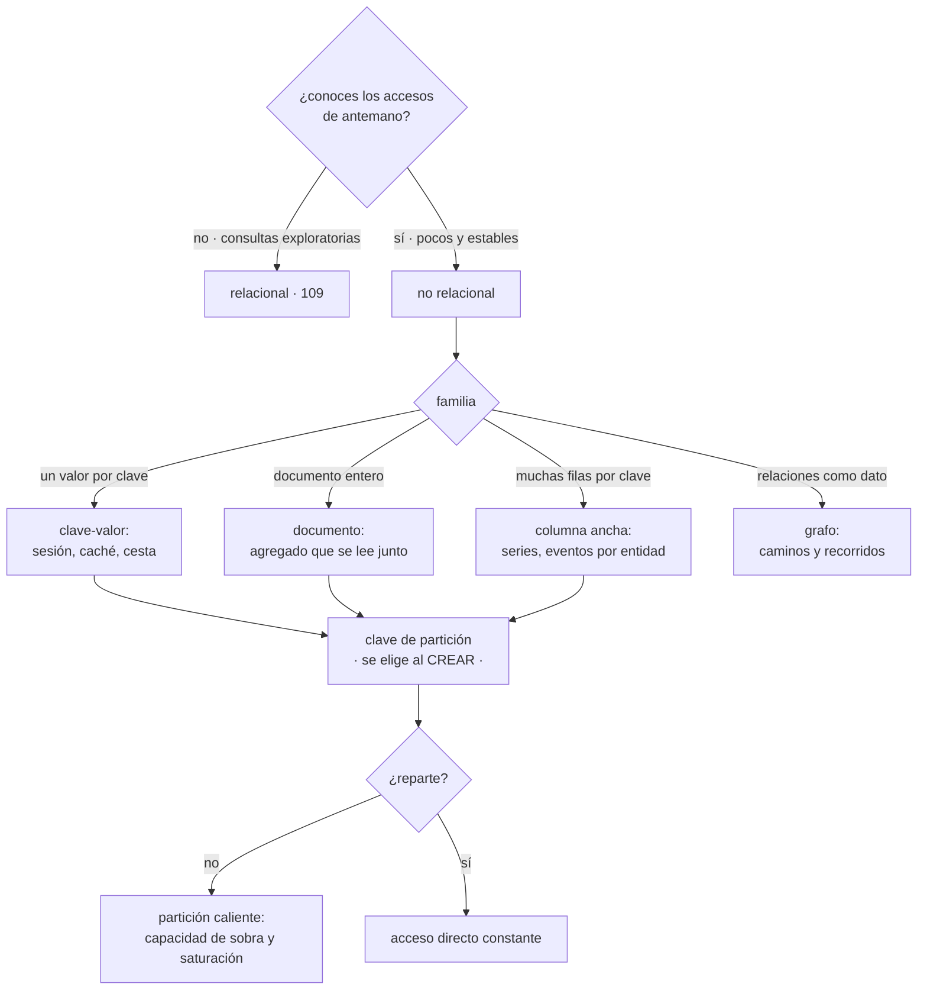

# 110 — NoSQL: clave-valor, documento, columna y grafo

> [← 109 · Bases relacionales administradas y pooling](../../part-09-data-messaging-serverless-integration/109-bases-relacionales-administradas-y-pooling/README.md) · [Índice de la parte](../README.md) · [111 · Caché, invalidación, TTL y consistencia →](../../part-09-data-messaging-serverless-integration/111-cache-invalidacion-ttl-y-consistencia/README.md)

**Parte:** 09 — Datos, mensajería, serverless e integración<br>
**Nivel:** avanzado · **Horas estimadas:** 4<br>
**Laboratorio:** `data` · **Estado:** `EXECUTABLE_CORE`

## 🎯 Propósito

Decidir cuándo un almacén no relacional es la elección correcta, con un criterio que no es «escala» sino otro: **cuánto sabes de antemano sobre cómo vas a consultar los datos**. La clase recorre las cuatro familias por lo que resuelven en un acceso directo y por lo que no pueden hacer, y se detiene en la decisión que la clase 108 predijo que dominaría esta parte —la clave de partición, que se elige al crear, decide el reparto y no se cambia— y en su consecuencia más cara: una partición caliente.

## 📚 Resultados de aprendizaje

Al finalizar podrás:

1. **Decidir** entre relacional y no relacional por lo que sabes de los accesos, no por el volumen.
2. **Distinguir** las cuatro familias por lo que cada una resuelve en un acceso directo.
3. **Diseñar** una clave de partición que reparta, y detectar una caliente.
4. **Modelar** por consulta, asumiendo el coste de las consultas que aún no existen.
5. **Elegir** el nivel de consistencia de cada lectura y saber qué se paga por él.

## 🧩 Conceptos centrales

| Concepto | Comprensión verificable |
|---|---|
| `modelar por consulta` | Diseñar la disposición de los datos a partir de los accesos conocidos. Lo contrario del modelo relacional, que normaliza primero y consulta después. |
| `clave de partición` | Campo que decide en qué partición vive cada elemento. Se elige al crear la tabla, determina el reparto de carga y no se cambia sin recrear. |
| `partición caliente` | Partición que recibe una proporción desmedida del tráfico. El sistema tiene capacidad de sobra y esa partición está saturada. |
| `clave de ordenación` | Segundo componente de la clave que ordena los elementos dentro de la partición. Es lo que permite recorrer rangos con un solo acceso. |
| `consistencia eventual` | Una lectura puede devolver un valor anterior durante un intervalo corto. Es más barata y más rápida; no siempre es aceptable. |
| `recorrido completo` | Leer la tabla entera porque la consulta no encaja con las claves. En estos sistemas es lento y se factura por cada elemento leído. |

## 🧠 Modelo mental

La base de datos correcta depende del patrón de acceso y de las garantías necesarias; distribuir datos convierte latencia, consistencia y fallos parciales en decisiones de diseño.

Aplicado a esta clase, separa siempre cuatro planos: **intención** (qué necesita el usuario),
**configuración** (qué declaramos), **estado observado** (qué existe de verdad) y
**evidencia** (cómo sabemos que cumple). Confundirlos produce diseños que se ven correctos
en un diagrama pero fallan al operar.

## 🗺️ Flujo de razonamiento



## 📖 Desarrollo

### 1. La pregunta que decide, y no es el volumen

El criterio habitual —«relacional hasta que no escale»— es malo porque el volumen rara vez es el problema. Un motor relacional administrado con índices correctos sirve millones de filas sin dificultad.

La pregunta que sí decide:

```text
¿sabes de antemano cómo vas a consultar estos datos?

  no, y van a aparecer consultas nuevas       → relacional
  sí, son pocos accesos y no van a cambiar    → no relacional
```

Y el motivo es que los dos modelos invierten el orden del diseño:

```text
RELACIONAL      modelas los DATOS: entidades, relaciones, formas normales
                y luego consultas como quieras
                el precio: el motor tiene que resolver combinaciones en
                tiempo de consulta

NO RELACIONAL   modelas las CONSULTAS: cada acceso conocido tiene su
                disposición de datos
                el precio: una consulta que no previste puede ser inviable
```

Y hay tres motivos legítimos para elegir no relacional que sí se sostienen:

```text
1. accesos por clave, muchísimos y muy simples
   sesiones, cestas, perfiles, caché persistente
   → el relacional también puede, y aquí no aporta nada su capacidad extra

2. escritura muy alta y sostenida sobre una entidad
   series temporales, eventos por dispositivo, registros
   → el reparto por partición es exactamente lo que hace falta

3. el propio dato es una red de relaciones que se recorren
   → esto es el grafo, y no lo hace bien ningún otro modelo
```

Y un motivo que **no** se sostiene y se usa mucho: «no queremos definir un esquema». El esquema no desaparece; se muda del motor al código, donde nadie lo valida.

```text
sin esquema en el motor
→ conviven cinco formas del mismo documento, escritas en tres años
→ y cada lectura tiene que saber tratarlas todas
```

La forma sana de trabajar sin esquema declarado es **versionar el documento** y tener una ruta de migración, no ignorar el problema:

```json
{"v": 3, "id": "c-1421", "nombre": "…", "direcciones": [ … ]}
```

### 2. Cuatro familias, por lo que resuelven

```text
CLAVE-VALOR
  resuelve   dame el valor de esta clave
  no resuelve  cualquier consulta que no sea por la clave
  encaja en  sesión, cesta, preferencias, resultados de cálculo
  cuidado    el valor entero se lee y se escribe: no metas dentro cosas
             que cambian a ritmos distintos

DOCUMENTO
  resuelve   dame este agregado completo, y filtra por campos indexados
  no resuelve  combinaciones entre colecciones a gran escala
  encaja en  entidades que se leen y escriben juntas: pedido con sus líneas
  cuidado    si el documento crece sin límite —un pedido con 50.000 eventos—
             el modelo se rompe

COLUMNA ANCHA
  resuelve   dame las filas de esta entidad, en este rango de tiempo
  no resuelve  consultas que no empiecen por la clave de partición
  encaja en  series temporales, eventos por usuario o por dispositivo
  cuidado    borrar es escribir marcas de borrado; borrar mucho hace daño

GRAFO
  resuelve   recorridos: de aquí a allá pasando por N saltos
  no resuelve  agregaciones masivas sobre todo el grafo
  encaja en  permisos heredados, recomendaciones, detección de fraude,
             dependencias
  cuidado    es el único de los cuatro cuya alternativa relacional es
             realmente mala: una consulta de profundidad variable en
             tablas es dolorosa
```

Y una regla de tamaño que evita disgustos en las tres primeras familias:

```text
si un elemento puede crecer sin límite, no es un elemento:
es una colección, y necesita su propia clave
```

El ejemplo clásico: el pedido con su historial de eventos dentro. Funciona hasta que un pedido tiene mil eventos, y entonces cada lectura del pedido lee los mil.

Y sobre el grafo, una precisión práctica: **casi siempre convive con otro almacén**. El grafo guarda las relaciones y los identificadores; los atributos completos viven en el sistema principal. Duplicar todo en el grafo es lo que hace que los grafos se abandonen.

### 3. La clave de partición: se elige al crear

Aquí está la decisión que la clase 108 predijo como dominante en esta parte, y es exactamente eso: **se elige al crear la tabla, decide cómo se reparte todo y cambiarla es recrear y recargar**.

La clave suele tener dos partes:

```text
clave de PARTICIÓN     decide en qué partición vive el elemento
clave de ORDENACIÓN    ordena dentro de la partición

acceso directo         partición + ordenación exactas
recorrido de rango     partición exacta + rango de ordenación
cualquier otra cosa    recorrido completo
```

Y la propiedad que hay que exigirle a la clave de partición:

```text
CARDINALIDAD ALTA        muchos valores distintos
REPARTO UNIFORME         ninguno concentra el tráfico
CONOCIDA EN LA CONSULTA  si no la sabes al consultar, no sirve
```

Las tres a la vez. Y los fallos típicos son incumplir una:

```text
estado del pedido como clave     5 valores → 5 particiones → fallo de cardinalidad
fecha del día como clave         todo el tráfico de hoy en una → fallo de reparto
identificador interno aleatorio  reparte muy bien y no lo sabes al consultar
                                 → fallo de conocimiento
```

**La partición caliente** es lo que ocurre al fallar el reparto, y su síntoma engaña:

```text
capacidad de la tabla        10.000 operaciones/s
límite por partición          1.000 operaciones/s
tráfico real                  3.000 operaciones/s

si el 80 % cae en una partición → 2.400 sobre un límite de 1.000
→ errores de limitación con la tabla al 30 % de su capacidad
```

Y las tres correcciones, en orden de preferencia:

```text
1. cambiar la clave por una que reparta de verdad
   → recrear; es la ley 14 cobrando su precio

2. añadir un sufijo de reparto artificial
   clave = "producto#1421#3"  con 3 de 0..9
   → reparte, y ahora cada lectura tiene que consultar los 10 sufijos

3. poner delante un caché para el elemento caliente
   → resuelve las lecturas y no las escrituras
```

La segunda es la que más se usa y conviene entender su precio: **multiplica por diez el coste de leer ese elemento**. Es un intercambio, no una solución gratis.

Y un caso que aparece siempre y que las tres correcciones no cubren: **el elemento genuinamente popular**. Un producto en portada recibe cien mil lecturas por segundo y ninguna clave lo reparte, porque es una sola cosa. Ahí la respuesta es la tercera, y es la clase 111.

### 4. Modelar por consulta, y lo que cuesta después

Si el acceso decide la disposición, cada acceso nuevo necesita una disposición nueva. De ahí salen los índices secundarios y el diseño de tabla única:

```text
ÍNDICE SECUNDARIO
  otra clave de partición sobre los mismos datos
  + permite un acceso que la clave principal no permite
  − se paga en escritura: cada escritura actualiza también el índice
  − y suele ser eventualmente consistente

TABLA ÚNICA
  varios tipos de entidad conviviendo con claves compuestas
  PK="CLI#1421"  SK="PERFIL"
  PK="CLI#1421"  SK="PEDIDO#2026-07-31#88"
  + un solo acceso trae el cliente y sus últimos pedidos
  − ilegible sin documentación, y la migración es un proyecto
```

Y la consecuencia honesta que hay que aceptar antes de empezar:

```text
una consulta que no estaba prevista cuesta
  un índice nuevo (dinero y escritura), o
  un recorrido completo (mucho dinero y lentitud), o
  copiar los datos a otro sistema
```

La tercera opción es la que acaba adoptando casi todo el mundo, y es legítima: **el almacén sirve al producto, y un segundo sistema sirve al análisis**. Es la materia de la clase 112.

**El coste, que en estos sistemas es parte del diseño.** Se factura por operación y por datos leídos, así que un acceso mal modelado es directamente una factura:

```text
leer un elemento por clave                       1 unidad
recorrer 100 elementos de una partición        ~ proporcional al tamaño leído
recorrido completo de 10 millones           decenas de miles de unidades
                                            y se paga aunque el filtro
                                            descarte casi todo
```

La última línea es la trampa: **filtrar no ahorra**. El filtro se aplica después de leer, así que se paga por todo lo leído.

**Consistencia.** Casi todos ofrecen dos niveles de lectura, y la elección es por acceso, no global:

```text
eventual   más barata y más rápida; puede devolver un valor anterior
fuerte     ve la última escritura confirmada; cuesta más y tarda más
```

Y la regla es la misma de la clase 109, porque el problema es el mismo:

```text
lectura que solo se muestra              eventual
lectura que decide una escritura         fuerte
```

Y las transacciones: existen, y **casi siempre acotadas** —a una partición, a un número de elementos, a una región—. Diseñar suponiendo transacciones amplias es el error que la clase 116 tendrá que reparar.

Y la lista de comprobación de la clase:

```text
☐ están escritos los accesos conocidos antes de elegir el almacén
☐ la clave de partición tiene cardinalidad, reparte y se conoce al consultar
☐ se ha estimado el tráfico de la partición más caliente, no solo el total
☐ ningún elemento puede crecer sin límite
☐ los documentos llevan versión y hay ruta de migración
☐ cada índice secundario tiene un acceso que lo justifica
☐ no hay recorridos completos en el camino de una petición
☐ el nivel de consistencia está elegido por acceso
☐ está previsto dónde irán las consultas no previstas
☐ el coste por operación está estimado con el patrón real
```

Y el cierre que enlaza con la clase siguiente: el elemento genuinamente popular no lo reparte ninguna clave, y la respuesta es ponerle algo delante. Qué se gana, qué se rompe y por qué invalidar es difícil es la materia de la clase 111.

## 🔬 Ejemplo trabajado

**CloudShop mueve tres conjuntos de datos a almacenes no relacionales. Uno sale bien, otro provoca un incidente de partición caliente y el tercero enseña lo que cuesta una consulta no prevista.**

**Caso 1: la sesión y la cesta. Sale bien y conviene entender por qué.**

```text
accesos conocidos     leer por identificador de sesión
                      escribir por identificador de sesión
                      caducar a las 72 h
accesos futuros       ninguno previsible
```

Un único acceso por clave, sin consultas exploratorias. Es el caso ideal.

```text                                    relacional     clave-valor
latencia p99 de lectura                     14 ms          1,2 ms
escrituras por segundo en el pico            3.100         3.100
carga que quitó a la base principal            —          41 % de escrituras
caducidad                                proceso nocturno  automática
```

Y el detalle que evitó un problema conocido: **la cesta y el histórico de navegación se guardaron por separado**, aunque pertenecen a la misma sesión. El histórico cambia en cada clic y la cesta pocas veces; juntos habrían obligado a reescribir la cesta entera constantemente.

**Caso 2: los eventos de pedido. Partición caliente en el segundo día.**

Se eligió una tabla de columna ancha para el historial de eventos de cada pedido. La primera clave:

```text
clave de partición   fecha (2026-07-31)
clave de ordenación  marca de tiempo + identificador de pedido
motivo               «así los informes diarios son un solo recorrido»
```

El segundo día en producción:

```text
capacidad de la tabla                   20.000 escrituras/s
límite por partición                     1.000 escrituras/s
tráfico real                             2.900 escrituras/s
en la partición de hoy                   2.900   ← el 100 %
errores de limitación                    el 66 % de las escrituras
utilización de la tabla                  14 %
```

Catorce por ciento de utilización y dos tercios de las escrituras rechazadas. Es el síntoma que engaña del apartado tercero, en su forma más pura: **la clave se eligió por la consulta de informes y no por el reparto de la escritura**.

La corrección exigió recrear la tabla y recargar 210 millones de elementos:

```text                                   clave por fecha    clave por pedido
clave de partición                       fecha              identificador de pedido
clave de ordenación                      tiempo + pedido    marca de tiempo
particiones activas                      1                  ~2,4 millones
escrituras rechazadas                    66 %               0 %
leer el historial de un pedido           recorrido           1 acceso
informe diario                           1 recorrido         ya no es posible
tiempo de la migración                     —                 31 h
```

Y la última fila es el intercambio real: **se ganó la escritura y se perdió el informe**. El informe se resolvió publicando los eventos también a almacenamiento de objetos, que es la clase 112.

Y la lección de la ley 14, medida: la decisión se tomó en veinte minutos de diseño y costó treinta y una horas de migración y dos días de errores.

**Caso 3: el catálogo, y la consulta que nadie previó.**

El catálogo se modeló por sus tres accesos conocidos:

```text
por identificador de producto            acceso directo
por categoría, ordenado por ventas       índice secundario
por marca                                índice secundario
```

A los cuatro meses, el equipo de producto pidió: «productos con existencias por debajo de N en cualquier categoría».

```text
opción A  índice nuevo sobre existencias
          → existencias cambian en cada venta
          → 4.100 escrituras/s adicionales al índice
          → coste estimado: 890 €/mes

opción B  recorrido completo cada 15 min
          → 2,1 millones de elementos leídos por ejecución
          → coste estimado: 1.240 €/mes
          → y el filtro no ahorra: se paga por todo lo leído

opción C  publicar los cambios a un segundo sistema para consultas libres
          → coste estimado: 210 €/mes, con retardo de ~1 min
```

Se eligió la C. Y la conclusión que se escribió en la decisión, que es la que este apartado defiende:

> «El almacén sirve al producto con sus accesos conocidos. Cualquier consulta nueva y exploratoria va al segundo sistema. Añadir un índice por cada pregunta nueva convierte la escritura en el cuello de botella.»

**Y un cuarto caso que no se hizo: el grafo.**

Se evaluó un almacén de grafo para las recomendaciones y se descartó, con el motivo escrito:

```text
recorridos necesarios              2 saltos, siempre
alternativa relacional             una tabla de asociación y dos combinaciones
latencia medida en relacional      18 ms
coste de operar un sistema más     alto
decisión                           no; se reconsiderará si aparecen
                                   recorridos de profundidad variable
```

Es el criterio del apartado segundo: **el grafo gana cuando la profundidad es variable**. Con dos saltos fijos, no aporta lo bastante para justificar un sistema más.

**Al año.**

```text                                          antes         después
latencia p99 de sesión                        14 ms          1,2 ms
escrituras quitadas a la base principal          —           41 %
escrituras rechazadas por partición caliente     —           0 %
migraciones forzadas por la clave de partición   —           1 (31 h)
índices secundarios añadidos por consultas
  nuevas                                         —           0
consultas exploratorias                    en el almacén   en el segundo sistema
sistemas de datos en producción                  1             4
```

La última fila es el coste que no aparece en ninguna comparativa de rendimiento: **se pasó de un sistema a cuatro**, y cada uno tiene su copia, su vigilancia, su plan de recuperación y su forma de fallar.

**La lección que esta clase traslada a la parte 09**: la migración de treinta y una horas no la causó un problema de escala. La causó **elegir la clave de partición por la consulta de informes en vez de por el reparto de la escritura**, en una decisión de veinte minutos que no se podía deshacer. Es la primera confirmación explícita de la predicción de la clase 108: en los servicios con estado, las decisiones de creación son las caras.

## 🧪 Laboratorio guiado

Ejecuta desde la raíz:

```bash
python classes/part-09-data-messaging-serverless-integration/110-nosql-clave-valor-documento-columna-y-grafo/lab.py
```

El laboratorio selecciona el motor de práctica **`data`** y produce
`lab_result.json`. El escenario, sus comprobaciones y el artefacto esperado corresponden a
esta clase; no requiere credenciales y deja explícito qué debe revalidarse en un sandbox real.

1. Lee `exercise.steps` y formula una predicción antes de ejecutar.
2. Ejecuta la práctica y verifica todos los elementos de `checks`.
3. Provoca el caso de `negative_test` y explica la señal observada.
4. Materializa `matriz-nosql` en `evidence/` usando la plantilla indicada.
5. Para proveedor real, sigue `sandbox.requires`, registra costo y ejecuta `destroy`.

### Evidencia esperada

El artefacto principal es un modelo de datos ligado a patrones de acceso. Además, la entrega debe incluir el comando ejecutado,
la salida estructurada y una conclusión que no exceda lo observado.

## 🏆 Reto verificable

Construye **`matriz-nosql`** para el caso CloudShop. Incluye una alternativa descartada,
un supuesto que pueda falsarse, una prueba de fallo y una decisión de rollback.

## ✅ Criterio de aceptación

- [ ] `lab.py` termina con código 0 y genera JSON válido.
- [ ] La entrega conecta al menos tres requisitos con mecanismos verificables.
- [ ] Existe una prueba positiva y una prueba negativa con evidencia.
- [ ] Seguridad, costo y operación aparecen como decisiones, no como anexos.
- [ ] Se declara una limitación y una condición que obligaría a revisar el diseño.
- [ ] Otra persona puede repetir el recorrido sin conocimiento tácito.

## ⚠️ Errores frecuentes

| Síntoma | Causa probable | Corrección |
|---|---|---|
| Errores de limitación con la tabla al 15 % de su capacidad | Partición caliente: la clave no reparte y el tráfico se concentra | Estima el tráfico de la partición más cargada, no el total; corrige la clave, y si no puedes, reparte con sufijo asumiendo que multiplica el coste de lectura. |
| Cada consulta nueva exige un índice y la escritura se satura | Se está usando un almacén modelado por consulta para consultas exploratorias | Publica los cambios a un segundo sistema para las consultas libres y deja el almacén para los accesos conocidos. |
| La factura crece con consultas que devuelven pocos resultados | Hay recorridos completos: el filtro se aplica tras leer, y se paga por todo lo leído | Rediseña el acceso para que use clave de partición y rango, o muévelo al segundo sistema. |
| Leer una entidad se vuelve lento con el tiempo | Un elemento crece sin límite porque contiene una colección dentro | Si algo puede crecer sin límite, dale su propia clave en vez de anidarlo. |
| El mismo documento existe en cinco formas distintas | Sin esquema declarado, el esquema se mudó al código y nadie lo valida | Versiona el documento, valida al escribir y ten una ruta de migración. |
| Un producto popular satura su partición y ninguna clave lo reparte | Es un solo elemento genuinamente caliente | Pon un caché delante para las lecturas; ninguna clave reparte lo que es una sola cosa. |

## 🛡️ Seguridad, ética y costo

Trabaja con cuentas propias o sandboxes autorizados. No publiques secretos, identificadores
reales ni datos personales. Antes de crear recursos pagos define presupuesto, etiquetas y
comando de destrucción; después verifica que no queden recursos huérfanos. Los ejemplos
locales enseñan contratos, pero no certifican cumplimiento ni disponibilidad de producción.

## ❓ Preguntas de comprobación

1. ¿Qué pregunta decide entre relacional y no relacional, y por qué no es el volumen?
2. ¿Qué tres propiedades debe cumplir una clave de partición a la vez?
3. ¿Por qué una tabla puede rechazar escrituras estando al 15 % de su capacidad?
4. ¿Qué precio tiene repartir con un sufijo artificial?
5. ¿Por qué filtrar no reduce el coste de un recorrido completo?

## 🔗 Referencias

- AWS (2025). *DynamoDB: partition keys and best practices* — cardinalidad, reparto y particiones calientes. <https://docs.aws.amazon.com/amazondynamodb/latest/developerguide/bp-partition-key-design.html>
- Google Cloud (2025). *Bigtable schema design* — clave de fila, reparto y antipatrones. <https://cloud.google.com/bigtable/docs/schema-design>
- Azure (2025). *Cosmos DB: partitioning and horizontal scaling* — clave de partición lógica y física. <https://learn.microsoft.com/azure/cosmos-db/partitioning-overview>
- Kleppmann, M. (2017). *Designing Data-Intensive Applications*, caps. 2 y 6 — modelos de datos y particionado. <https://dataintensive.net/>
- Neo4j (2025). *When to use a graph database* — profundidad variable como criterio de elección. <https://neo4j.com/docs/getting-started/data-modeling/>
- Documentación oficial vigente del servicio implementado; registra URL y fecha de consulta.

---

> [Evaluación](assessment.md) · [Contrato de clase](lesson.yaml) · [Índice de la parte](../README.md)

**📥 Descargar:** [Parte 09 en PDF](../../../site/downloads/partes/manual-parte-09-data-messaging-serverless-integration.pdf) · [Manual integral](../../../site/downloads/multi-cloud-engineering-manual-v2.0.pdf)

| Anterior | Índice | Siguiente |
|---|---|---|
| [← 109 · Bases relacionales administradas y pooling](../../part-09-data-messaging-serverless-integration/109-bases-relacionales-administradas-y-pooling/README.md) | [Parte 09](../README.md) · [Programa](../../README.md) | [111 · Caché, invalidación, TTL y consistencia →](../../part-09-data-messaging-serverless-integration/111-cache-invalidacion-ttl-y-consistencia/README.md) |
