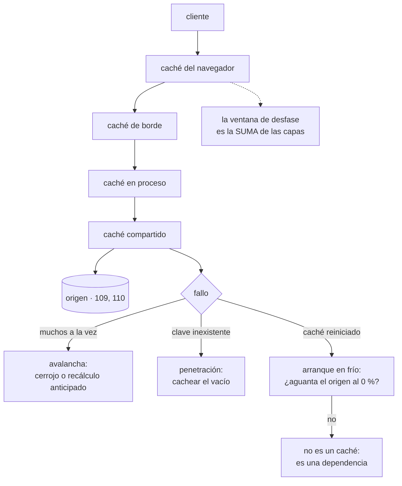

# 111 — Caché, invalidación, TTL y consistencia

> [← 110 · NoSQL: clave-valor, documento, columna y grafo](../../part-09-data-messaging-serverless-integration/110-nosql-clave-valor-documento-columna-y-grafo/README.md) · [Índice de la parte](../README.md) · [112 · Object storage, data lake y formatos columnares →](../../part-09-data-messaging-serverless-integration/112-object-storage-data-lake-y-formatos-columnares/README.md)

**Parte:** 09 — Datos, mensajería, serverless e integración<br>
**Nivel:** avanzado · **Horas estimadas:** 4<br>
**Laboratorio:** `data` · **Estado:** `EXECUTABLE_CORE`

## 🎯 Propósito

Poner un caché delante de lo que la clase 110 dejó sin resolver —el elemento genuinamente popular— y hacerlo entendiendo las tres cosas que casi nunca se dicen: que la proporción de aciertos no mide nada por sí sola, que **invalidar es el problema difícil y tiene una solución sencilla que casi nadie usa**, y que un caché del que el sistema no puede prescindir ha dejado de ser una optimización para convertirse en una dependencia con requisito de disponibilidad.

## 📚 Resultados de aprendizaje

Al finalizar podrás:

1. **Decidir** qué cachear a partir del coste de los fallos, no de la proporción de aciertos.
2. **Elegir** el patrón de lectura y escritura, y saber qué garantiza cada uno.
3. **Invalidar** con claves versionadas en vez de perseguir cada ruta de escritura.
4. **Prevenir** avalancha, penetración y arranque en frío.
5. **Distinguir** un caché que optimiza de uno del que el sistema depende.

## 🧩 Conceptos centrales

| Concepto | Comprensión verificable |
|---|---|
| `caché aparte` | La aplicación consulta el caché, y si falla, lee el origen y guarda. El patrón más común y el que deja más decisiones en manos de quien escribe el código. |
| `clave versionada` | Incluir en la clave un número que cambia al modificar el dato. Invalidar deja de ser borrar: el valor viejo simplemente deja de consultarse. |
| `avalancha` | Muchas peticiones fallan a la vez sobre la misma clave —normalmente al caducar— y todas van al origen simultáneamente. |
| `penetración` | Peticiones por claves que no existen: nunca aciertan y siempre llegan al origen. Es el patrón que un atacante usa para saltarse el caché. |
| `ventana de desfase` | Tiempo máximo durante el que se puede servir un valor viejo. Con varias capas, se suman. |
| `caché portante` | Caché sin el cual el origen no aguanta el tráfico. Deja de ser una optimización y pasa a necesitar disponibilidad, réplica y plan de recuperación. |

## 🧠 Modelo mental

La base de datos correcta depende del patrón de acceso y de las garantías necesarias; distribuir datos convierte latencia, consistencia y fallos parciales en decisiones de diseño.

Aplicado a esta clase, separa siempre cuatro planos: **intención** (qué necesita el usuario),
**configuración** (qué declaramos), **estado observado** (qué existe de verdad) y
**evidencia** (cómo sabemos que cumple). Confundirlos produce diseños que se ven correctos
en un diagrama pero fallan al operar.

## 🗺️ Flujo de razonamiento



## 📖 Desarrollo

### 1. Qué compra un caché, y qué medida sirve

Un caché no hace que el sistema sea más rápido: hace que **el caso frecuente sea barato**, y que todos los casos sean más complicados. Conviene tenerlo claro porque decide qué merece la pena cachear.

```text
merece la pena cuando
  el mismo dato se pide muchas veces
  calcularlo o traerlo es caro
  y se tolera servirlo algo desfasado

no merece la pena cuando
  cada petición pide algo distinto
  el origen ya es barato
  o el dato no puede estar desfasado ni un segundo
```

Y la medida habitual —proporción de aciertos— **no dice nada sola**:

```text
caché A   95 % de aciertos; el 5 % restante cuesta 8 ms
caché B   70 % de aciertos; el 30 % restante cuesta 900 ms
```

B protege muchísimo más que A. Lo que hay que medir es lo que se ahorra, no la proporción:

```text
carga que llega al origen, con y sin caché
latencia del percentil 99, no la media
  → la media la domina el acierto; el usuario sufre el fallo
coste del fallo: latencia y carga en el origen
proporción de valores servidos ya desfasados
```

Y las capas, que es lo primero que hay que dibujar, porque el desfase **se suma**:

```text
navegador          60 s
borde             300 s
en proceso         30 s
compartido        600 s
                 ──────
peor caso        990 s ≈ 16 min de desfase posible
```

Casi nadie hace esta suma, y es la explicación de la mitad de los «he cambiado el precio y sigue saliendo el viejo».

Y una distinción entre dos capas que se confunden:

```text
EN PROCESO      rapidísimo, y cada instancia tiene el suyo
                → 40 instancias = 40 versiones distintas del dato
                → e invalidar exige avisar a las 40
COMPARTIDO      un salto de red, y una sola verdad
                → invalidar es un sitio
```

La combinación de los dos es potente y es también la que más desfases raros produce: un dato invalidado en el compartido sigue vivo treinta segundos en cuarenta procesos.

### 2. Patrones, y qué garantiza cada uno

```text
CACHÉ APARTE  (el más común)
  leer:     mirar caché → si falla, leer origen → guardar
  escribir: escribir origen → invalidar caché
  + simple, y el caché puede caerse sin romper nada
  − hay una ventana entre escribir e invalidar
  − y cada sitio del código que escriba tiene que acordarse de invalidar

LECTURA A TRAVÉS
  el caché sabe cómo traer del origen
  + el código no gestiona fallos
  − más difícil de razonar cuando algo va mal

ESCRITURA A TRAVÉS
  escribir caché y origen a la vez, de forma síncrona
  + el caché nunca queda viejo
  − toda escritura paga la latencia de los dos

ESCRITURA DIFERIDA
  escribir en caché y volcar al origen después
  + escrituras rapidísimas
  − si el caché se pierde, se pierden datos → esto no es un caché,
    es un almacén primario con otro nombre
```

Y el orden importa más de lo que parece en el patrón más usado:

```text
mal   invalidar el caché → escribir el origen
      entre las dos, otra petición lee el valor VIEJO y lo vuelve a cachear
      → el caché queda viejo indefinidamente

bien  escribir el origen → invalidar el caché
      la ventana de desfase existe y es corta y se cierra sola
```

Y aun así la segunda tiene una carrera conocida y difícil de evitar: una lectura que empezó antes de la escritura puede guardar su valor viejo después de la invalidación. Con desfase corto se acepta; cuando no se puede aceptar, la respuesta es el apartado siguiente.

### 3. Invalidar: la solución que casi nadie usa

Las tres formas de invalidar, con lo que cuesta cada una:

```text
1. CADUCIDAD
   el valor vive N segundos y desaparece
   + no hay nada que mantener
   − el dato está viejo hasta N segundos, siempre
   − y todas las claves caducan a la vez si se llenaron a la vez → avalancha

2. INVALIDACIÓN EXPLÍCITA
   cada escritura borra las claves afectadas
   + el desfase es mínimo
   − hay que acordarse en CADA ruta de escritura, incluidas las de
     mantenimiento, las migraciones y los procesos por lotes
   − y la clave que se olvida no da ningún error: simplemente sirve mal

3. CLAVE VERSIONADA
   la clave incluye una versión que cambia al modificar el dato
   + invalidar es cambiar un número; el valor viejo deja de consultarse
   + no hay ruta de escritura que se pueda olvidar
   − ocupa memoria hasta que caduque, y hay que tener política de expulsión
```

La tercera resuelve el problema de la segunda de raíz y se usa poco:

```text
en vez de     producto:1421
usar          producto:1421:v7

y la versión sale de algo que ya cambia con el dato:
  una columna de versión, la marca de última modificación,
  o la etiqueta que devuelve el propio origen
```

Y su variante para invalidar grupos enteros sin recorrer claves:

```text
catalogo:v3:producto:1421
catalogo:v3:categoria:12

cambiar catalogo a v4 invalida el catálogo ENTERO de una vez
→ y no hay que borrar nada
```

Y una advertencia sobre las caducidades: **conviene que no sean todas iguales**. Si mil claves se llenaron en el mismo segundo y caducan a la vez, mil peticiones van al origen a la vez. Añadir una variación aleatoria lo resuelve:

```python
ttl = base + random.randint(-base // 10, base // 10)
```

Y qué **no** cachear, que es una lista corta y importante:

```text
decisiones de autorización, salvo con caducidad muy corta y revocación
  → un permiso retirado que sigue vivo 10 minutos es un problema de seguridad
datos de un usuario bajo una clave que no incluya al usuario
  → es la fuga entre usuarios más común que existe
lo que se escribe mucho más de lo que se lee
```

La segunda merece detenerse: si la clave es `perfil` en vez de `perfil:cliente:1421`, el segundo usuario ve los datos del primero. Ocurre sobre todo en cachés en proceso y en cachés de borde mal configuradas, donde la clave se deriva de la ruta y no de la sesión.

### 4. Los tres fallos, y la pregunta que lo decide todo

**Avalancha.** Una clave muy popular caduca y las peticiones que llegan en ese instante fallan todas a la vez:

```text
clave con 4.000 peticiones/s
coste de recalcularla                800 ms
peticiones que llegan durante ese cálculo    3.200
→ 3.200 consultas simultáneas al origen por el mismo dato
```

Las tres defensas, que se combinan:

```text
cerrojo    solo una petición recalcula; las demás esperan o sirven el viejo
recálculo anticipado   se refresca ANTES de caducar, en segundo plano
variación de caducidad  evita que muchas claves caduquen juntas
```

La segunda es la mejor para las claves muy populares: **el valor nunca llega a caducar porque siempre se renueva antes**.

**Penetración.** Peticiones por claves que no existen: nunca aciertan y siempre llegan al origen.

```text
peticiones a /producto/999999999  → no existe → no se cachea → al origen
→ repetido, es una forma trivial de saturar la base de datos
```

La defensa es cachear también el vacío, con caducidad corta:

```text
guardar «no existe» durante 30 s
y validar el formato antes de consultar
```

**Arranque en frío.** Y aquí está la pregunta que decide la naturaleza del caché:

```text
si el caché se vacía ahora mismo, ¿aguanta el origen?

  sí   → es una optimización; puede caerse y el sistema se degrada
  no   → NO es un caché: es una dependencia con requisito de disponibilidad
```

Y hay que responderla con números, no con intuición:

```text
tráfico total                        12.000 peticiones/s
proporción de aciertos                     94 %
carga que llega al origen                 720 peticiones/s
capacidad del origen                    1.500 peticiones/s
carga con el caché vacío               12.000 peticiones/s   ← 8× la capacidad
```

Con esos números, **el caché es portante**, y eso cambia todo lo que hay que hacer con él:

```text
réplica y conmutación, como en la clase 109
plan de recalentamiento tras un reinicio
limitación de caudal hacia el origen, para que el frío no lo tumbe
y un ensayo: vaciar el caché en preproducción y medir
```

Y una salida intermedia muy útil: **servir el valor viejo cuando el origen falla**. Si el origen no responde, devolver lo caducado es casi siempre mejor que devolver un error.

```text
valor fresco       se sirve
valor caducado y origen sano       se recalcula
valor caducado y origen caído      se sirve el viejo, y se registra
```

Y la lista de comprobación de la clase:

```text
☐ está medido el coste del fallo, no solo la proporción de aciertos
☐ están dibujadas las capas y sumada la ventana de desfase total
☐ se escribe el origen antes de invalidar, nunca al revés
☐ la invalidación usa claves versionadas en vez de borrado por ruta
☐ las caducidades llevan variación aleatoria
☐ las claves muy populares se refrescan antes de caducar
☐ se cachea el vacío para evitar penetración
☐ ninguna clave de datos de usuario carece del identificador de usuario
☐ las decisiones de autorización no se cachean sin revocación
☐ está respondido con números si el origen aguanta el caché vacío
☐ si es portante: réplica, limitación hacia el origen y ensayo de vaciado
```

Y el cierre que enlaza con la clase siguiente: hasta aquí, los datos que sirven al producto. Los que no caben en ninguno de estos almacenes —los históricos, los grandes, los que se consultan de formas que nadie previó— necesitan otro sitio, y es la materia de la clase 112.

## 🔬 Ejemplo trabajado

**CloudShop pone caché delante del catálogo para resolver el producto popular que la clase 110 dejó abierto. En nueve meses ocurren los tres fallos del apartado cuarto, más uno que no está en la lista y es el más grave.**

**Punto de partida.**

```text
lecturas del catálogo                    12.000 / s
capacidad del almacén                     1.500 / s
producto en portada                       4.100 / s sobre un solo elemento
latencia p99                                 34 ms
```

Caché compartido, patrón de caché aparte, caducidad de 300 s.

```text                                    sin caché      con caché
aciertos                                      —            94 %
carga al origen                          12.000/s        720/s
latencia p99                                34 ms         6 ms
coste mensual del almacén                  2.900 €        410 €
```

**Fallo 1: avalancha, a los once días.**

```text
03:14  caducan a la vez las claves llenadas durante el despliegue de las 22:14
03:14  1.840 claves caducadas en el mismo segundo
03:14  la carga al origen pasa de 720/s a 9.100/s
03:15  el almacén limita; errores en el 41 % de las peticiones
03:19  se estabiliza al recachearse
```

La causa es la del apartado tercero: **el caché se llenó de golpe tras un despliegue, así que caducó de golpe**. Las tres defensas y su efecto:

```text                                    antes    variación   + recálculo anticipado
pico de carga al origen                  9.100/s    2.300/s        810/s
claves caducadas en el mismo segundo      1.840        41            —
errores                                    41 %       0 %           0 %
```

El recálculo anticipado se aplicó solo a las 500 claves más pedidas: **el 0,04 % de las claves recibía el 68 % del tráfico**.

**Fallo 2: penetración, y es deliberada.**

```text
14:20  llegan 3.400 peticiones/s a rutas de producto con identificadores
       inventados
14:20  ninguna acierta; todas llegan al origen
14:22  el origen satura; el catálogo entero deja de responder
```

No hacía falta ninguna sofisticación: bastaba pedir productos que no existen.

```text                                    antes            después
cachear el vacío                          no             sí, 30 s
validación de formato antes de consultar  no             sí
carga al origen con el mismo ataque    3.400/s          ~40/s
```

**Fallo 3: el caché se reinicia.**

Una actualización de mantenimiento vació el caché a las 11:40 de un martes:

```text
carga al origen tras el vaciado          12.000/s
capacidad del origen                      1.500/s
tiempo de caída total                    9 minutos
tiempo hasta recuperar el 90 % de aciertos   14 min
```

La pregunta del apartado cuarto se respondió con números **después** del incidente, cuando debía haberse respondido antes:

```text
carga con el caché vacío / capacidad del origen = 8×
→ el caché es portante
```

Y con esa respuesta, el tratamiento cambió por completo:

```text                                          antes         después
réplica del caché                              no             sí
conmutación probada                            no           trimestral
limitación de caudal hacia el origen           no        1.200/s, con cola
servir valor caducado si el origen falla       no             sí
recalentamiento tras reinicio                  no      las 500 claves top
ensayo de vaciado en preproducción             no           trimestral

caída al repetir el ensayo                   9 min          0 min
                                                     (degradación de 90 s)
```

**El cuarto fallo, que no está en la lista y es el peor.**

Un caché en proceso se añadió para las preferencias del usuario, con esta clave:

```text
clave = "preferencias"
```

Sin el identificador de usuario.

```text
usuarios que vieron preferencias de otra persona    no determinado
detectado por                        un cliente que llamó a soporte
tiempo hasta corregir                            2 h 10
tiempo que llevaba desplegado                    6 días
datos expuestos      dirección de envío y últimos 4 dígitos de la tarjeta
```

Y lo que se hizo para que no vuelva a pasar, que es más útil que la corrección:

```text
regla en la revisión: toda clave de caché de datos de usuario debe
  contener el identificador del sujeto
prueba automática: dos sesiones distintas piden lo mismo y se compara
  que las respuestas difieren
comprobación estática de las claves construidas con literales
```

La prueba automática de la segunda línea detectó otros **dos** casos en el resto del sistema, ambos en cachés de borde donde la clave se derivaba de la ruta.

**La ventana de desfase, que nadie había sumado.**

Tras una queja recurrente de comercio —«cambio un precio y tarda en verse»— se dibujaron las capas:

```text
navegador                    60 s
borde                       600 s
en proceso                   30 s
compartido                  300 s
                          ──────
peor caso                   990 s ≈ 16 min
```

Y la corrección no fue bajar caducidades, que habría multiplicado la carga, sino **claves versionadas** derivadas de la marca de modificación del producto:

```text                                    caducidad      clave versionada
desfase peor caso                        16 min             ~2 s
caducidad del borde                      600 s              86.400 s
carga al origen                          720/s              310/s
rutas de escritura que hay que recordar
invalidar                                   7                  0
```

La penúltima fila es lo contraintuitivo: **al versionar las claves se pudo subir la caducidad**, porque el valor viejo ya no molesta a nadie. Menos desfase y menos carga a la vez.

**A los nueve meses.**

```text                                          antes         después
carga al origen                            12.000/s          310/s
latencia p99                                 34 ms          5 ms
desfase peor caso                           16 min           ~2 s
rutas de escritura que invalidan a mano          7              0
avalanchas                                 1 / mes            0
caída por caché vacío                       9 min      0 (degradación 90 s)
fugas entre usuarios                             3              0
coste mensual del almacén                   2.900 €          380 €
caché clasificado como portante                 no             sí
```

**La lección que esta clase traslada a la parte 09**: el caché resolvió el elemento popular en una tarde, y los nueve meses siguientes fueron **descubrir que era una dependencia crítica sin ninguno de los cuidados de una**. La pregunta «¿aguanta el origen con el caché vacío?» costó nueve minutos de caída por no haberla respondido antes, y es la única de esta clase que no admite una respuesta aproximada.

## 🧪 Laboratorio guiado

Ejecuta desde la raíz:

```bash
python classes/part-09-data-messaging-serverless-integration/111-cache-invalidacion-ttl-y-consistencia/lab.py
```

El laboratorio selecciona el motor de práctica **`data`** y produce
`lab_result.json`. El escenario, sus comprobaciones y el artefacto esperado corresponden a
esta clase; no requiere credenciales y deja explícito qué debe revalidarse en un sandbox real.

1. Lee `exercise.steps` y formula una predicción antes de ejecutar.
2. Ejecuta la práctica y verifica todos los elementos de `checks`.
3. Provoca el caso de `negative_test` y explica la señal observada.
4. Materializa `estrategia-cache` en `evidence/` usando la plantilla indicada.
5. Para proveedor real, sigue `sandbox.requires`, registra costo y ejecuta `destroy`.

### Evidencia esperada

El artefacto principal es un modelo de datos ligado a patrones de acceso. Además, la entrega debe incluir el comando ejecutado,
la salida estructurada y una conclusión que no exceda lo observado.

## 🏆 Reto verificable

Construye **`estrategia-cache`** para el caso CloudShop. Incluye una alternativa descartada,
un supuesto que pueda falsarse, una prueba de fallo y una decisión de rollback.

## ✅ Criterio de aceptación

- [ ] `lab.py` termina con código 0 y genera JSON válido.
- [ ] La entrega conecta al menos tres requisitos con mecanismos verificables.
- [ ] Existe una prueba positiva y una prueba negativa con evidencia.
- [ ] Seguridad, costo y operación aparecen como decisiones, no como anexos.
- [ ] Se declara una limitación y una condición que obligaría a revisar el diseño.
- [ ] Otra persona puede repetir el recorrido sin conocimiento tácito.

## ⚠️ Errores frecuentes

| Síntoma | Causa probable | Corrección |
|---|---|---|
| Picos de carga al origen a horas fijas | Muchas claves se llenaron a la vez y caducan a la vez | Añade variación aleatoria a la caducidad y refresca en segundo plano las claves más pedidas antes de que caduquen. |
| El origen se satura con peticiones por identificadores inexistentes | Penetración: lo que no existe nunca se cachea y siempre llega al origen | Cachea el resultado vacío con caducidad corta y valida el formato antes de consultar. |
| Un reinicio del caché tumba el sistema | El origen no tiene capacidad para el tráfico completo: el caché es portante | Calcula la relación entre tráfico total y capacidad del origen; si es mayor que uno, trata el caché como dependencia: réplica, limitación de caudal, recalentamiento y ensayo de vaciado. |
| Un usuario ve datos de otro | La clave de caché no incluye el identificador del sujeto | Exige el identificador en toda clave de datos de usuario y añade una prueba que compare respuestas de dos sesiones distintas. |
| Se cambia un dato y sigue viéndose el viejo mucho tiempo después | Hay varias capas de caché y sus ventanas de desfase se suman | Dibuja las capas, suma las caducidades y sustituye la caducidad por claves versionadas donde el desfase importe. |
| Una ruta de escritura olvidó invalidar y nadie se entera | La invalidación explícita depende de acordarse en cada sitio, y olvidarla no produce error | Usa claves versionadas: el valor viejo deja de consultarse sin que nadie tenga que borrarlo. |

## 🛡️ Seguridad, ética y costo

Trabaja con cuentas propias o sandboxes autorizados. No publiques secretos, identificadores
reales ni datos personales. Antes de crear recursos pagos define presupuesto, etiquetas y
comando de destrucción; después verifica que no queden recursos huérfanos. Los ejemplos
locales enseñan contratos, pero no certifican cumplimiento ni disponibilidad de producción.

## ❓ Preguntas de comprobación

1. ¿Por qué la proporción de aciertos no basta para evaluar un caché?
2. ¿Por qué se escribe el origen antes de invalidar y no al revés?
3. ¿Qué ventaja tiene una clave versionada frente a la invalidación explícita?
4. ¿Qué es una avalancha y con qué tres defensas se previene?
5. ¿Cómo se decide si un caché es una optimización o una dependencia?

## 🔗 Referencias

- Redis (2025). *Key eviction and expiration* — políticas de expulsión, caducidad y su efecto en la carga. <https://redis.io/docs/latest/develop/reference/eviction/>
- Nygard, M. (2018). *Release It!*, cap. 5 — caché, avalancha y degradación controlada. <https://pragprog.com/titles/mnee2/release-it-second-edition/>
- Facebook Engineering (2013). *Scaling Memcache at Facebook* — cerrojo de recálculo y avalancha en producción. <https://www.usenix.org/system/files/conference/nsdi13/nsdi13-final170_update.pdf>
- MDN (2025). *HTTP caching* — capas de caché, validadores y control de desfase. <https://developer.mozilla.org/en-US/docs/Web/HTTP/Caching>
- AWS (2025). *ElastiCache: caching strategies and best practices* — caché aparte, escritura a través y recalentamiento. <https://docs.aws.amazon.com/AmazonElastiCache/latest/dg/Strategies.html>
- Documentación oficial vigente del servicio implementado; registra URL y fecha de consulta.

---

> [Evaluación](assessment.md) · [Contrato de clase](lesson.yaml) · [Índice de la parte](../README.md)

| Anterior | Índice | Siguiente |
|---|---|---|
| [← 110 · NoSQL: clave-valor, documento, columna y grafo](../../part-09-data-messaging-serverless-integration/110-nosql-clave-valor-documento-columna-y-grafo/README.md) | [Parte 09](../README.md) · [Programa](../../README.md) | [112 · Object storage, data lake y formatos columnares →](../../part-09-data-messaging-serverless-integration/112-object-storage-data-lake-y-formatos-columnares/README.md) |
