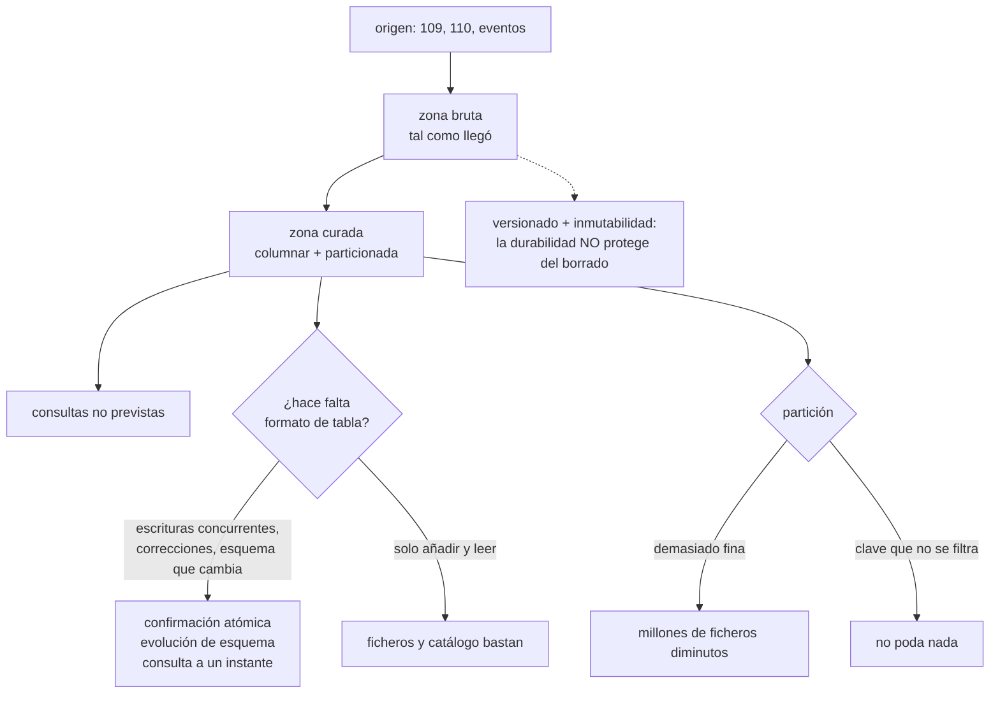

# 112 — Object storage, data lake y formatos columnares

> [← 111 · Caché, invalidación, TTL y consistencia](../../part-09-data-messaging-serverless-integration/111-cache-invalidacion-ttl-y-consistencia/README.md) · [Índice de la parte](../README.md) · [113 · Colas, entrega, reintentos y dead-letter queues →](../../part-09-data-messaging-serverless-integration/113-colas-entrega-reintentos-y-dead-letter-queues/README.md)

**Parte:** 09 — Datos, mensajería, serverless e integración<br>
**Nivel:** avanzado · **Horas estimadas:** 4<br>
**Laboratorio:** `data` · **Estado:** `EXECUTABLE_CORE`

## 🎯 Propósito

Construir el sitio donde van las consultas que la clase 110 dejó sin casa: las que nadie previó, las históricas y las que recorren millones de filas. La clase explica por qué el almacenamiento de objetos **no es un sistema de ficheros** y qué se rompe al tratarlo como tal, desarrolla el formato columnar con la aritmética de lo que ahorra, y se detiene en los dos errores que arruinan un lago de datos: **millones de ficheros diminutos y una partición que no poda nada**.

## 📚 Resultados de aprendizaje

Al finalizar podrás:

1. **Enumerar** lo que el almacenamiento de objetos no hace y qué patrones se rompen por suponerlo.
2. **Proteger** los datos de un borrado propio, que la durabilidad no cubre.
3. **Calcular** lo que ahorra un formato columnar frente a uno por filas.
4. **Particionar** de modo que las consultas poden, sin generar ficheros diminutos.
5. **Justificar** cuándo hace falta un formato de tabla por encima de los ficheros.

## 🧩 Conceptos centrales

| Concepto | Comprensión verificable |
|---|---|
| `espacio de nombres plano` | No hay directorios: hay claves con barras. Renombrar una carpeta es copiar y borrar cada objeto, uno a uno. |
| `durabilidad frente a borrado` | La durabilidad protege del fallo del soporte. No protege de que alguien —o algo— borre. Son problemas distintos con soluciones distintas. |
| `formato columnar` | Los valores de una misma columna se guardan juntos. Permite leer solo las columnas necesarias y comprimir mucho mejor. |
| `poda por partición` | Descartar ficheros enteros sin abrirlos porque la ruta indica que no contienen lo buscado. Es el mayor ahorro de un lago. |
| `problema del fichero pequeño` | Muchos objetos diminutos hacen que el tiempo se vaya en abrir ficheros en vez de en leer datos. Es el fallo más común de un lago. |
| `formato de tabla` | Capa de metadatos sobre los ficheros que aporta confirmación atómica, evolución de esquema y consulta a un instante pasado. |

## 🧠 Modelo mental

La base de datos correcta depende del patrón de acceso y de las garantías necesarias; distribuir datos convierte latencia, consistencia y fallos parciales en decisiones de diseño.

Aplicado a esta clase, separa siempre cuatro planos: **intención** (qué necesita el usuario),
**configuración** (qué declaramos), **estado observado** (qué existe de verdad) y
**evidencia** (cómo sabemos que cumple). Confundirlos produce diseños que se ven correctos
en un diagrama pero fallan al operar.

## 🗺️ Flujo de razonamiento



## 📖 Desarrollo

### 1. No es un sistema de ficheros

El almacenamiento de objetos parece un disco con carpetas y no lo es. Las diferencias no son cosméticas: cada una rompe un patrón habitual.

```text
no hay directorios          las barras son parte de la clave
                            «renombrar una carpeta» = copiar y borrar N objetos

no se modifica una parte    para cambiar un byte se reescribe el objeto entero

no se añade al final        no hay escritura incremental sobre un objeto
                            → un registro que crece necesita objetos nuevos

listar es una operación     y cuesta; listar un prefijo con millones de
                            objetos es lento y se factura

la operación se factura     no solo los bytes: también cada petición
```

Y de esas cinco salen los errores típicos:

```text
usarlo como sistema de ficheros con un adaptador
  → un renombrado de carpeta se convierte en horas
escribir un fichero por evento
  → millones de objetos y una factura dominada por peticiones
listar para saber qué hay
  → el listado es el cuello de botella, no la lectura
```

La tercera se resuelve con la idea que sostiene todo lo demás: **no listar, sino tener un catálogo**. Un fichero de manifiesto —o un formato de tabla, apartado cuarto— dice qué ficheros componen el conjunto, y la consulta no necesita preguntar al almacenamiento qué existe.

Y una propiedad que sí ha mejorado y conviene no arrastrar como mito: la escritura de un objeto nuevo es **visible inmediatamente** en los tres grandes proveedores desde hace años. Lo que sigue sin ser atómico es todo lo que abarque varios objetos:

```text
escribir un objeto            atómico
escribir 200 objetos          NO es atómico
  → un lector puede ver 137 de los 200
```

Y ese es exactamente el problema que motiva el apartado cuarto.

### 2. Durabilidad no es protección

Los proveedores anuncian durabilidades de once nueves. Es cierto y responde a una sola pregunta: **¿se puede perder por fallo del soporte?** No responde a ninguna de estas otras:

```text
¿y si alguien lo borra?                     la durabilidad no interviene
¿y si un proceso lo sobrescribe con vacío?  tampoco
¿y si se cifra desde fuera?                 tampoco
¿y si se borra el contenedor entero?        tampoco
```

Las cuatro defensas, y son distintas entre sí:

```text
VERSIONADO           cada sobrescritura crea una versión; borrar es una marca
                     → recuperar es quitar la marca
                     → y hay que pagar el almacenamiento de las versiones

INMUTABILIDAD        el objeto no se puede borrar ni modificar hasta una fecha
                     → ni siquiera por quien administra
                     → es lo único que resiste una credencial comprometida

COPIA EN OTRA CUENTA copia a un destino con credenciales distintas
                     → protege del error y del compromiso de la cuenta origen

CICLO DE VIDA        mueve y caduca automáticamente
                     → y también puede borrar lo que no debía: revísalo
```

Y la segunda merece detenerse porque es la que cierra el caso que ninguna otra cierra. Si la credencial que administra el contenedor está comprometida, versionado y ciclo de vida no protegen: quien administra puede borrar versiones. La inmutabilidad con retención sí.

Y la comprobación que no puede faltar, la misma de la clase 088:

```text
restaurar de verdad, con cronómetro, cada trimestre
→ una copia que nadie ha restaurado no es una copia
```

**Las clases de almacenamiento**, con la aritmética que se olvida:

```text                    coste de guardar   recuperar    permanencia mínima
frecuente                     alto            gratis           ninguna
esporádico                    medio           por GB          30 días
archivo                       bajo            por GB + espera 90-180 días
```

Y los tres errores que salen caros:

```text
1. mover a archivo datos que se consultan
   → el coste de recuperación supera el ahorro

2. mover objetos pequeños
   → hay un mínimo facturable por objeto (típicamente 128 KB)
   → 40 millones de objetos de 4 KB se facturan como si fueran de 128 KB

3. borrar antes de la permanencia mínima
   → se paga igual el periodo completo
```

El segundo es el más frecuente y el más contraintuitivo: **archivar muchos objetos pequeños puede costar más que dejarlos donde estaban**. La solución es agrupar antes de archivar, que es la misma medicina del apartado siguiente.

### 3. Columnar: la aritmética

Un formato por filas guarda cada registro completo y seguido. Uno columnar guarda juntos todos los valores de una misma columna. Para analítica, la diferencia es enorme y se puede calcular.

```text
tabla de eventos: 80 columnas, 2.000 millones de filas
consulta típica: 3 columnas, filtrando por fecha

POR FILAS (JSON o CSV)
  hay que leer las 80 columnas para quedarse con 3
  sin compresión efectiva: los tipos se mezclan
  → 1,4 TB leídos

COLUMNAR
  se leen 3 columnas de 80                          → ×0,04
  cada columna comprime bien porque los valores se parecen  → ×0,2
  estadísticas por bloque descartan bloques sin abrirlos    → ×0,3
  → ~3,4 GB leídos
```

Y como se factura por datos leídos, esa reducción es también la factura.

Los tres mecanismos, por separado:

```text
PROYECCIÓN     leer solo las columnas pedidas
               → el ahorro es proporcional a columnas usadas / totales

COMPRESIÓN     valores del mismo tipo y parecidos juntos
               → un campo de estado con 5 valores distintos comprime
                 casi a nada; el mismo campo en JSON repite la etiqueta
                 en cada fila

ESTADÍSTICAS   cada bloque guarda mínimo y máximo por columna
               → si el filtro pide fecha > X y el máximo del bloque es
                 menor, el bloque no se abre
```

Y el tercero solo funciona si **los datos están ordenados por la columna que se filtra**. Escribir desordenado deja los mínimos y máximos tan amplios que ningún bloque se descarta:

```text
ordenado por fecha      bloques descartados: 97 %
sin ordenar             bloques descartados:  4 %
```

Es el ajuste más rentable de un lago y el que menos se hace.

**La partición**, que actúa antes que todo lo anterior porque descarta ficheros sin abrirlos:

```text
eventos/fecha=2026-07-31/pais=ES/parte-0001.parquet
```

Y sus dos fallos, opuestos:

```text
DEMASIADO FINA    partición por hora y por cliente
                  → 8.760 × 40.000 = millones de ficheros diminutos
                  → el tiempo se va en abrir ficheros

QUE NO SE FILTRA  partición por identificador de pedido
                  → ninguna consulta filtra por eso → no poda nada
```

Y la regla de tamaño que resuelve el primero:

```text
fichero objetivo: 128 MB a 1 GB
si las particiones quedan por debajo, particiona menos
y compacta periódicamente lo que llegue en trozos pequeños
```

Y la tensión que hay que resolver conscientemente: **la ingesta quiere escribir seguido y pequeño; la consulta quiere ficheros grandes**. La compactación es el proceso que reconcilia las dos, y **es un trabajo programado que hay que operar**, no algo que ocurra solo.

### 4. Cuándo hacen falta formatos de tabla

Con ficheros columnares particionados y un catálogo se puede llegar muy lejos. Lo que no se puede hacer es lo que este apartado enumera, y de ahí salen los formatos de tabla.

```text
escribir 200 ficheros no es atómico
  → un lector ve el conjunto a medias

corregir o borrar filas concretas
  → obliga a reescribir particiones enteras a mano
  → y hay requisitos legales que exigen borrar filas concretas

cambiar el esquema
  → añadir una columna es fácil; renombrar o cambiar tipo, no

saber qué había ayer
  → si se sobrescribió, no hay forma

varios procesos escribiendo a la vez
  → se pisan
```

Un formato de tabla añade una capa de metadatos que resuelve las cinco:

```text
CONFIRMACIÓN ATÓMICA   los ficheros nuevos no existen para el lector hasta
                       que se confirma una instantánea nueva
EVOLUCIÓN DE ESQUEMA   las columnas tienen identificador, no posición
                       → renombrar no rompe
BORRADO Y ACTUALIZACIÓN por fila, con reescritura acotada o marcas de borrado
CONSULTA A UN INSTANTE  cada confirmación es una instantánea consultable
CONCURRENCIA            control optimista: si dos confirman a la vez, una repite
METADATOS EN FICHEROS   no hay que listar el almacenamiento para saber qué hay
```

La última resuelve el problema del primer apartado y es, en la práctica, la que más se nota en consultas grandes.

Y el criterio para decidir:

```text
solo se añade y solo se lee, y el esquema no cambia
  → ficheros columnares y catálogo bastan

hay correcciones, borrados por requisito, esquema vivo o
varios procesos escribiendo
  → formato de tabla
```

Y las dos advertencias que acompañan a los formatos de tabla:

```text
las instantáneas se acumulan y ocupan
  → hay que caducar instantáneas y limpiar ficheros huérfanos
  → y ese trabajo, si no se ejecuta, no da ningún error (ley 13)

sigue haciendo falta compactar
  → el formato de tabla no elimina el problema del fichero pequeño
```

Y la organización del lago, que conviene fijar desde el primer día:

```text
ZONA BRUTA      tal como llegó, sin transformar, inmutable
                → permite reprocesar cuando se descubre un error
ZONA CURADA     columnar, particionada, con esquema y tipos
ZONA DE CONSUMO agregados listos para cada uso
```

Y la razón de la primera zona, que se discute mucho: **cuando se descubre un fallo en la transformación, lo único que permite arreglar el histórico es tener el dato original**.

Y la lista de comprobación de la clase:

```text
☐ nadie trata el almacenamiento como sistema de ficheros
☐ no hay listados de prefijos enormes en el camino de una consulta
☐ el versionado está activo y hay inmutabilidad donde importa
☐ existe copia en otra cuenta con credenciales distintas
☐ la restauración se ha probado con cronómetro este trimestre
☐ el ciclo de vida no archiva objetos pequeños sin agruparlos antes
☐ los datos de consulta están en formato columnar
☐ están ordenados por la columna que más se filtra
☐ las particiones se corresponden con los filtros reales
☐ el tamaño de fichero está entre 128 MB y 1 GB, y hay compactación
☐ si hay formato de tabla, la caducidad de instantáneas se ejecuta
☐ la zona bruta se conserva para poder reprocesar
```

Y el cierre que enlaza con la clase siguiente: los datos llegan a este lago desde algún sitio, y ese transporte tiene sus propias garantías. Qué se garantiza al entregar un mensaje, qué pasa cuando falla y dónde acaba lo que nadie pudo procesar es la materia de la clase 113.

## 🔬 Ejemplo trabajado

**CloudShop construye el lago para recuperar los informes que perdió al cambiar la clave de partición en la clase 110. El primer intento funciona y cuesta veinte veces más de lo previsto; el ejercicio es corregirlo paso a paso midiendo cada cambio.**

**Primer intento: un fichero JSON por evento.**

```text
eventos al día                              41 millones
un objeto por evento
tamaño medio del objeto                          1,2 KB
objetos al mes                              1.230 millones

coste de almacenamiento                          58 €/mes
coste de peticiones de escritura                621 €/mes
consulta «pedidos por país del último mes»
  datos leídos                                   1,4 TB
  duración                                       47 min
  coste por ejecución                             7,0 €
  ejecuciones al día                                 30
  coste de consulta                            6.300 €/mes
```

Seis mil trescientos euros al mes en consultas. Y el diagnóstico es el del apartado tercero: **se leen 80 columnas para usar 3, sin compresión y sin poder descartar nada**.

**Cambio 1: agrupar y pasar a columnar.**

```text                                    JSON por evento    columnar agrupado
objetos al mes                          1.230 millones          4.100
tamaño medio del objeto                       1,2 KB           340 MB
datos leídos por consulta                     1,4 TB           38 GB
duración de la consulta                       47 min          2 min 10 s
coste de peticiones                          621 €/mes         2 €/mes
coste de consulta                          6.300 €/mes       170 €/mes
```

**Cambio 2: particionar. Y aquí se comete el error de partición demasiado fina.**

Primera partición: por hora y por país.

```text
particiones al mes                     720 × 190 = 136.800
ficheros por partición                                 3
tamaño medio de fichero                            2,4 MB
ficheros totales                                 410.400

duración de la consulta                       4 min 40 s   ← EMPEORÓ
razón     el tiempo se va en abrir 410.400 ficheros
```

Particionar empeoró la consulta. Segunda partición, por día y país, con compactación:

```text                                hora+país       día+país+compactado
particiones al mes                     136.800              5.700
ficheros totales                       410.400              6.900
tamaño medio de fichero                 2,4 MB              210 MB
duración de la consulta                4 min 40 s          38 s
datos leídos                             38 GB              4,1 GB
```

**Cambio 3: ordenar por la columna que se filtra.**

```text                                    sin ordenar     ordenado por fecha
bloques descartados por estadísticas          4 %              97 %
datos leídos                                4,1 GB            210 MB
duración                                      38 s             6 s
coste de consulta                          170 €/mes         11 €/mes
```

Seis segundos frente a los cuarenta y siete minutos iniciales, y once euros frente a seis mil trescientos.

**El error del ciclo de vida, que costó dinero en la dirección contraria.**

Antes de agrupar, alguien añadió una regla para archivar los objetos de más de 30 días:

```text
objetos archivados                          890 millones
tamaño medio real                                 1,2 KB
mínimo facturable por objeto                       128 KB
tamaño facturado                        890 M × 128 KB = 114 TB
tamaño real                                        1,07 TB

coste esperado del archivo                        4 €/mes
coste real                                      430 €/mes
```

Y al intentar deshacerlo apareció la segunda parte del apartado segundo:

```text
permanencia mínima de la clase de archivo         90 días
borrar antes                        se factura igual el periodo completo
coste de la corrección                           1.290 € una vez
```

La regla se rehízo para archivar **después** de agrupar, no antes.

**Cuándo hizo falta el formato de tabla.**

Durante siete meses bastaron ficheros y catálogo. Tres cosas lo cambiaron:

```text
1. una petición de borrado de datos de un cliente concreto
   sin formato de tabla: localizar y reescribir 340 particiones
   con formato de tabla: una sentencia de borrado, 11 min

2. un error en la transformación descubierto 4 meses después
   se reprocesó desde la ZONA BRUTA, que existía por decisión previa
   → sin ella, el histórico habría quedado mal para siempre

3. dos procesos escribiendo la misma tabla se pisaron
   consulta que leyó el conjunto a medias: 1 informe erróneo publicado
```

Tras adoptarlo:

```text                                    ficheros        formato de tabla
borrado de filas concretas             reescribir       sentencia, 11 min
                                       340 particiones
lectura durante la escritura           parcial          instantánea consistente
cambio de nombre de columna            rompe            no rompe
consulta del estado de ayer            imposible        sí
listado del almacenamiento por consulta   sí            no, metadatos
```

Y el trabajo nuevo que trajo, y que la ley 13 hizo invisible durante dos meses:

```text
instantáneas acumuladas antes de darse cuenta        4.100
espacio ocupado por instantáneas antiguas             2,1 TB
coste asociado                                       48 €/mes
caducidad de instantáneas                     no se ejecutaba
```

Nadie dio un error: el trabajo de limpieza simplemente no estaba programado.

**Estado final.**

```text                                    primer intento     final
objetos al mes                          1.230 millones      4.100
datos leídos por consulta                     1,4 TB       210 MB
duración de la consulta                       47 min          6 s
coste mensual de consultas                  6.300 €          11 €
coste mensual de peticiones                   621 €           2 €
coste de almacenamiento                        58 €          64 €
coste del error de archivo                       —       1.290 € una vez
versionado e inmutabilidad                     no            sí
copia en otra cuenta                           no            sí
restauración probada                        nunca        trimestral
compactación y caducidad programadas           no            sí
```

**La lección que esta clase traslada a la parte 09**: el lago pasó de 6.300 € a 11 € al mes **sin cambiar de tecnología ni de proveedor**. Los tres cambios que lo consiguieron —agrupar, particionar por lo que se filtra y ordenar por la columna del filtro— son decisiones de disposición de datos, exactamente las mismas que la clase 110 mostró en el almacén operativo. Y el error más caro fue el opuesto al que se teme: **una optimización de coste aplicada a millones de objetos diminutos multiplicó la factura por cien**, porque el mínimo facturable por objeto no se había mirado.

## 🧪 Laboratorio guiado

Ejecuta desde la raíz:

```bash
python classes/part-09-data-messaging-serverless-integration/112-object-storage-data-lake-y-formatos-columnares/lab.py
```

El laboratorio selecciona el motor de práctica **`data`** y produce
`lab_result.json`. El escenario, sus comprobaciones y el artefacto esperado corresponden a
esta clase; no requiere credenciales y deja explícito qué debe revalidarse en un sandbox real.

1. Lee `exercise.steps` y formula una predicción antes de ejecutar.
2. Ejecuta la práctica y verifica todos los elementos de `checks`.
3. Provoca el caso de `negative_test` y explica la señal observada.
4. Materializa `diseno-data-lake` en `evidence/` usando la plantilla indicada.
5. Para proveedor real, sigue `sandbox.requires`, registra costo y ejecuta `destroy`.

### Evidencia esperada

El artefacto principal es un modelo de datos ligado a patrones de acceso. Además, la entrega debe incluir el comando ejecutado,
la salida estructurada y una conclusión que no exceda lo observado.

## 🏆 Reto verificable

Construye **`diseno-data-lake`** para el caso CloudShop. Incluye una alternativa descartada,
un supuesto que pueda falsarse, una prueba de fallo y una decisión de rollback.

## ✅ Criterio de aceptación

- [ ] `lab.py` termina con código 0 y genera JSON válido.
- [ ] La entrega conecta al menos tres requisitos con mecanismos verificables.
- [ ] Existe una prueba positiva y una prueba negativa con evidencia.
- [ ] Seguridad, costo y operación aparecen como decisiones, no como anexos.
- [ ] Se declara una limitación y una condición que obligaría a revisar el diseño.
- [ ] Otra persona puede repetir el recorrido sin conocimiento tácito.

## ⚠️ Errores frecuentes

| Síntoma | Causa probable | Corrección |
|---|---|---|
| La factura está dominada por peticiones y no por almacenamiento | Se escribe un objeto por evento | Agrupa en ficheros de 128 MB a 1 GB antes de escribir, y compacta lo que llegue pequeño. |
| Particionar hizo la consulta más lenta | Partición demasiado fina: el tiempo se va en abrir ficheros diminutos | Reduce la granularidad hasta que cada partición tenga ficheros de tamaño objetivo, y compacta periódicamente. |
| La consulta lee casi todo aunque filtre por fecha | Los datos no están ordenados por la columna del filtro, así que las estadísticas por bloque no descartan nada | Ordena al escribir por la columna que más se filtra y verifica la proporción de bloques descartados. |
| Archivar datos antiguos aumentó el coste | Hay un mínimo facturable por objeto y se archivaron millones de objetos diminutos | Agrupa antes de archivar y comprueba la permanencia mínima antes de borrar. |
| Un borrado accidental no se puede deshacer pese a la durabilidad anunciada | La durabilidad protege del fallo del soporte, no del borrado | Versionado, inmutabilidad con retención donde importe y copia en otra cuenta con credenciales distintas. |
| Una consulta devuelve un conjunto a medias | Escribir varios objetos no es atómico y no hay capa de metadatos | Usa un formato de tabla con confirmación atómica, y programa la caducidad de instantáneas, que no falla si no se ejecuta. |

## 🛡️ Seguridad, ética y costo

Trabaja con cuentas propias o sandboxes autorizados. No publiques secretos, identificadores
reales ni datos personales. Antes de crear recursos pagos define presupuesto, etiquetas y
comando de destrucción; después verifica que no queden recursos huérfanos. Los ejemplos
locales enseñan contratos, pero no certifican cumplimiento ni disponibilidad de producción.

## ❓ Preguntas de comprobación

1. ¿Qué cinco cosas no hace el almacenamiento de objetos y qué patrón rompe cada una?
2. ¿Por qué once nueves de durabilidad no protegen de un borrado, y qué sí lo hace?
3. ¿Qué tres mecanismos hacen que un formato columnar lea menos, y cuál depende del orden de escritura?
4. ¿Cuáles son los dos fallos opuestos de la partición?
5. ¿Qué cinco cosas resuelve un formato de tabla que los ficheros sueltos no resuelven?

## 🔗 Referencias

- Apache Parquet (2025). *File format specification* — grupos de filas, estadísticas y codificaciones por columna. <https://parquet.apache.org/docs/file-format/>
- Apache Iceberg (2025). *Table specification* — instantáneas, confirmación atómica y evolución de esquema. <https://iceberg.apache.org/spec/>
- AWS (2025). *S3 storage classes and lifecycle considerations* — mínimos facturables, permanencia y coste de recuperación. <https://docs.aws.amazon.com/AmazonS3/latest/userguide/storage-class-intro.html>
- Google Cloud (2025). *Cloud Storage: object versioning and retention policies* — versionado, retención e inmutabilidad. <https://cloud.google.com/storage/docs/object-versioning>
- Azure (2025). *Data Lake Storage best practices* — tamaño de fichero, particionado y organización por zonas. <https://learn.microsoft.com/azure/storage/blobs/data-lake-storage-best-practices>
- Documentación oficial vigente del servicio implementado; registra URL y fecha de consulta.

---

> [Evaluación](assessment.md) · [Contrato de clase](lesson.yaml) · [Índice de la parte](../README.md)

**📥 Descargar:** [Parte 09 en PDF](../../../site/downloads/partes/manual-parte-09-data-messaging-serverless-integration.pdf) · [Manual integral](../../../site/downloads/multi-cloud-engineering-manual-v2.0.pdf)

| Anterior | Índice | Siguiente |
|---|---|---|
| [← 111 · Caché, invalidación, TTL y consistencia](../../part-09-data-messaging-serverless-integration/111-cache-invalidacion-ttl-y-consistencia/README.md) | [Parte 09](../README.md) · [Programa](../../README.md) | [113 · Colas, entrega, reintentos y dead-letter queues →](../../part-09-data-messaging-serverless-integration/113-colas-entrega-reintentos-y-dead-letter-queues/README.md) |
