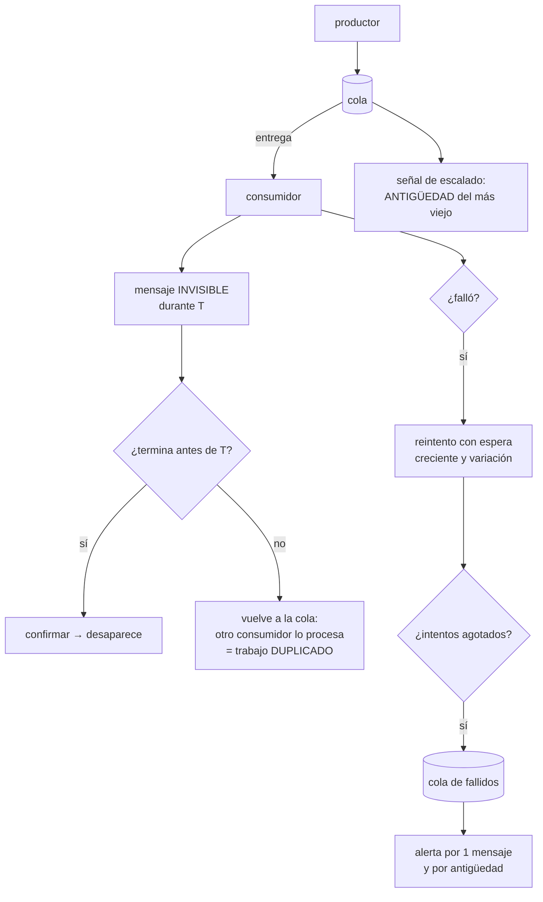

# 113 — Colas, entrega, reintentos y dead-letter queues

> [← 112 · Object storage, data lake y formatos columnares](../../part-09-data-messaging-serverless-integration/112-object-storage-data-lake-y-formatos-columnares/README.md) · [Índice de la parte](../README.md) · [114 · Pub/sub, streams, particiones y orden →](../../part-09-data-messaging-serverless-integration/114-pub-sub-streams-particiones-y-orden/README.md)

**Parte:** 09 — Datos, mensajería, serverless e integración<br>
**Nivel:** avanzado · **Horas estimadas:** 4<br>
**Laboratorio:** `messaging` · **Estado:** `EXECUTABLE_CORE`

## 🎯 Propósito

Separar en el tiempo quien produce trabajo de quien lo hace, y asumir con precisión lo que eso obliga a aceptar. La clase parte de una afirmación que conviene creerse antes de diseñar nada: **la entrega exactamente una vez no existe sobre una red**, y lo que se vende con ese nombre es otra cosa. De ahí salen las tres decisiones de la clase: cuánto tiempo se oculta un mensaje mientras se procesa, cuántas veces se reintenta y qué se hace con lo que nadie pudo procesar.

## 📚 Resultados de aprendizaje

Al finalizar podrás:

1. **Explicar** qué garantiza cada semántica de entrega y por qué se diseña para al menos una vez.
2. **Ajustar** el tiempo de invisibilidad al tiempo real de proceso.
3. **Configurar** reintentos que no amplifiquen una caída.
4. **Operar** la cola de mensajes fallidos, que sin vigilancia no sirve de nada.
5. **Decidir** si hace falta orden y qué cuesta imponerlo.

## 🧩 Conceptos centrales

| Concepto | Comprensión verificable |
|---|---|
| `al menos una vez` | Cada mensaje se entrega una o más veces. Es lo que ofrecen de verdad los sistemas de cola, y obliga a que el consumidor tolere repeticiones. |
| `tiempo de invisibilidad` | Periodo durante el que un mensaje entregado no se ofrece a otros consumidores. Si el proceso dura más, otro consumidor lo recoge y se duplica el trabajo. |
| `confirmación` | Señal del consumidor de que el mensaje se procesó. Antes de ella, el mensaje sigue vivo; después, desaparece. |
| `mensaje venenoso` | Mensaje que falla siempre. Sin límite de intentos, ocupa capacidad indefinidamente y puede bloquear a los que van detrás. |
| `cola de fallidos` | Destino de lo que agotó sus intentos. Es un sitio para inspeccionar y reprocesar, no un cementerio. |
| `antigüedad del más viejo` | Segundos que lleva esperando el mensaje más antiguo. Es la señal correcta del estado de una cola; la profundidad sola engaña. |

## 🧠 Modelo mental

La base de datos correcta depende del patrón de acceso y de las garantías necesarias; distribuir datos convierte latencia, consistencia y fallos parciales en decisiones de diseño.

Aplicado a esta clase, separa siempre cuatro planos: **intención** (qué necesita el usuario),
**configuración** (qué declaramos), **estado observado** (qué existe de verdad) y
**evidencia** (cómo sabemos que cumple). Confundirlos produce diseños que se ven correctos
en un diagrama pero fallan al operar.

## 🗺️ Flujo de razonamiento



## 📖 Desarrollo

### 1. Lo que de verdad se garantiza

Las tres semánticas, con lo que significan de verdad:

```text
COMO MUCHO UNA VEZ
  se entrega y no se reintenta; si algo falla, el mensaje se pierde
  útil solo para datos que se pueden perder: telemetría de grano fino

AL MENOS UNA VEZ
  se reintenta hasta que se confirma
  → puede entregarse dos veces, y de hecho ocurre
  es lo que ofrecen los sistemas de cola de verdad

EXACTAMENTE UNA VEZ
  no existe como propiedad de la ENTREGA sobre una red
```

Y conviene entender por qué la tercera no existe, porque explica todo lo demás:

```text
el consumidor procesa el mensaje y va a confirmar
la confirmación se pierde por la red

el emisor no puede distinguir:
  «no llegó y hay que reenviar»    de    «llegó y se perdió la respuesta»

cualquiera de las dos decisiones se equivoca en un caso
```

Lo que los proveedores llaman «exactamente una vez» es una de estas dos cosas, y las dos son útiles siempre que se sepa qué son:

```text
deduplicación por ventana   se descarta un mensaje repetido con el mismo
                            identificador dentro de N minutos
                            → fuera de la ventana, se vuelve a entregar

proceso transaccional       leer, procesar y confirmar dentro de una
                            transacción del mismo sistema
                            → solo vale si el efecto está en ese sistema
```

Y de ahí la regla que gobierna esta clase entera y que la clase 116 desarrollará:

```text
se diseña para AL MENOS UNA VEZ
y se hace que el consumidor pueda repetir sin efecto adicional
```

Y antes de nada, lo que cuesta la cola y suele olvidarse:

```text
la respuesta al usuario deja de significar «hecho»
  → hay que decidir qué se le dice y cómo se entera del resultado
el error deja de aparecer donde se originó
  → hace falta correlacionar: el identificador de traza viaja en el mensaje
el sistema gana un estado nuevo: «pendiente»
  → y todo lo que consulte tiene que contemplarlo
```

### 2. El tiempo de invisibilidad, que es donde nacen los duplicados

El mecanismo es sencillo y su ajuste causa el error más común de esta clase:

```text
el consumidor recibe el mensaje
el mensaje se oculta a los demás durante T
  si confirma antes de T   → desaparece
  si no                    → reaparece y otro consumidor lo toma
```

Y la consecuencia:

```text
si el proceso tarda más que T, el trabajo se hace DOS veces
y nadie da ningún error: los dos consumidores creen que va bien
```

El ajuste correcto no se hace con la media:

```text
tiempo de proceso, mediana        1,2 s
tiempo de proceso, percentil 99   14 s
tiempo de invisibilidad           30 s   ← al menos 2× el p99
```

Y para procesos de duración muy variable, alargar T no es la solución —porque un consumidor caído retendría el mensaje todo ese tiempo—, sino **extender la invisibilidad mientras se trabaja**:

```text
T inicial corto, 30 s
y mientras el proceso sigue vivo, se renueva cada 15 s
→ si el consumidor muere, el mensaje vuelve en 30 s, no en 15 min
```

Y el otro par de errores, simétricos y ambos frecuentes:

```text
CONFIRMAR ANTES DE TRABAJAR
  el mensaje desaparece y si el proceso falla, el trabajo se PIERDE
  → esto convierte una cola en «como mucho una vez» sin querer

CONFIRMAR DESPUÉS DE TRABAJAR
  correcto, y si el consumidor muere entre el trabajo y la confirmación,
  el mensaje se repite
  → es el caso normal, y por eso hace falta poder repetir sin daño
```

Y una comprobación que conviene hacer explícitamente, porque casi nunca se hace:

```text
matar un consumidor a mitad de proceso, a propósito
y comprobar qué ocurre con el mensaje y con sus efectos
```

Y el consumo por lotes, que multiplica el problema: si se reciben diez mensajes y falla el séptimo, ¿qué se confirma? La respuesta correcta es **confirmar individualmente lo que salió bien**; si el sistema solo permite confirmar el lote entero, los seis primeros se repetirán.

### 3. Reintentos que no empeoran la caída

El reintento inmediato es la peor opción posible, y es la que sale por defecto en mucho código:

```text
la dependencia está saturada
→ los consumidores reintentan de inmediato
→ más carga sobre lo que ya está mal
→ la caída se alarga
```

Los tres parámetros, y los tres importan:

```text
ESPERA CRECIENTE   1 s, 2 s, 4 s, 8 s…  da tiempo a que se recupere
VARIACIÓN          ±30 % aleatorio; sin ella, todos reintentan a la vez
LÍMITE DE INTENTOS 3 a 5; sin él, un mensaje venenoso vive para siempre
```

Y una distinción que ahorra la mayor parte de los reintentos inútiles:

```text
ERROR TRANSITORIO     tiempo de espera agotado, 503, conflicto de bloqueo
                      → reintentar tiene sentido
ERROR PERMANENTE      mensaje mal formado, entidad que no existe,
                      validación fallida
                      → reintentar cinco veces no lo va a arreglar
                      → a la cola de fallidos directamente
```

Separarlos reduce mucho el ruido y acelera el diagnóstico: en la cola de fallidos quedan mezcladas dos cosas muy distintas si no se hace.

Y una tercera categoría que conviene tratar aparte: **el mensaje que llega antes de tiempo**. Un evento de pago que llega antes de que el pedido exista no es un error permanente ni transitorio: es orden. Reintentar con espera larga suele resolverlo, y si no, es señal de que hace falta el patrón de la clase 116.

**La cola de fallidos.** Su valor no está en existir, sino en lo que se hace con ella:

```text
sirve para   inspeccionar el mensaje y el motivo del último fallo
             corregir la causa
             reprocesar cuando esté arreglado

no sirve     si nadie la mira
```

Y ahí vuelven dos leyes conocidas: **un mensaje en la cola de fallidos no produce ningún error** (ley 13) y **una cola de fallidos con cuarenta mil elementos deja de mirarse** (ley 15). Las dos alertas que lo evitan:

```text
mensajes en la cola de fallidos ≥ 1        → avisar
antigüedad del más antiguo > 1 h           → avisar
```

La primera parece exagerada y no lo es: **si llegar a la cola de fallidos es normal, el sistema tiene un problema de diseño**, no de operación.

Y lo que hay que guardar con el mensaje para que sea reprocesable:

```text
el cuerpo original, sin transformar
el motivo del último fallo y la traza
el número de intentos y las marcas de tiempo
el identificador de correlación
```

Y la herramienta de reproceso, que hay que escribir antes de necesitarla: **devolver a la cola original en lotes controlados**, no todo de golpe, porque devolver cuarenta mil mensajes a la vez reproduce la caída que los generó.

### 4. Ritmo, retraso y orden

**Qué señal usar.** La profundidad de la cola engaña:

```text
50.000 mensajes y se consumen 20.000/s   → 2,5 s de retraso: bien
   200 mensajes y se consumen 2/s        → 100 s de retraso: mal
```

La señal correcta es **la antigüedad del mensaje más viejo**, que ya está en segundos y se compara directamente con lo que el negocio tolera.

Y el cálculo del tiempo de vaciado, que es lo que hay que saber durante un incidente:

```text
vaciado = profundidad / (capacidad de consumo − ritmo de llegada)

120.000 mensajes, llegan 800/s, se consumen 1.000/s
→ 120.000 / 200 = 600 s = 10 min

y si llegan 1.100/s y se consumen 1.000/s
→ NUNCA se vacía: hay que escalar o parar la producción
```

Y el escalado del consumidor se hace con la antigüedad, no con la profundidad, por lo dicho arriba. Con un límite: **el consumidor escala hasta donde aguanta su dependencia**. Cien consumidores contra una base de datos de la clase 109 agotan sus conexiones; la cola solo mueve el cuello de botella.

**El orden.** La mayoría de los sistemas no lo garantizan, y conviene comprobar si de verdad hace falta:

```text
necesita orden           actualizaciones sucesivas del mismo pedido
                         movimientos de un mismo saldo
no necesita orden        notificaciones, envío de correos, indexación
```

Y cuando hace falta, la respuesta casi nunca es «ordenar todo», sino **ordenar por clave**:

```text
orden global      un solo consumidor: el ritmo lo marca el más lento
orden por clave   todos los mensajes de un pedido en el mismo grupo
                  → grupos distintos avanzan en paralelo
```

Y el precio del orden, que hay que aceptar conscientemente:

```text
bloqueo por cabecera   un mensaje que falla detiene a los de su grupo
ritmo por grupo        limitado; el paralelismo lo da el número de grupos
escalado               no se puede repartir un grupo entre dos consumidores
```

El primero es el que más sorprende: **un solo mensaje venenoso paraliza su clave entera** hasta que agota intentos.

Y un recurso que evita imponer orden en muchos casos: **que el mensaje lleve un número de versión y el consumidor descarte lo viejo**. Si llega la versión 4 y luego la 3, se ignora la 3. Resuelve el problema sin ordenar nada.

Y la lista de comprobación de la clase:

```text
☐ el consumidor tolera recibir el mismo mensaje dos veces
☐ el tiempo de invisibilidad es al menos el doble del p99 de proceso
☐ los procesos largos renuevan la invisibilidad mientras trabajan
☐ se confirma DESPUÉS de hacer el trabajo, e individualmente en lotes
☐ los errores permanentes van a fallidos sin reintentar
☐ los reintentos tienen espera creciente, variación y límite
☐ hay alerta por un solo mensaje en la cola de fallidos y por antigüedad
☐ existe herramienta de reproceso por lotes controlados
☐ el escalado usa la antigüedad del más viejo, no la profundidad
☐ está calculado hasta dónde puede escalar el consumidor sin romper
  su dependencia
☐ el orden se impone por clave y solo donde hace falta
☐ se ha matado un consumidor a mitad de proceso para ver qué ocurre
```

Y el cierre que enlaza con la clase siguiente: una cola entrega cada mensaje a un consumidor y lo borra. Cuando el mismo hecho interesa a varios sistemas —y hay que poder volver a leerlo dentro de un mes— hace falta otra cosa, y es la materia de la clase 114.

## 🔬 Ejemplo trabajado

**CloudShop pasa el procesamiento de pedidos a una cola para dejar de hacerlo dentro de la petición del usuario. Funciona el primer día. Los cuatro problemas que aparecen después son los cuatro apartados de esta clase, en orden.**

**Punto de partida.**

```text                                    síncrono        con cola
latencia de la petición del usuario       2,8 s          140 ms
fallos visibles al usuario por caída
de un sistema de pago                     4,1 %            0 %
pedidos procesados por segundo              85            1.200
```

**Problema 1: pedidos duplicados, el 0,4 %.**

```text
pedidos con cobro duplicado en 3 semanas         214
tiempo de invisibilidad configurado               30 s
tiempo de proceso, mediana                       1,2 s
tiempo de proceso, percentil 99                   47 s   ← mayor que 30 s
```

El percentil 99 superaba el tiempo de invisibilidad: **uno de cada cien mensajes se procesaba dos veces**, y el sistema no daba ningún error porque los dos consumidores terminaban bien.

Y las llamadas al proveedor de pago lo confirmaban:

```text
cobros solicitados                    52.180
pedidos                               51.966
diferencia                               214
```

Dos correcciones, y solo la segunda es de verdad:

```text                                    antes    invisibilidad 120 s   + renovación
duplicados por semana                     71             4                  0
retención tras muerte del consumidor      30 s          120 s              30 s
```

Subir la invisibilidad bajó los duplicados y empeoró otra cosa: **un consumidor muerto retenía el mensaje dos minutos**. La renovación durante el proceso resolvió las dos a la vez.

Y la corrección estructural quedó anotada para la clase 116: los duplicados residuales solo desaparecen cuando la operación se puede repetir sin efecto adicional.

**Problema 2: la tormenta de reintentos alarga una caída de 4 minutos a 40.**

```text
09:12  el proveedor de pago devuelve 503
09:12  1.200 mensajes/s empiezan a fallar
09:12  reintento inmediato, sin espera ni límite
09:13  carga sobre el proveedor: ×6 respecto a lo normal
09:16  el proveedor se recupera internamente
09:16  la carga de reintentos le impide estabilizarse
09:52  se paran los consumidores a mano; el sistema se recupera
```

Cuatro minutos de fallo del proveedor, cuarenta de incidente. La configuración corregida y su ensayo:

```text                                    antes             después
espera entre intentos                    inmediata       1-2-4-8-16 s
variación                                no              ±30 %
límite de intentos                       ninguno         5
corte tras fallos consecutivos           no              sí

caída simulada de 4 min: duración del incidente
                                          40 min          5 min 10 s
carga de reintentos sobre el proveedor      ×6             ×1,3
```

**Problema 3: la cola de fallidos con 41.000 mensajes que nadie miró.**

```text
mensajes en la cola de fallidos                 41.216
el más antiguo                                  67 días
alertas configuradas sobre ella                  ninguna
pedidos afectados sin procesar                   1.847
el resto                        reintentos del mismo pedido y ruido
```

Es la ley 13 otra vez: **41.000 mensajes parados no producen ningún error**. Y al inspeccionarlos apareció que el 71 % eran errores permanentes que se habían reintentado cinco veces cada uno:

```text
validación fallida (campo obligatorio ausente)      18.400
entidad inexistente                                  8.900
mensaje mal formado                                  2.100
transitorios reales                                 11.816
```

Las correcciones:

```text                                    antes             después
errores permanentes                     5 reintentos      a fallidos directo
alerta por ≥ 1 mensaje                  no                sí
alerta por antigüedad > 1 h             no                sí
herramienta de reproceso                no había          por lotes de 500
mensajes en fallidos, estado normal     41.216            0-3
```

Y el primer reproceso enseñó por qué los lotes importan: **devolver 11.816 mensajes de golpe reprodujo la saturación** que los había generado. En lotes de 500 con pausa, se vaciaron en 40 minutos sin incidente.

**Problema 4: el orden, que hacía falta solo para una cosa.**

```text
síntoma   un pedido cancelado y luego modificado quedaba activo
causa     los dos mensajes se procesaron en orden inverso
frecuencia  9 casos en 2 meses
```

La primera propuesta fue una cola con orden global:

```text                                    sin orden      orden global    orden por clave
mensajes por segundo                     1.200             85             1.140
consumidores en paralelo                    40              1                40
casos de orden invertido                     9              0                 0
bloqueo por un mensaje venenoso            no        toda la cola      solo ese pedido
```

El orden global habría dividido el ritmo por catorce. Se ordenó por identificador de pedido.

Y para el resto de los consumidores, que no necesitan orden, se aplicó la alternativa del apartado cuarto:

```text
el mensaje lleva número de versión del pedido
el consumidor descarta lo que sea anterior a lo que ya aplicó
→ resuelve el problema sin ordenar nada
```

**La señal de escalado, corregida por el camino.**

```text                                    antes            después
señal                                profundidad > 10.000   antigüedad > 60 s
escalados innecesarios al mes             14                  0
retrasos no detectados                     3                  0
límite de consumidores                  sin límite      24 (por las conexiones
                                                         de la clase 109)
```

La última fila viene de un incidente encadenado: al escalar a 90 consumidores durante un retraso, **se agotaron las conexiones de la base de datos** y cayó también la parte síncrona. La cola movió el cuello de botella en lugar de eliminarlo.

**A los cinco meses.**

```text                                          antes         después
latencia de la petición                      2,8 s          140 ms
pedidos duplicados                        214 / 3 sem         0-2
duración de un incidente de 4 min             40 min        5 min 10 s
mensajes en cola de fallidos                 41.216          0-3
alertas sobre la cola de fallidos                 0            2
casos de orden invertido                      9 / 2 mes        0
señal de escalado                        profundidad      antigüedad
escalados innecesarios                      14 / mes          0
caídas encadenadas por escalar consumidores     1              0
```

**La lección que esta clase traslada a la parte 09**: los cuatro problemas tienen la misma raíz. La cola resolvió el acoplamiento en el tiempo y **trasladó a la aplicación tres garantías que antes daba la llamada síncrona**: que el trabajo se hace una vez, que el error se ve donde ocurre y que las cosas pasan en orden. Ninguna de las tres vuelve sola: hay que reconstruirlas. Y la más difícil —hacer que repetir no tenga efecto— es la única que esta clase no ha resuelto, solo aplazado.

## 🧪 Laboratorio guiado

Ejecuta desde la raíz:

```bash
python classes/part-09-data-messaging-serverless-integration/113-colas-entrega-reintentos-y-dead-letter-queues/lab.py
```

El laboratorio selecciona el motor de práctica **`messaging`** y produce
`lab_result.json`. El escenario, sus comprobaciones y el artefacto esperado corresponden a
esta clase; no requiere credenciales y deja explícito qué debe revalidarse en un sandbox real.

1. Lee `exercise.steps` y formula una predicción antes de ejecutar.
2. Ejecuta la práctica y verifica todos los elementos de `checks`.
3. Provoca el caso de `negative_test` y explica la señal observada.
4. Materializa `cola-resiliente` en `evidence/` usando la plantilla indicada.
5. Para proveedor real, sigue `sandbox.requires`, registra costo y ejecuta `destroy`.

### Evidencia esperada

El artefacto principal es un flujo que declara orden, entrega y manejo de errores. Además, la entrega debe incluir el comando ejecutado,
la salida estructurada y una conclusión que no exceda lo observado.

## 🏆 Reto verificable

Construye **`cola-resiliente`** para el caso CloudShop. Incluye una alternativa descartada,
un supuesto que pueda falsarse, una prueba de fallo y una decisión de rollback.

## ✅ Criterio de aceptación

- [ ] `lab.py` termina con código 0 y genera JSON válido.
- [ ] La entrega conecta al menos tres requisitos con mecanismos verificables.
- [ ] Existe una prueba positiva y una prueba negativa con evidencia.
- [ ] Seguridad, costo y operación aparecen como decisiones, no como anexos.
- [ ] Se declara una limitación y una condición que obligaría a revisar el diseño.
- [ ] Otra persona puede repetir el recorrido sin conocimiento tácito.

## ⚠️ Errores frecuentes

| Síntoma | Causa probable | Corrección |
|---|---|---|
| Trabajo duplicado sin ningún error visible | El proceso dura más que el tiempo de invisibilidad y el mensaje se reentrega | Ajusta la invisibilidad al doble del percentil 99 y renuévala mientras el proceso siga vivo. |
| Se pierden mensajes cuando un consumidor falla | Se confirma antes de hacer el trabajo | Confirma siempre después, y en lotes confirma individualmente lo que salió bien. |
| Una caída breve de una dependencia se convierte en un incidente largo | Reintento inmediato y sin límite, que amplifica la carga sobre lo que ya está mal | Espera creciente con variación, límite de intentos y corte tras fallos consecutivos. |
| La cola de fallidos acumula decenas de miles de mensajes | Ley 13: nada da error, y ley 15: con esa cifra ya nadie la mira | Alerta desde el primer mensaje y por antigüedad, y envía los errores permanentes sin reintentar. |
| Reprocesar la cola de fallidos vuelve a tumbar el sistema | Se devolvieron todos los mensajes de golpe | Reprocesa en lotes controlados con pausa entre ellos. |
| Escalar los consumidores tumba la base de datos | La cola movió el cuello de botella; el límite real es la dependencia | Fija el máximo de consumidores según lo que aguanta la dependencia y escala por antigüedad del mensaje más viejo. |

## 🛡️ Seguridad, ética y costo

Trabaja con cuentas propias o sandboxes autorizados. No publiques secretos, identificadores
reales ni datos personales. Antes de crear recursos pagos define presupuesto, etiquetas y
comando de destrucción; después verifica que no queden recursos huérfanos. Los ejemplos
locales enseñan contratos, pero no certifican cumplimiento ni disponibilidad de producción.

## ❓ Preguntas de comprobación

1. ¿Por qué no existe la entrega exactamente una vez y qué se ofrece con ese nombre?
2. ¿Cómo se calcula el tiempo de invisibilidad y qué se hace con procesos largos?
3. ¿Qué diferencia hay entre error transitorio y permanente a efectos de reintento?
4. ¿Por qué se alerta desde el primer mensaje en la cola de fallidos?
5. ¿Por qué la antigüedad del mensaje más viejo es mejor señal que la profundidad?

## 🔗 Referencias

- AWS (2025). *SQS: visibility timeout and dead-letter queues* — invisibilidad, reentrega y destino de fallidos. <https://docs.aws.amazon.com/AWSSimpleQueueService/latest/SQSDeveloperGuide/sqs-visibility-timeout.html>
- Azure (2025). *Service Bus: message transfers, locks and settlement* — bloqueo, renovación y confirmación. <https://learn.microsoft.com/azure/service-bus-messaging/message-transfers-locks-settlement>
- Google Cloud (2025). *Pub/Sub: subscription retry policy and dead lettering* — espera creciente y reenvío. <https://cloud.google.com/pubsub/docs/handling-failures>
- Brooker, M. (2015). *Exponential backoff and jitter* — por qué la variación importa tanto como la espera. <https://aws.amazon.com/builders-library/timeouts-retries-and-backoff-with-jitter/>
- Nygard, M. (2018). *Release It!*, cap. 4 — tormentas de reintentos y cortocircuitos. <https://pragprog.com/titles/mnee2/release-it-second-edition/>
- Documentación oficial vigente del servicio implementado; registra URL y fecha de consulta.

---

> [Evaluación](assessment.md) · [Contrato de clase](lesson.yaml) · [Índice de la parte](../README.md)

| Anterior | Índice | Siguiente |
|---|---|---|
| [← 112 · Object storage, data lake y formatos columnares](../../part-09-data-messaging-serverless-integration/112-object-storage-data-lake-y-formatos-columnares/README.md) | [Parte 09](../README.md) · [Programa](../../README.md) | [114 · Pub/sub, streams, particiones y orden →](../../part-09-data-messaging-serverless-integration/114-pub-sub-streams-particiones-y-orden/README.md) |
