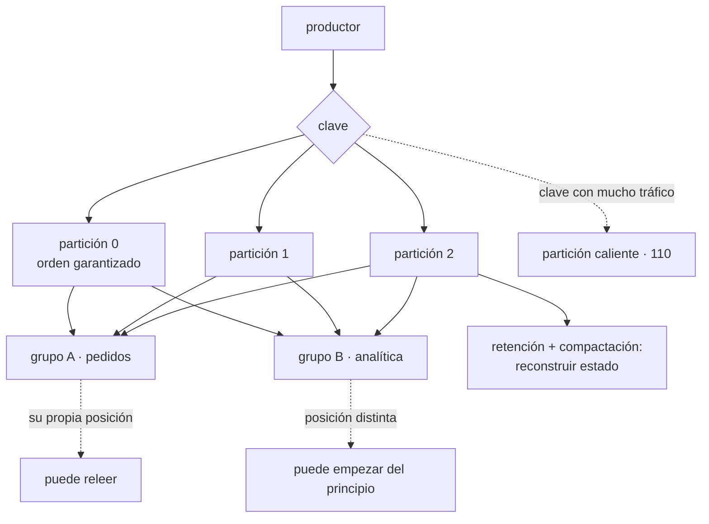

# 114 — Pub/sub, streams, particiones y orden

> [← 113 · Colas, entrega, reintentos y dead-letter queues](../../part-09-data-messaging-serverless-integration/113-colas-entrega-reintentos-y-dead-letter-queues/README.md) · [Índice de la parte](../README.md) · [115 · Arquitectura dirigida por eventos y contratos →](../../part-09-data-messaging-serverless-integration/115-arquitectura-dirigida-por-eventos-y-contratos/README.md)

**Parte:** 09 — Datos, mensajería, serverless e integración<br>
**Nivel:** avanzado · **Horas estimadas:** 4<br>
**Laboratorio:** `messaging` · **Estado:** `EXECUTABLE_CORE`

## 🎯 Propósito

Pasar de la cola —que entrega y borra— al registro ordenado que **conserva**, donde cada consumidor lleva su propia posición y puede volver atrás. Ese cambio resuelve tres cosas que la clase 113 no podía: varios consumidores independientes del mismo hecho, releer el pasado y reconstruir estado desde cero. Y trae dos decisiones que se toman al crear y no se deshacen: **cuántas particiones y qué clave las elige**, que juntas deciden el paralelismo máximo, el orden y dónde aparecerá la partición caliente.

## 📚 Resultados de aprendizaje

Al finalizar podrás:

1. **Distinguir** cuándo hace falta un registro conservado y cuándo basta una cola.
2. **Elegir** número de particiones y clave, entendiendo lo que fijan para siempre.
3. **Razonar** sobre grupos de consumidores, reparto y lo que cuesta un rebalanceo.
4. **Gestionar** la posición de lectura sin perder ni repetir rangos enteros.
5. **Usar** retención y compactación para reconstruir estado.

## 🧩 Conceptos centrales

| Concepto | Comprensión verificable |
|---|---|
| `registro conservado` | Secuencia ordenada e inmutable de mensajes que no se borran al leerse. Cada consumidor avanza por su cuenta. |
| `partición` | Subsecuencia ordenada del tema. Es a la vez la unidad de paralelismo y la única dentro de la cual hay orden. |
| `posición de lectura` | Índice del último mensaje procesado por un grupo. Confirmarla mal salta o repite rangos enteros, no un mensaje. |
| `grupo de consumidores` | Conjunto que se reparte las particiones. Ninguna partición la leen dos miembros a la vez, así que el paralelismo máximo es el número de particiones. |
| `rebalanceo` | Reparto de particiones cuando entra o sale un miembro. Durante él el consumo se detiene y suele haber reproceso. |
| `compactación por clave` | Conservar solo el último valor de cada clave. Convierte el registro en una fotografía reconstruible del estado actual. |

## 🧠 Modelo mental

La base de datos correcta depende del patrón de acceso y de las garantías necesarias; distribuir datos convierte latencia, consistencia y fallos parciales en decisiones de diseño.

Aplicado a esta clase, separa siempre cuatro planos: **intención** (qué necesita el usuario),
**configuración** (qué declaramos), **estado observado** (qué existe de verdad) y
**evidencia** (cómo sabemos que cumple). Confundirlos produce diseños que se ven correctos
en un diagrama pero fallan al operar.

## 🗺️ Flujo de razonamiento



## 📖 Desarrollo

### 1. Conservar cambia lo que se puede hacer

La diferencia con la clase 113 es una sola y tiene muchas consecuencias:

```text
COLA       se entrega y se borra
           un mensaje, un consumidor
           lo procesado ya no existe

REGISTRO   se escribe y se conserva
           cada consumidor lleva su posición
           lo procesado sigue ahí
```

Y lo que eso permite:

```text
varios consumidores independientes del mismo hecho
  facturación, analítica, notificación, búsqueda
  → y añadir uno nuevo no afecta a los demás

releer
  un consumidor con un defecto reprocesa desde una posición anterior
  → sin pedir nada al productor

empezar del principio
  un servicio nuevo reconstruye su estado leyendo el histórico
  → esto es lo que no se puede hacer con una cola
```

Y el criterio para elegir uno u otro:

```text
cola      trabajo que alguien tiene que hacer una vez
          «envía este correo», «cobra este pedido»
registro  hecho que ya ocurrió y que interesa a varios
          «el pedido 1421 pasó a pagado»
```

La distinción se nota en el nombre del mensaje: **un imperativo va a una cola; un hecho en pasado va a un registro**.

Y lo que cuesta conservar:

```text
el almacenamiento se paga por el periodo de retención
los mensajes viejos siguen ahí cuando el código ya cambió
  → un consumidor debe poder leer formatos anteriores
  → es la convivencia N/N+1 de la clase 102, aplicada a los datos
borrar un dato concreto es difícil: el registro es inmutable
  → y hay requisitos legales que lo exigen (clase 112)
```

La última línea tiene dos respuestas conocidas: **compactar con una marca de borrado por clave**, o guardar los datos personales fuera del registro y publicar solo referencias. La segunda es la que menos disgustos da.

### 2. Particiones: paralelismo y orden a la vez

La partición es la pieza central y hace dos trabajos que conviene ver separados:

```text
es la unidad de ORDEN         dentro de una partición hay orden total
                              entre particiones no hay ninguno
es la unidad de PARALELISMO   cada partición la lee un solo miembro del grupo
                              → paralelismo máximo = número de particiones
```

Y de ahí sale la primera decisión irreversible en la práctica:

```text
¿cuántas particiones?
  pocas     techo de paralelismo bajo
  muchas    más metadatos, más ficheros, rebalanceos más lentos
            y más coste por partición en los servicios administrados
```

Y por qué aumentar el número después es un problema:

```text
partición = f(clave) mod N

si N cambia, la misma clave pasa a otra partición
→ los mensajes viejos de esa clave están en la partición vieja
→ y el orden por clave, que era la garantía, se rompe en la frontera
```

Así que ampliar es posible y **no conserva la garantía de orden para las claves ya existentes**. Es la ley 14 en su forma más limpia: una decisión de creación con consecuencias que no se pueden deshacer sin migrar.

La regla práctica al dimensionar:

```text
particiones ≥ consumidores máximos previstos
y con margen: 2 a 3 veces el paralelismo actual
pero no cientos «por si acaso»
```

**La clave**, que es la segunda decisión y hereda todo lo de la clase 110:

```text
misma clave → misma partición → orden garantizado entre esos mensajes

clave = identificador de pedido    orden por pedido, reparto bueno
clave = país                       5 valores → 5 particiones útiles
clave = nula (reparto rotatorio)   máximo reparto, ningún orden
```

Y la partición caliente vuelve exactamente igual que en la clase 110: **una clave con mucho tráfico satura su partición mientras las demás están ociosas**, y no se puede repartir porque repartirla rompería el orden que justificaba la clave.

```text
si una clave concentra demasiado tráfico:
  ¿de verdad necesita orden esa clave?
    no  → quítale la clave y reparte
    sí  → hay un límite físico, y hay que reducir el trabajo por mensaje
```

### 3. Grupos, rebalanceo y posición

**El grupo de consumidores** reparte las particiones entre sus miembros:

```text
12 particiones, 4 consumidores    → 3 particiones cada uno
12 particiones, 12 consumidores   → 1 cada uno
12 particiones, 20 consumidores   → 8 CONSUMIDORES OCIOSOS
```

La tercera línea es la que sorprende a quien viene de las colas: **añadir consumidores por encima del número de particiones no aumenta nada**. El autoescalado por retraso tiene ahí su techo, y hay que declararlo.

**El rebalanceo** ocurre cuando entra o sale un miembro, y su coste es real:

```text
se detiene el consumo de todo el grupo
se reparte de nuevo
cada consumidor empieza desde la última posición confirmada
  → lo procesado y no confirmado se REPITE
```

Y el error más frecuente es provocarlo sin querer:

```text
el consumidor tarda más de lo permitido entre lecturas
→ el coordinador lo da por muerto
→ rebalanceo
→ el consumidor vuelve y provoca otro rebalanceo
→ y en ese bucle el grupo no avanza
```

Lo que lo corrige:

```text
leer lotes más pequeños, para volver antes a pedir
separar el latido del proceso, si el cliente lo permite
subir el tiempo máximo entre lecturas al p99 real del proceso
y usar reparto incremental, que no detiene a todo el grupo
```

**La posición de lectura.** Aquí la diferencia con una cola es importante y peligrosa: no se confirma un mensaje, **se confirma una posición**, y todo lo anterior queda dado por hecho.

```text
confirmar ANTES de procesar   si falla, se saltan mensajes: se PIERDEN
confirmar DESPUÉS de procesar si falla, se repite el lote: al menos una vez
confirmar cada mensaje        seguro y lento
confirmar por lotes           rápido, y repite el lote entero al fallar
```

Y el caso que rompe a mucha gente: **procesar en paralelo dentro de un lote y confirmar la posición mayor**. Si el mensaje 7 falla y el 9 va bien, confirmar 9 da por hecho el 7.

```text
si se procesa en paralelo, la posición confirmable es
la del último mensaje SIN huecos anteriores
```

Y la señal de estado, que aquí tiene dos formas y hay que mirar las dos:

```text
retraso en mensajes    cuántos faltan por leer
retraso en tiempo      cuánto hace que se produjo el que se está leyendo
```

La segunda es la que se compara con lo que el negocio tolera; la primera dice si se está recuperando.

### 4. Retención, compactación y reconstrucción

La retención es lo que convierte el registro en algo más que un transporte.

```text
por tiempo    conserva N días
por tamaño    conserva N GB por partición
permanente    con almacenamiento por capas, el histórico completo
```

Y lo que la retención permite, que es lo que justifica todo el modelo:

```text
un consumidor con un defecto retrocede su posición y reprocesa
un servicio nuevo empieza en el principio y construye su estado
un incidente se investiga leyendo lo que pasó de verdad
```

Y la advertencia correspondiente: **la retención es también el plazo de recuperación**. Si se conservan tres días y un defecto se descubre a los cinco, no hay nada que reprocesar.

```text
retención ≥ tiempo típico hasta descubrir un defecto
→ en la práctica, 7 días es poco y 30 suele ser suficiente
```

**La compactación por clave** es distinta de la retención por tiempo y resuelve otro problema:

```text
conserva el ÚLTIMO mensaje de cada clave, para siempre
descarta los anteriores

→ el tema deja de ser un histórico y pasa a ser una fotografía
→ leerlo entero reconstruye el estado actual de todas las claves
```

Y para qué sirve de verdad:

```text
reconstruir un caché tras perderlo (clase 111)
dar estado inicial a un servicio nuevo sin consultar a la base
mantener una copia local de una tabla de referencia
```

Y el detalle imprescindible: **para borrar una clave se publica un mensaje con valor vacío**. Sin eso, una clave borrada en el origen vive para siempre en el tema compactado.

Y dos cosas que conviene no mezclar:

```text
tema de HECHOS       histórico, retención por tiempo, no compactar
                     «el pedido 1421 pasó a pagado»
tema de ESTADO       compactado, última versión por clave
                     «el pedido 1421 está así»
```

Mezclarlas es un error frecuente: compactar un tema de hechos **borra historia** que alguien necesitaba.

Y un último aviso sobre los reintentos, que enlaza con la clase 113: **reintentar un mensaje fuera del registro rompe el orden**. Si el mensaje 5 falla y se manda a una cola de reintentos mientras el 6 y el 7 se procesan, se ha perdido la garantía que justificaba la partición. Las dos salidas honestas:

```text
detenerse en el fallo y no avanzar esa partición
  → conserva el orden y bloquea a los de detrás
enviar a un tema de reintentos y ACEPTAR que se pierde el orden
  → hay que declararlo, no descubrirlo
```

Y la lista de comprobación de la clase:

```text
☐ está justificado por qué esto es un registro y no una cola
☐ el número de particiones cubre el paralelismo máximo previsto
☐ está entendido que ampliar particiones rompe el orden por clave
☐ la clave reparte y no concentra tráfico en una partición
☐ el máximo de consumidores útiles está declarado y no se escala más allá
☐ el tiempo máximo entre lecturas es mayor que el p99 de proceso
☐ la posición se confirma después de procesar y sin huecos
☐ se vigilan retraso en mensajes y retraso en tiempo
☐ la retención cubre el tiempo típico hasta descubrir un defecto
☐ los temas de hechos no están compactados
☐ el borrado por clave publica un mensaje vacío
☐ está declarado si los reintentos rompen el orden
```

Y el cierre que enlaza con la clase siguiente: si varios sistemas leen los mismos hechos, el formato de esos hechos es un contrato entre equipos que no se ven. Cómo se define, cómo se cambia sin romper a quien lee el histórico y quién es su dueño es la materia de la clase 115.

## 🔬 Ejemplo trabajado

**CloudShop publica los hechos de pedido en un registro conservado para que tres equipos los consuman por su cuenta. El diseño inicial es razonable y contiene dos decisiones de creación que costarán una migración.**

**Por qué un registro y no una cola.**

```text
consumidores del mismo hecho          facturación, analítica, búsqueda
con una cola                          3 colas, y el productor tiene que
                                      publicar en las tres
añadir un cuarto consumidor           tocar al productor
reprocesar tras un defecto            pedir al productor que reenvíe
```

Y con registro, los cuatro problemas desaparecen: el productor publica una vez y cada consumidor avanza a su ritmo.

**Decisión 1: seis particiones. Se queda corta a los cinco meses.**

```text
al diseñar                    1.200 mensajes/s, 4 consumidores
particiones elegidas          6
mes 5                         4.900 mensajes/s
consumidores necesarios       11
consumidores útiles           6   ← techo
consumidores ociosos          5
retraso en tiempo             de 2 s a 4 min 20 s
```

Y al ampliar a 24 particiones apareció lo del apartado segundo:

```text
mensajes de un mismo pedido antes de ampliar    en la partición 3
mensajes del mismo pedido después              en la partición 17
ventana en la que el orden por pedido no está garantizado
                                                la retención: 30 días
casos de orden invertido detectados             41
```

La migración honesta consistió en publicar en un tema nuevo con 24 particiones, consumir de los dos durante treinta días y retirar el viejo. **Doce minutos de decisión inicial, cinco semanas de migración.**

**Decisión 2: la clave. La primera fue el país.**

```text
clave = país
valores distintos                     190
particiones que reciben tráfico        6
tráfico de España                     61 % del total
carga de la partición de España       61 %
carga de la partición menos usada    0,4 %
retraso de la partición de España    9 min
retraso del resto                    < 1 s
```

Es la partición caliente de la clase 110, en otro sistema y con el mismo diagnóstico. Y la pregunta del apartado segundo, respondida:

```text
¿necesita orden el conjunto de un país?    no
¿qué necesita orden?                       los mensajes de un mismo pedido
→ clave = identificador de pedido
```

```text                                    clave=país     clave=pedido
particiones con tráfico                     6             24
desviación entre la más y la menos cargada  ×150          ×1,3
retraso máximo                              9 min         2 s
casos de orden invertido                    0             0
```

**El bucle de rebalanceo, que paralizó el consumo 40 minutos.**

```text
02:10  un consumidor tarda 6 min en un lote (una dependencia lenta)
02:15  el coordinador lo da por muerto: tiempo máximo entre lecturas, 5 min
02:15  rebalanceo; el grupo se detiene
02:16  el consumidor vuelve → otro rebalanceo
02:16  … se repite
02:50  se detecta y se corrige a mano
```

```text                                    antes             después
tamaño del lote                          500 mensajes      50 mensajes
tiempo de proceso por lote, p99          6 min             38 s
tiempo máximo entre lecturas             5 min             5 min
reparto                                  detiene el grupo  incremental
rebalanceos por semana                   14                0-1
minutos de consumo detenido por semana   47                < 1
```

**El error de posición que perdió 9.000 mensajes.**

Un consumidor procesaba el lote en paralelo con veinte hilos y confirmaba la posición mayor al terminar:

```text
lote de 500, mensajes 12.000 a 12.499
el mensaje 12.203 falla y se registra el error
el resto termina bien
se confirma la posición 12.499
→ el 12.203 nunca se procesa y nadie vuelve a él
```

```text
mensajes perdidos así en 3 semanas                 9.140
detectado por    un descuadre en facturación de 21.400 €
corrección       confirmar la posición del último SIN huecos anteriores
mensajes perdidos tras la corrección                   0
reproceso        se retrocedió la posición 3 semanas y se repitió
                 → posible SOLO porque la retención era de 30 días
```

La última línea es el argumento del apartado cuarto: **con siete días de retención, esos 21.400 € no se habrían podido recuperar**.

**La compactación, para reconstruir el caché de la clase 111.**

El caché portante de la clase 111 tardaba catorce minutos en recalentarse contra la base de datos. Con un tema de estado compactado:

```text                                    desde la base    desde el tema compactado
tiempo de recalentamiento               14 min            1 min 50 s
carga sobre la base durante el proceso  12.000/s          0
tamaño del tema (2,1 M de productos)      —               3,4 GB
```

Y el fallo que se cometió al montarlo: **se compactó también el tema de hechos**.

```text
hechos conservados antes de compactar        4.100 millones
después                                      2,1 millones (uno por pedido)
histórico perdido                            todo lo intermedio
recuperado desde                             la zona bruta del lago (clase 112)
```

Se recuperó porque la zona bruta existía. **Sin ella, el histórico de pedidos se habría perdido de forma irreversible.**

**A los ocho meses.**

```text                                          inicio        final
consumidores independientes                       3             6
particiones                                       6            24
clave                                          país         pedido
desviación de carga entre particiones          ×150           ×1,3
retraso en tiempo, p99                       4 min 20 s       1,8 s
rebalanceos por semana                           14            0-1
mensajes perdidos por confirmación con huecos  9.140            0
retención                                     30 días        30 días
temas de hechos compactados por error             1             0
recalentamiento del caché                     14 min         1 min 50 s
```

**La lección que esta clase traslada a la parte 09**: los dos problemas caros —ampliar particiones y cambiar la clave— **no fueron fallos de operación ni de código**. Fueron dos decisiones tomadas en la primera media hora de diseño, cuando el sistema tenía la cuarta parte del tráfico, y ninguna de las dos se podía deshacer sin migrar. Es la tercera confirmación seguida de la predicción de la clase 108, y ya se puede afinar: en los sistemas con estado, **las decisiones baratas de tomar son las caras de cambiar, y se toman antes de tener datos para tomarlas bien**.

## 🧪 Laboratorio guiado

Ejecuta desde la raíz:

```bash
python classes/part-09-data-messaging-serverless-integration/114-pub-sub-streams-particiones-y-orden/lab.py
```

El laboratorio selecciona el motor de práctica **`messaging`** y produce
`lab_result.json`. El escenario, sus comprobaciones y el artefacto esperado corresponden a
esta clase; no requiere credenciales y deja explícito qué debe revalidarse en un sandbox real.

1. Lee `exercise.steps` y formula una predicción antes de ejecutar.
2. Ejecuta la práctica y verifica todos los elementos de `checks`.
3. Provoca el caso de `negative_test` y explica la señal observada.
4. Materializa `stream-particionado` en `evidence/` usando la plantilla indicada.
5. Para proveedor real, sigue `sandbox.requires`, registra costo y ejecuta `destroy`.

### Evidencia esperada

El artefacto principal es un flujo que declara orden, entrega y manejo de errores. Además, la entrega debe incluir el comando ejecutado,
la salida estructurada y una conclusión que no exceda lo observado.

## 🏆 Reto verificable

Construye **`stream-particionado`** para el caso CloudShop. Incluye una alternativa descartada,
un supuesto que pueda falsarse, una prueba de fallo y una decisión de rollback.

## ✅ Criterio de aceptación

- [ ] `lab.py` termina con código 0 y genera JSON válido.
- [ ] La entrega conecta al menos tres requisitos con mecanismos verificables.
- [ ] Existe una prueba positiva y una prueba negativa con evidencia.
- [ ] Seguridad, costo y operación aparecen como decisiones, no como anexos.
- [ ] Se declara una limitación y una condición que obligaría a revisar el diseño.
- [ ] Otra persona puede repetir el recorrido sin conocimiento tácito.

## ⚠️ Errores frecuentes

| Síntoma | Causa probable | Corrección |
|---|---|---|
| Añadir consumidores no mejora el retraso | Ya hay tantos consumidores como particiones; el resto están ociosos | Declara el máximo útil, no escales por encima, y dimensiona las particiones con margen desde el principio. |
| El orden por clave se rompe tras ampliar particiones | La asignación de clave a partición depende del número de particiones | Publica en un tema nuevo con el tamaño correcto y consume de los dos durante la retención; ampliar en sitio no conserva la garantía. |
| Una partición acumula retraso y las demás están ociosas | La clave concentra el tráfico, como en la clase 110 | Elige una clave con reparto real; si la que concentra no necesita orden, quítale la clave. |
| El grupo entra en un bucle de rebalanceos y no avanza | El proceso de un lote dura más que el tiempo máximo entre lecturas | Reduce el tamaño del lote, ajusta el tiempo máximo al percentil 99 real y usa reparto incremental. |
| Se pierden mensajes sin ningún error | Se confirmó una posición por delante de un mensaje que falló | Confirma la posición del último mensaje sin huecos anteriores, nunca la mayor del lote. |
| Se pierde histórico que alguien necesitaba | Se compactó un tema de hechos, que conserva solo el último por clave | Separa temas de hechos (retención por tiempo) de temas de estado (compactados) y no mezcles las políticas. |

## 🛡️ Seguridad, ética y costo

Trabaja con cuentas propias o sandboxes autorizados. No publiques secretos, identificadores
reales ni datos personales. Antes de crear recursos pagos define presupuesto, etiquetas y
comando de destrucción; después verifica que no queden recursos huérfanos. Los ejemplos
locales enseñan contratos, pero no certifican cumplimiento ni disponibilidad de producción.

## ❓ Preguntas de comprobación

1. ¿Qué tres cosas permite un registro conservado que una cola no permite?
2. ¿Por qué el número de particiones limita el paralelismo y por qué ampliarlo rompe el orden por clave?
3. ¿Qué ocurre durante un rebalanceo y cómo se evita un bucle de rebalanceos?
4. ¿Qué posición se puede confirmar si se procesa un lote en paralelo?
5. ¿Para qué sirve la compactación por clave y qué tema no debe compactarse nunca?

## 🔗 Referencias

- Apache Kafka (2025). *Design: topics, partitions and consumer groups* — orden por partición y reparto del grupo. <https://kafka.apache.org/documentation/#design>
- Apache Kafka (2025). *Log compaction* — retención por clave y borrado con mensaje vacío. <https://kafka.apache.org/documentation/#compaction>
- Google Cloud (2025). *Pub/Sub: ordering keys and message retention* — orden por clave y relectura. <https://cloud.google.com/pubsub/docs/ordering>
- AWS (2025). *Kinesis Data Streams: shards and resharding* — paralelismo por fragmento y coste de reparticionar. <https://docs.aws.amazon.com/streams/latest/dev/kinesis-using-sdk-java-resharding.html>
- Kleppmann, M. (2017). *Designing Data-Intensive Applications*, cap. 11 — registros, posiciones y reproceso. <https://dataintensive.net/>
- Documentación oficial vigente del servicio implementado; registra URL y fecha de consulta.

---

> [Evaluación](assessment.md) · [Contrato de clase](lesson.yaml) · [Índice de la parte](../README.md)

| Anterior | Índice | Siguiente |
|---|---|---|
| [← 113 · Colas, entrega, reintentos y dead-letter queues](../../part-09-data-messaging-serverless-integration/113-colas-entrega-reintentos-y-dead-letter-queues/README.md) | [Parte 09](../README.md) · [Programa](../../README.md) | [115 · Arquitectura dirigida por eventos y contratos →](../../part-09-data-messaging-serverless-integration/115-arquitectura-dirigida-por-eventos-y-contratos/README.md) |
