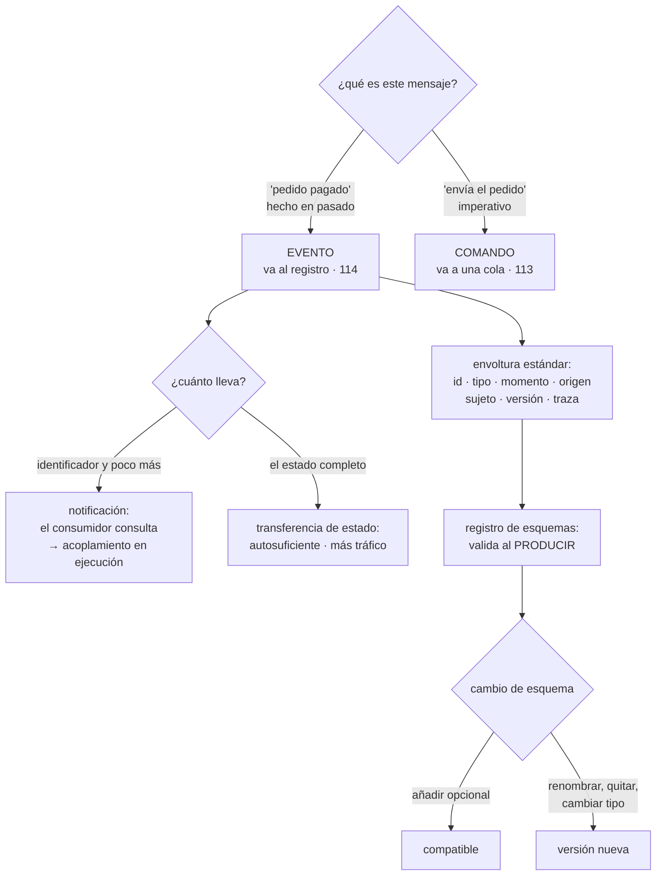

# 115 — Arquitectura dirigida por eventos y contratos

> [← 114 · Pub/sub, streams, particiones y orden](../../part-09-data-messaging-serverless-integration/114-pub-sub-streams-particiones-y-orden/README.md) · [Índice de la parte](../README.md) · [116 · Sagas, outbox, idempotencia y deduplicación →](../../part-09-data-messaging-serverless-integration/116-sagas-outbox-idempotencia-y-deduplicacion/README.md)

**Parte:** 09 — Datos, mensajería, serverless e integración<br>
**Nivel:** avanzado · **Horas estimadas:** 4<br>
**Laboratorio:** `architecture` · **Estado:** `EXECUTABLE_CORE`

## 🎯 Propósito

Diseñar el contenido de los hechos que viajan por el registro de la clase 114, que es donde se decide si una arquitectura de eventos desacopla de verdad o solo cambia el acoplamiento de sitio. La clase distingue tres cosas que se llaman igual y no lo son, establece que **el esquema del evento es una interfaz pública con más obligaciones que una API**, porque el registro conserva mensajes más viejos que cualquier versión del código, y afronta el precio que nadie anuncia: cuando nadie orquesta, nadie sabe responder dónde está el pedido 1421.

## 📚 Resultados de aprendizaje

Al finalizar podrás:

1. **Distinguir** notificación, transferencia de estado y comando disfrazado.
2. **Redactar** eventos como hechos, con envoltura estándar y contenido acotado.
3. **Evolucionar** un esquema conservando compatibilidad en las dos direcciones.
4. **Elegir** entre coreografía y orquestación sabiendo qué se paga.
5. **Evitar** que el esquema interno de una base de datos se convierta en contrato público.

## 🧩 Conceptos centrales

| Concepto | Comprensión verificable |
|---|---|
| `notificación` | Aviso mínimo de que algo pasó; el consumidor consulta al origen para saber más. Poco tráfico, y devuelve el acoplamiento en tiempo de ejecución. |
| `transferencia de estado` | El evento lleva el estado resultante completo. El consumidor no necesita preguntar nada, y a cambio recibe mucho más dato. |
| `comando disfrazado` | Mensaje en imperativo con forma de evento. El productor decide qué debe hacer el consumidor, que es justo lo que se quería evitar. |
| `compatibilidad en dos direcciones` | Un consumidor nuevo debe leer mensajes viejos y uno viejo debe tolerar mensajes nuevos. Con registros conservados hacen falta las dos. |
| `envoltura` | Metadatos comunes a todos los eventos: identificador, tipo, momento, origen, sujeto, versión y traza. Se estandariza una vez para toda la organización. |
| `coreografía` | Cada servicio reacciona a los hechos sin que nadie dirija. Escala organizativamente y hace muy difícil saber el estado de un proceso completo. |

## 🧠 Modelo mental

La base de datos correcta depende del patrón de acceso y de las garantías necesarias; distribuir datos convierte latencia, consistencia y fallos parciales en decisiones de diseño.

Aplicado a esta clase, separa siempre cuatro planos: **intención** (qué necesita el usuario),
**configuración** (qué declaramos), **estado observado** (qué existe de verdad) y
**evidencia** (cómo sabemos que cumple). Confundirlos produce diseños que se ven correctos
en un diagrama pero fallan al operar.

## 🗺️ Flujo de razonamiento



## 📖 Desarrollo

### 1. Tres cosas que se llaman evento

La mayor parte de los problemas de una arquitectura de eventos vienen de mezclar estas tres:

```text
NOTIFICACIÓN
  {"tipo":"pedido.pagado", "pedido":"1421"}
  + mínimo tráfico; el productor no expone su modelo
  − el consumidor tiene que llamar al origen para saber algo
  − y entonces el origen tiene que estar disponible: acoplamiento en ejecución

TRANSFERENCIA DE ESTADO
  {"tipo":"pedido.pagado", "pedido":{ … estado completo … }}
  + el consumidor es autosuficiente y puede procesar en diferido
  + soporta que el origen esté caído
  − más tráfico, y expone parte del modelo del productor

COMANDO DISFRAZADO
  {"tipo":"debe.enviarse.el.pedido", …}
  → no es un evento: es una orden con otro nombre
  → el productor está decidiendo qué hace el consumidor
```

La tercera es la que arruina el diseño sin que se note. La prueba para detectarla:

```text
¿el nombre está en pasado y describe algo que YA ocurrió?
  sí → evento; el productor no sabe quién lo consume ni le importa
  no → comando; va a una cola, con un destinatario concreto
```

Y la elección entre las dos primeras, que es real y se decide por caso:

```text
notificación               cuando el dato es grande, cambia mucho
                           o es sensible
transferencia de estado    cuando el consumidor debe poder trabajar sin
                           el origen, o el proceso es diferido
```

Y una tercera vía muy usada y muy útil: **notificación con lo suficiente**. Se incluye lo que el 90 % de los consumidores necesita y se deja el resto tras una consulta. La forma sana de decidirlo es preguntar a los consumidores, que es lo que el apartado tercero convierte en obligación.

**La envoltura**, que conviene estandarizar una vez para toda la organización:

```json
{
  "id": "e-9f2c41…",
  "tipo": "pedido.pagado",
  "version": 2,
  "momento": "2026-08-03T09:14:22Z",
  "origen": "servicio-pedidos",
  "sujeto": "pedido/1421",
  "traza": "00-a91c…-b7f2…-01",
  "clave_idempotencia": "pago-1421-3",
  "datos": { … }
}
```

Y cada campo está por un motivo concreto:

```text
id                   permite detectar repeticiones (clase 113)
tipo y versión       permiten evolucionar sin romper
momento              el del HECHO, no el de la publicación: son distintos
sujeto               permite filtrar sin abrir el contenido
traza                enlaza el evento con la petición que lo originó
clave_idempotencia   la desarrolla la clase 116
```

La diferencia entre momento del hecho y momento de publicación importa más de lo que parece: en un reproceso, el segundo cambia y el primero no.

### 2. El esquema es una interfaz pública

Un evento publicado lo leen equipos que no conoces, con código que no controlas, y —esto es lo específico de la clase 114— **mensajes escritos hace treinta días siguen ahí**. Eso obliga a más que una API.

```text
en una API          conviven la versión N y la N+1 unos días
en un registro      conviven mensajes de TODAS las versiones publicadas
                    durante todo el periodo de retención
                    y consumidores que aún no se han actualizado
```

De ahí que hagan falta las dos direcciones a la vez:

```text
HACIA ATRÁS   el consumidor NUEVO lee mensajes VIEJOS
              → necesario para reprocesar el histórico
HACIA DELANTE el consumidor VIEJO tolera mensajes NUEVOS
              → necesario porque no se puede desplegar a todos a la vez
```

Y las reglas que las conservan:

```text
SE PUEDE
  añadir un campo OPCIONAL con valor por defecto
  añadir un valor nuevo a una enumeración, si los consumidores
    tienen un caso «desconocido»
  añadir un tipo de evento nuevo

NO SE PUEDE
  quitar un campo
  renombrar un campo
  cambiar el tipo de un campo
  convertir en obligatorio uno que era opcional
  cambiar el significado de un campo sin cambiar su nombre  ← el peor
```

El último es el más dañino porque **ninguna herramienta lo detecta**: el esquema sigue validando y los consumidores interpretan mal. Si `importe` pasa de incluir impuestos a no incluirlos, hay que cambiar el nombre.

Y cuando hay que hacer algo de la lista prohibida, el procedimiento es el de la clase 102 —expandir y contraer— aplicado a eventos:

```text
1. publicar el campo nuevo junto al viejo
2. esperar a que todos los consumidores usen el nuevo, y comprobarlo
3. dejar de publicar el viejo, cuando ya no queden mensajes con él
   dentro de la retención
```

El paso 3 tiene aquí una condición extra: **hay que esperar además a que expire la retención**, o un reproceso encontrará mensajes sin el campo nuevo.

**El registro de esquemas** es lo que convierte estas reglas en algo que se cumple:

```text
guarda el esquema de cada tipo y versión
valida en el momento de PRODUCIR, no de consumir
rechaza los cambios incompatibles antes de publicarlos
```

La segunda línea es la importante: **validar al consumir llega tarde**, porque el mensaje malo ya está en el registro y seguirá ahí durante toda la retención.

Y una obligación organizativa que hace posible todo lo anterior: **el productor tiene que saber quién le consume**. No para pedirle permiso, sino para poder avisar y para poder comprobar el paso 2.

```text
catálogo por tema: quién produce, quién consume, desde cuándo
→ es el catálogo de la clase 095, con una columna más
```

### 3. Coreografía, orquestación y el pedido 1421

Con hechos publicados, hay dos formas de que un proceso de negocio avance:

```text
COREOGRAFÍA
  cada servicio escucha y reacciona; nadie dirige
  + los equipos avanzan sin coordinarse
  + añadir un participante no toca a nadie
  − nadie conoce el proceso completo
  − y nadie puede responder «¿dónde está el pedido 1421?»

ORQUESTACIÓN
  un componente conoce los pasos y los invoca
  + el proceso está en un sitio, legible y consultable
  + los fallos y compensaciones tienen dueño
  − ese componente acopla a todos los participantes
  − y crece hasta contener la lógica de negocio de todos
```

Y el criterio práctico, que no es elegir una:

```text
entre equipos y entre dominios        coreografía
dentro de un proceso de negocio con
pasos, plazos y compensaciones        orquestación
```

La segunda es la clase 119, y las compensaciones son la 116.

Y el precio de la coreografía hay que pagarlo explícitamente, porque no se paga solo:

```text
sin nada        nadie sabe en qué paso está un pedido, ni por qué se paró
con lo mínimo   la traza viaja en la envoltura, y hay una vista que
                reúne todos los eventos de un sujeto
```

Y esa vista —«dame todo lo que le ha pasado al pedido 1421»— es **obligatoria** en una arquitectura coreografiada. Sin ella, el diagnóstico de cualquier incidente consiste en preguntar a seis equipos.

```text
lo mínimo que hace falta
  identificador de traza en todos los eventos del proceso
  campo sujeto uniforme: «pedido/1421»
  un sitio donde consultar por sujeto y ver la secuencia con tiempos
  y qué se esperaba y no llegó
```

La última línea es la difícil: **en coreografía, que un paso no ocurra no produce ningún error**. Es la ley 13 en versión de negocio, y la única defensa es un vigilante de plazos:

```text
si «pedido.pagado» no va seguido de «pedido.preparado» en 30 min
→ alguien tiene que enterarse
```

Y dos antipatrones frecuentes de la coreografía:

```text
BUCLE DE EVENTOS      A reacciona a B y B reacciona a A
                      → se detecta contando saltos en la traza
CASCADA INVISIBLE     un evento dispara once consumidores y nadie lo sabía
                      → el catálogo de consumidores lo hace visible
```

### 4. No publiques tu base de datos

Hay una forma muy cómoda de empezar a publicar eventos: leer el registro de cambios de la base de datos y publicar cada fila modificada. Es potente y tiene una trampa grande.

```text
lo que se publica          filas de tus tablas
lo que eso significa       tu esquema interno pasa a ser contrato público
consecuencia              no puedes renombrar una columna sin romper
                          a cuatro equipos
```

Y además de eso:

```text
el consumidor recibe cambios de FILAS, no hechos de negocio
  → «cambió la columna estado de 3 a 4»
  → y tiene que saber qué significa 4, que es conocimiento tuyo

un hecho de negocio suele tocar varias tablas
  → llegan varios eventos y ninguno es el hecho

se publican también las correcciones y las migraciones
  → una migración que toca 4 millones de filas publica 4 millones de eventos
```

Dónde sí encaja la captura de cambios:

```text
sí   replicar hacia un lago o un almacén analítico (clase 112)
     alimentar un índice de búsqueda
     sacar datos de un sistema heredado que no se puede modificar

no   como contrato de eventos de negocio entre equipos
```

Y la forma correcta cuando se quiere garantizar que el evento se publica si y solo si el cambio se guardó: **escribir el evento en la misma transacción que el cambio, en una tabla propia, y publicarlo desde ahí**. Eso es el patrón de la clase 116, y aquí basta saber que existe y que es distinto de publicar filas.

```text
captura de cambios     publica lo que cambió en las tablas
tabla de salida        publica el HECHO que tú redactaste,
                       con la garantía de que se guardó con el cambio
```

Y el tamaño del evento, que decide más de lo que parece:

```text
muy pequeño     obliga a consultar; devuelve el acoplamiento
muy grande      lleva datos que nadie usa, y los sensibles viajan
                por donde no deberían
adecuado        lo que necesitan la mayoría de los consumidores conocidos
```

Y sobre los datos personales dentro de eventos, una advertencia con consecuencias legales: **un registro conservado es inmutable y difícil de purgar**. Publicar identificadores y dejar los datos personales en el origen evita el problema; publicarlos dentro lo garantiza.

Y la lista de comprobación de la clase:

```text
☐ todos los eventos tienen nombre de hecho en pasado
☐ ningún «evento» dice al consumidor lo que tiene que hacer
☐ la envoltura es la misma en toda la organización
☐ el momento del hecho está separado del de publicación
☐ el esquema está en un registro y se valida al producir
☐ los cambios conservan compatibilidad en las dos direcciones
☐ ningún campo cambia de significado sin cambiar de nombre
☐ hay catálogo de quién produce y quién consume cada tema
☐ existe una vista por sujeto con la secuencia completa y sus tiempos
☐ hay vigilancia de pasos que no ocurren dentro de su plazo
☐ no se publican filas de tablas como contrato de negocio
☐ los datos personales no viajan dentro de eventos conservados
```

Y el cierre que enlaza con la clase siguiente: queda el problema que las clases 113 y 114 han ido aplazando —cómo se garantiza que un hecho se publica exactamente si el cambio se guardó, y cómo se repite una operación sin duplicar su efecto—, y es la materia de la clase 116.

## 🔬 Ejemplo trabajado

**CloudShop lleva ocho meses publicando eventos de pedido. Tres equipos consumen. El ejercicio son los cuatro problemas que aparecieron y lo que cada uno obligó a cambiar en el contrato.**

**Problema 1: un cambio de esquema rompe a cuatro equipos en veinte minutos.**

```text
cambio     el campo «importe» pasa de céntimos a unidades
motivo     «era confuso»
revisión   aprobada por el equipo productor
consumidores avisados                             0
consumidores que existían                         4
```

```text
14:02  se despliega el productor
14:04  facturación emite facturas con importes 100 veces menores
14:11  analítica publica un panel con ingresos del 1 %
14:19  detectado por una persona de finanzas
14:40  revertido
facturas erróneas emitidas                        1.204
rectificativas necesarias                         1.204
```

El esquema seguía validando: **el tipo era el mismo y solo cambió el significado**, que es el caso que ninguna herramienta detecta.

Las tres correcciones:

```text                                          antes         después
registro de esquemas                            no             sí
validación de compatibilidad en la canalización no             sí
cambio de significado                     mismo nombre   nombre nuevo
                                                         (importe_centimos)
catálogo de consumidores por tema                no             sí
```

Y la comprobación de compatibilidad detectó, al implantarla, **otros seis cambios pendientes de despliegue** que habrían roto a alguien.

**Problema 2: nadie sabe dónde está el pedido 1421.**

```text
reclamación de un cliente: «hice el pedido hace 3 días y no llega»
equipos consultados para responder                        6
tiempo hasta poder responder                          2 h 40
causa encontrada    un evento se procesó y el consumidor de
                    preparación estaba parado desde hacía 19 h
quién lo sabía      nadie: un consumidor parado no da error
```

Es la ley 13 en versión de negocio. Lo que se construyó:

```text
vista por sujeto: todos los eventos de «pedido/1421» con tiempos
vigilante de plazos: 7 pares de eventos con su tiempo máximo
alerta cuando el segundo no llega
```

```text                                          antes         después
tiempo hasta responder «¿dónde está?»          2 h 40         40 s
procesos parados detectados por el vigilante      —      11 en 6 meses
de ellos, detectados antes por otro medio         —            2
```

Nueve de once **solo se detectaron por el vigilante de plazos**.

**Problema 3: la captura de cambios que se convirtió en contrato.**

El equipo de búsqueda pidió los cambios del catálogo y se le dio acceso al flujo de captura de cambios de la base de datos.

```text
lo que recibía            filas de la tabla «productos»
a los 5 meses             3 equipos consumiendo lo mismo
intento de renombrar
una columna interna       bloqueado: rompía a los 3
migración de 4,1 M de
filas para un ajuste      publicó 4,1 M de eventos
                          → el consumidor de búsqueda tardó 9 h en digerirlos
                          → y reindexó todo el catálogo sin motivo
```

La corrección fue publicar hechos redactados, no filas:

```text                                    captura de cambios   hechos redactados
lo que viaja                          filas de la tabla     producto.publicado
                                                            producto.retirado
                                                            producto.reprecio
esquema interno como contrato               sí                    no
eventos por migración de 4,1 M filas    4,1 millones            0
equipos bloqueados por renombrar             3                   0
```

Y la captura de cambios se conservó para lo que sí encaja: **alimentar el lago de la clase 112**.

**Problema 4: el comando disfrazado.**

```text
tema publicado           «pedido.debe.enviarse»
consumidor               un solo servicio, el de logística
qué pasó                 logística cambió su proceso y necesitaba dos pasos
                         → pidió al equipo de pedidos que publicara
                           «pedido.debe.empaquetarse» primero
```

El equipo de pedidos estaba tomando decisiones sobre el proceso de logística. El diagnóstico con la prueba del apartado primero:

```text
¿está en pasado y describe algo ocurrido?   no: es un imperativo
→ no es un evento
```

```text                                          antes             después
lo que publica pedidos             pedido.debe.enviarse    pedido.pagado
quién decide los pasos de logística     pedidos              logística
cambios en logística que exigen
tocar pedidos                          todos                 ninguno
consumidores del hecho                   1                     3
```

La última fila fue la sorpresa: al publicar el hecho en vez de la orden, **dos equipos más lo consumieron** sin que nadie tuviera que hacer nada.

**El tamaño del evento, decidido preguntando.**

```text
propuesta inicial       notificación mínima: solo el identificador
consultado a los 3 consumidores conocidos:
  facturación   necesita importe, impuestos y cliente
  analítica     necesita todo lo anterior y el canal
  búsqueda      no consume este evento
decisión        incluir lo que necesitan los dos, y nada más
tamaño medio    1,8 KB
consultas al origen tras el cambio    de 12.000/día a 40/día
```

**A los seis meses.**

```text                                          antes         después
registro de esquemas                            no             sí
cambios incompatibles llegados a producción    1 grave      0 (6 bloqueados)
catálogo de productores y consumidores         no             sí
vista por sujeto                                no             sí
tiempo hasta responder «¿dónde está?»        2 h 40          40 s
procesos parados detectados                     0        11 / 6 meses
comandos disfrazados de evento                  3              0
temas que publican filas de tablas              2         0 (1 al lago)
consultas al origen por evento pequeño       12.000/día      40/día
```

**La lección que esta clase traslada a la parte 09**: los cuatro problemas eran de contrato, no de infraestructura. El registro de la clase 114 funcionaba perfectamente en los cuatro casos. Y el más caro —mil doscientas facturas rectificativas— lo causó **un cambio que todas las validaciones automáticas consideraban compatible**, porque el tipo del campo no cambió: solo su significado. Contra eso, la única defensa que funcionó fue organizativa: saber quién consume y avisarle.

## 🧪 Laboratorio guiado

Ejecuta desde la raíz:

```bash
python classes/part-09-data-messaging-serverless-integration/115-arquitectura-dirigida-por-eventos-y-contratos/lab.py
```

El laboratorio selecciona el motor de práctica **`architecture`** y produce
`lab_result.json`. El escenario, sus comprobaciones y el artefacto esperado corresponden a
esta clase; no requiere credenciales y deja explícito qué debe revalidarse en un sandbox real.

1. Lee `exercise.steps` y formula una predicción antes de ejecutar.
2. Ejecuta la práctica y verifica todos los elementos de `checks`.
3. Provoca el caso de `negative_test` y explica la señal observada.
4. Materializa `catalogo-eventos` en `evidence/` usando la plantilla indicada.
5. Para proveedor real, sigue `sandbox.requires`, registra costo y ejecuta `destroy`.

### Evidencia esperada

El artefacto principal es un diagrama acompañado por decisiones y trade-offs. Además, la entrega debe incluir el comando ejecutado,
la salida estructurada y una conclusión que no exceda lo observado.

## 🏆 Reto verificable

Construye **`catalogo-eventos`** para el caso CloudShop. Incluye una alternativa descartada,
un supuesto que pueda falsarse, una prueba de fallo y una decisión de rollback.

## ✅ Criterio de aceptación

- [ ] `lab.py` termina con código 0 y genera JSON válido.
- [ ] La entrega conecta al menos tres requisitos con mecanismos verificables.
- [ ] Existe una prueba positiva y una prueba negativa con evidencia.
- [ ] Seguridad, costo y operación aparecen como decisiones, no como anexos.
- [ ] Se declara una limitación y una condición que obligaría a revisar el diseño.
- [ ] Otra persona puede repetir el recorrido sin conocimiento tácito.

## ⚠️ Errores frecuentes

| Síntoma | Causa probable | Corrección |
|---|---|---|
| Un cambio de esquema que valida correctamente rompe a los consumidores | Cambió el significado del campo sin cambiar su nombre, y eso ninguna herramienta lo detecta | Si cambia el significado, cambia el nombre; y mantén catálogo de consumidores para avisar. |
| Nadie puede decir en qué paso está un proceso | Coreografía sin vista por sujeto ni vigilancia de plazos | Identificador de traza y sujeto uniformes en la envoltura, vista por sujeto y alerta cuando un paso esperado no llega a tiempo. |
| No se puede renombrar una columna interna sin romper a otros equipos | Se publican filas de tablas, así que el esquema interno es contrato público | Publica hechos de negocio redactados; deja la captura de cambios para alimentar el lago. |
| Una migración de datos genera millones de eventos y satura a los consumidores | Los eventos salen del registro de cambios de la base, no de hechos de negocio | Publica hechos, y si hay que reprocesar, hazlo por un canal separado y anunciado. |
| El productor tiene que cambiar cada vez que cambia el proceso del consumidor | Está publicando comandos disfrazados de eventos | Publica hechos en pasado; si el mensaje dice qué hacer, va a una cola con destinatario. |
| Un reproceso del histórico falla porque faltan campos | Se retiró un campo antes de que expirara la retención del registro | En expandir y contraer sobre registros conservados, espera además a que caduquen los mensajes con el formato antiguo. |

## 🛡️ Seguridad, ética y costo

Trabaja con cuentas propias o sandboxes autorizados. No publiques secretos, identificadores
reales ni datos personales. Antes de crear recursos pagos define presupuesto, etiquetas y
comando de destrucción; después verifica que no queden recursos huérfanos. Los ejemplos
locales enseñan contratos, pero no certifican cumplimiento ni disponibilidad de producción.

## ❓ Preguntas de comprobación

1. ¿Qué prueba distingue un evento de un comando disfrazado?
2. ¿Por qué un registro conservado exige compatibilidad en las dos direcciones?
3. ¿Qué cambio de esquema es el más peligroso y por qué no lo detecta ninguna herramienta?
4. ¿Qué es obligatorio construir si se elige coreografía?
5. ¿Cuándo encaja la captura de cambios y cuándo no debe usarse?

## 🔗 Referencias

- CloudEvents (2025). *Specification* — envoltura común: identificador, tipo, origen, sujeto y momento. <https://github.com/cloudevents/spec/blob/main/cloudevents/spec.md>
- Fowler, M. (2025). *What do you mean by event-driven?* — notificación, transferencia de estado y sus consecuencias. <https://martinfowler.com/articles/201701-event-driven.html>
- Confluent (2025). *Schema Registry: compatibility types* — compatibilidad hacia atrás, hacia delante y completa. <https://docs.confluent.io/platform/current/schema-registry/fundamentals/avro.html>
- Richardson, C. (2025). *Saga and event choreography trade-offs* — coreografía frente a orquestación. <https://microservices.io/patterns/data/saga.html>
- Debezium (2025). *Change data capture: when to use it* — límites de publicar cambios de filas como contrato. <https://debezium.io/documentation/reference/stable/architecture.html>
- Documentación oficial vigente del servicio implementado; registra URL y fecha de consulta.

---

> [Evaluación](assessment.md) · [Contrato de clase](lesson.yaml) · [Índice de la parte](../README.md)

| Anterior | Índice | Siguiente |
|---|---|---|
| [← 114 · Pub/sub, streams, particiones y orden](../../part-09-data-messaging-serverless-integration/114-pub-sub-streams-particiones-y-orden/README.md) | [Parte 09](../README.md) · [Programa](../../README.md) | [116 · Sagas, outbox, idempotencia y deduplicación →](../../part-09-data-messaging-serverless-integration/116-sagas-outbox-idempotencia-y-deduplicacion/README.md) |
