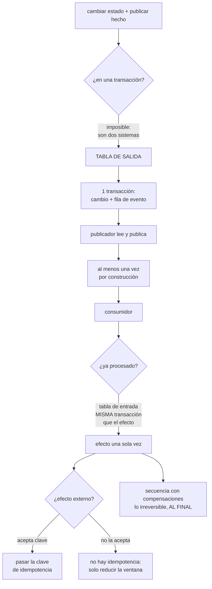

# 116 — Sagas, outbox, idempotencia y deduplicación

> [← 115 · Arquitectura dirigida por eventos y contratos](../../part-09-data-messaging-serverless-integration/115-arquitectura-dirigida-por-eventos-y-contratos/README.md) · [Índice de la parte](../README.md) · [117 · Serverless: límites, cold starts y concurrencia →](../../part-09-data-messaging-serverless-integration/117-serverless-limites-cold-starts-y-concurrencia/README.md)

**Parte:** 09 — Datos, mensajería, serverless e integración<br>
**Nivel:** avanzado · **Horas estimadas:** 4<br>
**Laboratorio:** `distributed` · **Estado:** `EXECUTABLE_CORE`

## 🎯 Propósito

Resolver lo que las clases 113, 114 y 115 fueron aplazando. Son dos problemas distintos y se confunden todo el rato: **guardar un cambio y publicar su hecho no se puede hacer de forma atómica**, y **un consumidor que recibe el mismo mensaje dos veces no debe producir dos efectos**. La clase da la solución de cada uno —tabla de salida e idempotencia real, no aproximada— y luego afronta el caso general: cuando una operación abarca varios servicios y no existe ninguna transacción que los cubra.

## 📚 Resultados de aprendizaje

Al finalizar podrás:

1. **Explicar** por qué la doble escritura no puede ser atómica y qué pierde cada atajo.
2. **Implantar** la tabla de salida y su gemela en el consumidor.
3. **Elegir** la técnica de idempotencia adecuada a cada efecto, incluidos los externos.
4. **Diseñar** una secuencia con compensaciones, y ordenar los pasos por reversibilidad.
5. **Enunciar** qué se consigue de verdad: efecto una sola vez, no entrega una sola vez.

## 🧩 Conceptos centrales

| Concepto | Comprensión verificable |
|---|---|
| `doble escritura` | Guardar en la base y publicar en el intermediario como dos operaciones. Entre las dos puede fallar todo, y no hay transacción que las cubra. |
| `tabla de salida` | El evento se escribe en la misma transacción que el cambio, en una tabla propia. Un publicador la lee y publica después. |
| `tabla de entrada` | El consumidor registra el identificador de lo procesado en la misma transacción que el efecto. Es lo que hace la deduplicación fiable. |
| `idempotencia` | Repetir la operación no añade efecto. No es «detectar duplicados»: es que repetir sea inofensivo. |
| `compensación` | Operación de negocio que anula el efecto de un paso anterior. No es una vuelta atrás: es un hecho nuevo y visible. |
| `efecto una sola vez` | Entrega al menos una vez más proceso idempotente. Es lo máximo alcanzable, y es suficiente. |

## 🧠 Modelo mental

La base de datos correcta depende del patrón de acceso y de las garantías necesarias; distribuir datos convierte latencia, consistencia y fallos parciales en decisiones de diseño.

Aplicado a esta clase, separa siempre cuatro planos: **intención** (qué necesita el usuario),
**configuración** (qué declaramos), **estado observado** (qué existe de verdad) y
**evidencia** (cómo sabemos que cumple). Confundirlos produce diseños que se ven correctos
en un diagrama pero fallan al operar.

## 🗺️ Flujo de razonamiento



## 📖 Desarrollo

### 1. La doble escritura no tiene atajo

El problema aparece en cuanto un servicio guarda algo y publica un hecho:

```text
BEGIN
  UPDATE pedidos SET estado='pagado' WHERE id=1421
COMMIT
publicar("pedido.pagado", 1421)      ← si falla aquí, el hecho no existe
```

Y el orden inverso no mejora nada:

```text
publicar("pedido.pagado", 1421)
BEGIN … COMMIT                        ← si falla aquí, el hecho es MENTIRA
```

Las dos son la misma imposibilidad: **son dos sistemas distintos y no hay transacción que los abarque**. Y los atajos habituales pierden algo cada uno:

```text
publicar dentro de la transacción
  el intermediario no participa; si la transacción se deshace,
  el mensaje ya salió

reintentar la publicación en memoria
  si el proceso muere, se pierde

transacción distribuida de dos fases
  existe, y casi ningún intermediario moderno la soporta;
  y bloquea recursos mientras dura

no hacer nada y esperar que no pase
  pasa; con 10.000 operaciones al día, varias veces al mes
```

**La solución es la tabla de salida**, y consiste en no tener dos sistemas en el momento crítico:

```sql
BEGIN;
  UPDATE pedidos SET estado='pagado' WHERE id=1421;
  INSERT INTO salida (id, tipo, sujeto, datos, creado)
  VALUES ('e-9f2c', 'pedido.pagado', 'pedido/1421', '{…}', now());
COMMIT;
```

Y después, un publicador lee la tabla y publica:

```text
lee las filas no publicadas, en orden
publica
marca como publicadas

si muere entre publicar y marcar → publica otra vez
→ AL MENOS UNA VEZ, por construcción
→ y por eso el consumidor tiene que ser idempotente: apartado tercero
```

Lo operativo, que decide si esto funciona:

```text
ORDEN         leer por identificador creciente; publicar en orden por sujeto
LIMPIEZA      borrar lo publicado con cierta antigüedad, o la tabla crece
              sin fin → y no borrarlo no da ningún error (ley 13)
RETRASO       vigilar la antigüedad de la fila no publicada más vieja
              → es la señal, igual que en la clase 113
COMPETENCIA   varios publicadores requieren bloqueo o reparto por sujeto
```

Y dos formas de leer la tabla:

```text
sondeo periódico          simple, y añade latencia y carga
captura de cambios sobre
la tabla de salida        latencia baja y sin carga de sondeo
                          → aquí sí encaja la captura de cambios (clase 115),
                            porque la tabla la escribes tú a propósito
```

Y la simétrica en el consumidor, **la tabla de entrada**, que es lo que hace que la deduplicación sea fiable y no aproximada:

```sql
BEGIN;
  INSERT INTO procesados (id_mensaje) VALUES ('e-9f2c');  -- falla si ya está
  UPDATE inventario SET reservado = reservado + 1 WHERE sku='X';
COMMIT;
```

Si la inserción falla por duplicado, la transacción entera se deshace y no hay segundo efecto. **La clave está en que las dos cosas estén en la misma transacción**: comprobar antes y actuar después deja una ventana en la que dos consumidores pasan la comprobación.

### 2. Idempotencia de verdad

Idempotente no significa «detecta duplicados»: significa que **repetir no añade efecto**. Las técnicas, de más robusta a menos:

```text
1. OPERACIÓN NATURALMENTE IDEMPOTENTE
   estado = 'pagado'            repetir no cambia nada
   frente a  saldo = saldo - 10  repetir descuenta otra vez
   → siempre que se pueda, expresar el efecto como asignación
     y no como incremento

2. RESTRICCIÓN ÚNICA SOBRE LA CLAVE NATURAL
   UNIQUE (pedido_id, tipo_movimiento)
   → la base impide el segundo efecto, sin código
   → es la más fuerte porque no depende de que nadie se acuerde

3. ESCRITURA CONDICIONAL POR VERSIÓN
   UPDATE … WHERE id=1421 AND version=7
   → si otro ya aplicó, afecta a 0 filas y se detecta
   → sirve también contra el desorden: descarta lo viejo (clase 113)

4. TABLA DE DEDUPLICACIÓN CON CLAVE
   la del apartado anterior, en la misma transacción que el efecto
   → general y aplicable a casi todo
   → cuidado con su caducidad: ver más abajo
```

Y el detalle de la cuarta que casi siempre se hace mal: **la caducidad de la tabla de deduplicación es una ventana de corrección, no de limpieza**.

```text
caducidad de 24 h
→ un mensaje reentregado a las 30 h se procesa otra vez
→ ¿puede eso ocurrir? con reprocesos de la clase 114, sí
```

La regla: **la caducidad debe superar la retención del registro y cualquier ventana de reproceso previsible**.

Y de dónde sale la clave, porque generarla mal invalida todo:

```text
bien   el identificador del mensaje, si el productor lo genera una vez
       y lo repite en los reenvíos
bien   una clave derivada del negocio: «pago-1421-intento-3»
mal    generarla en el consumidor  → cada intento tiene una distinta
mal    usar la marca de tiempo     → cambia en cada reenvío
```

**Los efectos externos**, que es el caso duro y el que se pasa por alto:

```text
cobrar en un proveedor de pago
enviar un correo
llamar a la API de un transportista
```

Aquí la idempotencia **no depende de ti**:

```text
si el proveedor acepta una clave de idempotencia
  → pásasela, derivada del negocio, y él deduplica
  → esto es lo que hace correcta la operación, no tu tabla

si NO la acepta
  → no hay idempotencia posible
  → solo se puede reducir la ventana: registrar «voy a llamar» antes,
    y conciliar después con el estado del proveedor
```

Y la conciliación de la última línea es trabajo real y periódico: comparar lo que crees haber hecho con lo que el proveedor dice que ocurrió. **Casi nadie la monta hasta el primer descuadre.**

Y la conclusión que ordena la parte 09 entera:

```text
entrega al menos una vez  (clases 113 y 114, y no hay alternativa)
+ proceso idempotente     (esta clase)
= EFECTO UNA SOLA VEZ
```

### 3. Cuando no hay transacción que abarque

Un pedido toca inventario, pago, envío y notificación, y cada uno vive en su servicio con su base. No existe ninguna transacción que abarque los cuatro.

Lo que sí existe es una **secuencia de transacciones locales, cada una con su compensación**:

```text
paso 1  reservar inventario        compensar: liberar la reserva
paso 2  cobrar                     compensar: devolver
paso 3  crear el envío             compensar: cancelar el envío
paso 4  notificar al cliente       compensar: NO SE PUEDE
```

Y de ahí las tres verdades incómodas de este patrón:

```text
1. COMPENSAR NO ES DESHACER
   una devolución no es que el cobro no ocurriera: es otro hecho,
   visible para el cliente y para la contabilidad

2. HAY PASOS QUE NO SE COMPENSAN
   un correo enviado, una llamada a un tercero, un envío ya recogido
   → hay que ORDENAR los pasos: lo irreversible, lo más tarde posible

3. NO HAY AISLAMIENTO
   entre el paso 1 y el 4, otro proceso ve el estado intermedio
   → un inventario reservado y un pago pendiente son visibles
```

La tercera es la que produce errores raros, y la defensa es hacer explícito el estado intermedio:

```text
estados de negocio, no booleanos
  pendiente_de_pago, reservado, confirmado, cancelado
y quien consulte tiene que saber tratarlos
```

Y el tiempo, que es la parte que se olvida: **un paso puede no responder nunca**. Cada paso necesita un plazo y una decisión al vencerlo:

```text
si el paso 2 no responde en 5 min
  → ¿se compensa el paso 1 o se sigue esperando?
  → hay que decidirlo por adelantado, y por paso
```

Y el peor caso de todos, que hay que mirar de frente: **la compensación también puede fallar**. La respuesta honesta no es más automatismo:

```text
reintentar la compensación, con límite
y si sigue fallando → cola de intervención humana, con todo el contexto
→ una secuencia atascada tiene que ser VISIBLE, no silenciosa
```

**Cómo se coordina**, que enlaza con la clase 115:

```text
COREOGRAFIADA   cada servicio reacciona al hecho anterior
                + sin componente central
                − nadie conoce la secuencia entera; compensar en cadena
                  es difícil de seguir

ORQUESTADA      un componente conoce los pasos y las compensaciones
                + la secuencia está escrita en un sitio
                + los plazos y los atascos tienen dueño
                − acopla a los participantes
```

Y el criterio: **si hay compensaciones y plazos, orquestar**. La coreografía es buena para propagar hechos; para procesos con vuelta atrás, tener la secuencia en un sitio vale más que la independencia. Es la clase 119.

Y la lista de comprobación de la clase:

```text
☐ no hay ninguna doble escritura sin tabla de salida
☐ el publicador vigila la antigüedad de la fila más vieja sin publicar
☐ la tabla de salida se limpia, y ese trabajo está programado
☐ el consumidor registra lo procesado en la MISMA transacción que el efecto
☐ la caducidad de la deduplicación supera la retención y la ventana de reproceso
☐ la clave de idempotencia la genera el productor y se repite en los reenvíos
☐ los efectos externos reciben clave de idempotencia; si no la aceptan,
  hay conciliación periódica
☐ los pasos irreversibles están al final de la secuencia
☐ cada paso tiene plazo y decisión al vencerlo
☐ los estados intermedios son estados de negocio y quien consulta los conoce
☐ una compensación que falla acaba en una cola visible, no en silencio
```

Y el cierre que enlaza con la clase siguiente: todo esto supone procesos que se ejecutan en algún sitio con control sobre su tiempo de vida. Cuando ese sitio es una función efímera con límites de duración, concurrencia y arranque, varias de estas garantías se complican, y es la materia de la clase 117.

## 🔬 Ejemplo trabajado

**CloudShop arrastra tres problemas de las clases anteriores: eventos que no se publicaron, cobros duplicados y pedidos que se quedan a medias. Los tres se resuelven aquí, y el tercero enseña lo que cuesta no tener transacciones.**

**Problema 1: los eventos que nunca existieron.**

Una auditoría comparó pedidos pagados con eventos publicados:

```text
pedidos con estado 'pagado' en 6 meses            412.880
eventos 'pedido.pagado' publicados                412.301
faltan                                                579
```

Quinientos setenta y nueve pedidos cobrados que **facturación nunca supo que existían**. Y ninguno produjo un error: la transacción de la base había ido bien y la publicación había fallado después.

```text
causas de los 579
  reinicio del proceso entre confirmar y publicar        341
  intermediario no disponible unos segundos              203
  errores de red                                          35
```

Con tabla de salida:

```text                                    doble escritura   tabla de salida
eventos perdidos en 6 meses                    579                0
latencia de publicación (sondeo cada 2 s)      inmediata        ~1,1 s
latencia con captura de cambios sobre la tabla     —            ~90 ms
filas acumuladas sin limpieza a los 2 meses        —        41 millones
```

La última fila es el trabajo nuevo que apareció, y tardó dos meses en verse porque **no daba ningún error**. Se programó la limpieza y una alerta por antigüedad de la fila más vieja sin publicar, que en cuatro meses detectó tres publicadores parados.

**Problema 2: los cobros duplicados, de la clase 113.**

La clase 113 dejó residuo tras ajustar la invisibilidad:

```text
duplicados residuales                        0-2 por semana
causa                        reentrega tras muerte del consumidor
```

El primer intento fue una tabla de deduplicación consultada antes de cobrar:

```text
SELECT … FROM procesados WHERE id = ?     -- si existe, salir
… cobrar …
INSERT INTO procesados …
```

Y siguió habiendo duplicados, menos:

```text                                    antes    comprobar antes    misma transacción
duplicados por semana                     0-2          0-1                 0
```

La razón es la del apartado primero: **entre la consulta y la inserción caben dos consumidores**. Con la inserción y el efecto local en la misma transacción, el problema local desapareció.

Pero el cobro es un efecto **externo**, y ahí la transacción local no alcanza:

```text
la transacción local puede deshacerse DESPUÉS de que el proveedor cobró
→ y el proveedor ya cobró
```

La corrección real fue pasar la clave al proveedor:

```text                                    sin clave      con clave de idempotencia
cobros duplicados en 6 meses                 47                    0
lo que hace el proveedor con el repetido   cobra      devuelve el cobro original
```

Y para el proveedor de mensajería, que **no** acepta clave, se montó la conciliación:

```text
comparación diaria entre envíos que creemos haber creado y los suyos
descuadres encontrados el primer día                       94
descuadres al mes 6                                       0-3
tiempo hasta detectar un descuadre     de nunca a menos de 24 h
```

**Problema 3: los pedidos a medias.**

```text
pedidos en estado inconsistente al mes                     31
  inventario reservado y pago fallido                      19
  pago hecho y envío no creado                              9
  envío creado y pedido cancelado                           3
cómo se detectaban       reclamaciones de clientes
cómo se arreglaban       a mano, por el equipo de soporte
```

La tercera línea es la peor: **envío creado y pedido cancelado** significa mercancía que salió de un pedido que no existe.

Se escribió la secuencia con compensaciones y se reordenó por reversibilidad:

```text
ORDEN ORIGINAL                    ORDEN CORREGIDO
1 crear pedido                    1 crear pedido (pendiente)
2 notificar al cliente            2 reservar inventario
3 reservar inventario             3 cobrar
4 cobrar                          4 crear envío
5 crear envío                     5 notificar al cliente   ← irreversible, al final
```

El cambio de la notificación del segundo al quinto lugar eliminó por sí solo una categoría entera de problemas:

```text
correos de confirmación de pedidos que luego fallaban
  antes:  118 en 6 meses
  después:  0
```

Y los plazos por paso, con su decisión:

```text
paso          plazo     al vencer
reservar      30 s      reintentar 3 veces, luego cancelar
cobrar         5 min    compensar la reserva y marcar pendiente_de_pago
crear envío   15 min    reintentar; a los 15 min, cola de intervención
notificar      1 h      reintentar; no bloquea el pedido
```

Y lo que ocurrió con las compensaciones que fallan:

```text
compensaciones ejecutadas en 6 meses               1.412
  correctas                                        1.397
  fallidas tras 3 intentos                            15
  → a cola de intervención humana con todo el contexto
tiempo medio de resolución de esas 15            22 min
pedidos inconsistentes detectados por clientes       0
```

Quince casos en seis meses que **una persona resolvió en veintidós minutos de media**, en lugar de treinta y uno al mes descubiertos por reclamaciones.

**Y el estado intermedio visible, que causó un incidente propio.**

```text
síntoma   el panel de existencias mostraba menos stock del real
causa     las reservas de secuencias en curso se contaban como vendidas
          y algunas se compensaban minutos después
efecto    se dejaron de vender 340 unidades que estaban disponibles
```

Es la falta de aislamiento del apartado tercero. La corrección fue hacer explícitos los estados:

```text                                    antes            después
estados de inventario              disponible/vendido   disponible /
                                                        reservado_en_curso /
                                                        vendido
el panel muestra                   disponible           disponible +
                                                        reservado_en_curso,
                                                        separados
unidades no vendidas por el error     340                  0
```

**A los seis meses.**

```text                                          antes         después
eventos perdidos                          579 / 6 meses        0
cobros duplicados                          47 / 6 meses        0
descuadres con el transportista           no se sabía         0-3 / mes
pedidos inconsistentes                     31 / mes           0
correos de confirmación erróneos          118 / 6 meses        0
unidades bloqueadas por estado intermedio     340              0
casos que requieren intervención humana        —          15 / 6 meses
tiempo medio de esa intervención               —            22 min
trabajo nuevo: limpieza de la tabla de salida  —          programado
```

**La lección que esta clase traslada a la parte 09**: ninguno de los tres problemas se resolvió con una garantía del intermediario. Se resolvieron **moviendo el punto donde ocurre la atomicidad**: la tabla de salida mete el hecho en la misma transacción que el cambio, la tabla de entrada mete la deduplicación en la misma transacción que el efecto, y la clave de idempotencia traslada el mismo truco al proveedor externo. Y donde ese truco no se puede aplicar —el transportista que no acepta clave, la compensación que falla— la respuesta honesta no es más automatismo: es **conciliar periódicamente y hacer visible lo que necesita una persona**.

## 🧪 Laboratorio guiado

Ejecuta desde la raíz:

```bash
python classes/part-09-data-messaging-serverless-integration/116-sagas-outbox-idempotencia-y-deduplicacion/lab.py
```

El laboratorio selecciona el motor de práctica **`distributed`** y produce
`lab_result.json`. El escenario, sus comprobaciones y el artefacto esperado corresponden a
esta clase; no requiere credenciales y deja explícito qué debe revalidarse en un sandbox real.

1. Lee `exercise.steps` y formula una predicción antes de ejecutar.
2. Ejecuta la práctica y verifica todos los elementos de `checks`.
3. Provoca el caso de `negative_test` y explica la señal observada.
4. Materializa `transaccion-distribuida` en `evidence/` usando la plantilla indicada.
5. Para proveedor real, sigue `sandbox.requires`, registra costo y ejecuta `destroy`.

### Evidencia esperada

El artefacto principal es una traza de consistencia, reintento o fallo parcial. Además, la entrega debe incluir el comando ejecutado,
la salida estructurada y una conclusión que no exceda lo observado.

## 🏆 Reto verificable

Construye **`transaccion-distribuida`** para el caso CloudShop. Incluye una alternativa descartada,
un supuesto que pueda falsarse, una prueba de fallo y una decisión de rollback.

## ✅ Criterio de aceptación

- [ ] `lab.py` termina con código 0 y genera JSON válido.
- [ ] La entrega conecta al menos tres requisitos con mecanismos verificables.
- [ ] Existe una prueba positiva y una prueba negativa con evidencia.
- [ ] Seguridad, costo y operación aparecen como decisiones, no como anexos.
- [ ] Se declara una limitación y una condición que obligaría a revisar el diseño.
- [ ] Otra persona puede repetir el recorrido sin conocimiento tácito.

## ⚠️ Errores frecuentes

| Síntoma | Causa probable | Corrección |
|---|---|---|
| Hay cambios guardados cuyo evento nunca se publicó, sin ningún error | Doble escritura: la base y el intermediario son dos sistemas y no hay transacción que los cubra | Tabla de salida: el evento se escribe en la misma transacción que el cambio y un publicador lo envía después. |
| La deduplicación reduce los duplicados pero no los elimina | Se comprueba antes y se registra después: entre las dos caben dos consumidores | Registra el identificador procesado en la misma transacción que el efecto, y deja que la restricción única falle. |
| Se cobra dos veces aunque el consumidor sea idempotente localmente | El efecto está en un sistema externo y la transacción local no lo abarca | Pasa una clave de idempotencia derivada del negocio al proveedor; si no la acepta, monta conciliación periódica. |
| Se envía una confirmación de un pedido que luego se cancela | Un paso irreversible está antes que pasos que pueden fallar | Ordena la secuencia por reversibilidad y deja lo irreversible al final. |
| Otros procesos ven datos a medias mientras la secuencia avanza | Una secuencia con compensaciones no tiene aislamiento | Haz explícitos los estados intermedios como estados de negocio y adapta lo que consulta. |
| La tabla de salida crece sin límite | Ley 13: no limpiar lo publicado no produce ningún error | Programa la limpieza y alerta por antigüedad de la fila más vieja sin publicar. |

## 🛡️ Seguridad, ética y costo

Trabaja con cuentas propias o sandboxes autorizados. No publiques secretos, identificadores
reales ni datos personales. Antes de crear recursos pagos define presupuesto, etiquetas y
comando de destrucción; después verifica que no queden recursos huérfanos. Los ejemplos
locales enseñan contratos, pero no certifican cumplimiento ni disponibilidad de producción.

## ❓ Preguntas de comprobación

1. ¿Por qué guardar y publicar no puede ser atómico, y qué pierde cada atajo?
2. ¿Por qué la deduplicación debe estar en la misma transacción que el efecto?
3. ¿De dónde debe salir la clave de idempotencia y por qué no vale generarla en el consumidor?
4. ¿Qué se hace cuando un proveedor externo no acepta clave de idempotencia?
5. ¿Qué tres cosas distinguen una compensación de una vuelta atrás?

## 🔗 Referencias

- Richardson, C. (2025). *Transactional outbox pattern* — publicar el hecho en la misma transacción que el cambio. <https://microservices.io/patterns/data/transactional-outbox.html>
- Richardson, C. (2025). *Saga pattern* — transacciones locales con compensación, coreografiadas y orquestadas. <https://microservices.io/patterns/data/saga.html>
- Stripe (2025). *Idempotent requests* — clave de idempotencia en un efecto externo y su ventana. <https://docs.stripe.com/api/idempotent_requests>
- Helland, P. (2012). *Idempotence is not a medical condition* — idempotencia como propiedad del efecto, no de la entrega. <https://queue.acm.org/detail.cfm?id=2187821>
- Garcia-Molina, H. y Salem, K. (1987). *Sagas* — el artículo original sobre transacciones largas con compensación. <https://www.cs.cornell.edu/andru/cs711/2002fa/reading/sagas.pdf>
- Documentación oficial vigente del servicio implementado; registra URL y fecha de consulta.

---

> [Evaluación](assessment.md) · [Contrato de clase](lesson.yaml) · [Índice de la parte](../README.md)

| Anterior | Índice | Siguiente |
|---|---|---|
| [← 115 · Arquitectura dirigida por eventos y contratos](../../part-09-data-messaging-serverless-integration/115-arquitectura-dirigida-por-eventos-y-contratos/README.md) | [Parte 09](../README.md) · [Programa](../../README.md) | [117 · Serverless: límites, cold starts y concurrencia →](../../part-09-data-messaging-serverless-integration/117-serverless-limites-cold-starts-y-concurrencia/README.md) |
