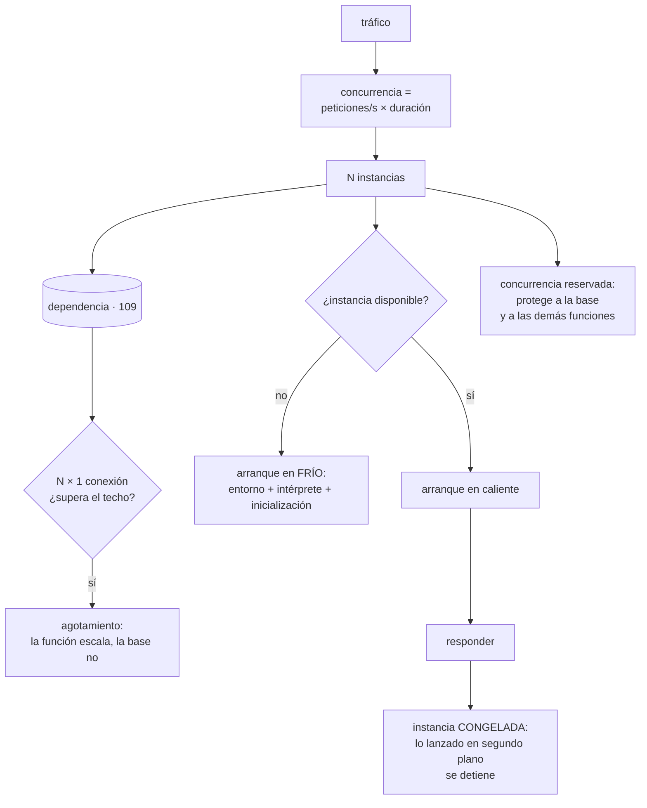

# 117 — Serverless: límites, cold starts y concurrencia

> [← 116 · Sagas, outbox, idempotencia y deduplicación](../../part-09-data-messaging-serverless-integration/116-sagas-outbox-idempotencia-y-deduplicacion/README.md) · [Índice de la parte](../README.md) · [118 · API management, cuotas, versiones y monetización →](../../part-09-data-messaging-serverless-integration/118-api-management-cuotas-versiones-y-monetizacion/README.md)

**Parte:** 09 — Datos, mensajería, serverless e integración<br>
**Nivel:** avanzado · **Horas estimadas:** 4<br>
**Laboratorio:** `serverless` · **Estado:** `EXECUTABLE_CORE`

## 🎯 Propósito

Ejecutar código sin gestionar servidores, entendiendo que todo lo que hay que aprender se deduce de una sola renuncia: **el proceso puede desaparecer y reaparecer, y una instancia atiende una petición a la vez**. De ahí salen la aritmética de la concurrencia, que es también la del coste; el arranque en frío, que importa en unos casos y en otros no; los límites que obligan a partir el trabajo; y el conflicto con lo que la clase 109 dejó claro sobre las conexiones.

## 📚 Resultados de aprendizaje

Al finalizar podrás:

1. **Calcular** la concurrencia y el coste a partir del tráfico y la duración.
2. **Reducir** el arranque en frío y decidir si en este caso importa.
3. **Diseñar** dentro de los límites de duración, memoria y estado.
4. **Proteger** las dependencias de la concurrencia, y a otras funciones entre sí.
5. **Reconocer** cuándo este modelo deja de ser la elección adecuada.

## 🧩 Conceptos centrales

| Concepto | Comprensión verificable |
|---|---|
| `una petición por instancia` | Cada ejecución ocupa su instancia entera. La concurrencia es el número de instancias vivas, no de hilos. |
| `arranque en frío` | Tiempo añadido cuando hay que crear una instancia nueva: preparar el entorno, cargar el intérprete e inicializar el código. |
| `concurrencia reservada` | Límite máximo de instancias de una función. Sirve para dos cosas opuestas: garantizarle capacidad y evitar que se coma la de los demás. |
| `congelación tras responder` | Al devolver la respuesta, la instancia se congela. El trabajo lanzado en segundo plano se detiene a mitad y puede reanudarse mucho después. |
| `memoria acoplada al procesador` | En la mayoría de las plataformas, la memoria asignada determina también la potencia. Subir memoria puede abaratar, no encarecer. |
| `punto de cruce de coste` | Nivel de uso a partir del cual pagar por ejecución sale más caro que mantener capacidad encendida. |
| `límite de tiempo` | Duración máxima de una ejecución. Es un límite duro que obliga a partir el trabajo o a cambiar de modelo. |

## 🧠 Modelo mental

La base de datos correcta depende del patrón de acceso y de las garantías necesarias; distribuir datos convierte latencia, consistencia y fallos parciales en decisiones de diseño.

Aplicado a esta clase, separa siempre cuatro planos: **intención** (qué necesita el usuario),
**configuración** (qué declaramos), **estado observado** (qué existe de verdad) y
**evidencia** (cómo sabemos que cumple). Confundirlos produce diseños que se ven correctos
en un diagrama pero fallan al operar.

## 🗺️ Flujo de razonamiento



## 📖 Desarrollo

### 1. La aritmética que lo explica todo

En un servidor tradicional, un proceso atiende muchas peticiones a la vez. Aquí no:

```text
una instancia = una petición a la vez
```

Y de eso sale la única fórmula que hay que recordar:

```text
concurrencia = peticiones por segundo × duración media

800 peticiones/s × 0,120 s   →    96 instancias
800 peticiones/s × 1,400 s   → 1.120 instancias
```

Mismo tráfico, doce veces más instancias, solo por tardar más. Y eso decide tres cosas a la vez:

```text
cuántas instancias hacen falta
cuántas conexiones abre contra su base de datos    (apartado cuarto)
cuánto cuesta                                       (memoria × tiempo)
```

**El coste** se factura por memoria asignada y tiempo, y de ahí sale un resultado contraintuitivo:

```text
función con 512 MB, tarda 1.200 ms   → 0,6 GB·s
la misma con 1.024 MB, tarda 480 ms  → 0,49 GB·s
```

Más memoria, **menos coste**, porque la memoria lleva procesador acoplado. La consecuencia práctica: probar tres o cuatro tamaños y medir, en vez de asignar el mínimo por prudencia. Lo que casi nunca compensa es el mínimo.

Y el **punto de cruce**, que hay que calcular antes de mover nada:

```text
uso esporádico o muy variable   → pagar por ejecución sale barato
uso alto y constante            → una instancia encendida sale más barato

ejemplo con números redondos:
  10 peticiones/s constantes, 200 ms, 512 MB
  → 1 GB·s por segundo, 24 h al día
  → comparado con dos contenedores pequeños siempre encendidos,
    el segundo suele ganar por un factor de 3 a 10
```

Y la conclusión que conviene tener escrita: **este modelo es excelente para lo irregular y caro para lo constante**. No es una cuestión de gusto: es una cuenta.

Y el otro lado, que a menudo compensa lo anterior:

```text
lo que se deja de pagar: capacidad ociosa, parcheado, escalado, guardia
de la capa de ejecución
→ y eso no aparece en la factura del cómputo
```

### 2. El arranque en frío, y cuándo importa

Cuando no hay instancia libre, hay que crear una, y eso tiene partes con costes muy distintos:

```text
preparar el entorno            plataforma; poco control
cargar el intérprete o máquina virtual   depende del lenguaje
inicializar TU código          dependencias, clientes, configuración
primera ejecución              caminos aún no optimizados
```

Y el tercero es el que suele dominar y el único que controlas del todo:

```text
leer configuración de un servicio remoto al arrancar    +300 a 900 ms
crear clientes de SDK dentro del manejador     se repite en CADA petición
un paquete de 180 MB frente a uno de 12 MB     diferencia grande
```

Las correcciones, por orden de eficacia:

```text
1. inicializar FUERA del manejador
   clientes, conexiones y configuración se crean una vez por instancia
   y se reutilizan en todas las peticiones que atienda

2. reducir el paquete
   quitar dependencias que no se usan; empaquetar solo lo necesario

3. no consultar servicios remotos en la inicialización
   o cachear el resultado con su caducidad

4. instancias mínimas siempre listas
   → resuelve el frío y se paga esté o no en uso
```

Y la pregunta previa a todo esto, que ahorra mucho trabajo inútil:

```text
¿este arranque en frío lo sufre un usuario?
  sí, es una API síncrona → importa, y afecta al percentil 99
  no, procesa una cola     → no importa: 800 ms más en un trabajo
                             asíncrono no los nota nadie
```

Y dos matices que evitan diagnósticos equivocados:

```text
la proporción de arranques en frío baja con el tráfico
  → con tráfico alto y constante, casi todo está caliente
  → el problema es de tráfico irregular, no de volumen

una instancia se recicla cada cierto tiempo aunque haya tráfico
  → siempre habrá algún frío; el objetivo no es cero
```

Y el efecto secundario útil de inicializar fuera del manejador: **la instancia conserva estado entre peticiones**. Eso permite reutilizar conexiones y cachés locales, y a la vez es una fuente de errores:

```text
variable global que acumula datos entre peticiones
→ crece hasta agotar la memoria
→ y si guarda datos de un usuario, el siguiente los ve (clase 111)
```

### 3. Los límites que obligan a diseñar distinto

```text
DURACIÓN MÁXIMA        de minutos a unas pocas horas según plataforma
                       → un trabajo que puede crecer no cabe
MEMORIA                acoplada al procesador
TAMAÑO DEL MENSAJE     límites de entrada y de respuesta
DISCO TEMPORAL         existe, es efímero y se comparte entre peticiones
                       de la MISMA instancia
SIN ESTADO LOCAL       nada sobrevive garantizado entre ejecuciones
SIN TRABAJO DE FONDO   la instancia se congela al responder
```

La última merece el detalle porque produce errores desconcertantes:

```text
return respuesta            ← la instancia se CONGELA aquí
// … la tarea lanzada en segundo plano se detiene a mitad
// … y puede reanudarse minutos después, en la siguiente petición
// … o no reanudarse nunca
```

Síntomas típicos: registros que aparecen tarde y mezclados con otra petición, métricas que se pierden, escrituras que a veces se completan. **La regla es que todo termine antes de responder**; lo que no pueda, va a una cola.

Y el límite de duración obliga a partir el trabajo, que es un patrón que conviene conocer:

```text
mal   una función que procesa 4 millones de filas
bien  una función que procesa un lote y encola el resto
      con marcador de posición y comprobación de tiempo restante

if tiempo_restante() < 20s:
    encolar(siguiente_marcador); return
```

Y el disco temporal, que se comparte entre peticiones de la misma instancia:

```text
escribir siempre con nombre único por petición
y borrar al terminar
→ si no, una petición lee el fichero de la anterior
```

**Los reintentos automáticos**, que es lo que enlaza esta clase con la 116. En las invocaciones asíncronas y en las que consumen de una cola o un registro, **la plataforma reintenta sola**:

```text
fallo de la función        → se reintenta, típicamente dos veces más
tiempo agotado             → se reintenta; y la ejecución anterior
                             puede seguir viva un rato
agotados los intentos      → destino de fallidos, si está configurado
```

De ahí que la conclusión de la clase 116 se aplique aquí con más fuerza: **todo manejador asíncrono tiene que ser idempotente**, porque no hace falta que nadie lo reintente a mano; lo hace la plataforma.

### 4. Concurrencia: proteger a la base y a las demás

La función escala en segundos hasta miles de instancias. Sus dependencias no.

```text
1.200 instancias concurrentes
× 1 conexión cada una
= 1.200 conexiones contra una base con techo de 400
```

Es exactamente el incidente de la clase 109, con un agravante: **aquí la escalada es mucho más rápida** y no hay agrupador local que valga, porque cada instancia es un proceso aparte.

Las tres respuestas, y suelen hacer falta las tres:

```text
agrupador externo                          clase 109
concurrencia reservada en la función       el límite duro que la contiene
reutilizar la conexión entre peticiones    inicializando fuera del manejador
```

Y la **concurrencia reservada** hace dos trabajos opuestos que conviene distinguir:

```text
TECHO      esta función no pasará de N instancias
           → protege a su base de datos
           → y protege a las demás funciones de la cuenta

SUELO      esta función tiene N garantizadas
           → nadie más se las puede quitar
```

La segunda existe porque **la concurrencia suele ser un recurso compartido de la cuenta o el proyecto**, y ahí está el incidente clásico:

```text
una función de procesamiento por lotes se dispara
consume toda la concurrencia disponible
→ la API de cara al cliente empieza a recibir limitaciones
→ y el incidente parece de la API, que no ha cambiado nada
```

Es un compartimento estanco, exactamente el mismo razonamiento que la clase 060 aplicó a los hilos y las conexiones: **aislar para que un consumidor no se lleve la capacidad de todos**.

Y el otro efecto de poner techo, que hay que aceptar conscientemente: **cuando se alcanza, se rechazan peticiones**. En una cola eso solo retrasa; en una API síncrona es un error visible. Por eso el techo se calcula con la capacidad de la dependencia, no con un número redondo.

Y lo que hay que vigilar:

```text
concurrencia usada frente al límite
limitaciones por segundo
proporción de arranques en frío
duración, p50 y p99
errores y reintentos por origen
coste por millón de invocaciones, por función
```

**Cuándo este modelo no es la elección**, que conviene decir con claridad:

```text
tráfico alto y constante          sale caro; ver el punto de cruce
trabajos largos                   no caben en el límite de duración
latencia crítica en el p99        el frío es difícil de eliminar del todo
inicialización muy pesada         se paga en cada instancia nueva
necesidad de estado local         no hay
conexiones persistentes salientes vive mal con instancias efímeras
```

Y la combinación que suele ganar: **lo irregular y por eventos en funciones; lo constante y de cara al cliente en contenedores** (partes 05 y 06). No es una decisión de todo o nada.

Y la lista de comprobación de la clase:

```text
☐ está calculada la concurrencia con tráfico × duración
☐ se ha probado con varios tamaños de memoria y se ha medido el coste
☐ está calculado el punto de cruce frente a capacidad encendida
☐ los clientes y conexiones se crean fuera del manejador
☐ no hay consultas remotas en la inicialización
☐ está decidido si el arranque en frío afecta a alguien
☐ nada se lanza en segundo plano después de responder
☐ los trabajos largos se parten con marcador y control de tiempo restante
☐ el disco temporal usa nombres únicos por petición
☐ todo manejador asíncrono es idempotente (clase 116)
☐ hay concurrencia reservada como techo, calculada con la dependencia
☐ las funciones críticas tienen concurrencia garantizada
```

Y el cierre que enlaza con la clase siguiente: estas funciones y servicios acaban expuestos como una API que consumen otros, dentro y fuera de la organización. Cómo se publica, se limita, se versiona y se cobra es la materia de la clase 118.

## 🔬 Ejemplo trabajado

**CloudShop mueve tres cargas a funciones. Una encaja perfectamente, otra provoca dos incidentes y la tercera se devuelve a contenedores tras hacer la cuenta. Los tres casos son la misma decisión con datos distintos.**

**Caso 1: procesar imágenes al subirlas. Encaja.**

```text
tráfico                    irregular: 0 la mayor parte del día,
                           picos de 400/min al cargar catálogos
duración                   1,8 s por imagen
latencia percibida         ninguna: es asíncrono
```

```text                                    contenedores      funciones
capacidad para el pico              4 instancias siempre    automática
coste mensual                            310 €               19 €
tiempo de respuesta al pico          escalado en 90 s       inmediato
arranques en frío                          —              38 % de ejecuciones
efecto de los arranques en frío            —                ninguno
```

Treinta y ocho por ciento de arranques en frío y **no importa**, porque es la pregunta del apartado segundo: nadie espera.

Y el ajuste de memoria, que sorprendió al equipo:

```text            memoria    duración    GB·s      coste relativo
                   512 MB     4,1 s     2,10           100 %
                 1.024 MB     1,8 s     1,84            88 %
                 2.048 MB     1,1 s     2,25           107 %
```

El mínimo no era el más barato; el punto óptimo estaba en el medio.

**Caso 2: consumir eventos de pedido. Dos incidentes.**

**Incidente A: 1.400 conexiones contra una base de 400.**

```text
11:20  llega un lote de 90.000 eventos acumulados
11:20  la función escala a 1.400 instancias en 40 s
11:21  la base rechaza conexiones
11:21  la parte SÍNCRONA del sistema también falla: comparten base
11:34  se para la función a mano
```

La cuenta que no se había hecho:

```text
concurrencia = 3.000 mensajes/s × 0,47 s = 1.410 instancias
conexiones                                  1.410
techo de la base                              400
```

```text                                    antes         después
conexión creada                        en el manejador  fuera, reutilizada
agrupador externo                          no             sí
concurrencia reservada                     ninguna        60
conexiones máximas                         1.410          24
tiempo en digerir 90.000 eventos           fallo        11 min
efecto sobre la parte síncrona             caída          ninguno
```

Sesenta instancias tardan once minutos en lugar de fallar en cuarenta segundos. **El techo no ralentizó el sistema: lo hizo posible.**

**Incidente B: una función se come la concurrencia de la cuenta.**

```text
09:05  un trabajo de reindexación se dispara por un error de configuración
09:06  consume 980 de las 1.000 unidades de concurrencia de la cuenta
09:06  la API de cara al cliente empieza a recibir limitaciones
09:06  errores del 34 % en el sitio web
09:22  se identifica; la API no había cambiado nada
```

Dieciséis minutos buscando en el sitio equivocado.

```text                                    antes         después
concurrencia garantizada a la API          no          200 reservadas
techo de la función de reindexación        no          50
alerta por concurrencia usada > 70 %       no             sí
incidentes por vecino ruidoso           1 / 4 meses       0
```

**El trabajo de fondo que se congelaba.**

Y un problema que costó tres semanas de diagnóstico:

```text
síntoma   el 2 % de los eventos no llegaba a analítica
          y sus registros aparecían mezclados con otra petición
causa     el envío a analítica se lanzaba en segundo plano
          y el manejador respondía sin esperarlo
          → la instancia se congelaba a mitad del envío
```

```text                                    antes            después
envío a analítica                    en segundo plano   antes de responder
eventos perdidos                          2 %              0 %
registros mezclados entre peticiones      sí               no
duración añadida                           —              +14 ms
```

Catorce milisegundos por hacerlo bien.

**Caso 3: la API de catálogo. Se hace la cuenta y se devuelve a contenedores.**

```text
tráfico                       1.100 peticiones/s constantes, 24 h
duración                      90 ms
memoria                       512 MB
concurrencia                  99 instancias permanentes
```

```text                                    funciones      contenedores
coste mensual de cómputo                 4.180 €           390 €
latencia p50                              38 ms            31 ms
latencia p99                             410 ms            84 ms
causa del p99                       arranques en frío         —
instancias mínimas para evitarlo    +1.900 €/mes             —
```

Diez veces más caro y con peor percentil 99. **Es tráfico constante**, que es justo donde este modelo pierde. Se devolvió a contenedores sin discusión, porque la cuenta la resolvía.

Y la conclusión que se escribió en la decisión:

> «Funciones para lo irregular y lo dirigido por eventos. Contenedores para lo constante y de cara al cliente. La frontera la decide la cuenta de concurrencia por duración, y se revisa cuando el tráfico cambie de forma.»

**A los seis meses.**

```text                                          antes         después
cargas en funciones                              3             2
coste mensual total de las movidas             310 €          29 €
coste evitado al devolver la API a contenedores   —         3.790 €/mes
conexiones máximas desde funciones             1.410           24
caídas por agotar conexiones                     1             0
incidentes por vecino ruidoso                    1             0
eventos perdidos por trabajo de fondo           2 %            0
concurrencia reservada configurada            ninguna     en las 2 funciones
manejadores asíncronos idempotentes            0 de 2        2 de 2
```

**La lección que esta clase traslada a la parte 09**: las tres decisiones se resolvieron con **la misma fórmula aplicada tres veces**. Concurrencia igual a peticiones por duración explicó por qué el procesado de imágenes es barato, por qué la función de eventos abrió mil cuatrocientas conexiones y por qué la API constante costaba diez veces más. Y el problema más difícil de diagnosticar no fue ninguno de los tres: fue **la instancia que se congela al responder**, que no aparece en ninguna métrica y solo se ve como datos que faltan.

## 🧪 Laboratorio guiado

Ejecuta desde la raíz:

```bash
python classes/part-09-data-messaging-serverless-integration/117-serverless-limites-cold-starts-y-concurrencia/lab.py
```

El laboratorio selecciona el motor de práctica **`serverless`** y produce
`lab_result.json`. El escenario, sus comprobaciones y el artefacto esperado corresponden a
esta clase; no requiere credenciales y deja explícito qué debe revalidarse en un sandbox real.

1. Lee `exercise.steps` y formula una predicción antes de ejecutar.
2. Ejecuta la práctica y verifica todos los elementos de `checks`.
3. Provoca el caso de `negative_test` y explica la señal observada.
4. Materializa `funcion-operable` en `evidence/` usando la plantilla indicada.
5. Para proveedor real, sigue `sandbox.requires`, registra costo y ejecuta `destroy`.

### Evidencia esperada

El artefacto principal es una función con límites, reintentos e idempotencia. Además, la entrega debe incluir el comando ejecutado,
la salida estructurada y una conclusión que no exceda lo observado.

## 🏆 Reto verificable

Construye **`funcion-operable`** para el caso CloudShop. Incluye una alternativa descartada,
un supuesto que pueda falsarse, una prueba de fallo y una decisión de rollback.

## ✅ Criterio de aceptación

- [ ] `lab.py` termina con código 0 y genera JSON válido.
- [ ] La entrega conecta al menos tres requisitos con mecanismos verificables.
- [ ] Existe una prueba positiva y una prueba negativa con evidencia.
- [ ] Seguridad, costo y operación aparecen como decisiones, no como anexos.
- [ ] Se declara una limitación y una condición que obligaría a revisar el diseño.
- [ ] Otra persona puede repetir el recorrido sin conocimiento tácito.

## ⚠️ Errores frecuentes

| Síntoma | Causa probable | Corrección |
|---|---|---|
| La base de datos agota conexiones en cuanto llega un lote | Concurrencia igual a peticiones por duración: miles de instancias, una conexión cada una | Crea la conexión fuera del manejador, pon agrupador externo y fija concurrencia reservada calculada con el techo de la base. |
| Una API que no ha cambiado empieza a recibir limitaciones | Otra función consumió la concurrencia compartida de la cuenta | Reserva concurrencia garantizada a lo crítico y pon techo a los trabajos por lotes. |
| Se pierden datos enviados en segundo plano y los registros salen mezclados | La instancia se congela al responder y el trabajo pendiente se detiene | Termina todo antes de responder; lo que no quepa, encólalo. |
| El percentil 99 es diez veces la mediana | Arranques en frío en una ruta síncrona | Inicializa fuera del manejador, reduce el paquete, evita consultas remotas al arrancar y valora instancias mínimas o cambiar de modelo. |
| La factura es mucho mayor de lo esperado | Tráfico constante, que es donde pagar por ejecución pierde frente a capacidad encendida | Calcula el punto de cruce y prueba varios tamaños de memoria: el mínimo casi nunca es el más barato. |
| Efectos duplicados sin que nadie reintente a mano | La plataforma reintenta sola las invocaciones asíncronas | Haz idempotente todo manejador asíncrono, con la técnica de la clase 116. |

## 🛡️ Seguridad, ética y costo

Trabaja con cuentas propias o sandboxes autorizados. No publiques secretos, identificadores
reales ni datos personales. Antes de crear recursos pagos define presupuesto, etiquetas y
comando de destrucción; después verifica que no queden recursos huérfanos. Los ejemplos
locales enseñan contratos, pero no certifican cumplimiento ni disponibilidad de producción.

## ❓ Preguntas de comprobación

1. ¿Cómo se calcula la concurrencia y qué tres cosas decide?
2. ¿Por qué asignar la memoria mínima suele salir más caro?
3. ¿En qué casos importa el arranque en frío y en cuáles no?
4. ¿Qué le pasa al trabajo lanzado en segundo plano después de responder?
5. ¿Para qué dos cosas opuestas sirve la concurrencia reservada?

## 🔗 Referencias

- AWS (2025). *Lambda: concurrency, reserved and provisioned* — techo, suelo y comportamiento al escalar. <https://docs.aws.amazon.com/lambda/latest/dg/lambda-concurrency.html>
- AWS (2025). *Lambda execution environment lifecycle* — inicialización, congelación tras responder y reciclado. <https://docs.aws.amazon.com/lambda/latest/dg/lambda-runtime-environment.html>
- Google Cloud (2025). *Cloud Run functions: cold starts and minimum instances* — coste del arranque y mitigaciones. <https://cloud.google.com/run/docs/tips/general>
- Azure (2025). *Azure Functions: performance and scale considerations* — límites, planes y conexiones salientes. <https://learn.microsoft.com/azure/azure-functions/functions-best-practices>
- Jonas, E. y otros (2019). *Cloud programming simplified: a Berkeley view on serverless computing* — límites del modelo y cuándo no encaja. <https://arxiv.org/abs/1902.03383>
- Documentación oficial vigente del servicio implementado; registra URL y fecha de consulta.

---

> [Evaluación](assessment.md) · [Contrato de clase](lesson.yaml) · [Índice de la parte](../README.md)

**📥 Descargar:** [Parte 09 en PDF](../../../site/downloads/partes/manual-parte-09-data-messaging-serverless-integration.pdf) · [Manual integral](../../../site/downloads/multi-cloud-engineering-manual-v2.0.pdf)

| Anterior | Índice | Siguiente |
|---|---|---|
| [← 116 · Sagas, outbox, idempotencia y deduplicación](../../part-09-data-messaging-serverless-integration/116-sagas-outbox-idempotencia-y-deduplicacion/README.md) | [Parte 09](../README.md) · [Programa](../../README.md) | [118 · API management, cuotas, versiones y monetización →](../../part-09-data-messaging-serverless-integration/118-api-management-cuotas-versiones-y-monetizacion/README.md) |
