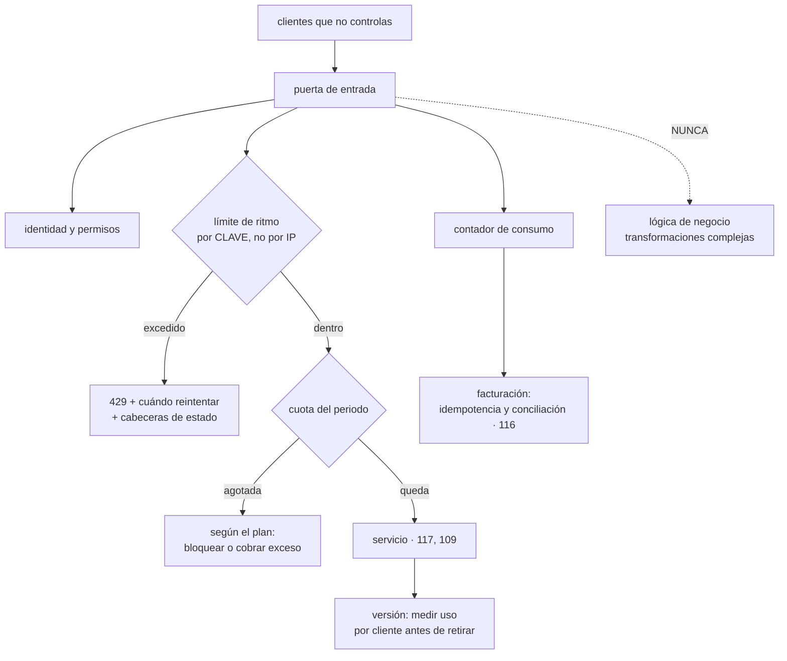

# 118 — API management, cuotas, versiones y monetización

> [← Clase anterior](../../part-09-data-messaging-serverless-integration/117-serverless-limites-cold-starts-y-concurrencia/README.md) · [Índice de la parte](../README.md) · [Clase siguiente →](../../part-09-data-messaging-serverless-integration/119-workflows-y-orquestacion-durable/README.md)

**Parte:** 09 — Datos, mensajería, serverless e integración<br>
**Nivel:** avanzado · **Horas estimadas:** 4<br>
**Laboratorio:** `api` · **Estado:** `EXECUTABLE_CORE`

## 🎯 Propósito

Publicar como producto lo que hasta ahora eran servicios internos: con clientes que no controlas, límites que hay que hacer cumplir, versiones que no puedes retirar cuando quieres y, si se cobra, un contador que se convierte en un sistema financiero. La clase separa lo que sí va en la puerta de entrada de lo que nunca debe acabar ahí, desarrolla los algoritmos de limitación con su modo de fallo concreto, y sostiene que **el problema de versionar no es el mecanismo, sino la retirada**.

## 📚 Resultados de aprendizaje

Al finalizar podrás:

1. **Delimitar** qué corresponde a la puerta de entrada y qué no.
2. **Elegir** el algoritmo de limitación y la dimensión sobre la que se aplica.
3. **Responder** correctamente a un cliente limitado, para no provocar una tormenta.
4. **Versionar** con un procedimiento de retirada que funcione de verdad.
5. **Medir** el consumo con la fiabilidad que exige facturar por él.

## 🧩 Conceptos centrales

| Concepto | Comprensión verificable |
|---|---|
| `puerta de entrada` | Punto único de acceso que aplica lo transversal: identidad, límites, encaminamiento y observabilidad. Nunca lógica de negocio. |
| `límite de ritmo` | Peticiones por unidad de tiempo. Protege la capacidad del sistema en el corto plazo. |
| `cuota` | Volumen total en un periodo largo. Es una condición comercial, no una protección técnica; son cosas distintas. |
| `cubo de credenciales` | Algoritmo que acumula permisos hasta un máximo y los gasta por petición. Permite ráfagas acotadas sin romper el ritmo medio. |
| `retirada de versión` | Proceso para dejar de servir una versión: anuncio, medición de uso por cliente, fecha y aplicación. Sin medición no se puede hacer. |
| `contador de consumo` | Registro de lo consumido por cliente. Si se factura con él, necesita idempotencia y conciliación como cualquier sistema de dinero. |

## 🧠 Modelo mental

La base de datos correcta depende del patrón de acceso y de las garantías necesarias; distribuir datos convierte latencia, consistencia y fallos parciales en decisiones de diseño.

Aplicado a esta clase, separa siempre cuatro planos: **intención** (qué necesita el usuario),
**configuración** (qué declaramos), **estado observado** (qué existe de verdad) y
**evidencia** (cómo sabemos que cumple). Confundirlos produce diseños que se ven correctos
en un diagrama pero fallan al operar.

## 🗺️ Flujo de razonamiento



## 📖 Desarrollo

### 1. Qué va en la puerta y qué no

La puerta de entrada resuelve lo que es igual para todas las API y no debe resolver nada específico de una.

```text
SÍ
  autenticación y validación de credenciales
  autorización gruesa: ¿este cliente puede llamar a esta operación?
  límites de ritmo y cuotas
  encaminamiento por ruta, versión o cliente
  observabilidad: identificador de correlación, métricas por cliente
  respuestas de error uniformes
  terminación de cifrado y comprobaciones de tamaño

NO
  reglas de negocio
  composición de varias llamadas en una
  transformaciones que dependan del significado del dato
  autorización fina que dependa del estado del recurso
```

Y el motivo de la lista de la derecha es el modo de fallo conocido de este componente: **la puerta se convierte en el sitio donde acaba todo lo que no tiene dueño claro**, y entonces:

```text
cambiar una regla de negocio exige tocar la infraestructura compartida
un error afecta a todas las API a la vez
nadie puede probar el sistema sin desplegar la puerta
y la lógica queda fuera del repositorio del servicio que la posee
```

Y una consecuencia que hay que asumir desde el principio: **la puerta es un punto único de fallo con latencia añadida**. Eso exige tratarla como lo que es:

```text
latencia que añade                   medirla; 5-15 ms es razonable,
                                     80 ms no
qué pasa si se cae                   ¿hay camino alternativo para lo crítico?
su propia disponibilidad             mayor que la de cualquier servicio
                                     que protege
cambios de configuración             despliegue con las reglas de la parte 08,
                                     no ediciones en una consola
```

La última línea es donde más se peca: la puerta suele tener una interfaz cómoda que invita a cambiar cosas a mano, y eso es exactamente la deriva que la clase 103 eliminó del resto del sistema.

Y sobre los errores, una decisión pequeña con mucho efecto: **un formato de error uniforme para todas las API**, con código estable, mensaje legible e identificador de correlación. Los clientes programan contra los errores tanto como contra los éxitos.

### 2. Limitar bien

Primero, dos cosas que se confunden:

```text
LÍMITE DE RITMO   100 peticiones/segundo
                  protege la capacidad; es técnico
CUOTA             1.000.000 de peticiones/mes
                  es una condición comercial
```

Un cliente puede estar dentro de su cuota mensual y aun así tener que ser limitado en un pico.

**Los algoritmos**, con su comportamiento real:

```text
VENTANA FIJA
  contador que se reinicia cada minuto
  simple, y permite el DOBLE en la frontera:
    100 peticiones en el segundo 59 y 100 más en el 61
    → 200 en dos segundos con un límite de 100 por minuto

VENTANA DESLIZANTE
  cuenta los últimos 60 s reales
  correcto, y cuesta más de mantener

CUBO DE CREDENCIALES
  se rellena a ritmo constante hasta un máximo
  cada petición gasta una
  → permite ráfagas de hasta el tamaño del cubo
  → y limita el ritmo medio
  es el que mejor se ajusta a tráfico real

CUBO CON FUGA
  la salida es constante y lo que sobra se encola o se descarta
  → suaviza hacia el servicio de detrás
```

El del cubo es el que suele elegirse: **el tráfico real llega a ráfagas**, y un límite que no las tolera rechaza peticiones que el sistema podía atender.

**Sobre qué dimensión se limita**, que importa tanto como el algoritmo:

```text
por clave de API o cliente     lo correcto
por usuario final              cuando un cliente sirve a muchos
por operación                  las caras merecen límite propio
por dirección IP               MAL como dimensión principal:
                               muchos clientes comparten salida,
                               y uno solo puede tener muchas
```

Y en sistemas distribuidos, el contador es compartido, y ahí hay un compromiso:

```text
contador central exacto       correcto y añade latencia y dependencia
reparto local aproximado      cada nodo lleva su parte del límite
                              → si hay 10 nodos, cada uno permite 1/10
                              → y con tráfico desigual se limita de más
local con sincronización       lo habitual: local, ajustado cada pocos segundos
```

**Qué responder** al limitar, que es lo que evita el problema de la clase 113:

```text
429
Retry-After: 30
X-RateLimit-Limit / Remaining / Reset
```

Sin la segunda cabecera, los clientes reintentan de inmediato y **amplifican el problema que la limitación pretendía contener**. Y conviene documentar que reintentar antes de tiempo puede contar contra el límite: es la única forma de que se respete.

Y dos figuras que conviene tener por encima del límite normal:

```text
límite de emergencia    aplicable a un cliente concreto en un incidente
modo degradado          servir menos datos o desde caché en vez de rechazar
```

### 3. Versionar es fácil; retirar no

Los tres mecanismos y su realidad:

```text
EN LA RUTA        /v1/pedidos
                  visible, trivial de encaminar y probar
                  «impuro» según algunos, y es el que usa casi todo el mundo

EN UNA CABECERA   Accept: application/vnd.tienda.v2+json
                  elegante, más difícil de probar y de depurar

SIN VERSIÓN       solo cambios compatibles, siempre
                  ideal, y no sobrevive a un cambio de modelo
```

Y la recomendación práctica: **versión mayor en la ruta y todo lo demás compatible**. Las versiones mayores deben ser raras; si hay una cada trimestre, el problema es el diseño, no el versionado.

Y las reglas de compatibilidad son las mismas que la clase 115 fijó para los eventos:

```text
SE PUEDE   añadir campos opcionales en la respuesta
           añadir parámetros opcionales
           añadir operaciones
NO SE PUEDE  quitar o renombrar campos
           cambiar tipos
           hacer obligatorio lo que era opcional
           cambiar el significado sin cambiar el nombre
           cambiar códigos de error o de estado
```

Y una obligación que conviene documentar para los clientes: **ignorar los campos que no conozcan**. Un cliente que falla al recibir un campo nuevo convierte cualquier mejora en un cambio incompatible.

**La retirada**, que es el problema de verdad. No se puede retirar lo que alguien sigue usando, y para saberlo hace falta medirlo:

```text
peticiones por versión y por cliente, con fecha del último uso
→ sin esa medición no hay retirada posible, solo esperanza
```

Y el procedimiento que funciona, que es el de la clase 106 con más margen porque los clientes son externos:

```text
1. anunciar con fecha, en la documentación y por correo
2. cabeceras de aviso en cada respuesta de la versión vieja
   Deprecation: true / Sunset: <fecha>
3. contactar uno a uno con los que sigan usándola
4. cortes de prueba: apagar 1 h en una fecha anunciada
   → es lo que hace que los rezagados se enteren de verdad
5. apagar
```

El paso 4 es el que más funciona y el que menos se hace. Y el paso 3 exige lo que la clase 115 pedía para los eventos: **saber quién consume**.

Y una decisión que evita quedarse atrapado: **cuántas versiones se soportan a la vez**, escrito antes de publicar la primera. Dos suele ser suficiente; tres ya es un coste de mantenimiento notable en cada cambio.

### 4. Si se cobra, es un sistema financiero

En cuanto la factura de un cliente depende de un contador, ese contador deja de ser una métrica y pasa a ser un dato contable.

```text
métrica          se puede perder un 0,1 % y no pasa nada
contador de
facturación      un 0,1 % es una factura mal emitida
```

Y eso trae exactamente los problemas de la clase 116:

```text
un reintento no debe contar dos veces      → idempotencia por identificador
un evento perdido no debe dejar de contar  → tabla de salida
el contador y lo servido deben cuadrar     → conciliación periódica
```

Y una decisión que hay que tomar explícitamente y escribir en el contrato:

```text
¿se cuenta la petición limitada?          normalmente no
¿se cuenta la que devuelve error 5xx?     no; es culpa tuya
¿se cuenta la que devuelve 404?           depende, y hay que decirlo
¿se cuenta por petición o por dato?       por dato es más justo y más difícil
```

**Los planes** y su comportamiento al agotarse, que es una decisión de producto con consecuencias técnicas:

```text
bloquear al agotar       previsible para el cliente, y le rompe el servicio
cobrar el exceso         no rompe, y produce facturas sorpresa
avisar y degradar        avisar al 80 %, y al 100 % servir con menos ritmo
```

La tercera es la que menos conflictos genera, y exige avisar de verdad: **al 50 %, al 80 % y al 100 %**, por el canal que el cliente lea.

**La experiencia de quien integra**, que decide la adopción tanto como la funcionalidad. La medida útil es una:

```text
tiempo desde que alguien llega a la documentación
hasta su primera llamada correcta
```

Es la versión externa de la fricción de la clase 107, y lo que la baja:

```text
documentación generada de la especificación, siempre al día
ejemplos ejecutables, con credencial de prueba inmediata
entorno de pruebas con datos, no vacío
errores que explican qué hacer, no solo qué falló
registro de cambios y avisos de retirada en un sitio fijo
```

Y la especificación como fuente: si la documentación se escribe aparte, **diverge**; si se genera de lo que el servicio publica y se valida en la canalización, no puede divergir.

Y la lista de comprobación de la clase:

```text
☐ no hay lógica de negocio en la puerta de entrada
☐ la configuración de la puerta se despliega, no se edita a mano
☐ está medida la latencia que añade y qué pasa si se cae
☐ el límite de ritmo usa cubo de credenciales, no ventana fija
☐ la dimensión de limitación es la clave del cliente, no la IP
☐ las respuestas limitadas llevan cuándo reintentar y estado del límite
☐ límite de ritmo y cuota están separados y documentados
☐ hay medición de uso por versión y por cliente
☐ está escrito cuántas versiones se soportan a la vez
☐ el procedimiento de retirada incluye cortes de prueba anunciados
☐ el contador de facturación es idempotente y se concilia
☐ está documentado qué peticiones cuentan y cuáles no
☐ se mide el tiempo hasta la primera llamada correcta
```

Y el cierre que enlaza con la clase siguiente: la clase 116 dejó una conclusión pendiente —que los procesos con pasos, plazos y compensaciones se entienden mejor cuando la secuencia está escrita en un sitio—. Cómo se ejecuta esa secuencia de forma que sobreviva a reinicios, esperas de días y fallos parciales es la materia de la clase 119.

## 🔬 Ejemplo trabajado

**CloudShop abre una API para sus socios logísticos y comercios afiliados. Empieza con cuatro clientes y llega a ciento noventa. Los cuatro problemas del camino son los cuatro apartados de esta clase.**

**Problema 1: la puerta acumuló lógica hasta ser intocable.**

A los ocho meses:

```text
reglas de transformación en la puerta                      41
de ellas, que dependían del significado del dato           29
equipos que podían desplegar la puerta                      1
tiempo medio para un cambio de un campo en una respuesta  6 días
incidentes causados por un cambio en la puerta        3 en 8 meses
  → los 3 afectaron a TODAS las API a la vez
```

Seis días para cambiar un campo, porque el cambio no estaba en el repositorio del servicio dueño.

```text                                          antes         después
reglas en la puerta                            41              12
las 12 restantes                                —      identidad, límites,
                                                       correlación, errores
lógica devuelta a los servicios                 —              29
tiempo para cambiar un campo                 6 días         < 1 día
equipos bloqueados por la puerta                4              0
```

**Problema 2: la ventana fija, y el socio que tumbó el catálogo.**

```text
límite publicado                       600 peticiones/minuto
algoritmo                              ventana fija

11:59:58  un socio envía 600 peticiones
12:00:01  envía otras 600
→ 1.200 peticiones en 3 segundos, ambas «dentro del límite»
→ el servicio de catálogo satura; 4 minutos de degradación
```

Es el modo de fallo del apartado segundo, exactamente.

```text                                    ventana fija    cubo de credenciales
ráfaga máxima permitida                  2× el límite    tamaño del cubo (100)
ritmo medio garantizado                  irregular       10/s
peticiones rechazadas de tráfico legítimo   4,1 %          0,3 %
incidentes por ráfaga en frontera          2 / 8 meses      0
```

La penúltima fila es la que convenció: el cubo **rechazó menos tráfico legítimo** además de contener mejor las ráfagas, porque el tráfico real llega a golpes.

Y la respuesta a los limitados, que era un 429 pelado:

```text                                          antes         después
cabecera de cuándo reintentar                   no             sí
cabeceras de límite, restante y reinicio        no             sí
reintentos inmediatos tras un 429              89 %           7 %
carga de reintentos durante una limitación     ×4,2           ×1,1
```

Y la dimensión, que también estaba mal:

```text
limitación por dirección IP
→ tres socios que salían por el mismo proveedor compartían límite
→ y uno de ellos, con veinte salidas, tenía veinte veces su límite
corregido a clave de cliente
reclamaciones por limitación injusta: de 11 a 0
```

**Problema 3: la versión 1 que no se pudo retirar en dos años.**

```text
v2 publicada                                    mes 9
anuncio de retirada de v1                       mes 12, para el mes 18
uso de v1 en el mes 18                          31 % de las peticiones
medición por cliente                            no existía
→ no se sabía a quién avisar, así que no se apagó
```

Se montó la medición y apareció el reparto real:

```text
clientes que aún usaban v1                          64 de 190
de ellos, con menos de 100 peticiones/mes           49
de ellos, con más de 100.000 peticiones/mes          3   ← el 27 % del tráfico
```

**Tres clientes eran casi todo el problema.** Con esa información el procedimiento fue viable:

```text
mes 20  cabeceras de obsolescencia y fecha en todas las respuestas de v1
mes 21  contacto directo con los 3 grandes; migrados en 5 semanas
mes 22  corte de prueba anunciado de 1 h
        → 28 de los 49 pequeños reaccionaron esa semana
mes 23  segundo corte de prueba de 4 h
        → 17 más
mes 24  apagado; 4 clientes afectados, todos inactivos desde hacía meses
```

Los cortes de prueba movieron a **45 de 49 clientes pequeños** que los correos no habían movido.

```text                                          antes         después
versiones mayores soportadas                 sin política     2, escrito
medición de uso por cliente y versión           no             sí
tiempo de retirada de una versión          indefinido      6 meses
```

**Problema 4: la facturación no cuadraba.**

Al empezar a cobrar por consumo:

```text
reclamaciones de facturación el primer mes            17 de 190
diferencia media reclamada                            +4,1 %
causa 1   los reintentos del cliente tras un 5xx contaban
causa 2   la puerta reintentaba internamente y contaba dos veces
causa 3   las peticiones limitadas contaban
```

El contador se trató como lo que era, con las técnicas de la clase 116:

```text                                          antes         después
registro del consumo                       métrica agregada  tabla de salida
identificador de idempotencia por petición      no             sí
reintentos internos contados                     sí             no
peticiones limitadas contadas                    sí             no
errores 5xx contados                             sí             no
conciliación diaria contador / registro          no             sí
reclamaciones de facturación                17 / mes         0-1 / mes
desviación en la conciliación                 no se sabía     < 0,01 %
```

Y la política de agotamiento, que también generaba conflictos:

```text                                          antes         después
al agotar la cuota                        bloqueo inmediato   avisos al 50/80/100
                                                              y ritmo reducido
clientes que se quedaron sin servicio
sin saberlo                                   9 / trimestre         0
```

**La adopción, medida.**

```text                                          antes         después
documentación                            escrita a mano    generada de la
                                                           especificación
entorno de pruebas                       vacío             con datos
credencial de prueba                     por correo, 2 días  inmediata
tiempo hasta la primera llamada correcta  3,5 días          22 min
socios integrados por trimestre               6               31
```

**Al cabo de dos años.**

```text                                          antes         después
reglas de negocio en la puerta                  29              0
incidentes por ráfaga en frontera de ventana     2              0
reintentos inmediatos tras limitación          89 %            7 %
reclamaciones por limitación injusta            11              0
versiones mayores vivas                          2              2
retirada de una versión                     imposible      6 meses
reclamaciones de facturación                17 / mes       0-1 / mes
tiempo hasta la primera llamada correcta    3,5 días       22 min
clientes                                        4            190
```

**La lección que esta clase traslada a la parte 09**: de los cuatro problemas, tres eran de información y no de tecnología. **No se pudo retirar una versión durante dos años por no medir quién la usaba**; no se pudo limitar con justicia por elegir la dimensión equivocada; y no se pudo facturar bien por tratar un dato contable como una métrica. El único puramente técnico —la ventana fija— se arregló cambiando un algoritmo en una tarde.

## 🧪 Laboratorio guiado

Ejecuta desde la raíz:

```bash
python classes/part-09-data-messaging-serverless-integration/118-api-management-cuotas-versiones-y-monetizacion/lab.py
```

El laboratorio selecciona el motor de práctica **`api`** y produce
`lab_result.json`. El escenario, sus comprobaciones y el artefacto esperado corresponden a
esta clase; no requiere credenciales y deja explícito qué debe revalidarse en un sandbox real.

1. Lee `exercise.steps` y formula una predicción antes de ejecutar.
2. Ejecuta la práctica y verifica todos los elementos de `checks`.
3. Provoca el caso de `negative_test` y explica la señal observada.
4. Materializa `producto-api` en `evidence/` usando la plantilla indicada.
5. Para proveedor real, sigue `sandbox.requires`, registra costo y ejecuta `destroy`.

### Evidencia esperada

El artefacto principal es un contrato versionado con pruebas positivas y negativas. Además, la entrega debe incluir el comando ejecutado,
la salida estructurada y una conclusión que no exceda lo observado.

## 🏆 Reto verificable

Construye **`producto-api`** para el caso CloudShop. Incluye una alternativa descartada,
un supuesto que pueda falsarse, una prueba de fallo y una decisión de rollback.

## ✅ Criterio de aceptación

- [ ] `lab.py` termina con código 0 y genera JSON válido.
- [ ] La entrega conecta al menos tres requisitos con mecanismos verificables.
- [ ] Existe una prueba positiva y una prueba negativa con evidencia.
- [ ] Seguridad, costo y operación aparecen como decisiones, no como anexos.
- [ ] Se declara una limitación y una condición que obligaría a revisar el diseño.
- [ ] Otra persona puede repetir el recorrido sin conocimiento tácito.

## ⚠️ Errores frecuentes

| Síntoma | Causa probable | Corrección |
|---|---|---|
| Cambiar un campo de una respuesta tarda días y bloquea a varios equipos | La puerta de entrada acumuló lógica de negocio | Devuelve a cada servicio lo que depende del significado del dato y deja en la puerta solo lo transversal. |
| Un cliente envía el doble del límite y el sistema satura | Ventana fija: dos ventanas consecutivas permiten el doble en la frontera | Usa cubo de credenciales, que acota la ráfaga y el ritmo medio a la vez. |
| Al limitar, la carga de reintentos empeora la situación | La respuesta no dice cuándo reintentar | Devuelve cuándo reintentar y el estado del límite, y documenta que reintentar antes cuenta contra el límite. |
| Clientes distintos comparten límite y uno solo consume mucho más | Se limita por dirección IP | Limita por clave de cliente, y añade dimensión por usuario final cuando un cliente sirva a muchos. |
| Una versión antigua no se puede retirar nunca | No se mide el uso por cliente, así que no se sabe a quién avisar | Mide peticiones por versión y cliente, anuncia con fecha y haz cortes de prueba anunciados. |
| Los clientes reclaman la factura | El contador de consumo se trató como una métrica y cuenta reintentos, errores y limitadas | Regístralo con tabla de salida e idempotencia, documenta qué cuenta y qué no, y concilia a diario. |

## 🛡️ Seguridad, ética y costo

Trabaja con cuentas propias o sandboxes autorizados. No publiques secretos, identificadores
reales ni datos personales. Antes de crear recursos pagos define presupuesto, etiquetas y
comando de destrucción; después verifica que no queden recursos huérfanos. Los ejemplos
locales enseñan contratos, pero no certifican cumplimiento ni disponibilidad de producción.

## ❓ Preguntas de comprobación

1. ¿Qué corresponde a la puerta de entrada y qué nunca debe acabar en ella?
2. ¿Qué diferencia hay entre límite de ritmo y cuota?
3. ¿Cuál es el modo de fallo concreto de la ventana fija y qué algoritmo lo evita?
4. ¿Por qué la dirección IP es una mala dimensión de limitación?
5. ¿Qué hace falta para poder retirar una versión, y qué paso del procedimiento es el más eficaz?

## 🔗 Referencias

- IETF (2024). *RFC 9457: Problem Details for HTTP APIs* — formato uniforme de errores. <https://www.rfc-editor.org/rfc/rfc9457.html>
- IETF (2023). *RFC 8594: The Sunset HTTP header* — anuncio de retirada de recursos y versiones. <https://www.rfc-editor.org/rfc/rfc8594.html>
- Cloudflare (2025). *Rate limiting algorithms* — ventana fija, deslizante y cubo de credenciales con sus efectos. <https://developers.cloudflare.com/waf/rate-limiting-rules/>
- Google (2025). *API design guide: versioning and compatibility* — cambios compatibles y versión mayor. <https://cloud.google.com/apis/design/versioning>
- OpenAPI Initiative (2025). *Specification* — documentación y validación generadas de la especificación. <https://spec.openapis.org/oas/latest.html>
- Documentación oficial vigente del servicio implementado; registra URL y fecha de consulta.

---

> [Evaluación](assessment.md) · [Contrato de clase](lesson.yaml) · [Índice de la parte](../README.md)
