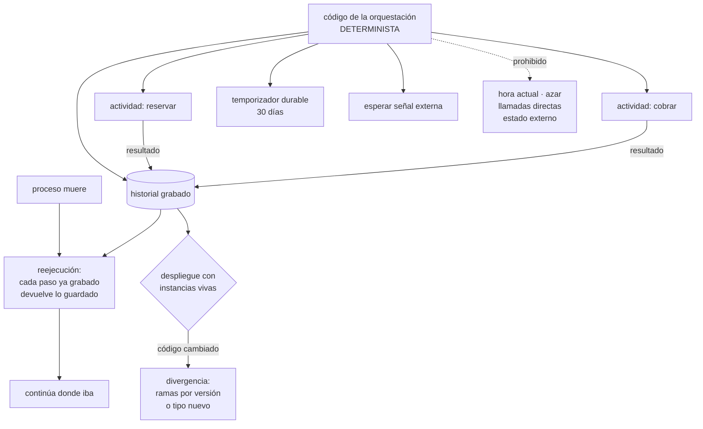

# 119 — Workflows y orquestación durable

> [← Clase anterior](../../part-09-data-messaging-serverless-integration/118-api-management-cuotas-versiones-y-monetizacion/README.md) · [Índice de la parte](../README.md) · [Clase siguiente →](../../part-09-data-messaging-serverless-integration/120-proyecto-pipeline-de-pedidos-orientado-a-eventos/README.md)

**Parte:** 09 — Datos, mensajería, serverless e integración<br>
**Nivel:** avanzado · **Horas estimadas:** 4<br>
**Laboratorio:** `orchestration` · **Estado:** `EXECUTABLE_CORE`

## 🎯 Propósito

Ejecutar la secuencia con compensaciones de la clase 116 en un sitio donde **el estado sobrevive a la muerte del proceso**, donde esperar treinta días es una instrucción normal y donde se puede preguntar en qué paso va cada instancia. La clase explica el mecanismo que lo hace posible —volver a ejecutar el código contra un historial grabado—, la restricción severa que ese mecanismo impone —el código tiene que ser determinista— y el problema operativo que nadie anuncia: **cómo se despliega una versión nueva cuando hay diez mil instancias a medias**.

## 📚 Resultados de aprendizaje

Al finalizar podrás:

1. **Reconocer** los procesos que no caben en una petición ni en una función.
2. **Explicar** la reejecución contra historial y por qué obliga al determinismo.
3. **Separar** lo que va en la orquestación de lo que va en las actividades.
4. **Desplegar** cambios sin romper las instancias en curso.
5. **Elegir** entre motor durable, máquina de estados declarativa y cola con estado propio.

## 🧩 Conceptos centrales

| Concepto | Comprensión verificable |
|---|---|
| `orquestación durable` | Motor que graba el resultado de cada paso y reconstruye la ejecución tras un fallo, continuando donde iba. |
| `reejecución contra historial` | Al reanudar, el código se ejecuta de nuevo desde el principio, pero cada paso ya grabado devuelve su resultado guardado en vez de ejecutarse. |
| `determinismo` | Que el mismo código con el mismo historial tome siempre las mismas decisiones. Sin él, la reejecución diverge y la instancia se rompe. |
| `actividad` | Unidad que sí produce efectos: llama, escribe, cobra. Se reintenta, así que debe ser idempotente. |
| `temporizador durable` | Espera que sobrevive a reinicios y despliegues. Permite «espera 30 días» sin ningún proceso vivo mientras tanto. |
| `reinicio como instancia nueva` | Cerrar la instancia actual y abrir otra con el estado resumido, para que el historial no crezca sin fin. |

## 🧠 Modelo mental

La base de datos correcta depende del patrón de acceso y de las garantías necesarias; distribuir datos convierte latencia, consistencia y fallos parciales en decisiones de diseño.

Aplicado a esta clase, separa siempre cuatro planos: **intención** (qué necesita el usuario),
**configuración** (qué declaramos), **estado observado** (qué existe de verdad) y
**evidencia** (cómo sabemos que cumple). Confundirlos produce diseños que se ven correctos
en un diagrama pero fallan al operar.

## 🗺️ Flujo de razonamiento



## 📖 Desarrollo

### 1. Qué no cabe en ningún sitio de los anteriores

La clase 116 dejó una secuencia con compensaciones y plazos. Y hay tres razones por las que no cabe donde hemos ejecutado cosas hasta ahora:

```text
DURA MÁS QUE UN PROCESO
  «esperar 30 días a que expire la devolución»
  → no cabe en una petición ni en una función (clase 117)

TIENE QUE SOBREVIVIR A CUALQUIER COSA
  despliegues, reinicios, caídas de la máquina
  → el estado no puede estar en memoria

HAY QUE PODER PREGUNTARLE
  «¿en qué paso va el pedido 1421 y por qué lleva ahí 3 horas?»
  → es la pregunta que la clase 115 dejó sin responder
```

Lo que se hace normalmente sin un motor —y funciona hasta cierto tamaño— es una máquina de estados propia:

```text
tabla con el estado de cada instancia
un proceso que la lee y avanza los que toca
colas para cada paso
temporizadores con filas de «hacer a partir de las …»
```

Y conviene decir con claridad que **eso está bien** para procesos de dos o tres pasos. Lo que pasa cuando crece:

```text
cada paso nuevo añade estados, transiciones y casos de fallo
las compensaciones multiplican las transiciones
nadie puede leer el proceso completo: está repartido en seis consumidores
y los plazos hay que implementarlos a mano, uno a uno
```

El motor durable resuelve eso permitiendo **escribir el proceso como código secuencial**:

```python
def pedido(id):
    reserva = actividad(reservar, id)
    try:
        pago = actividad(cobrar, id)
    except Exception:
        actividad(liberar_reserva, reserva)
        return "cancelado_por_pago"
    actividad(crear_envio, id)
    actividad(notificar, id)
    esperar(dias=30)                      # temporizador durable
    if not senal_recibida("devolucion"):
        actividad(cerrar_pedido, id)
```

Y lo notable de ese código es lo que **no** tiene: no hay tabla de estado, ni reintentos, ni recuperación tras reinicio, ni gestión de temporizadores. Todo eso lo aporta el motor. La línea de los treinta días no mantiene nada vivo: el proceso se despierta cuando toca.

### 2. Cómo funciona, y qué prohíbe

El mecanismo es sencillo de enunciar y tiene una consecuencia grande.

```text
cada vez que la orquestación llama a una actividad:
  el motor comprueba si ya está en el historial
    sí  → devuelve el resultado grabado, sin ejecutar nada
    no  → la ejecuta y graba el resultado

al reanudar tras un fallo:
  el código se ejecuta DESDE EL PRINCIPIO
  y todos los pasos ya grabados se resuelven al instante
  hasta llegar al punto donde se quedó
```

De ahí sale la restricción central:

```text
el código de la orquestación tiene que ser DETERMINISTA

porque se ejecuta muchas veces y debe tomar SIEMPRE
las mismas decisiones en el mismo orden
```

Y la lista de lo prohibido dentro de la orquestación:

```text
la hora actual                 → usar el reloj del motor
números aleatorios             → pedirlos como actividad, o al motor
identificadores generados      → igual
leer un fichero, una base o
  llamar a una API             → eso es una actividad
variables globales o estado
  del proceso                  → no sobreviven y no se reproducen
recorrer un diccionario sin
  orden garantizado            → el orden puede cambiar entre ejecuciones
hilos y concurrencia propia    → usar los mecanismos del motor
```

El caso del recorrido desordenado es el que más sorprende y el que más cuesta diagnosticar, porque **falla de forma intermitente y solo tras un reinicio**.

Y la regla mental que resume todo:

```text
la orquestación DECIDE; las actividades HACEN
si algo puede dar un resultado distinto dos veces, es una actividad
```

**Las actividades**, que es donde vive todo lo de las clases anteriores:

```text
se reintentan según la política que se les fije
  → espera creciente, variación y límite: clase 113
se entregan al menos una vez
  → tienen que ser idempotentes: clase 116
tienen su propio plazo
  → y hay dos plazos distintos: el de una ejecución y el del conjunto
     de intentos
```

Y el latido para las largas: una actividad que tarda veinte minutos debe informar de que sigue viva, o el motor la dará por muerta y la reintentará —el mismo mecanismo, y el mismo error, que el tiempo de invisibilidad de la clase 113—.

Y dos límites que hay que respetar por diseño:

```text
el historial crece con cada paso
  → procesos con millones de iteraciones: reiniciar como instancia nueva
los argumentos y resultados viajan y se graban
  → no pasar objetos grandes: pasar referencias al almacenamiento
```

### 3. Desplegar con instancias a medias

Este es el problema operativo específico de este modelo, y el que más disgustos da.

```text
hay 40.000 instancias en curso, algunas empezadas hace 3 semanas
se despliega código nuevo
una instancia vieja se reanuda y se reejecuta con el CÓDIGO NUEVO
contra un historial creado por el CÓDIGO VIEJO
→ si las decisiones no coinciden, la instancia se rompe
```

Qué cambios son seguros y cuáles no:

```text
SEGURO
  cambiar el interior de una actividad
  cambiar la política de reintentos
  añadir pasos DESPUÉS del punto donde están todas las instancias vivas

PELIGROSO
  añadir, quitar o reordenar llamadas a actividades
  cambiar una condición que decide qué actividad se llama
  cambiar la duración de un temporizador ya programado
  cambiar el nombre o la firma de una actividad
```

Las dos técnicas para hacerlo bien:

```text
1. RAMAS POR VERSIÓN EN EL CÓDIGO
   version = obtener_version("anadir-verificacion", por_defecto=1, maxima=2)
   if version >= 2:
       actividad(verificar_fraude, id)
   → las instancias viejas siguen por la rama 1; las nuevas, por la 2
   → y las ramas viejas se limpian cuando ya no queda ninguna instancia

2. TIPO NUEVO Y VACIADO
   se publica «pedido-v2» y las instancias nuevas van ahí
   «pedido-v1» deja de recibir instancias y se apaga cuando se vacía
   → más limpio y obliga a mantener dos durante el vaciado
```

La primera es cómoda y **deja restos**: sin limpieza, el código acumula ramas de versiones que ya no existen. Conviene medirlo:

```text
instancias vivas por versión de cada rama
→ si una rama lleva meses sin instancias, se borra
```

Y la segunda es la que conviene cuando el cambio es grande, y encaja con lo que la clase 106 llamó contrato de versiones: **dos vivas, y vaciado con plazo**.

Y una precaución que evita el peor caso: **desplegar primero a un entorno con instancias reales de larga duración** y comprobar que se reanudan. Un entorno vacío no detecta ninguno de estos errores, porque no hay historial contra el que divergir.

Y qué hacer cuando una instancia ya se rompió:

```text
reiniciarla desde un punto anterior del historial
terminarla y crear una nueva con el estado que se pueda recuperar
y en ambos casos: la lista de las rotas tiene que ser visible
```

### 4. Operar, elegir y no pasarse

**Lo que se gana en visibilidad**, que es la respuesta a la pregunta que la clase 115 dejó abierta:

```text
¿en qué paso está el pedido 1421?          consulta directa
¿cuánto lleva ahí?                          en el historial
¿qué actividad falló y cuántas veces?       en el historial
¿qué instancias llevan más de N horas?      consulta por estado y tiempo
¿cuántas esperan una señal que no llega?    consulta
```

Y las alertas que hacen falta, que son las de siempre con otro nombre:

```text
instancias en curso por encima de su duración esperada
instancias con actividades que agotaron reintentos
instancias terminadas por error, por tipo
antigüedad de la instancia más vieja de cada tipo
cola de tareas del motor sin trabajadores que la atiendan   ← ley 13
```

La última es el modo de fallo silencioso característico: **si no hay trabajadores atendiendo una cola de tareas, las instancias no fallan: se quedan quietas**.

**Los tres modelos**, para elegir con criterio:

```text
MOTOR DURABLE CON CÓDIGO
  + el proceso se lee como código; pruebas normales; lógica compleja
  − hay que operar el motor y respetar el determinismo
  encaja  procesos largos, con compensaciones y ramas

MÁQUINA DE ESTADOS DECLARATIVA (del proveedor)
  + gestionada, integrada con el resto de servicios, visual
  − la lógica se escribe en un lenguaje de expresiones limitado
  − probar en local es incómodo y las condiciones complejas se vuelven ilegibles
  encaja  secuencias de pasos con poca lógica y mucha integración

COLA CON ESTADO PROPIO
  + nada que operar de más; todo el mundo lo entiende
  − cada paso y cada compensación se implementan a mano
  encaja  procesos de 2 o 3 pasos sin espera larga
```

Y el error de diseño más común una vez se tiene el motor: **meterlo todo dentro**.

```text
no es para           una petición síncrona de 80 ms
                     un cálculo puro
                     reemplazar toda cola de la clase 113
es para              procesos de negocio con pasos, esperas y vuelta atrás
```

Y conviene recordar que **el motor no elimina ninguna de las obligaciones anteriores**: las actividades siguen necesitando idempotencia, los efectos externos siguen necesitando clave, y las compensaciones siguen sin ser vueltas atrás.

Y la lista de comprobación de la clase:

```text
☐ el proceso justifica un motor: dura, espera o compensa
☐ la orquestación no usa reloj, azar, entrada/salida ni estado del proceso
☐ ningún recorrido depende de un orden no garantizado
☐ todas las actividades son idempotentes
☐ las actividades largas envían latido
☐ no viajan objetos grandes: van referencias
☐ los procesos con muchas iteraciones reinician como instancia nueva
☐ los cambios de código usan ramas por versión o tipo nuevo con vaciado
☐ las ramas de versión sin instancias vivas se limpian
☐ el despliegue se prueba contra instancias reales de larga duración
☐ hay alerta por cola de tareas sin trabajadores
☐ las instancias rotas o atascadas son visibles y tienen procedimiento
```

Y el cierre que enlaza con la clase siguiente: con esto está completo el material de la parte 09. La clase 120 monta el sistema de pedidos entero sobre lo construido y, sobre todo, **califica la hipótesis escrita en la clase 108**: cuántos de los ocho mecanismos de la parte 08 sobrevivieron al contacto con el estado, y si la ley dominante fue la que se predijo.

## 🔬 Ejemplo trabajado

**CloudShop lleva la secuencia de pedido de la clase 116 a un motor durable. Lo que se gana está claro desde la primera semana; lo interesante son los tres problemas propios del modelo, que ninguna clase anterior podía anticipar.**

**Punto de partida: la máquina de estados propia.**

```text
estados en la tabla                                     14
transiciones implementadas                              41
consumidores que participaban                            6
líneas de código de coordinación                     2.900
lugares donde estaba escrito el proceso completo         0
tiempo para añadir un paso nuevo                    3 semanas
instancias atascadas detectadas por clientes         31 / mes
```

La quinta línea es la que dolía: **el proceso no estaba escrito en ningún sitio**; había que reconstruirlo leyendo seis consumidores.

Con el motor:

```text                                    máquina propia    motor durable
líneas de coordinación                      2.900              310
sitios donde se lee el proceso completo         0                1
tiempo para añadir un paso                 3 semanas          2 días
temporizadores implementados a mano             4                0
reintentos implementados a mano                11                0
instancias atascadas detectadas por clientes  31 / mes           0
                                                         (las detecta la alerta)
```

**Problema 1: el error de determinismo que solo aparecía tras un reinicio.**

```text
síntoma    tras cada despliegue, entre 20 y 60 instancias se rompían
           con «divergencia de historial»
frecuencia intermitente; no se reproducía en pruebas
semanas hasta encontrarlo                                     3
```

La causa era una línea inocente en la orquestación:

```python
for sku, cantidad in lineas.items():        # orden no garantizado
    actividad(reservar, sku, cantidad)
```

Al reejecutar, el diccionario se recorría en otro orden y las actividades no coincidían con el historial.

```text                                          antes         después
recorrido                            diccionario     lista ordenada por sku
instancias rotas por despliegue            20-60            0
```

Y se añadió lo que lo habría detectado antes: **una comprobación automática que reejecuta historiales reales contra el código nuevo** en la canalización.

```text
historiales guardados para la prueba                       500
divergencias detectadas antes de desplegar, en 6 meses       7
de ellas, que habrían roto instancias en producción          7
```

**Problema 2: el despliegue que rompió 8.400 instancias.**

```text
cambio     añadir un paso de verificación de fraude entre reservar y cobrar
desplegado sin ramas por versión
instancias vivas en ese momento                        11.200
instancias que ya habían pasado por «reservar»          8.400
→ al reejecutarse, esperaban «cobrar» y encontraron «verificar»
instancias rotas                                        8.400
tiempo de recuperación                                  6 h 20
cómo se recuperaron       reinicio desde un punto anterior del historial
pedidos afectados que hubo que revisar a mano              212
```

La corrección y su efecto en los cambios siguientes:

```text                                          antes         después
técnica de cambio                          desplegar       ramas por versión
prueba con instancias de larga duración        no             sí
instancias rotas por despliegue en 6 meses    8.400            0
ramas de versión acumuladas                     —              9
ramas limpiadas al vaciarse                     —              6
```

La penúltima fila es el resto que deja la técnica: **nueve ramas de compatibilidad en el código**, de las que seis ya se pudieron borrar por no quedar instancias.

**Problema 3: el proceso de treinta días y el historial que crecía.**

El seguimiento de la ventana de devolución se implementó como un bucle que comprobaba cada hora:

```text
iteraciones en 30 días                                    720
eventos de historial por instancia                      ~2.900
tamaño del historial                                     1,4 MB
instancias vivas simultáneas                            94.000
almacenamiento del motor                                  131 GB
tiempo de reejecución de una instancia vieja               11 s
```

Once segundos para reanudar una instancia. La corrección fue doble:

```text
un temporizador durable de 30 días en vez de 720 comprobaciones
y reinicio como instancia nueva para los procesos de suscripción,
  que sí son indefinidos
```

```text                                    bucle horario    temporizador
eventos de historial por instancia          ~2.900             9
tamaño del historial                        1,4 MB           4 KB
almacenamiento del motor                    131 GB          0,4 GB
tiempo de reanudación                        11 s          40 ms
```

**El fallo silencioso que costó cuatro horas.**

```text
02:10  se despliega un cambio en la configuración de los trabajadores
02:10  los trabajadores de la cola «pedidos-actividades» no arrancan
02:10  las instancias NO fallan: se quedan esperando
06:20  un cliente pregunta por un pedido de las 02:15
instancias detenidas                                     4.180
alertas que se dispararon                                    0
```

Es la ley 13 otra vez, ahora en el motor: **una cola de tareas sin trabajadores no produce ningún error**.

```text                                          antes         después
alerta por cola sin trabajadores                no             sí
alerta por antigüedad de la instancia más vieja no             sí
tiempo de detección de un caso igual         4 h 10          2 min
```

**La visibilidad, medida contra la clase 115.**

```text                                    coreografía      motor durable
responder «¿dónde está el pedido 1421?»      40 s            2 s
equipos a consultar                            0              0
saber por qué lleva 3 h parado          reconstruir traza   en el historial
saber cuántos hay parados ahora          no era posible      consulta
reanudar uno concreto                    no era posible      un comando
```

**A los ocho meses.**

```text                                          antes         después
líneas de coordinación                        2.900           310
tiempo para añadir un paso                  3 semanas       2 días
instancias atascadas detectadas por clientes  31 / mes          0
instancias rotas por despliegue            8.400 (una vez)     0
divergencias detectadas antes de desplegar       —          7 / 6 meses
almacenamiento del motor                      131 GB        0,4 GB
tiempo de reanudación de una instancia          11 s         40 ms
detección de trabajadores caídos              4 h 10         2 min
compensaciones automáticas correctas            —          1.397 de 1.412
```

**La lección que esta clase traslada a la parte 09**: el motor eliminó dos mil seiscientas líneas de coordinación y respondió por construcción la pregunta que la coreografía no podía responder. Y a cambio impuso **una restricción que no existe en ninguna otra parte de este programa**: el código de la orquestación no puede consultar la hora, ni sortear, ni recorrer un diccionario. Los dos incidentes caros —tres semanas de diagnóstico y ocho mil cuatrocientas instancias rotas— fueron las dos formas de saltarse esa restricción sin darse cuenta.

## 🧪 Laboratorio guiado

Ejecuta desde la raíz:

```bash
python classes/part-09-data-messaging-serverless-integration/119-workflows-y-orquestacion-durable/lab.py
```

El laboratorio selecciona el motor de práctica **`orchestration`** y produce
`lab_result.json`. El escenario, sus comprobaciones y el artefacto esperado corresponden a
esta clase; no requiere credenciales y deja explícito qué debe revalidarse en un sandbox real.

1. Lee `exercise.steps` y formula una predicción antes de ejecutar.
2. Ejecuta la práctica y verifica todos los elementos de `checks`.
3. Provoca el caso de `negative_test` y explica la señal observada.
4. Materializa `workflow-durable` en `evidence/` usando la plantilla indicada.
5. Para proveedor real, sigue `sandbox.requires`, registra costo y ejecuta `destroy`.

### Evidencia esperada

El artefacto principal es servicios coordinados con health checks y apagado limpio. Además, la entrega debe incluir el comando ejecutado,
la salida estructurada y una conclusión que no exceda lo observado.

## 🏆 Reto verificable

Construye **`workflow-durable`** para el caso CloudShop. Incluye una alternativa descartada,
un supuesto que pueda falsarse, una prueba de fallo y una decisión de rollback.

## ✅ Criterio de aceptación

- [ ] `lab.py` termina con código 0 y genera JSON válido.
- [ ] La entrega conecta al menos tres requisitos con mecanismos verificables.
- [ ] Existe una prueba positiva y una prueba negativa con evidencia.
- [ ] Seguridad, costo y operación aparecen como decisiones, no como anexos.
- [ ] Se declara una limitación y una condición que obligaría a revisar el diseño.
- [ ] Otra persona puede repetir el recorrido sin conocimiento tácito.

## ⚠️ Errores frecuentes

| Síntoma | Causa probable | Corrección |
|---|---|---|
| Algunas instancias se rompen tras cada despliegue y no se reproduce en pruebas | La orquestación no es determinista: recorridos sin orden, reloj o azar dentro del código | Saca todo lo no determinista a actividades, ordena los recorridos y reejecuta historiales reales contra el código nuevo en la canalización. |
| Un cambio de código rompe miles de instancias en curso | Se añadió o reordenó una llamada a actividad sin proteger a las instancias vivas | Usa ramas por versión o publica un tipo nuevo y vacía el antiguo; prueba contra instancias reales de larga duración. |
| El almacenamiento del motor crece y reanudar tarda segundos | El historial acumula miles de eventos por instancia, normalmente por bucles de comprobación | Sustituye los bucles por temporizadores durables y reinicia como instancia nueva los procesos indefinidos. |
| Las instancias dejan de avanzar sin que nada falle | Ley 13: una cola de tareas sin trabajadores no produce error | Alerta por cola sin trabajadores y por antigüedad de la instancia más vieja de cada tipo. |
| Una actividad larga se ejecuta dos veces | El motor la dio por muerta al no recibir señal de vida, igual que el tiempo de invisibilidad de la clase 113 | Envía latido desde las actividades largas y hazlas idempotentes. |
| El motor acaba conteniendo procesos que no lo necesitan | Se usa para todo una vez está disponible | Resérvalo para procesos con esperas, compensaciones o duración larga; lo de dos pasos sigue estando bien en una cola. |

## 🛡️ Seguridad, ética y costo

Trabaja con cuentas propias o sandboxes autorizados. No publiques secretos, identificadores
reales ni datos personales. Antes de crear recursos pagos define presupuesto, etiquetas y
comando de destrucción; después verifica que no queden recursos huérfanos. Los ejemplos
locales enseñan contratos, pero no certifican cumplimiento ni disponibilidad de producción.

## ❓ Preguntas de comprobación

1. ¿Qué mecanismo permite que una instancia sobreviva a la muerte del proceso?
2. ¿Por qué la orquestación debe ser determinista y qué está prohibido dentro de ella?
3. ¿Qué cambios de código son seguros con instancias en curso y cuáles no?
4. ¿Qué dos técnicas permiten desplegar sin romper instancias vivas y qué resto deja cada una?
5. ¿Cuándo basta una cola con estado propio en vez de un motor durable?

## 🔗 Referencias

- Temporal (2025). *Workflow determinism and versioning* — reejecución, restricciones y ramas por versión. <https://docs.temporal.io/workflows>
- Azure (2025). *Durable Functions: orchestrator code constraints* — qué no se puede hacer en el código de orquestación. <https://learn.microsoft.com/azure/azure-functions/durable/durable-functions-code-constraints>
- AWS (2025). *Step Functions: standard and express workflows* — máquina de estados declarativa y sus límites. <https://docs.aws.amazon.com/step-functions/latest/dg/concepts-standard-vs-express.html>
- Google Cloud (2025). *Workflows: syntax and error handling* — pasos, reintentos y compensación declarativa. <https://cloud.google.com/workflows/docs/reference/syntax>
- Richardson, C. (2025). *Orchestration-based saga* — cuándo centralizar la secuencia y sus compensaciones. <https://microservices.io/patterns/data/saga.html>
- Documentación oficial vigente del servicio implementado; registra URL y fecha de consulta.

---

> [Evaluación](assessment.md) · [Contrato de clase](lesson.yaml) · [Índice de la parte](../README.md)
