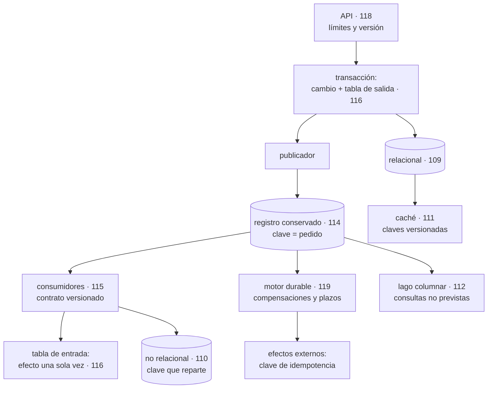

# 120 — Proyecto: pipeline de pedidos orientado a eventos

> [← Clase anterior](../../part-09-data-messaging-serverless-integration/119-workflows-y-orquestacion-durable/README.md) · [Índice de la parte](../README.md) · [Clase siguiente →](../../part-10-observability-sre-reliability/121-logs-metricas-trazas-y-eventos-como-senales/README.md)

**Parte:** 09 — Datos, mensajería, serverless e integración<br>
**Nivel:** avanzado · **Horas estimadas:** 8<br>
**Laboratorio:** `capstone` · **Estado:** `EXECUTABLE_CORE`

## 🎯 Propósito

Montar el recorrido completo de un pedido con todo lo de las clases 109 a 119 funcionando a la vez, y cerrar la parte con las tres piezas de siempre: **calificar las cuatro predicciones de la clase 108 con los datos de la parte**, incluidas las dos que salieron mal; actualizar el recuento de leyes con la que ha aparecido cuatro veces en estas doce clases; y escribir la predicción que la parte 10 tendrá que corregir. Y con un dato incómodo que se cuenta al final: cómo se detectó cada uno de los problemas de esta parte.

## 📚 Resultados de aprendizaje

Al finalizar podrás:

1. **Montar** el recorrido de un pedido con sus garantías explícitas en cada tramo.
2. **Situar** cada almacén y cada transporte por la pregunta que responde.
3. **Calificar** las cuatro predicciones de la clase 108 con evidencia.
4. **Incorporar** la ley 18 al cuestionario, con sus cuatro apariciones.
5. **Escribir** la predicción de la parte 10 en términos que se puedan desmentir.

## 🧩 Conceptos centrales

| Concepto | Comprensión verificable |
|---|---|
| `recorrido con garantías` | Descripción de un proceso tramo a tramo indicando qué se garantiza en cada uno y qué hay que reconstruir. |
| `punto de atomicidad` | Lugar donde dos efectos ocurren o no ocurren juntos. Todo el diseño de la parte 09 consiste en colocarlo bien. |
| `calificación de hipótesis` | Comparar lo predicho con lo ocurrido publicando también lo que se predijo mal. |
| `ley 18` | Hacer algo asíncrono no elimina ninguna garantía: la traslada a la aplicación, que tiene que reconstruirla. |
| `medio de detección` | Cómo se supo de un problema: alerta, caída, auditoría, factura o cliente. Es la medida honesta del estado de la observabilidad. |
| `hipótesis de la parte 10` | Predicción escrita ahora sobre lo que ocurrirá cuando el sujeto sea saber si el sistema funciona. |

## 🧠 Modelo mental

La base de datos correcta depende del patrón de acceso y de las garantías necesarias; distribuir datos convierte latencia, consistencia y fallos parciales en decisiones de diseño.

Aplicado a esta clase, separa siempre cuatro planos: **intención** (qué necesita el usuario),
**configuración** (qué declaramos), **estado observado** (qué existe de verdad) y
**evidencia** (cómo sabemos que cumple). Confundirlos produce diseños que se ven correctos
en un diagrama pero fallan al operar.

## 🗺️ Flujo de razonamiento



## 📖 Desarrollo

### 1. El recorrido, tramo a tramo

Las once clases anteriores han dado piezas. Juntas forman un recorrido en el que **cada tramo tiene una garantía distinta**, y lo útil es escribirlas todas:

```text
cliente → API                 síncrono; límite de ritmo y versión    118
API → base                    transacción local; atómica            109
base → tabla de salida        MISMA transacción: el hecho existe
                              si y solo si el cambio se guardó      116
tabla de salida → registro    al menos una vez; puede repetir       116
registro → consumidores       al menos una vez; orden por clave     114
consumidor → efecto           efecto una sola vez, con tabla de
                              entrada en la misma transacción       116
consumidor → externo          idempotente solo si el proveedor
                              acepta clave; si no, conciliar        116
motor durable                 supervivencia a reinicios; plazos y
                              compensaciones                        119
registro → lago               eventualmente; consultas no previstas 112
base → caché                  desfase acotado; claves versionadas   111
```

Y la lectura que ordena todo lo anterior: **el diseño de la parte 09 consiste en colocar bien los puntos de atomicidad**. Solo hay dos sitios donde dos cosas ocurren juntas —la transacción del productor y la del consumidor— y todo lo demás se construye alrededor.

Y el mapa de qué almacén responde a qué pregunta, que es la otra decisión estructural:

```text
«dame este pedido y modifícalo»            relacional          109
«dame el valor de esta clave, millones
 de veces»                                 clave-valor         110
«dame esto rapidísimo y acepto desfase»    caché               111
«dame algo que nadie previó, sobre
 millones de filas»                        lago columnar       112
«dame el histórico de hechos y déjame
 releerlo»                                 registro            114
```

Y el coste que este programa ya nombró en la clase 110 y que aquí se hace visible del todo: **cinco sistemas de datos donde había uno**. Cada uno con su copia, su vigilancia, su recuperación y su forma de fallar. Es la factura real de esta parte, y hay que decirla junto a los beneficios.

### 2. El proyecto

Montar el recorrido para el pedido, con estas entregas:

```text
1. ENTRADA
   API versionada, con límite por cubo de credenciales y por clave
   respuesta que indica cuándo reintentar

2. ESCRITURA
   transacción única: estado del pedido + fila en la tabla de salida
   publicador con vigilancia de la fila más vieja sin publicar
   limpieza programada de la tabla

3. TRANSPORTE
   registro con particiones dimensionadas para el paralelismo máximo
   clave = identificador de pedido
   esquema en registro, validado al producir
   catálogo de productores y consumidores

4. CONSUMO
   tabla de entrada en la misma transacción que el efecto
   errores permanentes a fallidos sin reintentar
   alerta desde el primer mensaje fallido
   escalado por antigüedad, con techo según la dependencia

5. PROCESO LARGO
   motor durable con la secuencia, plazos por paso y compensaciones
   pasos irreversibles al final
   ramas por versión para desplegar con instancias vivas

6. LECTURA
   caché con claves versionadas y política ante origen caído
   réplicas solo para lo que no decide escrituras
   lago columnar particionado y ordenado por la columna del filtro

7. EFECTOS EXTERNOS
   clave de idempotencia a quien la acepte
   conciliación diaria con quien no
```

Y las preguntas cuya respuesta hay que escribir, porque son las que distinguen un montaje de un sistema:

```text
¿qué pasa si el registro no está disponible 20 minutos?
¿qué pasa si un consumidor lleva 6 horas parado?
¿qué pasa si se procesa el mismo mensaje dos veces, en cada consumidor?
¿cuánto tarda en verse un cambio de precio, sumando todas las capas?
¿cuántas conexiones abre el sistema en su máximo, y cuál es el techo?
¿qué se pierde si hay que restaurar la base a hace una hora?
```

La última es la que casi nadie responde y la que decide el diseño de la copia: **el registro y la base se restauran por separado y no quedan en el mismo instante**.

**Las pruebas negativas**, que son la entrega más valiosa:

```text
☐ matar un consumidor a mitad de proceso
☐ entregar el mismo mensaje dos veces a propósito
☐ provocar una conmutación de la base
☐ vaciar el caché en hora punta
☐ parar el publicador de la tabla de salida 30 minutos
☐ desplegar código nuevo con instancias del motor a medias
☐ enviar un mensaje con un campo renombrado
☐ agotar la cuota de un cliente de la API
```

Y la parte específica de los tres proveedores, que es más corta de lo que parece:

```text
idéntico     el diseño entero: puntos de atomicidad, claves, contratos,
             idempotencia, orden, particionado
distinto     nombres de servicio, límites concretos, formato de las
             políticas y detalles de la federación de identidad
```

Y una advertencia sobre los límites, que sí varían: **los máximos de tamaño de mensaje, retención, particiones y concurrencia son distintos en cada proveedor**, y un diseño que funciona en uno puede chocar con un límite en otro. Conviene comprobarlos antes, no después.

### 3. Calificación de la hipótesis de la parte 08

La clase 108 escribió cuatro predicciones. Dos salieron bien, una salió mal y otra no se pudo probar por un motivo que también dice algo.

**Predicción 1: «de los ocho mecanismos de las partes 07 y 08, tres o menos se aplicarán sin cambios a un componente con estado».**

```text
mecanismo                    ¿sin cambios?   evidencia
artefacto inmutable               sí         la imagen del servicio sigue igual
interruptor de funcionalidad      sí         funcionó igual; se usó en 113 y 116
puerta de canalización            sí         y MEJORÓ: la puerta de
                                             compatibilidad de esquema paró
                                             11 cambios (102) y 6 más (115)
camino asfaltado                  sí         se aplicó tal cual

reversión                         no         punto de no retorno (102)
entorno efímero                   no         una base por cambio: 27 vivas,
                                             2.400 €/mes (108)
reconciliación con poda           no         ver predicción 4
canario                           no         no detecta lo que depende del
                                             volumen de datos (109)
```

```text
veredicto: EQUIVOCADA. Sobrevivieron cuatro, no tres o menos.
```

Y el error fue de pesimismo. Lo que la predicción no vio: **la puerta de canalización no solo sobrevivió, sino que se volvió más valiosa**, porque en un sistema con estado hay más contratos que romper —esquemas de base, de evento y de API— y una puerta los comprueba igual de bien.

**Predicción 2: «la ley 14 será la ley dominante de la parte 09, con más apariciones que la ley 13».**

```text
LEY 14 en la parte 09        3 apariciones
  109  versión mayor, ordenación, cifrado y tipo de clave primaria
  110  clave de partición: migración de 31 h
  114  número de particiones y clave: 5 semanas de migración

LEY 13 en la parte 09        5 apariciones
  112  caducidad de instantáneas que no se ejecutaba
  113  41.216 mensajes en la cola de fallidos, 67 días
  115  un consumidor parado 19 h sin que nadie lo supiera
  116  la tabla de salida creciendo sin límite
  119  4.180 instancias detenidas por una cola sin trabajadores
```

```text
veredicto: EQUIVOCADA. La ley 14 apareció y no dominó.
```

Y el dato que hace interesante el error: **la ley 13 ha aparecido en todas las partes de este programa desde la 06**. Es la única con ese historial, y su forma no cambia nunca: algo deja de ejecutarse y el sistema no lo distingue de que no haya nada que hacer.

**Predicción 3: «el problema más difícil será la garantía en la frontera, y la respuesta recurrente será hacer la operación repetible sin efecto adicional».**

```text
veredicto: ACERTADA, y se quedó corta
```

Fue el contenido de la clase 116 entera y apareció en cuatro sitios más: la invisibilidad de la 113, la posición de la 114, los reintentos automáticos de la 117 y las actividades de la 119. Y lo que la predicción no anticipó es que **la solución fue siempre la misma jugada**: mover el punto donde ocurre la atomicidad.

```text
tabla de salida        el hecho entra en la transacción del cambio
tabla de entrada       la deduplicación entra en la transacción del efecto
clave de idempotencia  el mismo truco, ejecutado por el proveedor externo
```

**Predicción 4: «la poda será peligrosa de una forma nueva: un recurso con estado que se borra se recrea vacío».**

```text
veredicto: NO SE PUDO PROBAR, y el motivo lo confirma
```

No hubo ningún caso, porque la clase 103 ya había puesto la anotación de no-podar sobre volúmenes y bases de datos **antes** de que la parte 09 empezara. La defensa se construyó antes que el peligro.

Y lo que sí ocurrió tiene la misma forma con otro nombre: **una regla automática y declarativa hizo daño sobre datos**. No fue la poda: fue la regla de ciclo de vida de la clase 112, que archivó 890 millones de objetos pequeños y multiplicó la factura por cien, con una corrección que costó 1.290 € por la permanencia mínima.

### 4. La ley 18, el recuento y cómo nos enteramos

Una regularidad ha aparecido cuatro veces en esta parte, en contextos independientes:

```text
LEY 18
  Hacer algo asíncrono no elimina ninguna garantía.
  La traslada a la aplicación, que tiene que reconstruirla a mano.
```

Sus cuatro apariciones:

```text
clase 113   la llamada síncrona garantizaba «una vez, en orden, y el error
            se ve aquí». Con cola hay que reconstruir las tres.
clase 115   con coreografía, nadie sabe dónde está el pedido: hay que
            construir la vista por sujeto y la vigilancia de plazos.
clase 116   la transacción garantizaba atomicidad; sin ella hay que
            construir tabla de salida, tabla de entrada y conciliación.
clase 119   la pila de llamadas garantizaba el estado del proceso; sin ella
            hay que grabar un historial y reejecutarlo.
```

Y lo que añade al cuestionario de cualquier diseño:

```text
¿qué garantizaba la versión síncrona de esto?
¿cuál de esas garantías sigo necesitando?
¿dónde está escrito el código que la reconstruye?
```

La tercera pregunta es la útil: **si no hay código que la reconstruya, la garantía no existe**, aunque todo el mundo siga contando con ella.

**Recuento tras la parte 09**, con las leyes de más apariciones:

```text
ley 13  el bucle que no corre no da error                        15
        aparece en TODAS las partes desde la 06
ley 15  una señal con demasiados elementos deja de ser señal      12
        parte 09: 41.216 fallidos (113), 209 diferencias, 147 interruptores
ley 16  un control que estorba acaba desactivado o rodeado         9
ley 14  las decisiones de creación son irreversibles               9
        parte 09: clave de partición, número de particiones, motor
ley 11  lo que entra en un sistema de solo-añadir se queda         7
        parte 09: el registro conservado y los datos personales (115)
ley 18  lo asíncrono traslada la garantía, no la elimina           4
        NUEVA en esta parte
ley 17  la medida que se vuelve objetivo se alcanza sin mejorar     4
```

**Y el dato incómodo con el que cierra la parte.** De los veintiún problemas documentados en las clases 109 a 119, cómo se detectó cada uno:

```text
por una caída total                              6
por una reclamación de un cliente                4
por una auditoría o un descuadre contable        4
por la factura                                   2
por una persona que miró y le pareció raro       2
por una alerta                                   3
```

**Tres de veintiuno.** Y los otros dieciocho ya habían ocurrido cuando alguien se enteró. Esa cifra es la que da sentido a la parte siguiente, y también la que la hipótesis usará como referencia.

### 5. La hipótesis de la parte 10

La parte 10 cambia el sujeto otra vez: ya no es qué construir, sino **cómo se sabe si funciona**. La predicción, escrita para poder desmentirla:

```text
1. La parte 10 no introducirá fallos nuevos: hará visibles los que las
   partes 05 a 09 ya producían.
   → predigo que al menos la mitad de los ejemplos de la parte 10 serán
     problemas ya documentados en partes anteriores, vistos desde la
     detección

2. La cifra de referencia es 3 de 21 detectados por alerta.
   → predigo que el trabajo de la parte 10 la mueve por encima de 12 de 21,
     y que lo consigue MÁS con alertas sobre síntomas del usuario que con
     alertas sobre causas técnicas

3. La ley dominante será la 15 —una señal con demasiados elementos deja de
   ser señal—, porque la observabilidad consiste precisamente en producir
   señales, y producir de más es su fallo natural.
   → y predigo que el trabajo de la parte 10 REDUCIRÁ el número de alertas,
     no lo aumentará

4. El problema más difícil no será recoger datos ni almacenarlos. Será
   DEFINIR qué significa que el sistema funciona.
   → y predigo que, al revisar las alertas existentes, la mayoría resultará
     medir causas técnicas y no efectos sobre el usuario

5. Y una predicción de coste: la factura de telemetría será un problema
   real, del orden de un porcentaje de dos cifras del coste de cómputo,
   y su causa principal será guardar todo por si acaso.
```

Y lo que hay que anotar ahora para poder calificar sin trampa:

```text
lo que ya sabemos     que 18 de 21 problemas se supieron tarde
lo que creemos        que el problema es de definición, no de herramienta
lo que no sabemos     si reducir alertas mejora la detección o la empeora
```

La tercera línea es la que hace que valga la pena escribir esto: **es la predicción que puede salir del revés**, y si sale del revés será el hallazgo más útil de la parte 10.

## 🔬 Ejemplo trabajado

**Se monta el recorrido completo del pedido y se somete a las ocho pruebas negativas. Lo que sigue es el resultado de cada una, y después el recuento de la parte.**

**El recorrido, cronometrado con un pedido real.**

```text
POST /v2/pedidos                                       0 ms
  límite de ritmo comprobado                          +2 ms
  transacción: pedido + fila de salida                +11 ms
  respuesta al cliente                                 14 ms   ← lo que ve
publicador lee la fila y publica                       +90 ms
consumidor de inventario, efecto aplicado             +140 ms
motor durable inicia la secuencia                     +210 ms
cobro (externo, con clave de idempotencia)            +1,9 s
creación de envío                                     +2,4 s
notificación al cliente                               +2,6 s
evento en el lago                                     +48 s
visible en el panel de analítica                      +3 min
```

Y la lectura importante: **el cliente ve 14 ms y el proceso completo tarda 2,6 s**. Es la diferencia entre desplegar y activar de la clase 105 aplicada a los datos: responder no es haber terminado.

**Las ocho pruebas negativas.**

```text
1. matar un consumidor a mitad de proceso
   → el mensaje reaparece a los 30 s; la tabla de entrada evita el
     segundo efecto. CORRECTO

2. entregar el mismo mensaje dos veces a propósito
   → 4 consumidores de 5 correctos; el de notificaciones envió dos
     correos: no tenía tabla de entrada. CORREGIDO

3. provocar una conmutación de la base
   → 52 s de recuperación; 31 mensajes reintentados, 0 duplicados
     CORRECTO

4. vaciar el caché en hora punta
   → 90 s de degradación, sin caída; la limitación hacia el origen
     funcionó. CORRECTO

5. parar el publicador de la tabla de salida 30 minutos
   → alerta a los 5 min por antigüedad de la fila más vieja
   → al reanudar, 41.000 filas publicadas en 3 min
   → los consumidores absorbieron el lote sin caer, por el techo de
     concurrencia. CORRECTO

6. desplegar código nuevo con instancias del motor a medias
   → 0 instancias rotas gracias a las ramas por versión
   → y la comprobación de reejecución de historiales en la canalización
     había parado un cambio la semana anterior. CORRECTO

7. enviar un mensaje con un campo renombrado
   → rechazado al producir por el registro de esquemas. CORRECTO

8. agotar la cuota de un cliente de la API
   → avisos al 50, 80 y 100 %; ritmo reducido en vez de bloqueo
     CORRECTO
```

Siete de ocho a la primera. **La que falló es la más instructiva**: el consumidor de notificaciones no tenía tabla de entrada porque «enviar un correo no es un efecto de datos». Enviar dos correos sí es un efecto.

**Lo que quedó sin resolver, y se documenta como tal.**

```text
restaurar base y registro al mismo instante
  la base se restaura a un punto; el registro tiene su propia posición
  → tras una restauración, hay que reprocesar desde la posición
    correspondiente y aceptar duplicados, que la idempotencia absorbe
  → probado una vez: 11 min de reproceso, 0 efectos duplicados

el transportista que no acepta clave de idempotencia
  → conciliación diaria; 0-3 descuadres al mes que resuelve una persona

borrar los datos de un cliente concreto del registro conservado
  → se resolvió no publicándolos: el evento lleva identificadores
  → el dato personal vive en la base, donde sí se puede borrar
```

La tercera es la decisión de diseño de la que más se benefició el sistema, y se tomó por un motivo legal, no técnico.

**El recuento de la parte 09, con el sistema completo.**

```text                                    antes de la parte 09   después
latencia de la petición de pedido            2,8 s              14 ms
pedidos duplicados                        214 / 3 semanas          0
eventos perdidos                          579 / 6 meses            0
mensajes en cola de fallidos                41.216                0-3
pedidos inconsistentes                      31 / mes               0
conexiones máximas contra la base            1.410                 24
coste mensual de consultas analíticas       6.300 €               11 €
tiempo de una consulta histórica            47 min                6 s
desfase peor caso de precios                16 min                ~2 s
instancias de proceso atascadas             31 / mes               0
tiempo para responder «¿dónde está?»        2 h 40                2 s
sistemas de datos en producción                 1                  5
```

La última fila es el precio, y conviene mirarla junto a las otras doce.

**Y el recuento que abre la parte 10.**

```text
problemas documentados en las clases 109-119                21
detectados por una alerta                                    3
detectados por una caída total                               6
por una reclamación de un cliente                            4
por una auditoría o un descuadre                             4
por la factura                                               2
porque a alguien le pareció raro                             2
```

**La conclusión que cierra la parte 09**: el sistema funciona, tiene garantías escritas tramo a tramo y pasa siete de ocho pruebas negativas. Y aun así, **de los veintiún problemas que hubo que resolver para llegar aquí, dieciocho se supieron cuando ya habían hecho daño**. Ninguna de las doce clases de esta parte tenía nada que decir sobre eso, y esa es exactamente la materia de la parte 10.

## 🧪 Laboratorio guiado

Ejecuta desde la raíz:

```bash
python classes/part-09-data-messaging-serverless-integration/120-proyecto-pipeline-de-pedidos-orientado-a-eventos/lab.py
```

El laboratorio selecciona el motor de práctica **`capstone`** y produce
`lab_result.json`. El escenario, sus comprobaciones y el artefacto esperado corresponden a
esta clase; no requiere credenciales y deja explícito qué debe revalidarse en un sandbox real.

1. Lee `exercise.steps` y formula una predicción antes de ejecutar.
2. Ejecuta la práctica y verifica todos los elementos de `checks`.
3. Provoca el caso de `negative_test` y explica la señal observada.
4. Materializa `plataforma-eventos` en `evidence/` usando la plantilla indicada.
5. Para proveedor real, sigue `sandbox.requires`, registra costo y ejecuta `destroy`.

### Evidencia esperada

El artefacto principal es un incremento integrado, demostrable y documentado. Además, la entrega debe incluir el comando ejecutado,
la salida estructurada y una conclusión que no exceda lo observado.

## 🏆 Reto verificable

Construye **`plataforma-eventos`** para el caso CloudShop. Incluye una alternativa descartada,
un supuesto que pueda falsarse, una prueba de fallo y una decisión de rollback.

## ✅ Criterio de aceptación

- [ ] `lab.py` termina con código 0 y genera JSON válido.
- [ ] La entrega conecta al menos tres requisitos con mecanismos verificables.
- [ ] Existe una prueba positiva y una prueba negativa con evidencia.
- [ ] Seguridad, costo y operación aparecen como decisiones, no como anexos.
- [ ] Se declara una limitación y una condición que obligaría a revisar el diseño.
- [ ] Otra persona puede repetir el recorrido sin conocimiento tácito.

## ⚠️ Errores frecuentes

| Síntoma | Causa probable | Corrección |
|---|---|---|
| El recorrido funciona y nadie sabe qué garantiza cada tramo | Las garantías están en la cabeza de quien lo montó, no escritas | Escribe el recorrido tramo a tramo con lo que se garantiza en cada uno y dónde está el código que lo reconstruye. |
| Un consumidor duplica efectos porque «lo suyo no son datos» | Se aplicó la idempotencia solo a los efectos sobre la base | Enviar un correo, llamar a un tercero o crear un envío son efectos; todos necesitan tabla de entrada o clave. |
| Tras restaurar la base, el sistema queda inconsistente con el registro | Se restauran por separado y no coinciden en el mismo instante | Define el procedimiento: restaurar, situar la posición correspondiente y reprocesar aceptando duplicados que la idempotencia absorbe. |
| Un diseño que funciona en un proveedor choca con un límite en otro | Los máximos de tamaño, retención, particiones y concurrencia son distintos | Comprueba los límites concretos de los tres antes de fijar el diseño, no después. |
| La hipótesis de la parte anterior se declara acertada sin revisarla | Calificar solo lo que salió bien convierte el aprendizaje en opinión | Publica el veredicto de cada predicción con su evidencia, incluidas las dos que fallaron y la que no se pudo probar. |
| Se celebra que el sistema es fiable sin mirar cómo se detectan sus fallos | Se mide el resultado y no el medio de detección | Cuenta cómo te enteraste de cada problema: alerta, caída, auditoría, factura o cliente. |

## 🛡️ Seguridad, ética y costo

Trabaja con cuentas propias o sandboxes autorizados. No publiques secretos, identificadores
reales ni datos personales. Antes de crear recursos pagos define presupuesto, etiquetas y
comando de destrucción; después verifica que no queden recursos huérfanos. Los ejemplos
locales enseñan contratos, pero no certifican cumplimiento ni disponibilidad de producción.

## ❓ Preguntas de comprobación

1. ¿Cuáles son los dos únicos puntos de atomicidad del recorrido y qué se construye alrededor?
2. ¿Qué cuatro mecanismos de las partes 07 y 08 sobrevivieron sin cambios, y cuál mejoró?
3. ¿Por qué la predicción sobre la ley dominante falló y qué ley volvió a dominar?
4. ¿Qué dice la ley 18 y cuál es su pregunta útil?
5. ¿Qué predice la hipótesis de la parte 10 sobre el número de alertas y sobre lo que miden las existentes?

## 🔗 Referencias

- Kleppmann, M. (2017). *Designing Data-Intensive Applications*, caps. 11 y 12 — procesamiento de flujos y sistemas derivados. <https://dataintensive.net/>
- Richardson, C. (2025). *Microservice patterns: data management* — tabla de salida, secuencias con compensación y consultas. <https://microservices.io/patterns/data/>
- Helland, P. (2016). *Life beyond distributed transactions* — diseñar sin transacciones que abarquen varios servicios. <https://queue.acm.org/detail.cfm?id=3025012>
- AWS (2025). *Well-Architected: reliability pillar* — garantías, pruebas de fallo y recuperación. <https://docs.aws.amazon.com/wellarchitected/latest/reliability-pillar/welcome.html>
- Google Cloud (2025). *Architecture framework: data and event-driven design* — elección de almacén por patrón de acceso. <https://cloud.google.com/architecture/framework>
- Documentación oficial vigente del servicio implementado; registra URL y fecha de consulta.

---

> [Evaluación](assessment.md) · [Contrato de clase](lesson.yaml) · [Índice de la parte](../README.md)
