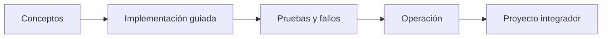

# Parte 09 — Datos, mensajería, serverless e integración

> [← Parte 08](../part-08-continuous-delivery-platform-engineering/README.md) · [Índice completo](../README.md) · [Parte 10 →](../part-10-observability-sre-reliability/README.md)

**Nivel:** avanzado · **Clases:** 12 · **Duración sugerida:** 6–8 semanas

Elegir servicios de datos e integración por sus garantías y patrones de acceso.

## Resultados de la parte

Al completar esta parte podrás explicar el dominio con lenguaje independiente del proveedor,
implementar sus mecanismos esenciales, diagnosticar fallos y defender decisiones mediante
evidencia, costo, seguridad y objetivos de confiabilidad.

## Modelo mental

La base de datos correcta depende del patrón de acceso y de las garantías necesarias; distribuir datos convierte latencia, consistencia y fallos parciales en decisiones de diseño.

## Secuencia

## Clases

| ID | Clase | Laboratorio | Horas |
|---:|---|---|---:|
| 109 | [Bases relacionales administradas y pooling](109-bases-relacionales-administradas-y-pooling/README.md) | `data` | 4 |
| 110 | [NoSQL: clave-valor, documento, columna y grafo](110-nosql-clave-valor-documento-columna-y-grafo/README.md) | `data` | 4 |
| 111 | [Caché, invalidación, TTL y consistencia](111-cache-invalidacion-ttl-y-consistencia/README.md) | `data` | 4 |
| 112 | [Object storage, data lake y formatos columnares](112-object-storage-data-lake-y-formatos-columnares/README.md) | `data` | 4 |
| 113 | [Colas, entrega, reintentos y dead-letter queues](113-colas-entrega-reintentos-y-dead-letter-queues/README.md) | `messaging` | 4 |
| 114 | [Pub/sub, streams, particiones y orden](114-pub-sub-streams-particiones-y-orden/README.md) | `messaging` | 4 |
| 115 | [Arquitectura dirigida por eventos y contratos](115-arquitectura-dirigida-por-eventos-y-contratos/README.md) | `architecture` | 4 |
| 116 | [Sagas, outbox, idempotencia y deduplicación](116-sagas-outbox-idempotencia-y-deduplicacion/README.md) | `distributed` | 4 |
| 117 | [Serverless: límites, cold starts y concurrencia](117-serverless-limites-cold-starts-y-concurrencia/README.md) | `serverless` | 4 |
| 118 | [API management, cuotas, versiones y monetización](118-api-management-cuotas-versiones-y-monetizacion/README.md) | `api` | 4 |
| 119 | [Workflows y orquestación durable](119-workflows-y-orquestacion-durable/README.md) | `orchestration` | 4 |
| 120 | [Proyecto: pipeline de pedidos orientado a eventos](120-proyecto-pipeline-de-pedidos-orientado-a-eventos/README.md) | `capstone` | 8 |

## Evaluación de la parte

- 35 % laboratorios y evidencia reproducible.
- 25 % retos verificables.
- 20 % decisiones y ADR.
- 10 % seguridad, confiabilidad y costo.
- 10 % proyecto integrador de la parte.

Se aprueba con 80 % de clases en nivel B o superior y el proyecto integrador reproducible.

## Pauta bibliográfica

- Designing Data-Intensive Applications — Martin Kleppmann.
- Enterprise Integration Patterns — Hohpe y Woolf.
- Building Event-Driven Microservices — Adam Bellemare.
