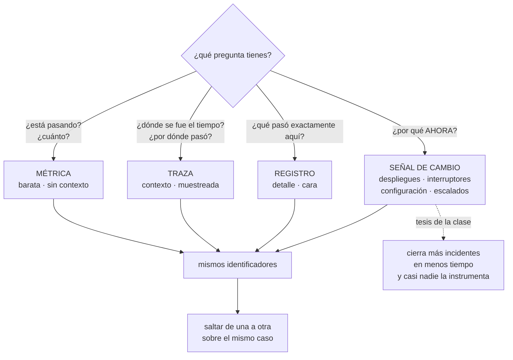

# 121 — Logs, métricas, trazas y eventos como señales

> [← 120 · Proyecto: pipeline de pedidos orientado a eventos](../../part-09-data-messaging-serverless-integration/120-proyecto-pipeline-de-pedidos-orientado-a-eventos/README.md) · [Índice de la parte](../README.md) · [122 · Logging estructurado, correlación y retención →](../../part-10-observability-sre-reliability/122-logging-estructurado-correlacion-y-retencion/README.md)

**Parte:** 10 — Observabilidad, SRE y confiabilidad<br>
**Nivel:** avanzado · **Horas estimadas:** 4<br>
**Laboratorio:** `observability` · **Estado:** `EXECUTABLE_CORE`

## 🎯 Propósito

Abrir la parte con la cifra que la cierra la 120: de veintiún problemas, **tres se detectaron por una alerta y dieciocho cuando ya habían hecho daño**. Esta clase establece el material con el que se corrige eso: cuatro señales, cada una con una pregunta que responde y otras que no puede responder. Y defiende una tesis concreta: la cuarta —qué cambió y cuándo— es la que cierra más incidentes en menos tiempo, y es la única que casi nadie instrumenta.

## 📚 Resultados de aprendizaje

Al finalizar podrás:

1. **Asignar** a cada señal la pregunta que responde y las que no.
2. **Correlacionar** las cuatro con los mismos identificadores.
3. **Instrumentar** los cambios como señal de primera clase.
4. **Prever** el coste de una señal en el momento de emitirla, no de consultarla.
5. **Decidir** el muestreo sabiendo qué preguntas está descartando para siempre.

## 🧩 Conceptos centrales

| Concepto | Comprensión verificable |
|---|---|
| `métrica` | Valor numérico agregado en el tiempo. Barata y comparable; no lleva contexto de ningún caso concreto. |
| `traza` | Recorrido de una petición por los servicios que la atienden, con tiempos por tramo. Responde dónde se fue el tiempo. |
| `registro` | Línea con detalle de lo ocurrido en un punto. Es la señal más expresiva y la más cara por volumen. |
| `señal de cambio` | Registro de lo que se modificó: despliegues, interruptores, configuración, escalados, migraciones. Responde «por qué ahora». |
| `correlación` | Poder saltar de una señal a otra sobre el mismo caso, porque comparten identificadores. |
| `coste en la emisión` | El precio de una señal lo fija lo que se emite, no lo que se consulta. Guardarlo todo por si acaso es la causa principal de la factura. |
| `muestreo` | Quedarse con una parte de las trazas. Decide qué preguntas se podrán hacer después, porque lo no emitido no existe. |

## 🧠 Modelo mental

La confiabilidad es una característica del servicio percibido por usuarios; SRE la administra con objetivos explícitos y presupuestos de error.

Aplicado a esta clase, separa siempre cuatro planos: **intención** (qué necesita el usuario),
**configuración** (qué declaramos), **estado observado** (qué existe de verdad) y
**evidencia** (cómo sabemos que cumple). Confundirlos produce diseños que se ven correctos
en un diagrama pero fallan al operar.

## 🗺️ Flujo de razonamiento



## 📖 Desarrollo

### 1. Cuatro señales, cuatro preguntas

La clasificación útil no es por formato sino **por la pregunta que cada una contesta**:

```text
MÉTRICA          ¿está pasando? ¿cuánto? ¿va peor que ayer?
  responde       agregados, tendencias, comparaciones
  no responde    qué le pasó a esta petición concreta
  coste          bajo por dato, y crece con la CARDINALIDAD (clase 123)

TRAZA            ¿por dónde pasó y dónde se fue el tiempo?
  responde       la cadena de llamadas de un caso, con tiempos
  no responde    con qué frecuencia ocurre, si está muestreada
  coste          medio, y se controla con el muestreo

REGISTRO         ¿qué pasó exactamente en este punto?
  responde       el detalle: valores, decisiones, errores
  no responde    nada agregado sin procesarlo antes
  coste          alto, proporcional al VOLUMEN

SEÑAL DE CAMBIO  ¿por qué ahora?
  responde       qué se modificó y cuándo
  no responde    el efecto; hay que cruzarla con las otras
  coste          casi nulo: son unos cientos de eventos al día
```

Y la asimetría que justifica la tesis de la clase: **la cuarta es la más barata de todas y la que menos se instrumenta**.

La razón por la que funciona tan bien es estadística: la mayoría de los problemas empiezan porque **algo cambió**, y las partes 08 y 09 han multiplicado las cosas que pueden cambiar sin desplegar código:

```text
despliegue de una versión                       clase 102
cambio de un interruptor                        clase 105
confirmación en el repositorio de entorno       clase 103
escalado de instancias o de consumidores        clases 113, 117
cambio de una regla en la puerta de entrada     clase 118
migración de datos o cambio de esquema          clases 109, 115
caducidad de una credencial o de un certificado
rotación de una clave
ventana de mantenimiento del proveedor
```

Y lo que hace falta es poco: **una serie temporal de eventos con quién, qué y cuándo**, dibujada encima de los gráficos.

```json
{"momento":"2026-08-03T09:12:04Z","tipo":"interruptor",
 "que":"recomendaciones-v3","de":"5%","a":"100%",
 "quien":"…","referencia":"…"}
```

La pregunta que responde —«¿qué cambió en los diez minutos anteriores al problema?»— es la primera de cualquier incidente, y sin esta señal se contesta preguntando por los canales del equipo.

### 2. Vigilar y poder preguntar

Hay dos actividades distintas que se llaman parecido y conviene separar:

```text
VIGILAR       preguntas conocidas de antemano
              paneles y alertas escritos antes de que pase nada
              → responde «¿esto que sé que puede fallar, está fallando?»

PODER PREGUNTAR   preguntas nuevas sobre datos ya recogidos
              → responde «¿qué demonios está pasando ahora?»
```

Y los dos hacen falta. Lo que no funciona es esperar que uno haga el trabajo del otro:

```text
solo vigilancia    solo se detectan los fallos que alguien anticipó
                   y los de la parte 09 no los anticipó nadie
solo exploración   nadie está mirando a las 3 de la madrugada
```

Y la propiedad que separa un sistema del que se pueden hacer preguntas nuevas de uno del que no:

```text
¿puedo filtrar por una dimensión que no había previsto?
  versión, cliente, región, tipo de dispositivo, plan, ruta
  → si la dimensión no se emitió, la respuesta es no, para siempre
```

Y de ahí la regla que gobierna esta parte entera:

```text
lo que no se emite no existe
y lo que se emite se paga
```

Las dos mitades tiran en direcciones opuestas, y **resolver esa tensión es el trabajo**. Lo que la resuelve razonablemente bien:

```text
métricas          pocas dimensiones, muy vigiladas             clase 123
trazas            muchas dimensiones, muestreadas              clase 124
registros         detalle completo, retención corta            clase 122
cambios           todo, siempre: es barato
lago              lo que haya que conservar mucho tiempo,
                  en formato columnar                          clase 112
```

Y una cuarta capa que a menudo falta: **los datos derivados que no se pueden recalcular**. Un agregado diario de peticiones por cliente ocupa poco y permite responder preguntas de hace dos años que ninguna retención razonable cubriría.

### 3. Correlacionar, o no sirve de nada

Cuatro señales sin nada en común son cuatro sistemas separados y un incidente se investiga saltando entre pestañas y comparando marcas de tiempo a ojo.

Lo que hace falta es poco y hay que imponerlo desde el principio:

```text
IDENTIFICADOR DE TRAZA en todo
  en cada registro, en cada mensaje de cola (clase 113), en cada evento
  (clase 115), en la respuesta al cliente y en el motor durable (clase 119)

NOMBRES IGUALES en las cuatro
  el servicio se llama igual en la métrica, en el registro y en la traza
  → parece obvio y casi nunca se cumple

EJEMPLARES
  el punto alto de una métrica lleva adjunta una traza de ese momento
  → es el salto de «hay latencia» a «mira esta petición»

ATRIBUTOS COMUNES
  servicio, versión, entorno, región, y el identificador del sujeto
  cuando aplique
```

Y el recorrido que esto habilita, que es el que hay que poder hacer en un incidente:

```text
1. una alerta dice que el percentil 99 subió              métrica
2. un ejemplar lleva a una petición lenta concreta        traza
3. la traza señala qué tramo consume el tiempo            traza
4. los registros de ese tramo, filtrados por la traza     registro
5. y la línea de cambios dice qué se tocó hace 12 min     cambio
```

Cinco pasos, tres minutos. Sin correlación, los mismos cinco pasos son media hora y varias conversaciones.

**La propagación del contexto** es lo que sostiene el paso 1 a 4, y hay que cuidarla en tres sitios donde se rompe siempre:

```text
al encolar          el identificador viaja en el mensaje, no en memoria
al responder y
  procesar después  el contexto asíncrono se pierde si no se traslada a mano
en los trabajos
  programados       no tienen petición de origen: hay que crear la traza
```

Y una decisión que ahorra mucho tiempo después: **devolver el identificador de correlación al cliente** en una cabecera de respuesta. Cuando alguien reclama, trae consigo la llave de todo lo demás.

### 4. Lo que cuesta y lo que se descarta

La factura de telemetría suele sorprender, y su causa es casi siempre la misma: **se decide guardar todo por si acaso**.

Qué dispara el coste de cada señal:

```text
métricas     el número de series = combinaciones de etiquetas
             una etiqueta con identificadores de usuario multiplica por
             millones                                     clase 123
trazas       el volumen emitido; se controla con muestreo  clase 124
registros    el volumen en bytes y la retención            clase 122
cambios      irrelevante
```

Y las cuatro palancas, en orden de eficacia:

```text
1. no emitir lo que nadie consulta
   → medirlo: qué paneles, alertas y consultas usan cada serie
2. retención por capas: caliente días, frío meses, agregado años
3. muestreo de trazas, con las excepciones del apartado siguiente
4. resumir en la emisión: agregar en el proceso antes de enviar
```

La primera es la que más da y la que menos se hace. Y su versión medible es una pregunta incómoda:

```text
¿qué proporción de las métricas emitidas no aparece en ningún panel
ni en ninguna alerta ni en ninguna consulta de los últimos 90 días?
```

**El muestreo**, que es la decisión con más consecuencias de esta clase, porque **lo descartado no vuelve**:

```text
EN LA CABEZA    se decide al empezar la petición
  + barato, y el sistema no tiene que retener nada
  − se descartan errores y casos lentos por puro azar

EN LA COLA      se decide al terminar, viendo el resultado
  + conserva el 100 % de los errores y de los lentos
  − hay que retener las trazas hasta decidir, y cuesta más
```

Y la política que funciona en la práctica:

```text
siempre         errores, peticiones lentas, clientes marcados,
                y todo lo que ocurre durante un incidente
muestreado      el resto, a una tasa que se pueda pagar
nunca perdido   el conteo: la métrica cuenta el 100 %, aunque
                la traza sea de una de cada cien
```

La última línea es la que evita el error más común: **muestrear no debe falsear los números**. Si se muestrea 1 de 100, o se cuenta aparte con métricas, o se pondera al agregar.

Y una advertencia sobre la telemetría como dependencia: **si el sistema de observabilidad se cae, la aplicación no debe caerse con él**. Emisión asíncrona, con memoria acotada y descarte al llenarse.

Y la lista de comprobación de la clase:

```text
☐ cada señal tiene escrita la pregunta que responde
☐ hay señal de cambio: despliegues, interruptores, configuración, escalados
☐ los cambios se dibujan encima de los gráficos
☐ el identificador de traza viaja en registros, mensajes y eventos
☐ los nombres de servicio coinciden en las cuatro señales
☐ el identificador de correlación se devuelve al cliente
☐ el contexto se propaga al encolar y en trabajos programados
☐ el muestreo conserva errores y lentos, y no falsea los conteos
☐ está medido qué proporción de lo emitido no consulta nadie
☐ la retención está por capas y lo que se guarde años está agregado
☐ la aplicación no se cae si la telemetría no responde
```

Y el cierre que enlaza con la clase siguiente: de las cuatro señales, la más cara y la que más se usa mal es el registro. Cómo se estructura, cómo se correlaciona y cuánto se conserva es la materia de la clase 122.

## 🔬 Ejemplo trabajado

**Antes de instrumentar nada, CloudShop hace un ejercicio que cuesta una tarde: coger los veintiún problemas de las clases 109 a 119 y preguntarse, uno a uno, qué señal los habría detectado y cuánto antes. El resultado orienta todo el trabajo de la parte.**

**Cómo se detectaron de verdad.**

```text
por una caída total                              6
por una reclamación de un cliente                4
por una auditoría o un descuadre contable        4
por la factura                                   2
porque a alguien le pareció raro                 2
por una alerta                                   3
                                                ──
                                                21
```

**Qué señal los habría detectado.**

```text                                                    señal        antes
conexiones agotadas al escalar (109)            métrica de conexiones   4 min
duplicados por invisibilidad (113)              métrica de duplicados   3 sem
retardo de réplica en el proceso nocturno (109) métrica de retardo      6 sem
conmutación lenta (109)                         señal de cambio + traza  —
partición caliente (110)                        métrica POR PARTICIÓN   2 días
consulta no prevista (110)                      ninguna: no es un fallo  —
avalancha de caché (111)                        métrica de origen        11 d
penetración de caché (111)                      métrica de aciertos      2 min
caché vaciado (111)                             señal de cambio          9 min
fuga entre usuarios (111)                       ninguna de las cuatro    6 días
coste del lago (112)                            factura, y alerta de
                                                 datos leídos            1 mes
archivo de objetos pequeños (112)               alerta de coste          2 meses
41.216 en cola de fallidos (113)                métrica de la cola       67 d
tormenta de reintentos (113)                    métrica de reintentos    36 min
mensajes perdidos por posición (114)            ninguna directa;
                                                 conteo emitido/procesado 3 sem
rebalanceos en bucle (114)                      métrica de rebalanceos   40 min
cambio de significado de campo (115)            señal de cambio          17 min
consumidor parado 19 h (115)                    métrica de antigüedad    19 h
eventos no publicados (116)                     métrica de la tabla
                                                 de salida               6 meses
trabajo de fondo congelado (117)                conteo emitido/recibido  3 sem
trabajadores del motor caídos (119)             métrica de cola sin
                                                 trabajadores            4 h
```

**El recuento por señal.**

```text
métrica sencilla, de algo que ya existía            13 de 21
señal de cambio                                      3 de 21
conteo de emitidos frente a procesados               2 de 21
ninguna de las cuatro                                2 de 21
factura                                              1 de 21
```

Y las tres conclusiones que salieron de la tabla:

**1. Trece de veintiuno se detectaban con una métrica que no hacía falta inventar.** Antigüedad de una cola, retardo de una réplica, número de conexiones, aciertos de caché, rebalanceos. Ninguna es sofisticada; **simplemente nadie las miraba**.

**2. Dos problemas necesitaban una métrica que no existe en ningún sitio por defecto:**

```text
mensajes emitidos por el productor    frente a    procesados por el consumidor
trabajos lanzados                     frente a    trabajos completados
```

Es una comprobación de conservación —**lo que entra tiene que salir**— y detectó los dos casos que ninguna métrica de servicio veía: la posición confirmada con huecos y la instancia congelada al responder. Se instrumentó en los once consumidores.

**3. Dos no los detecta ninguna señal de esta clase.**

```text
la fuga entre usuarios del caché (111)
  → la detectó una prueba automática, no la observabilidad
la consulta no prevista (110)
  → no era un fallo: era una petición de producto
```

Y eso es un límite honesto: **hay problemas que la observabilidad no ve porque el sistema funciona correctamente según todas sus señales**.

**La señal de cambio, instrumentada en una semana.**

Era la más barata y no existía. Se recogieron cinco orígenes:

```text
despliegues (clase 102)                    ~40 al día
cambios de interruptor (clase 105)         ~6 al día
confirmaciones del repositorio de entorno  ~40 al día
escalados por encima de un umbral          ~15 al día
cambios en la puerta de entrada            ~2 al día
                                          ────────
total                                      ~103 eventos al día
```

Ciento tres eventos al día. **Coste de almacenamiento: despreciable.** Y el efecto medido en los tres meses siguientes:

```text                                          antes         después
incidentes en los que se preguntó
«¿alguien ha tocado algo?» por chat            todos           2 de 19
tiempo medio hasta identificar el cambio
causante                                       31 min          90 s
incidentes resueltos revirtiendo el cambio
identificado en menos de 5 min                   1 de 12        8 de 19
```

Y el caso que lo justifica solo:

```text
11:42  sube la latencia del percentil 99 del catálogo
11:43  la línea de cambios muestra: interruptor «cache-v2» al 100 % a las 11:38
11:44  revertido
11:45  latencia normal
```

Tres minutos. **El mismo tipo de incidente había costado treinta y cinco minutos en la clase 105**, y la diferencia entera fue tener dibujados los cambios encima del gráfico.

**El coste, medido antes de crecer.**

```text
coste mensual de telemetría al empezar                410 €
coste de cómputo                                    9.200 €
proporción                                             4,5 %

series de métricas emitidas                          41.000
series usadas en algún panel, alerta o consulta
de los últimos 90 días                                8.900
proporción sin usar                                    78 %
```

Setenta y ocho por ciento emitido y no consultado nunca. Se dejaron de emitir 18.000 series de las menos usadas —conservando las de conservación del punto 2— y el coste bajó a 260 €. **Ninguna consulta ni alerta se rompió en seis meses.**

**El muestreo, decidido con una prueba.**

```text                                    1 de 100 en cabeza    en cola
errores con traza disponible                   1 %             100 %
peticiones lentas con traza                    1 %             100 %
volumen de trazas                              1×               2,3×
coste                                          38 €             87 €
incidentes en los que faltó la traza
del caso concreto                            7 de 12          0 de 19
```

Siete de doce incidentes en los que la traza del caso investigado **no se había conservado**. El muestreo en la cola cuesta cincuenta euros más al mes y elimina esa categoría entera.

**Estado al cabo de tres meses.**

```text                                          antes         después
señales instrumentadas                        3 de 4          4 de 4
eventos de cambio al día                          0            103
series de métricas emitidas                  41.000         23.000
series sin consultar                            78 %           12 %
coste mensual de telemetría                    410 €          310 €
muestreo de trazas                        1 de 100 en cabeza   en cola
incidentes sin la traza del caso              7 de 12         0 de 19
identificador de correlación al cliente          no             sí
métricas de conservación (emitido/procesado)      0             11
tiempo hasta identificar el cambio causante   31 min          90 s
```

**La lección que esta clase abre para la parte 10**: el ejercicio de la tabla costó una tarde y reorientó el trabajo entero. **Trece de veintiún problemas se detectaban con métricas triviales que ya se podían emitir y que nadie miraba**, lo que significa que el problema no era de herramientas ni de datos: era de no haber decidido qué mirar. Y la señal que más redujo el tiempo de diagnóstico fue la más barata de las cuatro y la única que no estaba: **saber qué cambió y cuándo**.

## 🧪 Laboratorio guiado

Ejecuta desde la raíz:

```bash
python classes/part-10-observability-sre-reliability/121-logs-metricas-trazas-y-eventos-como-senales/lab.py
```

El laboratorio selecciona el motor de práctica **`observability`** y produce
`lab_result.json`. El escenario, sus comprobaciones y el artefacto esperado corresponden a
esta clase; no requiere credenciales y deja explícito qué debe revalidarse en un sandbox real.

1. Lee `exercise.steps` y formula una predicción antes de ejecutar.
2. Ejecuta la práctica y verifica todos los elementos de `checks`.
3. Provoca el caso de `negative_test` y explica la señal observada.
4. Materializa `mapa-telemetria` en `evidence/` usando la plantilla indicada.
5. Para proveedor real, sigue `sandbox.requires`, registra costo y ejecuta `destroy`.

### Evidencia esperada

El artefacto principal es telemetría correlacionada con una pregunta operativa. Además, la entrega debe incluir el comando ejecutado,
la salida estructurada y una conclusión que no exceda lo observado.

## 🏆 Reto verificable

Construye **`mapa-telemetria`** para el caso CloudShop. Incluye una alternativa descartada,
un supuesto que pueda falsarse, una prueba de fallo y una decisión de rollback.

## ✅ Criterio de aceptación

- [ ] `lab.py` termina con código 0 y genera JSON válido.
- [ ] La entrega conecta al menos tres requisitos con mecanismos verificables.
- [ ] Existe una prueba positiva y una prueba negativa con evidencia.
- [ ] Seguridad, costo y operación aparecen como decisiones, no como anexos.
- [ ] Se declara una limitación y una condición que obligaría a revisar el diseño.
- [ ] Otra persona puede repetir el recorrido sin conocimiento tácito.

## ⚠️ Errores frecuentes

| Síntoma | Causa probable | Corrección |
|---|---|---|
| En cada incidente se pregunta por chat si alguien ha tocado algo | No existe señal de cambio: despliegues, interruptores, configuración y escalados no se registran juntos | Recoge los cambios de todos los orígenes en una serie temporal y dibújalos encima de los gráficos. |
| Se investiga un caso concreto y su traza no existe | Muestreo en la cabeza: se descartó por azar antes de saber que era un error | Muestreo en la cola conservando siempre errores, lentos y todo lo que ocurre durante un incidente. |
| La factura de telemetría crece sin que nadie sepa por qué | Se emite todo por si acaso, y el coste lo fija la emisión | Mide qué proporción de lo emitido no se consulta en 90 días y deja de emitirlo; aplica retención por capas. |
| Investigar exige saltar entre herramientas comparando horas a ojo | Las señales no comparten identificadores ni nombres | Propaga el identificador de traza a registros, mensajes y eventos, unifica los nombres de servicio y añade ejemplares. |
| Los números agregados cambian al ajustar el muestreo | Se están contando trazas muestreadas como si fueran el total | Cuenta con métricas al 100 % o pondera al agregar; muestrear no debe falsear conteos. |
| Se pierden datos entre dos sistemas y ninguna señal lo indica | Faltan métricas de conservación: cuánto se emitió frente a cuánto se procesó | Instrumenta el par emitido/procesado en cada frontera asíncrona. |

## 🛡️ Seguridad, ética y costo

Trabaja con cuentas propias o sandboxes autorizados. No publiques secretos, identificadores
reales ni datos personales. Antes de crear recursos pagos define presupuesto, etiquetas y
comando de destrucción; después verifica que no queden recursos huérfanos. Los ejemplos
locales enseñan contratos, pero no certifican cumplimiento ni disponibilidad de producción.

## ❓ Preguntas de comprobación

1. ¿Qué pregunta responde cada una de las cuatro señales y cuál no puede responder?
2. ¿Por qué la señal de cambio es la más barata y la que más reduce el tiempo de diagnóstico?
3. ¿Qué diferencia hay entre vigilar y poder preguntar, y por qué hacen falta las dos?
4. ¿Qué se pierde para siempre al muestrear en la cabeza y qué cuesta muestrear en la cola?
5. ¿Qué mide una métrica de conservación y qué tipo de fallo detecta?

## 🔗 Referencias

- OpenTelemetry (2025). *Signals overview* — métricas, trazas, registros y su correlación. <https://opentelemetry.io/docs/concepts/signals/>
- Google SRE (2025). *Monitoring distributed systems* — señales, alertas y el papel de los cambios. <https://sre.google/sre-book/monitoring-distributed-systems/>
- Majors, C., Fong-Jones, L. y Miranda, G. (2022). *Observability Engineering*, caps. 1-3 — preguntas nuevas sobre datos existentes. <https://www.oreilly.com/library/view/observability-engineering/9781492076438/>
- OpenTelemetry (2025). *Sampling: head and tail* — qué se descarta en cada estrategia. <https://opentelemetry.io/docs/concepts/sampling/>
- Prometheus (2025). *Exemplars* — salto de una métrica a una traza concreta. <https://prometheus.io/docs/prometheus/latest/feature_flags/#exemplars-storage>
- Documentación oficial vigente del servicio implementado; registra URL y fecha de consulta.

---

> [Evaluación](assessment.md) · [Contrato de clase](lesson.yaml) · [Índice de la parte](../README.md)

| Anterior | Índice | Siguiente |
|---|---|---|
| [← 120 · Proyecto: pipeline de pedidos orientado a eventos](../../part-09-data-messaging-serverless-integration/120-proyecto-pipeline-de-pedidos-orientado-a-eventos/README.md) | [Parte 10](../README.md) · [Programa](../../README.md) | [122 · Logging estructurado, correlación y retención →](../../part-10-observability-sre-reliability/122-logging-estructurado-correlacion-y-retencion/README.md) |
