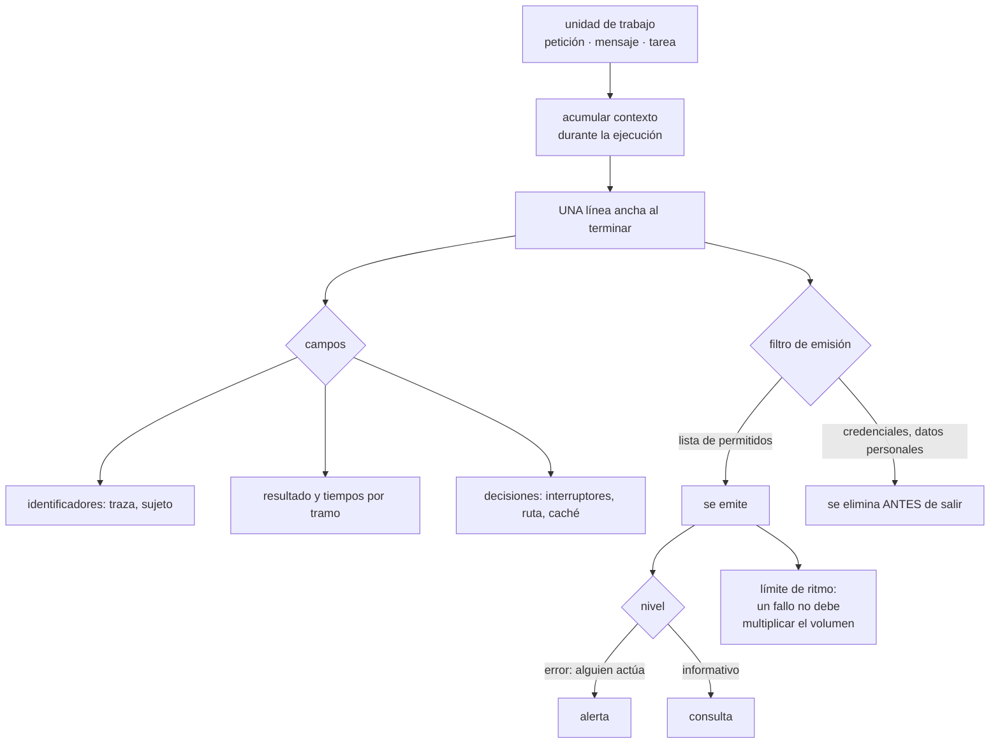

# 122 — Logging estructurado, correlación y retención

> [← 121 · Logs, métricas, trazas y eventos como señales](../../part-10-observability-sre-reliability/121-logs-metricas-trazas-y-eventos-como-senales/README.md) · [Índice de la parte](../README.md) · [123 · Métricas, cardinalidad y modelos RED y USE →](../../part-10-observability-sre-reliability/123-metricas-cardinalidad-y-modelos-red-y-use/README.md)

**Parte:** 10 — Observabilidad, SRE y confiabilidad<br>
**Nivel:** avanzado · **Horas estimadas:** 4<br>
**Laboratorio:** `observability` · **Estado:** `EXECUTABLE_CORE`

## 🎯 Propósito

Convertir la señal más cara y peor usada en algo consultable. La clase defiende tres cambios concretos: que **un registro es un dato, no una frase**, y por tanto el mensaje es constante y los valores son campos; que una petición debería producir **una línea ancha con todo** en vez de doce líneas dispersas; y que el registro es el sitio donde más datos personales se filtran, porque se copia a más lugares de los que nadie recuerda. Y termina con el caso que sorprende: cuando registrar es lo que tumba el sistema.

## 📚 Resultados de aprendizaje

Al finalizar podrás:

1. **Emitir** registros estructurados con mensaje constante y valores en campos.
2. **Usar** los niveles para decidir quién actúa, no para expresar énfasis.
3. **Sustituir** líneas dispersas por una línea ancha por unidad de trabajo.
4. **Impedir** que credenciales y datos personales lleguen al registro.
5. **Evitar** que el propio registro amplifique un incidente.

## 🧩 Conceptos centrales

| Concepto | Comprensión verificable |
|---|---|
| `registro estructurado` | Línea con campos nombrados y tipos, no texto con valores incrustados. Es lo que permite filtrar, agrupar y agregar. |
| `mensaje constante` | El texto no cambia entre ejecuciones; lo que varía va en campos. Permite agrupar todas las ocurrencias del mismo suceso. |
| `línea ancha` | Un solo registro por unidad de trabajo con todo lo que se sabe al terminar: identificadores, tiempos, resultados y decisiones. |
| `nivel` | Indicación de quién debe actuar. Error significa que alguien tiene que hacer algo; si nadie actúa, no era error. |
| `depuración dirigida` | Elevar el detalle solo para las peticiones marcadas, en producción, sin cambiar el nivel global. |
| `amplificación por registro` | Un fallo genera un pico de registros que consume procesador, disco o red y agrava el propio fallo. |

## 🧠 Modelo mental

La confiabilidad es una característica del servicio percibido por usuarios; SRE la administra con objetivos explícitos y presupuestos de error.

Aplicado a esta clase, separa siempre cuatro planos: **intención** (qué necesita el usuario),
**configuración** (qué declaramos), **estado observado** (qué existe de verdad) y
**evidencia** (cómo sabemos que cumple). Confundirlos produce diseños que se ven correctos
en un diagrama pero fallan al operar.

## 🗺️ Flujo de razonamiento



## 📖 Desarrollo

### 1. Un registro es un dato

La diferencia entre estas dos líneas decide si el registro sirve para algo:

```text
mal   "Error procesando el pedido 1421 del cliente 88 tras 3 intentos"
bien  {"msg":"pedido.proceso.fallido","pedido":"1421",
       "cliente":"88","intentos":3,"causa":"tiempo_agotado"}
```

La primera solo se puede buscar con expresiones frágiles. La segunda se puede **filtrar, agrupar y contar**:

```text
¿cuántos fallos de este tipo hubo hoy?          agrupar por msg
¿afectan a un cliente concreto?                 filtrar por cliente
¿la mediana de intentos ha subido?              agregar intentos
```

Y la regla que lo hace posible: **el mensaje es una constante**. Si el texto lleva dentro el identificador, cada línea es un mensaje distinto y no se puede agrupar nada.

```text
mal   msg: "pedido 1421 fallido"      → un millón de mensajes distintos
bien  msg: "pedido.proceso.fallido"   → un mensaje con un millón de casos
```

Y conviene tratar los nombres de mensaje como un catálogo pequeño y estable, igual que los tipos de evento de la clase 115: si cada persona inventa el suyo, no hay agrupación posible.

**Los niveles**, que se usan casi siempre como énfasis y deberían indicar **quién actúa**:

```text
ERROR    alguien tiene que hacer algo
         si nadie hace nada nunca, no era un error
AVISO    el nivel más inútil que existe en la práctica:
         ni exige acción ni aporta contexto, y llena el volumen
         → o sube a error, o baja a informativo
INFO     hechos de negocio y de ciclo de vida; sirven para consultar
DEPURACIÓN  detalle para diagnosticar; apagado por defecto
```

Y la comprobación que ordena esto de golpe:

```text
coge los diez mensajes de nivel error más frecuentes
¿alguien hizo algo con ellos el último mes?
  no → no son errores; bájalos
```

Es la ley 15 aplicada aquí: **un nivel de error que suena mil veces al día deja de significar algo**.

Y un caso concreto muy frecuente: los errores de cliente. Una petición mal formada de un cliente externo **no es un error tuyo**; es un hecho informativo con un código. Si se registra como error, el error deja de ser útil.

### 2. Una línea ancha, no doce estrechas

El patrón habitual reparte el conocimiento de una petición por todo el código:

```text
"petición recibida"
"consultando caché"
"caché fallido"
"consultando base"
"base respondió en 41 ms"
"aplicando descuento"
…
"respuesta 200 en 212 ms"
```

Doce líneas, ningún sitio con la historia completa, y para reconstruirla hay que buscar por identificador y ordenar por tiempo. Y en un sistema con concurrencia, **el orden puede engañar**.

La alternativa es acumular contexto y emitir **una sola línea al terminar**:

```json
{"msg":"http.peticion","traza":"a91c…","ruta":"/checkout",
 "metodo":"POST","estado":200,"duracion_ms":212,
 "cliente":"88","plan":"pro","region":"eu-west",
 "cache":"fallo","bd_ms":41,"pago_ms":118,"reintentos":0,
 "interruptores":{"pago-v2":true},"version":"2.14.1"}
```

Y lo que se gana es grande:

```text
volumen              baja mucho: una línea en vez de doce
consultas nuevas     se pueden hacer sin tocar el código:
                     «¿la latencia es peor para el plan pro en eu-west
                      con el interruptor activo?»
reconstrucción       no hace falta: todo está en la misma línea
correlación          los identificadores están ahí por construcción
```

La segunda es la que convierte el registro en algo de lo que se pueden hacer **preguntas nuevas**, que es lo que la clase 121 llamó poder preguntar.

Y el patrón se aplica a cualquier unidad de trabajo, no solo a peticiones:

```text
un mensaje consumido de una cola          clase 113
una actividad del motor durable           clase 119
un trabajo programado
una llamada saliente a un tercero
```

Y lo que **sí** merece líneas aparte:

```text
arranque y parada del proceso
cambios de configuración detectados
errores con su traza de pila
decisiones excepcionales que quieras poder auditar
```

Y **la depuración dirigida**, que resuelve la tensión entre detalle y volumen:

```text
nivel global: informativo
y si la petición viene marcada —cabecera, cliente concreto,
  muestreo del 0,1 %— se registra con todo el detalle
→ detalle de depuración en producción, sin cambiar el nivel global
→ y sin desplegar
```

Se controla con un interruptor de operación de la clase 105, con su fecha de revisión.

### 3. Lo que nunca debe salir

El registro es el sitio por donde más se filtran datos que no deberían salir, y por un motivo estructural: **se copia a muchos más lugares de los que nadie recuerda**.

```text
del proceso al agente de recogida
del agente al sistema central
del sistema central a copias de seguridad
a un lago para análisis                            clase 112
a paneles compartidos con equipos que no deberían verlo
y a la pantalla de quien depura, y a un chat, y a una captura
```

Y la ley 11 remata: **lo que entró se queda**, en más sitios de los que se pueden purgar.

Lo que no debe llegar nunca:

```text
contraseñas, testigos, claves, cookies de sesión
números de tarjeta completos, códigos de verificación
datos personales: nombre, correo, teléfono, dirección, documento
cuerpos completos de peticiones y respuestas
cabeceras de autorización
cadenas de conexión
```

Y el mecanismo, que tiene que ser **lista de permitidos y no de prohibidos**:

```text
lista de prohibidos   se enumeran los campos a ocultar
                      → el campo nuevo que nadie añadió a la lista sale

lista de permitidos   solo se emiten los campos declarados
                      → lo que no está declarado no sale, y hay que
                        pedirlo a propósito
```

El segundo es más incómodo y es el único que aguanta el paso del tiempo.

Y dos precauciones más:

```text
cuerpos y cabeceras     nunca completos; campos concretos, declarados
identificadores         pseudonimizar el del usuario, y guardar la
                        correspondencia en un sitio con más control
excepciones             una traza de pila puede llevar valores dentro:
                        revisar qué se serializa
librerías de terceros   registran por su cuenta; hay que comprobarlo,
                        y suele ser una sorpresa
```

La última es la que aparece en más auditorías: **un cliente HTTP que registra la petición completa en nivel de depuración**, y alguien sube el nivel una tarde.

Y la comprobación automática que funciona, barata de montar:

```text
un escáner sobre una muestra de registros que busca patrones:
  correos, tarjetas, testigos con formato conocido, documentos
ejecutado a diario, alertando por hallazgo
→ es la misma medicina que la clase 101 aplicó al repositorio
```

Y qué hacer cuando ya ha salido, que es el procedimiento de siempre:

```text
1. rotar lo que fuera una credencial
2. corregir la emisión
3. purgar donde se pueda purgar, sabiendo que no será en todos los sitios
```

### 4. Coste, retención y el registro como causa del incidente

El registro es la señal más cara, y su coste se decide al emitir.

```text
volumen ≈ peticiones × líneas por petición × bytes por línea

1.200 pet/s × 12 líneas × 400 B ≈ 5,8 MB/s ≈ 500 GB/día
con línea ancha: 1.200 × 1 × 900 B ≈ 1,1 MB/s ≈ 93 GB/día
```

Y las palancas, en orden:

```text
1. línea ancha en vez de líneas dispersas         factor 4-6
2. quitar el nivel de aviso, o subirlo o bajarlo  factor variable, grande
3. muestrear los registros de éxito               conservando todos los
                                                  errores y los lentos
4. retención por capas                            días caliente, meses frío
5. lo que haya que guardar años, agregado o en
   formato columnar                               clase 112
```

La tercera sorprende y es legítima: **no hace falta guardar el registro de las mil peticiones correctas por segundo**; hacen falta los conteos, que ya están en las métricas, y una muestra.

Y la retención se decide por uso, no por costumbre:

```text
diagnóstico de un incidente               7-14 días caliente
investigación de un problema recurrente   30-90 días
auditoría y cumplimiento                  lo que exija la norma,
                                          y en un sitio aparte con
                                          controles distintos
```

La última línea importa: **mezclar registros de auditoría con los de diagnóstico** obliga a aplicar a todo la retención más larga y los controles más estrictos.

**Y el caso que cierra la clase: cuando registrar es lo que tumba el sistema.**

```text
empieza un fallo en una dependencia
cada petición fallida emite una excepción con traza de pila
el volumen de registro se multiplica por cien
→ la escritura consume procesador
→ y si es síncrona, BLOQUEA el hilo de la petición
→ el disco o la cuota se llenan
→ y el sistema de registro empieza a rechazar, con más errores
```

Lo que lo evita:

```text
emisión asíncrona con memoria acotada y descarte al llenarse
  → nunca bloquear la petición por registrar
límite de ritmo por mensaje: «este mensaje, 10 por segundo como mucho,
  y luego un resumen con el conteo»
no registrar la traza de pila completa en errores esperables
y alerta sobre el propio volumen de registro, que es un síntoma
```

La penúltima línea es la más rentable: **un tiempo de espera agotado no necesita cincuenta líneas de traza de pila**; necesita un campo con la causa.

Y la lista de comprobación de la clase:

```text
☐ todos los registros son estructurados, con mensaje constante
☐ los nombres de mensaje son un catálogo estable
☐ el nivel de error implica que alguien actúa; se revisa cada trimestre
☐ los errores de cliente no se registran como errores propios
☐ hay una línea ancha por unidad de trabajo
☐ existe depuración dirigida sin cambiar el nivel global
☐ la emisión usa lista de permitidos, no de prohibidos
☐ se comprueba qué registran las librerías de terceros
☐ hay un escáner diario de datos sensibles sobre una muestra
☐ los registros de auditoría están separados de los de diagnóstico
☐ la emisión es asíncrona y nunca bloquea la petición
☐ hay límite de ritmo por mensaje y alerta sobre el volumen
```

Y el cierre que enlaza con la clase siguiente: la señal barata de la clase 121 tiene una trampa propia que arruina presupuestos y sistemas enteros —añadir una dimensión con demasiados valores distintos—, y es la materia de la clase 123.

## 🔬 Ejemplo trabajado

**CloudShop tiene una factura de registro que ha crecido un 40 % en seis meses y un incidente que empeoró por culpa del propio registro. El ejercicio son cuatro cambios, medidos uno a uno.**

**Punto de partida.**

```text
volumen diario                                        510 GB
coste mensual                                       3.100 €
líneas por petición, mediana                             14
proporción estructurada                                31 %
nivel de aviso                                    41 % del volumen
consultas que alguien hace al día                       ~25
retención                                            90 días, todo caliente
```

**Cambio 1: estructurar y fijar el catálogo de mensajes.**

El 69 % eran frases con valores dentro. Al estructurar aparecieron los mensajes reales:

```text
mensajes distintos antes de normalizar          1,4 millones
después                                                 310
```

Un millón cuatrocientos mil «mensajes distintos» eran el mismo suceso con identificadores dentro. Y con trescientos diez mensajes ya se podía agrupar:

```text
los 10 mensajes de nivel error más frecuentes         74 % de los errores
de ellos, con alguna acción en el último mes             2 de 10
```

Ocho de los diez errores más frecuentes **no los había mirado nadie**. Cinco eran errores de cliente —peticiones mal formadas de socios— y bajaron a informativo; tres se corrigieron.

```text                                          antes         después
líneas de nivel error al día                 210.000         9.400
de ellas, accionables                          ~400          ~380
proporción accionable                          0,2 %          4 %
```

**Cambio 2: la línea ancha.**

```text                                    14 líneas       1 línea ancha
bytes por petición                          5.400            920
volumen diario                              510 GB          98 GB
coste mensual                              3.100 €          690 €
campos disponibles por petición          dispersos           31
```

Y el efecto que no se esperaba, que es el importante:

```text
consultas nuevas hechas en los 2 meses siguientes        41
de ellas, imposibles antes sin cambiar el código         33
```

Ejemplos de las preguntas que pasaron a ser posibles:

```text
«¿la latencia del plan pro es peor en una región concreta?»
«¿los fallos de pago se concentran en una versión del cliente móvil?»
«¿el interruptor nuevo cambia la proporción de fallos de caché?»
```

Ninguna requería instrumentación nueva: **los campos ya estaban, solo que repartidos en catorce líneas**.

**Cambio 3: los datos personales que llevaban dos años saliendo.**

El escáner diario se montó en una tarde. El primer día:

```text
correos electrónicos en registros                   41.200 / día
teléfonos                                            8.900 / día
direcciones completas                                2.100 / día
números de tarjeta completos                             0
testigos de sesión                                     340 / día
```

Y el origen de los tres primeros era uno solo:

```text
un cliente HTTP de una librería registraba la petición completa
en nivel de depuración
y el nivel de ese componente estaba en depuración desde una
investigación de hacía 14 meses
```

Catorce meses. Es el caso del apartado tercero, literal.

Y los 340 testigos venían de un sitio distinto: una traza de pila que serializaba el objeto de la petición.

```text                                          antes         después
mecanismo                              lista de prohibidos   lista de permitidos
campos declarados                             —                 24
datos personales detectados por el escáner  52.200 / día      0-3 / día
los 0-3 residuales                            —          campos nuevos sin declarar,
                                                         detectados el mismo día
registros purgados                            —        hasta donde se pudo
testigos rotados                              —              todos
```

La fila de los residuales enseña la ventaja de la lista de permitidos: **el campo nuevo no sale, y el escáner solo lo ve cuando alguien intenta añadirlo**.

**Cambio 4: el incidente que el registro amplificó.**

```text
16:04  el proveedor de pago empieza a agotar tiempos de espera
16:04  cada fallo emite una excepción con traza de pila: 4,2 KB por línea
16:05  volumen de registro: de 1,1 MB/s a 140 MB/s
16:06  la escritura era SÍNCRONA: los hilos de petición se bloquean
16:06  la latencia sube de 210 ms a 4,8 s en peticiones que no tocan el pago
16:11  el sistema de registro empieza a rechazar; más errores
16:31  se recupera el proveedor; el sistema tarda 9 min más en normalizarse
```

Un fallo de una dependencia que afectaba al 12 % de las peticiones **degradó el 100 %**, y la causa fue registrar.

```text                                          antes         después
emisión                                    síncrona     asíncrona, cola acotada
qué pasa al llenarse la cola                bloquea      descarta y cuenta
traza de pila en errores esperables            sí             no, campo causa
límite de ritmo por mensaje                    no        10/s + resumen
alerta sobre el volumen de registro            no        > 3× la mediana

ensayo del mismo fallo, después:
volumen de registro en el pico              140 MB/s       4,1 MB/s
latencia de peticiones no afectadas          4,8 s          230 ms
peticiones degradadas                         100 %          12 %
```

**La retención, separada por uso.**

```text                                          antes         después
todo caliente                              90 días          14 días
capa fría                                  no había         90 días
agregados en el lago                       no había         2 años
registros de auditoría                     mezclados     sistema aparte,
                                                         7 años, con sus
                                                         propios controles
coste mensual total                        3.100 €           520 €
```

**Al cabo de cuatro meses.**

```text                                          antes         después
volumen diario                              510 GB           98 GB
coste mensual                              3.100 €          520 €
líneas por petición                             14              1
mensajes distintos                        1,4 millones        310
líneas de nivel error al día               210.000          9.400
proporción de errores accionables             0,2 %            4 %
datos personales por día en registros       52.200            0-3
consultas nuevas posibles sin tocar código      —              33
degradación por amplificación de registro     100 %           12 %
retención caliente                          90 días         14 días
```

**La lección que esta clase traslada a la parte 10**: el volumen bajó a la quinta parte y la utilidad subió, porque **son la misma decisión**. Doce líneas dispersas cuestan seis veces más que una línea ancha y responden menos preguntas. Y el hallazgo más incómodo no fue el coste: fue que **el 99,8 % de lo que el sistema llamaba error no lo miraba nadie**, y que un componente llevaba catorce meses escribiendo correos y teléfonos de clientes en el registro porque alguien subió un nivel para una investigación y no lo bajó.

## 🧪 Laboratorio guiado

Ejecuta desde la raíz:

```bash
python classes/part-10-observability-sre-reliability/122-logging-estructurado-correlacion-y-retencion/lab.py
```

El laboratorio selecciona el motor de práctica **`observability`** y produce
`lab_result.json`. El escenario, sus comprobaciones y el artefacto esperado corresponden a
esta clase; no requiere credenciales y deja explícito qué debe revalidarse en un sandbox real.

1. Lee `exercise.steps` y formula una predicción antes de ejecutar.
2. Ejecuta la práctica y verifica todos los elementos de `checks`.
3. Provoca el caso de `negative_test` y explica la señal observada.
4. Materializa `contrato-logs` en `evidence/` usando la plantilla indicada.
5. Para proveedor real, sigue `sandbox.requires`, registra costo y ejecuta `destroy`.

### Evidencia esperada

El artefacto principal es telemetría correlacionada con una pregunta operativa. Además, la entrega debe incluir el comando ejecutado,
la salida estructurada y una conclusión que no exceda lo observado.

## 🏆 Reto verificable

Construye **`contrato-logs`** para el caso CloudShop. Incluye una alternativa descartada,
un supuesto que pueda falsarse, una prueba de fallo y una decisión de rollback.

## ✅ Criterio de aceptación

- [ ] `lab.py` termina con código 0 y genera JSON válido.
- [ ] La entrega conecta al menos tres requisitos con mecanismos verificables.
- [ ] Existe una prueba positiva y una prueba negativa con evidencia.
- [ ] Seguridad, costo y operación aparecen como decisiones, no como anexos.
- [ ] Se declara una limitación y una condición que obligaría a revisar el diseño.
- [ ] Otra persona puede repetir el recorrido sin conocimiento tácito.

## ⚠️ Errores frecuentes

| Síntoma | Causa probable | Corrección |
|---|---|---|
| No se puede contar cuántas veces ha ocurrido un suceso | El mensaje lleva los valores dentro, así que cada línea es un mensaje distinto | Mensaje constante y valores en campos; trata los nombres de mensaje como un catálogo estable. |
| Hay cientos de miles de líneas de error al día y nadie hace nada con ellas | El nivel se usa como énfasis y los errores de cliente se registran como propios | Error significa que alguien actúa; revisa los diez más frecuentes cada trimestre y baja los que nadie atiende. |
| Reconstruir lo que pasó en una petición exige buscar y ordenar doce líneas | El contexto está repartido por el código | Acumula contexto y emite una línea ancha por unidad de trabajo con todo lo que se sabe al terminar. |
| Aparecen datos personales en los registros | Se usa lista de prohibidos y una librería registra la petición completa | Lista de permitidos, revisión de lo que registran las librerías y escáner diario sobre una muestra. |
| Un fallo parcial degrada el sistema entero | El registro se emite de forma síncrona y su volumen se multiplica durante el fallo | Emisión asíncrona con cola acotada, límite de ritmo por mensaje y sin trazas de pila en errores esperables. |
| La retención de todo es la que exige el requisito más estricto | Los registros de auditoría están mezclados con los de diagnóstico | Sepáralos en destinos distintos con sus propios controles y plazos. |

## 🛡️ Seguridad, ética y costo

Trabaja con cuentas propias o sandboxes autorizados. No publiques secretos, identificadores
reales ni datos personales. Antes de crear recursos pagos define presupuesto, etiquetas y
comando de destrucción; después verifica que no queden recursos huérfanos. Los ejemplos
locales enseñan contratos, pero no certifican cumplimiento ni disponibilidad de producción.

## ❓ Preguntas de comprobación

1. ¿Por qué el mensaje debe ser constante y los valores ir en campos?
2. ¿Qué debería significar el nivel de error y cómo se comprueba que se cumple?
3. ¿Qué gana una línea ancha frente a doce líneas dispersas, además de volumen?
4. ¿Por qué la lista de permitidos es la única que aguanta el paso del tiempo?
5. ¿Cómo puede el propio registro convertir un fallo parcial en una caída general?

## 🔗 Referencias

- Honeycomb (2025). *Structured events and wide events* — una línea ancha por unidad de trabajo. <https://docs.honeycomb.io/get-started/basics/observability/>
- OpenTelemetry (2025). *Logs data model and correlation* — campos, atributos y enlace con trazas. <https://opentelemetry.io/docs/specs/otel/logs/data-model/>
- OWASP (2025). *Logging cheat sheet* — qué no registrar nunca y cómo depurar en la emisión. <https://cheatsheetseries.owasp.org/cheatsheets/Logging_Cheat_Sheet.html>
- Google SRE (2025). *Practical alerting and log volume* — coste del registro y su papel durante incidentes. <https://sre.google/sre-book/practical-alerting/>
- Charity Majors (2019). *Logs versus structured events* — por qué agrupar exige mensaje constante. <https://charity.wtf/2019/02/05/logs-vs-structured-events/>
- Documentación oficial vigente del servicio implementado; registra URL y fecha de consulta.

---

> [Evaluación](assessment.md) · [Contrato de clase](lesson.yaml) · [Índice de la parte](../README.md)

**📥 Descargar:** [Parte 10 en PDF](../../../site/downloads/partes/manual-parte-10-observability-sre-reliability.pdf) · [Manual integral](../../../site/downloads/multi-cloud-engineering-manual-v2.0.pdf)

| Anterior | Índice | Siguiente |
|---|---|---|
| [← 121 · Logs, métricas, trazas y eventos como señales](../../part-10-observability-sre-reliability/121-logs-metricas-trazas-y-eventos-como-senales/README.md) | [Parte 10](../README.md) · [Programa](../../README.md) | [123 · Métricas, cardinalidad y modelos RED y USE →](../../part-10-observability-sre-reliability/123-metricas-cardinalidad-y-modelos-red-y-use/README.md) |
