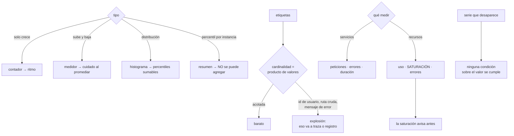

# 123 — Métricas, cardinalidad y modelos RED y USE

> [← 122 · Logging estructurado, correlación y retención](../../part-10-observability-sre-reliability/122-logging-estructurado-correlacion-y-retencion/README.md) · [Índice de la parte](../README.md) · [124 · Tracing distribuido y OpenTelemetry →](../../part-10-observability-sre-reliability/124-tracing-distribuido-y-opentelemetry/README.md)

**Parte:** 10 — Observabilidad, SRE y confiabilidad<br>
**Nivel:** avanzado · **Horas estimadas:** 4<br>
**Laboratorio:** `metrics` · **Estado:** `EXECUTABLE_CORE`

## 🎯 Propósito

Emitir la señal barata sin arruinarse y sin mentir. La clase se apoya en tres hechos que se incumplen constantemente: **el coste de las métricas es el producto de los valores de sus etiquetas**, y basta una mala para multiplicarlo por millones; **los percentiles no se promedian**, así que casi todos los paneles que agregan percentiles entre instancias muestran un número que no existe; y **la ausencia de un dato no es un cero**, que es la forma que toma aquí la ley 13. Y da los dos modelos que dicen qué medir para no acabar con miles de series que nadie consulta.

## 📚 Resultados de aprendizaje

Al finalizar podrás:

1. **Elegir** el tipo de métrica adecuado y saber qué agregaciones son válidas.
2. **Calcular** la cardinalidad antes de añadir una etiqueta.
3. **Aplicar** los dos modelos: servicios por peticiones y recursos por saturación.
4. **Configurar** intervalos de histograma que hagan útil el percentil 99.
5. **Detectar** la ausencia de datos, que no dispara ninguna alerta por sí sola.

## 🧩 Conceptos centrales

| Concepto | Comprensión verificable |
|---|---|
| `contador` | Valor que solo crece. No se consulta su valor absoluto, sino su ritmo de crecimiento; hay que tratar los reinicios. |
| `medidor` | Valor instantáneo que sube y baja. Promediarlo entre instancias suele ocultar justo la que está mal. |
| `histograma` | Cuentas por intervalos. Es la única forma de calcular percentiles que se puedan sumar entre instancias. |
| `cardinalidad` | Número de series distintas: el producto de los valores posibles de cada etiqueta. Es lo que determina el coste. |
| `saturación` | Cuánto trabajo espera en cola. Es el indicador que avisa antes, porque sube cuando la latencia todavía es normal. |
| `ausencia` | Que una serie deje de emitirse. No es un valor bajo: es que no hay valor, y ninguna condición sobre el valor se cumple. |

## 🧠 Modelo mental

La confiabilidad es una característica del servicio percibido por usuarios; SRE la administra con objetivos explícitos y presupuestos de error.

Aplicado a esta clase, separa siempre cuatro planos: **intención** (qué necesita el usuario),
**configuración** (qué declaramos), **estado observado** (qué existe de verdad) y
**evidencia** (cómo sabemos que cumple). Confundirlos produce diseños que se ven correctos
en un diagrama pero fallan al operar.

## 🗺️ Flujo de razonamiento



## 📖 Desarrollo

### 1. Tipos, y qué agregación es válida

```text
CONTADOR      solo crece; se reinicia al reiniciar el proceso
  se usa      su ritmo: peticiones por segundo, errores por segundo
  no se usa   su valor absoluto
  ojo         hay que tratar el reinicio, o se ve una caída enorme

MEDIDOR       valor instantáneo: memoria, conexiones abiertas, cola
  se usa      su valor, y su máximo entre instancias
  ojo         PROMEDIAR entre instancias oculta la que está mal:
              39 instancias al 10 % y una al 100 % dan media 12 %

HISTOGRAMA    cuentas por intervalos de valor
  se usa      percentiles, y se pueden SUMAR entre instancias
  ojo         la elección de intervalos decide si el p99 sirve

RESUMEN       percentiles calculados en cada instancia
  se usa      poco
  ojo         NO se pueden agregar: el p99 de las medias de p99
              no es el p99 de nada
```

Y la regla que más paneles rompe, escrita sin rodeos:

```text
LOS PERCENTILES NO SE PROMEDIAN

tres instancias con p99 = 100 ms, 100 ms y 900 ms
promedio de p99 = 367 ms
p99 real del conjunto = puede ser 850 ms
→ el número que se muestra no corresponde a ninguna petición
```

La forma correcta es sumar los intervalos del histograma de todas las instancias y calcular el percentil sobre la suma.

```promql
histogram_quantile(0.99, sum by (le) (rate(http_duracion_bucket[5m])))
```

Y una consecuencia práctica: **si el sistema solo ofrece percentiles precalculados por instancia, no se puede saber el percentil global**. Hay que cambiar a histograma.

Y dos avisos más sobre agregación:

```text
sumar medidores entre instancias    a veces tiene sentido (conexiones
                                    totales) y a veces no (uso de memoria %)
dividir dos ritmos                  válido: errores/s entre peticiones/s
                                    da la proporción de error
```

### 2. Cardinalidad: el producto que arruina

Cada combinación distinta de valores de etiquetas es **una serie**, y el coste es proporcional al número de series.

```text
http_peticiones{servicio, ruta, metodo, estado}

  servicios      15
  rutas          40
  métodos         5
  estados        12
              ─────
  series      36.000     manejable
```

Y ahora una etiqueta mal elegida:

```text
+ cliente      190          →   6.840.000
+ usuario      2 millones   →  72.000 millones
```

Y lo que hace daño no es solo el coste: **el sistema de métricas se vuelve lento o se cae**, y arrastra a la vigilancia entera justo cuando hace falta.

Las etiquetas prohibidas, que son siempre las mismas:

```text
identificador de usuario, de sesión, de petición, de pedido
la ruta cruda con parámetros:  /pedidos/1421  →  /pedidos/{id}
el mensaje de error completo
direcciones IP
marcas de tiempo
nombres de recurso efímeros: pods, contenedores, instancias
```

La última es traicionera: **con despliegues frecuentes, una etiqueta con el nombre del pod crea series nuevas cada día**, y aunque dejen de emitirse siguen ocupando durante la retención.

Y la regla que ordena la decisión, y que enlaza con la clase 121:

```text
si una dimensión tiene muchos valores posibles y hace falta
para investigar, va en la TRAZA o en la LÍNEA ANCHA, no en la métrica
```

Y dos técnicas para conservar utilidad sin cardinalidad:

```text
AGRUPAR VALORES
  estado → 2xx, 4xx, 5xx  en vez de los 60 códigos
  cliente → plan del cliente (4 valores) en vez del cliente (190)

MÉTRICAS APARTE PARA LOS POCOS QUE IMPORTAN
  los 10 clientes mayores con etiqueta propia, el resto agrupado en «otros»
```

Y el control que evita las sorpresas, porque **una etiqueta nueva puede multiplicar la factura sin que nadie lo note**:

```text
límite de series por métrica, con rechazo y alerta al superarlo
revisión de las métricas de mayor cardinalidad, cada mes
y comprobación en la canalización: una etiqueta nueva se justifica
```

### 3. Qué medir: dos modelos

Sin un modelo se acaba con miles de series que nadie consulta —el 78 % del ejemplo de la clase 121—. Los dos que funcionan responden a preguntas distintas.

```text
PARA SERVICIOS QUE ATIENDEN PETICIONES
  ritmo       peticiones por segundo
  errores     proporción de fallos
  duración    distribución, con histograma
  → describe lo que EXPERIMENTA quien llama

PARA RECURSOS
  uso         qué proporción del tiempo está ocupado
  saturación  cuánto trabajo espera en cola
  errores     fallos del propio recurso
  → describe lo que SUFRE el recurso
```

Y hacen falta los dos porque un servicio puede ir bien mientras un recurso se acerca al límite:

```text
latencia normal, errores cero
y la cola de conexiones al 92 %
→ el primer modelo dice que todo va bien
→ el segundo dice que quedan minutos
```

**La saturación es el indicador que avisa antes**, y es el que menos se instrumenta. Los sitios concretos de este programa:

```text
conexiones del agrupador en uso frente al máximo      clase 109
profundidad y antigüedad de una cola                  clase 113
retraso del consumidor de un registro                 clase 114
concurrencia usada frente al límite                   clase 117
hilos ocupados, memoria antes de recolectar
cola de escritura a disco
```

Y una advertencia sobre el uso de procesador como indicador principal: **es de los peores**. Un sistema puede estar bloqueado esperando entrada/salida con el procesador al 8 % y otro al 95 % sirviendo perfectamente. La saturación dice más.

**Los intervalos del histograma**, que deciden si el percentil sirve:

```text
intervalos por defecto: 5, 10, 25, 50, 100, 250, 500, 1000, 2500 ms
si tu servicio responde en 3 ms, todo cae en el primero
  → el p99 no distingue nada
si responde en 8 s, todo cae en el último
  → el p99 es «más de 2,5 s», y no dice cuánto
```

La regla: **intervalos alrededor de lo que de verdad ocurre**, y uno colocado exactamente en el valor que importa:

```text
si el objetivo es «el 99 % por debajo de 300 ms»
→ que haya un intervalo justo en 300 ms
→ así la proporción por debajo del objetivo es una división exacta
   y no una interpolación
```

Eso conecta directamente con la clase 126, y es la razón por la que conviene decidir el objetivo antes de fijar los intervalos.

Y un matiz sobre lo que se mide: **la duración desde dónde**. El tiempo del servidor no incluye la cola de entrada ni la red, así que puede ser excelente mientras el usuario espera segundos. Medir también en el borde, donde el número incluye lo que el usuario sufre.

### 4. Lo que no está, y lo que cuesta

**La ausencia.** Una alerta que dice «avisa si los errores superan el 5 %» **no se dispara si la métrica deja de emitirse**. No hay errores, no hay peticiones, no hay nada: la condición sobre el valor simplemente no se evalúa.

```text
el servicio se cae del todo         → no emite
el recolector pierde el objetivo    → no emite
cambia una etiqueta                 → la serie vieja muere y nace otra
se renombra la métrica              → igual
```

Y el resultado es el peor posible: **el sistema está caído y el panel está verde**. Es la ley 13, otra vez, ahora en las métricas.

Lo que lo detecta:

```text
alerta explícita de ausencia
  absent(up{trabajo="pedidos"}) == 1
  o «no ha llegado ningún dato de esta serie en 5 minutos»

vigilancia del propio sistema de recogida
  objetivos esperados frente a objetivos recogidos

latido: una métrica que siempre vale 1 y cuya ausencia es la señal
```

Y el caso emparentado: **una serie que desaparece al cambiar una etiqueta**. Las consultas y alertas dejan de encontrarla y nadie da error. Por eso los nombres de métrica y etiqueta merecen el mismo trato que un contrato: catálogo, revisión y cambio compatible.

**El coste**, con las mismas palancas que la clase 122 y una propia:

```text
1. reducir cardinalidad         es la que más da, con diferencia
2. dejar de emitir lo que nadie consulta
3. reglas de agregación previa  precalcular las consultas caras y
                                guardar el resultado como serie nueva
4. reducir resolución con la edad
                                cada 15 s los últimos días,
                                cada 5 min los meses siguientes
5. intervalo de recogida        pasar de 10 s a 30 s divide por tres,
                                y hay que comprobar qué se pierde
```

La tercera es además de rendimiento: una consulta que tarda cuarenta segundos en un panel **también tarda cuarenta segundos al evaluar una alerta**, y eso retrasa la detección.

Y la lista de comprobación de la clase:

```text
☐ ninguna etiqueta lleva identificadores ni rutas sin normalizar
☐ hay límite de series por métrica, con alerta al acercarse
☐ los percentiles se calculan sobre histogramas sumados, no promediados
☐ los medidores no se promedian entre instancias sin pensarlo
☐ cada servicio tiene ritmo, errores y duración
☐ cada recurso tiene uso, saturación y errores
☐ la saturación está instrumentada en agrupadores, colas y concurrencia
☐ los intervalos del histograma rodean los valores reales
☐ hay un intervalo colocado en el objetivo de latencia
☐ la duración se mide también en el borde, no solo en el servidor
☐ hay alertas de ausencia, no solo de umbral
☐ los nombres de métrica y etiqueta se tratan como contrato
☐ las consultas caras están precalculadas
```

Y el cierre que enlaza con la clase siguiente: las métricas dicen que algo va mal y no dicen dónde. Seguir una petición por los quince servicios que la atienden, y saber en cuál se fue el tiempo, es la materia de la clase 124.

## 🔬 Ejemplo trabajado

**CloudShop tiene un sistema de métricas que cuesta más que el registro, un panel de latencia que muestra números que nadie sufre y una alerta que no se disparó durante una caída de once minutos. Los tres problemas se resuelven en orden.**

**Problema 1: la explosión de cardinalidad.**

```text
series activas                                     8,4 millones
coste mensual                                          2.900 €
consultas que tardan más de 10 s                     11 de 34 paneles
caídas del sistema de métricas en 6 meses                  2
```

Y las tres métricas responsables:

```text                                                  series
http_peticiones{…, ruta}   con la ruta sin normalizar   4,1 M
  /pedidos/1421, /pedidos/1422, …
cola_mensajes{…, pod}      nombre del pod              2,6 M
  con 40 despliegues al día durante la retención
errores{…, mensaje}        mensaje de error completo    1,1 M
```

Y las tres correcciones:

```text                                    antes            después
ruta                                   /pedidos/1421     /pedidos/{id}
  series de esa métrica                    4,1 M            18.000
pod como etiqueta                          sí               no (va en la línea
                                                            ancha)
  series de esa métrica                    2,6 M             1.400
mensaje de error                        texto completo    código de causa
  series de esa métrica                    1,1 M               840
```

```text                                          antes         después
series activas                            8,4 millones      310.000
coste mensual                                2.900 €          280 €
consultas de más de 10 s                    11 de 34         0 de 34
tiempo de evaluación de alertas, p95           41 s            1,2 s
```

La última fila es la consecuencia que nadie esperaba: **las alertas tardaban cuarenta y un segundos en evaluarse**, así que la detección llegaba con ese retraso añadido.

Y el control que evita la reincidencia:

```text
límite de 50.000 series por métrica, con rechazo y alerta
rechazos en 6 meses                                     3
  → los 3 eran etiquetas nuevas con identificadores dentro
```

**Problema 2: el percentil que no existía.**

El panel principal mostraba la latencia del percentil 99 como media de las instancias:

```text
avg(latencia_p99_por_instancia)
```

Durante un incidente, la discrepancia era enorme:

```text
lo que mostraba el panel                          340 ms
lo que reclamaban los clientes                    «tarda 4 segundos»
p99 real, calculado sobre histogramas sumados   3.900 ms
```

La causa era la del apartado primero: dos de treinta y cuatro instancias tenían un problema y su percentil quedaba diluido en la media.

```text                                    promedio de p99   histograma sumado
p99 mostrado en el incidente                340 ms             3.900 ms
diferencia con lo que sufría el cliente     ×11,5                 ×1
incidentes en los que el panel dijo
«todo bien» mientras había quejas        4 en 6 meses            0
```

Y el cambio de tipo de métrica fue lo que lo permitió: el sistema emitía **resúmenes**, que no se pueden agregar. Hubo que pasar a histogramas en los quince servicios.

**Problema 3: los intervalos que ocultaban el problema.**

Tras pasar a histogramas, el percentil 99 seguía siendo poco informativo:

```text
intervalos por defecto     5, 10, 25, 50, 100, 250, 500, 1000, 2500 ms
latencia real del servicio de catálogo   entre 2 y 7 ms
→ el 98 % de las peticiones caía en el primer intervalo
→ el p99 se interpolaba y daba 4,9 ms siempre, pasara lo que pasara
```

```text                                    por defecto      ajustados
intervalos                             5…2500 ms       1, 2, 3, 5, 8, 12,
                                                       20, 50, 150, 300, 1000
p99 durante una degradación real          4,9 ms          18 ms
degradaciones detectadas por el panel        0            7 en 4 meses
```

Y el intervalo colocado en el objetivo, anticipando la clase 126:

```text
objetivo de latencia del catálogo: 99 % por debajo de 300 ms
→ hay un intervalo exactamente en 300
→ la proporción por debajo del objetivo es una división, no una estimación
```

**Problema 4: la caída con el panel en verde.**

```text
03:12  el proceso de pedidos falla al arrancar tras un despliegue
03:12  deja de emitir métricas
03:12  la alerta «errores > 5 %» no se evalúa: no hay errores ni peticiones
03:12  el panel muestra las últimas series planas y luego nada
03:23  un cliente reclama
duración                                              11 min
alertas disparadas                                        0
```

Es la ley 13 en métricas: **ninguna condición sobre un valor se cumple cuando no hay valor**.

```text                                          antes         después
alertas de umbral                              41              41
alertas de ausencia                             0              15
vigilancia de objetivos esperados vs recogidos  no             sí

ensayo: parar un servicio a propósito
tiempo hasta la alerta                     no llegaba        70 s
```

Y el ensayo se añadió a la rutina trimestral, con la misma lógica de la clase 102: **parar un servicio a propósito y comprobar que alguien se entera**.

**El modelo aplicado, y lo que faltaba.**

Al revisar los quince servicios con los dos modelos:

```text                                    tenían        faltaban
ritmo de peticiones                       15 de 15          0
proporción de errores                     15 de 15          0
distribución de duración                   6 de 15          9
uso de recursos                           15 de 15          0
SATURACIÓN                                 2 de 15         13
errores del recurso                        9 de 15          6
```

Trece de quince servicios **no medían saturación**, que es el indicador que avisa antes. Se instrumentaron los seis sitios del apartado tercero, y en cuatro meses:

```text
incidentes anticipados por saturación antes de que subiera la latencia   6
  agrupador de conexiones al 90 %                                        2
  antigüedad de cola creciendo                                           2
  concurrencia de función cerca del límite                               1
  hilos ocupados                                                         1
de ellos, evitados por completo                                          4
```

**A los cuatro meses.**

```text                                          antes         después
series activas                            8,4 millones      310.000
coste mensual de métricas                    2.900 €          280 €
tiempo de evaluación de alertas, p95            41 s          1,2 s
percentiles calculados correctamente             no             sí
incidentes con el panel en verde y quejas    4 / 6 meses         0
servicios con distribución de duración        6 de 15        15 de 15
servicios con saturación instrumentada        2 de 15        15 de 15
alertas de ausencia                              0              15
caídas detectadas solo por clientes           2 / 6 meses         0
incidentes anticipados por saturación            0          6 / 4 meses
```

**La lección que esta clase traslada a la parte 10**: el coste bajó de 2.900 € a 280 € **quitando tres etiquetas**, y a la vez el sistema pasó a decir la verdad, porque las consultas dejaron de tardar cuarenta segundos. Y de los cuatro problemas, dos eran errores de aritmética que llevaban años en producción: **un percentil promediado que ocultaba un factor once**, y unos intervalos por defecto que hacían que el percentil 99 diera siempre el mismo número.

## 🧪 Laboratorio guiado

Ejecuta desde la raíz:

```bash
python classes/part-10-observability-sre-reliability/123-metricas-cardinalidad-y-modelos-red-y-use/lab.py
```

El laboratorio selecciona el motor de práctica **`metrics`** y produce
`lab_result.json`. El escenario, sus comprobaciones y el artefacto esperado corresponden a
esta clase; no requiere credenciales y deja explícito qué debe revalidarse en un sandbox real.

1. Lee `exercise.steps` y formula una predicción antes de ejecutar.
2. Ejecuta la práctica y verifica todos los elementos de `checks`.
3. Provoca el caso de `negative_test` y explica la señal observada.
4. Materializa `catalogo-metricas` en `evidence/` usando la plantilla indicada.
5. Para proveedor real, sigue `sandbox.requires`, registra costo y ejecuta `destroy`.

### Evidencia esperada

El artefacto principal es métricas definidas, consultables y vinculadas a una decisión. Además, la entrega debe incluir el comando ejecutado,
la salida estructurada y una conclusión que no exceda lo observado.

## 🏆 Reto verificable

Construye **`catalogo-metricas`** para el caso CloudShop. Incluye una alternativa descartada,
un supuesto que pueda falsarse, una prueba de fallo y una decisión de rollback.

## ✅ Criterio de aceptación

- [ ] `lab.py` termina con código 0 y genera JSON válido.
- [ ] La entrega conecta al menos tres requisitos con mecanismos verificables.
- [ ] Existe una prueba positiva y una prueba negativa con evidencia.
- [ ] Seguridad, costo y operación aparecen como decisiones, no como anexos.
- [ ] Se declara una limitación y una condición que obligaría a revisar el diseño.
- [ ] Otra persona puede repetir el recorrido sin conocimiento tácito.

## ⚠️ Errores frecuentes

| Síntoma | Causa probable | Corrección |
|---|---|---|
| El sistema de métricas es lento o se cae | Explosión de cardinalidad por etiquetas con identificadores, rutas sin normalizar o nombres de pod | Normaliza rutas, saca las dimensiones de muchos valores a traza o línea ancha y pon límite de series por métrica. |
| El panel muestra buena latencia mientras hay quejas | Se está promediando el percentil de cada instancia, y eso no es un percentil | Emite histogramas y calcula el percentil sobre la suma de intervalos de todas las instancias. |
| El percentil 99 devuelve siempre el mismo valor | Los intervalos del histograma no rodean los valores reales | Ajusta los intervalos a la latencia real y coloca uno exactamente en el objetivo. |
| Un servicio cae y no se dispara ninguna alerta | Ley 13: sin datos, ninguna condición sobre el valor se evalúa | Añade alertas de ausencia y vigila objetivos esperados frente a recogidos; ensaya parando un servicio. |
| La latencia y los errores están bien y el sistema se cae poco después | No se mide saturación, que es el indicador que avisa antes | Instrumenta cola, agrupadores, concurrencia e hilos ocupados frente a sus máximos. |
| Las alertas tardan casi un minuto en evaluarse | Las consultas son caras por cardinalidad o por falta de agregación previa | Reduce cardinalidad y precalcula las consultas caras como series nuevas. |

## 🛡️ Seguridad, ética y costo

Trabaja con cuentas propias o sandboxes autorizados. No publiques secretos, identificadores
reales ni datos personales. Antes de crear recursos pagos define presupuesto, etiquetas y
comando de destrucción; después verifica que no queden recursos huérfanos. Los ejemplos
locales enseñan contratos, pero no certifican cumplimiento ni disponibilidad de producción.

## ❓ Preguntas de comprobación

1. ¿Por qué los percentiles no se pueden promediar entre instancias?
2. ¿Cómo se calcula la cardinalidad y qué etiquetas la disparan siempre?
3. ¿Qué mide cada uno de los dos modelos y por qué hacen falta los dos?
4. ¿Por qué la saturación avisa antes que la latencia?
5. ¿Qué ocurre con una alerta de umbral cuando la métrica deja de emitirse?

## 🔗 Referencias

- Prometheus (2025). *Metric types and naming* — contadores, medidores, histogramas y resúmenes. <https://prometheus.io/docs/concepts/metric_types/>
- Prometheus (2025). *Instrumentation best practices: labels and cardinality* — coste del producto de etiquetas. <https://prometheus.io/docs/practices/instrumentation/>
- Wilkie, T. (2018). *The RED method* — ritmo, errores y duración para servicios. <https://grafana.com/blog/2018/08/02/the-red-method-how-to-instrument-your-services/>
- Gregg, B. (2013). *The USE method* — uso, saturación y errores para recursos. <https://www.brendangregg.com/usemethod.html>
- Google SRE (2025). *The four golden signals* — latencia, tráfico, errores y saturación. <https://sre.google/sre-book/monitoring-distributed-systems/>
- Documentación oficial vigente del servicio implementado; registra URL y fecha de consulta.

---

> [Evaluación](assessment.md) · [Contrato de clase](lesson.yaml) · [Índice de la parte](../README.md)

| Anterior | Índice | Siguiente |
|---|---|---|
| [← 122 · Logging estructurado, correlación y retención](../../part-10-observability-sre-reliability/122-logging-estructurado-correlacion-y-retencion/README.md) | [Parte 10](../README.md) · [Programa](../../README.md) | [124 · Tracing distribuido y OpenTelemetry →](../../part-10-observability-sre-reliability/124-tracing-distribuido-y-opentelemetry/README.md) |
