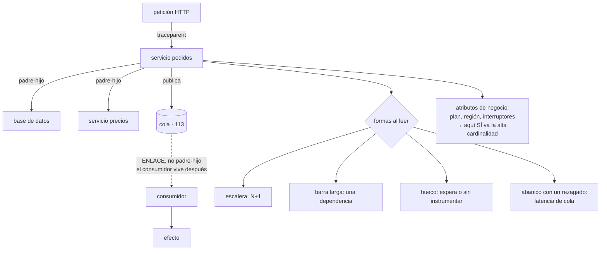

# 124 — Tracing distribuido y OpenTelemetry

> [← Clase anterior](../../part-10-observability-sre-reliability/123-metricas-cardinalidad-y-modelos-red-y-use/README.md) · [Índice de la parte](../README.md) · [Clase siguiente →](../../part-10-observability-sre-reliability/125-dashboards-alertas-accionables-y-fatiga/README.md)

**Parte:** 10 — Observabilidad, SRE y confiabilidad<br>
**Nivel:** avanzado · **Horas estimadas:** 4<br>
**Laboratorio:** `observability` · **Estado:** `EXECUTABLE_CORE`

## 🎯 Propósito

Seguir una petición por los quince servicios que la atienden y saber en cuál se fue el tiempo. La clase enseña lo que ninguna métrica puede dar —la forma del grafo de llamadas de un caso concreto— y se centra en las dos cosas que deciden si sirve: **propagar el contexto por los sitios donde siempre se rompe**, que son los asíncronos, y **saber leer las cuatro formas** que adopta una traza cuando algo va mal. Y sitúa el sitio correcto para las dimensiones de mucha cardinalidad que la clase 123 prohibió en las métricas.

## 📚 Resultados de aprendizaje

Al finalizar podrás:

1. **Describir** una traza como árbol de tramos, con padres y enlaces.
2. **Propagar** el contexto en HTTP, en colas y en trabajos programados.
3. **Diagnosticar** leyendo la forma de la traza, no solo su duración.
4. **Añadir** atributos de negocio que conviertan la traza en respuesta a preguntas.
5. **Decidir** el muestreo de forma coherente entre todos los servicios.

## 🧩 Conceptos centrales

| Concepto | Comprensión verificable |
|---|---|
| `tramo` | Operación con inicio, duración, estado y atributos. Es la unidad de una traza. |
| `traza` | Árbol de tramos que comparten un identificador. Describe el recorrido completo de una unidad de trabajo. |
| `propagación de contexto` | Llevar el identificador de traza y la decisión de muestreo de un proceso al siguiente. Sin ella, la traza se parte. |
| `enlace` | Relación entre tramos que no es de padre a hijo. Es lo que corresponde al cruzar una cola, donde el consumidor puede vivir mucho después. |
| `hueco` | Tiempo dentro de un tramo que ningún tramo hijo explica. Casi siempre es espera en cola, contención o algo sin instrumentar. |
| `muestreo coherente` | Que todos los servicios tomen la misma decisión sobre la misma traza. Si no, quedan trazas incompletas que engañan. |

## 🧠 Modelo mental

La confiabilidad es una característica del servicio percibido por usuarios; SRE la administra con objetivos explícitos y presupuestos de error.

Aplicado a esta clase, separa siempre cuatro planos: **intención** (qué necesita el usuario),
**configuración** (qué declaramos), **estado observado** (qué existe de verdad) y
**evidencia** (cómo sabemos que cumple). Confundirlos produce diseños que se ven correctos
en un diagrama pero fallan al operar.

## 🗺️ Flujo de razonamiento



## 📖 Desarrollo

### 1. Qué es y qué añade

Una traza es un árbol. Cada nodo es un tramo con lo mismo:

```text
identificador de traza      común a todo el árbol
identificador del tramo     propio
identificador del padre     de quién cuelga
nombre                      la operación: GET /checkout, SELECT pedidos
inicio y duración
estado                      correcto o error, con causa
atributos                   todo lo que ayude a filtrar
```

Y lo que aporta frente a las otras señales:

```text
la métrica dice   «el percentil 99 subió a 3,9 s»
la traza dice     «en esta petición, 3,4 s se fueron en 340 llamadas
                   a la base, todas iguales»
```

La segunda es accionable y la primera no. Y hay tres cosas que solo la traza da:

```text
la FORMA del grafo de llamadas
  → aparecen dependencias que nadie sabía que existían
dónde se fue el tiempo dentro de una petición
cómo se comporta la cola de la distribución
  → la petición lenta concreta, no el agregado
```

Y lo que **no** da:

```text
frecuencia, si está muestreada       → eso lo dan las métricas
lo que no se instrumentó             → aparece como hueco
tendencias largas                    → la retención de trazas es corta
```

Y una decisión que enlaza con la clase 123: **los atributos de un tramo pueden tener cardinalidad alta sin arruinar nada**. El identificador de cliente, de pedido, de sesión, la ruta concreta, el mensaje de error: aquí sí.

```text
métrica      dimensiones pocas y acotadas       clase 123
traza        dimensiones muchas y libres        esta clase
línea ancha  igual que la traza                 clase 122
```

Y los atributos que más valen no son los técnicos, sino los de negocio:

```text
plan del cliente, país, canal, tipo de pago
versión de la aplicación cliente
estado de los interruptores evaluados            clase 105
número de artículos, importe, si venía de campaña
```

Eso convierte la traza en algo que responde preguntas de producto: **«¿la lentitud afecta solo a los pedidos con más de veinte líneas?»**

### 2. Propagar el contexto, que es donde se rompe

La traza se mantiene porque cada llamada lleva el contexto. En HTTP es una cabecera estándar:

```text
traceparent: 00-a91c4e2b…-b7f2c1…-01
             │  │           │        └ decisión de muestreo
             │  │           └ tramo padre
             │  └ identificador de traza
             └ versión
```

Y hay tres sitios donde se rompe siempre, los tres ya nombrados en la clase 121 y aquí con su mecanismo:

```text
1. AL ENCOLAR
   el contexto vive en la petición y el mensaje viaja solo
   → el contexto se pone en los ATRIBUTOS del mensaje, no en memoria
   → y en el consumidor se restaura al leerlo

2. EN EJECUCIÓN ASÍNCRONA DENTRO DEL PROCESO
   grupos de hilos, tareas planificadas, devoluciones de llamada
   → el contexto se guarda en almacenamiento local del hilo
   → y al saltar de hilo hay que trasladarlo explícitamente

3. EN TRABAJOS PROGRAMADOS
   no hay petición de origen
   → hay que CREAR una traza nueva, con un atributo que diga
     que es programado, y no dejarlos sin traza
```

Y una decisión de modelado en el primer caso que se equivoca a menudo:

```text
mal   el tramo del consumidor cuelga como HIJO del productor
      → el padre ya terminó hace 40 minutos
      → la traza dice que la petición duró 40 minutos, y es falso

bien  el tramo del consumidor es raíz de su propia traza,
      con un ENLACE al tramo que publicó
      → y se puede navegar de uno a otro
```

Y con eso hay dos duraciones distintas, y las dos importan:

```text
lo que esperó el usuario           la traza síncrona: 140 ms
el proceso completo hasta el efecto  del enlace: 2,6 s
```

Y **el hueco**, que es la señal más informativa de una traza:

```text
tramo padre: 900 ms
tramos hijos: 40 ms + 30 ms
hueco: 830 ms sin explicar
```

Las causas, por frecuencia:

```text
espera en cola antes de que un hilo atendiera la petición
contención por un bloqueo
pausa de recolección de memoria
código sin instrumentar: serialización, cifrado, cálculo
tiempo de red no atribuido
```

El primero es el más frecuente y el que más se confunde con «el servicio es lento»: **el servicio no tardó; la petición estuvo esperando a entrar**. Se distingue instrumentando la espera en cola como tramo propio.

### 3. Leer una traza: cuatro formas

Diagnosticar con trazas es reconocer formas. Estas cuatro cubren la mayoría de los casos:

```text
1. ESCALERA — muchos tramos iguales y seguidos
   ├ SELECT producto  4 ms
   ├ SELECT producto  4 ms
   ├ SELECT producto  4 ms   … ×340
   diagnóstico   una consulta por elemento de una lista
   corrección    traer todo de una vez, o precargar
   nota          cada llamada es rápida; el problema es el número,
                 y por eso ninguna métrica de latencia de consulta
                 lo detecta

2. BARRA LARGA — un tramo consume casi todo
   diagnóstico   una dependencia lenta; mirar SU traza
   corrección    ahí, no aquí
   nota          si la barra no tiene hijos, o no está instrumentada
                 o es tiempo real de cálculo

3. HUECO — el padre dura mucho más que la suma de sus hijos
   diagnóstico   espera, contención o código sin instrumentar
   corrección    instrumentar la espera antes de suponer nada

4. ABANICO CON REZAGADO — diez llamadas en paralelo y una tarda
   diagnóstico   latencia de cola: se espera al más lento
   corrección    plazo por llamada, respuesta parcial, o pedir a dos
                 y quedarse con el primero               clase 130
   nota          la media de las diez es excelente y el usuario sufre
                 la peor
```

Y dos comprobaciones que conviene hacer siempre al mirar una traza:

```text
¿hay tramos que se repiten con el mismo nombre?         forma 1
¿la suma de los hijos explica al padre?                 forma 3
¿hay tramos en paralelo con duraciones muy distintas?   forma 4
¿hay errores marcados en tramos que no fallaron
  la petición?                                          reintentos ocultos
```

La última descubre reintentos que funcionan y que están costando latencia sin que nadie los cuente.

**Instrumentación automática y manual**, y qué aporta cada una:

```text
AUTOMÁTICA   marcos web, clientes HTTP, controladores de base,
             clientes de cola
             → da el esqueleto por casi nada de trabajo
             → y no sabe nada de tu negocio

MANUAL       tramos para operaciones propias que valga la pena medir
             y ATRIBUTOS de negocio en el tramo raíz
             → es lo que convierte la traza en respuesta a preguntas
```

Y una recomendación de dosis: **pocos tramos manuales y muchos atributos**. Un árbol con doscientos tramos por petición es difícil de leer y caro; el mismo árbol con veinte tramos y treinta atributos responde más.

### 4. Muestreo coherente, recolector y coste

**El muestreo tiene que ser coherente**: si el servicio A decide conservar la traza y el B no, queda un árbol con ramas cortadas que induce a conclusiones falsas.

```text
la decisión se toma UNA vez y viaja en el contexto
→ es el último bit de la cabecera estándar
→ y todos los servicios la respetan
```

Y las dos estrategias, con lo que la clase 121 ya estableció:

```text
EN LA CABEZA   decide el primero; barato; descarta errores por azar
EN LA COLA     decide al terminar, viendo el resultado completo
               → conserva el 100 % de errores y lentos
               → exige retener las trazas hasta decidir
```

Y un detalle del muestreo en la cola que hay que resolver: **hay que reunir todos los tramos de una traza antes de decidir**, y llegan de servicios distintos en momentos distintos. Eso lo hace un componente intermedio, no la aplicación.

**El recolector**, que es ese componente y hace más cosas de las que parece:

```text
recibe de todos los servicios en un formato común
aplica el muestreo en la cola
depura atributos sensibles antes de enviar        clase 122
añade atributos comunes: entorno, región, versión
reparte a varios destinos a la vez
amortigua picos y reintenta
```

Y las dos ventajas que más se notan:

```text
cambiar de proveedor no toca el código de los servicios
y la depuración de datos sensibles ocurre en UN sitio, no en quince
```

Y una advertencia: **el recolector es una dependencia más**. Si se cae, la aplicación no debe caerse; emisión asíncrona, memoria acotada y descarte, como en la clase 122.

**El coste**, que se comporta distinto que en métricas:

```text
lo caro     el número de tramos y su retención
lo barato   los atributos, comparados con las etiquetas de métrica

palancas
  muestrear, con las excepciones de siempre
  reducir tramos por petición: no instrumentar lo trivial
  retención corta: 7-15 días suele bastar
  y guardar en el lago lo que haga falta conservar más
```

Y un uso de las trazas que se aprovecha poco: **medir el grafo de dependencias real**. Agregando trazas se obtiene quién llama a quién y con qué frecuencia, que suele contradecir el diagrama de arquitectura.

Y la lista de comprobación de la clase:

```text
☐ el contexto se propaga en HTTP, en colas y entre hilos
☐ los trabajos programados crean su propia traza
☐ el cruce de una cola se modela como enlace, no como padre-hijo
☐ la espera en cola de entrada está instrumentada como tramo
☐ hay atributos de negocio en el tramo raíz
☐ los identificadores de alta cardinalidad van aquí, no en métricas
☐ la decisión de muestreo se toma una vez y la respetan todos
☐ el muestreo conserva errores y lentos
☐ hay recolector, y la depuración de datos sensibles ocurre en él
☐ la aplicación no se cae si el recolector no responde
☐ se revisa el grafo de dependencias real frente al que se cree tener
```

Y el cierre que enlaza con la clase siguiente: con las cuatro señales instrumentadas y correlacionadas, queda decidir qué se mira y qué despierta a alguien. Y ahí el fallo no es medir poco, sino producir tantas señales que dejan de serlo, que es la materia de la clase 125.

## 🔬 Ejemplo trabajado

**CloudShop instrumenta trazas en los quince servicios. Lo primero que aparece no es una lentitud: es que el grafo de llamadas no se parece al diagrama de arquitectura. Después vienen cuatro diagnósticos, uno por cada forma.**

**El grafo real frente al que se creía tener.**

```text
dependencias en el diagrama de arquitectura                    23
dependencias observadas en las trazas                          41
dependencias que nadie sabía que existían                      18
de ellas, servicio de catálogo → servicio de pagos              sí
  motivo   una comprobación de fraude añadida hacía 8 meses
  efecto   el catálogo dejaba de responder si pagos estaba mal
```

Dieciocho dependencias no documentadas, y una de ellas explicaba por qué **una caída del servicio de pagos tumbaba también el catálogo**, algo que llevaba meses sin explicación.

**Forma 1: la escalera de 340 peldaños.**

```text
GET /pedidos/{id}/detalle                          3.410 ms
  ├ SELECT pedido                                      6 ms
  ├ SELECT linea (×340)                            3.380 ms
  └ render                                            24 ms
```

Trescientas cuarenta consultas de 9,9 ms de media. **Ninguna métrica lo detectaba**: la latencia de cada consulta era excelente y la del endpoint se diluía en el agregado porque solo afectaba a pedidos grandes.

```text                                    antes         después
consultas por petición, mediana              8              4
consultas por petición, p99                340              5
latencia p99 del endpoint               3.410 ms         112 ms
endpoints con el mismo patrón,
encontrados al buscar la forma               —             6
```

Seis endpoints más con la misma escalera, encontrados **buscando la forma** en vez de esperar a que alguien se quejara.

**Forma 3: el hueco de 830 ms.**

```text
POST /checkout                                       960 ms
  ├ validar                                            8 ms
  ├ SELECT cliente                                    11 ms
  ├ llamada a precios                                 41 ms
  └ … suma de hijos: 60 ms
hueco sin explicar                                   900 ms
```

La primera hipótesis fue recolección de memoria. La instrumentación de la espera en cola de entrada dio la respuesta:

```text
tiempo esperando un hilo libre                       880 ms
tiempo de proceso real                                80 ms
hilos configurados                                       16
concurrencia entrante en el pico                        140
```

**El servicio no era lento: estaba lleno.** Y la corrección no fue optimizar código:

```text                                    antes         después
hilos                                        16             64
espera en cola, p99                        880 ms          12 ms
latencia p99 del endpoint                  960 ms         104 ms
uso de procesador                            21 %           68 %
```

Y se instrumentó la espera en cola como tramo propio en los quince servicios: **apareció en otros cuatro**.

**Forma 4: el abanico con rezagado.**

```text
GET /inicio                                          1.240 ms
  ├ recomendaciones     ██                              78 ms
  ├ promociones         █                               41 ms
  ├ catálogo            ██                              96 ms
  ├ valoraciones        ████████████████████         1.190 ms   ← rezagado
  └ carrito             █                              33 ms
```

Cinco llamadas en paralelo, media 288 ms, y el usuario espera 1.190 ms.

```text                                    antes         después
plazo para valoraciones                  sin plazo        150 ms
qué pasa al vencer                          —        se sirve sin valoraciones
latencia p99 de la portada               1.240 ms        180 ms
peticiones servidas sin valoraciones         —            4,1 %
quejas por falta de valoraciones             —             0
```

La penúltima fila es el coste asumido conscientemente, y la última dice que valió la pena. Es la respuesta parcial que la clase 130 desarrollará.

**Forma 2, y los reintentos ocultos.**

Al buscar tramos con error dentro de peticiones que terminaron bien:

```text
peticiones correctas que contenían al menos un tramo fallido    11 %
latencia media de esas peticiones                             840 ms
latencia media del resto                                      190 ms
causa      reintentos automáticos contra un servicio con el 4 %
           de errores intermitentes
```

Once por ciento de las peticiones pagaban un reintento, y **ninguna métrica de errores lo mostraba**, porque el resultado final era correcto. Corregido el servicio intermitente, la latencia media global bajó un 18 %.

**La propagación, que faltaba en dos de los tres sitios.**

```text                                          antes         después
HTTP                                     propagado       propagado
colas                                    NO propagado    en atributos
                                                         del mensaje
trabajos programados                     sin traza       traza propia
hilos de fondo                           se perdía       trasladado

trazas completas de extremo a extremo       31 %            96 %
trazas que terminaban en el productor       69 %             0 %
```

Y la corrección del modelado: el consumidor pasó a ser raíz con enlace, en vez de hijo.

```text
antes    la traza decía que /checkout duraba 2,6 s
         → porque incluía el consumo asíncrono
después  /checkout dura 140 ms, y un enlace lleva al proceso de 2,6 s
```

**El recolector, y el cambio de proveedor.**

```text                                          antes         después
destinos de telemetría                      1 (directo)     2 (por recolector)
depuración de datos sensibles           en 15 servicios     en 1 sitio
cambio de proveedor de trazas          tocar 15 servicios   cambiar 6 líneas
                                                            del recolector
tiempo del cambio de proveedor, real         —              1 tarde
muestreo                              1 de 100 en cabeza    en cola
```

**A los cinco meses.**

```text                                          antes         después
dependencias conocidas                       23             41
trazas completas de extremo a extremo        31 %           96 %
endpoints con consulta por elemento           7              0
servicios con espera en cola instrumentada    0             15
latencia p99 de la portada               1.240 ms         180 ms
latencia p99 del detalle de pedido       3.410 ms         112 ms
peticiones con reintentos ocultos            11 %          0,4 %
tiempo medio de diagnóstico de una
lentitud                                   2 h 20          9 min
coste mensual de trazas                       —            190 €
```

**La lección que esta clase traslada a la parte 10**: las cuatro correcciones —agrupar consultas, subir hilos, poner un plazo y arreglar un servicio intermitente— **no las habría encontrado ninguna métrica**, porque en los cuatro casos las métricas de cada componente estaban bien. El problema estaba en la relación entre ellos, y eso solo se ve mirando un caso completo. Y el hallazgo con más consecuencias no fue de rendimiento: fue descubrir que el sistema tenía **dieciocho dependencias que no estaban en ningún diagrama**.

## 🧪 Laboratorio guiado

Ejecuta desde la raíz:

```bash
python classes/part-10-observability-sre-reliability/124-tracing-distribuido-y-opentelemetry/lab.py
```

El laboratorio selecciona el motor de práctica **`observability`** y produce
`lab_result.json`. El escenario, sus comprobaciones y el artefacto esperado corresponden a
esta clase; no requiere credenciales y deja explícito qué debe revalidarse en un sandbox real.

1. Lee `exercise.steps` y formula una predicción antes de ejecutar.
2. Ejecuta la práctica y verifica todos los elementos de `checks`.
3. Provoca el caso de `negative_test` y explica la señal observada.
4. Materializa `traza-distribuida` en `evidence/` usando la plantilla indicada.
5. Para proveedor real, sigue `sandbox.requires`, registra costo y ejecuta `destroy`.

### Evidencia esperada

El artefacto principal es telemetría correlacionada con una pregunta operativa. Además, la entrega debe incluir el comando ejecutado,
la salida estructurada y una conclusión que no exceda lo observado.

## 🏆 Reto verificable

Construye **`traza-distribuida`** para el caso CloudShop. Incluye una alternativa descartada,
un supuesto que pueda falsarse, una prueba de fallo y una decisión de rollback.

## ✅ Criterio de aceptación

- [ ] `lab.py` termina con código 0 y genera JSON válido.
- [ ] La entrega conecta al menos tres requisitos con mecanismos verificables.
- [ ] Existe una prueba positiva y una prueba negativa con evidencia.
- [ ] Seguridad, costo y operación aparecen como decisiones, no como anexos.
- [ ] Se declara una limitación y una condición que obligaría a revisar el diseño.
- [ ] Otra persona puede repetir el recorrido sin conocimiento tácito.

## ⚠️ Errores frecuentes

| Síntoma | Causa probable | Corrección |
|---|---|---|
| Las trazas terminan en el servicio que publica y no continúan | El contexto no viaja en el mensaje de la cola | Pon el contexto en los atributos del mensaje y restáuralo en el consumidor. |
| Una petición de 140 ms aparece como si durara 40 minutos | El tramo del consumidor cuelga como hijo del productor | Modela el cruce de la cola como enlace y haz del consumidor la raíz de su propia traza. |
| El tramo padre dura mucho más que la suma de sus hijos | Hay espera, contención o código sin instrumentar | Instrumenta la espera en cola de entrada como tramo propio antes de suponer cualquier otra cosa. |
| Algunas trazas están incompletas y llevan a conclusiones falsas | Cada servicio decide el muestreo por su cuenta | Toma la decisión una vez, propágala en el contexto y respétala en todos los servicios. |
| La latencia media de un abanico es buena y el usuario espera mucho | Se espera al más lento de las llamadas paralelas | Pon plazo por llamada y sirve respuesta parcial cuando venza. |
| Cambiar de proveedor de telemetría exige tocar todos los servicios | Los servicios envían directamente al destino | Envía a un recolector y deja en él el reparto, el muestreo y la depuración de datos sensibles. |

## 🛡️ Seguridad, ética y costo

Trabaja con cuentas propias o sandboxes autorizados. No publiques secretos, identificadores
reales ni datos personales. Antes de crear recursos pagos define presupuesto, etiquetas y
comando de destrucción; después verifica que no queden recursos huérfanos. Los ejemplos
locales enseñan contratos, pero no certifican cumplimiento ni disponibilidad de producción.

## ❓ Preguntas de comprobación

1. ¿Qué tres cosas da una traza que ninguna métrica puede dar?
2. ¿Cuáles son los tres sitios donde se rompe la propagación de contexto y cómo se arregla cada uno?
3. ¿Por qué el cruce de una cola se modela como enlace y no como padre-hijo?
4. ¿Qué indica un hueco en una traza y cuál es su causa más frecuente?
5. ¿Por qué la decisión de muestreo debe tomarse una vez y propagarse?

## 🔗 Referencias

- W3C (2025). *Trace Context* — cabecera estándar de propagación y bit de muestreo. <https://www.w3.org/TR/trace-context/>
- OpenTelemetry (2025). *Traces: spans, links and context propagation* — modelo de datos y enlaces. <https://opentelemetry.io/docs/concepts/signals/traces/>
- OpenTelemetry (2025). *Collector: processors and exporters* — muestreo en la cola, depuración y reparto. <https://opentelemetry.io/docs/collector/>
- Sigelman, B. y otros (2010). *Dapper, a large-scale distributed systems tracing infrastructure* — origen del modelo. <https://research.google/pubs/pub36356/>
- Dean, J. y Barroso, L. (2013). *The tail at scale* — latencia de cola y respuesta parcial en abanicos. <https://research.google/pubs/pub40801/>
- Documentación oficial vigente del servicio implementado; registra URL y fecha de consulta.

---

> [Evaluación](assessment.md) · [Contrato de clase](lesson.yaml) · [Índice de la parte](../README.md)
