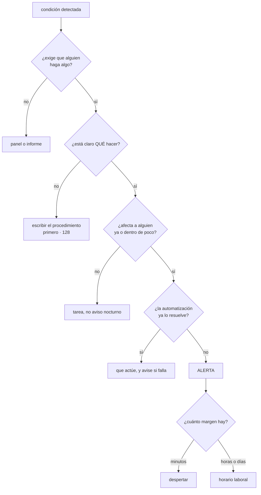

# 125 — Dashboards, alertas accionables y fatiga

> [← 124 · Tracing distribuido y OpenTelemetry](../../part-10-observability-sre-reliability/124-tracing-distribuido-y-opentelemetry/README.md) · [Índice de la parte](../README.md) · [126 · SLI, SLO, SLA y presupuesto de error →](../../part-10-observability-sre-reliability/126-sli-slo-sla-y-presupuesto-de-error/README.md)

**Parte:** 10 — Observabilidad, SRE y confiabilidad<br>
**Nivel:** avanzado · **Horas estimadas:** 4<br>
**Laboratorio:** `observability` · **Estado:** `EXECUTABLE_CORE`

## 🎯 Propósito

Decidir qué despierta a una persona y qué se mira en una pantalla, sabiendo que el fallo característico de esta materia no es medir poco sino producir tanta señal que deja de serlo. La clase da una prueba de cuatro preguntas que descarta la mayoría de las alertas existentes, defiende **alertar por síntomas y diagnosticar por causas**, mide la fatiga con cifras concretas y sostiene una idea incómoda: **el trabajo bien hecho reduce el número de alertas y mejora la detección al mismo tiempo**.

## 📚 Resultados de aprendizaje

Al finalizar podrás:

1. **Aplicar** la prueba de cuatro preguntas a cada alerta existente.
2. **Separar** lo que despierta a alguien de lo que abre una tarea o solo se mira.
3. **Alertar** por síntomas, con las excepciones justificadas.
4. **Medir** la fatiga y actuar sobre sus causas.
5. **Diseñar** paneles que respondan una pregunta cada uno.

## 🧩 Conceptos centrales

| Concepto | Comprensión verificable |
|---|---|
| `alerta accionable` | La que exige que una persona haga algo concreto que la automatización no puede hacer. Si no, no es una alerta. |
| `síntoma` | Efecto observable para quien usa el sistema: errores, lentitud, funcionalidad ausente. Es lo que debe despertar a alguien. |
| `indicador adelantado` | Causa que aún no es síntoma pero lo será con seguridad y con margen para actuar: disco llenándose, certificado que caduca, saturación. |
| `fatiga de alertas` | Estado en el que la gente deja de leer los avisos. Se mide, y aparece antes de lo que se cree. |
| `inhibición` | Suprimir alertas derivadas cuando ya se ha disparado la causa. Evita cuarenta avisos por un solo fallo. |
| `duración de condición` | Tiempo que la condición debe mantenerse antes de avisar. Es lo que separa una alerta de un parpadeo. |

## 🧠 Modelo mental

La confiabilidad es una característica del servicio percibido por usuarios; SRE la administra con objetivos explícitos y presupuestos de error.

Aplicado a esta clase, separa siempre cuatro planos: **intención** (qué necesita el usuario),
**configuración** (qué declaramos), **estado observado** (qué existe de verdad) y
**evidencia** (cómo sabemos que cumple). Confundirlos produce diseños que se ven correctos
en un diagrama pero fallan al operar.

## 🗺️ Flujo de razonamiento



## 📖 Desarrollo

### 1. La prueba de las cuatro preguntas

Antes de discutir umbrales, conviene descartar. Toda alerta tiene que superar estas cuatro:

```text
1. ¿EXIGE QUE ALGUIEN HAGA ALGO?
   si la respuesta habitual es mirarla y cerrarla, no es una alerta

2. ¿ESTÁ CLARO QUÉ HACER?
   si quien la recibe tiene que investigar desde cero qué significa,
   falta el procedimiento (clase 128), no sobra la alerta

3. ¿AFECTA A ALGUIEN, YA O CON SEGURIDAD DENTRO DE POCO?
   si no afecta a nadie, es información

4. ¿LA AUTOMATIZACIÓN NO LO RESUELVE YA?
   si el sistema se recupera solo, que se recupere
   y que avise solo cuando NO lo consiga
```

La cuarta es la que más alertas elimina en sistemas modernos: reinicios automáticos, reintentos, autoescalado y reversiones automáticas resuelven solos lo que antes exigía una persona. **Avisar de lo que ya se arregló es ruido.**

Y las tres categorías de destino, que hay que separar sin ambigüedad:

```text
DESPERTAR       hay que actuar en minutos y afecta a usuarios
                → y esto es un recurso escaso: cada uso gasta atención
TAREA           hay que actuar, y puede esperar al horario laboral
                → certificados, capacidad, deuda operativa
PANEL           no hay que actuar; sirve para investigar
```

Y el criterio que decide entre las dos primeras no es la gravedad, sino **el margen**: cuánto tiempo hay antes de que sea un problema.

```text
disco al 95 %, llenándose en 40 min      despertar
disco al 80 %, llenándose en 6 días      tarea
```

Y una consecuencia organizativa: **toda alerta tiene un dueño**, sacado del catálogo de la clase 095. Una alerta que llega a un buzón común es una alerta que nadie atiende.

### 2. Síntomas, causas y las excepciones

La regla general:

```text
ALERTAR por síntomas       lo que sufre quien usa el sistema
DIAGNOSTICAR por causas    lo que hay dentro
```

Y el motivo es doble:

```text
las causas son muchas y cambian     alertar por cada una es interminable
los síntomas son pocos y estables   errores, lentitud, funcionalidad ausente

y sobre todo:
  una causa sin síntoma no merece despertar a nadie
  un síntoma sin causa conocida SÍ, aunque no sepamos por qué
```

La última línea es la importante: **alertar por causas deja fuera todo lo que nadie anticipó**, que es exactamente lo que produjo dieciocho de los veintiún problemas de la parte 09.

Ejemplos de la traducción:

```text
causa                            síntoma equivalente
uso de procesador > 90 %      →  latencia por encima del objetivo
un pod se reinició            →  proporción de errores
la réplica va retrasada       →  lecturas incorrectas o error visible
memoria al 85 %               →  (normalmente nada: no alertar)
```

Y las excepciones legítimas, que son causas **con margen de actuación y consecuencia grave**:

```text
certificado que caduca en 14 días
disco o cuota que se llenará en horas
credencial que expira
saturación creciendo con latencia todavía normal      clase 123
copia de seguridad que no se ha ejecutado             clase 088
bucle, consumidor o trabajador parado                 ley 13
```

La última categoría merece su propio apartado en cualquier sistema: **lo que no se ejecuta no da error**, y este programa la ha visto quince veces. Su alerta no mira valores, mira **antigüedad**.

Y el otro par que hay que tener siempre, aunque no se alerte por causas:

```text
ausencia de datos                              clase 123
la propia telemetría caída
```

Porque si el sistema de vigilancia se cae, todo lo demás parece correcto.

### 3. La fatiga se mide

La fatiga no es una queja: es un estado que se puede medir y que llega antes de lo que la gente cree.

```text
alertas por turno de guardia
  0-1     sostenible
  2-4     empieza a costar leerlas
  > 5     se leen por encima; y las importantes se pierden entre las demás

proporción de alertas que exigieron una acción
  < 50 %  el conjunto está mal calibrado

proporción que se resolvió sola antes de que nadie mirara
  > 20 %  falta duración de condición o sobra la alerta

alertas repetidas: las 5 que más se disparan
  suelen ser el 60-80 % del volumen
```

La última es la palanca: **arreglar cinco alertas suele arreglar la mayor parte del problema**.

Y las cuatro correcciones, en orden de eficacia:

```text
1. BORRAR lo que no supera la prueba de cuatro preguntas
2. AGRUPAR e INHIBIR
   cuarenta pods caídos por un nodo → una alerta del nodo
   una dependencia caída → suprimir las de quienes dependen de ella
3. AÑADIR DURACIÓN
   «errores > 5 % durante 5 minutos», no «errores > 5 % ahora»
   → elimina casi todo lo que se resuelve solo
4. ARREGLAR LA CAUSA
   la alerta que se dispara cada noche a las 3 no necesita otro umbral:
   necesita que alguien mire qué pasa a las 3
```

Y dos ajustes técnicos que evitan el parpadeo:

```text
histéresis           avisar al 90 % y resolver al 80 %, no al 89,9 %
ventana de silencio  no repetir la misma alerta cada minuto
```

Y dos mecanismos organizativos que mantienen el conjunto sano en el tiempo:

```text
REVISIÓN DE LO DISPARADO
  cada alerta que sonó se clasifica: real, ruido, duplicada
  semanal, en diez minutos

LA PREGUNTA DE CADA INCIDENTE
  «¿qué alerta debería haber sonado y no sonó?»
  → es la que hace crecer el conjunto por el lado correcto
```

Las dos juntas son lo que permite que el número **baje** mientras la detección **mejora**: se quita lo que no sirve y se añade solo lo que un incidente real ha demostrado que falta.

Y una advertencia sobre las ventanas de mantenimiento: silenciar durante un despliegue es razonable, y **silenciar sin fecha de fin es cómo mueren las alertas**. Todo silencio caduca.

### 4. Paneles que responden una pregunta

El panel de sesenta gráficos no lo lee nadie. Y el motivo es el mismo de siempre: **no responde ninguna pregunta concreta**.

La taxonomía que funciona son tres tipos, con propósitos distintos:

```text
1. ¿ESTÁ FUNCIONANDO?   uno por servicio, seis paneles como mucho
   peticiones, errores, latencia (percentiles), saturación,
   estado frente al objetivo (clase 126) y línea de cambios (clase 121)
   → se mira en treinta segundos y se contesta sí o no

2. ¿POR QUÉ NO FUNCIONA?  uno por subsistema, con detalle
   dependencias, colas, agrupadores, recursos
   → se abre cuando el primero dice que no

3. PARA UN INCIDENTE CONCRETO   se crea durante y se conserva
   → y si se vuelve a usar tres veces, se convierte en uno de tipo 2
```

Y las reglas de construcción que más mejoran un panel:

```text
el objetivo dibujado como línea, para saber si el valor es bueno
los cambios superpuestos: despliegues e interruptores
escalas comparables entre gráficos que se leen juntos
nada de medias donde importe la cola: percentiles
el enlace al procedimiento correspondiente
```

La primera es la que convierte un gráfico en información: **un valor de 240 ms no dice nada sin saber si el objetivo es 100 o 500**.

Y el antipatrón de la pantalla permanente en la pared: **se convierte en decoración en dos semanas**. Si algo tiene que llamar la atención, es una alerta; si no, no hace falta que esté siempre visible.

Y una comprobación anual muy reveladora, la misma lógica que la clase 121 aplicó a las métricas:

```text
¿qué paneles no ha abierto nadie en 90 días?
→ borrarlos; están compitiendo por la atención con los que sirven
```

Y la lista de comprobación de la clase:

```text
☐ toda alerta supera las cuatro preguntas
☐ toda alerta tiene dueño en el catálogo
☐ se alerta por síntomas; las causas alertadas están justificadas por margen
☐ hay alertas de antigüedad para lo que puede dejar de ejecutarse
☐ hay alertas de ausencia de datos y de la propia telemetría
☐ las alertas tienen duración de condición e histéresis
☐ hay inhibición de alertas derivadas
☐ todo silencio tiene fecha de fin
☐ se miden alertas por turno y proporción accionable
☐ se revisa semanalmente lo disparado y se clasifica
☐ cada incidente pregunta qué alerta faltaba
☐ cada servicio tiene un panel de seis gráficos que responde sí o no
☐ los paneles llevan el objetivo dibujado y los cambios superpuestos
```

Y el cierre que enlaza con la clase siguiente: la línea del objetivo que estos paneles necesitan no está definida en ninguna parte todavía. Decidir qué significa que el sistema funciona, con un número, y qué margen hay para fallar es la materia de la clase 126.

## 🔬 Ejemplo trabajado

**CloudShop tiene 340 alertas configuradas y una guardia que nadie quiere hacer. El ejercicio dura un trimestre y su resultado contradice la intuición: al final hay muchas menos alertas y se detectan muchas más cosas.**

**Punto de partida.**

```text
alertas configuradas                                     340
alertas disparadas por semana                            410
alertas por turno de guardia (12 h)                       29
proporción que exigió alguna acción                      11 %
proporción que se resolvió sola antes de mirarla         57 %
silenciadas indefinidamente                               46
incidentes detectados por un cliente antes que por
  una alerta                                        9 de 14
```

Veintinueve avisos por turno y once por ciento accionables. **La guardia consistía en cerrar avisos.**

**Paso 1: las cinco que más suenan.**

```text                                            disparos/semana   acciones
uso de procesador > 80 %                              141              0
un pod se reinició                                     88              2
latencia de una consulta > 100 ms                      52              0
memoria > 85 %                                         37              0
reintento contra el proveedor de pago                  31              1
                                                    ─────
                                                      349  = 85 % del total
```

Cinco alertas producían el 85 % del volumen y tres acciones al mes. Las cuatro primeras eran causas sin síntoma y se borraron; la quinta se convirtió en un panel.

```text                                          antes         después
alertas disparadas por semana                  410             61
```

**Paso 2: la prueba de cuatro preguntas sobre las 340.**

```text
no exigían ninguna acción                              184
no estaba claro qué hacer                               41   → 12 se conservaron
                                                              escribiendo el
                                                              procedimiento;
                                                              29 se borraron
no afectaban a nadie                                    52
la automatización ya lo resolvía                        38
  reinicios, reintentos, autoescalado, reversión automática
superaron las cuatro                                    25
```

```text                                          antes         después
alertas configuradas                           340             37
  (25 supervivientes + 12 con procedimiento nuevo)
```

**Paso 3: síntomas que faltaban.**

Y aquí el conjunto **creció**, con la pregunta de cada incidente aplicada a los veintiún problemas de la parte 09 y a los catorce incidentes del semestre:

```text
alertas nuevas, por síntoma                              9
  proporción de errores de cada servicio de cara al cliente
  latencia por encima del objetivo
  pedidos que no avanzan de estado en 30 min          clase 115
  emitido frente a procesado en cada frontera         clase 121

alertas nuevas, por antigüedad (ley 13)                  7
  consumidor sin avanzar
  publicador de la tabla de salida parado             clase 116
  bucle de reconciliación sin sincronizar             clase 103
  cola de tareas del motor sin trabajadores           clase 119
  copia de seguridad no ejecutada
  cola de fallidos con algo dentro                    clase 113
  instantáneas del lago sin caducar                   clase 112

alertas nuevas, indicadores adelantados                  5
  saturación de agrupadores y colas                   clase 123
  certificados y credenciales por caducar
  cuota o disco con proyección de llenado

alertas de ausencia                                     15
```

```text                                          antes         después
alertas configuradas                           340             73
  de las cuales, existían antes                 340             25
  nuevas                                          —             48
```

**Setenta y tres alertas, de las que casi dos tercios son nuevas.** El conjunto no se recortó: se sustituyó.

**Paso 4: agrupación, inhibición y duración.**

```text                                          antes         después
disparos por semana                             61             19
qué cambió
  duración de condición en 31 alertas         instantáneo    3-5 min
  inhibición por dependencia caída            no              sí
  agrupación por nodo y por servicio          no              sí
  histéresis                                  no              sí
```

Y el efecto de la inhibición en un incidente real:

```text
caída de una zona de disponibilidad
  avisos que se habrían enviado sin inhibición                88
  avisos enviados                                              1
```

**Los silencios indefinidos.**

```text
silencios activos                                           46
de ellos, sin fecha de fin                                  46
el más antiguo                                        19 meses
alertas que estaban silenciadas y eran de las buenas          4
```

Cuatro alertas útiles llevaban meses silenciadas y nadie lo sabía. Desde entonces **todo silencio caduca a los 7 días como máximo**, y renovarlo exige justificarlo.

**Los paneles.**

```text                                          antes         después
paneles                                        118             34
abiertos alguna vez en 90 días                  29             34
gráficos en el panel principal de un servicio   41              6
con el objetivo dibujado                       0 %           100 %
con los cambios superpuestos                   0 %           100 %
pantallas permanentes en la pared                3              0
```

**El resultado al cabo del trimestre.**

```text                                          antes         después
alertas configuradas                           340             73
disparadas por semana                          410             19
por turno de guardia                            29            1,4
proporción accionable                          11 %           78 %
proporción resuelta sola antes de mirarla      57 %            6 %
silencios sin fecha                             46              0
incidentes detectados por un cliente
  antes que por una alerta                   9 de 14         1 de 11
incidentes detectados por una alerta         5 de 14        10 de 11
tiempo medio hasta detección                  41 min        3 min 20
```

Y el dato que se recoge para la calificación de la parte:

```text
la clase 120 predijo que el trabajo de la parte 10
REDUCIRÍA el número de alertas
→ de 340 a 73 configuradas, y de 410 a 19 disparos semanales
y predijo que la mejora vendría más de síntomas que de causas
→ 10 de las 11 detecciones fueron por alertas de síntoma o de antigüedad;
  1 por indicador adelantado
```

**La lección que esta clase traslada a la parte 10**: el número bajó de 340 a 73 y la detección subió de 5 de 14 a 10 de 11, y **son la misma cosa**. Con veintinueve avisos por turno, las cinco que importaban estaban enterradas. Y lo que más aportó no fue borrar —aunque hubo que borrar 315—, sino **añadir cuarenta y ocho alertas nuevas que nadie había escrito**, casi todas de dos tipos: síntomas visibles para el usuario y cosas que habían dejado de ejecutarse sin dar error.

## 🧪 Laboratorio guiado

Ejecuta desde la raíz:

```bash
python classes/part-10-observability-sre-reliability/125-dashboards-alertas-accionables-y-fatiga/lab.py
```

El laboratorio selecciona el motor de práctica **`observability`** y produce
`lab_result.json`. El escenario, sus comprobaciones y el artefacto esperado corresponden a
esta clase; no requiere credenciales y deja explícito qué debe revalidarse en un sandbox real.

1. Lee `exercise.steps` y formula una predicción antes de ejecutar.
2. Ejecuta la práctica y verifica todos los elementos de `checks`.
3. Provoca el caso de `negative_test` y explica la señal observada.
4. Materializa `tablero-operativo` en `evidence/` usando la plantilla indicada.
5. Para proveedor real, sigue `sandbox.requires`, registra costo y ejecuta `destroy`.

### Evidencia esperada

El artefacto principal es telemetría correlacionada con una pregunta operativa. Además, la entrega debe incluir el comando ejecutado,
la salida estructurada y una conclusión que no exceda lo observado.

## 🏆 Reto verificable

Construye **`tablero-operativo`** para el caso CloudShop. Incluye una alternativa descartada,
un supuesto que pueda falsarse, una prueba de fallo y una decisión de rollback.

## ✅ Criterio de aceptación

- [ ] `lab.py` termina con código 0 y genera JSON válido.
- [ ] La entrega conecta al menos tres requisitos con mecanismos verificables.
- [ ] Existe una prueba positiva y una prueba negativa con evidencia.
- [ ] Seguridad, costo y operación aparecen como decisiones, no como anexos.
- [ ] Se declara una limitación y una condición que obligaría a revisar el diseño.
- [ ] Otra persona puede repetir el recorrido sin conocimiento tácito.

## ⚠️ Errores frecuentes

| Síntoma | Causa probable | Corrección |
|---|---|---|
| La guardia consiste en cerrar avisos sin hacer nada | Las alertas no superan la prueba de las cuatro preguntas | Borra lo que no exige acción, no afecta a nadie o ya lo resuelve la automatización; conserva lo que falta procedimiento escribiéndolo. |
| Un solo fallo genera decenas de avisos | No hay agrupación ni inhibición de alertas derivadas | Agrupa por nodo y servicio y suprime las de quienes dependen de algo que ya está alertado. |
| Muchas alertas se resuelven solas antes de que nadie mire | Se alerta sobre el valor instantáneo, sin duración de condición | Exige que la condición se mantenga varios minutos y añade histéresis para evitar parpadeos. |
| Alertas útiles llevan meses silenciadas y nadie lo sabe | Los silencios no caducan | Pon fecha de fin obligatoria y corta; renovar exige justificarlo. |
| Solo se detecta lo que alguien anticipó | Se alerta por causas técnicas y no por síntomas visibles | Alerta por errores, latencia y funcionalidad ausente; deja las causas para diagnosticar y para indicadores con margen. |
| Nadie mira los paneles | Tienen decenas de gráficos y no responden ninguna pregunta concreta | Un panel por servicio con seis gráficos que contesten si funciona, con el objetivo dibujado y los cambios superpuestos. |

## 🛡️ Seguridad, ética y costo

Trabaja con cuentas propias o sandboxes autorizados. No publiques secretos, identificadores
reales ni datos personales. Antes de crear recursos pagos define presupuesto, etiquetas y
comando de destrucción; después verifica que no queden recursos huérfanos. Los ejemplos
locales enseñan contratos, pero no certifican cumplimiento ni disponibilidad de producción.

## ❓ Preguntas de comprobación

1. ¿Cuáles son las cuatro preguntas que debe superar una alerta?
2. ¿Por qué se alerta por síntomas y no por causas, y qué causas son excepción?
3. ¿Con qué cifras se mide la fatiga y a partir de cuántas alertas por turno aparece?
4. ¿Por qué todo silencio debe tener fecha de fin?
5. ¿Qué debe contener un panel que responda si un servicio está funcionando?

## 🔗 Referencias

- Google SRE (2025). *Practical alerting and symptom-based paging* — alertar por síntomas y evitar el ruido. <https://sre.google/sre-book/practical-alerting/>
- Google SRE (2025). *Being on-call* — carga sostenible de guardia y sus umbrales. <https://sre.google/sre-book/being-on-call/>
- Prometheus (2025). *Alerting rules and Alertmanager: grouping, inhibition, silences* — agrupación y supresión. <https://prometheus.io/docs/alerting/latest/alertmanager/>
- Rob Ewaschuk (2025). *My philosophy on alerting* — reglas prácticas para decidir qué merece despertar a alguien. <https://docs.google.com/document/d/199PqyG3UsyXlwieHaqbGiWVa8eMWi8zzAn0YfcApr8Q/preview>
- Grafana (2025). *Dashboard design best practices* — un panel, una pregunta. <https://grafana.com/docs/grafana/latest/dashboards/build-dashboards/best-practices/>
- Documentación oficial vigente del servicio implementado; registra URL y fecha de consulta.

---

> [Evaluación](assessment.md) · [Contrato de clase](lesson.yaml) · [Índice de la parte](../README.md)

**📥 Descargar:** [Parte 10 en PDF](../../../site/downloads/partes/manual-parte-10-observability-sre-reliability.pdf) · [Manual integral](../../../site/downloads/multi-cloud-engineering-manual-v2.0.pdf)

| Anterior | Índice | Siguiente |
|---|---|---|
| [← 124 · Tracing distribuido y OpenTelemetry](../../part-10-observability-sre-reliability/124-tracing-distribuido-y-opentelemetry/README.md) | [Parte 10](../README.md) · [Programa](../../README.md) | [126 · SLI, SLO, SLA y presupuesto de error →](../../part-10-observability-sre-reliability/126-sli-slo-sla-y-presupuesto-de-error/README.md) |
