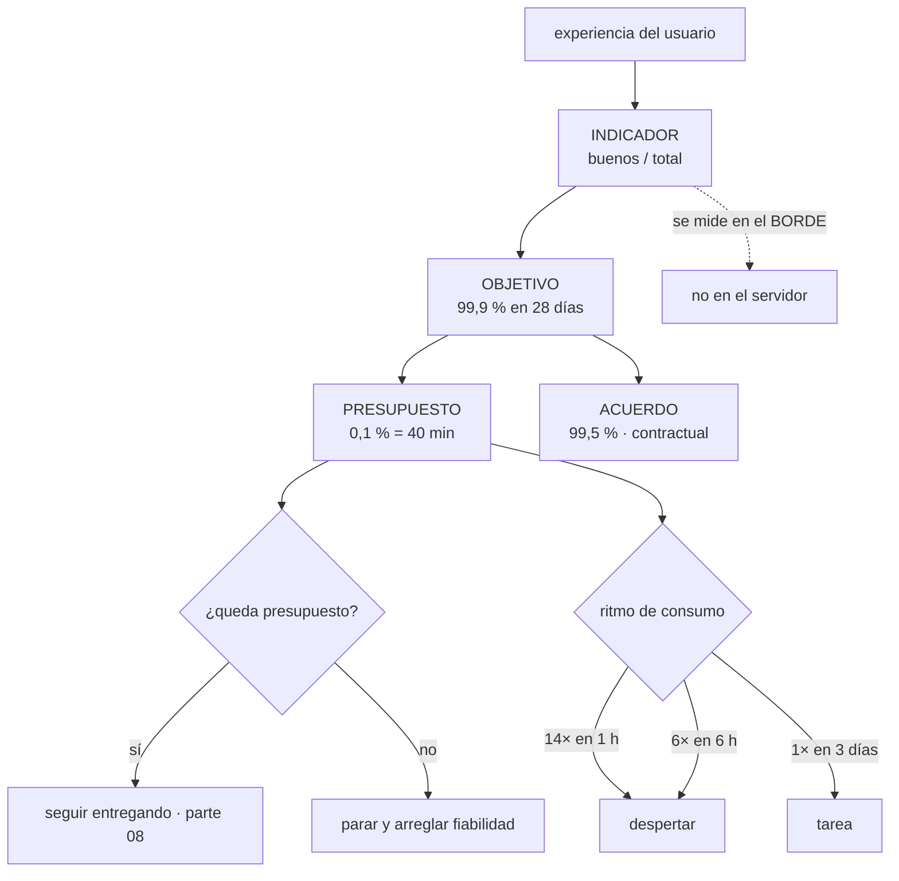

# 126 — SLI, SLO, SLA y presupuesto de error

> [← 125 · Dashboards, alertas accionables y fatiga](../../part-10-observability-sre-reliability/125-dashboards-alertas-accionables-y-fatiga/README.md) · [Índice de la parte](../README.md) · [127 · Incidentes, severidad, comando y comunicación →](../../part-10-observability-sre-reliability/127-incidentes-severidad-comando-y-comunicacion/README.md)

**Parte:** 10 — Observabilidad, SRE y confiabilidad<br>
**Nivel:** avanzado · **Horas estimadas:** 4<br>
**Laboratorio:** `sre` · **Estado:** `EXECUTABLE_CORE`

## 🎯 Propósito

Poner un número a lo que significa que el sistema funciona, y usarlo para decidir. La clase distingue las tres cosas que se confunden —lo que se mide, lo que se promete internamente y lo que se firma—, insiste en que **un objetivo de latencia se expresa como proporción y no como percentil**, y desarrolla el mecanismo que convierte todo esto en algo útil: el presupuesto de error, que sirve para dos cosas concretas —**decidir si se sigue entregando o se para a arreglar**, y sustituir un montón de alertas de umbral por unas pocas basadas en el ritmo de consumo—.

## 📚 Resultados de aprendizaje

Al finalizar podrás:

1. **Elegir** indicadores que midan lo que experimenta quien usa el sistema.
2. **Expresar** objetivos de latencia como proporción por debajo de un umbral.
3. **Calcular** el presupuesto de error y convertirlo en una regla de decisión.
4. **Alertar** por ritmo de consumo en varias ventanas, no por umbral instantáneo.
5. **Fijar** un objetivo alcanzable dadas las dependencias, y no por aspiración.

## 🧩 Conceptos centrales

| Concepto | Comprensión verificable |
|---|---|
| `indicador` | Medida de la experiencia de quien usa el sistema, expresada como proporción de eventos correctos sobre el total. |
| `objetivo` | Valor que ese indicador debe alcanzar en una ventana de tiempo. Es un compromiso interno y decide prioridades. |
| `acuerdo` | Promesa contractual con consecuencias. Siempre menos exigente que el objetivo interno, para tener margen. |
| `presupuesto de error` | Lo que queda del 100 % tras el objetivo. Es una cantidad de fallo permitida y se gasta. |
| `ritmo de consumo` | Velocidad a la que se agota el presupuesto respecto de lo previsto. Es la base de las alertas útiles sobre objetivos. |
| `ventana móvil` | Los últimos N días, actualizados continuamente. Sirve para decidir; el mes natural sirve para informar. |

## 🧠 Modelo mental

La confiabilidad es una característica del servicio percibido por usuarios; SRE la administra con objetivos explícitos y presupuestos de error.

Aplicado a esta clase, separa siempre cuatro planos: **intención** (qué necesita el usuario),
**configuración** (qué declaramos), **estado observado** (qué existe de verdad) y
**evidencia** (cómo sabemos que cumple). Confundirlos produce diseños que se ven correctos
en un diagrama pero fallan al operar.

## 🗺️ Flujo de razonamiento



## 📖 Desarrollo

### 1. Tres cosas distintas, y cómo se elige la primera

```text
INDICADOR   lo que se mide
            «proporción de peticiones correctas y por debajo de 300 ms»
OBJETIVO    lo que se promete internamente
            «99,9 % en los últimos 28 días»
ACUERDO     lo que se firma, con consecuencias
            «99,5 % mensual, o se descuenta de la factura»
```

Y la relación entre ellos no es negociable:

```text
acuerdo  <  objetivo
```

Si se firma lo mismo que se persigue internamente, cualquier desviación es un incumplimiento contractual. El margen entre los dos es lo que permite reaccionar antes.

**Elegir el indicador** es la parte difícil, y tiene tres condiciones a la vez:

```text
1. mide lo que EXPERIMENTA quien usa el sistema
2. se puede medir de verdad, con lo que hay
3. depende de nosotros lo suficiente como para actuar
```

Y la forma canónica es siempre la misma, y conviene forzarla:

```text
indicador = eventos buenos / eventos válidos
```

Y de ahí sale la corrección más importante de esta clase:

```text
mal   «latencia del percentil 99 por debajo de 300 ms»
bien  «proporción de peticiones por debajo de 300 ms ≥ 99 %»
```

Son casi lo mismo y no del todo: el segundo **se puede sumar entre instancias y entre ventanas**, se puede comparar, y encaja con el presupuesto. El primero es una métrica y arrastra los problemas de agregación de la clase 123.

Y el intervalo de histograma colocado en el objetivo, que la clase 123 anticipó, es exactamente lo que hace que esa proporción sea una división exacta.

Los tipos de indicador que cubren casi todo:

```text
DISPONIBILIDAD   peticiones sin error / peticiones válidas
LATENCIA         peticiones por debajo del umbral / total
FRESCURA         datos con antigüedad menor que X / total
                 → para lo asíncrono y los informes
CORRECCIÓN       resultados correctos / total
                 → cuando se puede comprobar; muy valioso y poco usado
COBERTURA        elementos procesados / elementos que debían procesarse
                 → es la métrica de conservación de la clase 121
```

Y dos decisiones que cambian el número por completo:

```text
DÓNDE SE MIDE     en el borde o en el cliente, no en el servidor
                  → el servidor no ve la cola de entrada ni la red
QUÉ ES «VÁLIDO»   los errores por petición mal formada del cliente
                  no cuentan como fallo nuestro; hay que escribirlo
```

Y una advertencia sobre el número de indicadores: **entre dos y cuatro por servicio de cara al usuario**. Más no se pueden gobernar, y la mayoría de los servicios internos no necesitan ninguno propio.

### 2. El presupuesto, y para qué sirve de verdad

El objetivo deja un resto, y ese resto es una cantidad concreta de fallo permitido:

```text
objetivo    presupuesto      en 28 días        en 1 día
99      %       1 %          6 h 43 min        14 min
99,5    %       0,5 %        3 h 22 min         7 min
99,9    %       0,1 %          40 min          1,4 min
99,95   %       0,05 %         20 min           43 s
99,99   %       0,01 %          4 min            9 s
```

Y la fila de abajo enseña por qué un objetivo aspiracional es un problema: **con cuatro minutos al mes, un solo despliegue fallido lo consume entero**, y ningún proceso humano reacciona en ese tiempo.

Y lo importante no es la tabla, sino **la regla de decisión** que la acompaña:

```text
queda presupuesto     → se sigue entregando funcionalidad
                        con las prácticas de la parte 08
presupuesto agotado   → se para la funcionalidad nueva y se dedica
                        el esfuerzo a fiabilidad, hasta recuperarlo
```

Eso es lo que convierte el objetivo en algo más que un informe. Y tiene una condición previa sin la cual no funciona:

```text
la regla la acepta POR ADELANTADO quien puede decidir prioridades
→ si se discute cuando el presupuesto se agota, no hay regla
```

Y dos matices honestos:

```text
el presupuesto no se «ahorra» para gastarlo de golpe
  → es un límite, no una hucha
un mes con presupuesto intacto es también una señal
  → o el objetivo es demasiado flojo, o se está siendo demasiado
    conservador entregando
```

La segunda es la menos intuitiva y la más útil: **un sistema que nunca gasta presupuesto probablemente está entregando demasiado despacio**.

Y qué gasta presupuesto y qué no:

```text
gasta     todo fallo que sufre el usuario, sea de quien sea la culpa
          incluidas las caídas del proveedor
no gasta  el mantenimiento anunciado, si el usuario lo acepta
          y las peticiones inválidas, si así se definió
```

La primera línea sorprende y es deliberada: **al usuario le da igual de quién sea la culpa**. Si una dependencia del proveedor tumba el servicio, el presupuesto se gasta, y eso es lo que obliga a diseñar para tolerarlo.

### 3. Alertar por ritmo de consumo

Este apartado sustituye buena parte de las alertas de umbral de la clase 125 por unas pocas mejores.

El problema del umbral fijo:

```text
«avisar si los errores superan el 5 %»
  → un pico del 6 % durante 30 segundos: irrelevante, y avisa
  → un 1,5 % sostenido durante dos días: gasta el presupuesto entero,
    y no avisa nunca
```

La alternativa es medir **a qué velocidad se gasta el presupuesto**:

```text
ritmo 1×    se agota justo al final de la ventana: lo previsto
ritmo 14,4× se agota en 2 días: hay que actuar ya
ritmo 0,5×  sobra presupuesto
```

Y las alertas se construyen combinando **una ventana corta y otra larga**, para tener sensibilidad sin falsos avisos:

```text
DESPERTAR   ritmo > 14,4× en 1 h  Y  > 14,4× en 5 min
            → consume el 2 % del presupuesto en una hora

DESPERTAR   ritmo > 6× en 6 h     Y  > 6× en 30 min
            → consume el 5 % en seis horas

TAREA       ritmo > 3× en 1 día   Y  > 3× en 2 h
TAREA       ritmo > 1× en 3 días  Y  > 1× en 6 h
```

La condición de la ventana corta es la que evita avisar por algo que ya terminó: **si la ventana larga está alta pero la corta ya bajó, el problema pasó**.

Y lo que se gana:

```text
cuatro alertas por servicio en vez de veinte umbrales
cubre errores, latencia y cualquier otro indicador con la misma forma
su gravedad se corresponde con el daño real al usuario
y no hay que ajustar umbrales a mano por servicio
```

**La ventana del objetivo**, que también decide:

```text
móvil de 28 días     para decidir: siempre refleja el estado actual
mes natural          para informar y para el acuerdo contractual
```

Y veintiocho en lugar de treinta por un motivo práctico: **contiene siempre el mismo número de fines de semana**, así que las comparaciones entre ventanas no se distorsionan.

Y una advertencia sobre la ventana móvil: **un incidente sale del cálculo de golpe cuando cumple 28 días**, y el indicador «mejora» sin que nadie haya hecho nada. Conviene saberlo antes de celebrarlo.

### 4. Poner el número, con las dependencias delante

El objetivo no se elige por aspiración. Los tres insumos:

```text
1. LO QUE HAY AHORA
   medir el indicador durante 4-6 semanas sin objetivo
   → si ahora es 99,2 %, poner 99,99 % no es un objetivo: es un deseo

2. LO QUE NOTA EL USUARIO
   ¿a partir de qué punto se queja, se va o llama?
   → suele haber un escalón, y ese es el sitio del objetivo

3. LO QUE PERMITEN LAS DEPENDENCIAS
```

Y la tercera se calcula, y es la que más ilusiones rompe:

```text
si una petición necesita 5 dependencias en serie, cada una al 99,9 %
disponibilidad máxima = 0,999^5 = 99,50 %

→ no se puede prometer 99,9 % sin cambiar el diseño
```

Y las formas de romper esa cadena son las que la clase 130 desarrolla:

```text
hacer la dependencia opcional: servir sin ella   clase 124
cachear su respuesta para sobrevivir a su caída  clase 111
hacerla asíncrona: encolar en vez de llamar      clase 113
redundancia: dos proveedores o dos regiones
```

Y hay una decisión de coste explícita, porque **cada nueve cuesta más que el anterior**:

```text
de 99   a 99,9    suele ser trabajo de ingeniería normal
de 99,9 a 99,99   suele exigir redundancia entre regiones y automatismos
de 99,99 en adelante   exige que nada dependa de una intervención humana
```

Y la pregunta que evita gastar de más: **¿qué pierde el negocio por cada nueve que falta?** Si nadie sabe responderla, el objetivo lo está eligiendo la moda.

**El acuerdo contractual**, que es otra cosa:

```text
se mide como lo mide el CLIENTE, no como nos conviene
lleva consecuencias: descuentos, penalizaciones
y por eso va varios puntos por debajo del objetivo interno
y debe definir con precisión qué cuenta, cómo se mide y quién arbitra
```

Y un aviso sobre qué no debe tener objetivo formal:

```text
todo servicio interno con dos consumidores
cada componente por separado
todo lo que no se traduzca en algo que alguien note
```

**Poner objetivos a todo es la ley 15 aplicada a los objetivos**: con cuarenta, ninguno decide nada.

Y la lista de comprobación de la clase:

```text
☐ cada indicador se expresa como buenos entre válidos
☐ los de latencia son proporción bajo umbral, no percentiles
☐ está escrito qué eventos son válidos y cuáles no cuentan
☐ se mide en el borde o en el cliente
☐ hay entre dos y cuatro indicadores por servicio de cara al usuario
☐ el objetivo se fijó midiendo antes, no por aspiración
☐ está calculado el máximo que permiten las dependencias
☐ el acuerdo contractual es menos exigente que el objetivo
☐ la regla de decisión al agotar el presupuesto está aceptada de antemano
☐ las alertas son de ritmo de consumo, con ventana corta y larga
☐ la ventana de decisión es móvil, y la de informe es natural
☐ el estado del presupuesto está en el panel principal del servicio
```

Y el cierre que enlaza con la clase siguiente: cuando el presupuesto se consume de golpe, hay un incidente. Cómo se declara, quién manda mientras dura, qué se comunica y qué se hace después es la materia de la clase 127.

## 🔬 Ejemplo trabajado

**CloudShop define objetivos para los cinco servicios de cara al cliente. El ejercicio tiene tres momentos: la aspiración que resultó imposible, las alertas de umbral que se sustituyeron, y el mes en que la regla del presupuesto se aplicó de verdad.**

**Momento 1: el objetivo aspiracional que las matemáticas descartaron.**

La dirección propuso 99,99 % para el flujo de compra. Antes de aceptarlo se hicieron las tres cuentas del apartado cuarto.

```text
LO QUE HAY AHORA, medido 6 semanas sin objetivo
  disponibilidad del flujo de compra                    99,21 %
  proporción por debajo de 500 ms                       97,4 %

LO QUE PERMITEN LAS DEPENDENCIAS
  identidad            99,95 %
  catálogo             99,90 %
  precios              99,90 %
  inventario           99,80 %
  pago (externo)       99,50 %
  ────────────────────────────
  producto             99,05 %   ← techo actual
```

**Noventa y nueve coma cero cinco.** El objetivo propuesto era físicamente imposible sin cambiar el diseño, y con la configuración de entonces ni siquiera se podía prometer 99,5 %.

Se rediseñaron tres dependencias con las técnicas del apartado cuarto:

```text                                    antes            después
catálogo                             llamada síncrona   caché con valor
                                                        caducado servible
precios                              llamada síncrona   caché, y precio
                                                        base si falla
pago                                 síncrono en la
                                     petición           encolado, con
                                                        confirmación posterior

techo por dependencias                 99,05 %           99,74 %
```

Y el objetivo se fijó en **99,5 %**, con el acuerdo contractual en 99,0 %.

```text
objetivo interno    99,5 %   → presupuesto: 3 h 22 min / 28 días
acuerdo firmado     99,0 %   → margen: 3 h 22 min más antes de
                                consecuencias contractuales
```

**La corrección del indicador de latencia.**

```text
primera versión    «percentil 99 por debajo de 500 ms»
problema           se calculaba promediando instancias (clase 123)
                   y no se podía combinar con el presupuesto

versión final      «proporción de peticiones por debajo de 500 ms ≥ 99 %»
                   con un intervalo de histograma exactamente en 500 ms
```

Y dónde se mide, que cambió el número:

```text                                    en el servidor    en el borde
proporción bajo 500 ms                     99,4 %            97,4 %
diferencia                       la cola de entrada y la red,
                                 que el servidor no ve
```

Dos puntos de diferencia. **El servidor decía que se cumplía el objetivo y el usuario decía que no.**

**Momento 2: las alertas de ritmo sustituyen a veinte umbrales.**

```text                                          antes         después
alertas de umbral sobre errores y latencia      20              0
alertas de ritmo de consumo                      0              4
ventanas                                        —      1 h/5 min, 6 h/30 min,
                                                       1 d/2 h, 3 d/6 h
```

Y el comportamiento comparado, con seis meses de datos:

```text                                    umbrales      ritmo de consumo
avisos por mes                              31                 6
de ellos, con daño real al usuario           7                 6
falsos avisos por picos breves              19                 0
degradaciones lentas no detectadas           5                 0
```

Las dos últimas filas son el argumento entero. Los umbrales avisaban diecinueve veces por picos irrelevantes y **se perdían cinco degradaciones lentas**:

```text
ejemplo real  1,4 % de errores sostenido durante 3 días
  umbral del 5 %          nunca se disparó
  ritmo de consumo        avisó como tarea a las 6 h
  presupuesto consumido   84 % antes de que nadie lo hubiera notado
```

**Momento 3: el mes en que se agotó el presupuesto.**

```text
día 3   despliegue con un defecto: 41 min de errores parciales
        presupuesto consumido: 38 %
día 11  caída del proveedor de pago: 1 h 12 min
        presupuesto consumido acumulado: 74 %
día 17  incidente de conexiones (clase 109): 27 min
        presupuesto consumido acumulado: 88 %
día 19  degradación por saturación: 34 min
        presupuesto consumido acumulado: 105 %
```

Y entonces se aplicó la regla, que estaba aceptada por escrito desde el principio:

```text
funcionalidad nueva                        parada 9 días
esfuerzo dedicado a fiabilidad             el del equipo entero
trabajo hecho en esos 9 días
  agrupador de conexiones y techos           clase 109
  plazos y respuesta parcial en 4 llamadas   clase 124
  caché con valor caducado servible          clase 111
  reversión automática por ritmo de consumo  clase 102
```

Y la discusión que no hubo:

```text
tiempo dedicado a discutir si parar o no                        0
motivo    la regla estaba aceptada por adelantado, con nombre
          y firma, desde la definición del objetivo
```

Y el efecto en los tres meses siguientes:

```text                                    mes del incidente   +3 meses
presupuesto consumido                        105 %              31 %
despliegues por semana                       6,4 (y luego 0)     7,1
incidentes                                    4                  1
```

Los despliegues **no bajaron** al mes siguiente: el equipo volvió a entregar más que antes, sobre un sistema que ya no gastaba el presupuesto.

**Y el mes contrario, que también enseñó algo.**

```text
mes 7   presupuesto consumido: 4 %
```

Cuatro por ciento. Según el apartado segundo, eso es también una señal, y al revisarlo:

```text
causa    dos equipos habían dejado de desplegar los viernes
         y estaban acumulando cambios «por prudencia»
efecto   lotes más grandes, y el incidente del mes 8 fue el mayor del año
decisión volver a desplegar a diario; el presupuesto está para gastarse
```

**A los seis meses.**

```text                                          antes         después
indicadores definidos                            0             11
servicios con objetivo                        0 de 5         5 de 5
objetivo del flujo de compra              aspiración 99,99 %   99,5 %
techo por dependencias                       99,05 %         99,74 %
disponibilidad real                          99,21 %         99,68 %
proporción bajo 500 ms (en el borde)          97,4 %          99,3 %
alertas de umbral sobre errores y latencia       20              0
alertas de ritmo de consumo                       0              4
avisos por mes                                   31              6
falsos avisos por picos breves                   19              0
degradaciones lentas no detectadas          5 / 6 meses          0
meses con la regla del presupuesto aplicada       —              1
discusiones sobre si aplicarla                    —              0
```

**La lección que esta clase traslada a la parte 10**: lo más valioso del ejercicio ocurrió **antes de medir nada**. Multiplicar las disponibilidades de las cinco dependencias demostró en diez minutos que el objetivo que se quería prometer era imposible, y eso convirtió la conversación de «esforzaos más» en «hay que hacer opcionales tres dependencias». Y el mecanismo que más cambió el día a día no fue el objetivo, sino su resto: **una regla de parada aceptada por adelantado eliminó por completo la discusión que suele consumir los días posteriores a un mal mes**.

## 🧪 Laboratorio guiado

Ejecuta desde la raíz:

```bash
python classes/part-10-observability-sre-reliability/126-sli-slo-sla-y-presupuesto-de-error/lab.py
```

El laboratorio selecciona el motor de práctica **`sre`** y produce
`lab_result.json`. El escenario, sus comprobaciones y el artefacto esperado corresponden a
esta clase; no requiere credenciales y deja explícito qué debe revalidarse en un sandbox real.

1. Lee `exercise.steps` y formula una predicción antes de ejecutar.
2. Ejecuta la práctica y verifica todos los elementos de `checks`.
3. Provoca el caso de `negative_test` y explica la señal observada.
4. Materializa `slo-servicio` en `evidence/` usando la plantilla indicada.
5. Para proveedor real, sigue `sandbox.requires`, registra costo y ejecuta `destroy`.

### Evidencia esperada

El artefacto principal es un SLO con presupuesto de error y política de acción. Además, la entrega debe incluir el comando ejecutado,
la salida estructurada y una conclusión que no exceda lo observado.

## 🏆 Reto verificable

Construye **`slo-servicio`** para el caso CloudShop. Incluye una alternativa descartada,
un supuesto que pueda falsarse, una prueba de fallo y una decisión de rollback.

## ✅ Criterio de aceptación

- [ ] `lab.py` termina con código 0 y genera JSON válido.
- [ ] La entrega conecta al menos tres requisitos con mecanismos verificables.
- [ ] Existe una prueba positiva y una prueba negativa con evidencia.
- [ ] Seguridad, costo y operación aparecen como decisiones, no como anexos.
- [ ] Se declara una limitación y una condición que obligaría a revisar el diseño.
- [ ] Otra persona puede repetir el recorrido sin conocimiento tácito.

## ⚠️ Errores frecuentes

| Síntoma | Causa probable | Corrección |
|---|---|---|
| El objetivo es inalcanzable por más que se esfuerce el equipo | Se fijó por aspiración, sin calcular el techo que imponen las dependencias | Multiplica las disponibilidades de la cadena; si no llega, haz dependencias opcionales, cacheables o asíncronas antes de prometer nada. |
| El indicador de latencia no se puede combinar ni comparar | Está expresado como percentil en vez de como proporción bajo umbral | Define proporción de peticiones por debajo del umbral y coloca un intervalo de histograma justo ahí. |
| El servidor cumple el objetivo y el usuario se queja | Se mide donde no se ven la cola de entrada ni la red | Mide en el borde o en el cliente. |
| Una degradación leve y sostenida consume el presupuesto sin disparar nada | Las alertas son de umbral instantáneo | Alerta por ritmo de consumo del presupuesto, combinando una ventana larga con una corta. |
| Al agotarse el presupuesto se discute durante días qué hacer | La regla de decisión no estaba aceptada de antemano por quien prioriza | Acuerda y firma la regla al definir el objetivo, no cuando se incumple. |
| Hay objetivos para cuarenta componentes y ninguno decide nada | Ley 15 aplicada a los objetivos | De dos a cuatro indicadores por servicio de cara al usuario; los componentes internos no necesitan objetivo propio. |

## 🛡️ Seguridad, ética y costo

Trabaja con cuentas propias o sandboxes autorizados. No publiques secretos, identificadores
reales ni datos personales. Antes de crear recursos pagos define presupuesto, etiquetas y
comando de destrucción; después verifica que no queden recursos huérfanos. Los ejemplos
locales enseñan contratos, pero no certifican cumplimiento ni disponibilidad de producción.

## ❓ Preguntas de comprobación

1. ¿Qué relación debe haber entre el acuerdo contractual y el objetivo interno, y por qué?
2. ¿Por qué un objetivo de latencia se expresa como proporción y no como percentil?
3. ¿Para qué dos cosas concretas sirve el presupuesto de error?
4. ¿Por qué las alertas de ritmo de consumo combinan una ventana larga y una corta?
5. ¿Cómo se calcula el techo de disponibilidad que imponen las dependencias?

## 🔗 Referencias

- Google SRE (2025). *Service level objectives* — indicadores, objetivos y presupuesto de error. <https://sre.google/sre-book/service-level-objectives/>
- Google SRE (2025). *Alerting on SLOs: multiwindow, multi-burn-rate* — ventanas y ritmos de consumo. <https://sre.google/workbook/alerting-on-slos/>
- Beyer, B. y otros (2018). *The Site Reliability Workbook*, cap. 2 — cómo elegir indicadores útiles. <https://sre.google/workbook/implementing-slos/>
- Wilkinson, A. (2025). *SLO implementation patterns* — proporción de eventos buenos y ventanas móviles. <https://github.com/google/slo-generator>
- Prometheus (2025). *Histograms and quantiles* — por qué el intervalo colocado en el objetivo importa. <https://prometheus.io/docs/practices/histograms/>
- Documentación oficial vigente del servicio implementado; registra URL y fecha de consulta.

---

> [Evaluación](assessment.md) · [Contrato de clase](lesson.yaml) · [Índice de la parte](../README.md)

| Anterior | Índice | Siguiente |
|---|---|---|
| [← 125 · Dashboards, alertas accionables y fatiga](../../part-10-observability-sre-reliability/125-dashboards-alertas-accionables-y-fatiga/README.md) | [Parte 10](../README.md) · [Programa](../../README.md) | [127 · Incidentes, severidad, comando y comunicación →](../../part-10-observability-sre-reliability/127-incidentes-severidad-comando-y-comunicacion/README.md) |
