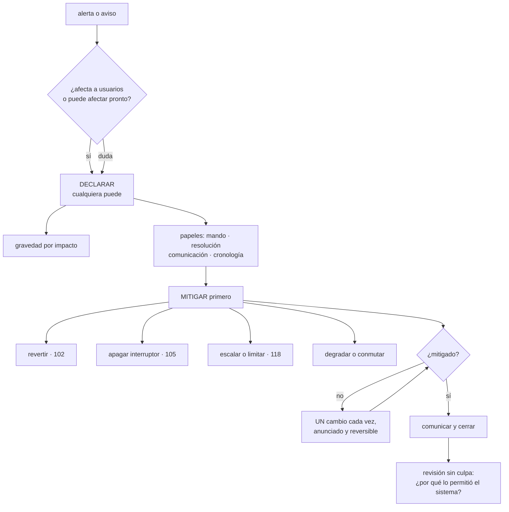

# 127 — Incidentes, severidad, comando y comunicación

> [← 126 · SLI, SLO, SLA y presupuesto de error](../../part-10-observability-sre-reliability/126-sli-slo-sla-y-presupuesto-de-error/README.md) · [Índice de la parte](../README.md) · [128 · Runbooks, playbooks y automatización operativa →](../../part-10-observability-sre-reliability/128-runbooks-playbooks-y-automatizacion-operativa/README.md)

**Parte:** 10 — Observabilidad, SRE y confiabilidad<br>
**Nivel:** avanzado · **Horas estimadas:** 4<br>
**Laboratorio:** `incident` · **Estado:** `EXECUTABLE_CORE`

## 🎯 Propósito

Organizar lo que pasa entre que suena la alerta y que el sistema vuelve a funcionar, y lo que pasa después. La clase defiende cuatro cosas concretas: **declarar pronto**, porque declarar es barato y no declarar es caro; **mitigar antes que diagnosticar**, porque entender la causa puede llevar horas y el usuario está sufriendo ahora; **un cambio cada vez, anunciado**, que es la regla que separa un incidente ordenado de uno que se alarga solo; y una revisión posterior que busca por qué el sistema lo permitió, no quién lo hizo.

## 📚 Resultados de aprendizaje

Al finalizar podrás:

1. **Declarar** un incidente con criterios escritos y sin pedir permiso.
2. **Repartir** los papeles, incluido cuando los asume una sola persona.
3. **Mitigar** con el catálogo de acciones construido en las partes anteriores.
4. **Comunicar** dentro y fuera con una cadencia fija.
5. **Convertir** la revisión posterior en cambios que se completan.

## 🧩 Conceptos centrales

| Concepto | Comprensión verificable |
|---|---|
| `declaración` | Acto explícito de decir que hay un incidente. Abre el canal, los papeles y el registro; cualquiera puede hacerlo. |
| `mando del incidente` | Quien coordina, decide y mantiene el orden. No es quien arregla ni tiene por qué ser quien más sabe. |
| `mitigación` | Acción que reduce el daño sin explicar la causa. Es siempre lo primero. |
| `un cambio cada vez` | Regla de oro durante un incidente: una modificación, anunciada, con forma de deshacerla, antes de la siguiente. |
| `cronología` | Registro de qué se supo, qué se hizo y cuándo. Se escribe durante, no después, porque después nadie lo recuerda. |
| `revisión sin culpa` | Análisis que busca por qué el sistema permitió el fallo. Si acaba en «alguien se equivocó», no ha terminado. |

## 🧠 Modelo mental

La confiabilidad es una característica del servicio percibido por usuarios; SRE la administra con objetivos explícitos y presupuestos de error.

Aplicado a esta clase, separa siempre cuatro planos: **intención** (qué necesita el usuario),
**configuración** (qué declaramos), **estado observado** (qué existe de verdad) y
**evidencia** (cómo sabemos que cumple). Confundirlos produce diseños que se ven correctos
en un diagrama pero fallan al operar.

## 🗺️ Flujo de razonamiento



## 📖 Desarrollo

### 1. Declarar pronto

El error más común no es gestionar mal un incidente: es **no llamarlo incidente** hasta que lleva cuarenta minutos.

```text
coste de declarar y que no fuera nada
  quince minutos de tres personas y un mensaje diciendo que ya está

coste de no declarar y que sí lo fuera
  nadie coordina, nadie avisa fuera, nadie apunta nada
  y la información se pierde para la revisión posterior
```

Y de ahí tres reglas:

```text
1. cualquiera puede declarar, sin pedir permiso a nadie
2. ante la duda, se declara
3. cerrar un incidente que no era nada NO se penaliza ni se comenta
```

La tercera es la que hace posibles las dos primeras.

**La gravedad** se define por impacto, y con tres niveles basta:

```text
ALTA    afecta a la mayoría de usuarios o al flujo principal, o hay
        pérdida de datos, o hay un problema de seguridad
        → respuesta inmediata, a cualquier hora, con comunicación externa

MEDIA   afecta a una funcionalidad secundaria o a un grupo de usuarios,
        o hay degradación clara
        → respuesta en horas, en horario laboral ampliado

BAJA    impacto pequeño o potencial, con margen
        → tarea priorizada
```

Y dos precisiones que evitan discusiones:

```text
la gravedad se puede subir y bajar durante el incidente
se define por IMPACTO, no por nerviosismo ni por quién reclama
```

Y una advertencia que viene de la clase 107: **redefinir qué cuenta como incidente es la forma más fácil de mejorar las cifras sin mejorar nada**. Los criterios se escriben una vez y cambiarlos es un cambio, no una interpretación.

Y lo que la declaración pone en marcha, que debe ser automático y no una lista que alguien recuerda:

```text
un canal dedicado, con nombre del incidente
el registro abierto, con marcas de tiempo
aviso a los papeles necesarios
y un documento donde va todo
```

### 2. Papeles, y los dos fallos que evitan

```text
MANDO           coordina, decide, reparte y mantiene el foco
                NO arregla; si se pone a arreglar, deja de coordinar
RESOLUCIÓN      quien investiga y aplica cambios
COMUNICACIÓN    informa dentro y fuera con cadencia fija
CRONOLOGÍA      escribe qué se supo, qué se hizo y cuándo
```

Y los papeles existen para evitar dos fallos concretos, que son los que alargan los incidentes:

```text
TODOS EXCAVANDO EN EL MISMO SITIO
  seis personas mirando la misma gráfica y nadie mirando las otras cinco
  → el mando reparte hipótesis: «tú mira la base, tú los despliegues»

NADIE HABLA CON EL EXTERIOR
  el equipo trabaja bien y soporte, comercio y clientes no saben nada
  → y a los veinte minutos llegan interrupciones que roban atención
```

Y dos precisiones prácticas:

```text
el mando NO es quien más sabe
  quien más sabe suele ser quien mejor resuelve, y ese es otro papel
en un incidente pequeño una persona asume todos los papeles
  y lo dice en voz alta: «asumo mando y resolución»
  → lo peligroso no es acumular papeles, es que nadie sepa quién los tiene
```

Y la regla que más incidentes ha salvado, y que hay que enunciar sin matices:

```text
UN CAMBIO CADA VEZ
  se anuncia en el canal antes de hacerlo
  se sabe cómo deshacerlo
  se espera a ver el efecto
  y solo entonces viene el siguiente
```

El motivo es que, con tres cambios simultáneos, **si el sistema mejora nadie sabe por cuál, y si empeora tampoco**. Y en un incidente hay prisa, que es exactamente cuando esto se incumple.

Y su corolario: **nada se toca fuera del canal**. Un cambio hecho en silencio por alguien que quería ayudar es la causa de una parte considerable de los incidentes que se alargan.

Y el relevo, para los largos:

```text
se traspasa explícitamente: estado, hipótesis descartadas, cambios hechos,
qué está en marcha y qué se ha comunicado
y quien entra repite en voz alta lo que ha entendido
```

### 3. Mitigar primero

La tentación durante un incidente es entender qué pasa. Y entender puede llevar horas mientras el usuario sufre.

```text
primero   que deje de doler
después   por qué dolía
```

Y eso es viable porque las partes anteriores han construido un catálogo de mitigaciones que no requieren saber la causa:

```text
revertir al artefacto anterior                       clase 102
apagar un interruptor de funcionalidad               clase 105
revertir la confirmación del entorno                 clase 103
escalar el servicio o el consumidor                  clases 113, 117
limitar el ritmo de un cliente concreto              clase 118
degradar: servir del caché, quitar una sección       clases 111, 124
conmutar a otra réplica o región                     clase 109
detener un proceso por lotes que compite             clase 117
vaciar o desviar una cola                            clase 113
```

Y la pregunta que ordena la elección, que es la de la clase 121:

```text
¿qué cambió en los últimos treinta minutos?
  → si hay un cambio reciente, revertirlo es la primera hipótesis
  → y es la mitigación más rápida y más segura que existe
```

Y la excepción que hay que tener presente, de la clase 102: **revertir no sirve si se cruzó el punto de no retorno**. Ahí la mitigación es apagar, no volver atrás.

Y dos trampas frecuentes:

```text
«ya casi lo tengo»           lleva 40 minutos y hay una reversión
                             disponible desde el minuto 3
reiniciar sin mirar          a veces mitiga y destruye la evidencia:
                             capturar antes lo que se pueda
```

La segunda merece un procedimiento: **antes de reiniciar, guardar lo que se perderá** —volcado de memoria, estado de las colas, últimas trazas—. Cuesta un minuto y es la diferencia entre poder explicarlo después o no.

**Y el cierre del incidente**, que también se declara:

```text
MITIGADO      el usuario ya no sufre; puede que la causa siga ahí
RESUELTO      la causa está corregida
CERRADO       hecha la revisión y creadas las acciones
```

Y se comunica el paso a mitigado, no el paso a resuelto: **lo que importa fuera es que ya funciona**.

### 4. Comunicar, y revisar sin culpa

**Fuera.** La comunicación externa tiene tres reglas y se incumplen las tres:

```text
1. CADENCIA FIJA, aunque no haya novedades
   cada 30 minutos en gravedad alta
   «seguimos investigando, próxima actualización a las 11:30»
   → el silencio se interpreta siempre como abandono

2. NUNCA prometer una hora de resolución
   se promete la hora de la SIGUIENTE actualización, que sí se controla

3. DECIR EL IMPACTO en términos del usuario
   «no se pueden completar pedidos», no «el servicio de pagos devuelve 503»
```

Y el contenido de cada mensaje:

```text
qué está afectado, en términos de lo que la gente no puede hacer
desde cuándo
qué se sabe y qué no
si hay alternativa
cuándo será la próxima actualización
```

**Dentro.** Un canal por incidente, y una disciplina:

```text
todo cambio se anuncia antes
las decisiones se escriben, no solo se dicen
las hipótesis descartadas se apuntan, para que nadie las repita
y las conversaciones paralelas vuelven al canal
```

**La revisión posterior**, que es donde el incidente se convierte en algo útil.

La regla que la define: **buscar por qué el sistema lo permitió**.

```text
si la conclusión es «alguien se equivocó», la revisión no ha terminado

¿por qué era posible hacer eso?
¿por qué no lo detectó nada?
¿por qué tardó tanto en detectarse?
¿por qué la mitigación tardó lo que tardó?
¿qué hizo que fuera difícil de diagnosticar?
```

Y no por bondad: **si se busca culpable, la gente deja de contar lo que pasó**, y sin información no hay corrección posible. Es una decisión práctica antes que ética.

Y el contenido mínimo:

```text
cronología con marcas de tiempo
impacto medido: usuarios, duración, presupuesto de error consumido
cómo se detectó   ← y si fue por un cliente, eso es un hallazgo
qué se intentó y qué no funcionó
acciones, con dueño y fecha
```

Y la única medida honesta del proceso de revisión:

```text
proporción de acciones completadas en plazo
  < 50 %  las revisiones son teatro
```

Y tres tipos de acción, en orden de valor:

```text
1. que no pueda volver a ocurrir      lo mejor, y lo más caro
2. que se detecte en un minuto        casi siempre lo más rentable
3. que se mitigue más rápido          procedimiento, automatización
```

Y la pregunta obligatoria de la clase 125: **¿qué alerta debería haber sonado y no sonó?**

Y la lista de comprobación de la clase:

```text
☐ los criterios de declaración y gravedad están escritos
☐ cualquiera puede declarar y nadie es penalizado por hacerlo
☐ declarar abre canal, registro y papeles de forma automática
☐ los papeles se anuncian en voz alta, aunque los asuma una persona
☐ el mando coordina y no arregla
☐ un cambio cada vez, anunciado y reversible
☐ nada se toca fuera del canal
☐ existe catálogo de mitigaciones que no requieren saber la causa
☐ se captura evidencia antes de reiniciar
☐ comunicación externa con cadencia fija y sin prometer horas de resolución
☐ el relevo se traspasa explícitamente
☐ la revisión pregunta por qué el sistema lo permitió
☐ se mide la proporción de acciones completadas en plazo
```

Y el cierre que enlaza con la clase siguiente: la mitad de las acciones de una revisión son procedimientos que alguien tendrá que ejecutar de madrugada. Cómo se escriben para que sirvan, y cuáles conviene automatizar del todo, es la materia de la clase 128.

## 🔬 Ejemplo trabajado

**CloudShop tenía incidentes sin proceso: se resolvían en un canal general, sin papeles y sin registro. El ejercicio compara dos incidentes casi idénticos, separados por cinco meses y por la implantación del proceso.**

**Incidente A, antes del proceso. Duración: 2 h 51.**

```text
09:14  suben los errores del flujo de compra
09:14  tres personas empiezan a mirar por su cuenta
09:21  alguien pregunta en el canal general si le pasa a alguien más
09:29  se reconoce que «esto es gordo»; no se declara nada formalmente
09:31  alguien reinicia el servicio de precios (sin anunciarlo)
09:33  alguien sube las réplicas del catálogo (sin anunciarlo)
09:34  alguien revierte un despliegue de la mañana (sin anunciarlo)
09:38  el sistema mejora un poco; nadie sabe por cuál de los tres
09:41  empeora otra vez
10:05  soporte lleva 50 min recibiendo llamadas sin información
10:12  comercio interrumpe al equipo por chat para preguntar
10:40  se descubre que el reinicio de las 09:31 borró un caché caliente
       y añadió carga a la base
11:30  se identifica la causa real: un cambio de interruptor a las 09:10
12:05  mitigado

cómo se detectó                    por la subida de errores, mirando
cambios simultáneos sin anunciar               3
comunicación externa                      ninguna hasta las 10:40
cronología                             reconstruida después, incompleta
revisión posterior                     una reunión de 30 min, 4 acciones
acciones completadas a los 3 meses          1 de 4
```

**Lo que se implantó.**

```text
criterios de declaración y tres niveles de gravedad, escritos
declaración con un comando que abre canal, documento y avisa
cuatro papeles, anunciados en voz alta
regla de un cambio cada vez
catálogo de mitigaciones con enlaces directos
plantilla de comunicación externa con cadencia de 30 min
revisión sin culpa obligatoria en gravedad alta y media
```

**Incidente B, cinco meses después. Mismo tipo de fallo. Duración: 19 minutos.**

```text
14:02  alerta de ritmo de consumo del presupuesto (clase 126)
14:03  declarado por quien estaba de guardia; gravedad alta
14:03  canal abierto, documento creado, avisos enviados
14:04  «asumo mando y comunicación; X en resolución»
14:05  primera pregunta: ¿qué cambió en los últimos 30 min?
       → la línea de cambios muestra un interruptor al 100 % a las 13:58
14:06  anuncio: «voy a revertir el interruptor recomendaciones-v4»
14:07  revertido
14:09  errores bajando; se confirma
14:12  primera comunicación externa, con impacto y próxima actualización
14:21  mitigado y comunicado

cambios aplicados                                  1
cambios sin anunciar                               0
tiempo hasta la primera hipótesis                  3 min
tiempo hasta la mitigación                        18 min
comunicación externa                        a los 10 min, y al cierre
cronología                                escrita durante, completa
```

**La comparación.**

```text                                    incidente A     incidente B
tiempo hasta declarar                       nunca            1 min
tiempo hasta la primera hipótesis           2 h 16           3 min
cambios simultáneos                            3                1
cambios sin anunciar                           3                0
primera comunicación externa                1 h 26           10 min
interrupciones al equipo desde fuera           11               0
duración total                              2 h 51           19 min
presupuesto de error consumido                84 %            9 %
```

Y la parte del ahorro atribuible a cada cosa, según la revisión:

```text
preguntar primero qué cambió                  ~2 h
un cambio cada vez (evitó el reinicio dañino) ~35 min
comunicación con cadencia                     evitó 11 interrupciones
```

**El incidente que no se declaró, y que enseñó por qué la regla 2 importa.**

```text
mes 3   una persona duda si declarar por una degradación del 4 %
        decide no declarar «por no molestar»
        3 h 20 después es una caída total
        presupuesto consumido: 100 % en un solo suceso
```

Y la corrección no fue reprender a nadie, sino cambiar el sistema:

```text
se midió cuántos incidentes se declaraban y resultaban ser nada
  antes de la medida:     0
  objetivo declarado:     que hubiera algunos
  a los 6 meses:          7 de 34 declaraciones fueron falsas alarmas
```

**Siete falsas alarmas se consideran una señal buena**, no un problema: significa que la gente declara ante la duda. Y desde entonces no ha vuelto a haber una degradación de tres horas sin declarar.

**Las revisiones y sus acciones.**

```text                                          antes         después
revisiones hechas                          2 de 14        27 de 27
acciones creadas                                8             94
acciones con dueño y fecha                   2 de 8       94 de 94
completadas en plazo                         1 de 8        79 de 94  (84 %)
revisiones que concluían «error humano»      2 de 2         0 de 27
```

Y el reparto de las noventa y cuatro acciones por tipo:

```text
que no pueda volver a ocurrir                  21
que se detecte en un minuto                    48   ← 40 alertas nuevas
que se mitigue más rápido                      25
```

Cuarenta y ocho de noventa y cuatro fueron **detección**, y salieron de la pregunta obligatoria: *¿qué alerta debería haber sonado?*

**A los seis meses.**

```text                                          antes         después
incidentes declarados                        14 (informal)     34
de ellos, falsas alarmas                          0             7
tiempo medio hasta declarar                   41 min          2 min
tiempo medio hasta mitigar                    1 h 52         14 min
cambios simultáneos por incidente               2,4            1,0
incidentes con comunicación externa           3 de 14        27 de 27
interrupciones al equipo durante incidentes   11 / incidente   0,3
revisiones con acciones y dueño               2 de 14        27 de 27
acciones completadas en plazo                  13 %            84 %
```

**La lección que esta clase traslada a la parte 10**: el tiempo de mitigación pasó de 1 h 52 a 14 minutos y **nada de esa mejora vino de resolver más rápido**. Vino de declarar antes, de preguntar primero qué había cambiado y de aplicar un cambio cada vez en lugar de tres. Y el dato que más dice sobre el proceso es el que parece un fallo: **siete de treinta y cuatro declaraciones no eran nada**, y esa proporción es exactamente lo que garantiza que no se repita la degradación de tres horas que nadie se atrevió a declarar.

## 🧪 Laboratorio guiado

Ejecuta desde la raíz:

```bash
python classes/part-10-observability-sre-reliability/127-incidentes-severidad-comando-y-comunicacion/lab.py
```

El laboratorio selecciona el motor de práctica **`incident`** y produce
`lab_result.json`. El escenario, sus comprobaciones y el artefacto esperado corresponden a
esta clase; no requiere credenciales y deja explícito qué debe revalidarse en un sandbox real.

1. Lee `exercise.steps` y formula una predicción antes de ejecutar.
2. Ejecuta la práctica y verifica todos los elementos de `checks`.
3. Provoca el caso de `negative_test` y explica la señal observada.
4. Materializa `plan-incidente` en `evidence/` usando la plantilla indicada.
5. Para proveedor real, sigue `sandbox.requires`, registra costo y ejecuta `destroy`.

### Evidencia esperada

El artefacto principal es una cronología, roles, comunicación y aprendizaje. Además, la entrega debe incluir el comando ejecutado,
la salida estructurada y una conclusión que no exceda lo observado.

## 🏆 Reto verificable

Construye **`plan-incidente`** para el caso CloudShop. Incluye una alternativa descartada,
un supuesto que pueda falsarse, una prueba de fallo y una decisión de rollback.

## ✅ Criterio de aceptación

- [ ] `lab.py` termina con código 0 y genera JSON válido.
- [ ] La entrega conecta al menos tres requisitos con mecanismos verificables.
- [ ] Existe una prueba positiva y una prueba negativa con evidencia.
- [ ] Seguridad, costo y operación aparecen como decisiones, no como anexos.
- [ ] Se declara una limitación y una condición que obligaría a revisar el diseño.
- [ ] Otra persona puede repetir el recorrido sin conocimiento tácito.

## ⚠️ Errores frecuentes

| Síntoma | Causa probable | Corrección |
|---|---|---|
| Los incidentes tardan mucho en reconocerse como tales | Declarar se percibe como molestar o como admitir un fallo | Cualquiera puede declarar, ante la duda se declara, y las falsas alarmas no se penalizan ni se comentan. |
| El sistema mejora y nadie sabe por qué | Se aplicaron varios cambios a la vez sin anunciarlos | Un cambio cada vez, anunciado en el canal, con forma de deshacerlo, y nada se toca fuera del canal. |
| El equipo trabaja bien y recibe interrupciones constantes desde fuera | No hay papel de comunicación ni cadencia fija | Asigna comunicación desde el principio y publica actualizaciones cada 30 minutos aunque no haya novedades. |
| Se dedica una hora a entender la causa mientras los usuarios sufren | Se diagnostica antes de mitigar | Mitiga con el catálogo que no requiere saber la causa, empezando por revertir el cambio más reciente. |
| Después del incidente no se puede explicar qué pasó | La cronología se intentó reconstruir al día siguiente, y se reinició sin capturar evidencia | Papel de cronología escribiendo durante, y captura de estado antes de reiniciar nada. |
| Las revisiones no cambian nada | Las acciones no tienen dueño ni fecha, o la conclusión fue que alguien se equivocó | Pregunta por qué el sistema lo permitió, asigna dueño y fecha a cada acción y mide la proporción completada en plazo. |

## 🛡️ Seguridad, ética y costo

Trabaja con cuentas propias o sandboxes autorizados. No publiques secretos, identificadores
reales ni datos personales. Antes de crear recursos pagos define presupuesto, etiquetas y
comando de destrucción; después verifica que no queden recursos huérfanos. Los ejemplos
locales enseñan contratos, pero no certifican cumplimiento ni disponibilidad de producción.

## ❓ Preguntas de comprobación

1. ¿Por qué declarar pronto sale más barato que no declarar, y qué regla lo hace posible?
2. ¿Qué dos fallos concretos evitan los papeles durante un incidente?
3. ¿Por qué se mitiga antes de diagnosticar y con qué catálogo?
4. ¿Qué se promete en una comunicación externa y qué no se promete nunca?
5. ¿Cuál es la única medida honesta de que las revisiones sirven para algo?

## 🔗 Referencias

- Google SRE (2025). *Managing incidents* — papeles, mando y separación entre coordinar y resolver. <https://sre.google/sre-book/managing-incidents/>
- Google SRE (2025). *Postmortem culture: learning from failure* — revisión sin culpa y acciones. <https://sre.google/sre-book/postmortem-culture/>
- PagerDuty (2025). *Incident response documentation* — severidad, comunicación y relevos. <https://response.pagerduty.com/>
- Allspaw, J. (2012). *Blameless postmortems and a just culture* — por qué buscar culpables destruye la información. <https://www.etsy.com/codeascraft/blameless-postmortems/>
- Atlassian (2025). *Incident communication best practices* — cadencia fija y contenido de las actualizaciones. <https://www.atlassian.com/incident-management/incident-communication>
- Documentación oficial vigente del servicio implementado; registra URL y fecha de consulta.

---

> [Evaluación](assessment.md) · [Contrato de clase](lesson.yaml) · [Índice de la parte](../README.md)

**📥 Descargar:** [Parte 10 en PDF](../../../site/downloads/partes/manual-parte-10-observability-sre-reliability.pdf) · [Manual integral](../../../site/downloads/multi-cloud-engineering-manual-v2.0.pdf)

| Anterior | Índice | Siguiente |
|---|---|---|
| [← 126 · SLI, SLO, SLA y presupuesto de error](../../part-10-observability-sre-reliability/126-sli-slo-sla-y-presupuesto-de-error/README.md) | [Parte 10](../README.md) · [Programa](../../README.md) | [128 · Runbooks, playbooks y automatización operativa →](../../part-10-observability-sre-reliability/128-runbooks-playbooks-y-automatizacion-operativa/README.md) |
