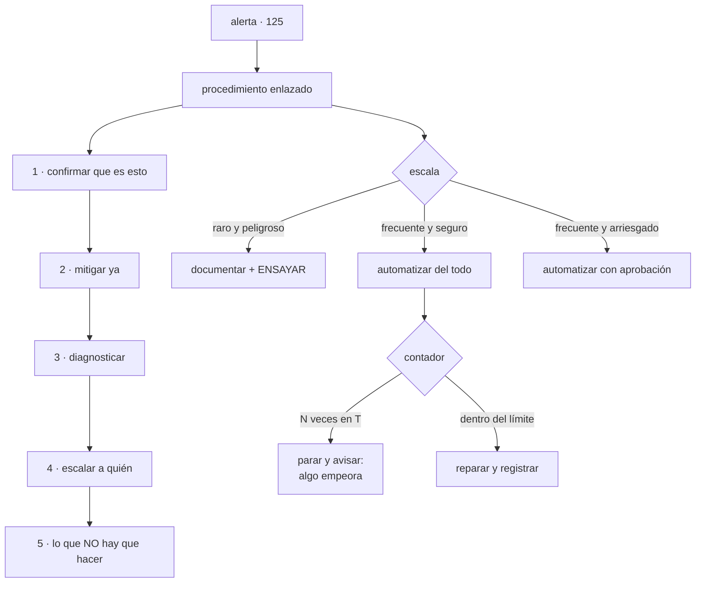

# 128 — Runbooks, playbooks y automatización operativa

> [← 127 · Incidentes, severidad, comando y comunicación](../../part-10-observability-sre-reliability/127-incidentes-severidad-comando-y-comunicacion/README.md) · [Índice de la parte](../README.md) · [129 · Capacidad, rendimiento y pruebas de carga →](../../part-10-observability-sre-reliability/129-capacidad-rendimiento-y-pruebas-de-carga/README.md)

**Parte:** 10 — Observabilidad, SRE y confiabilidad<br>
**Nivel:** avanzado · **Horas estimadas:** 4<br>
**Laboratorio:** `operations` · **Estado:** `EXECUTABLE_CORE`

## 🎯 Propósito

Escribir los procedimientos que la clase 125 exigía para que una alerta fuera accionable, y decidir cuáles conviene automatizar. La clase parte de un criterio de diseño concreto —**se escribe para quien tiene menos contexto, a las tres de la madrugada**— y sostiene dos ideas que suelen sorprender: que **automatizar un procedimiento raro y peligroso suele ser peor que documentarlo**, porque la automatización sin usar se pudre igual que la documentación pero falla en el peor momento; y que **toda reparación automática necesita un contador y un límite**, o acabará tapando un problema que empeora.

## 📚 Resultados de aprendizaje

Al finalizar podrás:

1. **Escribir** un procedimiento utilizable por quien no lo escribió.
2. **Mantenerlo** vivo con mecanismos que no dependan de la buena voluntad.
3. **Situar** cada tarea en la escala de automatización con un criterio explícito.
4. **Acotar** las reparaciones automáticas para que no oculten deterioro.
5. **Medir** el trabajo repetitivo y reducirlo por donde más pesa.

## 🧩 Conceptos centrales

| Concepto | Comprensión verificable |
|---|---|
| `procedimiento` | Guía para responder a una situación concreta. Su calidad se mide por si sirve a quien no lo escribió, no por su detalle. |
| `prueba de las tres de la madrugada` | Que alguien que no lo escribió lo ejecute en un ensayo. Es la única comprobación válida. |
| `escala de automatización` | Documentar, guionizar, automatizar con aprobación, automatizar del todo. Se sube según frecuencia y riesgo. |
| `reparación automática` | Acción correctiva sin intervención humana. Necesita contador y límite, o esconde el deterioro. |
| `trabajo repetitivo` | Manual, repetido, automatizable, sin valor duradero y que crece con el sistema. Se mide como proporción del tiempo. |
| `lo que no se automatiza` | Lo que exige juicio, lo que puede destruir datos y lo que no se puede probar. |

## 🧠 Modelo mental

La confiabilidad es una característica del servicio percibido por usuarios; SRE la administra con objetivos explícitos y presupuestos de error.

Aplicado a esta clase, separa siempre cuatro planos: **intención** (qué necesita el usuario),
**configuración** (qué declaramos), **estado observado** (qué existe de verdad) y
**evidencia** (cómo sabemos que cumple). Confundirlos produce diseños que se ven correctos
en un diagrama pero fallan al operar.

## 🗺️ Flujo de razonamiento



## 📖 Desarrollo

### 1. Escrito para quien tiene menos contexto

Un procedimiento no se escribe para quien conoce el sistema: se escribe para **quien está de guardia a las tres de la madrugada, no construyó ese servicio y acaba de despertarse**.

De ahí salen las reglas de redacción:

```text
comandos exactos, copiables, sin variables que haya que deducir
lo que se espera ver al ejecutarlos, para saber si va bien
sin siglas ni nombres internos sin explicar
sin «obviamente» ni «basta con»
rutas y enlaces completos, no «en el panel de siempre»
```

Y la estructura que funciona, en este orden:

```text
1. ¿ES ESTO?
   cómo confirmar en dos minutos que la situación es la que dice el título
   → evita aplicar el procedimiento equivocado, que es peor que no aplicar
     ninguno

2. MITIGAR
   lo primero, siempre; con el catálogo de la clase 127

3. DIAGNOSTICAR
   consultas concretas, enlaces a los paneles, qué mirar y en qué orden

4. ESCALAR
   a quién, cómo se le localiza y con qué información

5. LO QUE NO HAY QUE HACER
   la sección más útil y la que casi nunca está
```

Y la quinta merece detalle porque evita el daño irreversible:

```text
«no reinicies la base: la conmutación tarda 60 s y el reinicio no arregla esto»
«no borres la cola: contiene pedidos sin procesar»
«no subas el límite de conexiones: empeora, ver clase 109»
«no ejecutes la migración a medias: no es reversible»
```

Y el largo, que decide si se usa:

```text
una pantalla para mitigar
lo demás debajo
→ si hay que leer tres páginas antes de la primera acción, no se usará
```

**La prueba que valida un procedimiento** es una sola, y no es revisarlo:

```text
que alguien que NO lo escribió lo ejecute, en un ensayo,
sobre un entorno donde se pueda
y que anote cada punto donde tuvo que preguntar
→ cada pregunta es un defecto del procedimiento
```

Casi siempre aparecen tres cosas: un permiso que quien lo escribió tenía y el resto no, un nombre que solo conoce el autor, y un paso que en realidad son cuatro.

### 2. Que no se pudran

Un procedimiento escrito hace dos años describe un sistema que ya no existe, y **no da ningún error**. Es la ley 13 en su versión documental.

Los mecanismos que lo evitan, y ninguno depende de que alguien se acuerde:

```text
ENLAZADO DESDE LA ALERTA
  si no se encuentra en cinco segundos, no existe
  → la alerta lleva el enlace, y una alerta sin enlace no se aprueba

CORREGIDO AL USARSE
  quien lo ejecuta lo arregla en el momento, no «lo apunta para luego»
  → y esa corrección es parte de cerrar el incidente

CON FECHA VISIBLE
  «última verificación: 2026-06-14»
  → y una revisión cuando pasa de N meses

BORRADO CON SU ALERTA
  si la alerta desaparece, el procedimiento también
  → 315 alertas borradas en la clase 125 dejaron procedimientos huérfanos

VERSIONADO CON EL CÓDIGO
  vive en el repositorio del servicio, no en un documento suelto
  → así el cambio que lo invalida y su corrección van juntos
```

La segunda es la que más funciona en la práctica y la que hay que exigir: **la persona que acaba de sufrir el procedimiento es la única que sabe exactamente qué le faltaba**, y dentro de dos días ya no se acordará.

Y una medida sencilla del estado del conjunto:

```text
procedimientos sin verificar en 6 meses
alertas sin procedimiento enlazado
procedimientos ejecutados en el último trimestre
  → los que nunca se ejecutan son candidatos a ensayo o a borrado
```

Y una distinción que ordena la biblioteca:

```text
PARA UN SÍNTOMA CONCRETO   «errores 5xx en el flujo de compra»
                           es lo que enlaza una alerta
PARA UNA TAREA             «rotar la clave del proveedor de pago»
                           no responde a una alerta; se ejecuta a propósito
DE REFERENCIA              cómo está montado esto, dónde está cada cosa
                           no es un procedimiento: es documentación
```

Mezclarlos produce documentos de veinte páginas que no sirven para ninguna de las tres cosas.

### 3. La escala de automatización

```text
1. DOCUMENTADO       una persona lee y ejecuta
2. GUIONIZADO        una persona ejecuta un guion que hace los pasos
3. CON APROBACIÓN    el sistema propone y una persona confirma
4. AUTOMÁTICO        el sistema actúa y avisa si no lo consigue
```

Y el criterio para subir un escalón, que son dos variables:

```text                     riesgo bajo            riesgo alto
frecuente           automatizar del todo   automatizar con aprobación
raro                guionizar              DOCUMENTAR y ENSAYAR
```

Y la casilla de abajo a la derecha es la que se hace mal más a menudo. La tentación es automatizar el procedimiento raro y peligroso, y es mala idea:

```text
se ejecuta dos veces al año
→ la automatización no se prueba en ese tiempo
→ el sistema cambia y ella no
→ y falla justo cuando se necesita, con permisos amplios y en el peor momento
```

Lo que sí funciona en esa casilla: **documentar bien y ensayar cada trimestre**, que es lo que la clase 131 convertirá en rutina.

Y tres cosas que no se automatizan, sea cual sea la frecuencia:

```text
lo que exige juicio            decidir si se acepta un riesgo, comunicar
                               a un cliente, elegir entre dos males
lo que puede destruir datos    borrados, migraciones destructivas,
                               restauraciones sobre datos vivos
lo que no se puede probar      si no hay forma de ensayarlo, la
                               automatización es un riesgo, no un ahorro
```

Y una recomendación intermedia muy rentable: **automatizar el diagnóstico y dejar la acción a la persona**. Un guion que reúne en veinte segundos todo lo que habría que mirar a mano ahorra la mayor parte del tiempo sin ninguno de los riesgos.

```bash
# diagnóstico automático adjunto a la alerta
$ diagnostico pedidos --ultimos 30m
  cambios recientes .......... interruptor pago-v2 al 100 % hace 12 min
  saturación ................. agrupador 41 %, cola 12 s
  dependencias ............... precios 99,9 %, pago 94,1 %  ← degradado
  errores por tipo ........... 71 % tiempo de espera hacia pago
  sugerencia ................. revisar el cambio de interruptor
```

Eso se adjunta al aviso y quien está de guardia empieza con el trabajo hecho.

### 4. Reparación automática y trabajo repetitivo

**La reparación automática** es el escalón cuatro, y tiene un peligro específico: **oculta el deterioro**.

```text
el servicio se queda sin memoria y se reinicia solo
→ nadie se entera
→ y la fuga de memoria empeora durante meses
→ hasta que reiniciar cada 40 minutos ya no basta
```

La regla que lo evita, y que hay que aplicar a **toda** reparación automática:

```text
CONTADOR Y LÍMITE
  se cuenta cada actuación
  si supera N veces en T, deja de reparar y avisa
  → «esto se ha reparado solo 14 veces hoy» es la información valiosa
```

Y las tres cosas que hay que registrar siempre:

```text
cuántas veces actuó, por causa
si lo consiguió
y la tendencia: si sube, algo empeora aunque nadie lo note
```

Y los ejemplos que este programa ya tiene repartidos:

```text
reinicio por sonda fallida                    clase 079
reintento con espera creciente                clase 113
autoescalado                                  clases 078, 117
reversión automática por análisis de canario  clase 102
reconciliación que corrige la deriva          clase 103
```

Los cinco reparan solos. **Los cinco pueden estar tapando algo**, y por eso los cinco necesitan su contador.

**El trabajo repetitivo**, que es el objetivo de fondo de esta clase. Su definición tiene cinco rasgos, y hacen falta varios:

```text
manual · repetitivo · automatizable · sin valor duradero ·
y crece con el tamaño del sistema
```

El último es el decisivo: **si al doblar el número de servicios ese trabajo se dobla, es trabajo repetitivo**; si no crece, probablemente sea trabajo normal.

Y se mide, aunque sea a mano:

```text
proporción del tiempo del equipo dedicada a ello
  > 50 %   no queda tiempo para arreglarlo, y la situación se agrava sola
  ~ 30 %   habitual
  < 20 %   objetivo razonable
```

Y se reduce por donde pesa, no por donde es más fácil:

```text
registrar cada tarea repetitiva durante dos semanas
ordenar por tiempo total: frecuencia × duración
automatizar las tres primeras
→ suelen ser el 60 % del total
```

Y una advertencia: **automatizar el síntoma perpetúa la causa**. Un guion que crea usuarios en cuatro sistemas ahorra tiempo, y la pregunta mejor es por qué hay cuatro sistemas de usuarios.

Y la lista de comprobación de la clase:

```text
☐ toda alerta enlaza su procedimiento
☐ cada procedimiento empieza confirmando que es esa situación
☐ la mitigación cabe en una pantalla
☐ hay sección de lo que no hay que hacer
☐ los comandos son exactos y se dice qué se espera ver
☐ alguien que no lo escribió lo ha ejecutado en un ensayo
☐ quien lo usa lo corrige en el momento
☐ lleva fecha de última verificación y se revisa
☐ vive en el repositorio del servicio
☐ cada tarea está situada en la escala por frecuencia y riesgo
☐ lo raro y peligroso está documentado y se ensaya, no automatizado
☐ el diagnóstico automático se adjunta a las alertas
☐ toda reparación automática tiene contador, límite y registro
☐ se mide la proporción de tiempo en trabajo repetitivo
```

Y el cierre que enlaza con la clase siguiente: varios de estos procedimientos existen porque el sistema se queda sin capacidad. Saber cuánta hay, cuándo se agota y cómo comprobarlo antes de que ocurra es la materia de la clase 129.

## 🔬 Ejemplo trabajado

**CloudShop escribe procedimientos para las setenta y tres alertas que sobrevivieron a la clase 125. El ejercicio tiene tres hallazgos: lo que la prueba de ejecución reveló, la reparación automática que llevaba cuatro meses tapando una fuga, y de dónde salía el trabajo repetitivo.**

**Hallazgo 1: la prueba de las tres de la madrugada.**

Se escribieron 73 procedimientos. Después, cada uno lo ejecutó alguien distinto de quien lo escribió, sobre preproducción.

```text
procedimientos escritos                                    73
ejecutados por otra persona en el ensayo                   73
completados sin preguntar nada                              9
con al menos una pregunta                                  64
preguntas totales                                         211
```

Y las preguntas, clasificadas:

```text
faltaba un permiso que el autor tenía                      58
nombre o sigla que solo conocía el autor                   47
un paso que en realidad eran varios                        39
no se decía qué se esperaba ver                            31
el enlace llevaba a un panel que ya no existía             22
el comando tenía una variable sin explicar                 14
```

**Cincuenta y ocho problemas de permisos.** Los procedimientos eran correctos y la mitad del equipo no podía ejecutarlos. Eso se arregló antes que ningún texto.

```text                                    primera versión   tras el ensayo
completados sin preguntar                    9 de 73          68 de 73
tiempo medio de ejecución                    22 min            6 min
los 5 restantes                          requerían juicio: se marcaron
                                         como «escalar siempre»
```

**Hallazgo 2: el reinicio automático que tapaba una fuga.**

Al instrumentar contadores en las reparaciones automáticas, el primer día:

```text
reinicios automáticos por sonda de memoria, últimas 24 h        4.180
servicios afectados                                                 3
del servicio de recomendaciones                                 3.940
frecuencia                                                cada 22 s
```

Cuatro mil ciento ochenta reinicios en un día, y **el panel del servicio estaba verde**, porque el reinicio funcionaba: la disponibilidad medida era del 99,7 %.

```text
tiempo que llevaba ocurriendo                              4 meses
causa                        fuga de memoria introducida en la versión 3.1
cómo se detectó antes                                     no se detectó
efecto colateral        arranque en frío constante; latencia p99 ×3
                        y el caché local nunca se llenaba
```

Y con contador y límite:

```text                                          antes         después
contador de reparaciones automáticas             no             sí
límite                                       sin límite   5 en 30 min
qué ocurre al superarlo                         nada      deja de reparar
                                                          y avisa
tiempo hasta detectar una fuga nueva          4 meses         38 min
reinicios diarios tras corregir la fuga        4.180             2
latencia p99 del servicio                      840 ms          210 ms
```

Y se aplicó el mismo tratamiento a las otras cuatro reparaciones automáticas:

```text                                    actuaciones/día   lo que revelaron
reintentos hacia el proveedor de pago         14.200      un 4 % de errores
                                                          intermitentes
                                                          crónicos
autoescalado                                      41      un trabajo por lotes
                                                          mal programado
reversión automática de canario                  0,3      correcto
reconciliación corrigiendo deriva                  9      alguien tocaba a mano
                                                          un recurso cada día
```

Tres de las cuatro **estaban tapando algo**.

**Hallazgo 3: de dónde salía el trabajo repetitivo.**

Dos semanas registrando cada tarea manual:

```text                                    veces/mes   min/vez   total/mes
dar acceso a alguien a algo                    38        22        14 h
reiniciar o desbloquear un consumidor          61         8         8 h
reprocesar mensajes de la cola de fallidos     22        35        13 h
crear un entorno para depurar                  11        40         7 h
rotar una credencial                            6        50         5 h
responder «¿por qué este pedido está así?»     44        12         9 h
el resto (31 tareas distintas)                  —         —        18 h
                                                                 ─────
                                                                   74 h
proporción del tiempo del equipo                                    34 %
```

Y las tres primeras eran el 47 % del total. Su tratamiento, con el criterio del apartado tercero:

```text
dar acceso           frecuente, riesgo medio → automatizar con aprobación
                     grupos del catálogo (clase 106)
                     14 h/mes → 1 h/mes

desbloquear consumidor  frecuente, riesgo bajo → automatizar del todo
                     con contador y límite
                     8 h/mes → 0, y el contador reveló que 41 de los 61
                     eran el mismo defecto, que se corrigió

reprocesar fallidos  frecuente, riesgo medio → automatizar con aprobación
                     la herramienta por lotes de la clase 113
                     13 h/mes → 2 h/mes

«¿por qué este pedido está así?»  → no era trabajo repetitivo:
                     era falta de la vista por sujeto (clase 115)
                     9 h/mes → 0,5 h/mes
```

Y una que se decidió **no** automatizar:

```text
rotar una credencial       6 veces al mes, riesgo alto
decisión                   guionizar los pasos, no automatizar el conjunto
motivo                     toca permisos de producción y una rotación mal
                           hecha corta el servicio
añadido                    ensayo trimestral con alguien distinto
```

**El diagnóstico automático adjunto a las alertas.**

```text                                          antes         después
información al recibir un aviso            el título     título + diagnóstico
tiempo hasta la primera hipótesis            9 min          80 s
avisos resueltos sin abrir ningún panel        0 %           41 %
```

**A los seis meses.**

```text                                          antes         después
alertas con procedimiento enlazado            12 de 73      73 de 73
procedimientos ejecutables por cualquiera      9 de 73      68 de 73
tiempo medio de ejecución                      22 min         6 min
procedimientos sin verificar en 6 meses           —             4
reparaciones automáticas con contador          0 de 5        5 de 5
fugas o defectos tapados por reparación
  automática, descubiertos                        —             3
tiempo hasta detectar una fuga nueva          4 meses        38 min
trabajo repetitivo, proporción del tiempo       34 %          11 %
horas al mes en tareas manuales                  74            24
tareas automatizadas                              0             4
tareas deliberadamente no automatizadas           —             1
```

**La lección que esta clase traslada a la parte 10**: el hallazgo más caro no lo dio ningún procedimiento nuevo, sino **poner un contador a algo que ya funcionaba**. Cuatro mil ciento ochenta reinicios automáticos al día durante cuatro meses, con el panel en verde y la disponibilidad cumpliendo el objetivo: la reparación automática estaba haciendo su trabajo tan bien que **nadie podía ver que el sistema se estaba deteriorando**. Y la mayor reducción de trabajo repetitivo no vino de automatizar: nueve horas al mes desaparecieron al construir una consulta que la clase 115 ya había pedido.

## 🧪 Laboratorio guiado

Ejecuta desde la raíz:

```bash
python classes/part-10-observability-sre-reliability/128-runbooks-playbooks-y-automatizacion-operativa/lab.py
```

El laboratorio selecciona el motor de práctica **`operations`** y produce
`lab_result.json`. El escenario, sus comprobaciones y el artefacto esperado corresponden a
esta clase; no requiere credenciales y deja explícito qué debe revalidarse en un sandbox real.

1. Lee `exercise.steps` y formula una predicción antes de ejecutar.
2. Ejecuta la práctica y verifica todos los elementos de `checks`.
3. Provoca el caso de `negative_test` y explica la señal observada.
4. Materializa `runbook-verificado` en `evidence/` usando la plantilla indicada.
5. Para proveedor real, sigue `sandbox.requires`, registra costo y ejecuta `destroy`.

### Evidencia esperada

El artefacto principal es un runbook probado por otra persona. Además, la entrega debe incluir el comando ejecutado,
la salida estructurada y una conclusión que no exceda lo observado.

## 🏆 Reto verificable

Construye **`runbook-verificado`** para el caso CloudShop. Incluye una alternativa descartada,
un supuesto que pueda falsarse, una prueba de fallo y una decisión de rollback.

## ✅ Criterio de aceptación

- [ ] `lab.py` termina con código 0 y genera JSON válido.
- [ ] La entrega conecta al menos tres requisitos con mecanismos verificables.
- [ ] Existe una prueba positiva y una prueba negativa con evidencia.
- [ ] Seguridad, costo y operación aparecen como decisiones, no como anexos.
- [ ] Se declara una limitación y una condición que obligaría a revisar el diseño.
- [ ] Otra persona puede repetir el recorrido sin conocimiento tácito.

## ⚠️ Errores frecuentes

| Síntoma | Causa probable | Corrección |
|---|---|---|
| El procedimiento existe y quien está de guardia no puede ejecutarlo | Está escrito por quien tenía permisos y contexto que el resto no tiene | Prueba de ejecución por otra persona; cada pregunta que hace es un defecto, y los permisos se arreglan antes que el texto. |
| Los procedimientos describen un sistema que ya no existe | Ley 13: un documento desactualizado no produce ningún error | Enlazado desde la alerta, corregido por quien lo usa en el momento, con fecha de verificación y viviendo en el repositorio del servicio. |
| Una automatización crítica falla justo cuando se necesita | Se automatizó un procedimiento raro, que no se ejecuta lo bastante como para detectar que se pudrió | Lo raro y peligroso se documenta y se ensaya cada trimestre; lo frecuente y seguro se automatiza. |
| Un servicio se deteriora durante meses con los paneles en verde | Una reparación automática lo compensa y nadie cuenta cuántas veces actúa | Contador, límite y registro en toda reparación automática; al superar el límite, deja de reparar y avisa. |
| El equipo no tiene tiempo de mejorar nada | El trabajo repetitivo supera la mitad del tiempo y crece con el sistema | Registra dos semanas, ordena por tiempo total y automatiza las tres primeras tareas; suelen ser la mitad. |
| Se automatiza una tarea y el problema de fondo sigue creciendo | Se automatizó el síntoma | Antes de guionizar, pregunta por qué existe esa tarea; a veces la respuesta elimina la tarea entera. |

## 🛡️ Seguridad, ética y costo

Trabaja con cuentas propias o sandboxes autorizados. No publiques secretos, identificadores
reales ni datos personales. Antes de crear recursos pagos define presupuesto, etiquetas y
comando de destrucción; después verifica que no queden recursos huérfanos. Los ejemplos
locales enseñan contratos, pero no certifican cumplimiento ni disponibilidad de producción.

## ❓ Preguntas de comprobación

1. ¿Para quién se escribe un procedimiento y qué prueba lo valida?
2. ¿Por qué la sección de lo que no hay que hacer es tan valiosa?
3. ¿Qué criterio decide si una tarea se automatiza, y qué casilla es la trampa?
4. ¿Por qué toda reparación automática necesita contador y límite?
5. ¿Qué cinco rasgos definen el trabajo repetitivo y cuál es el decisivo?

## 🔗 Referencias

- Google SRE (2025). *Eliminating toil* — definición, medición y objetivo de reducción. <https://sre.google/sre-book/eliminating-toil/>
- Google SRE (2025). *Emergency response and playbooks* — contenido y mantenimiento de los procedimientos. <https://sre.google/sre-book/emergency-response/>
- PagerDuty (2025). *Runbook documentation* — estructura y enlace desde la alerta. <https://response.pagerduty.com/oncall/runbooks/>
- Beyer, B. y otros (2018). *The Site Reliability Workbook*, cap. 6 — escala de automatización y sus riesgos. <https://sre.google/workbook/eliminating-toil/>
- Woods, D. y otros (2010). *Behind Human Error* — por qué los automatismos que compensan ocultan el deterioro. <https://www.taylorfrancis.com/books/mono/10.1201/9781315568935/behind-human-error>
- Documentación oficial vigente del servicio implementado; registra URL y fecha de consulta.

---

> [Evaluación](assessment.md) · [Contrato de clase](lesson.yaml) · [Índice de la parte](../README.md)

**📥 Descargar:** [Parte 10 en PDF](../../../site/downloads/partes/manual-parte-10-observability-sre-reliability.pdf) · [Manual integral](../../../site/downloads/multi-cloud-engineering-manual-v2.0.pdf)

| Anterior | Índice | Siguiente |
|---|---|---|
| [← 127 · Incidentes, severidad, comando y comunicación](../../part-10-observability-sre-reliability/127-incidentes-severidad-comando-y-comunicacion/README.md) | [Parte 10](../README.md) · [Programa](../../README.md) | [129 · Capacidad, rendimiento y pruebas de carga →](../../part-10-observability-sre-reliability/129-capacidad-rendimiento-y-pruebas-de-carga/README.md) |
