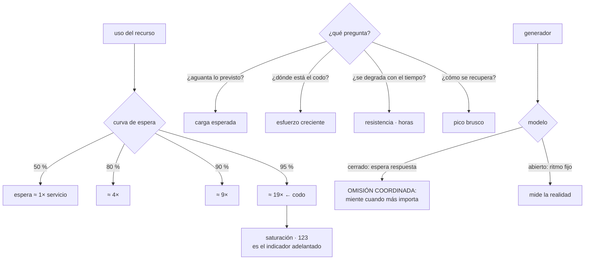

# 129 — Capacidad, rendimiento y pruebas de carga

> [← 128 · Runbooks, playbooks y automatización operativa](../../part-10-observability-sre-reliability/128-runbooks-playbooks-y-automatizacion-operativa/README.md) · [Índice de la parte](../README.md) · [130 · Timeouts, retries, backoff, circuit breaker y bulkhead →](../../part-10-observability-sre-reliability/130-timeouts-retries-backoff-circuit-breaker-y-bulkhead/README.md)

**Parte:** 10 — Observabilidad, SRE y confiabilidad<br>
**Nivel:** avanzado · **Horas estimadas:** 4<br>
**Laboratorio:** `performance` · **Estado:** `EXECUTABLE_CORE`

## 🎯 Propósito

Saber cuánta capacidad hay, cuándo se agota y comprobarlo antes de que ocurra. La clase se apoya en una propiedad de las colas que explica la mitad de los incidentes de este programa —**la latencia no crece de forma proporcional al uso: se dispara cerca de la saturación**— y en un defecto de método que hace que la mayoría de las pruebas de carga mientan: **si el generador espera la respuesta antes de enviar la siguiente petición, oculta precisamente la degradación que se buscaba medir**.

## 📚 Resultados de aprendizaje

Al finalizar podrás:

1. **Separar** rendimiento, capacidad y escalabilidad, y saber cuál se está midiendo.
2. **Explicar** por qué la latencia se dispara cerca de la saturación y qué margen dejar.
3. **Elegir** el tipo de prueba según la pregunta.
4. **Generar** carga sin ocultar la degradación ni falsear la distribución.
5. **Planificar** capacidad contando los límites que no escalan solos.

## 🧩 Conceptos centrales

| Concepto | Comprensión verificable |
|---|---|
| `rendimiento` | Lo que tarda una operación cuando el sistema está tranquilo. Es una propiedad del código y del camino. |
| `capacidad` | Cuánto trabajo simultáneo admite antes de degradarse. Es una propiedad del sistema entero. |
| `codo` | Nivel de uso a partir del cual la latencia se dispara. Está bastante antes del 100 %, y es el límite real. |
| `modelo abierto` | El generador envía peticiones a un ritmo fijo, responda el sistema o no. Es lo que hacen los usuarios reales. |
| `omisión coordinada` | Defecto del modelo cerrado: al esperar cada respuesta, se dejan de enviar peticiones justo cuando el sistema va lento, y la latencia medida sale mucho mejor de lo que es. |
| `prueba de resistencia` | Carga sostenida durante horas o días. Es la que encuentra fugas, acumulaciones y degradación lenta. |
| `margen` | Distancia entre la carga habitual y el codo. Es lo que da tiempo a reaccionar. |

## 🧠 Modelo mental

La confiabilidad es una característica del servicio percibido por usuarios; SRE la administra con objetivos explícitos y presupuestos de error.

Aplicado a esta clase, separa siempre cuatro planos: **intención** (qué necesita el usuario),
**configuración** (qué declaramos), **estado observado** (qué existe de verdad) y
**evidencia** (cómo sabemos que cumple). Confundirlos produce diseños que se ven correctos
en un diagrama pero fallan al operar.

## 🗺️ Flujo de razonamiento



## 📖 Desarrollo

### 1. Tres cosas distintas, y la curva que las une

```text
RENDIMIENTO    cuánto tarda una operación sin competencia
               se mejora con código, consultas, índices, caché
CAPACIDAD      cuánto trabajo simultáneo admite antes de degradarse
               se mejora con recursos, paralelismo y quitando cuellos
ESCALABILIDAD  cómo cambian las dos al añadir recursos
               puede ser buena, mala o negativa
```

Y el error habitual es optimizar la primera cuando el problema es la segunda: **una consulta de 4 ms no mejora nada si la petición espera 800 ms para conseguir un hilo**, que es exactamente el hueco de la clase 124.

**La curva de espera** es lo que hay que tener en la cabeza, porque explica casi todo:

```text
uso del recurso        espera relativa al tiempo de servicio
  10 %                   0,11×
  50 %                   1×
  70 %                   2,3×
  80 %                   4×
  90 %                   9×
  95 %                  19×
  99 %                  99×
```

Y las consecuencias prácticas:

```text
entre el 50 % y el 70 % apenas se nota nada
entre el 90 % y el 95 % la latencia se DOBLA
→ el sistema pasa de «bien» a «caído» sin estados intermedios
→ y por eso el uso medio es un indicador engañoso y la saturación no
```

Y de ahí sale la regla de margen:

```text
planificar para el 60-70 % de uso en el pico habitual
→ no por prudencia vaga, sino porque el margen es el TIEMPO
  que hay para reaccionar
```

Y dos matices que la hacen más útil:

```text
la variabilidad empeora la curva
  con tiempos de servicio muy dispares, el codo llega antes
el paralelismo la mejora
  varios servidores idénticos toleran más uso que uno solo
```

Y la ley que relaciona las tres magnitudes, la misma que la clase 117 usó para las funciones:

```text
trabajo en curso = ritmo de llegada × tiempo de permanencia

1.200 peticiones/s × 0,25 s = 300 en curso
→ y si solo hay 200 hilos, 100 esperan
```

Esa cuenta, hecha antes, evita la mayoría de los incidentes de saturación.

### 2. Qué prueba responde qué

```text
HUMO           carga mínima; comprueba que el montaje funciona
               se ejecuta en cada despliegue

CARGA ESPERADA ¿aguanta lo previsto con la latencia del objetivo?
               → responde sí o no; no busca el límite

ESFUERZO CRECIENTE  sube hasta que se degrada
               → encuentra el CODO y el cuello de botella
               → y el cuello siempre está en un sitio: conexiones, hilos,
                 una dependencia, un bloqueo

RESISTENCIA    la carga esperada durante horas o días
               → encuentra fugas de memoria, acumulación de conexiones,
                 crecimiento de tablas, colas que no vacían

PICO BRUSCO    de 0 a la carga máxima en segundos
               → mide cuánto tarda en escalar y CÓMO SE RECUPERA
               → aquí aparecen las tormentas de reintentos (clase 113)
```

Y la que más valor da en un sistema como el de las partes anteriores es **la de resistencia**, aunque sea la que menos se hace:

```text
los problemas de la parte 09 que solo aparecen con el tiempo
  fuga de memoria oculta por reinicios          clase 128
  conexiones que no se devuelven al agrupador   clase 109
  historial que crece y ralentiza               clase 119
  cola que crece despacio                       clase 113
  tabla de salida sin limpiar                   clase 116
```

Ninguno de esos se ve en veinte minutos de carga. Todos se ven en ocho horas.

Y lo que hay que medir durante la prueba, además de latencia y errores:

```text
memoria y su tendencia, no su valor
conexiones en uso y en espera
profundidad y antigüedad de colas
tiempo de recolección de memoria
saturación de todos los agrupadores
y la línea de cambios, por si alguien despliega a la vez
```

La segunda línea es la clave de una prueba de resistencia: **lo que importa es la pendiente, no el valor**. Una memoria que sube 30 MB por hora está bien a las dos horas y mal a las cuarenta.

Y las dos preguntas que hay que responder antes de ejecutar nada:

```text
¿qué hipótesis estoy comprobando?
¿qué resultado me haría cambiar una decisión?
→ si no hay respuesta, la prueba producirá gráficos y ninguna acción
```

### 3. Generar carga sin mentirse

Aquí está el defecto de método que invalida la mayoría de las pruebas.

```text
MODELO CERRADO   N clientes; cada uno envía, ESPERA la respuesta y repite
MODELO ABIERTO   se envían R peticiones por segundo, responda o no
```

Y el problema del primero:

```text
el sistema se pone lento
→ los clientes tardan más en recibir
→ y por tanto ENVÍAN MENOS
→ la carga baja sola justo cuando el sistema está mal
→ y la latencia medida sale mucho mejor que la real
```

Eso se llama **omisión coordinada**, y el efecto es grande:

```text
sistema que se para 1 s cada 10 s, con 100 peticiones/s previstas
  modelo cerrado, percentil 99 medido:      ~30 ms
  modelo abierto, percentil 99 real:      ~1.000 ms
```

Un factor de treinta. Y el usuario real vive el segundo caso, porque **el usuario no deja de pulsar porque el sistema vaya lento**; llega más gente, no menos.

La corrección es usar modelo abierto, o corregir el registro compensando el retraso acumulado.

Y los otros cuatro errores que falsean una prueba:

```text
DATOS IRREALES
  base vacía o con mil filas: los planes de consulta no son los de producción
  → es la lección de las clases 104 y 109

DISTRIBUCIÓN UNIFORME
  pedir productos al azar entre dos millones
  → nunca aparece la clave caliente de la clase 110 ni el caché real
  → la proporción de aciertos de caché de la prueba no se parece a nada

SIN TIEMPO DE ESPERA ENTRE ACCIONES
  un usuario real piensa entre pantallas
  → sin eso, el perfil de carga no es el de nadie

SUBIDA DE GOLPE cuando se quiere medir estado estable
  → mejor rampa, y esperar a que se estabilice antes de medir
  → salvo que la pregunta sea justamente cómo reacciona a un pico
```

Y el más importante de los cuatro es el segundo: **la distribución decide la proporción de aciertos de caché**, y esa decide casi todo lo demás.

**Dónde probar.** Un entorno de prueba nunca es igual, y hay tres opciones honestas:

```text
ENTORNO APARTE       barato, y sus resultados son orientativos
                     → sirve para comparar versiones entre sí
TRÁFICO EN ESPEJO    copia del tráfico real a un entorno paralelo,
                     sin efectos
                     → realismo alto y sin riesgo para el usuario
EN PRODUCCIÓN        la única medida verdadera
                     → con límites, en horas valle, con interruptor
                       de parada y vigilando el presupuesto de error
```

Y una forma barata y muy usada de la tercera: **reducir el número de instancias en horas valle** hasta acercarse al codo, medir, y devolverlas. Da el límite real sin generar nada.

### 4. Planificar, y lo que no escala solo

La planificación de capacidad es una cuenta con tres factores:

```text
capacidad necesaria =
    demanda prevista
  × margen hasta el codo
  + lo que tarde en estar disponible
```

Y el tercero es el que se olvida:

```text
añadir instancias                    segundos o minutos
subir una cuota del proveedor        horas o días
ampliar particiones de un registro   semanas (clase 114)
contratar una licencia               semanas
migrar una clave de partición        semanas (clase 110)
```

Y de ahí la regla: **lo que tarda semanas en ampliarse se planifica con meses de antelación**, no cuando la métrica se acerque al límite.

Y la lista de lo que **no escala solo** aunque todo lo demás sí, que es donde se rompen los sistemas de este programa:

```text
conexiones a la base                       clase 109
cuotas de la cuenta o del proyecto         clases 049, 117
concurrencia compartida de funciones       clase 117
particiones de un registro                 clase 114
límites de ritmo de terceros               clase 118
un trabajo por lotes con un solo ejecutor
la persona que aprueba algo
```

Las dos últimas se olvidan siempre, y las dos han aparecido en este programa.

Y qué vigilar para no llegar tarde:

```text
uso frente al codo conocido, no frente al 100 %
proyección: a este ritmo de crecimiento, ¿cuándo se alcanza?
tiempo de aprovisionamiento de cada recurso
y una revisión antes de cada evento previsible: campañas, cierres,
  temporadas
```

La segunda es la que convierte esto en algo útil: **una alerta que dice «al ritmo actual, esto se agota en 12 días»** es accionable; una que dice «uso al 71 %» no.

**Coste y eficiencia**, que es la otra cara:

```text
coste por petición, o por pedido, o por unidad de negocio
→ es la medida que permite comparar optimizaciones
```

Y el criterio para decidir si vale la pena optimizar:

```text
coste de la ingeniería frente a coste del recurso
  duplicar instancias: 400 €/mes
  dos semanas de trabajo: mucho más
  → si el problema es puntual, se paga la máquina
  → si crece con el tamaño, se paga la ingeniería
```

Y la excepción: **cuando lo que falta no es potencia sino un cuello de botella**, añadir recursos no arregla nada. Cien instancias más contra una base saturada empeoran la situación, como demostró la clase 113.

Y la lista de comprobación de la clase:

```text
☐ está identificado el codo de cada servicio, medido
☐ el pico habitual queda por debajo del 70 % del codo
☐ se vigila saturación, no solo uso medio
☐ el generador de carga usa modelo abierto
☐ los datos de prueba tienen volumen y distribución realistas
☐ hay prueba de resistencia de al menos varias horas, con tendencias
☐ hay prueba de pico que mide la recuperación, no solo el aguante
☐ cada prueba responde a una hipótesis escrita
☐ está inventariado lo que no escala solo y su tiempo de ampliación
☐ hay proyección de agotamiento, no solo uso actual
☐ se mide coste por unidad de negocio
```

Y el cierre que enlaza con la clase siguiente: conocer el codo permite dimensionar, y no evita que una dependencia se caiga o se ponga lenta. Qué hace un servicio cuando aquello de lo que depende falla —y cómo se evita que ese fallo se propague— es la materia de la clase 130.

## 🔬 Ejemplo trabajado

**CloudShop prepara una campaña que triplicará el tráfico. Antes de dimensionar nada, descubre que sus pruebas de carga llevaban dos años dando resultados que no significaban nada.**

**El descubrimiento: la prueba decía 8.000 y el sistema aguantaba 1.900.**

```text
prueba de carga habitual
  modelo                                   cerrado, 500 clientes virtuales
  resultado                                8.100 peticiones/s, p99 = 41 ms
  conclusión histórica                     «aguantamos de sobra»

incidente real de la clase 109
  tráfico en el que falló                  ~1.900 peticiones/s
```

Al repetir con modelo abierto:

```text                                    cerrado          abierto
peticiones/s sostenidas sin degradar       8.100            1.850
p99 a 1.900 peticiones/s                     44 ms         2.900 ms
p99 a 3.000 peticiones/s                     51 ms          fallo
```

La explicación es la omisión coordinada: **al ponerse lento el sistema, los quinientos clientes virtuales enviaban menos**, así que la carga bajaba sola y la latencia medida seguía siendo excelente.

Y los otros dos defectos, corregidos a continuación:

```text                                    antes            después
datos                              12.000 productos    2,1 M productos
distribución                       uniforme            real (el 0,04 % de
                                                       las claves recibe
                                                       el 68 % del tráfico)
aciertos de caché en la prueba          31 %              94 %
capacidad medida                      1.850/s          4.200/s
```

La distribución realista **subió** la capacidad medida, porque el caché empezó a funcionar como en producción. Con distribución uniforme, la prueba era pesimista en un factor de dos, y con modelo cerrado, optimista en un factor de cuatro. **Los dos errores se compensaban parcialmente y el número final no significaba nada.**

**El codo, medido con esfuerzo creciente.**

```text
carga        uso de agrupador   p99      errores
1.000/s          22 %           38 ms      0
2.000/s          44 %           41 ms      0
3.000/s          62 %           58 ms      0
3.500/s          71 %           94 ms      0
4.000/s          81 %          310 ms      0
4.200/s          88 %          980 ms    0,1 %
4.400/s          94 %        3.900 ms    4,2 %
4.600/s          99 %          fallo     41 %
```

El codo está entre 3.500 y 4.000, con el agrupador de conexiones al 71-81 %. **Doscientas peticiones por segundo separan «bien» de «mal»**, que es la curva del apartado primero en datos reales.

```text
codo                                     ~3.800 peticiones/s
pico habitual                             1.400 peticiones/s  (37 %)
pico previsto en campaña                  4.200 peticiones/s  (110 %)
→ hay que aumentar capacidad
```

**La prueba de resistencia, que encontró tres cosas.**

Ocho horas al 60 % de la capacidad:

```text
hora 0    memoria 1,2 GB   conexiones 18   p99 62 ms
hora 2    memoria 1,9 GB   conexiones 22   p99 64 ms
hora 4    memoria 2,6 GB   conexiones 31   p99 71 ms
hora 6    memoria 3,3 GB   conexiones 44   p99 96 ms
hora 8    memoria 4,0 GB   conexiones 58   p99 210 ms
```

Tres pendientes, tres problemas:

```text
memoria +350 MB/h    fuga en el cliente de un servicio interno
                     → en producción la tapaba el reinicio automático
                       de la clase 128
conexiones +5/h      conexiones no devueltas al agrupador en un camino
                     de error
                     → en 3 días habrían agotado el techo
p99 creciente        consecuencia de las dos anteriores
```

**Ninguna de las tres aparece en una prueba de veinte minutos**, y las tres estaban en producción.

**La prueba de pico, que reprodujo la tormenta de reintentos.**

```text
de 1.400 a 4.200 peticiones/s en 10 segundos

t+0 s     latencia sube
t+8 s     empiezan los tiempos de espera hacia el servicio de precios
t+12 s    los reintentos multiplican la carga sobre precios por 3,4
t+25 s    el autoescalado añade instancias
t+95 s    hay capacidad suficiente
t+150 s   el sistema NO se recupera: los reintentos acumulados mantienen
          la saturación
t+240 s   se recupera al vaciarse la cola de reintentos
```

Es el incidente de la clase 113, reproducido a propósito. Y midió lo que ninguna otra prueba mide: **el sistema tardó 90 segundos en tener capacidad y 240 en recuperarse**.

```text                                    antes         después
espera creciente con variación            sí             sí
corte tras fallos consecutivos            no             sí (clase 130)
cola de admisión con descarte             no             sí
tiempo de recuperación tras el pico     240 s           40 s
```

**El plan de capacidad para la campaña.**

```text                                    actual   necesario   tiempo de ampliar
instancias del servicio                    12         36           minutos
conexiones a la base                       24         60           minutos
TECHO de conexiones de la base            400        400        ← no hay que tocar
cuota de la cuenta para instancias         50        120           2 días
concurrencia de funciones               1.000      2.400           1 día
particiones del registro                   24         24        ← 24 bastan
límite del proveedor de pago            2.000/s    5.000/s       3 SEMANAS
cuota de escrituras del almacén NoSQL  20.000/s   50.000/s          1 día
```

La fila del proveedor de pago es la que justifica la planificación: **tres semanas de aviso**, y se descubrió con cinco semanas de margen porque se hizo el inventario. Sin él, la campaña habría fallado en el pago con todo lo demás sobredimensionado.

Y el resultado de la campaña:

```text
pico real                                4.080 peticiones/s
uso frente al codo ampliado                  48 %
p99 durante el pico                          88 ms
errores                                     0,02 %
presupuesto de error consumido en el mes      14 %
incidentes                                     0
```

**Lo que se dejó sin optimizar, a propósito.**

```text
consulta del catálogo, 140 ms         optimizable a ~40 ms
coste estimado del trabajo            2 semanas
alternativa                           duplicar el caché: 90 €/mes
decisión                              pagar los 90 €
motivo                                el coste no crece con el tamaño;
                                      es un caché, no una ineficiencia
                                      que se multiplique
```

**A los tres meses.**

```text                                          antes         después
capacidad medida (modelo cerrado)          8.100/s        no se usa
capacidad real (modelo abierto)              1.850/s       4.200/s
codo conocido                              no se sabía     3.800/s
pico habitual respecto al codo             desconocido       37 %
pruebas de resistencia                         0          mensual
fugas encontradas por resistencia              —              3
tiempo de recuperación tras un pico          240 s           40 s
recursos que no escalan solos, inventariados   0              8
tiempo de ampliación conocido                 no              sí
incidentes de capacidad                    3 / 6 meses         0
```

**La lección que esta clase traslada a la parte 10**: durante dos años las pruebas de carga dijeron que el sistema aguantaba 8.100 peticiones por segundo y la realidad eran 1.850. **No fallaba la herramienta ni el esfuerzo: fallaba el modelo de generación**, que dejaba de enviar carga justo cuando el sistema empezaba a ir mal. Y de los tres problemas más caros encontrados, ninguno se veía en una prueba corta: los tres eran pendientes que solo aparecen tras varias horas, y los tres estaban ya en producción tapados por reinicios automáticos.

## 🧪 Laboratorio guiado

Ejecuta desde la raíz:

```bash
python classes/part-10-observability-sre-reliability/129-capacidad-rendimiento-y-pruebas-de-carga/lab.py
```

El laboratorio selecciona el motor de práctica **`performance`** y produce
`lab_result.json`. El escenario, sus comprobaciones y el artefacto esperado corresponden a
esta clase; no requiere credenciales y deja explícito qué debe revalidarse en un sandbox real.

1. Lee `exercise.steps` y formula una predicción antes de ejecutar.
2. Ejecuta la práctica y verifica todos los elementos de `checks`.
3. Provoca el caso de `negative_test` y explica la señal observada.
4. Materializa `informe-carga` en `evidence/` usando la plantilla indicada.
5. Para proveedor real, sigue `sandbox.requires`, registra costo y ejecuta `destroy`.

### Evidencia esperada

El artefacto principal es una prueba de carga con baseline y cuello de botella. Además, la entrega debe incluir el comando ejecutado,
la salida estructurada y una conclusión que no exceda lo observado.

## 🏆 Reto verificable

Construye **`informe-carga`** para el caso CloudShop. Incluye una alternativa descartada,
un supuesto que pueda falsarse, una prueba de fallo y una decisión de rollback.

## ✅ Criterio de aceptación

- [ ] `lab.py` termina con código 0 y genera JSON válido.
- [ ] La entrega conecta al menos tres requisitos con mecanismos verificables.
- [ ] Existe una prueba positiva y una prueba negativa con evidencia.
- [ ] Seguridad, costo y operación aparecen como decisiones, no como anexos.
- [ ] Se declara una limitación y una condición que obligaría a revisar el diseño.
- [ ] Otra persona puede repetir el recorrido sin conocimiento tácito.

## ⚠️ Errores frecuentes

| Síntoma | Causa probable | Corrección |
|---|---|---|
| La prueba de carga dice que se aguanta cuatro veces más de lo real | Modelo cerrado: al ralentizarse el sistema, el generador envía menos y oculta la degradación | Usa modelo abierto a ritmo fijo, o corrige el registro compensando el retraso acumulado. |
| Los resultados de la prueba no se parecen a producción | Datos escasos y distribución uniforme, que falsean planes de consulta y aciertos de caché | Volumen realista y distribución real, incluida la concentración en las claves calientes. |
| El sistema pasa de ir bien a caerse sin estados intermedios | La espera crece de forma no proporcional cerca de la saturación | Mide el codo, mantén el pico habitual por debajo del 70 % de él y vigila saturación en vez de uso medio. |
| Aparecen fugas y agotamientos en producción que ninguna prueba detectó | Solo se hacen pruebas cortas | Prueba de resistencia de varias horas mirando pendientes de memoria, conexiones y colas, no valores puntuales. |
| El sistema tiene capacidad suficiente y tarda minutos en recuperarse de un pico | Los reintentos acumulados mantienen la saturación después de que pase el pico | Prueba de pico midiendo la recuperación; añade corte tras fallos consecutivos y descarte en la admisión. |
| Se amplía todo y algo bloquea igualmente | Hay recursos que no escalan solos y tardan semanas en ampliarse | Inventaría cuotas, límites de terceros, particiones y conexiones con su tiempo de ampliación, y planifica con esa antelación. |

## 🛡️ Seguridad, ética y costo

Trabaja con cuentas propias o sandboxes autorizados. No publiques secretos, identificadores
reales ni datos personales. Antes de crear recursos pagos define presupuesto, etiquetas y
comando de destrucción; después verifica que no queden recursos huérfanos. Los ejemplos
locales enseñan contratos, pero no certifican cumplimiento ni disponibilidad de producción.

## ❓ Preguntas de comprobación

1. ¿Por qué la latencia se dispara cerca de la saturación y qué margen implica?
2. ¿Qué es la omisión coordinada y en qué factor puede falsear la medida?
3. ¿Qué encuentra una prueba de resistencia que no encuentra ninguna otra?
4. ¿Por qué una distribución uniforme falsea los resultados?
5. ¿Qué recursos no escalan solos y por qué cambian la planificación?

## 🔗 Referencias

- Gunther, N. (2007). *Guerrilla Capacity Planning* — curva de espera, ley de escalabilidad y márgenes. <https://link.springer.com/book/10.1007/978-3-540-31010-5>
- Tene, G. (2015). *How NOT to measure latency* — omisión coordinada y modelos abierto y cerrado. <https://www.infoq.com/presentations/latency-response-time/>
- Google SRE (2025). *Managing load and handling overload* — comportamiento cerca de la saturación y descarte. <https://sre.google/sre-book/handling-overload/>
- Gregg, B. (2020). *Systems Performance*, cap. 2 — metodología de medición y cuellos de botella. <https://www.brendangregg.com/systems-performance-2nd-edition-book.html>
- k6 (2025). *Test types: smoke, load, stress, soak, spike* — qué pregunta responde cada una. <https://grafana.com/docs/k6/latest/testing-guides/test-types/>
- Documentación oficial vigente del servicio implementado; registra URL y fecha de consulta.

---

> [Evaluación](assessment.md) · [Contrato de clase](lesson.yaml) · [Índice de la parte](../README.md)

| Anterior | Índice | Siguiente |
|---|---|---|
| [← 128 · Runbooks, playbooks y automatización operativa](../../part-10-observability-sre-reliability/128-runbooks-playbooks-y-automatizacion-operativa/README.md) | [Parte 10](../README.md) · [Programa](../../README.md) | [130 · Timeouts, retries, backoff, circuit breaker y bulkhead →](../../part-10-observability-sre-reliability/130-timeouts-retries-backoff-circuit-breaker-y-bulkhead/README.md) |
