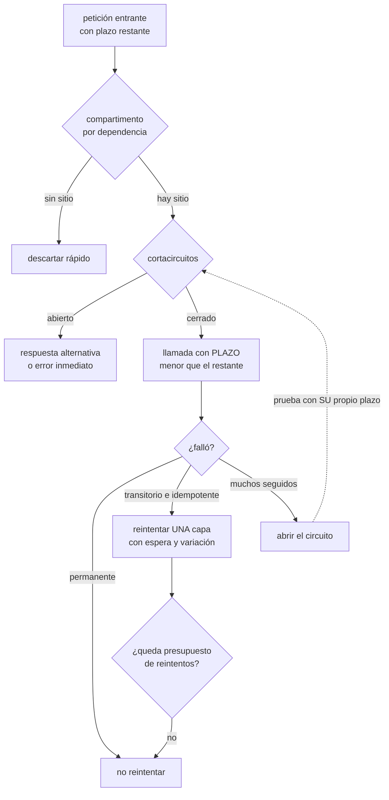

# 130 — Timeouts, retries, backoff, circuit breaker y bulkhead

> [← Clase anterior](../../part-10-observability-sre-reliability/129-capacidad-rendimiento-y-pruebas-de-carga/README.md) · [Índice de la parte](../README.md) · [Clase siguiente →](../../part-10-observability-sre-reliability/131-chaos-engineering-y-game-days/README.md)

**Parte:** 10 — Observabilidad, SRE y confiabilidad<br>
**Nivel:** avanzado · **Horas estimadas:** 4<br>
**Laboratorio:** `reliability` · **Estado:** `EXECUTABLE_CORE`

## 🎯 Propósito

Decidir qué hace un servicio cuando aquello de lo que depende falla o se pone lento, sabiendo que **el comportamiento por defecto es el peor posible**: esperar indefinidamente, reintentar de inmediato y compartir los mismos recursos entre todas las dependencias. La clase da los cinco mecanismos que lo corrigen, insiste en el que más incidentes evita y menos se aplica —**el plazo, y que ese plazo se herede**—, hace la aritmética de la amplificación de reintentos, y ordena los cinco, porque aplicados en el orden equivocado no sirven.

## 📚 Resultados de aprendizaje

Al finalizar podrás:

1. **Fijar** plazos a partir de datos y propagarlos entre servicios.
2. **Calcular** la amplificación de reintentos y limitarla a una capa.
3. **Configurar** un cortacircuitos que se abra y que además se cierre.
4. **Aislar** dependencias para que una lenta no consuma todos los recursos.
5. **Rechazar** pronto cuando hay sobrecarga, en vez de encolar sin límite.

## 🧩 Conceptos centrales

| Concepto | Comprensión verificable |
|---|---|
| `plazo` | Tiempo máximo que se espera una respuesta. Sin él, los recursos propios quedan retenidos por el problema de otro. |
| `presupuesto de plazo` | Lo que queda del plazo de quien llamó. Trabajar más allá de él es trabajo que nadie recibirá. |
| `amplificación` | Multiplicación de la carga cuando varias capas reintentan a la vez. Es exponencial en el número de capas. |
| `cortacircuitos` | Mecanismo que deja de llamar a una dependencia que falla, falla rápido y prueba de vez en cuando si ya se recuperó. |
| `compartimento estanco` | Recursos separados por dependencia, para que la saturación de una no consuma los de todas. |
| `descarte por sobrecarga` | Rechazar peticiones deprisa cuando no hay capacidad, en vez de aceptarlas y no poder atenderlas. |
| `cola acotada` | Cola con tamaño máximo. Una cola sin límite convierte un problema de capacidad en uno de latencia y luego en uno de memoria. |

## 🧠 Modelo mental

La confiabilidad es una característica del servicio percibido por usuarios; SRE la administra con objetivos explícitos y presupuestos de error.

Aplicado a esta clase, separa siempre cuatro planos: **intención** (qué necesita el usuario),
**configuración** (qué declaramos), **estado observado** (qué existe de verdad) y
**evidencia** (cómo sabemos que cumple). Confundirlos produce diseños que se ven correctos
en un diagrama pero fallan al operar.

## 🗺️ Flujo de razonamiento



## 📖 Desarrollo

### 1. El plazo, y que se herede

Es el mecanismo más importante de los cinco y el que más veces falta.

```text
sin plazo
  la dependencia se queda pensando 90 s
  → el hilo, la conexión y la memoria de la petición siguen ocupados
  → con suficientes peticiones, el servicio se llena
  → y deja de responder a CUALQUIER COSA, no solo a lo que dependía de ella
```

Y eso es el fallo en cascada: **el problema de otro consume tus recursos**.

Cómo se elige el valor, que no es un número redondo:

```text
se parte del percentil 99 de la dependencia, medido      p99 = 180 ms
se añade margen                                          ×1,5
plazo                                                    ~270 ms
```

Y las dos comprobaciones que evitan los errores típicos:

```text
si el plazo es mucho mayor que el p99, no protege de nada
  → 30 s sobre un p99 de 180 ms es como no tener plazo
si es menor que el p99, se cortan peticiones que iban bien
  → y se convierte en un generador de errores propio
```

Y hay más de un plazo que fijar, y se olvidan tres:

```text
conexión           establecer la conexión: corto, 1-2 s
lectura            esperar la respuesta: el del cálculo anterior
TOTAL de la llamada  incluidos los reintentos
de la petición completa  el que ve el usuario
```

El tercero es el que más sorprende: **con tres reintentos y un plazo de 5 s cada uno, la llamada puede durar veinte segundos** aunque cada intento respete su plazo.

**El presupuesto de plazo**, que es la versión correcta y casi nadie aplica:

```text
el usuario espera como mucho 2 s
  la puerta de entrada llama con 1,9 s de presupuesto
    pedidos llama a precios con 1,2 s restantes
      precios llama a la base con 400 ms restantes
```

Y la regla que lo hace útil:

```text
si el presupuesto restante es menor que lo que suele tardar la llamada,
NO se llama: se falla ya
→ porque el resultado llegaría cuando nadie lo espera
```

Eso evita el trabajo inútil, que en una sobrecarga es una parte enorme de la carga: **el sistema procesando peticiones que el cliente ya abandonó**.

Y se implementa propagando el plazo restante en una cabecera y respetándolo en cada salto.

### 2. Reintentar sin multiplicar

La clase 113 fijó cómo se reintenta —espera creciente, variación, límite— y aquí falta lo que ocurre cuando **varias capas reintentan a la vez**:

```text
cliente móvil          reintenta 3 veces
puerta de entrada      reintenta 3 veces
servicio de pedidos    reintenta 3 veces
cliente de la base     reintenta 3 veces
                    ────────────────────
                    3⁴ = 81 llamadas por cada petición original
```

Ochenta y una llamadas a un sistema que ya está mal. **La amplificación es exponencial en el número de capas**, no lineal.

Y la regla que lo corta:

```text
REINTENTAR EN UNA SOLA CAPA
  la más cercana al fallo que tenga información suficiente
  y las demás propagan el error sin reintentar
```

Y un mecanismo mejor que el límite por llamada, porque acota el total:

```text
PRESUPUESTO DE REINTENTOS
  «los reintentos no pueden superar el 10 % de las peticiones normales»
  → con todo bien, hay margen de sobra
  → cuando la dependencia falla al 50 %, los reintentos se cortan solos
  → y el sistema deja de amplificar exactamente cuando importa
```

Es superior al límite por llamada porque **el límite por llamada no sabe nada del estado global**: tres reintentos por petición son inofensivos con una petición y devastadores con diez mil.

Y el recordatorio de las clases 113 y 116, que aquí es condición previa:

```text
solo se reintenta lo TRANSITORIO
y solo si repetir no añade efecto
→ reintentar un cobro no idempotente es cobrar dos veces
```

Y una alternativa que a veces vale más que reintentar: **pedir a dos sitios y quedarse con el primero**. Cuesta el doble de llamadas y elimina la cola de latencia, y es razonable en lecturas baratas del camino crítico.

### 3. Cortacircuitos y compartimentos

**El cortacircuitos** deja de llamar a lo que está roto:

```text
CERRADO   pasa todo; se cuentan fallos y lentitud
          si superan el umbral en una ventana → se abre
ABIERTO   no se llama: se falla al instante o se sirve alternativa
          → deja de gastarse tiempo y deja de castigarse a la dependencia
SEMIABIERTO  pasado un tiempo, se dejan pasar unas pocas pruebas
          si van bien → cerrado; si no → abierto otra vez
```

Lo que aporta es doble y conviene tenerlo claro:

```text
protege al LLAMANTE   deja de esperar por algo que va a fallar
protege al LLAMADO    deja de recibir carga mientras se recupera
```

Y los tres errores de configuración habituales:

```text
umbral por número absoluto de fallos
  → con poco tráfico se abre por tres errores casuales
  → mejor por PROPORCIÓN, con un mínimo de peticiones para evaluar

ventana demasiado corta
  → se abre y se cierra continuamente

la prueba del estado semiabierto sin plazo propio
  → si la dependencia está lenta, la prueba también se queda esperando
  → el circuito NUNCA se cierra, aunque la dependencia ya funcione
```

El tercero es el más traicionero: **el circuito abierto se queda abierto para siempre** y hace falta un reinicio para arreglarlo.

Y dos decisiones más:

```text
un circuito POR DEPENDENCIA, no uno global
estado por instancia o compartido
  por instancia: simple, y cada una aprende por su cuenta
  compartido: reacciona antes, y añade una dependencia más
```

**Los compartimentos estancos** son el mecanismo que de verdad evita el colapso total:

```text
sin compartimentos
  un grupo de 200 hilos para todo
  una dependencia lenta ocupa los 200
  → el servicio deja de atender también lo que no la usa

con compartimentos
  precios: 40    catálogo: 40    pago: 30    resto: 90
  → la dependencia lenta agota SUS 40 y nada más
  → el resto del servicio sigue funcionando
```

Y el efecto en la disponibilidad es exactamente lo que la clase 126 necesitaba: **una dependencia caída deja de ser una caída propia**.

Y conviene medir por compartimento:

```text
ocupación de cada uno, y rechazos por compartimento lleno
→ un compartimento siempre lleno está mal dimensionado
→ o su dependencia está permanentemente degradada
```

### 4. Rechazar pronto, y en qué orden se aplica todo

**Cuando llega más trabajo del que se puede hacer**, hay dos opciones y solo una es buena:

```text
ENCOLAR SIN LÍMITE
  se aceptan todas y se atienden despacio
  → la latencia crece hasta que nadie espera ya la respuesta
  → y se sigue trabajando para clientes que se fueron
  → y la memoria crece hasta que el proceso muere

RECHAZAR DEPRISA
  se acepta lo que se puede atender y el resto se rechaza al instante
  → el cliente recibe un error rápido y puede reaccionar
  → y el sistema sigue sirviendo a quienes sí acepta
```

Y la regla que resume esto: **toda cola tiene que estar acotada**, incluida la que no se ve —la de conexiones aceptadas y no atendidas—.

Y el descarte se hace con criterio, no al azar:

```text
por prioridad     las comprobaciones de salud y el camino crítico primero
                  lo secundario se descarta antes
por antigüedad    descartar lo más viejo, no lo más nuevo:
                  lo viejo probablemente ya no lo espera nadie
por cliente       proteger a los demás de uno que abusa   clase 118
```

La segunda es contraintuitiva y correcta.

**Las respuestas alternativas**, que es lo que se sirve con el circuito abierto:

```text
valor cacheado, aunque esté caducado          clase 111
valor por defecto: precio base, sin descuento
respuesta parcial: la página sin esa sección  clase 124
colar el trabajo para hacerlo después         clase 113
error claro, si ninguna de las anteriores sirve
```

Y la advertencia imprescindible: **una alternativa que no se prueba no funciona**. Se ensaya, y de eso trata la clase 131.

**El orden en que se aplican los cinco**, que importa:

```text
1. COMPARTIMENTO   antes de nada: ¿hay recursos para esta dependencia?
2. CORTACIRCUITOS  ¿tiene sentido intentarlo siquiera?
3. PLAZO           con el presupuesto restante
4. REINTENTO       solo si es transitorio, idempotente y hay presupuesto
5. ALTERNATIVA     si nada de lo anterior dio resultado
```

Y el error frecuente es ponerlos al revés: **reintentar dentro del compartimento consume sus recursos tres veces**, y un cortacircuitos por detrás del reintento cuenta los tres intentos como tres fallos y se abre demasiado pronto.

Y la lista de comprobación de la clase:

```text
☐ toda llamada remota tiene plazo, y sale de datos medidos
☐ hay plazo de conexión, de lectura y total con reintentos
☐ el plazo restante se propaga y se respeta en cada salto
☐ no se llama si el presupuesto restante no da para la llamada
☐ solo reintenta una capa, y está escrito cuál
☐ hay presupuesto global de reintentos, no solo límite por llamada
☐ solo se reintenta lo transitorio e idempotente
☐ hay un cortacircuitos por dependencia, con umbral por proporción
☐ la prueba del estado semiabierto tiene su propio plazo
☐ hay compartimentos por dependencia, y se mide su ocupación
☐ todas las colas están acotadas, incluidas las de aceptación
☐ el descarte prioriza y descarta lo más antiguo
☐ las respuestas alternativas se ensayan
```

Y el cierre que enlaza con la clase siguiente: los cinco mecanismos están configurados y **nadie ha comprobado que funcionen**. Provocar el fallo a propósito, en un entorno controlado y luego en producción, es la materia de la clase 131.

## 🔬 Ejemplo trabajado

**CloudShop sufre una caída total cuando el servicio de recomendaciones —que es opcional— se pone lento. El ejercicio consiste en reconstruir por qué algo opcional tumbó el sistema, y aplicar los cinco mecanismos midiendo cada uno.**

**El incidente que lo motiva.**

```text
10:14  el servicio de recomendaciones empieza a tardar 30 s por llamada
       (no falla: TARDA)
10:15  los hilos del servicio de portada se van ocupando
10:17  los 200 hilos están esperando a recomendaciones
10:17  la portada deja de responder a CUALQUIER COSA, incluso a lo que no la usa
10:18  la comprobación de salud tampoco responde: se reinician instancias
10:19  las instancias nuevas se llenan igual en 40 s
10:23  las comprobaciones fallidas sacan instancias del reparto
10:31  caída total del sitio
10:52  se identifica y se apaga recomendaciones con un interruptor
10:54  recuperado

duración                                              40 min
causa                       una dependencia OPCIONAL, que no fallaba
```

Y el diagnóstico con el vocabulario de esta clase:

```text
sin plazo                    la llamada esperaba 30 s
sin compartimento            los 200 hilos eran compartidos
sin cortacircuitos           se seguía llamando a algo que no respondía
sin alternativa              no había forma de servir sin recomendaciones
la salud compartía hilos     así que el reinicio empeoró todo
```

**Corrección 1: plazos, medidos.**

```text
dependencia        p99 medido    plazo fijado
recomendaciones       210 ms        300 ms
catálogo               96 ms        150 ms
precios                41 ms         80 ms
inventario             88 ms        150 ms
pago                  680 ms      1.200 ms
base de datos          14 ms         50 ms
```

Y tres plazos que faltaban por completo:

```text
plazo de conexión                    no había  →  1 s
plazo total con reintentos           no había  →  2× el de lectura
plazo de la petición completa        no había  →  2 s
```

Y el efecto inmediato al repetir el incidente en un ensayo:

```text                                    sin plazo      con plazo
hilos ocupados por recomendaciones          200            varía
tiempo hasta que la portada se llena         3 min         no se llena
latencia de la portada durante el fallo    sin respuesta   +300 ms
```

**Corrección 2: la amplificación, medida.**

Al instrumentar el conteo de llamadas por petición original durante un fallo:

```text
peticiones originales de usuario                        1.000
llamadas recibidas por el servicio de precios           7.400
```

Siete coma cuatro llamadas por petición. Y las capas que reintentaban:

```text
cliente móvil                          2 reintentos
puerta de entrada                      2
servicio de portada                    2
cliente HTTP de la biblioteca          1   ← nadie sabía que reintentaba
```

La última es la que suele sorprender: **el cliente HTTP reintentaba por su cuenta**, con la configuración por defecto de la librería.

```text                                    antes            después
capas que reintentan                       4                1 (la portada)
llamadas por petición durante un fallo     7,4              1,3
presupuesto de reintentos                  no había         10 %
qué pasa con el 50 % de fallos       reintentos ×3     reintentos cortados
                                                       al llegar al 10 %
```

**Corrección 3: el cortacircuitos que no se cerraba.**

La primera versión se configuró así:

```text
umbral: 5 fallos consecutivos
ventana: 10 s
prueba semiabierta: 1 llamada cada 30 s, SIN plazo propio
```

Y en el primer uso real:

```text
14:20  recomendaciones se degrada; el circuito se abre. Correcto.
14:26  recomendaciones se recupera
14:26  la prueba semiabierta se lanza… y usa el plazo por defecto,
       que era el heredado de la llamada normal
14:26  la prueba se queda esperando y se cuenta como fallo
17:40  el circuito sigue abierto 3 h 14 después de la recuperación
```

Tres horas y catorce minutos sin recomendaciones **por un fallo de configuración de la prueba**.

```text                                    antes            después
umbral                              5 fallos absolutos   50 % en 30 s,
                                                         mínimo 20 peticiones
prueba semiabierta                  1 sin plazo          3 con plazo de 500 ms
aperturas por ruido con poco tráfico   11 / mes             0
tiempo medio hasta cerrar tras
recuperarse                          no cerraba           38 s
```

**Corrección 4: los compartimentos.**

```text                                    antes            después
hilos                                 200 compartidos    por dependencia:
                                                         precios 40
                                                         catálogo 40
                                                         inventario 30
                                                         recomendaciones 20
                                                         pago 30
                                                         resto 40
salud y camino crítico              mismos hilos       hilos propios: 10
```

Y el ensayo del mismo fallo, con todo aplicado:

```text                                    incidente real   con los 5 mecanismos
duración                                   40 min             0
peticiones fallidas                        100 %              0 %
latencia de la portada                  sin respuesta      +40 ms
funcionalidad perdida                      todo         solo recomendaciones
comprobaciones de salud                    fallaban       correctas
instancias reiniciadas por error              34              0
```

**Corrección 5: descartar y responder algo.**

```text                                          antes         después
cola de aceptación                        sin límite      500, con descarte
qué se descarta                              nada       lo más antiguo primero
respuesta con el circuito abierto        error 500     portada sin la sección
valor caducado servible                      no             sí, hasta 1 h
```

Y el ensayo de sobrecarga, comparado con la clase 129:

```text                                    cola sin límite   cola acotada
carga aplicada                            6.000/s           6.000/s
peticiones atendidas correctamente        410/s            3.700/s
p99 de las atendidas                     41 s              210 ms
peticiones rechazadas al instante          0               2.300/s
memoria del proceso                       creciente        estable
```

**Atendiendo menos peticiones se atienden nueve veces más**, porque dejan de gastarse recursos en peticiones que ya nadie espera.

**El orden, comprobado.**

La primera implantación puso el reintento por dentro del compartimento:

```text
reintento dentro del compartimento
  → cada petición ocupaba su hueco 3 veces
  → el compartimento de 40 se comportaba como uno de 13
  → y el cortacircuitos contaba 3 fallos por cada fallo real
     y se abría tres veces más rápido de lo previsto
```

```text                                    orden incorrecto   orden correcto
capacidad efectiva del compartimento         13 de 40           40 de 40
aperturas del circuito por mes                 14                  3
```

**A los cuatro meses.**

```text                                          antes         después
llamadas remotas con plazo                    31 %           100 %
plazo propagado entre servicios                 no             sí
capas que reintentan                             4              1
llamadas por petición durante un fallo         7,4            1,3
cortacircuitos por dependencia                   0             11
compartimentos                                   0              6
colas acotadas                                   0        todas (7)
caídas totales por una dependencia lenta   2 / 6 meses          0
disponibilidad del flujo de compra          99,21 %         99,74 %
peticiones atendidas en sobrecarga           410/s          3.700/s
```

**La lección que esta clase traslada a la parte 10**: la caída de cuarenta minutos la provocó **una dependencia opcional que ni siquiera fallaba**: solo tardaba. Y de los cinco mecanismos, los dos que la habrían evitado por sí solos son los más aburridos —**poner un plazo y separar los hilos**—. Los otros tres mejoran el sistema, y el más vistoso, el cortacircuitos, estuvo tres horas dejando el servicio degradado por un fallo propio de configuración: **un mecanismo de resiliencia mal ajustado es una fuente de incidentes más**.

## 🧪 Laboratorio guiado

Ejecuta desde la raíz:

```bash
python classes/part-10-observability-sre-reliability/130-timeouts-retries-backoff-circuit-breaker-y-bulkhead/lab.py
```

El laboratorio selecciona el motor de práctica **`reliability`** y produce
`lab_result.json`. El escenario, sus comprobaciones y el artefacto esperado corresponden a
esta clase; no requiere credenciales y deja explícito qué debe revalidarse en un sandbox real.

1. Lee `exercise.steps` y formula una predicción antes de ejecutar.
2. Ejecuta la práctica y verifica todos los elementos de `checks`.
3. Provoca el caso de `negative_test` y explica la señal observada.
4. Materializa `cliente-resiliente` en `evidence/` usando la plantilla indicada.
5. Para proveedor real, sigue `sandbox.requires`, registra costo y ejecuta `destroy`.

### Evidencia esperada

El artefacto principal es un escenario de fallo con objetivo y recuperación medida. Además, la entrega debe incluir el comando ejecutado,
la salida estructurada y una conclusión que no exceda lo observado.

## 🏆 Reto verificable

Construye **`cliente-resiliente`** para el caso CloudShop. Incluye una alternativa descartada,
un supuesto que pueda falsarse, una prueba de fallo y una decisión de rollback.

## ✅ Criterio de aceptación

- [ ] `lab.py` termina con código 0 y genera JSON válido.
- [ ] La entrega conecta al menos tres requisitos con mecanismos verificables.
- [ ] Existe una prueba positiva y una prueba negativa con evidencia.
- [ ] Seguridad, costo y operación aparecen como decisiones, no como anexos.
- [ ] Se declara una limitación y una condición que obligaría a revisar el diseño.
- [ ] Otra persona puede repetir el recorrido sin conocimiento tácito.

## ⚠️ Errores frecuentes

| Síntoma | Causa probable | Corrección |
|---|---|---|
| Una dependencia lenta deja sin respuesta al servicio entero | No hay plazo y los recursos quedan retenidos esperando | Plazo en toda llamada remota, calculado desde el percentil 99 medido, y compartimentos separados por dependencia. |
| Durante un fallo, la dependencia recibe muchas más llamadas de las que se le hacen | Varias capas reintentan a la vez y la amplificación es exponencial | Reintenta en una sola capa, escríbelo, revisa lo que hacen las librerías por su cuenta y añade presupuesto global de reintentos. |
| El circuito se abre y no vuelve a cerrarse aunque la dependencia funcione | La prueba del estado semiabierto no tiene plazo propio y se cuenta como fallo | Plazo corto y propio para las pruebas, varias pruebas en vez de una, y umbral por proporción con mínimo de peticiones. |
| El sistema acepta todo y no atiende casi nada | Colas sin límite: se sigue trabajando para clientes que ya se fueron | Acota todas las colas, rechaza deprisa cuando no hay capacidad y descarta primero lo más antiguo. |
| El compartimento se comporta como si tuviera un tercio de su tamaño | El reintento está por dentro del compartimento y ocupa su hueco varias veces | Aplica el orden: compartimento, cortacircuitos, plazo, reintento, alternativa. |
| La respuesta alternativa falla justo cuando se necesita | Nunca se ha ejecutado | Ensaya las alternativas periódicamente provocando el fallo de la dependencia. |

## 🛡️ Seguridad, ética y costo

Trabaja con cuentas propias o sandboxes autorizados. No publiques secretos, identificadores
reales ni datos personales. Antes de crear recursos pagos define presupuesto, etiquetas y
comando de destrucción; después verifica que no queden recursos huérfanos. Los ejemplos
locales enseñan contratos, pero no certifican cumplimiento ni disponibilidad de producción.

## ❓ Preguntas de comprobación

1. ¿Por qué una llamada sin plazo puede tumbar un servicio entero?
2. ¿Qué es el presupuesto de plazo y qué evita?
3. ¿Cuánto amplifica la carga que cuatro capas reintenten tres veces?
4. ¿Por qué un presupuesto global de reintentos es mejor que un límite por llamada?
5. ¿En qué orden se aplican los cinco mecanismos y qué pasa si se invierten dos?

## 🔗 Referencias

- Nygard, M. (2018). *Release It!*, caps. 4 y 5 — plazos, cortacircuitos, compartimentos y fallos en cascada. <https://pragprog.com/titles/mnee2/release-it-second-edition/>
- AWS (2025). *Timeouts, retries and backoff with jitter* — cálculo de plazos y amplificación. <https://aws.amazon.com/builders-library/timeouts-retries-and-backoff-with-jitter/>
- Google SRE (2025). *Addressing cascading failures* — descarte por sobrecarga, colas acotadas y presupuesto de reintentos. <https://sre.google/sre-book/addressing-cascading-failures/>
- gRPC (2025). *Deadlines and deadline propagation* — presupuesto de plazo heredado entre servicios. <https://grpc.io/docs/guides/deadlines/>
- Dean, J. y Barroso, L. (2013). *The tail at scale* — peticiones duplicadas y respuesta parcial como alternativas al reintento. <https://research.google/pubs/pub40801/>
- Documentación oficial vigente del servicio implementado; registra URL y fecha de consulta.

---

> [Evaluación](assessment.md) · [Contrato de clase](lesson.yaml) · [Índice de la parte](../README.md)
