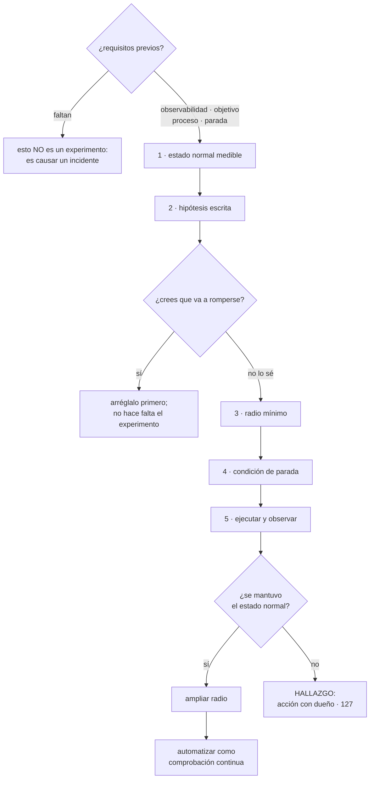

# 131 — Chaos engineering y game days

> [← 130 · Timeouts, retries, backoff, circuit breaker y bulkhead](../../part-10-observability-sre-reliability/130-timeouts-retries-backoff-circuit-breaker-y-bulkhead/README.md) · [Índice de la parte](../README.md) · [132 · Proyecto: operación SRE de CloudShop →](../../part-10-observability-sre-reliability/132-proyecto-operacion-sre-de-cloudshop/README.md)

**Parte:** 10 — Observabilidad, SRE y confiabilidad<br>
**Nivel:** avanzado · **Horas estimadas:** 4<br>
**Laboratorio:** `chaos` · **Estado:** `EXECUTABLE_CORE`

## 🎯 Propósito

Comprobar que todo lo de las clases 121 a 130 funciona de verdad, y la única forma de comprobarlo es provocarlo. La clase distingue un experimento —con estado normal definido, hipótesis escrita, radio acotado y condición de parada— de romper cosas al azar; establece los requisitos previos sin los cuales esto es solo causar incidentes; y añade la parte que la automatización no cubre: **ensayar con personas, porque los procedimientos, los permisos y los relevos solo fallan cuando hay alguien ejecutándolos**.

## 📚 Resultados de aprendizaje

Al finalizar podrás:

1. **Formular** un experimento con estado normal, hipótesis, radio y parada.
2. **Comprobar** los requisitos previos antes de provocar nada.
3. **Elegir** qué fallo inyectar según lo que se quiere verificar.
4. **Organizar** un ensayo con personas que ponga a prueba el proceso, no solo el sistema.
5. **Convertir** los experimentos en comprobaciones continuas que no se pudran.

## 🧩 Conceptos centrales

| Concepto | Comprensión verificable |
|---|---|
| `estado normal` | Descripción medible de que el sistema funciona. Se toma del objetivo de la clase 126, no se inventa. |
| `hipótesis` | Afirmación previa y falsable: «si ocurre X, el estado normal se mantiene». Sin ella no hay experimento. |
| `radio de afectación` | Cuánto del sistema y cuántos usuarios pueden verse afectados. Se empieza por el mínimo y se amplía. |
| `condición de parada` | Umbral escrito de antemano que detiene el experimento automáticamente. Es lo que lo hace responsable. |
| `inyección de latencia` | Hacer que una dependencia tarde en lugar de fallar. Es el fallo más dañino y el menos ensayado. |
| `ensayo con personas` | Ejercicio anunciado en el que un equipo responde a un fallo real siguiendo el proceso. Prueba lo que ninguna automatización prueba. |

## 🧠 Modelo mental

La confiabilidad es una característica del servicio percibido por usuarios; SRE la administra con objetivos explícitos y presupuestos de error.

Aplicado a esta clase, separa siempre cuatro planos: **intención** (qué necesita el usuario),
**configuración** (qué declaramos), **estado observado** (qué existe de verdad) y
**evidencia** (cómo sabemos que cumple). Confundirlos produce diseños que se ven correctos
en un diagrama pero fallan al operar.

## 🗺️ Flujo de razonamiento



## 📖 Desarrollo

### 1. Un experimento, no una travesura

La diferencia entre esto y romper cosas al azar es el método, y son cinco pasos:

```text
1. ESTADO NORMAL
   qué significa que el sistema funciona, con números
   → sale del objetivo de la clase 126, no se inventa uno nuevo
   → «proporción de pedidos completados ≥ 99,5 %, p99 < 500 ms»

2. HIPÓTESIS
   «si el servicio de precios deja de responder, el estado normal
    se mantiene sirviendo el precio base»
   → escrita ANTES, y falsable

3. RADIO
   el mínimo que permita observar algo: una instancia, un 1 % del tráfico,
   un entorno, una zona

4. CONDICIÓN DE PARADA
   «si los errores superan el 2 % o el presupuesto consumido supera
    el 5 %, se detiene automáticamente»
   → escrita antes, y automática, no «alguien lo estará mirando»

5. EJECUTAR, OBSERVAR Y CONCLUIR
   y publicar el resultado, se confirme o no la hipótesis
```

Y la regla que más malentendidos evita:

```text
si estás bastante seguro de que se va a romper, NO hagas el experimento
→ arréglalo, que ya sabes lo que va a pasar
→ el experimento sirve para comprobar creencias, no para descubrir
  lo evidente
```

Y su contraria: **un experimento que nunca falla tampoco aporta**. Si diez experimentos seguidos confirman la hipótesis, hay que subir la dificultad.

**Los requisitos previos**, sin los cuales esto no es un experimento sino un incidente provocado:

```text
observabilidad suficiente para ver el efecto        clases 121-124
un objetivo que defina el estado normal             clase 126
proceso de incidentes por si se va de las manos     clase 127
un botón de parada que funcione, probado antes
y aviso previo a quien esté de guardia
```

El cuarto merece énfasis: **lo primero que se prueba es la parada**, antes que ninguna otra cosa.

Y la postura organizativa, que decide si esto sobrevive:

```text
si el experimento rompe algo, eso es un HALLAZGO, no un fallo de nadie
→ y se trata como una revisión de incidente: acción, dueño y fecha
→ si se castiga, no se vuelve a hacer ningún experimento
```

### 2. Qué inyectar

Ordenado por lo que este programa ha demostrado que hace daño:

```text
LATENCIA en una dependencia
  la más valiosa y la menos ensayada
  → la caída de la clase 130 la provocó algo que NO fallaba: tardaba
  → verifica plazos, compartimentos y cortacircuitos a la vez

ERROR en una dependencia
  devolver 500 o rechazar conexiones
  → verifica alternativas y presupuesto de reintentos

AGOTAMIENTO DE RECURSOS
  llenar el agrupador de conexiones, los hilos, el disco, la memoria
  → verifica saturación, descarte y colas acotadas

MUERTE DE INSTANCIAS
  la más conocida y la menos informativa en sistemas modernos:
  casi siempre funciona

PÉRDIDA DE UNA ZONA
  verifica reparto, cuotas y capacidad restante

PARTICIÓN DE RED
  el caso duro: los dos lados vivos y sin verse
  → verifica plazos y comportamiento ante ambigüedad

DESFASE DE RELOJ
  rompe expiraciones, firmas y ordenaciones por tiempo

CADUCIDAD de certificado o credencial
  → ensaya lo que la clase 125 alertaba como indicador adelantado
```

Y los específicos de la parte 09, que casi nadie ensaya y que causaron la mayoría de sus incidentes:

```text
entregar el mismo mensaje dos veces               clase 116
entregar mensajes desordenados                    clase 114
conmutar la base de datos                         clase 109
vaciar el caché en hora punta                     clase 111
parar un consumidor o un publicador               clases 113, 116
reanudar instancias del motor con código nuevo    clase 119
```

Y dos que se ensayan poco y valen mucho:

```text
LA DEPENDENCIA QUE RESPONDE MAL
  no falla ni tarda: devuelve datos incorrectos o vacíos
  → verifica validación y si el sistema propaga basura

LA PROPIA TELEMETRÍA CAÍDA
  → verifica que la aplicación no se cae con ella (clases 121, 122)
  → y que alguien se entera de que no hay datos (clase 123)
```

Y dónde se ejecuta, con una postura honesta:

```text
ENTORNO APARTE   primero siempre; verifica caminos de código
                 y no dice nada sobre la escala real
PRODUCCIÓN       la única que dice la verdad
                 con radio del 1 %, en horas valle, con parada automática
                 atada al presupuesto de error
```

Y el argumento para llegar a producción, que conviene tener preparado: **el fallo va a ocurrir en producción de todos modos**; la elección es si ocurre un martes a las once con el equipo mirando, o un domingo a las cuatro de la madrugada.

### 3. Ensayar con personas

La automatización comprueba el sistema. Un ensayo con personas comprueba lo que la automatización nunca toca:

```text
¿el procedimiento sirve a quien no lo escribió?          clase 128
¿quien está de guardia tiene los permisos?
¿el proceso de incidentes se sigue de verdad?            clase 127
¿alguien sabe a quién escalar, y esa persona responde?
¿las herramientas están accesibles desde fuera de la oficina?
¿el canal, el documento y los avisos funcionan?
```

Y el formato que funciona:

```text
ANUNCIADO      fecha conocida; no se trata de pillar a nadie
ACOTADO        un escenario, 60-90 minutos
CON OBSERVADOR quien conoce la respuesta correcta apunta y NO ayuda
CON PARADA     el observador corta si se va de las manos
CON REVISIÓN   media hora después, con la misma disciplina de la clase 127
```

Y dos variantes que enseñan mucho:

```text
SIN QUIEN LO CONSTRUYÓ
  quien construyó el servicio no participa: solo observa
  → revela cuánto conocimiento vive en una sola cabeza

CON ESCENARIO OCULTO
  el equipo sabe que hay ejercicio, no cuál es el fallo
  → prueba el diagnóstico, no la memoria
```

Y los hallazgos típicos, que rara vez son técnicos:

```text
el procedimiento existe y quien está de guardia no lo encuentra
faltan permisos, y pedirlos tarda más que el incidente
el escalado apunta a alguien que cambió de equipo
nadie sabe quién comunica a los clientes
el panel que hace falta no existe
y la herramienta de emergencia requiere una credencial que caducó
```

Y una regla de higiene: **el ensayo termina con acciones, dueño y fecha**, exactamente igual que un incidente real. Si no, se convierte en una actividad simpática que no cambia nada.

Y la frecuencia razonable:

```text
ensayo con personas          trimestral, por equipo
experimento automático       continuo
escenario nuevo              al menos uno por trimestre
repetir un escenario viejo   una vez al año, para comprobar que sigue bien
```

La última es la que detecta las regresiones: **lo que se arregló hace un año puede haberse desarreglado**.

### 4. Que no se pudra

Un experimento ejecutado una vez comprueba el sistema de ese día. La ley 13 se aplica también aquí: **un experimento que dejó de ejecutarse no da ningún error**.

Lo que lo convierte en algo permanente:

```text
el experimento se escribe como código y vive en el repositorio
se ejecuta de forma programada, no cuando alguien se acuerda
su resultado es una comprobación que pasa o falla
y si falla, abre una tarea con dueño
```

Y conviene distinguir dos ritmos:

```text
EN LA CANALIZACIÓN   experimentos baratos y acotados, en preproducción
                     → matar una instancia, inyectar latencia en una
                       dependencia, devolver errores
                     → tardan minutos y detectan regresiones

PROGRAMADOS EN PRODUCCIÓN  los caros y los de radio mayor
                     → pérdida de zona, conmutación de base,
                       vaciado de caché
                     → mensual o trimestral, en ventana anunciada
```

Y las cifras con las que se mide el programa:

```text
escenarios en el catálogo
proporción ejecutada en el último trimestre
hallazgos por trimestre, y cuántos siguen abiertos
escenarios que fallan hoy y antes pasaban   ← regresiones
tiempo medio de detección durante los ensayos frente al de incidentes reales
```

La última es especialmente útil: **si en los ensayos se detecta en dos minutos y en los incidentes reales en veinte, el ensayo está siendo demasiado fácil** —normalmente porque todo el mundo sabe que hay ejercicio y está mirando—.

Y una advertencia sobre el alcance: **esto no sustituye al diseño**. Un sistema sin plazos ni compartimentos no necesita experimentos para saber que va a caerse; necesita la clase 130. Los experimentos son para comprobar lo que se cree que está resuelto.

Y la lista de comprobación de la clase:

```text
☐ hay observabilidad, objetivo y proceso de incidentes antes de empezar
☐ la parada automática está probada antes que ningún experimento
☐ cada experimento tiene estado normal, hipótesis, radio y parada escritos
☐ no se ejecutan experimentos cuyo resultado ya se conoce
☐ se inyecta latencia, no solo fallo
☐ el catálogo incluye los fallos propios de la parte 09
☐ se ensaya también la caída de la propia telemetría
☐ se empieza en un entorno aparte y se progresa a producción con radio mínimo
☐ hay ensayo con personas trimestral, con observador que no ayuda
☐ los hallazgos generan acciones con dueño y fecha
☐ los experimentos viven como código y se ejecutan programados
☐ se repite un escenario antiguo cada año para detectar regresiones
☐ romper algo en un experimento no se penaliza
```

Y el cierre que enlaza con la clase siguiente: con esto está completo el material de la parte 10. La clase 132 monta la operación entera y **califica las cinco predicciones de la clase 120**, empezando por la cifra que abrió la parte: tres de veintiún problemas detectados por una alerta.

## 🔬 Ejemplo trabajado

**CloudShop tiene configurados los cinco mecanismos de la clase 130 y ninguno verificado. El programa de experimentos empieza por lo más barato y termina descubriendo que dos de las tres cosas que fallan no son técnicas.**

**Experimento 0: la parada.**

Antes de nada se probó el botón de parada, y no funcionaba:

```text
el mecanismo de parada requería una credencial administrativa
que la persona designada no tenía
tiempo hasta poder parar un experimento, medido            11 min
corregido antes de ejecutar ningún experimento
```

**Experimento 1: latencia en una dependencia opcional.**

```text
estado normal   pedidos completados ≥ 99,5 % · p99 < 500 ms
hipótesis       «si recomendaciones tarda 5 s, el estado normal se mantiene
                 sirviendo la portada sin esa sección»
radio           1 % del tráfico, martes 11:00
parada          errores > 2 % o presupuesto consumido > 3 %
```

```text
resultado    HIPÓTESIS CONFIRMADA
  p99 de la portada durante el experimento          +38 ms
  peticiones servidas sin recomendaciones            0,9 %
  errores                                            0 %
  circuito abierto a los                             14 s
  circuito cerrado tras retirar la latencia          41 s
```

Y se amplió el radio al 25 % y luego al 100 %, con el mismo resultado. **Lo que en la clase 130 fue una caída de cuarenta minutos ahora es un experimento de rutina.**

**Experimento 2: la dependencia que responde mal.**

```text
hipótesis    «si el servicio de precios devuelve importes vacíos,
              el sistema los rechaza y sirve el precio base»
radio        entorno aparte, primero
```

```text
resultado    HIPÓTESIS REFUTADA
  el importe vacío se interpretaba como 0
  pedidos creados con importe 0 en el experimento           41
  el sistema NO validaba: propagaba
  llegó hasta la factura, en el entorno de pruebas
```

Cuarenta y un pedidos de cero euros. **Y este experimento no se ejecutó en producción** precisamente porque el resultado en el entorno aparte fue concluyente. Se añadió validación y se repitió:

```text
segunda ejecución    hipótesis confirmada; los importes vacíos se rechazan
                     y se sirve precio base
```

**Experimento 3: parar el publicador de la tabla de salida.**

```text
hipótesis   «si el publicador se para 20 min, la alerta de antigüedad avisa
             en menos de 5 y no se pierde ningún evento»
```

```text
resultado   PARCIALMENTE REFUTADA
  alerta de antigüedad                        avisó a los 4 min ✓
  eventos perdidos                            0 ✓
  al reanudar, 38.000 filas de golpe          los consumidores absorbieron ✓
  PERO: la alerta fue al buzón de un equipo que ya no existía
  tiempo real hasta que alguien la vio                     26 min
```

La alerta funcionaba y **su destinatario no**. Se revisaron los dueños de las setenta y tres alertas: **once apuntaban a equipos o personas que habían cambiado**.

**Experimento 4: pérdida de una zona.**

```text
hipótesis   «si se pierde una zona de tres, el servicio se mantiene
             con degradación menor del 10 % en latencia»
radio       producción, domingo 07:00, con parada automática
```

```text
resultado   REFUTADA por un motivo que nadie había previsto
  el reparto funcionó ✓
  las réplicas de la base conmutaron en 68 s ✓
  PERO la cuota de instancias de la cuenta impedía crear
  las instancias de reemplazo en las otras dos zonas
  capacidad disponible tras la pérdida               64 % de la necesaria
  latencia p99                                       1.900 ms
  parada automática activada a los                   3 min 20
```

Es exactamente el inventario de «lo que no escala solo» de la clase 129, y estaba mal:

```text                                          antes         después
cuota de instancias                            50           140
reserva para pérdida de zona                   no         sí, calculada
repetición del experimento                      —      hipótesis confirmada
```

**El primer ensayo con personas.**

```text
escenario oculto   inyección de latencia en la base de datos
equipo             cuatro personas de guardia rotatoria
observador         quien conocía el escenario, sin ayudar
duración prevista  90 min
```

```text
línea de tiempo del ensayo
11:00  se inyecta latencia
11:02  alerta de ritmo de consumo del presupuesto ✓
11:03  declarado; papeles asignados ✓
11:04  se consulta la línea de cambios: no hay cambios recientes ✓
11:09  se identifica la base como origen, por saturación del agrupador ✓
11:11  se busca el procedimiento: existe y está enlazado ✓
11:13  el procedimiento pide ejecutar una consulta de diagnóstico
       → quien está de guardia NO tiene permiso de lectura sobre
         las vistas del sistema
11:22  se localiza a alguien con permiso, que no estaba de guardia
11:31  diagnóstico completado
11:34  mitigado
```

```text
hallazgos del ensayo
  técnicos                                         1
  de permisos                                      3
  de procedimiento                                 4
  de proceso (quién comunica, a quién se escala)   2
```

**Nueve de diez hallazgos no eran técnicos.** Y el de permisos costó nueve de los treinta y cuatro minutos.

Y la variante sin quien lo construyó, dos meses después:

```text
escenario   consumidor de eventos detenido
resultado   el equipo tardó 41 min en algo que su autor resuelve en 6
causa       tres pasos del procedimiento suponían conocimiento no escrito
acción      reescritos y verificados con la prueba de la clase 128
repetición  a los 3 meses: 9 min
```

**El catálogo continuo.**

```text                                          mes 1         mes 6
escenarios en el catálogo                        4             23
en la canalización, por despliegue                0              6
programados en producción                         0              9
ensayos con personas                              0        2 por trimestre
hallazgos totales                                 —             41
  técnicos                                        —             17
  de permisos, procedimiento o proceso            —             24
hallazgos cerrados en plazo                       —        37 de 41
regresiones detectadas (pasaba antes, falla hoy)  —              3
```

Las tres regresiones son el argumento del apartado cuarto: **un plazo eliminado en una refactorización, un compartimento mal dimensionado tras un cambio de configuración y una alternativa que dejó de funcionar al cambiar un contrato**. Ninguna la habría detectado nada más.

**A los seis meses.**

```text                                          antes         después
mecanismos de la clase 130 verificados         0 de 5         5 de 5
escenarios ejecutados                             0             23
hallazgos                                         —             41
de ellos, no técnicos                             —             24
alertas con destinatario incorrecto              11              0
cuotas mal dimensionadas                          3              0
regresiones de resiliencia detectadas             —              3
incidentes reales en el semestre                  6              2
tiempo medio de mitigación en incidentes reales  14 min         7 min
```

**La lección que esta clase traslada a la parte 10**: de cuarenta y un hallazgos, **veinticuatro no eran del sistema**: eran permisos que la persona de guardia no tenía, procedimientos que suponían conocimiento no escrito, alertas que iban a equipos disueltos y una cuota mal dimensionada. Ninguno de los cinco mecanismos de la clase 130 falló en el primer experimento; lo que falló fue todo lo que los rodea. Y el hallazgo que mejor resume la clase ocurrió **antes del primer experimento**: el botón de parada no funcionaba.

## 🧪 Laboratorio guiado

Ejecuta desde la raíz:

```bash
python classes/part-10-observability-sre-reliability/131-chaos-engineering-y-game-days/lab.py
```

El laboratorio selecciona el motor de práctica **`chaos`** y produce
`lab_result.json`. El escenario, sus comprobaciones y el artefacto esperado corresponden a
esta clase; no requiere credenciales y deja explícito qué debe revalidarse en un sandbox real.

1. Lee `exercise.steps` y formula una predicción antes de ejecutar.
2. Ejecuta la práctica y verifica todos los elementos de `checks`.
3. Provoca el caso de `negative_test` y explica la señal observada.
4. Materializa `experimento-caos` en `evidence/` usando la plantilla indicada.
5. Para proveedor real, sigue `sandbox.requires`, registra costo y ejecuta `destroy`.

### Evidencia esperada

El artefacto principal es una hipótesis de resiliencia y criterio de abortar. Además, la entrega debe incluir el comando ejecutado,
la salida estructurada y una conclusión que no exceda lo observado.

## 🏆 Reto verificable

Construye **`experimento-caos`** para el caso CloudShop. Incluye una alternativa descartada,
un supuesto que pueda falsarse, una prueba de fallo y una decisión de rollback.

## ✅ Criterio de aceptación

- [ ] `lab.py` termina con código 0 y genera JSON válido.
- [ ] La entrega conecta al menos tres requisitos con mecanismos verificables.
- [ ] Existe una prueba positiva y una prueba negativa con evidencia.
- [ ] Seguridad, costo y operación aparecen como decisiones, no como anexos.
- [ ] Se declara una limitación y una condición que obligaría a revisar el diseño.
- [ ] Otra persona puede repetir el recorrido sin conocimiento tácito.

## ⚠️ Errores frecuentes

| Síntoma | Causa probable | Corrección |
|---|---|---|
| El experimento se convierte en un incidente real | No había condición de parada automática, observabilidad suficiente o proceso de incidentes | Comprueba los requisitos previos, prueba la parada antes que nada y ata la condición de corte al presupuesto de error. |
| Los experimentos no descubren nada nuevo | Se ejecutan solo escenarios cuyo resultado ya se conoce | Si estás seguro de que se romperá, arréglalo; si diez seguidos confirman la hipótesis, sube la dificultad. |
| Se ensaya la caída de dependencias y los incidentes reales los causa la lentitud | Solo se inyecta fallo, no latencia | Inyecta latencia como escenario principal: es lo que verifica plazos, compartimentos y cortacircuitos a la vez. |
| El sistema responde bien al experimento y el equipo no | Solo se ensaya de forma automática, sin personas | Ensayo trimestral con observador que no ayuda, escenario oculto y variante sin quien construyó el servicio. |
| Lo que se arregló hace un año vuelve a fallar | Los experimentos se ejecutaron una vez y no se repiten | Escríbelos como código, ejecútalos programados y repite un escenario antiguo cada año. |
| Nadie quiere volver a hacer experimentos | Cuando algo se rompió se trató como un fallo de alguien | Un hallazgo es el resultado esperado; se gestiona como una revisión de incidente, con acción, dueño y fecha. |

## 🛡️ Seguridad, ética y costo

Trabaja con cuentas propias o sandboxes autorizados. No publiques secretos, identificadores
reales ni datos personales. Antes de crear recursos pagos define presupuesto, etiquetas y
comando de destrucción; después verifica que no queden recursos huérfanos. Los ejemplos
locales enseñan contratos, pero no certifican cumplimiento ni disponibilidad de producción.

## ❓ Preguntas de comprobación

1. ¿Cuáles son los cinco pasos de un experimento y qué lo distingue de romper cosas?
2. ¿Qué requisitos previos hay que tener y cuál se prueba primero?
3. ¿Por qué la inyección de latencia es más valiosa que la de fallo?
4. ¿Qué comprueba un ensayo con personas que ninguna automatización comprueba?
5. ¿Por qué hay que repetir escenarios antiguos?

## 🔗 Referencias

- Basiri, A. y otros (2016). *Chaos engineering* — método, hipótesis y radio de afectación. <https://ieeexplore.ieee.org/document/7503833>
- Principles of Chaos (2025). *Principles of chaos engineering* — estado normal, experimentos en producción y automatización. <https://principlesofchaos.org/>
- Rosenthal, C. y Jones, N. (2020). *Chaos Engineering*, caps. 3-5 — madurez, adopción y ensayos con personas. <https://www.oreilly.com/library/view/chaos-engineering/9781492043850/>
- Google SRE (2025). *Disaster role playing and DiRT* — ensayos con personas y hallazgos organizativos. <https://sre.google/sre-book/accelerating-sre-on-call/>
- AWS (2025). *Fault Injection Service: experiment templates and stop conditions* — radio y condiciones de parada. <https://docs.aws.amazon.com/fis/latest/userguide/what-is.html>
- Documentación oficial vigente del servicio implementado; registra URL y fecha de consulta.

---

> [Evaluación](assessment.md) · [Contrato de clase](lesson.yaml) · [Índice de la parte](../README.md)

| Anterior | Índice | Siguiente |
|---|---|---|
| [← 130 · Timeouts, retries, backoff, circuit breaker y bulkhead](../../part-10-observability-sre-reliability/130-timeouts-retries-backoff-circuit-breaker-y-bulkhead/README.md) | [Parte 10](../README.md) · [Programa](../../README.md) | [132 · Proyecto: operación SRE de CloudShop →](../../part-10-observability-sre-reliability/132-proyecto-operacion-sre-de-cloudshop/README.md) |
