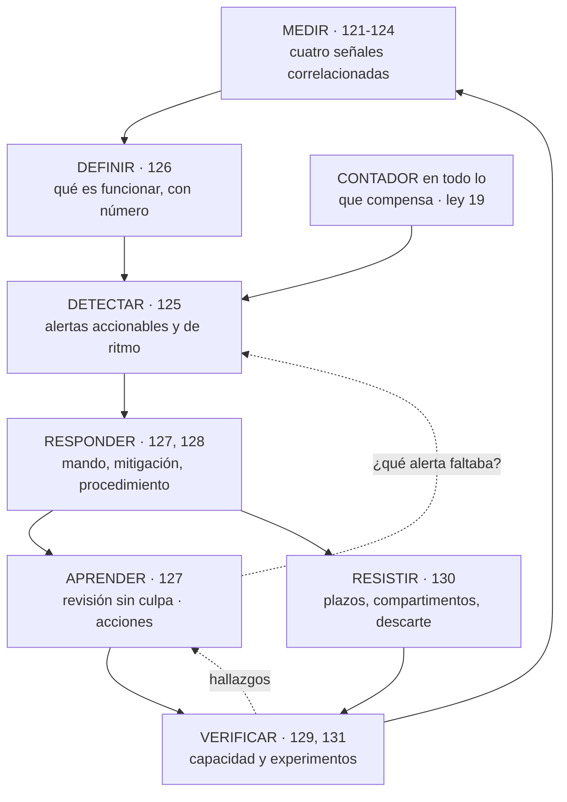

# 132 — Proyecto: operación SRE de CloudShop

> [← 131 · Chaos engineering y game days](../../part-10-observability-sre-reliability/131-chaos-engineering-y-game-days/README.md) · [Índice de la parte](../README.md) · [133 · Zero Trust y defensa en profundidad →](../../part-11-security-governance-finops/133-zero-trust-y-defensa-en-profundidad/README.md)

**Parte:** 10 — Observabilidad, SRE y confiabilidad<br>
**Nivel:** avanzado · **Horas estimadas:** 8<br>
**Laboratorio:** `capstone` · **Estado:** `EXECUTABLE_CORE`

## 🎯 Propósito

Montar la operación completa —señales, objetivos, alertas, incidentes, procedimientos, capacidad, resiliencia y experimentos— como un solo bucle, y cerrar la parte con las tres piezas de siempre: **calificar las cinco predicciones de la clase 120**, dos de las cuales fallaron y una se quedó muy corta; incorporar la ley que ha aparecido cuatro veces en estas doce clases y que es hermana de la ley 13; y escribir la predicción que la parte 11 tendrá que corregir.

## 📚 Resultados de aprendizaje

Al finalizar podrás:

1. **Describir** la operación como un bucle cerrado y no como una lista de herramientas.
2. **Montar** el conjunto sobre un servicio real y comprobarlo.
3. **Calificar** las cinco predicciones de la clase 120 con evidencia.
4. **Incorporar** la ley 19 al cuestionario, con sus cuatro apariciones.
5. **Escribir** la predicción de la parte 11 en términos que se puedan desmentir.

## 🧩 Conceptos centrales

| Concepto | Comprensión verificable |
|---|---|
| `bucle de operación` | Ciclo cerrado: medir, definir lo aceptable, detectar, responder, aprender y verificar. Cada pieza alimenta a la siguiente. |
| `ley 19` | Todo mecanismo que compensa un fallo automáticamente lo vuelve invisible. Sin contador, la compensación sustituye a la detección. |
| `medio de detección` | Cómo se supo de un problema. Es la medida de la operación, más que la duración del incidente. |
| `calificación de hipótesis` | Comparar lo predicho con lo ocurrido, publicando lo que se predijo mal y en qué medida. |
| `coste de saber` | Lo que cuesta la telemetría. Es un coste de ingeniería más y se gobierna como cualquier otro. |
| `hipótesis de la parte 11` | Predicción escrita ahora sobre lo que ocurrirá cuando el sujeto sea el control, el gobierno y el dinero. |

## 🧠 Modelo mental

La confiabilidad es una característica del servicio percibido por usuarios; SRE la administra con objetivos explícitos y presupuestos de error.

Aplicado a esta clase, separa siempre cuatro planos: **intención** (qué necesita el usuario),
**configuración** (qué declaramos), **estado observado** (qué existe de verdad) y
**evidencia** (cómo sabemos que cumple). Confundirlos produce diseños que se ven correctos
en un diagrama pero fallan al operar.

## 🗺️ Flujo de razonamiento



## 📖 Desarrollo

### 1. La operación es un bucle

Las once clases anteriores no son once herramientas: son un ciclo en el que cada pieza da de comer a la siguiente.

```text
MEDIR       cuatro señales, correlacionadas, con coste gobernado   121-124
   ↓        y sin las cuales lo demás no es posible
DEFINIR     qué significa funcionar, con un número                 126
   ↓        y de ahí sale el resto del presupuesto
DETECTAR    pocas alertas, accionables, por ritmo de consumo       125
   ↓        y con dueño
RESPONDER   declarar pronto, mitigar antes de diagnosticar,
   ↓        un cambio cada vez                                     127
            con procedimientos que sirvan a quien no los escribió  128
APRENDER    revisión sin culpa, y la pregunta obligatoria:
   ↓        ¿qué alerta faltaba?                                   127
VERIFICAR   que la capacidad da y que los mecanismos funcionan     129, 131
   ↓
(vuelta a MEDIR)
```

Y las dos flechas que cierran el bucle son las que más se olvidan:

```text
de APRENDER a DETECTAR    cada incidente produce la alerta que faltaba
                          → 48 de las 94 acciones de la clase 127
de VERIFICAR a APRENDER   cada experimento produce hallazgos
                          → 41 en seis meses en la clase 131
```

Sin ellas, el conjunto es estático: detecta lo que alguien anticipó el primer día y nada más.

Y una pieza transversal que atraviesa todo el bucle y que esta parte ha descubierto por el camino:

```text
CUANTO COMPENSA UN FALLO NECESITA UN CONTADOR
  reinicios automáticos, reintentos, autoescalado, reversión automática,
  reconciliación, cortacircuitos, alternativas
→ es el apartado cuarto de esta clase
```

Y el coste, que también forma parte del bucle y no de un anexo:

```text
saber lo que pasa cuesta dinero
y el coste se decide al EMITIR, no al consultar         clase 121
→ se gobierna como cualquier otro coste de ingeniería,
  con la misma pregunta: ¿quién consulta esto?
```

### 2. El proyecto

Montar la operación completa sobre un servicio real. Lo que hay que entregar:

```text
1. SEÑALES
   cuatro señales con identificadores comunes
   línea de cambios con los cinco orígenes
   línea ancha por unidad de trabajo, con lista de permitidos
   métricas sin etiquetas de alta cardinalidad, con límite de series
   trazas con propagación en colas y trabajos programados
   y la cuenta de lo que cuesta todo eso

2. OBJETIVOS
   de dos a cuatro indicadores, medidos en el borde
   objetivo fijado tras medir, con el techo de dependencias calculado
   regla de parada aceptada por escrito antes de necesitarla

3. DETECCIÓN
   alertas de ritmo de consumo en cuatro ventanas
   alertas de antigüedad para todo lo que puede dejar de ejecutarse
   alertas de ausencia de datos
   toda alerta con dueño y procedimiento enlazado

4. RESPUESTA
   criterios de declaración y gravedad escritos
   papeles, canal automático y catálogo de mitigaciones
   comunicación externa con cadencia

5. VERIFICACIÓN
   codo medido con modelo abierto y datos realistas
   prueba de resistencia de varias horas
   inventario de lo que no escala solo, con tiempos
   los cinco mecanismos de resiliencia, en el orden correcto
   catálogo de experimentos, ejecutándose solo
   un ensayo con personas al trimestre
```

Y las preguntas cuya respuesta hay que escribir:

```text
¿cómo se detectó el último incidente? ¿y el anterior?
¿cuántas alertas por turno de guardia?
¿qué proporción de lo emitido no consulta nadie?
¿cuánto cuesta la telemetría frente al cómputo?
¿cuál es el codo, y a qué distancia está el pico habitual?
¿qué mecanismos compensan fallos y cuántas veces actuaron ayer?
¿qué pasa si se cae el sistema de observabilidad?
```

La última se comprueba, no se razona: **es un experimento de la clase 131**.

Y las pruebas negativas de esta parte:

```text
☐ parar un servicio y comprobar que salta una alerta de ausencia
☐ desplegar una versión con un 2 % de errores y medir cuánto tarda
  en avisar el ritmo de consumo
☐ inyectar latencia en una dependencia opcional
☐ parar un consumidor y esperar la alerta de antigüedad
☐ ejecutar un procedimiento con alguien que no lo escribió
☐ tirar el recolector de telemetría y comprobar que nada más se cae
☐ vaciar el caché en hora punta
☐ comprobar que el botón de parada de experimentos funciona
```

### 3. Calificación de las cinco predicciones

**Predicción 1: «la parte 10 no introducirá fallos nuevos; hará visibles los de las partes anteriores. Al menos la mitad de sus ejemplos serán problemas ya documentados, vistos desde la detección».**

```text
veredicto: EQUIVOCADA, y el error es interesante
```

El reparto real de los problemas tratados en las clases 121 a 131:

```text
problemas de las partes anteriores, vistos desde la detección        11
problemas DE LA PROPIA MAQUINARIA de observabilidad y operación      17
  cardinalidad que tumba el sistema de métricas          123
  percentiles promediados que mentían por un factor 11   123
  intervalos de histograma que hacían inútil el p99      123
  99,8 % de los errores que nadie miraba                 122
  registro que amplificó un fallo parcial a total        122
  340 alertas con 11 % accionables                       125
  46 silencios sin fecha                                 125
  modelo cerrado que mintió por un factor 4              129
  procedimientos que nadie sin permisos podía ejecutar   128
  cortacircuitos abierto 3 h por su propia configuración 130
  botón de parada que no funcionaba                      131
```

La mitad no: **algo menos de cuatro de cada diez**. Y lo que la predicción no vio es lo que hace útil el error: **el instrumental para saber si el sistema funciona tiene sus propios modos de fallo, y son tan numerosos como los del sistema**. Un panel puede mentir, una prueba de carga puede mentir y una alerta puede estar dirigida a un equipo que ya no existe.

**Predicción 2: «de 3 de 21 detectados por alerta, subir por encima de 12 de 21, y más por síntomas que por causas».**

```text
veredicto: ACERTADA en la cifra, EQUIVOCADA en el motivo
```

```text
incidentes detectados por alerta        antes  5 de 14   después  10 de 11
```

Y el reparto de esas diez detecciones por tipo de alerta:

```text
alertas de ANTIGÜEDAD (algo dejó de ejecutarse)          5
alertas de síntoma (errores, latencia, ritmo de consumo) 4
indicador adelantado (saturación, cuota)                 1
```

Se predijo que ganarían los síntomas. **Ganaron las alertas de antigüedad**, que técnicamente son alertas de causa, y que existen por una razón concreta de este programa: la ley 13 lleva quince apariciones y produce problemas que **no tienen síntoma hasta mucho después**.

**Predicción 3: «dominará la ley 15, y el trabajo REDUCIRÁ el número de alertas».**

```text
veredicto: ACERTADA en las dos partes
```

```text
ley 15 en la parte 10        5 apariciones
  78 % de las series sin consultar             121
  99,8 % de los errores sin mirar              122
  8,4 millones de series                       123
  340 alertas, 29 por turno                    125
  118 paneles, 29 abiertos                     125

ley 13 en la parte 10        4 apariciones
  ausencia de datos que no dispara nada        123
  procedimientos que se pudren                 128
  experimentos que dejan de ejecutarse         131
  alertas de antigüedad como categoría propia  125
```

Y la reducción, con cifras:

```text
alertas configuradas        340  →   73
disparos por semana         410  →   19
paneles                     118  →   34
series de métricas      8,4 M    →  310.000
```

**Predicción 4: «lo más difícil será definir qué significa funcionar, y la mayoría de las alertas existentes medirán causas técnicas».**

```text
veredicto: ACERTADA
```

```text
las 5 alertas más frecuentes, todas causas técnicas    85 % del volumen
alertas que no exigían ninguna acción                  184 de 340
objetivo que se quería prometer                        99,99 %
objetivo posible según las dependencias                99,05 %
trabajo necesario para poder prometer 99,5 %     rediseñar 3 dependencias
```

La última fila es la confirmación más clara: **definir el número obligó a cambiar la arquitectura**, no a esforzarse más.

**Predicción 5: «la factura de telemetría será un problema, del orden de un porcentaje de dos cifras del coste de cómputo, y su causa será guardar todo por si acaso».**

```text
veredicto: ACERTADA en la causa, MUY CORTA en la magnitud
```

```text
coste de cómputo                                      9.200 €/mes
registros                                             3.100 €
métricas                                              2.900 €
trazas y otros                                          410 €
                                                     ────────
telemetría                                            6.410 € = 70 %
```

Setenta por ciento, no «dos cifras». Y la causa fue exactamente la predicha:

```text
78 % de las series no se consultaba nunca
14 líneas de registro por petición en vez de una
69 % de los registros sin estructurar
todo caliente durante 90 días

tras la parte 10:  1.110 €/mes = 12 % del cómputo
```

### 4. La ley 19, el recuento y la hipótesis de la parte 11

Una regularidad ha aparecido cuatro veces en esta parte y es lo bastante distinta de la ley 13 como para tener número propio:

```text
LEY 19
  Todo mecanismo que compensa un fallo automáticamente lo vuelve invisible.
  Sin un contador, la compensación sustituye a la detección.
```

Sus cuatro apariciones:

```text
clase 128   4.180 reinicios automáticos al día durante 4 meses
            disponibilidad medida: 99,7 %; el panel, verde
clase 124   11 % de las peticiones pagaban un reintento oculto
            ninguna métrica de error lo mostraba: terminaban bien
clase 130   cortacircuitos abierto 3 h 14 tras recuperarse la dependencia
            el servicio «funcionaba», degradado, y nadie lo sabía
clase 128   3 de 4 reparaciones automáticas tapaban un problema distinto
```

Y su diferencia con la ley 13, que conviene tener clara:

```text
ley 13   algo DEJA DE FUNCIONAR y no da error
ley 19   algo SIGUE FUNCIONANDO demasiado bien y tapa que hay un problema
```

Y lo que añade al cuestionario:

```text
¿qué mecanismos de este sistema compensan fallos automáticamente?
¿cuántas veces actuaron ayer?
¿esa cifra sube?
¿hay un límite a partir del cual dejan de compensar y avisan?
```

**Recuento tras la parte 10:**

```text
ley 13  el bucle que no corre no da error                        19
ley 15  una señal con demasiados elementos deja de ser señal     17
ley 16  un control que estorba acaba desactivado o rodeado       10
ley 14  las decisiones de creación son irreversibles              9
ley 11  lo que entra en un sistema de solo-añadir se queda        7
ley 18  lo asíncrono traslada la garantía, no la elimina          5
ley 17  la medida que se vuelve objetivo se alcanza sin mejorar   5
ley 19  lo que compensa un fallo lo vuelve invisible              4
        NUEVA en esta parte
```

**La hipótesis de la parte 11.** La parte siguiente cambia el sujeto a control, gobierno y dinero. La predicción, escrita para poder desmentirla:

```text
1. La ley dominante será la 16 —un control que estorba acaba desactivado
   o rodeado—, porque la parte 11 trata precisamente de controles.
   → predigo que MÁS DE LA MITAD de sus ejemplos serán controles
     implantados y luego rodeados, no controles ausentes

2. En la parte de coste, el gasto mayor NO será el que nadie estaba
   optimizando.
   → predigo que la partida más grande será capacidad comprada para un
     pico que ya no ocurre, o datos que nadie lee
   → y que el mayor ahorro individual superará a la suma de los tres
     siguientes

3. La ley 19, recién estrenada, reaparecerá en forma financiera:
   un mecanismo automático —autoescalado, ciclo de vida, aprovisionamiento—
   ocultando un problema de coste durante meses.

4. El problema más difícil será la ATRIBUCIÓN: saber de quién es cada
   coste y cada riesgo.
   → y predigo que la respuesta recurrente será el catálogo de la clase 095,
     igual que lo fue en las partes 08 y 10

5. Y la predicción que puede salir del revés: seguridad y coste resultarán
   ser EL MISMO PROBLEMA, porque los dos consisten en recursos que existen
   sin dueño y sin que nadie sepa por qué.
```

Y lo que se anota para calificar sin trampa:

```text
lo que ya sabemos    que la ley 16 lleva 10 apariciones
lo que creemos       que el problema es de atribución, no de herramienta
lo que no sabemos    si la quinta predicción es una observación útil
                     o una frase bonita
```

## 🔬 Ejemplo trabajado

**Se monta la operación completa sobre el sistema de las partes anteriores y se somete a las ocho pruebas negativas. Después, el recuento de la parte y la tabla de detección rehecha.**

**Las ocho pruebas negativas.**

```text
1. parar un servicio → ¿alerta de ausencia?
   sí, 70 s. CORRECTO

2. desplegar una versión con 2 % de errores → ¿ritmo de consumo?
   sí; ventana de 1 h con confirmación de 5 min: aviso a los 6 min
   CORRECTO

3. inyectar latencia en una dependencia opcional
   circuito abierto en 14 s, portada servida sin la sección, +38 ms
   CORRECTO

4. parar un consumidor → ¿alerta de antigüedad?
   sí, 4 min. Y la alerta fue a un equipo disuelto: HALLAZGO
   → revisados los 73 dueños; 11 estaban mal

5. ejecutar un procedimiento con alguien que no lo escribió
   68 de 73 sin preguntas; los 5 restantes exigían juicio y se
   marcaron como «escalar siempre». CORRECTO

6. tirar el recolector de telemetría
   la aplicación siguió sirviendo; se perdieron 4 min de trazas
   PERO ninguna alerta avisó de que no había datos durante 12 min
   → añadida alerta sobre el propio recolector. HALLAZGO

7. vaciar el caché en hora punta
   90 s de degradación, sin caída. CORRECTO

8. botón de parada de experimentos
   no funcionaba: faltaba un permiso. HALLAZGO, corregido antes
   de ejecutar nada
```

Cinco correctas y tres hallazgos. **Los tres hallazgos son de la maquinaria de operación**, no del sistema: un destinatario equivocado, una alerta que faltaba sobre la propia telemetría y un permiso.

**La tabla de detección, rehecha.**

La parte 09 cerró con veintiún problemas y esta cuenta:

```text
por una alerta                                   3 de 21
```

Y los once incidentes del semestre posterior a la parte 10:

```text
por una alerta de antigüedad                             5
por una alerta de síntoma o de ritmo de consumo          4
por un indicador adelantado                              1
por una reclamación de un cliente                        1
por una caída total                                      0
por una auditoría                                        0
por la factura                                           0
```

**Diez de once**, y el único detectado por un cliente fue una funcionalidad rota que no afectaba a ningún indicador: el buscador devolvía resultados en orden incorrecto. Ninguna señal de esta parte lo habría visto, y eso también hay que decirlo.

**El recuento de la parte 10.**

```text                                    antes de la parte 10   después
señales instrumentadas                        3 de 4              4 de 4
eventos de cambio al día                          0                 103
series de métricas                          8,4 millones         310.000
volumen de registro diario                     510 GB             98 GB
coste mensual de telemetría                   6.410 €           1.110 €
telemetría frente a cómputo                     70 %              12 %
trazas completas de extremo a extremo           31 %              96 %
indicadores definidos                             0                 11
servicios con objetivo                         0 de 5            5 de 5
alertas configuradas                            340                 73
disparos por semana                             410                 19
alertas por turno de guardia                     29                1,4
proporción accionable                           11 %              78 %
paneles                                         118                 34
incidentes detectados por alerta              5 de 14           10 de 11
tiempo medio hasta declarar                    41 min             2 min
tiempo medio hasta mitigar                     1 h 52            7 min
acciones de revisión completadas en plazo       13 %              84 %
trabajo repetitivo                              34 %              11 %
capacidad real conocida                          no          codo medido
caídas totales por una dependencia lenta     2 / 6 meses            0
disponibilidad del flujo de compra            99,21 %           99,74 %
experimentos en catálogo                          0                 23
hallazgos de experimentos                         —                 41
mecanismos de compensación con contador        0 de 5            5 de 5
incidentes en el semestre                         6                  2
```

**Las tres cifras que mejor resumen la parte.**

```text
1. alertas: de 340 a 73, y de 5 de 14 detecciones a 10 de 11
   → menos señal y más detección son la misma cosa

2. telemetría: de 6.410 € a 1.110 € con más información disponible
   → el 78 % de lo emitido no lo consultaba nadie

3. reinicios automáticos: 4.180 al día durante 4 meses, panel en verde
   → la ley 19, y el hallazgo más caro de la parte
```

**Y lo que la parte 10 no resolvió, dicho con claridad.**

```text
el buscador con resultados mal ordenados       ningún indicador lo cubre
la fuga entre usuarios del caché (clase 111)   la detectó una prueba,
                                               no la observabilidad
saber si lo entregado sirve para algo          clase 107, sigue abierto
```

Las tres tienen la misma forma: **el sistema funciona correctamente según todas sus señales y aun así está mal**. Ninguna de las doce clases de esta parte puede hacer nada al respecto, y conviene no fingir lo contrario.

**La conclusión que cierra la parte 10**: la operación pasó de detectar tres de veintiún problemas con una alerta a detectar diez de once, y **lo hizo con menos alertas, menos paneles y una quinta parte del coste de telemetría**. Lo que cambió no fue la cantidad de datos: fue haber decidido qué significa funcionar, haber contado lo que compensaba fallos en silencio y haber preguntado, después de cada incidente, qué alerta debería haber sonado.

## 🧪 Laboratorio guiado

Ejecuta desde la raíz:

```bash
python classes/part-10-observability-sre-reliability/132-proyecto-operacion-sre-de-cloudshop/lab.py
```

El laboratorio selecciona el motor de práctica **`capstone`** y produce
`lab_result.json`. El escenario, sus comprobaciones y el artefacto esperado corresponden a
esta clase; no requiere credenciales y deja explícito qué debe revalidarse en un sandbox real.

1. Lee `exercise.steps` y formula una predicción antes de ejecutar.
2. Ejecuta la práctica y verifica todos los elementos de `checks`.
3. Provoca el caso de `negative_test` y explica la señal observada.
4. Materializa `plataforma-sre` en `evidence/` usando la plantilla indicada.
5. Para proveedor real, sigue `sandbox.requires`, registra costo y ejecuta `destroy`.

### Evidencia esperada

El artefacto principal es un incremento integrado, demostrable y documentado. Además, la entrega debe incluir el comando ejecutado,
la salida estructurada y una conclusión que no exceda lo observado.

## 🏆 Reto verificable

Construye **`plataforma-sre`** para el caso CloudShop. Incluye una alternativa descartada,
un supuesto que pueda falsarse, una prueba de fallo y una decisión de rollback.

## ✅ Criterio de aceptación

- [ ] `lab.py` termina con código 0 y genera JSON válido.
- [ ] La entrega conecta al menos tres requisitos con mecanismos verificables.
- [ ] Existe una prueba positiva y una prueba negativa con evidencia.
- [ ] Seguridad, costo y operación aparecen como decisiones, no como anexos.
- [ ] Se declara una limitación y una condición que obligaría a revisar el diseño.
- [ ] Otra persona puede repetir el recorrido sin conocimiento tácito.

## ⚠️ Errores frecuentes

| Síntoma | Causa probable | Corrección |
|---|---|---|
| Se compran herramientas de observabilidad y la detección no mejora | Se trató como una lista de herramientas y no como un bucle: falta definir qué significa funcionar y la vuelta de aprender a detectar | Cierra el bucle: cada incidente produce la alerta que faltaba y cada experimento produce hallazgos con dueño. |
| Los paneles están verdes y el sistema se deteriora | Ley 19: algo compensa el fallo automáticamente y nadie cuenta cuántas veces | Contador, límite y tendencia en todo lo que compense: reinicios, reintentos, autoescalado, reversión, reconciliación y cortacircuitos. |
| El coste de telemetría se acerca al de cómputo | Se emite todo por si acaso y el coste se decide al emitir | Mide qué proporción no consulta nadie, estructura, usa línea ancha, reduce cardinalidad y aplica retención por capas. |
| Las pruebas negativas se dan por hechas sin ejecutarlas | Se razona sobre lo que debería pasar en vez de provocarlo | Ejecuta las ocho: los hallazgos suelen estar en la maquinaria de operación, no en el sistema. |
| Se declara la operación terminada porque hay alertas y paneles | No se mide el medio de detección de los incidentes reales | Cuenta cómo te enteraste de cada uno; es la única medida honesta de la operación. |
| Se cree que la observabilidad detectará cualquier problema | Hay fallos con todas las señales correctas: resultados mal ordenados, fugas entre usuarios, funcionalidad inútil | Escribe explícitamente qué tipos de problema no cubre este instrumental y cúbrelos con pruebas y con medidas de resultado. |

## 🛡️ Seguridad, ética y costo

Trabaja con cuentas propias o sandboxes autorizados. No publiques secretos, identificadores
reales ni datos personales. Antes de crear recursos pagos define presupuesto, etiquetas y
comando de destrucción; después verifica que no queden recursos huérfanos. Los ejemplos
locales enseñan contratos, pero no certifican cumplimiento ni disponibilidad de producción.

## ❓ Preguntas de comprobación

1. ¿Cuáles son las dos flechas que cierran el bucle de operación y qué pasa sin ellas?
2. ¿En qué se equivocó la predicción de que la parte 10 solo haría visibles problemas antiguos?
3. ¿Qué tipo de alerta resultó ser la que más detecciones aportó, y por qué no fue la predicha?
4. ¿Qué dice la ley 19 y en qué se diferencia de la ley 13?
5. ¿Qué predice la hipótesis de la parte 11 sobre la ley dominante y sobre la atribución?

## 🔗 Referencias

- Beyer, B. y otros (2016). *Site Reliability Engineering* — el conjunto de prácticas como sistema, no como herramientas. <https://sre.google/sre-book/table-of-contents/>
- Beyer, B. y otros (2018). *The Site Reliability Workbook* — implantación práctica y medición del progreso. <https://sre.google/workbook/table-of-contents/>
- Majors, C. y otros (2022). *Observability Engineering* — coste, cardinalidad y preguntas nuevas. <https://www.oreilly.com/library/view/observability-engineering/9781492076438/>
- Woods, D. y Hollnagel, E. (2006). *Resilience Engineering* — por qué la compensación automática oculta el deterioro. <https://www.taylorfrancis.com/books/edit/10.1201/9781315605685/resilience-engineering>
- Allspaw, J. (2015). *Trade-offs under pressure* — decisiones durante incidentes y aprendizaje posterior. <https://www.adaptivecapacitylabs.com/blog/>
- Documentación oficial vigente del servicio implementado; registra URL y fecha de consulta.

---

> [Evaluación](assessment.md) · [Contrato de clase](lesson.yaml) · [Índice de la parte](../README.md)

| Anterior | Índice | Siguiente |
|---|---|---|
| [← 131 · Chaos engineering y game days](../../part-10-observability-sre-reliability/131-chaos-engineering-y-game-days/README.md) | [Parte 10](../README.md) · [Programa](../../README.md) | [133 · Zero Trust y defensa en profundidad →](../../part-11-security-governance-finops/133-zero-trust-y-defensa-en-profundidad/README.md) |
