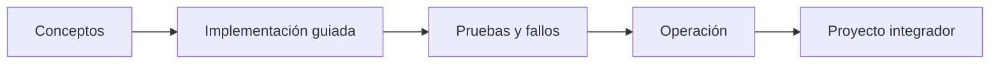

# Parte 10 — Observabilidad, SRE y confiabilidad

> [← Parte 09](../part-09-data-messaging-serverless-integration/README.md) · [Índice completo](../README.md) · [Parte 11 →](../part-11-security-governance-finops/README.md)

**📥 Descargar:** [Esta parte en PDF](../../site/downloads/partes/manual-parte-10-observability-sre-reliability.pdf) · [Manual integral](../../site/downloads/multi-cloud-engineering-manual-v2.0.pdf)

**Nivel:** avanzado · **Clases:** 12 · **Duración sugerida:** 6–8 semanas

Operar sistemas mediante señales, objetivos y aprendizaje de incidentes.

## Resultados de la parte

Al completar esta parte podrás explicar el dominio con lenguaje independiente del proveedor,
implementar sus mecanismos esenciales, diagnosticar fallos y defender decisiones mediante
evidencia, costo, seguridad y objetivos de confiabilidad.

## Modelo mental

La confiabilidad es una característica del servicio percibido por usuarios; SRE la administra con objetivos explícitos y presupuestos de error.

## Secuencia

## Clases

| ID | Clase | Laboratorio | Horas |
|---:|---|---|---:|
| 121 | [Logs, métricas, trazas y eventos como señales](121-logs-metricas-trazas-y-eventos-como-senales/README.md) | `observability` | 4 |
| 122 | [Logging estructurado, correlación y retención](122-logging-estructurado-correlacion-y-retencion/README.md) | `observability` | 4 |
| 123 | [Métricas, cardinalidad y modelos RED y USE](123-metricas-cardinalidad-y-modelos-red-y-use/README.md) | `metrics` | 4 |
| 124 | [Tracing distribuido y OpenTelemetry](124-tracing-distribuido-y-opentelemetry/README.md) | `observability` | 4 |
| 125 | [Dashboards, alertas accionables y fatiga](125-dashboards-alertas-accionables-y-fatiga/README.md) | `observability` | 4 |
| 126 | [SLI, SLO, SLA y presupuesto de error](126-sli-slo-sla-y-presupuesto-de-error/README.md) | `sre` | 4 |
| 127 | [Incidentes, severidad, comando y comunicación](127-incidentes-severidad-comando-y-comunicacion/README.md) | `incident` | 4 |
| 128 | [Runbooks, playbooks y automatización operativa](128-runbooks-playbooks-y-automatizacion-operativa/README.md) | `operations` | 4 |
| 129 | [Capacidad, rendimiento y pruebas de carga](129-capacidad-rendimiento-y-pruebas-de-carga/README.md) | `performance` | 4 |
| 130 | [Timeouts, retries, backoff, circuit breaker y bulkhead](130-timeouts-retries-backoff-circuit-breaker-y-bulkhead/README.md) | `reliability` | 4 |
| 131 | [Chaos engineering y game days](131-chaos-engineering-y-game-days/README.md) | `chaos` | 4 |
| 132 | [Proyecto: operación SRE de CloudShop](132-proyecto-operacion-sre-de-cloudshop/README.md) | `capstone` | 8 |

## Evaluación de la parte

- 35 % laboratorios y evidencia reproducible.
- 25 % retos verificables.
- 20 % decisiones y ADR.
- 10 % seguridad, confiabilidad y costo.
- 10 % proyecto integrador de la parte.

Se aprueba con 80 % de clases en nivel B o superior y el proyecto integrador reproducible.

## Pauta bibliográfica

- Site Reliability Engineering — Beyer et al..
- The Site Reliability Workbook — Beyer et al..
- Observability Engineering — Majors, Fong-Jones y Miranda.
