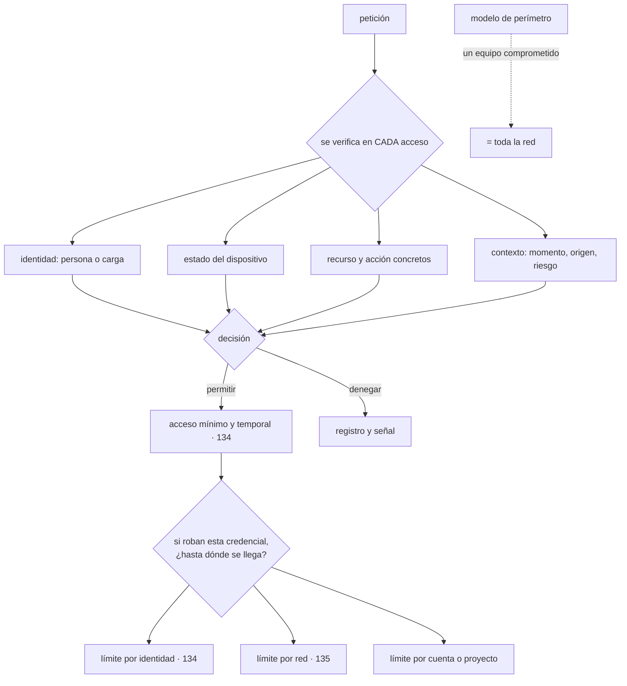

# 133 — Zero Trust y defensa en profundidad

> [← Clase anterior](../../part-10-observability-sre-reliability/132-proyecto-operacion-sre-de-cloudshop/README.md) · [Índice de la parte](../README.md) · [Clase siguiente →](../../part-11-security-governance-finops/134-minimo-privilegio-acceso-temporal-y-separacion-de-funciones/README.md)

**Parte:** 11 — Seguridad, gobierno, cumplimiento y FinOps<br>
**Nivel:** avanzado · **Horas estimadas:** 4<br>
**Laboratorio:** `security` · **Estado:** `EXECUTABLE_CORE`

## 🎯 Propósito

Abrir la parte del control con el cambio de modelo que la hace posible: **dejar de conceder confianza por el lugar del que viene una petición**. La clase separa la idea de los productos que la venden, explica por qué el modelo de perímetro convierte el primer equipo comprometido en la red entera, y desarrolla el criterio que distingue una defensa en profundidad real de cinco controles decorativos: **que las capas sean independientes**. Y termina con la pregunta que ordena todo el trabajo: si roban ahora mismo esta credencial, ¿hasta dónde se llega?

## 📚 Resultados de aprendizaje

Al finalizar podrás:

1. **Enunciar** qué se verifica en cada petición y por qué no basta el origen.
2. **Explicar** por qué el modelo de perímetro falla y qué lo sustituye.
3. **Distinguir** capas de defensa independientes de capas que comparten un único punto.
4. **Calcular** el alcance de un compromiso desde cada punto de entrada.
5. **Ordenar** la adopción por lo que de verdad detiene ataques reales.

## 🧩 Conceptos centrales

| Concepto | Comprensión verificable |
|---|---|
| `confianza cero` | Ninguna petición se acepta por venir de un sitio determinado. Se verifica identidad, permiso y contexto en cada acceso. |
| `modelo de perímetro` | Dividir el mundo en dentro y fuera, y confiar en lo de dentro. Su consecuencia es que un solo equipo comprometido da acceso a todo. |
| `movimiento lateral` | Avance del atacante de un sistema a otro una vez dentro. Es donde ocurre la mayor parte del daño. |
| `independencia de capas` | Que el fallo de una no implique el de las demás. Cinco controles que dependen del mismo sistema de identidad son un solo control. |
| `alcance del compromiso` | Todo lo que un atacante puede leer, escribir o ejecutar partiendo de una credencial concreta. |
| `suponer la brecha` | Diseñar dando por hecho que alguien ya está dentro, y limitar lo que puede hacer desde allí. |

## 🧠 Modelo mental

Gobernar no significa aprobar cada cambio: significa codificar límites, evidencia y responsabilidades para que los equipos puedan avanzar con seguridad.

Aplicado a esta clase, separa siempre cuatro planos: **intención** (qué necesita el usuario),
**configuración** (qué declaramos), **estado observado** (qué existe de verdad) y
**evidencia** (cómo sabemos que cumple). Confundirlos produce diseños que se ven correctos
en un diagrama pero fallan al operar.

## 🗺️ Flujo de razonamiento



## 📖 Desarrollo

### 1. Por qué el perímetro dejó de funcionar

El modelo tradicional divide el mundo en dos y confía en uno de los lados:

```text
fuera   no confiable: cortafuegos, filtrado, inspección
dentro  confiable: se accede a casi todo sin más comprobaciones
```

Y su consecuencia se enuncia en una línea:

```text
el primer equipo comprometido dentro equivale a la red entera
```

Porque a partir de ahí el atacante ya está «dentro», y dentro no hay controles. Eso es el movimiento lateral, y es donde ocurre la mayor parte del daño de casi cualquier incidente serio.

Y hay cuatro razones por las que el modelo ya no se sostiene, aunque la anterior bastaría:

```text
la carga vive en varios proveedores y en servicios gestionados
  → no hay un dentro que contenga todo
la gente trabaja desde cualquier sitio
  → el túnel privado convierte a cualquier portátil en «dentro»
las direcciones son dinámicas y efímeras
  → una regla por dirección no significa nada en contenedores
las integraciones con terceros atraviesan el perímetro por diseño
```

Lo que lo sustituye es una regla sencilla de enunciar y laboriosa de implantar:

```text
ninguna petición se acepta por venir de un sitio determinado
se verifica en CADA acceso:
  quién     identidad de la persona o de la carga, demostrada
  con qué   estado del dispositivo, cuando aplique
  a qué     recurso concreto
  para qué  acción concreta
  en qué contexto  momento, origen, señales de riesgo
```

Y dos precisiones para no vender humo:

```text
esto NO es un producto que se compra
  es una dirección arquitectónica que se recorre por partes

la red sigue importando
  no se deja de segmentar: se deja de CONFIAR por estar segmentado
  → la red pasa de ser el control a ser una capa más     clase 135
```

Y la pieza que hace posible todo lo demás es la que este programa lleva construyendo desde la clase 054: **identidad de carga de trabajo**. Un servicio se autentica por lo que es —una identidad emitida y verificable—, no por la dirección desde la que llama.

### 2. Capas que de verdad son capas

La defensa en profundidad consiste en poner varios controles de modo que **hagan falta varios fallos** para que haya daño. Y su fallo típico no es tener pocas capas, sino tenerlas mal:

```text
control 1   autenticación en la puerta de entrada
control 2   permisos del servicio
control 3   política de red que permite el tráfico
control 4   cifrado con claves gestionadas
control 5   registro de auditoría

y los cinco se apoyan en el mismo sistema de identidad
→ quien lo comprometa pasa las cinco a la vez
→ no son cinco capas: es una
```

De ahí el criterio:

```text
dos capas son independientes si el fallo de una no implica el de la otra
→ y se comprueba preguntando: ¿qué comprometería a las dos?
```

Y las dimensiones sobre las que sí se consiguen capas independientes:

```text
IDENTIDAD      quién puede pedirlo                     clase 134
RED            desde dónde se puede alcanzar           clase 135
DATO           cifrado, con claves de otro dominio     clase 136
APLICACIÓN     validación y autorización de negocio
DETECCIÓN      registro, alertas y respuesta           parte 10
ORGANIZACIÓN   separación de funciones y aprobaciones  clase 134
```

Y una comprobación práctica sobre cualquier sistema:

```text
si un atacante consigue la credencial de la aplicación,
¿qué le impide leer la base de datos entera?
  «los permisos»            → una capa
  «y además la red»         → dos, si la red no la controla la misma identidad
  «y el cifrado por campo»  → tres, si la clave no la puede pedir esa identidad
```

La última condición es la que suele fallar: **la aplicación puede descifrar, así que el cifrado no es una capa frente a ella**. Sí lo es frente a quien acceda al almacenamiento por otro camino, que es un escenario distinto y también real.

Y el peor error de este apartado, que aparece constantemente:

```text
confundir NÚMERO de controles con profundidad
→ veinte reglas que dependen de lo mismo protegen como una
```

Y su contrario, igual de dañino: **una capa que estorba y se rodea no cuenta**. Es la ley 16, que esta parte va a ver muchas veces.

### 3. Suponer la brecha, y medirla

El ejercicio más útil de esta clase no es un diagrama: es una pregunta con respuesta medible.

```text
si roban AHORA MISMO esta credencial, ¿hasta dónde se llega?
```

Y se responde punto por punto, enumerando los orígenes reales:

```text
el portátil de alguien de desarrollo
la identidad de la canalización                     clase 098
la identidad de un contenedor en producción         clase 054
una clave de API de un socio                        clase 118
la cuenta de un proveedor externo con acceso
un servicio expuesto a internet con una vulnerabilidad
```

Y para cada uno se enumera lo alcanzable, sin adornos:

```text
¿qué datos puede leer?
¿qué puede modificar o borrar?
¿puede conseguir OTRA credencial desde ahí?     ← lo más importante
¿puede llegar a producción desde un entorno inferior?
¿queda registro de lo que haga?
¿cuánto tardaría alguien en enterarse?
```

La tercera pregunta es la que decide el alcance real: **la mayoría de los compromisos graves no vienen de lo que la primera credencial permite, sino de la segunda que permite obtener**.

Y las tres formas de acortar el alcance, en orden de eficacia:

```text
1. que la credencial sea de corta vida y de un solo uso
   → nada de claves de larga duración                 clase 098
2. que sus permisos sean los mínimos y no permanentes
   → nada de administradores permanentes               clase 134
3. que no pueda alcanzar por red lo que no necesita
   → segmentación con denegación por defecto           clase 135
```

Y hay una cuarta que es de las más eficaces y menos usadas: **separar por cuentas o proyectos**. Los límites administrativos del proveedor son la frontera más difícil de cruzar para un atacante, porque no dependen de configuración de red ni de reglas finas.

```text
un entorno por cuenta o proyecto
los entornos inferiores SIN camino hacia producción
y las identidades de uno sin permisos en el otro
```

Y el orden de adopción, que importa porque casi todo el mundo empieza por el sitio equivocado:

```text
1. identidad de las personas: factor resistente a suplantación
2. identidad de las cargas: sin claves de larga duración
3. permisos mínimos y sin administración permanente
4. segmentación que limite el movimiento lateral
5. detección y respuesta
```

Y la razón del orden es que los dos primeros cortan **la vía de entrada más común**, mientras que empezar por la red es caro y deja abierta la puerta principal.

### 4. El control que se rodea

Este apartado es la ley 16 aplicada a la seguridad, y conviene abrirlo aquí porque va a reaparecer en toda la parte.

```text
un control que estorba acaba desactivado, rodeado o convertido en trámite
```

Y sus formas típicas, con lo que las produce:

```text
el túnel privado que todo el mundo evita
  porque va lento y hay que reconectarse cada hora
  → la gente usa alternativas sin control

la excepción temporal que lleva dos años
  porque nadie puso fecha                             clases 046, 091

la cuenta administrativa compartida
  porque pedir permisos tarda tres días
  → y entonces nadie sabe quién hizo qué

el repositorio de claves en una hoja de cálculo
  porque el almacén oficial exige un procedimiento largo

la aprobación que se concede sin mirar
  porque llegan cuarenta al día                       ley 15
```

Y la conclusión operativa, que va contra la intuición: **el control más seguro que nadie usa es peor que uno razonable que todo el mundo usa**.

Las cuatro formas de que un control sobreviva:

```text
QUE SEA EL CAMINO MÁS RÁPIDO
  pedir un acceso temporal debe tardar menos que buscar un atajo
  → es el camino asfaltado de la clase 106 aplicado a la seguridad
QUE TENGA SALIDA DECLARADA
  con motivo, responsable y caducidad que rompa algo    clase 101
QUE SE MIDA SU RODEO
  cuántas excepciones, cuántos accesos por vía alternativa
  → si sube, el control está mal diseñado, no la gente
QUE NO DEPENDA DE LA MEMORIA DE NADIE
  automático por defecto, no una lista de buenas prácticas
```

Y lo que hay que vigilar desde el primer día de esta parte:

```text
excepciones vivas y su antigüedad
credenciales de larga duración que quedan
identidades con permisos amplios permanentes
accesos a producción fuera del camino habitual
cuentas compartidas
```

Y la lista de comprobación de la clase:

```text
☐ ninguna autorización depende únicamente del origen de la petición
☐ las cargas se autentican por identidad emitida, no por dirección
☐ está escrito qué se verifica en cada acceso
☐ las capas de defensa son independientes, y se ha comprobado
☐ está calculado el alcance desde cada punto de entrada
☐ está identificado desde dónde se puede obtener OTRA credencial
☐ los entornos están separados por cuenta o proyecto
☐ los entornos inferiores no tienen camino a producción
☐ el camino seguro es el más rápido
☐ se mide cuánto se rodean los controles
```

Y el cierre que enlaza con la clase siguiente: de las tres formas de acortar el alcance, la que más reduce y más fricción genera es la de los permisos. Cómo se conceden los mínimos, cómo se dan solo mientras hacen falta y cómo se impide que una sola persona pueda hacerlo todo es la materia de la clase 134.

## 🔬 Ejemplo trabajado

**CloudShop hace el ejercicio del apartado tercero antes de comprar ni configurar nada: enumerar los puntos de entrada y medir hasta dónde se llega desde cada uno. El resultado reordena por completo lo que se pensaba hacer.**

**El inventario de puntos de entrada.**

```text
1. portátil de una persona de desarrollo
2. identidad de la canalización                     clase 098
3. contenedor de producción del servicio de pedidos
4. clave de API de un socio                         clase 118
5. cuenta de un proveedor de análisis con acceso de lectura
6. servicio expuesto a internet
```

**Lo que se alcanzaba desde cada uno, medido con permisos reales.**

```text
1. PORTÁTIL DE DESARROLLO
   túnel privado activo → red interna completa
   credenciales en el disco: 3 claves de larga duración
   acceso a producción: SÍ, mediante una de esas claves
   otra credencial obtenible: sí, la del almacén de secretos
   → ALCANCE: total

2. CANALIZACIÓN
   ya corregido en la clase 103: sin credenciales de clúster
   puede confirmar en el repositorio de entorno
   → ALCANCE: puede desplegar lo que quiera, con revisión en producción

3. CONTENEDOR DE PEDIDOS
   identidad federada, sin claves      clase 054
   base de datos de pedidos: lectura y escritura
   otras bases: NO
   red: puede alcanzar 14 de 15 servicios
   otra credencial obtenible: sí, la del proveedor de pago
   → ALCANCE: pedidos + pagos

4. CLAVE DE SOCIO
   API pública, con límites
   → ALCANCE: sus propios datos

5. PROVEEDOR DE ANÁLISIS
   lectura sobre el lago completo, incluido el subconjunto
   con datos personales     clase 104
   → ALCANCE: todos los datos históricos

6. SERVICIO EXPUESTO
   identidad propia, permisos limitados
   red: puede alcanzar 14 de 15 servicios
   → ALCANCE: punto de partida para movimiento lateral
```

**Las tres conclusiones que reordenaron el plan.**

El plan original era «segmentar la red», porque era lo que estaba en el presupuesto. Los números decían otra cosa:

```text
1. el punto de entrada más peligroso era un PORTÁTIL, no un servidor
   tres claves de larga duración en disco daban acceso total

2. el multiplicador era la SEGUNDA credencial
   4 de 6 puntos permitían obtener otra credencial
   → sin eso, ningún punto llegaba lejos

3. la red importaba, y menos de lo esperado
   14 de 15 servicios alcanzables desde cualquier sitio era malo
   pero por sí sola no daba acceso a datos: hacía falta una credencial
```

**Lo que se hizo, en el orden que los datos dictaron.**

```text
MES 1-2  identidad de las personas
  factor resistente a suplantación, obligatorio
  fin de las claves de larga duración en portátiles
  acceso a producción solo mediante concesión temporal (clase 134)

MES 2-3  identidad de las cargas
  las 3 credenciales estáticas restantes migradas a federación
  el proveedor de pago pasó a clave rotada automáticamente

MES 3-5  separación por cuentas
  un proyecto por entorno; sin camino de dev a producción
  el proveedor de análisis, movido a una cuenta de solo lectura
  con datos anonimizados

MES 5-8  segmentación
  denegación por defecto entre servicios (clase 135)
```

**El mismo ejercicio, repetido a los ocho meses.**

```text                                    alcance antes        alcance después
portátil de desarrollo                     total          nada sin concesión
                                                          temporal aprobada
canalización                          desplegar todo     igual, con revisión
contenedor de pedidos               pedidos + pagos      solo pedidos
clave de socio                        sus datos            sus datos
proveedor de análisis            todo el histórico    subconjunto anonimizado
servicio expuesto              14 de 15 servicios       2 de 15 servicios

puntos desde los que se obtiene otra credencial   4 de 6        0 de 6
```

La última fila es la que más cambió el riesgo: **ninguna credencial permite ya conseguir otra**.

**La comprobación de independencia de capas.**

Se revisaron los controles del servicio de pedidos:

```text
control                              ¿de qué depende?
autenticación en la puerta            sistema de identidad
permisos del servicio                 sistema de identidad
política de red                       controlador de red
cifrado en reposo                     servicio de claves
registro de auditoría                 plataforma

¿qué comprometería a la vez varias?
  el sistema de identidad → las dos primeras
  → son UNA capa, no dos
```

Y la corrección no fue añadir controles, sino separarlos:

```text
la política de red pasó a no depender de etiquetas gestionadas
por la misma identidad
el acceso a las claves de cifrado se restringió a identidades
distintas de las de la aplicación, con aprobación para operaciones
masivas de descifrado
```

**La ley 16, medida durante la adopción.**

```text                                    mes 1        mes 8
excepciones vivas                          0            31
de ellas, con fecha de caducidad           —            31
de ellas, caducadas y renovadas            —             6
cuentas compartidas                        4             0
accesos a producción por vía alternativa   no medido     2 / mes
tiempo para obtener acceso temporal        3 días       90 s
```

Y la penúltima fila es la que se vigila: **dos accesos al mes por vía alternativa** se investigaron uno a uno; los dos eran procedimientos de emergencia sin camino oficial, y se les creó uno.

Y la última explica por qué el resto funcionó: **pedir acceso pasó de tres días a noventa segundos**, y con eso nadie tuvo motivo para buscar atajos.

**A los ocho meses.**

```text                                          antes         después
claves de larga duración                        14              0
puntos de entrada con alcance total              1              0
puntos desde los que se obtiene otra credencial  4              0
servicios alcanzables desde uno comprometido    14 de 15       2 de 15
entornos separados por cuenta                   no              sí
camino de dev a producción                      sí              no
cuentas compartidas                              4              0
tiempo para acceso temporal a producción      3 días           90 s
capas realmente independientes                   3              5
```

**La lección que esta clase abre para la parte 11**: el plan original era segmentar la red, y el ejercicio de medir el alcance demostró que **el punto de entrada más peligroso era un portátil con tres claves guardadas en disco**. Lo que multiplicaba el daño no era la conectividad: era que cuatro de seis credenciales permitían obtener otra. Y el cambio que hizo aceptable todo lo demás no fue un control: fue **reducir de tres días a noventa segundos el tiempo de pedir acceso**, porque un control que estorba se rodea, y eso es exactamente lo que la hipótesis de la clase 132 predijo para esta parte.

## 🧪 Laboratorio guiado

Ejecuta desde la raíz:

```bash
python classes/part-11-security-governance-finops/133-zero-trust-y-defensa-en-profundidad/lab.py
```

El laboratorio selecciona el motor de práctica **`security`** y produce
`lab_result.json`. El escenario, sus comprobaciones y el artefacto esperado corresponden a
esta clase; no requiere credenciales y deja explícito qué debe revalidarse en un sandbox real.

1. Lee `exercise.steps` y formula una predicción antes de ejecutar.
2. Ejecuta la práctica y verifica todos los elementos de `checks`.
3. Provoca el caso de `negative_test` y explica la señal observada.
4. Materializa `modelo-zero-trust` en `evidence/` usando la plantilla indicada.
5. Para proveedor real, sigue `sandbox.requires`, registra costo y ejecuta `destroy`.

### Evidencia esperada

El artefacto principal es un control con amenaza, mitigación y evidencia. Además, la entrega debe incluir el comando ejecutado,
la salida estructurada y una conclusión que no exceda lo observado.

## 🏆 Reto verificable

Construye **`modelo-zero-trust`** para el caso CloudShop. Incluye una alternativa descartada,
un supuesto que pueda falsarse, una prueba de fallo y una decisión de rollback.

## ✅ Criterio de aceptación

- [ ] `lab.py` termina con código 0 y genera JSON válido.
- [ ] La entrega conecta al menos tres requisitos con mecanismos verificables.
- [ ] Existe una prueba positiva y una prueba negativa con evidencia.
- [ ] Seguridad, costo y operación aparecen como decisiones, no como anexos.
- [ ] Se declara una limitación y una condición que obligaría a revisar el diseño.
- [ ] Otra persona puede repetir el recorrido sin conocimiento tácito.

## ⚠️ Errores frecuentes

| Síntoma | Causa probable | Corrección |
|---|---|---|
| Un solo equipo comprometido da acceso a casi todo | Modelo de perímetro: dentro no hay controles y el movimiento lateral es libre | Verifica identidad, recurso, acción y contexto en cada acceso; separa entornos por cuenta y deniega por defecto entre servicios. |
| Hay muchos controles y un solo fallo los atraviesa todos | Las capas dependen del mismo sistema; no son capas | Comprueba para cada par qué comprometería a los dos y construye sobre dimensiones distintas: identidad, red, dato, aplicación, detección y organización. |
| Se invierte en segmentar la red y los incidentes siguen entrando por credenciales | Se empezó por la capa cara antes que por la identidad | Ordena la adopción: identidad de personas, identidad de cargas, permisos mínimos, segmentación y detección. |
| Un compromiso pequeño acaba siendo total | Desde la primera credencial se puede obtener otra | Enumera para cada punto de entrada si permite conseguir otra credencial, y corta esa cadena antes que nada. |
| La gente usa vías alternativas para trabajar | Ley 16: el control oficial es más lento que el atajo | Haz que el camino seguro sea el más rápido, mide los rodeos y trata su aumento como defecto de diseño. |
| Se declara implantada la confianza cero porque se compró un producto | Es una dirección arquitectónica, no un producto | Mide alcance por punto de entrada antes y después; esa cifra es la que dice si algo ha cambiado. |

## 🛡️ Seguridad, ética y costo

Trabaja con cuentas propias o sandboxes autorizados. No publiques secretos, identificadores
reales ni datos personales. Antes de crear recursos pagos define presupuesto, etiquetas y
comando de destrucción; después verifica que no queden recursos huérfanos. Los ejemplos
locales enseñan contratos, pero no certifican cumplimiento ni disponibilidad de producción.

## ❓ Preguntas de comprobación

1. ¿Por qué el modelo de perímetro convierte un equipo comprometido en la red entera?
2. ¿Qué se verifica en cada acceso cuando no se confía en el origen?
3. ¿Cómo se comprueba que dos capas de defensa son independientes?
4. ¿Por qué la pregunta clave es si desde una credencial se puede obtener otra?
5. ¿En qué orden conviene adoptar los controles y por qué no se empieza por la red?

## 🔗 Referencias

- NIST (2020). *SP 800-207: Zero Trust Architecture* — principios, componentes y modelos de despliegue. <https://csrc.nist.gov/pubs/sp/800/207/final>
- Google (2025). *BeyondCorp: a new approach to enterprise security* — acceso sin confianza en la red. <https://cloud.google.com/beyondcorp>
- CISA (2025). *Zero Trust Maturity Model* — orden de adopción por pilares. <https://www.cisa.gov/zero-trust-maturity-model>
- MITRE (2025). *ATT&CK: lateral movement* — técnicas reales de avance dentro de una red. <https://attack.mitre.org/tactics/TA0008/>
- AWS (2025). *Security pillar: apply security at all layers* — independencia de capas y separación por cuentas. <https://docs.aws.amazon.com/wellarchitected/latest/security-pillar/welcome.html>
- Documentación oficial vigente del servicio implementado; registra URL y fecha de consulta.

---

> [Evaluación](assessment.md) · [Contrato de clase](lesson.yaml) · [Índice de la parte](../README.md)
