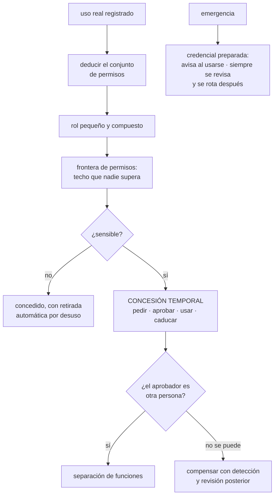

# 134 — Mínimo privilegio, acceso temporal y separación de funciones

> [← Clase anterior](../../part-11-security-governance-finops/133-zero-trust-y-defensa-en-profundidad/README.md) · [Índice de la parte](../README.md) · [Clase siguiente →](../../part-11-security-governance-finops/135-segmentacion-perimetro-waf-ddos-y-egress/README.md)

**Parte:** 11 — Seguridad, gobierno, cumplimiento y FinOps<br>
**Nivel:** avanzado · **Horas estimadas:** 4<br>
**Laboratorio:** `iam` · **Estado:** `EXECUTABLE_CORE`

## 🎯 Propósito

Reducir lo que se puede hacer con una credencial robada, que es la palanca que la clase 133 midió como la más eficaz. La clase sostiene tres cosas concretas: que **el problema no es tener demasiados permisos, sino tenerlos siempre**, y que la corrección es que caduquen por defecto; que **los permisos se deducen del uso observado y no de lo que alguien imagina que hará falta**; y que la revisión periódica de accesos, tal como se practica, es teatro —lo que funciona es **retirar automáticamente lo que no se usa**—.

## 📚 Resultados de aprendizaje

Al finalizar podrás:

1. **Derivar** un conjunto de permisos a partir del uso real registrado.
2. **Sustituir** el acceso permanente por concesiones temporales.
3. **Separar** funciones de forma que una sola persona no complete una acción dañina.
4. **Diseñar** el acceso de emergencia para que exista y deje rastro.
5. **Retirar** permisos sin depender de que alguien los revise.

## 🧩 Conceptos centrales

| Concepto | Comprensión verificable |
|---|---|
| `privilegio mínimo` | Cada identidad puede hacer solo lo que necesita. Es un proceso continuo: sin algo que los retire, los permisos solo crecen. |
| `acceso permanente` | Permiso disponible sin pedirlo. Es el que un atacante encuentra ya concedido; el objetivo es que no exista para lo sensible. |
| `concesión temporal` | Permiso que se pide, se aprueba, dura un rato y desaparece solo. Debe ser más rápido que cualquier atajo. |
| `separación de funciones` | Que ninguna persona pueda completar sola una acción dañina de principio a fin. |
| `acceso de emergencia` | Credencial preparada para cuando todo lo demás falla. Debe existir, avisar al usarse y revisarse siempre. |
| `frontera de permisos` | Límite superior que ninguna concesión puede superar, aunque quien la conceda tenga más permisos. |

## 🧠 Modelo mental

Gobernar no significa aprobar cada cambio: significa codificar límites, evidencia y responsabilidades para que los equipos puedan avanzar con seguridad.

Aplicado a esta clase, separa siempre cuatro planos: **intención** (qué necesita el usuario),
**configuración** (qué declaramos), **estado observado** (qué existe de verdad) y
**evidencia** (cómo sabemos que cumple). Confundirlos produce diseños que se ven correctos
en un diagrama pero fallan al operar.

## 🗺️ Flujo de razonamiento



## 📖 Desarrollo

### 1. Deducir los permisos del uso

El privilegio mínimo falla casi siempre por la misma razón: **nadie sabe qué permisos hacen falta**, así que se conceden de más «por si acaso» y nunca se quitan.

```text
se concede al empezar el proyecto, con margen
se añade cada vez que algo falla por permisos
no se quita nunca, porque quitar puede romper algo
→ el conjunto solo crece
```

Y la técnica que lo resuelve no es adivinar mejor: es **mirar lo que se ha usado de verdad**. Los tres proveedores registran cada llamada con su identidad, y de ahí sale el conjunto real:

```text
1. conceder amplio, en un entorno inferior, durante 30-60 días
2. leer el registro de auditoría: qué acciones se ejecutaron,
   sobre qué recursos, con qué identidad
3. construir el permiso a partir de esa lista
4. aplicarlo en modo de aviso antes de bloquear
5. y volver a revisar a los tres meses
```

Y el paso 4 es el que hace viable el ejercicio: **primero avisar de lo que se habría bloqueado**, y solo bloquear cuando la lista de avisos está vacía. Es la misma secuencia de adopción que este programa lleva usando desde la clase 091.

Y dos cautelas honestas sobre el método:

```text
lo que ocurre una vez al año no aparece en 60 días
  → cierres contables, restauraciones, migraciones
  → hay que preguntarlo, no solo observarlo
lo observado incluye lo que se hizo mal
  → si alguien leyó una tabla que no debía, aparecerá como «necesario»
```

Y el diseño de los roles, con sus antipatrones habituales:

```text
mal   un rol por puesto: «desarrollador», que crece sin fin
mal   comodines: acciones y recursos abiertos «para simplificar»
mal   copiar el rol de alguien que ya trabajaba aquí

bien  conjuntos pequeños por capacidad concreta
      «leer registros de este servicio», «reiniciar estos despliegues»
      y se componen los que hagan falta
```

**La frontera de permisos** es la pieza que evita que todo esto se deshaga por un descuido:

```text
aunque alguien conceda un permiso amplio, la frontera lo recorta
→ «ninguna identidad de este proyecto puede borrar copias de seguridad»
→ «ninguna carga puede modificar el registro de auditoría»
```

Y es lo que permite delegar la concesión sin delegar el riesgo: los equipos se dan permisos entre ellos, y hay cosas que **nadie puede concederse**.

### 2. Que caduquen por defecto

La distinción que cambia el resultado:

```text
no es «tiene demasiados permisos»
es «los tiene SIEMPRE»
```

Un atacante que roba una credencial encuentra lo que estaba concedido en ese momento. Si lo sensible no está concedido casi nunca, el robo vale mucho menos.

```text
administrador permanente        el atacante es administrador
administrador bajo petición     el atacante tiene lo básico
                                y pedir más deja rastro y avisa
```

Y el ciclo de una concesión temporal:

```text
PEDIR      con motivo y duración; en segundos, no en un formulario largo
APROBAR    otra persona, o automático según reglas para lo de menor riesgo
USAR       con todo registrado y asociado a la petición
CADUCAR    solo, sin que nadie tenga que acordarse
```

Y el requisito que decide si se adopta, que viene de la clase 133:

```text
pedir acceso debe ser MÁS RÁPIDO que cualquier atajo
→ si tarda tres días, la gente conservará accesos permanentes
  «por si acaso», y tendrá razón
```

Y qué se aprueba automáticamente y qué no:

```text
automático   lectura en entornos inferiores, diagnóstico, registros
             → con registro y caducidad corta
revisión     escritura en producción, datos personales, claves,
             permisos sobre permisos
```

Y una decisión que suele olvidarse: **qué pasa durante un incidente**. Si la concesión temporal depende de un sistema que puede estar caído, hay que tener el acceso de emergencia del apartado cuarto, o el proceso se rodeará justo cuando importa.

**Las identidades de máquina**, que son la mayoría y a las que casi nunca se aplica esto:

```text
en una organización mediana hay 5-20 identidades de carga por persona
y casi todas tienen permisos permanentes
```

Y lo que sí se puede aplicar a ellas:

```text
permisos deducidos del uso, igual que a las personas
credenciales de corta vida por federación             clase 098
retirada automática de lo que no se usa
y una identidad por carga, no una compartida por diez
```

La última es la que más cuesta y más rinde: **una identidad compartida hace imposible saber quién hizo qué y obliga a que sus permisos sean la unión de todos los usos**.

### 3. Separación de funciones y acceso de emergencia

**La separación de funciones** existe para que ninguna persona pueda completar sola una acción dañina.

```text
quien escribe el código          ≠  quien lo aprueba          clase 097
quien pide un acceso             ≠  quien lo concede
quien despliega en producción    ≠  quien puede borrar el registro
quien administra las claves      ≠  quien administra los datos cifrados
quien crea un proveedor          ≠  quien aprueba sus pagos
```

Y una que merece destacarse porque suele estar mal: **nadie debe poder modificar el registro de auditoría**, ni siquiera quien administra. Se consigue con la inmutabilidad de la clase 112 y con una cuenta separada.

Y el límite honesto en equipos pequeños:

```text
con cuatro personas no se pueden separar seis funciones
→ lo que se hace entonces:
   registrar todo lo que una sola persona pudo hacer sola
   revisarlo después, en una rutina fija
   y avisar automáticamente de las combinaciones peligrosas
→ es un control compensatorio, y hay que llamarlo así
```

**El acceso de emergencia** tiene que existir. Si no existe, se improvisa, y lo improvisado no tiene control ninguno.

```text
preparado de antemano, no creado durante el incidente
fuera de las dependencias que pueden estar caídas
  → no depende del sistema de identidad corporativo si ese puede fallar
guardado de forma que usarlo requiera un acto deliberado
con aviso automático a varias personas al usarse
con revisión OBLIGATORIA de cada uso, siempre
y rotado después de usarse
```

Y las dos cifras que dicen si está bien:

```text
usos al año                pocos; si son muchos, falta un camino normal
usos sin revisión posterior  cero, sin excepciones
```

Y un ensayo que hay que hacer, porque es exactamente el tipo de cosa que se pudre: **usarlo a propósito una vez al año** y comprobar que la credencial funciona, que el aviso llega y que la revisión ocurre. Es la clase 131 aplicada aquí.

### 4. Retirar sin depender de nadie

La práctica habitual es la revisión periódica de accesos: cada trimestre alguien recibe una lista y confirma quién debe conservar qué. Y funciona mal por un motivo predecible:

```text
la lista tiene 400 líneas
quien revisa no sabe para qué necesita cada persona cada permiso
quitar algo puede romper el trabajo de alguien
→ se aprueba todo
```

Es la ley 15 y la ley 16 a la vez, y produce una firma que dice que se revisó.

Lo que sí funciona:

```text
RETIRADA AUTOMÁTICA POR DESUSO
  «este permiso no se ha usado en 90 días → se retira»
  con aviso previo y forma de recuperarlo en segundos
→ no requiere que nadie juzgue nada
→ y el error se corrige solo: quien lo necesite lo vuelve a pedir
```

Y el requisito que lo hace aceptable es el mismo de siempre: **recuperar el permiso tiene que ser inmediato**. Con eso, retirar de más deja de dar miedo.

Y lo que sí merece revisión humana, que es mucho menos:

```text
quién tiene permisos sobre permisos
quién puede llegar a datos personales
qué identidades tienen acceso permanente a producción
las excepciones vivas y su motivo
```

Cuatro listas cortas se revisan de verdad; una lista de cuatrocientas líneas, no.

Y lo que hay que vigilar de forma continua:

```text
permisos concedidos y no usados nunca
identidades con acceso permanente a lo sensible
concesiones temporales: cuántas, de qué duración, aprobadas por quién
usos del acceso de emergencia
identidades compartidas
credenciales de larga duración que quedan
combinaciones que rompen la separación de funciones
```

Y la lista de comprobación de la clase:

```text
☐ los permisos se deducen del uso registrado, no de suposiciones
☐ se aplica en modo aviso antes de bloquear
☐ se pregunta por lo que ocurre una vez al año y no aparece en el registro
☐ los roles son conjuntos pequeños compuestos, sin comodines
☐ hay fronteras que ninguna concesión puede superar
☐ lo sensible no está concedido de forma permanente
☐ pedir acceso temporal tarda menos que cualquier atajo
☐ nadie puede modificar el registro de auditoría
☐ las funciones críticas están separadas, o hay control compensatorio escrito
☐ existe acceso de emergencia preparado, con aviso y revisión obligatoria
☐ se ensaya el acceso de emergencia una vez al año
☐ la retirada por desuso es automática y recuperar es inmediato
☐ las identidades de carga tienen el mismo tratamiento que las personas
```

Y el cierre que enlaza con la clase siguiente: con los permisos acotados, queda la otra dimensión que la clase 133 enumeró como capa independiente —desde dónde se puede alcanzar cada cosa— y con ella el tráfico que sale, que es por donde se van los datos. Es la materia de la clase 135.

## 🔬 Ejemplo trabajado

**CloudShop aplica el privilegio mínimo empezando por medir. El ejercicio produce tres números que orientan el resto: cuántos permisos concedidos no se usan, cuántas identidades tienen acceso permanente a producción y cuánto se tarda en pedir un acceso.**

**La medición inicial.**

```text
identidades humanas                                        41
identidades de carga                                      312
relación                                                  7,6 por persona

permisos concedidos (acciones distintas por identidad)  8.940
usados al menos una vez en 90 días                      1.310
sin usar nunca                                          7.630   (85 %)

identidades con acceso permanente a producción             34
de ellas, humanas                                          19
identidades compartidas                                     6
tiempo medio para conseguir un acceso nuevo             3 días
```

Ochenta y cinco por ciento de los permisos concedidos **no se ha usado nunca**.

**La deducción desde el uso.**

Se tomó el registro de auditoría de sesenta días para las diez identidades de carga más importantes:

```text
servicio de pedidos
  permisos concedidos                                     412
  acciones distintas ejecutadas                            23
  recursos distintos tocados                                7
  permiso deducido                       23 acciones sobre 7 recursos
```

Y el modo de aviso antes de bloquear, durante tres semanas:

```text
semana 1   avisos de lo que se habría bloqueado                 41
           de ellos, legítimos y no observados en los 60 días    9
             → 6 eran del cierre mensual
             → 3 eran de un procedimiento de recuperación
semana 2   avisos                                                7
semana 3   avisos                                                0
→ se activó el bloqueo
```

Los nueve del primer punto confirman la cautela del apartado primero: **lo que ocurre una vez al mes no está en el registro de sesenta días**, y hubo que preguntarlo.

```text                                    antes         después
permisos del servicio de pedidos            412            29
las 10 identidades principales            3.180           186
incidentes causados por falta de permisos    —          2 en 6 meses
  → los 2, procedimientos anuales; añadidos
```

**Las concesiones temporales.**

El acceso permanente a producción se retiró y se sustituyó por concesión temporal.

```text                                    antes         después
identidades humanas con acceso
permanente a producción                      19             0
tiempo para pedir acceso                  3 días          90 s
aprobación                              por correo    otra persona del
                                        y a mano       equipo dueño (095),
                                                       o automática si es
                                                       lectura
duración por defecto                       —              2 h
```

Y el uso real en seis meses:

```text
concesiones solicitadas                                   418
aprobadas automáticamente (lectura, entornos inferiores)  291
aprobadas por otra persona                                121
rechazadas                                                  6
tiempo medio hasta obtenerla                              90 s
duración media usada                                     34 min
```

Y el efecto sobre el ejercicio de la clase 133:

```text
alcance desde el portátil de desarrollo
  antes    acceso total, con claves en disco
  después  nada sin una concesión aprobada y registrada
```

**La revisión trimestral que era teatro.**

```text
últimas cuatro revisiones antes del cambio
  líneas a revisar por trimestre                        ~400
  tiempo dedicado por revisor                           ~20 min
  permisos retirados en las cuatro revisiones               3
  proporción aprobada sin cambios                      99,3 %
```

Tres permisos retirados en un año. Se sustituyó por retirada automática:

```text                                    revisión trimestral   retirada por desuso
permisos retirados en 6 meses                    1                  6.840
reclamaciones por retirada indebida              —                     31
de ellas, recuperadas en                         —                  < 2 min
tiempo humano invertido                       80 min/trim              0
```

Treinta y una retiradas fueron molestas y **se recuperaron en menos de dos minutos**, que es exactamente lo que hace aceptable el mecanismo.

Y las cuatro listas cortas que sí se revisan a mano:

```text
quién puede conceder permisos                          6 personas
quién puede llegar a datos personales                  4 identidades
acceso permanente a producción                         0 humanas, 11 cargas
excepciones vivas                                     31, todas con fecha
```

**Las identidades compartidas.**

```text
6 identidades compartidas, usadas por 23 personas
efecto  imposible saber quién hizo qué
        y sus permisos eran la unión de todos los usos: 1.140 acciones

tras separarlas en 23 identidades individuales
  permisos medios por identidad                             41
  acciones que nadie podía atribuir                    de 100 % a 0 %
```

**El acceso de emergencia, y sus tres usos.**

```text
creado: credencial sellada, fuera del sistema de identidad corporativo
avisa a 4 personas al usarse
revisión obligatoria de cada uso

usos en 12 meses                                            3
  1. caída del proveedor de identidad                    legítimo
  2. incidente con el sistema de concesiones caído       legítimo
  3. alguien tenía prisa y no quiso esperar 90 s         NO legítimo
     → se habló, y se revisó por qué le pareció más rápido

usos sin revisión posterior                                 0
ensayo anual                                          ejecutado
  hallazgo del ensayo   el aviso llegaba a un buzón de un equipo
                        disuelto (el mismo problema de la clase 131)
```

**La separación de funciones, con un equipo pequeño.**

```text
funciones que se pudieron separar                          5
funciones que NO, por tamaño del equipo                    2
  administrar claves y administrar datos cifrados
  aprobar un proveedor y aprobar su pago
control compensatorio escrito                            sí
  registro de las acciones combinadas
  revisión mensual de 20 min
  alerta automática cuando la misma persona hace ambas
alertas disparadas en 6 meses                              4
  de ellas, legítimas                                      4
```

**A los seis meses.**

```text                                          antes         después
permisos concedidos                            8.940          2.100
sin usar nunca                                 85 %            9 %
identidades humanas con acceso permanente
a producción                                     19              0
identidades compartidas                           6              0
tiempo para conseguir acceso                  3 días           90 s
fronteras de permisos definidas                   0              4
permisos retirados en 6 meses                     1          6.840
recuperación tras retirada indebida               —          < 2 min
tiempo humano en revisiones                  80 min/trim     20 min/mes
usos del acceso de emergencia sin revisar         —              0
acciones no atribuibles a una persona           100 %            0 %
```

**La lección que esta clase traslada a la parte 11**: el 85 % de los permisos concedidos no se había usado nunca, y **la revisión trimestral que existía para detectarlo retiró tres en un año**. Lo que sí funcionó fue quitar el juicio humano de la ecuación: retirar automáticamente por desuso y hacer que recuperar cueste dos minutos. Y el cambio que hizo posible eliminar diecinueve accesos permanentes a producción no fue una política: fue **bajar de tres días a noventa segundos el tiempo de pedir uno temporal**, que es la ley 16 aplicada en la dirección correcta.

## 🧪 Laboratorio guiado

Ejecuta desde la raíz:

```bash
python classes/part-11-security-governance-finops/134-minimo-privilegio-acceso-temporal-y-separacion-de-funciones/lab.py
```

El laboratorio selecciona el motor de práctica **`iam`** y produce
`lab_result.json`. El escenario, sus comprobaciones y el artefacto esperado corresponden a
esta clase; no requiere credenciales y deja explícito qué debe revalidarse en un sandbox real.

1. Lee `exercise.steps` y formula una predicción antes de ejecutar.
2. Ejecuta la práctica y verifica todos los elementos de `checks`.
3. Provoca el caso de `negative_test` y explica la señal observada.
4. Materializa `revision-accesos` en `evidence/` usando la plantilla indicada.
5. Para proveedor real, sigue `sandbox.requires`, registra costo y ejecuta `destroy`.

### Evidencia esperada

El artefacto principal es una matriz de acceso mínimo con prueba de denegación. Además, la entrega debe incluir el comando ejecutado,
la salida estructurada y una conclusión que no exceda lo observado.

## 🏆 Reto verificable

Construye **`revision-accesos`** para el caso CloudShop. Incluye una alternativa descartada,
un supuesto que pueda falsarse, una prueba de fallo y una decisión de rollback.

## ✅ Criterio de aceptación

- [ ] `lab.py` termina con código 0 y genera JSON válido.
- [ ] La entrega conecta al menos tres requisitos con mecanismos verificables.
- [ ] Existe una prueba positiva y una prueba negativa con evidencia.
- [ ] Seguridad, costo y operación aparecen como decisiones, no como anexos.
- [ ] Se declara una limitación y una condición que obligaría a revisar el diseño.
- [ ] Otra persona puede repetir el recorrido sin conocimiento tácito.

## ⚠️ Errores frecuentes

| Síntoma | Causa probable | Corrección |
|---|---|---|
| Los permisos solo crecen y nadie se atreve a quitar ninguno | Se conceden por suposición y no hay ningún mecanismo que los retire | Deduce el conjunto del registro de uso, aplica en modo aviso antes de bloquear y añade retirada automática por desuso. |
| La revisión trimestral de accesos se aprueba entera sin cambios | Cuatrocientas líneas que nadie puede juzgar; leyes 15 y 16 | Retira automáticamente lo no usado y deja para revisión humana solo cuatro listas cortas y sensibles. |
| Robar una credencial da acceso administrativo inmediato | El acceso sensible es permanente | Conviértelo en concesión temporal con caducidad, y haz que pedirla tarde menos que cualquier atajo. |
| No se puede saber quién ejecutó una acción | Hay identidades compartidas, cuyos permisos son además la unión de todos los usos | Una identidad por persona y por carga; separa las compartidas aunque cueste. |
| Durante un incidente nadie puede acceder porque el sistema de concesiones está caído | No hay acceso de emergencia, o depende de lo mismo que falló | Prepara una credencial sellada fuera de esas dependencias, con aviso automático, revisión obligatoria de cada uso y ensayo anual. |
| Un permiso concedido por error da acceso a algo crítico | No hay techo: quien concede puede conceder cualquier cosa | Define fronteras de permisos que ninguna concesión pueda superar, como borrar copias o tocar el registro de auditoría. |

## 🛡️ Seguridad, ética y costo

Trabaja con cuentas propias o sandboxes autorizados. No publiques secretos, identificadores
reales ni datos personales. Antes de crear recursos pagos define presupuesto, etiquetas y
comando de destrucción; después verifica que no queden recursos huérfanos. Los ejemplos
locales enseñan contratos, pero no certifican cumplimiento ni disponibilidad de producción.

## ❓ Preguntas de comprobación

1. ¿Cómo se deduce un conjunto de permisos a partir del uso y qué se escapa a ese método?
2. ¿Por qué el problema es tener permisos siempre y no tenerlos de más?
3. ¿Qué hace falta para que una concesión temporal se adopte de verdad?
4. ¿Qué se hace cuando el equipo es demasiado pequeño para separar funciones?
5. ¿Por qué la retirada automática por desuso funciona mejor que la revisión periódica?

## 🔗 Referencias

- AWS (2025). *IAM Access Analyzer: policy generation from access activity* — deducir permisos del uso registrado. <https://docs.aws.amazon.com/IAM/latest/UserGuide/access-analyzer-policy-generation.html>
- Microsoft (2025). *Privileged Identity Management: just-in-time access* — concesión temporal, aprobación y caducidad. <https://learn.microsoft.com/entra/id-governance/privileged-identity-management/pim-configure>
- Google Cloud (2025). *Policy Intelligence and recommender* — permisos concedidos y no usados. <https://cloud.google.com/policy-intelligence/docs/role-recommendations-overview>
- NIST (2020). *SP 800-53: AC-5 separation of duties, AC-6 least privilege* — definición y controles compensatorios. <https://csrc.nist.gov/pubs/sp/800/53/r5/upd1/final>
- AWS (2025). *Permissions boundaries* — techo que ninguna concesión delegada puede superar. <https://docs.aws.amazon.com/IAM/latest/UserGuide/access_policies_boundaries.html>
- Documentación oficial vigente del servicio implementado; registra URL y fecha de consulta.

---

> [Evaluación](assessment.md) · [Contrato de clase](lesson.yaml) · [Índice de la parte](../README.md)
