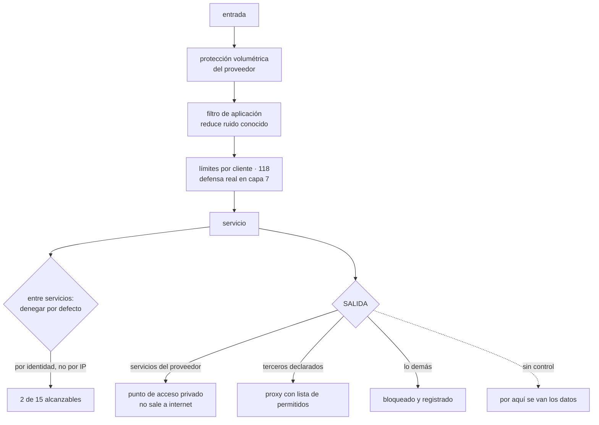

# 135 — Segmentación, perímetro, WAF, DDoS y egress

> [← 134 · Mínimo privilegio, acceso temporal y separación de funciones](../../part-11-security-governance-finops/134-minimo-privilegio-acceso-temporal-y-separacion-de-funciones/README.md) · [Índice de la parte](../README.md) · [136 · Cifrado, KMS, HSM, rotación y envelope encryption →](../../part-11-security-governance-finops/136-cifrado-kms-hsm-rotacion-y-envelope-encryption/README.md)

**Parte:** 11 — Seguridad, gobierno, cumplimiento y FinOps<br>
**Nivel:** avanzado · **Horas estimadas:** 4<br>
**Laboratorio:** `network` · **Estado:** `EXECUTABLE_CORE`

## 🎯 Propósito

Usar la red como la capa independiente que la clase 133 pedía: no como el control que decide quién entra, sino como el que **limita hasta dónde se llega y qué puede salir**. La clase defiende que la mitad olvidada es la salida —los datos se van por ahí, no por la entrada—, muestra por qué segmentar por identidad escala mejor que por dirección en entornos dinámicos, y trata los servicios de perímetro con honestidad: qué detienen de verdad, qué no, y por qué acaban en modo aviso durante catorce meses.

## 📚 Resultados de aprendizaje

Al finalizar podrás:

1. **Segmentar** con denegación por defecto y una secuencia de adopción viable.
2. **Controlar** la salida, que es por donde se van los datos.
3. **Situar** el filtro de aplicación y la protección de denegación de servicio por lo que hacen de verdad.
4. **Usar** conectividad privada para que el tráfico no salga a la red pública.
5. **Registrar** lo suficiente para investigar sin arruinarse.

## 🧩 Conceptos centrales

| Concepto | Comprensión verificable |
|---|---|
| `denegación por defecto` | Solo se permite lo declarado. Es lo que convierte la red en una capa; con permitir por defecto no limita nada. |
| `segmentación por identidad` | Autorizar por quién es la carga, no por su dirección. En entornos dinámicos, la dirección no identifica nada. |
| `control de salida` | Restringir a qué destinos externos puede conectar una carga. Es el control que limita la extracción de datos. |
| `punto de acceso privado` | Acceso a un servicio gestionado sin salir a la red pública, y restringido a tus propias cuentas. |
| `filtro de aplicación` | Inspecciona peticiones y bloquea patrones conocidos. Reduce ruido y no sustituye a corregir la vulnerabilidad. |
| `registro de flujos` | Anotación de las conexiones observadas. Es la base para pasar de permitir a denegar sin romper nada. |

## 🧠 Modelo mental

Gobernar no significa aprobar cada cambio: significa codificar límites, evidencia y responsabilidades para que los equipos puedan avanzar con seguridad.

Aplicado a esta clase, separa siempre cuatro planos: **intención** (qué necesita el usuario),
**configuración** (qué declaramos), **estado observado** (qué existe de verdad) y
**evidencia** (cómo sabemos que cumple). Confundirlos produce diseños que se ven correctos
en un diagrama pero fallan al operar.

## 🗺️ Flujo de razonamiento



## 📖 Desarrollo

### 1. Segmentar, y cómo llegar a denegar por defecto

Tras la clase 133, la red ya no decide quién es quién. Lo que sigue haciendo, y muy bien, es **limitar el alcance**:

```text
si un servicio comprometido puede alcanzar 14 de 15, el atacante
tiene 14 objetivos
si puede alcanzar 2, tiene 2
```

Y las unidades de segmentación, de más fuerte a más fina:

```text
CUENTA O PROYECTO      la frontera más difícil de cruzar        clase 133
RED VIRTUAL            separa entornos y dominios
SUBRED                 separa capas: pública, privada, datos
GRUPO O POLÍTICA       entre cargas concretas
MALLA CON IDENTIDAD    autoriza por identidad de la carga, con cifrado
```

Y la elección entre las dos últimas es la decisión práctica:

```text
POR DIRECCIÓN     funciona con recursos estables
                  y en contenedores las direcciones cambian a cada rato
                  → las reglas envejecen mal y acaban siendo amplias

POR IDENTIDAD     «el servicio pedidos puede llamar a precios»
                  → sobrevive a que todo se recree
                  → y añade autenticación mutua, que es una capa más
```

Y la secuencia de adopción, que es la misma que este programa lleva usando desde la clase 091 y que aquí es imprescindible:

```text
1. OBSERVAR   activar el registro de flujos y construir el mapa real
              de quién habla con quién
2. AVISAR     poner las reglas en modo aviso; recoger lo que se habría
              bloqueado
3. DENEGAR    cuando la lista de avisos esté vacía durante dos semanas
```

Y lo que aparece en el paso 1 es siempre lo mismo y siempre sorprende: **conexiones que nadie sabía que existían**, igual que las dieciocho dependencias de la clase 124.

Y una advertencia sobre las reglas amplias: `0.0.0.0/0` en un grupo interno **no es un error de configuración**, es la forma que toma la ley 16 cuando denegar cuesta demasiado. Si aparece, la pregunta es por qué fue más fácil eso que declarar lo necesario.

### 2. La salida, que es por donde se van los datos

Casi todo el esfuerzo se dedica a quién entra. Y los datos **salen**:

```text
un atacante que ya está dentro necesita sacar la información
un programa malicioso necesita hablar con quien lo controla
una biblioteca comprometida necesita enviar lo que recoge
```

Y el control de salida es lo que lo impide o lo hace evidente. Lo que se gana, en orden:

```text
limitar la extracción de datos
cortar la comunicación con la infraestructura del atacante
y, de regalo, un inventario exacto de dependencias externas
```

La tercera es útil desde el primer día aunque no se bloquee nada: **saber a cuántos destinos habla cada carga**. La respuesta suele estar entre cinco y quince, y encontrar cuarenta es una señal.

Y las tres formas de controlarlo, que se combinan:

```text
PUNTOS DE ACCESO PRIVADOS para los servicios del proveedor
  el tráfico no sale a la red pública
  y se restringe a tus propias cuentas
  → esto es lo que impide que alguien copie datos a un almacenamiento
    de OTRA organización usando el mismo servicio

PROXY CON LISTA DE PERMITIDOS para terceros
  por nombre de dominio, no por dirección
  → porque los servicios externos cambian de dirección constantemente

DENEGAR EL RESTO, y registrarlo
```

Y la parte incómoda: **las listas por dominio son laboriosas**. Un proveedor externo puede usar decenas de dominios y redes de distribución compartidas. Lo que hace viable el ejercicio:

```text
empezar por las cargas que tocan datos sensibles, no por todas
aceptar listas más amplias para lo que no los toca
y medir: destinos por carga, y cuántos son desconocidos
```

Y un detalle que se olvida y que anula el control: **la resolución de nombres**. Si una carga puede consultar cualquier servidor de nombres, puede sacar datos por ahí. Obligar a usar el resolutor propio y registrar las consultas es barato y es de los registros más útiles que existen para detectar algo comprometido.

Y el efecto colateral que enlaza con la clase 142: **la salida cuesta dinero**. Las pasarelas de traducción de direcciones, el tráfico entre zonas y la transferencia hacia fuera suelen estar entre las tres mayores partidas de red, y casi nadie las mira.

### 3. Perímetro: qué detiene de verdad

**El filtro de aplicación** inspecciona peticiones y bloquea patrones conocidos.

```text
detiene bien   exploración automatizada, intentos con patrones conocidos,
               ruido masivo, y da tiempo mientras se corrige algo
detiene mal    fallos de lógica de negocio, autorización rota,
               abuso con peticiones perfectamente válidas
no sustituye   a corregir la vulnerabilidad
```

Y su problema característico es el de siempre:

```text
en modo bloqueo produce falsos positivos
→ un cliente legítimo deja de funcionar
→ se pasa a modo aviso «temporalmente»
→ y sigue en modo aviso catorce meses después
```

Es la ley 16 y la ley 15 juntas, exactamente igual que los escáneres de la clase 101, y se corrige igual:

```text
activar por reglas, no todo de golpe
empezar por las que no dan falsos positivos
medir bloqueos legítimos frente a ilegítimos
y tener excepción por regla, con motivo y caducidad
```

**La denegación de servicio** tiene dos formas muy distintas:

```text
VOLUMÉTRICA     saturar el enlace con tráfico
  → no se puede absorber por cuenta propia: hace falta el proveedor
  → es de las pocas cosas que se resuelven contratando

DE APLICACIÓN   peticiones válidas y caras, en cantidad
  → parece tráfico normal
  → aquí no hay producto que la resuelva sola: se defiende con
    límites por cliente (clase 118), descarte por sobrecarga (clase 130)
    y capacidad conocida (clase 129)
```

Y lo que decide el resultado en la segunda no es el filtro, es **poder distinguir a los clientes**: si todo el tráfico es anónimo e indistinguible, cualquier límite castiga también a quien no molesta.

Y una precaución de coste, que sorprende: **absorber un ataque con autoescalado es pagarlo**. Conviene tener un techo, exactamente por el mismo motivo que la clase 117 lo puso a las funciones.

**La conectividad privada** merece una nota aparte porque hace dos cosas a la vez:

```text
el tráfico no atraviesa la red pública
y la política puede exigir que el servicio solo acepte peticiones
desde tus cuentas
→ lo segundo es un control de extracción de datos, no de red
```

La segunda línea es la que más aporta y la que menos se configura.

### 4. Ver lo que pasa por la red

Sin registro no se puede pasar de permitir a denegar, ni investigar nada después.

```text
REGISTRO DE FLUJOS      quién habló con quién, cuánto y si se permitió
  para qué   construir el mapa real, detectar conexiones raras,
             investigar un incidente
  cuidado    es voluminoso y caro; se muestrea, y se guarda agregado

REGISTRO DE NOMBRES     qué dominios se consultaron
  para qué   es la señal más útil para detectar algo comprometido
  cuidado    casi nadie lo activa, y cuesta poco

REGISTRO DEL FILTRO     qué se bloqueó y por qué regla
REGISTRO DEL PROXY      qué destinos externos se usaron
```

Y con la disciplina de coste de la clase 121: **el registro de flujos completo de un sistema grande cuesta más que el resto de la telemetría junta**. Se muestrea, se agrega y se conserva poco tiempo en detalle.

Y lo que conviene vigilar de forma continua:

```text
destinos externos nuevos por carga            ← lo más informativo
conexiones denegadas, agrupadas por origen
volumen de salida por carga, y su tendencia   ← extracción de datos
consultas de nombres a dominios recién creados
reglas con rangos amplios
reglas que no han permitido nada en 90 días   ← candidatas a borrar
```

La tercera es la que detecta una extracción en curso, y solo funciona si hay una base con la que comparar: **el volumen normal de salida de cada carga**.

Y la última aplica a la red lo mismo que la clase 134 hizo con los permisos: **una regla que no permite nada es una regla que sobra**.

Y la lista de comprobación de la clase:

```text
☐ los entornos están en cuentas o proyectos distintos
☐ hay denegación por defecto entre servicios, alcanzada por observar,
  avisar y denegar
☐ la autorización entre cargas es por identidad, no por dirección
☐ los servicios del proveedor se usan por punto de acceso privado
☐ esos puntos restringen el acceso a tus propias cuentas
☐ la salida a terceros pasa por una lista de permitidos
☐ la resolución de nombres está obligada al resolutor propio y registrada
☐ está medido a cuántos destinos habla cada carga
☐ el filtro de aplicación está en bloqueo por regla, no en aviso indefinido
☐ hay límites y descarte para el abuso en capa de aplicación
☐ el autoescalado tiene techo, para no pagar un ataque
☐ se vigilan destinos nuevos y volumen de salida por carga
☐ las reglas que no permiten nada se retiran
```

Y el cierre que enlaza con la clase siguiente: si el objetivo es que los datos no se puedan aprovechar aunque alguien llegue a ellos, hace falta la capa que la clase 133 puso sobre el dato y no sobre el camino. Cómo se cifra, quién controla las claves y qué protege de verdad cada opción es la materia de la clase 136.

## 🔬 Ejemplo trabajado

**CloudShop aplica segmentación y control de salida. Lo que encuentra al observar antes de bloquear es más valioso que el bloqueo mismo, y una de las cosas que aparece lleva once meses en producción.**

**Paso 1: observar. El mapa real.**

```text
servicios                                                    15
conexiones declaradas en la documentación                    23
conexiones observadas en 30 días de registro de flujos       58
conexiones que nadie esperaba                                35
```

Y entre las treinta y cinco:

```text
11  servicios que se llamaban entre sí por caminos antiguos
 9  herramientas de terceros con agentes instalados
 7  trabajos programados que nadie recordaba
 5  conexiones desde entornos inferiores hacia producción   ← grave
 3  conexiones a destinos externos no documentados
```

Las cinco de dev a producción son las que la clase 133 había dado por cortadas: **existían por reglas antiguas que nadie había retirado**.

**Paso 2: avisar.**

```text
semana 1   conexiones que se habrían bloqueado           412
           de ellas, legítimas y no observadas            18
semana 2                                                  47
semana 3                                                   6
semana 4                                                   0
→ se activó la denegación
```

**Paso 3: el resultado, medido con el ejercicio de la clase 133.**

```text                                          antes         después
servicios alcanzables desde uno comprometido    14 de 15       2 de 15
conexiones permitidas                            todas          41
reglas con rango amplio                             9            0
conexiones de entornos inferiores a producción      5            0
```

Y la decisión de hacerlo por identidad en vez de por dirección:

```text                                    por dirección     por identidad
reglas que hubo que mantener                  310                41
reglas rotas por un despliegue (6 meses)       23                 0
autenticación mutua entre servicios            no                sí
esfuerzo de mantenimiento                    alto              bajo
```

Las veintitrés reglas rotas por despliegues eran el argumento: **en un entorno donde todo se recrea, una regla por dirección caduca sola**.

**La salida: cuarenta y un destinos y uno que no debía estar.**

Antes de bloquear nada, solo midiendo:

```text
destinos externos distintos, todas las cargas               41
esperados según documentación                               12
desconocidos                                                29
```

Y al clasificar los veintinueve:

```text
14  redes de distribución de contenido de dependencias legítimas
 8  telemetría de bibliotecas de terceros
 4  actualizaciones automáticas de agentes
 2  servicios que un equipo probó y dejó configurados
 1  un almacenamiento de objetos de OTRA organización
```

El último se investigó de inmediato:

```text
origen        un proceso de exportación de informes
destino       un almacenamiento de un antiguo proveedor de análisis
volumen       1,2 GB al mes, durante 11 meses
contenido     informes agregados de ventas, sin datos personales
causa         el contrato terminó y el proceso siguió ejecutándose
quién lo sabía  nadie
```

Once meses enviando datos de negocio a una organización que ya no era proveedora. **No fue un ataque: fue un proceso que nadie retiró**, y ninguna de las diez clases de la parte 10 lo habría detectado porque el sistema funcionaba correctamente.

Y es la ley 13 en su forma más cara: **lo que nadie paró siguió ejecutándose**.

```text                                          antes         después
destinos externos permitidos                    sin límite       17
tráfico a destinos no declarados               1,2 GB/mes         0
registro de consultas de nombres                  no             sí
destinos nuevos detectados en 6 meses              —              6
  de ellos, legítimos y añadidos                   —              5
  de ellos, investigados como sospechosos          —              1
```

**Los puntos de acceso privados.**

```text                                          antes         después
tráfico a servicios del proveedor         por internet    por punto privado
restricción a cuentas propias                 no             sí
coste de salida por ese tráfico            310 €/mes         0 €
```

Y la restricción a cuentas propias bloqueó, en un ensayo de la clase 131, **una copia de datos a un almacenamiento externo hecha con credenciales legítimas**: el permiso lo autorizaba y la política de red lo impidió. Es exactamente una capa independiente funcionando.

**El filtro de aplicación, catorce meses en modo aviso.**

```text
activado hacía                                        14 meses
modo                                                  aviso
motivo                     falsos positivos en la API de socios
reglas activas                                            340
bloqueos que se habrían producido, al día              12.400
de ellos, legítimos (clientes reales)                     ~90
```

Noventa clientes legítimos al día bloqueados era inaceptable, así que **todo estaba en aviso, incluidas las 300 reglas que no daban ningún falso positivo**.

```text                                          antes         después
reglas en bloqueo                              0 de 340       308 de 340
reglas en aviso, con excepción y fecha             —             32
falsos positivos al día                            —              2
peticiones maliciosas bloqueadas al día            0          11.900
```

**El coste de red, que nadie miraba.**

```text
partidas de red, al mes
  pasarelas de traducción de direcciones                 890 €
  tráfico entre zonas                                    640 €
  transferencia hacia internet                           410 €
  registro de flujos completo                            720 €
                                                       ──────
                                                       2.660 €
comparado con el cómputo                               9.200 €
proporción                                                29 %
```

Y las correcciones, que en parte son las mismas del control de salida:

```text                                          antes         después
puntos de acceso privados                       no             sí     −310 €
tráfico entre zonas evitable                    sí         reparto por zona
                                                                      −380 €
registro de flujos                          completo      muestreado 1:10
                                                          + agregado  −540 €
total de red                                 2.660 €        1.430 €
```

**A los seis meses.**

```text                                          antes         después
servicios alcanzables desde uno comprometido    14 de 15       2 de 15
conexiones observadas no documentadas              35              0
conexiones de entornos inferiores a producción      5              0
destinos externos permitidos                  sin límite         17
tráfico a destinos no declarados             1,2 GB/mes           0
registro de consultas de nombres                  no             sí
reglas del filtro en bloqueo                   0 de 340      308 de 340
peticiones maliciosas bloqueadas al día            0          11.900
coste mensual de red                          2.660 €        1.430 €
```

**La lección que esta clase traslada a la parte 11**: el hallazgo más grave no lo produjo ningún bloqueo, sino **mirar a dónde salía el tráfico antes de bloquear nada**: un proceso llevaba once meses enviando informes de ventas a un proveedor con el que ya no había contrato. Y el filtro de aplicación llevaba catorce meses sin bloquear absolutamente nada porque treinta y dos reglas de trescientas cuarenta daban falsos positivos, que es la ley 16 en su forma más pura: **un control se apagó entero por el 9 % que molestaba**.

## 🧪 Laboratorio guiado

Ejecuta desde la raíz:

```bash
python classes/part-11-security-governance-finops/135-segmentacion-perimetro-waf-ddos-y-egress/lab.py
```

El laboratorio selecciona el motor de práctica **`network`** y produce
`lab_result.json`. El escenario, sus comprobaciones y el artefacto esperado corresponden a
esta clase; no requiere credenciales y deja explícito qué debe revalidarse en un sandbox real.

1. Lee `exercise.steps` y formula una predicción antes de ejecutar.
2. Ejecuta la práctica y verifica todos los elementos de `checks`.
3. Provoca el caso de `negative_test` y explica la señal observada.
4. Materializa `arquitectura-defensiva` en `evidence/` usando la plantilla indicada.
5. Para proveedor real, sigue `sandbox.requires`, registra costo y ejecuta `destroy`.

### Evidencia esperada

El artefacto principal es una topología con rutas, puertos y controles. Además, la entrega debe incluir el comando ejecutado,
la salida estructurada y una conclusión que no exceda lo observado.

## 🏆 Reto verificable

Construye **`arquitectura-defensiva`** para el caso CloudShop. Incluye una alternativa descartada,
un supuesto que pueda falsarse, una prueba de fallo y una decisión de rollback.

## ✅ Criterio de aceptación

- [ ] `lab.py` termina con código 0 y genera JSON válido.
- [ ] La entrega conecta al menos tres requisitos con mecanismos verificables.
- [ ] Existe una prueba positiva y una prueba negativa con evidencia.
- [ ] Seguridad, costo y operación aparecen como decisiones, no como anexos.
- [ ] Se declara una limitación y una condición que obligaría a revisar el diseño.
- [ ] Otra persona puede repetir el recorrido sin conocimiento tácito.

## ⚠️ Errores frecuentes

| Síntoma | Causa probable | Corrección |
|---|---|---|
| Un servicio comprometido puede alcanzar casi todos los demás | Se permite por defecto entre cargas del mismo entorno | Observa con registro de flujos, pasa a modo aviso y activa denegación por defecto cuando la lista esté vacía. |
| Las reglas de red se rompen con cada despliegue | Autorizan por dirección en un entorno donde todo se recrea | Autoriza por identidad de la carga, con autenticación mutua. |
| Se descubren datos saliendo hacia un destino externo desconocido | No hay control ni inventario de salida | Mide a cuántos destinos habla cada carga, pon lista de permitidos por dominio y obliga y registra la resolución de nombres. |
| El filtro de aplicación lleva meses sin bloquear nada | Unas pocas reglas dan falsos positivos y se apagó el conjunto entero | Activa el bloqueo regla a regla y deja en aviso solo las conflictivas, con excepción, motivo y caducidad. |
| Un permiso legítimo permite copiar datos a otra organización | El servicio gestionado se usa por internet y sin restricción de cuentas | Usa puntos de acceso privados y exige en la política que solo acepten peticiones desde tus cuentas. |
| La factura de red es una de las mayores y nadie la mira | Pasarelas de traducción, tráfico entre zonas y registro de flujos completo | Puntos privados, reparto por zona y muestreo del registro de flujos con agregación. |

## 🛡️ Seguridad, ética y costo

Trabaja con cuentas propias o sandboxes autorizados. No publiques secretos, identificadores
reales ni datos personales. Antes de crear recursos pagos define presupuesto, etiquetas y
comando de destrucción; después verifica que no queden recursos huérfanos. Los ejemplos
locales enseñan contratos, pero no certifican cumplimiento ni disponibilidad de producción.

## ❓ Preguntas de comprobación

1. ¿Qué secuencia permite llegar a denegación por defecto sin romper nada?
2. ¿Por qué la segmentación por identidad envejece mejor que la basada en direcciones?
3. ¿Qué tres cosas aporta controlar la salida, y cuál sirve desde el primer día sin bloquear nada?
4. ¿Qué detiene y qué no detiene un filtro de aplicación?
5. ¿Qué dos cosas distintas aporta un punto de acceso privado?

## 🔗 Referencias

- NIST (2016). *SP 800-125B / segmentación y microsegmentación* — unidades de aislamiento y su aplicación. <https://csrc.nist.gov/pubs/sp/800/125/b/final>
- Kubernetes (2025). *Network policies* — denegación por defecto y autorización entre cargas. <https://kubernetes.io/docs/concepts/services-networking/network-policies/>
- AWS (2025). *VPC endpoints and endpoint policies* — acceso privado y restricción a cuentas propias. <https://docs.aws.amazon.com/vpc/latest/privatelink/vpc-endpoints.html>
- OWASP (2025). *Web application firewall: benefits and limitations* — qué filtra y qué no. <https://owasp.org/www-community/Web_Application_Firewall>
- Cloudflare (2025). *DDoS: volumetric and application-layer attacks* — diferencias y defensas aplicables. <https://developers.cloudflare.com/ddos-protection/>
- Documentación oficial vigente del servicio implementado; registra URL y fecha de consulta.

---

> [Evaluación](assessment.md) · [Contrato de clase](lesson.yaml) · [Índice de la parte](../README.md)

| Anterior | Índice | Siguiente |
|---|---|---|
| [← 134 · Mínimo privilegio, acceso temporal y separación de funciones](../../part-11-security-governance-finops/134-minimo-privilegio-acceso-temporal-y-separacion-de-funciones/README.md) | [Parte 11](../README.md) · [Programa](../../README.md) | [136 · Cifrado, KMS, HSM, rotación y envelope encryption →](../../part-11-security-governance-finops/136-cifrado-kms-hsm-rotacion-y-envelope-encryption/README.md) |
