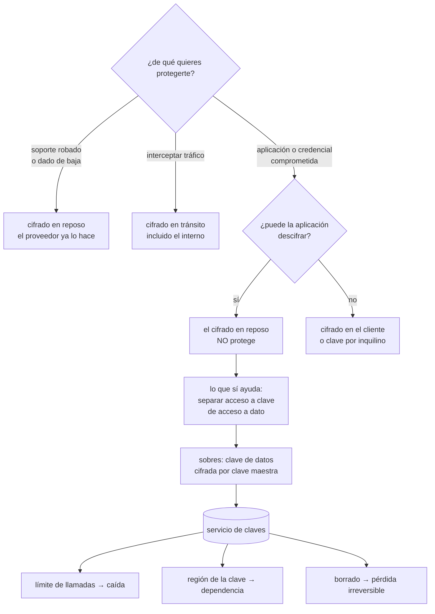

# 136 — Cifrado, KMS, HSM, rotación y envelope encryption

> [← 135 · Segmentación, perímetro, WAF, DDoS y egress](../../part-11-security-governance-finops/135-segmentacion-perimetro-waf-ddos-y-egress/README.md) · [Índice de la parte](../README.md) · [137 · Gestión de secretos y credenciales de workloads →](../../part-11-security-governance-finops/137-gestion-de-secretos-y-credenciales-de-workloads/README.md)

**Parte:** 11 — Seguridad, gobierno, cumplimiento y FinOps<br>
**Nivel:** avanzado · **Horas estimadas:** 4<br>
**Laboratorio:** `security` · **Estado:** `EXECUTABLE_CORE`

## 🎯 Propósito

Poner el cifrado en su sitio, que no es donde suele ponerse. La clase empieza por la pregunta que casi nunca se hace —**¿de qué protege exactamente?**— y llega a una conclusión incómoda: el cifrado en reposo, que es lo que todo el mundo enseña en una auditoría, **no protege del escenario más probable**, porque la aplicación comprometida puede descifrar. A partir de ahí desarrolla lo que sí ayuda: separar quién usa una clave de quién accede al dato, el cifrado por sobres y sus consecuencias, y los tres fallos operativos que convierten una clave en una caída o en una pérdida irreversible.

## 📚 Resultados de aprendizaje

Al finalizar podrás:

1. **Responder** de qué protege cada tipo de cifrado y de qué no.
2. **Separar** el acceso a la clave del acceso al dato.
3. **Explicar** el cifrado por sobres y qué implica rotar la clave maestra.
4. **Evitar** los tres fallos operativos: caída por límite, indisponibilidad entre regiones y borrado irreversible.
5. **Decidir** qué rotar, con qué frecuencia y por qué.

## 🧩 Conceptos centrales

| Concepto | Comprensión verificable |
|---|---|
| `cifrado en reposo` | Los datos se guardan cifrados en el soporte. Protege del acceso físico o directo al almacenamiento; no de una aplicación comprometida. |
| `cifrado por sobres` | Una clave de datos cifra el contenido y una clave maestra cifra la clave de datos. Solo la maestra vive en el servicio de claves. |
| `separación de uso y administración` | Quien puede cifrar y descifrar con una clave no es quien puede modificar su política ni borrarla. |
| `rotación` | Emitir una versión nueva de la clave. Con sobres, no vuelve a cifrar los datos existentes: acota cuánto se cifra con cada versión. |
| `borrado de clave` | Destruir la clave destruye los datos que protegía. Es irreversible y por eso hay periodo de espera. |
| `cifrado en el cliente` | El dato se cifra antes de llegar al servicio, que nunca ve el contenido. Es lo único que protege del propio servicio. |

## 🧠 Modelo mental

Gobernar no significa aprobar cada cambio: significa codificar límites, evidencia y responsabilidades para que los equipos puedan avanzar con seguridad.

Aplicado a esta clase, separa siempre cuatro planos: **intención** (qué necesita el usuario),
**configuración** (qué declaramos), **estado observado** (qué existe de verdad) y
**evidencia** (cómo sabemos que cumple). Confundirlos produce diseños que se ven correctos
en un diagrama pero fallan al operar.

## 🗺️ Flujo de razonamiento



## 📖 Desarrollo

### 1. De qué protege cada cosa

La pregunta que ordena esta clase entera:

```text
¿contra qué amenaza concreta protege este cifrado?
```

Y las tres amenazas habituales, con la respuesta honesta:

```text
1. ALGUIEN SE LLEVA EL SOPORTE FÍSICO
   o el proveedor da de baja un disco sin borrarlo
   → cifrado en reposo. Resuelto.
   → y los tres grandes proveedores lo hacen por defecto
   → aportación adicional de configurarlo tú: pequeña

2. ALGUIEN INTERCEPTA EL TRÁFICO
   → cifrado en tránsito. Resuelto.
   → y el que suele faltar es el INTERNO: entre servicios,
     hacia la base de datos, hacia el caché

3. ALGUIEN COMPROMETE LA APLICACIÓN O UNA CREDENCIAL
   → el cifrado en reposo NO PROTEGE
   → porque la aplicación puede descifrar: para eso tiene la clave
```

Y la tercera es, con mucha diferencia, la más probable. De ahí la conclusión incómoda:

```text
«ciframos en reposo» responde a una casilla de auditoría
y casi nada sobre el riesgo real
```

Lo que sí ayuda frente a la tercera, en orden de eficacia:

```text
MENOS PERMISOS Y MENOS PERMANENTES        clase 134
  → el mejor control frente a este escenario no es criptográfico

SEPARAR ACCESO A LA CLAVE DEL ACCESO AL DATO
  → quien compromete el almacenamiento no obtiene la clave
  → es la independencia de capas de la clase 133

CLAVE DISTINTA POR INQUILINO O POR ÁMBITO
  → un compromiso alcanza una parte, no todo

CIFRADO EN EL CLIENTE
  → el servicio nunca ve el contenido
  → protege incluso del proveedor, y cuesta caro:
    no se puede buscar, ni indexar, ni ordenar por ese campo
```

Y la última tiene un ámbito realista: **unos pocos campos**, no la base entera. Números de tarjeta, documentos de identidad, datos de salud.

Y una lista que conviene tener presente porque son los casos donde el cifrado en reposo **sí** aporta de verdad:

```text
copias de seguridad que se exportan
datos en almacenamiento de objetos con acceso amplio
discos que se clonan para depurar
instantáneas compartidas entre cuentas
```

En todos ellos el dato sale del contexto de la aplicación, y ahí la clave sí marca la diferencia.

### 2. Sobres, y qué significa rotar

Cifrar directamente con una clave del servicio gestionado no escala: cada operación sería una llamada remota. El patrón habitual es de dos niveles:

```text
1. se genera una CLAVE DE DATOS aleatoria
2. esa clave cifra el contenido, localmente y rápido
3. la clave de datos se cifra con la CLAVE MAESTRA, en el servicio
4. se guarda el dato cifrado junto a la clave de datos cifrada
5. la clave de datos en claro se borra de memoria
```

Y para leer, se pide al servicio que descifre la clave de datos y se descifra el contenido en local.

Lo que se gana:

```text
velocidad         el cifrado del contenido no pasa por la red
límites           una llamada al servicio por objeto, no por byte
alcance           una clave de datos por objeto, por fichero o por inquilino
```

Y la consecuencia que más se malinterpreta:

```text
ROTAR LA CLAVE MAESTRA NO VUELVE A CIFRAR LOS DATOS

la versión nueva se usa para lo nuevo
lo viejo sigue cifrado con la versión anterior, que se conserva
→ rotar acota cuánto material se cifra con cada versión
→ NO invalida nada de lo anterior
```

Y de ahí la respuesta a «cada cuánto se rota», que depende de qué se persigue:

```text
limitar el material por versión           rotación automática anual basta
responder a una sospecha de compromiso    rotar NO basta: hay que
                                          volver a cifrar y deshabilitar
                                          la versión antigua
cumplir una norma                         lo que diga la norma
```

Y una distinción práctica que evita mucho esfuerzo mal dirigido:

```text
lo que se filtra y hay que rotar a menudo   credenciales, testigos,
                                            claves de API      clase 137
lo que casi nunca se filtra                 una clave maestra que no sale
                                            del servicio
```

**Quién puede qué**, que es la separación de la clase 134 aplicada aquí:

```text
USAR       cifrar y descifrar con la clave
ADMINISTRAR  cambiar su política, deshabilitarla, borrarla
→ y no deben ser la misma identidad
→ ni la aplicación debe poder administrar la clave que usa
```

Y el resultado de hacerlo bien, medible: **quien compromete la aplicación puede descifrar mientras tenga acceso, y no puede llevarse la clave ni conceder acceso a nadie más**.

### 3. Tres fallos operativos que cuestan caro

**1. El límite de llamadas al servicio de claves.**

Es una causa real de caídas y sorprende a todo el mundo:

```text
el servicio de claves tiene un límite de peticiones por segundo
si cada operación pide descifrar una clave de datos, se alcanza
→ y entonces falla todo lo que necesita descifrar, a la vez
```

Lo que lo evita:

```text
cachear la clave de datos descifrada en memoria, con caducidad corta
una clave de datos por lote o por fichero, no por registro
y vigilar las llamadas por segundo como cualquier otra saturación
```

**2. La clave vive en una región.**

```text
datos replicados en tres regiones
clave maestra en una sola
→ si esa región no responde, los datos de las otras dos
  no se pueden descifrar
```

Es una dependencia oculta que rompe el diseño de recuperación de la clase 088. Las salidas: claves multirregión, réplicas de clave, o una clave por región con una política que las mantenga equivalentes.

**3. Borrar una clave borra los datos.**

```text
destruir la clave hace ilegible todo lo que protegía
es irreversible: la ley 14 en su forma más literal
```

Por eso los servicios imponen un periodo de espera —de días a un mes— entre solicitar el borrado y ejecutarlo. Y lo que hay que tener:

```text
el borrado de claves en la frontera de permisos: que NADIE pueda
  hacerlo sin una aprobación aparte              clase 134
alerta inmediata cuando se solicita un borrado
y una comprobación antes de aprobarlo: ¿qué datos protege esta clave?
  → y esa pregunta debe tener respuesta escrita, no una investigación
```

La última exige llevar **inventario de qué protege cada clave**, que casi nadie tiene y que es lo primero que se echa en falta.

Y dos temas que conviene situar sin exagerarlos:

```text
MÓDULO DEDICADO (dispositivo)
  hace falta cuando una norma lo exige o cuando la clave no debe poder
  salir jamás en ningún formato
  → para la mayoría, el servicio gestionado basta y es más fiable

APORTAR TU PROPIO MATERIAL DE CLAVE
  permite decir que el proveedor no generó la clave
  y sigue estando en su servicio para poder usarla
  → el beneficio real es de gobierno, no criptográfico
  → y añade la obligación de custodiar el material fuera
```

Y el coste, que también se decide aquí: el servicio de claves se factura **por clave y por llamada**, y un diseño con una clave por registro y sin caché es caro además de frágil.

### 4. Certificados y cifrado en tránsito

El cifrado en tránsito público está resuelto desde hace años. El que falta es el interno:

```text
entre servicios dentro de la red                a menudo en claro
hacia la base de datos y el caché               a menudo en claro
entre zonas del mismo proveedor                 depende del servicio
hacia servicios gestionados                     casi siempre cifrado
```

Y el argumento de «es red interna» es exactamente el modelo de perímetro que la clase 133 descartó. La forma sana de resolverlo sin gestionar certificados a mano es la de la clase 135: **autenticación mutua gestionada por la malla**, que cifra y autentica a la vez.

**Los certificados** son la causa clásica de caídas evitables:

```text
caduca un certificado interno un domingo
nadie lo vigilaba porque «lo renovamos hace un año»
→ caída total, y el procedimiento de renovación no está probado
```

Lo que lo evita, y ya estaba en la clase 125 como indicador adelantado:

```text
emisión y renovación automáticas, siempre
inventario de todos los certificados, incluidos los internos
  y los que están dentro de imágenes de contenedor
alerta con 30 y con 14 días de margen
y un ensayo: dejar caducar uno a propósito en preproducción
```

La segunda línea es donde aparecen las sorpresas: **certificados incrustados en imágenes, en configuraciones de clientes y en dispositivos**, que ningún inventario automático encuentra.

Y dos precauciones más:

```text
la validación del certificado del servidor a veces está desactivada
  «porque daba problemas» → eso anula el cifrado como control
las cadenas de confianza internas caducan también
  y una autoridad interna caducada afecta a todo a la vez
```

Y la lista de comprobación de la clase:

```text
☐ está escrito de qué amenaza protege cada cifrado que se aplica
☐ el tráfico interno entre servicios va cifrado
☐ la validación de certificados no está desactivada en ningún cliente
☐ quien usa una clave no puede administrarla
☐ hay clave distinta por ámbito o por inquilino donde importa
☐ los campos más sensibles se cifran en el cliente
☐ hay caché de claves de datos y se vigilan las llamadas por segundo
☐ las claves están disponibles en todas las regiones donde hay datos
☐ borrar una clave requiere aprobación aparte y dispara alerta
☐ existe inventario de qué protege cada clave
☐ los certificados se renuevan solos y hay inventario, incluidos los internos
☐ se ensaya la caducidad de un certificado en preproducción
```

Y el cierre que enlaza con la clase siguiente: las claves maestras no salen del servicio, y las credenciales que las cargas usan para todo lo demás sí circulan, se copian y se filtran. Cómo se guardan, cómo se entregan y cómo se rotan es la materia de la clase 137.

## 🔬 Ejemplo trabajado

**CloudShop responde a una auditoría con «todo está cifrado en reposo y en tránsito». El ejercicio consiste en comprobar qué protege eso de verdad, y termina con una caída causada por el propio servicio de claves.**

**La revisión de la respuesta a la auditoría.**

```text
afirmación                        realidad comprobada
«cifrado en reposo»               sí, con claves gestionadas por el proveedor
                                  en 14 de 14 almacenes
«cifrado en tránsito»             sí hacia fuera
                                  NO entre 11 de 15 servicios internos
                                  NO hacia la base de datos ni el caché
```

Y la pregunta del apartado primero, aplicada al escenario más probable:

```text
si se compromete la credencial del servicio de pedidos,
¿qué impide leer la base entera?
  el cifrado en reposo              NO: la aplicación descifra
  los permisos                      sí, y son de lectura completa
  la red                            sí, tras la clase 135
  el cifrado por campo              no existía
```

**El cifrado en reposo no aportaba nada frente al riesgo principal**, y eso era exactamente lo que la respuesta a la auditoría daba a entender.

**Lo que se hizo, en orden de eficacia.**

```text
1. cifrado interno entre servicios (autenticación mutua de la malla)
   11 de 15 servicios pasaron de claro a cifrado y autenticado
   coste: activar una opción; el mayor trabajo fue el inventario

2. separar uso de administración de las claves
   antes: la identidad de la aplicación podía modificar la política
          de su propia clave
   después: solo usar; administrar queda en una identidad aparte

3. clave por inquilino en el almacén de documentos de clientes
   antes: una clave para 190 clientes
   después: una por cliente
   → un compromiso alcanza los datos de uno, no de todos

4. cifrado en el cliente para 3 campos
   documento de identidad, cuenta bancaria y datos de salud
   → el servicio de datos nunca ve el contenido
   coste asumido: esos 3 campos no se pueden buscar ni ordenar
```

Y el efecto medido en el ejercicio de alcance de la clase 133:

```text                                          antes         después
datos legibles al comprometer pedidos      base completa    pedidos, sin
                                                            los 3 campos
datos legibles al comprometer el almacén
de documentos                              190 clientes      1 cliente
```

**La caída por el límite de llamadas.**

```text
09:40  campaña; el tráfico se triplica
09:41  el servicio de documentos pide descifrar una clave de datos
       POR CADA lectura
09:41  llamadas al servicio de claves: de 400/s a 3.100/s
09:42  límite alcanzado: 2.500/s
09:42  errores en CUANTO necesitaba descifrar, a la vez
09:58  se mitiga subiendo el límite (petición al proveedor: 16 min)
duración                                              18 min
```

Y el diagnóstico: **una clave de datos por registro, sin caché**.

```text                                    antes            después
clave de datos                          por registro     por documento
caché de claves descifradas             no               sí, 5 min
llamadas al servicio de claves en el pico  3.100/s          38/s
coste mensual del servicio de claves       410 €            12 €
límite alcanzado desde entonces             —               nunca
vigilancia de llamadas por segundo         no              sí, con alerta
```

Ochenta veces menos llamadas y un coste treinta veces menor, **con el mismo nivel de protección**.

**La dependencia entre regiones, encontrada en un ensayo.**

En un experimento de la clase 131 —pérdida de una región—:

```text
datos replicados en 3 regiones                       sí
claves maestras                          todas en la región principal
resultado del ensayo   los datos de las otras dos regiones no se podían
                       descifrar con la principal caída
plan de recuperación   quedaba invalidado por completo
```

```text                                          antes         después
claves                                    1 región      multirregión (4)
                                                        o réplica por región
ensayo repetido                              falla        correcto
tiempo de recuperación con la región
principal caída                            imposible       11 min
```

**El borrado que casi ocurre.**

```text
mes 7   limpieza de recursos antiguos por un guion automático
        marcó para borrar 6 claves «sin uso reciente»
        de ellas, 1 protegía las copias de seguridad de 2023-2024
detectado por   la alerta de solicitud de borrado, añadida 2 meses antes
periodo de espera del proveedor                        30 días
tiempo hasta cancelarlo                                 40 min
```

Y las dos correcciones:

```text                                          antes         después
borrado de claves                    permitido a la
                                     identidad de limpieza    en la frontera
                                                              de permisos
aprobación                                no              2 personas
inventario de qué protege cada clave      no              sí, 22 claves
alerta al solicitar borrado           añadida en el mes 5   sí
```

Y la fila del inventario es la que hizo posible responder en cuarenta minutos: **sin ella, averiguar qué protegía esa clave habría llevado días**.

**Los certificados.**

```text
inventario inicial
  certificados públicos, renovados automáticamente         14
  certificados internos, renovados a mano                  31
  certificados dentro de imágenes de contenedor             6   ← nadie los
                                                                conocía
  clientes con validación desactivada                       4
  autoridad interna, caduca en                        14 meses
```

```text                                          antes         después
renovación automática                        14 de 51       51 de 51
validación desactivada                          4              0
alerta a 30 y 14 días                          no             sí
ensayo de caducidad en preproducción           no          semestral
caídas por certificado caducado             2 / 2 años         0
```

Y el ensayo del primer semestre encontró que **el procedimiento de renovación de la autoridad interna no existía**, con catorce meses de margen para escribirlo.

**A los seis meses.**

```text                                          antes         después
servicios con tráfico interno cifrado         4 de 15       15 de 15
identidades que administran su propia clave      11             0
claves por inquilino donde importa                1           190
campos cifrados en el cliente                     0             3
llamadas al servicio de claves en el pico     3.100/s         38/s
coste del servicio de claves                   410 €          12 €
claves disponibles en todas las regiones         no            sí
inventario de qué protege cada clave             no        22 claves
borrados de clave posibles sin aprobación        sí            no
certificados con renovación automática        14 de 51      51 de 51
caídas por cifrado o claves                 3 / 6 meses        0
```

**La lección que esta clase traslada a la parte 11**: la respuesta «todo está cifrado» era literalmente cierta y **no protegía del escenario más probable**, porque la aplicación comprometida tiene por definición permiso para descifrar. Lo que sí cambió el riesgo fue separar quién usa una clave de quién la administra y trocearla por inquilino. Y el propio servicio de claves causó una caída de dieciocho minutos y estuvo a punto de destruir dos años de copias: **la criptografía no falló ni una vez; falló todo lo que la rodea**.

## 🧪 Laboratorio guiado

Ejecuta desde la raíz:

```bash
python classes/part-11-security-governance-finops/136-cifrado-kms-hsm-rotacion-y-envelope-encryption/lab.py
```

El laboratorio selecciona el motor de práctica **`security`** y produce
`lab_result.json`. El escenario, sus comprobaciones y el artefacto esperado corresponden a
esta clase; no requiere credenciales y deja explícito qué debe revalidarse en un sandbox real.

1. Lee `exercise.steps` y formula una predicción antes de ejecutar.
2. Ejecuta la práctica y verifica todos los elementos de `checks`.
3. Provoca el caso de `negative_test` y explica la señal observada.
4. Materializa `jerarquia-claves` en `evidence/` usando la plantilla indicada.
5. Para proveedor real, sigue `sandbox.requires`, registra costo y ejecuta `destroy`.

### Evidencia esperada

El artefacto principal es un control con amenaza, mitigación y evidencia. Además, la entrega debe incluir el comando ejecutado,
la salida estructurada y una conclusión que no exceda lo observado.

## 🏆 Reto verificable

Construye **`jerarquia-claves`** para el caso CloudShop. Incluye una alternativa descartada,
un supuesto que pueda falsarse, una prueba de fallo y una decisión de rollback.

## ✅ Criterio de aceptación

- [ ] `lab.py` termina con código 0 y genera JSON válido.
- [ ] La entrega conecta al menos tres requisitos con mecanismos verificables.
- [ ] Existe una prueba positiva y una prueba negativa con evidencia.
- [ ] Seguridad, costo y operación aparecen como decisiones, no como anexos.
- [ ] Se declara una limitación y una condición que obligaría a revisar el diseño.
- [ ] Otra persona puede repetir el recorrido sin conocimiento tácito.

## ⚠️ Errores frecuentes

| Síntoma | Causa probable | Corrección |
|---|---|---|
| Se responde a una auditoría que todo está cifrado y el riesgo real no baja | El cifrado en reposo no protege de una aplicación o credencial comprometida, que es el escenario más probable | Escribe de qué amenaza protege cada cifrado; añade permisos mínimos, separación de clave y dato, claves por ámbito y cifrado en el cliente para lo más sensible. |
| El servicio de claves alcanza su límite y falla todo lo que descifra | Una clave de datos por registro y sin caché | Agrupa por documento o lote, cachea la clave descifrada con caducidad corta y vigila las llamadas por segundo. |
| Con una región caída no se pueden descifrar datos de las demás | Las claves maestras viven en una sola región | Claves multirregión o réplica por región, y comprueba el plan de recuperación con un ensayo. |
| Un proceso automático solicita borrar claves en uso | El borrado no está en la frontera de permisos y no hay inventario de qué protege cada clave | Prohíbe el borrado en la frontera, exige aprobación aparte, alerta al solicitarlo y mantén el inventario. |
| Se rota la clave maestra y se supone que los datos antiguos quedan protegidos | Con sobres, rotar no vuelve a cifrar nada | Si hay sospecha de compromiso, vuelve a cifrar y deshabilita la versión antigua; la rotación periódica solo acota material por versión. |
| Un certificado caduca y provoca una caída | Renovación manual, inventario incompleto y certificados escondidos en imágenes | Renovación automática, inventario completo, alertas a 30 y 14 días y ensayo de caducidad en preproducción. |

## 🛡️ Seguridad, ética y costo

Trabaja con cuentas propias o sandboxes autorizados. No publiques secretos, identificadores
reales ni datos personales. Antes de crear recursos pagos define presupuesto, etiquetas y
comando de destrucción; después verifica que no queden recursos huérfanos. Los ejemplos
locales enseñan contratos, pero no certifican cumplimiento ni disponibilidad de producción.

## ❓ Preguntas de comprobación

1. ¿De qué protege el cifrado en reposo y de qué no?
2. ¿Qué aporta el cifrado por sobres y qué NO hace la rotación de la clave maestra?
3. ¿Por qué quien usa una clave no debe poder administrarla?
4. ¿Cómo puede el servicio de claves causar una caída y cómo se evita?
5. ¿Por qué borrar una clave es irreversible y qué hace falta antes de aprobarlo?

## 🔗 Referencias

- AWS (2025). *KMS: envelope encryption and data key caching* — mecanismo, límites y caché. <https://docs.aws.amazon.com/kms/latest/developerguide/concepts.html>
- Google Cloud (2025). *Cloud KMS: key rotation and key destruction* — qué implica rotar y el periodo de espera al destruir. <https://cloud.google.com/kms/docs/key-rotation>
- Azure (2025). *Key Vault: keys, secrets and access policies* — separación entre uso y administración. <https://learn.microsoft.com/azure/key-vault/general/security-features>
- NIST (2020). *SP 800-57: key management recommendations* — periodos de uso, rotación y custodia. <https://csrc.nist.gov/pubs/sp/800/57/pt1/r5/final>
- OWASP (2025). *Transport layer security cheat sheet* — cifrado interno y validación de certificados. <https://cheatsheetseries.owasp.org/cheatsheets/Transport_Layer_Security_Cheat_Sheet.html>
- Documentación oficial vigente del servicio implementado; registra URL y fecha de consulta.

---

> [Evaluación](assessment.md) · [Contrato de clase](lesson.yaml) · [Índice de la parte](../README.md)

| Anterior | Índice | Siguiente |
|---|---|---|
| [← 135 · Segmentación, perímetro, WAF, DDoS y egress](../../part-11-security-governance-finops/135-segmentacion-perimetro-waf-ddos-y-egress/README.md) | [Parte 11](../README.md) · [Programa](../../README.md) | [137 · Gestión de secretos y credenciales de workloads →](../../part-11-security-governance-finops/137-gestion-de-secretos-y-credenciales-de-workloads/README.md) |
