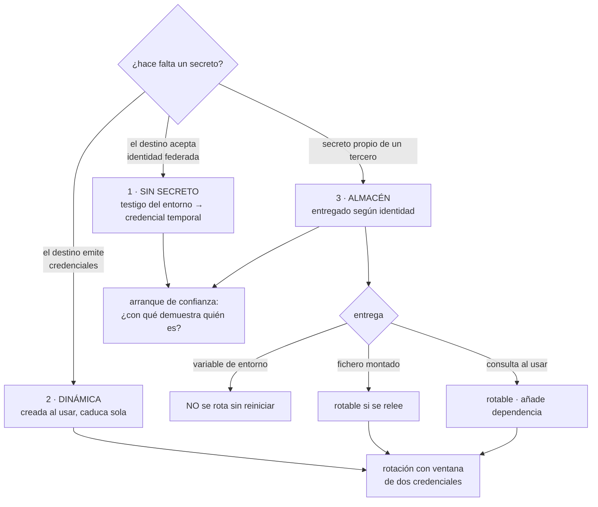

# 137 — Gestión de secretos y credenciales de workloads

> [← 136 · Cifrado, KMS, HSM, rotación y envelope encryption](../../part-11-security-governance-finops/136-cifrado-kms-hsm-rotacion-y-envelope-encryption/README.md) · [Índice de la parte](../README.md) · [138 · Vulnerabilidades, imágenes y cadena de suministro →](../../part-11-security-governance-finops/138-vulnerabilidades-imagenes-y-cadena-de-suministro/README.md)

**Parte:** 11 — Seguridad, gobierno, cumplimiento y FinOps<br>
**Nivel:** avanzado · **Horas estimadas:** 4<br>
**Laboratorio:** `security` · **Estado:** `EXECUTABLE_CORE`

## 🎯 Propósito

Resolver el problema de las credenciales que las cargas necesitan para todo lo demás. La clase ordena las soluciones por cuánto **eliminan** el problema en vez de por cuánto lo gestionan, y defiende que casi todo el mundo empieza por la tercera —comprar un almacén— cuando las dos primeras hacen desaparecer categorías enteras de riesgo. Y se detiene en el detalle que explica por qué sobreviven las credenciales eternas: **una variable de entorno no se puede rotar sin reiniciar**, así que rotar se vuelve una operación disruptiva y se deja de hacer.

## 📚 Resultados de aprendizaje

Al finalizar podrás:

1. **Ordenar** las opciones por cuánto eliminan el problema, no por cuánto lo administran.
2. **Sustituir** credenciales estáticas por identidad federada donde sea posible.
3. **Elegir** el mecanismo de entrega sabiendo cuál permite rotar en caliente.
4. **Rotar** sin provocar cortes, con el patrón de dos credenciales válidas.
5. **Reducir** el rastro por el que un secreto acaba en sitios donde no debería.

## 🧩 Conceptos centrales

| Concepto | Comprensión verificable |
|---|---|
| `identidad federada de carga` | La carga demuestra quién es con un testigo emitido por su entorno y obtiene credenciales temporales. No hay secreto que guardar. |
| `credencial dinámica` | Credencial creada bajo demanda para un uso concreto, con caducidad corta. Al expirar, deja de existir. |
| `almacén de secretos` | Servicio que guarda, versiona, audita y entrega secretos según la identidad que los pide. |
| `entrega en caliente` | Que la carga pueda recibir un valor nuevo sin reiniciarse. Es lo que hace posible rotar de verdad. |
| `ventana de dos credenciales` | Periodo en el que la antigua y la nueva son válidas a la vez. Es lo que permite rotar sin cortes. |
| `arranque de confianza` | Cómo demuestra la carga quién es la primera vez. Si requiere un secreto previo, el problema solo se ha desplazado. |

## 🧠 Modelo mental

Gobernar no significa aprobar cada cambio: significa codificar límites, evidencia y responsabilidades para que los equipos puedan avanzar con seguridad.

Aplicado a esta clase, separa siempre cuatro planos: **intención** (qué necesita el usuario),
**configuración** (qué declaramos), **estado observado** (qué existe de verdad) y
**evidencia** (cómo sabemos que cumple). Confundirlos produce diseños que se ven correctos
en un diagrama pero fallan al operar.

## 🗺️ Flujo de razonamiento



## 📖 Desarrollo

### 1. Ordenar por lo que elimina

La escala, de la que hace desaparecer el problema a la que solo lo administra:

```text
1. NO HAY SECRETO
   la carga demuestra quién es con un testigo emitido por su entorno
   y recibe credenciales temporales del destino
   → no hay nada que guardar, rotar ni filtrar
   → clases 054 y 098

2. CREDENCIAL DINÁMICA
   el destino crea una credencial para este uso, con caducidad corta
   → una credencial de base de datos válida 15 minutos, distinta
     en cada arranque
   → si se filtra, caduca sola

3. ALMACÉN DE SECRETOS
   el valor existe y se guarda en un servicio que lo entrega
   según la identidad que lo pide, con auditoría y versiones
   → necesario para terceros que solo tienen claves estáticas

4. CIFRADO EN EL REPOSITORIO
   funciona, y el valor está en un sitio del que no se puede purgar
   → ley 11

5. EN UNA VARIABLE O UN FICHERO DE CONFIGURACIÓN
   → es donde estamos casi siempre al empezar
```

Y la observación que ordena el trabajo: **casi todo el mundo salta al tercero**, porque es el que se puede comprar, cuando los dos primeros eliminan categorías enteras de riesgo.

```text
con almacén        el secreto existe, se puede filtrar, hay que rotarlo,
                   y quien comprometa la carga lo lee
con federación     no hay secreto; comprometer la carga da acceso
                   MIENTRAS dure, y nada que llevarse
```

Y el criterio para decidir por dónde va cada caso:

```text
¿el destino acepta identidad federada?        → opción 1
¿el destino puede emitir credenciales?        → opción 2
¿es un tercero con clave estática y punto?    → opción 3
```

Y la tercera es donde acaba lo que no se puede cambiar: proveedores de pago, mensajería, servicios antiguos. **Es una minoría de los casos y suele ocupar toda la atención.**

**El arranque de confianza**, que es la pregunta que descubre si el problema se ha resuelto o solo movido:

```text
¿con qué demuestra la carga quién es la PRIMERA vez?

  con un testigo que le da su entorno de ejecución    → resuelto
  con un certificado emitido por la plataforma        → resuelto
  con una clave guardada en su imagen o su
    configuración                                     → NO resuelto:
                                                        hay un secreto
                                                        eterno en algún sitio
```

Y conviene decirlo en voz alta cuando ocurre, en vez de presentar como resuelto un problema que se ha desplazado un escalón.

### 2. Cómo llega el valor, y por qué eso decide la rotación

Los mecanismos de entrega, con la propiedad que decide todo:

```text
VARIABLE DE ENTORNO
  + trivial, funciona en todas partes
  − visible en el listado de procesos, en volcados de memoria,
    y la heredan los procesos hijos
  − NO SE PUEDE CAMBIAR sin reiniciar el proceso

FICHERO MONTADO
  + el contenido puede actualizarse sin reiniciar
  − hay que releerlo: si la aplicación lo lee una vez al arrancar,
    es lo mismo que una variable

CONSULTA AL ALMACÉN EN EL MOMENTO DE USARLO
  + siempre el valor vigente; rotación inmediata
  − añade una dependencia en el camino de la petición
  − se resuelve con caché corta, y entonces la rotación tarda ese caché

AGENTE O ACOMPAÑANTE
  obtiene y renueva por su cuenta y lo deja disponible
  + la aplicación no habla con el almacén
  − una pieza más que operar
```

Y la línea que explica el estado del mundo:

```text
si el secreto llega por variable de entorno, rotar exige reiniciar
→ rotar pasa a ser una operación con riesgo
→ y por eso hay credenciales de hace cuatro años
```

Es la ley 16 otra vez: **un control que exige una parada acaba no ejecutándose**.

Y dos precauciones sobre lo que se lleva el valor a sitios inesperados:

```text
los procesos hijos heredan el entorno
  → un guion auxiliar, una herramienta de diagnóstico, un depurador
los volcados y los informes de error suelen incluir el entorno
  → y acaban en el sistema de errores, que ve mucha gente
```

Y la comprobación barata: **pedir el entorno de un proceso en producción y ver qué aparece**.

```text
$ tr '\0' '\n' < /proc/1/environ | grep -Ei 'key|secret|token|password'
```

Si ahí hay algo, ese algo está también en cualquier volcado que se genere.

### 3. Rotar sin cortar

Rotar significa que el valor antiguo deja de ser válido. Y si el antiguo deja de valer **antes** de que todo el mundo use el nuevo, hay un corte.

El patrón que lo resuelve son dos credenciales válidas a la vez:

```text
1. crear la credencial NUEVA; ahora valen las dos
2. actualizar el almacén con la nueva
3. esperar a que todas las cargas la hayan tomado
   → y comprobarlo, no suponerlo
4. deshabilitar la antigua
5. comprobar que nada falla
6. borrarla
```

Y el paso 3 exige poder observar quién sigue usando la antigua:

```text
si el destino registra qué credencial se usó → mirar ahí
si no → esperar más que el mayor caché o ciclo de vida conocido
```

Y los dos errores clásicos:

```text
rotar y confiar en que todo se reiniciará    → falla lo que no reinició
deshabilitar la antigua a la vez que se
  publica la nueva                            → corte garantizado
```

Y la rotación automática solo funciona si la carga **relee**:

```text
rotación automática cada 30 días
+ la aplicación lee el valor al arrancar y nunca más
= una caída programada cada 30 días
```

Y hay que decirlo con claridad porque ocurre a menudo: **activar la rotación automática sin comprobar la relectura es programar un incidente**.

**Las credenciales dinámicas** eliminan casi todo lo anterior donde se pueden usar:

```text
la carga pide acceso a la base
el almacén crea un usuario con permisos concretos y 1 hora de vida
la carga lo usa
al caducar, el usuario se elimina
```

Y lo que se gana:

```text
nada que rotar: todo caduca solo
un secreto filtrado sirve una hora
se sabe qué carga hizo qué, porque cada una tiene su usuario
```

Y lo que hay que vigilar: **las credenciales huérfanas** si la limpieza falla, que es la ley 13 aplicada aquí, y el efecto sobre el agrupador de conexiones de la clase 109, porque cambiar de usuario obliga a rehacer conexiones.

### 4. El rastro, y qué hacer cuando se filtra

La clase 092 enumeró seis sitios por los que un secreto se escapa. Con lo aprendido desde entonces, la lista es más larga:

```text
repositorio e historial                         clase 101
registros de la canalización                    clase 098
artefactos publicados, incluidos ficheros de plan
estado de infraestructura                       clase 087
salidas de módulos
variables de entorno y volcados
registros de la aplicación                      clase 122
informes de error y trazas de pila
telemetría, si se serializan objetos
herramientas de soporte que muestran contexto
capturas de pantalla y mensajes en chats
copias de seguridad de todo lo anterior
```

Y los controles que cubren esa lista ya están repartidos por el programa:

```text
protección en el envío del repositorio          clase 101
lista de permitidos en el registro              clase 122
depuración en el recolector de telemetría       clase 124
escáner diario sobre muestras                   clase 122
y el que falta: comprobar qué muestran las herramientas internas
```

Y el procedimiento cuando se filtra, que este programa ha repetido y no cambia:

```text
1. ROTAR         estuvo expuesto, punto
2. CORREGIR      el mecanismo que lo dejó salir
3. PURGAR        donde se pueda; sabiendo que no será en todos los sitios
4. REVISAR       qué se hizo con esa credencial mientras estuvo expuesta
```

El cuarto se olvida y es el que dice si hubo daño: **con auditoría de uso por credencial se puede responder; sin ella, no**.

Y la medida honesta del programa de secretos, que es una sola:

```text
tiempo desde que se filtra hasta que deja de ser válida
```

Y lo que la reduce, por orden:

```text
no tener secretos                       tiempo = 0
credenciales de una hora                tiempo ≤ 1 h
rotación automática que funciona        horas
rotación manual con procedimiento       días
rotación manual sin procedimiento       nunca
```

Y la lista de comprobación de la clase:

```text
☐ existe inventario de todos los secretos y de quién los usa
☐ cada uno está clasificado en la escala, y hay plan para subirlo
☐ lo que acepta identidad federada no tiene secreto
☐ las bases de datos usan credenciales dinámicas donde se puede
☐ el arranque de confianza no depende de un secreto eterno
☐ ningún secreto llega por variable de entorno si hay que rotarlo
☐ la aplicación relee el valor sin reiniciar, y está comprobado
☐ la rotación usa ventana de dos credenciales, y se verifica el paso 3
☐ hay auditoría de uso por credencial
☐ el rastro está cubierto en repositorio, registros, telemetría y soporte
☐ se mide el tiempo desde filtración hasta invalidación
☐ el procedimiento de filtración empieza por rotar y termina por revisar uso
```

Y el cierre que enlaza con la clase siguiente: las credenciales son una de las dos vías por las que entra un atacante. La otra es el código y sus dependencias, y el trabajo de mantenerlo sin vulnerabilidades conocidas —con la escala real que eso tiene— es la materia de la clase 138.

## 🔬 Ejemplo trabajado

**CloudShop tiene un almacén de secretos desde hace dos años y sigue teniendo credenciales de 2023. El ejercicio empieza por el inventario y termina descubriendo por qué el almacén no había resuelto el problema.**

**El inventario.**

```text
secretos en el almacén                                    118
secretos fuera del almacén, encontrados                    41
  en variables de configuración de despliegue              22
  en ficheros de configuración de imágenes                 11
  en el estado de infraestructura                           5
  en un documento compartido                                3

edad de la credencial más antigua                    4,1 años
secretos rotados alguna vez                            9 de 159
secretos con dueño identificado                       61 de 159
```

Nueve de ciento cincuenta y nueve rotados alguna vez. **El almacén existía y no había cambiado nada**, y la razón estaba en el mecanismo de entrega:

```text
entrega por variable de entorno                       141 de 159
→ rotar exigía reiniciar
→ reiniciar en producción se percibía como riesgo
→ nadie rotaba
```

**La clasificación en la escala.**

```text                                        cuántos    destino
destino acepta identidad federada                 88     opción 1: sin secreto
destino puede emitir credenciales dinámicas       34     opción 2
tercero con clave estática                        29     opción 3: almacén
sin clasificar / obsoletos                         8     borrar
```

**Ochenta y ocho de ciento cincuenta y nueve no necesitaban existir.**

**Fase 1: eliminar los 88.**

```text                                          antes         después
credenciales estáticas hacia servicios
del proveedor                                    88              0
mecanismo                              clave de larga     testigo del entorno
                                       duración           → credencial de 1 h
tiempo desde filtración hasta invalidación   indefinido       ≤ 1 h
rotaciones necesarias                            88              0
```

Y el arranque de confianza se revisó explícitamente:

```text
¿con qué demuestra la carga quién es?
  en el clúster        con el testigo de su cuenta de servicio
  en la canalización   con el testigo del flujo                clase 098
  en las funciones     con la identidad asignada por la plataforma
→ ningún secreto eterno en el arranque
```

**Fase 2: credenciales dinámicas para bases de datos.**

```text                                          antes         después
usuarios de base de datos                    6 fijos      1 por carga y arranque
vida de la credencial                     indefinida            1 h
secretos que rotar                              6                0
quién hizo qué en la base                 no se sabía   cada carga, por usuario
```

Y el efecto colateral que hubo que resolver, y que la clase 109 anticipaba:

```text
al renovar la credencial, el agrupador tenía que rehacer conexiones
primera versión: rehacía las 24 de golpe cada hora
  → picos de latencia de 400 ms cada 60 minutos
corrección: renovación escalonada, y solapamiento de 10 min
  → pico eliminado
```

Y las credenciales huérfanas, que son la ley 13 aquí:

```text
usuarios creados y no eliminados, tras 3 meses                    412
causa            fallos de limpieza cuando la carga moría de golpe
corrección       caducidad en la propia base, no solo en el almacén
                 + barrido diario
usuarios huérfanos después                                        0-3
```

**Fase 3: los 29 que no se pueden eliminar.**

Aquí sí hacía falta el almacén, y hubo que cambiar la entrega:

```text                                          antes         después
entrega                              variable de entorno   fichero montado,
                                                           releído al cambiar
rotación                                     manual         automática, 30 días
reinicio necesario                              sí              no
```

Y la primera rotación automática **provocó una caída**, exactamente como advierte el apartado tercero:

```text
02:00  rotación automática del secreto del proveedor de mensajería
02:00  el fichero se actualizó
02:00  la aplicación no lo releía: lo cargaba al arrancar
02:01  fallos en el 100 % de los envíos
02:40  detectado y mitigado reiniciando
```

```text                                          antes         después
la aplicación relee el valor                    no              sí
comprobado con una prueba                       no        sí, en la canalización
ventana de dos credenciales                     no          sí, 24 h
verificación del paso 3                         no        registro de uso
                                                          por versión
caídas por rotación                        1 de 1 rotación     0 de 14
```

Y la verificación del paso 3 fue lo que dio confianza: **el destino registraba qué versión de la credencial se usaba**, así que deshabilitar la antigua dejó de ser un acto de fe.

**El rastro, revisado con el escáner de la clase 122.**

```text
hallazgos en la primera semana
  secretos en variables de entorno visibles en volcados            18
  un secreto en el estado de infraestructura                        5
  claves en informes de error con el entorno adjunto                 3
  una clave visible en la herramienta interna de soporte             1
  secretos en capturas pegadas en el chat del equipo                 2
```

El de la herramienta de soporte era el peor: **mostraba la configuración completa de un cliente, incluidas sus claves de integración**, y lo veían once personas de atención al cliente.

```text                                          antes         después
herramienta de soporte                muestra configuración   campos sensibles
                                      completa                ocultos
escáner sobre volcados e informes            no                 sí, diario
hallazgos residuales                          —              0-1 / mes
```

**La medida del programa.**

```text                                          antes         después
tiempo desde filtración hasta invalidación
  para el 88 %                             indefinido         0 (no existen)
  para el 21 %                             indefinido         ≤ 1 h
  para el 18 % restante                    días o nunca       24 h
secretos totales                               159              29
con dueño identificado                      61 de 159        29 de 29
rotados en el último año                     9 de 159        29 de 29
edad del más antiguo                        4,1 años         30 días
```

**A los seis meses.**

```text                                          antes         después
secretos existentes                            159              29
fuera del almacén                               41               0
entregados por variable de entorno             141               0
rotados alguna vez                               9              29
credenciales dinámicas de base de datos          0              34
usuarios huérfanos en base de datos              —             0-3
caídas por rotación                              1               0
secretos visibles en herramientas internas       1               0
tiempo desde filtración hasta invalidación  indefinido     ≤ 1 h (o 0)
```

**La lección que esta clase traslada a la parte 11**: el almacén de secretos llevaba dos años instalado y el número de credenciales sin rotar era el mismo que antes de comprarlo. La causa no era la herramienta: era que **entregarlas por variable de entorno hacía que rotar exigiera reiniciar**, y eso convirtió una tarea rutinaria en una operación con riesgo que nadie hacía. Y la mayor reducción del riesgo no la produjo ninguna función del almacén: la produjo **descubrir que el 55 % de los secretos no tenía por qué existir**.

## 🧪 Laboratorio guiado

Ejecuta desde la raíz:

```bash
python classes/part-11-security-governance-finops/137-gestion-de-secretos-y-credenciales-de-workloads/lab.py
```

El laboratorio selecciona el motor de práctica **`security`** y produce
`lab_result.json`. El escenario, sus comprobaciones y el artefacto esperado corresponden a
esta clase; no requiere credenciales y deja explícito qué debe revalidarse en un sandbox real.

1. Lee `exercise.steps` y formula una predicción antes de ejecutar.
2. Ejecuta la práctica y verifica todos los elementos de `checks`.
3. Provoca el caso de `negative_test` y explica la señal observada.
4. Materializa `ciclo-secretos` en `evidence/` usando la plantilla indicada.
5. Para proveedor real, sigue `sandbox.requires`, registra costo y ejecuta `destroy`.

### Evidencia esperada

El artefacto principal es un control con amenaza, mitigación y evidencia. Además, la entrega debe incluir el comando ejecutado,
la salida estructurada y una conclusión que no exceda lo observado.

## 🏆 Reto verificable

Construye **`ciclo-secretos`** para el caso CloudShop. Incluye una alternativa descartada,
un supuesto que pueda falsarse, una prueba de fallo y una decisión de rollback.

## ✅ Criterio de aceptación

- [ ] `lab.py` termina con código 0 y genera JSON válido.
- [ ] La entrega conecta al menos tres requisitos con mecanismos verificables.
- [ ] Existe una prueba positiva y una prueba negativa con evidencia.
- [ ] Seguridad, costo y operación aparecen como decisiones, no como anexos.
- [ ] Se declara una limitación y una condición que obligaría a revisar el diseño.
- [ ] Otra persona puede repetir el recorrido sin conocimiento tácito.

## ⚠️ Errores frecuentes

| Síntoma | Causa probable | Corrección |
|---|---|---|
| Hay un almacén de secretos y las credenciales siguen sin rotarse | Se entregan por variable de entorno, así que rotar exige reiniciar | Entrega por fichero releído o por consulta al usar, y comprueba con una prueba que la aplicación toma el valor nuevo sin reiniciar. |
| La rotación automática provoca una caída | La aplicación lee el valor al arrancar y nunca más | Verifica la relectura antes de activar la rotación y usa ventana con las dos credenciales válidas. |
| Se gestionan con mucho esfuerzo secretos que no deberían existir | Se saltó a comprar un almacén sin clasificar antes qué destinos aceptan identidad federada o credenciales dinámicas | Clasifica el inventario en la escala y elimina primero todo lo que pueda subir a las dos primeras opciones. |
| Un secreto aparece en volcados, informes de error o herramientas de soporte | Está en el entorno del proceso y las herramientas muestran configuración completa | Sácalo del entorno, oculta campos sensibles en las herramientas internas y ejecuta un escáner diario sobre muestras. |
| La base de datos acumula usuarios que ya no usa nadie | Las credenciales dinámicas no se limpian cuando la carga muere de golpe | Pon caducidad en la propia base además del almacén y añade un barrido diario. |
| Se dice que no hay secretos y hay uno en el arranque | La carga necesita una clave previa para autenticarse ante el almacén | Usa el testigo que emite el entorno de ejecución; si no es posible, dilo explícitamente en vez de presentarlo como resuelto. |

## 🛡️ Seguridad, ética y costo

Trabaja con cuentas propias o sandboxes autorizados. No publiques secretos, identificadores
reales ni datos personales. Antes de crear recursos pagos define presupuesto, etiquetas y
comando de destrucción; después verifica que no queden recursos huérfanos. Los ejemplos
locales enseñan contratos, pero no certifican cumplimiento ni disponibilidad de producción.

## ❓ Preguntas de comprobación

1. ¿Qué ordena la escala de opciones y por qué empezar por comprar un almacén no es lo mejor?
2. ¿Por qué una variable de entorno impide rotar y qué consecuencia tiene?
3. ¿Qué pasos tiene una rotación con ventana de dos credenciales y cuál se verifica peor?
4. ¿Qué elimina una credencial dinámica y qué problema nuevo introduce?
5. ¿Cuál es la medida honesta de un programa de secretos?

## 🔗 Referencias

- HashiCorp Vault (2025). *Dynamic secrets and database secrets engine* — credenciales creadas al usar, con caducidad. <https://developer.hashicorp.com/vault/docs/secrets/databases>
- AWS (2025). *Secrets Manager rotation strategies* — ventana de dos credenciales y verificación. <https://docs.aws.amazon.com/secretsmanager/latest/userguide/rotating-secrets.html>
- Kubernetes (2025). *Secrets: risks and mounted volumes* — entrega por fichero frente a variable de entorno. <https://kubernetes.io/docs/concepts/configuration/secret/>
- SPIFFE (2025). *Workload identity and the bootstrap problem* — cómo demuestra una carga quién es sin un secreto previo. <https://spiffe.io/docs/latest/spiffe-about/overview/>
- OWASP (2025). *Secrets management cheat sheet* — inventario, entrega, rotación y respuesta a filtraciones. <https://cheatsheetseries.owasp.org/cheatsheets/Secrets_Management_Cheat_Sheet.html>
- Documentación oficial vigente del servicio implementado; registra URL y fecha de consulta.

---

> [Evaluación](assessment.md) · [Contrato de clase](lesson.yaml) · [Índice de la parte](../README.md)

**📥 Descargar:** [Parte 11 en PDF](../../../site/downloads/partes/manual-parte-11-security-governance-finops.pdf) · [Manual integral](../../../site/downloads/multi-cloud-engineering-manual-v2.0.pdf)

| Anterior | Índice | Siguiente |
|---|---|---|
| [← 136 · Cifrado, KMS, HSM, rotación y envelope encryption](../../part-11-security-governance-finops/136-cifrado-kms-hsm-rotacion-y-envelope-encryption/README.md) | [Parte 11](../README.md) · [Programa](../../README.md) | [138 · Vulnerabilidades, imágenes y cadena de suministro →](../../part-11-security-governance-finops/138-vulnerabilidades-imagenes-y-cadena-de-suministro/README.md) |
